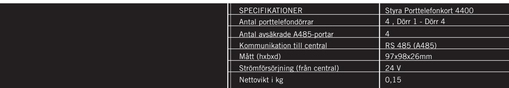
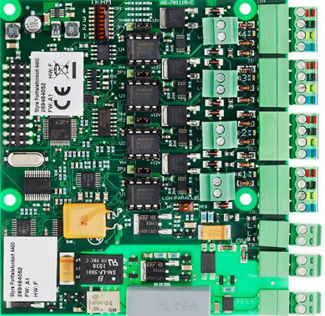
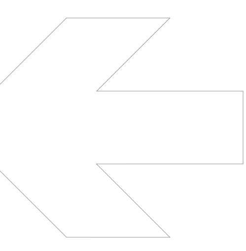

**art.nr.**

Styra Porttelefonkort 4400

90-420-30

## **Styra Porttelefonkort 4400**

**Tillbehörskort för montage i Styra 3000** 

## **EGENSKAPER OCH FÖRDELAR**

- Stödjer fyra porttelefondörrar med Ringa.
- Anslutning till svarsapparatsslinga, t.ex. AT 21, avsäkrad.
- Anslutning till publika telenätet.
- Detekterar polvändning.
- Möjligt att parallellkoppla två Styra 3000 till samma svarsap paratsslinga.
- Fyra avsäkrade A485-portar.
- Kortslutning på en A485-port påverkar inte övriga portar.
- Spara in på behovet av separat avsäkring.
- Underlätta kabeldragningen,
- lägg en Aptuskabel 2 till varje dörrmiljö.
- Anslut läsare, porttelefon o.dyl. direkt eller via dörrenhet.
- Erbjuder möjlighet att knyta resurser automatiskt till rätt dörr vid programmering från Multiaccess Styra.
- Utnyttja möjligheten till central styrning av spänningsmatnin gen på A485-port. Praktiskt t.ex. vid service.
- Erbjuder möjlighet att mata ut 12V eller 24V på A485-porten. **Obs!** Kontrollera först att ansluten hårdvara klarar 24V.
- Max ett Styra Porttelefonkortt 4400 per central.
- Komplettera med Styra Porttelefonkort 4800 för upp till åtta porttelefonidörrar i Styra 3000

| Amp           | Strömförsörjning V DC                               | Styra Porttelefonkort 4400   |
|---------------|-----------------------------------------------------|------------------------------|
|               |                                                     | 24                           |
|               | Förbrukning Watt                                    | min 0,36 max 0,60 vid 24 V   |
|               |                                                     | min 0,015 max 0,025 vid 24 V |
|               | OMGIVNING                                           |                              |
|               | Temperatur 0C                                       | 0 till +40                   |
|               | Luftfuktighet %                                     | 10 till 90                   |
| DATA          |                                                     |                              |
|               | Antal porttelefondörrar                             | 4 (dörr 1 - dörr 4)          |
|               | Antal A485-portar                                   | 4                            |
|               | Omkopplingsbar utspänning 12 / 24 V per port        | Ja                           |
|               | Utspänning avsäkrad per A485-port                   | 2,5 A (12 V / 24 V)          |
|               | Maximalt strömuttag för hela centralen              | 10 A                         |
|               | Automatisk återställning av säkring                 | Ja                           |
|               | Central styrning av spänning per port (Till / Från) | Ja                           |
|               | Lysdioder för att indikera kommunikationsstatus     | Ja                           |
|               | Lysdioder för att indikera säkringsstatus           | Ja                           |
|               | Utlöst säkring loggas till Multiaccess Styra        | Ja                           |
|               | Avsäkrad svarsapparatslinga                         | 2,5A (24 V)                  |
|               | Antal svarsapparater som kan matas internt          | 130                          |
|               | Totalt antal svarsapparater till Styra 3000         | 600                          |
|               | KOMMUNIKATION Kommunikation till Styra 3000      | RS 485 (A485)                |
|               | PORTTELEFONI                                        |                              |
|               | RINGA 1307                                          | Ja, (från Ringa FW C0)       |
|               | RINGA 1507                                          | Ja                           |
|               | RINGA 1707                                          | Ja, (från Ringa FW C0)       |
| AT20          |                                                     | Ja                           |
| AT21          |                                                     | Ja                           |
|               | AT10, AT30, AT70                                    | Nej                          |
|               |                                                     |                              |
|               |                                                     |                              |
|               |                                                     |                              |
|               | MÅTT I MM                                           |                              |
| Höjd          |                                                     | 97                           |
| Bredd Djup |                                                     | 98 26                     |

## **www.aptus.se**

Aptus Elektronik AB . Ekonomivägen 3-5, 436 33 Askim . telefon **växel:** 031 68 97 00 **försäljning:** 031 68 97 10 **fax:** 031 68 97 99 aptus@aptus.se . www.aptus.se