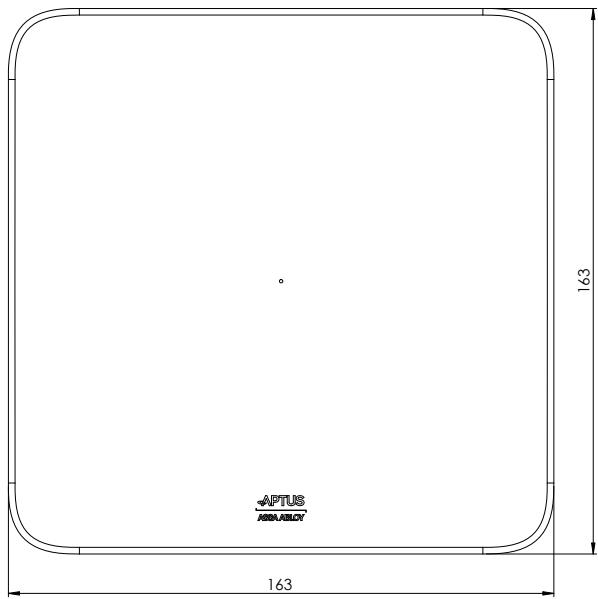
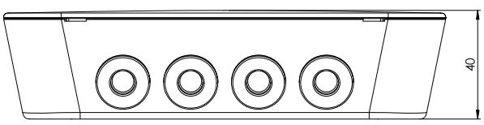
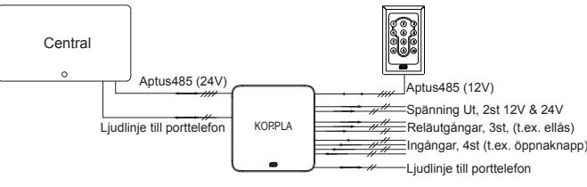
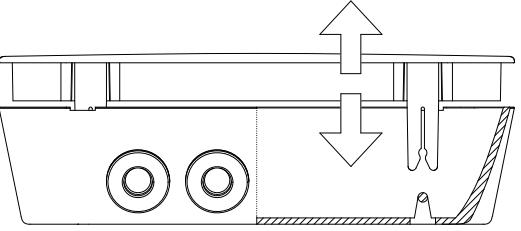
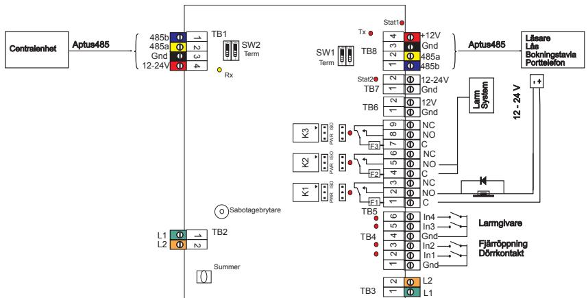
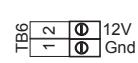

Aptus Elektronik AB • Ekonomivägen 3-5, 463 33 Askim • www.aptus.se telefon **växel:** 031 68 97 00 • **fax:** +46 31 68 97 99 **support:** support@aptus.se

# **Koppla 4300**

**Revision 4**

# **INSTALLATION 2**4

#### **ALLMÄNT**

Koppla 4300 är en dörrenhet avsedd att användas tillsammans med Styra 3000. Den är försedd med in och utgångar för att styra dörren samt en kommunikationsport där t.ex. läsare eller porttelefon kan anslutas.

#### **TEKNISKA DATA**

|           | Strömförsörjning: 12 / 24 V DC reglerad (12,0 - 27,6). |  |  |  |  |
|-----------|--------------------------------------------------------|--|--|--|--|
|           | Max 210mA Min 20mA vid 24V                             |  |  |  |  |
|           | Max 130mA Min 25mA vid 12V                          |  |  |  |  |
|           | Matning från centralenheten.                           |  |  |  |  |
| Ingångar: | 4, balanserad slinga. BS, eller kontakter med          |  |  |  |  |
|           | potentialfri slutning/brytning kan anslutas.           |  |  |  |  |
|           | Pulsmätning enligt S0 stöds.                           |  |  |  |  |
|           | Skydd: Varistor 22V, serieresistans 10KOhm.            |  |  |  |  |
|           | Statusindikering via lysdiod.                          |  |  |  |  |
| Utgångar: | 3, reläutgång med växlande kontakt för att möjlig      |  |  |  |  |
|           | göra inkoppling av slutande eller brytande funk        |  |  |  |  |
|           | tion. Ställ in PWR/ISO beroende på om centralens       |  |  |  |  |
|           | spänning skall levereras ut eller om endast potenti    |  |  |  |  |
|           | alfri slutning/brytning skall användas.                |  |  |  |  |
|           | Kontaktdata relä: 28V, 1A.                             |  |  |  |  |
|           | Skydd: Termisk säkring 1A (PTC).                       |  |  |  |  |
|           | Statusindikering via lysdiod.                          |  |  |  |  |

|           | Avsäkrad           | 1, med repeater och säkring.                                               |  |  |
|-----------|--------------------|----------------------------------------------------------------------------|--|--|
|           | Aptus485-buss      | Skydd: Elektronisk säkring 1,75A                                           |  |  |
|           |                    | (delas med 12V ut)                                                         |  |  |
|           |                    | Statusindikering via lysdiod.                                              |  |  |
|           | Avsäkrad           | Aptus Logga_Silver pantone 877 1, med säkring.                          |  |  |
|           | 12V-matning till   | Skydd: Elektronisk säkring 1,75A                                           |  |  |
|           | extern utrustning. | (delas med A485)                                                           |  |  |
|           | Avsäkrad           | 1, med säkring.                                                            |  |  |
| Scala 1:1 | 24V-matning till   | Skydd: Elektronisk säkring 1,75A.                                          |  |  |
|           | extern utrustning. | Statusindikering via lysdiod.                                              |  |  |
|           | Summer             | 1, valfri funktion, programmeras som utgång.                               |  |  |
|      | Sabotagebrytare    | 1, bestäm i programvaran vad aktiverad sabota gebrytare skall innebära. |  |  |
|           | Miljökrav          | 0 till 40 grader Celcius.                                                  |  |  |
|           |                    | 10 till 100% luftfuktighet.                                                |  |  |
|           | Mått Vikt       | 163x163x40 mm. 0,4 kg.                                                  |  |  |
|           |                    |                                                                            |  |  |

#### **PACKLISTA**

- 1 st Koppla 4300
- 3 st dioder
- 8 st 2,2KOhm motstånd
- 1 st sabotagefjäder
- 1 st Installationsanvisning (denna)

#### **SYSTEMBESKRIVNING**

#### **MONTERING**

Lossa först locket försiktigt från underdelen genom att lyfta det uppåt enligt bilden nedan. Vid behov kan mejseluttagen användas. Ta vara på löst material som ligger inne i kapslingen.

## **3**4

Montera dörrenheten där det är lämpligt, t.ex. ovanför en dörr, kanske uppe i undertaket eller i ett närbeläget apparatrum. Tänk på att placera dörrenheten på rätt sida om dörren, dvs. inne på larmat område.

Fäst dörrenhetens underdel med lämpliga skruvar. Dra in kablaget antingen genom de fyra kabelgenomföringarna i kapslingens nederkant eller genom hålet i underdelens botten. Mantla av kabeln och dra sedan omantlad kabel under kretskortet och för upp den till sina respektive kopplingsplintar.

Innanför kabelintaget

finns öglor för att dra fast inkommande kablage med buntband. Montera den bilagda sabotagefjädern på sabotagebrytaren. Koppla in enligt inkopplingsanvisningen nedan, gör inställningar, programmera, prova av och tryck sedan på locket.

#### **INKOPPLING Centralsida**

Använd partvinnad kabel t.ex. Aptuskabel 1, 2, ELLXB eller ELAQBY för anslutning till centralenhet. Förlägg ett par till 485 (A+B) och det andra paret till spänning(12-24V+GND). Vid porttelefoni ytterligare ett par för Linje(L1+L2). Dubblera vid behov paren för att få rätt kabelarea. Tillse att Aptus485-buss inte överstiger rekommenderat maxavstånd på 200 eller 1100 meter. 1100 meter är möjligt under förutsättning att en korrekt buss med termineringar i ändpunkterna installeras.

Anslut till TB1 och vid behov TB2 enligt tabellen.

|                         | TB1:1                                   | B      |               |  |
|-------------------------|-----------------------------------------|--------|---------------|--|
|                         | TB1:2                                   | A      | Aptus485-buss |  |
|                         | TB1:3                                   | GND    |               |  |
|    | Aptus Logga_Silver pantone 877 TB1:4 | 12/24V |               |  |
|                         | TB2:1                                   | L1     | Linje Styra   |  |
|                         | TB2:2                                   | L2     |               |  |
|                      |                                         |        |               |  |

Eftersom dörrenheten kan matas med både 12V eller 24V är det lämpligt att använda sig av 24V matning från central till dörrenhet. Ställ i så fall om den

**031 68 97 11**

A485-port i centralen som dörrenheten anslutits till. Kontrollera först att det inte finns några andra enheter på bussen som endast klarar 12V. **Scala 1:1 Kontaktperson Marianne Hauger**

#### **Dörrsida**

Anslut dörrsidans A485-port med partvinnad kabel, t.ex. Aptuskabel till läsare, porttelefon osv. Vid porttelefoni krävs ett extra par för

| TB8:1 | B               |               |
|-------|-----------------|---------------|
| TB8:2 | A               | Aptus485-buss |
| TB8:3 | GND             |               |
| TB8:4 | 12V (Nom. 13,5) |               |
| TB3:1 | L1              | Linje Ringa   |
| TB3:2 | L2              |               |

ljudlinjen. Anslut till TB8 och vid behov TB3 enligt tabell. Observera att utgående Aptus485-buss alltid ligger på 12V även om inkommande spänning ligger på 24V.

#### **Utgångar**

Anslut det som skall styras till

någon av de tre utgångarna på TB5. Om t.ex. utgång 1 skall användas skall anslutning ske till TB5:1-3. Om slutande funktion önskas, anslut mellan TB5:1,2 och för brytande funktion gäller TB5:1,3. Vanlig installationskabel kan användas, t.ex. ELLXB, men partvinning är inget krav.

K1 > TB5:1-3 K1 PWR ISO

JP2

JP1

F1

TB4

2 1 3

3 2 1

TB5

C NO NC

Ut1

#### **Ingångar**

Anslut givare och knappar till någon av

de fyra ingångarna på TB4. Om In1 skall användas sker inkoppling mellan TB4:1,2. Vanlig installationskabel kan användas.

#### **12-24V ut**

Anslut andra enheter som skall få sin TB7 2 1 Gnd

Gnd In1 In2

12-24V Stat2

spänningsmatning via dörrenheten till TB7. Detta är samma spänning som dörrenheten matas med på TB1.

Spänningsutgången är dock försedd med en säkring på 1,75A och en lysdiod som visar säkringsstatus.

### **4**4

#### **12V ut**

Anslut andra enheter som skall få sin 12V-matning via dörrenheten till TB6. Detta är samma spänning som matas ut

på A485-porten, TB8:3-4, och ligger på 12V (Nominellt 13,5) även då dörrenheten matas med 24V.

#### **INSTÄLLNINGAR**

Inställning av reläets funktion, spänningsutmatning eller isolerad , PWR/ISO, görs med byglarna JP1 - JP6. Dom skall flyttas parvis: JP1 och JP2 gäller således för utgång 1.

#### **Switchar för terminering**

| SW1:1-2 On, On | Port för dörrsida terminerad.    |
|----------------|----------------------------------|
| SW2:1-2 On, On | Port för centralsida terminerad. |

Terminera port endast om den befinner sig i ändpunkt av sin Aptus485-buss.

#### **LYSDIODER**

Dörrenheten är försedd med lysdioder för att indikera ingångar, utgångar, säkringar och kommunikation.

| D15 - D18 | In1 - In4                                                                       | Släckt: Normal (Öppen) Blinkar: Linjefel Tänd: Larm (Sluten) |
|-----------|---------------------------------------------------------------------------------|--------------------------------------------------------------------|
| D12 - D14 | Ut1 - Ut3                                                                       | Släkt: Relä inaktivt Tänd: Relä draget                          |
| D7        | Stat1, Säkring för A485-port och 12V ut, (TB8, TB6)                          | Släckt: Normal Tänd: Säkring utlöst                             |
| D8        | Stat2, Säkring för 24V ut, (TB7)                                             | Släckt: Normal Tänd: Säkring utlöst                             |
| D9        | Rx, data från anslutna enhe ter och även dörrenhet skick as till central. | Blinkar gult                                                       |
| D10       | Tx, data skickas från central till anslutna enheter och även dörrenheten  | Blinkar rött                                                       |

#### **SUMMER**

Koppla 4300 är utrustad med intern summerfunktion. Funktionen på denna programmeras via Multiaccess Styra på samma sätt som en utgång.

#### **SABOTAGE**

Sabotagebrytaren aktiveras när locket på kapslingen lyfts av. Status på brytare tas in till central och Multiaccess Styra för behandling. Programmeras som en ingång. Obs! Sabotagefjädern måste vara monterad.

#### **SYSTEMKRAV**

Multiaccess Styra från version 8.0. Styra 3000 från version C0.

#### **PROGRAMMERING**

När Koppla 4300 är inkopplad kan du få in den i Multiaccess Styra genom att hämta hårdvara. Enheten är av typen IN/UT och under Koppla 4300 kan man se alla dess resurser. När hårdvara är hämtad kan du välja att få in den i databasen antingen genom att välja "Lägg till" eller med "Lägg till och koppla till dörr". Alternativet att koppla till dörr är endast möjligt

**031 68 97 11**

om enheten är kopplad via något av kommunikationskorten, Styra Komkort 4000, Styra Porttelefonkort 4400 eller Styra Porttelefonkort 4800.

#### **UPPGRADERING**

Programvaran kan uppdateras från Multiaccess Styra. När det släpps en ny programvara kommer denna att vara tillgänglig för nedladdning från www.aptus.se.

#### **AVPROVNING**

Kontrollera en extra gång att alla signalledare är rätt inkopplade innan anläggningen spänningssätts. När spänningen slås på skall lysdioder för mottagen och sänd data börja blinka.

Efter att programmering gjorts i Multiaccess Styra skall du gå ut och kontrollera att alla funktioner är som de är tänkta, fungerar ingångarna?, drar utgångarna när de skall osv?

#### **GARANTI**

Aptus Elektronik AB lämnar två års garanti på material och fabrikationsfel på samtliga produkter. Övrigt enligt leveransbestämmelser NL09.

#### **SERVICE**

För service hänvisar APTUS Elektronik AB till ansvarig återförsäljare som utöver egen kompetens har kontinuerlig kontakt med APTUS Elektronik AB.