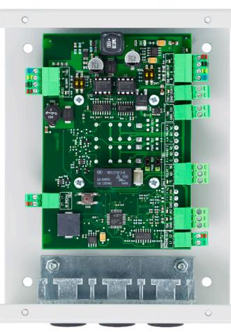

| SPECIFIKATIONER                        |         |
|----------------------------------------|---------|
| Kommunikation till centralenhet        |         |
| Kommunikation till läsare, porttelefon |         |
| Mått (hxbxd)                           |         |
| Strömförsörjning                       | 24V/12V |
| Nettovikt i kg                         | 0,85    |
|                                        |         |

Koppla 2100 RS 485 (A485) RS 485 (A485) 0,85 165x126x39mm

## **Koppla 2100**

**Dörrenhet för passer-, bokning, porttelefoni, larm- och energisystem.** 

## **EGENSKAPER OCH FÖRDELAR**

- Extern anslutning av signaler och styrningar för dörrmiljön.
- Aptuskabel 1 från central till dörrenhet. Vid porttelefoni, använd Aptuskabel 2.
- Tydlig uppdelning i centralsida och dörrsida.
- Två fritt programmerbara ingångar,
- (BS, potentialfri kontakt eller impulsmätning enligt S0).
- En fritt programmerbara reläutgång, (växlande funktion).
- Summer, funktion programmerbar från Multiaccess Styra.
- Sabotagekontakt, loggas till Multiaccess Styra.
- Avsäkrad och skyddad.
- Avsäkrad 12 Volt och 24 Volt till extern utrustning.

| ELEKTRISK ANSLUTNING                            | Koppla 2100                        | E                                                                    |
|-------------------------------------------------|------------------------------------|----------------------------------------------------------------------|
| Strömförsörjning V DC                           | 24 / 12                            | G                                                                    |
| Förbrukning Watt                                | min 0,48 max 7,44 vid 24V          | A                                                                    |
| Amp                                             | min 0,02 max 0,35 vid 24V          | S S                                                               |
| OMGIVNING                                       |                                    | A                                                                    |
| Temperatur 0C                                   | 0 till +40                         | P                                                                    |
| Luftfuktighet %                                 | 10 till 90                         | G                                                                    |
| DATA                                            |                                    | N                                                                    |
| Antal A485-portar                               | 2 (centralsida, dörrsida)          | NI                                                                   |
| A485-repeater, centralsida -> dörrsida          | Ja                                 | K                                                                    |
| Utspänning avsäkrad A485-port dörrsida          | 1,0 A (12V)                        | O                                                                    |
| Automatisk återställning av säkring             | Ja                                 | B                                                                    |
| Lysdioder indikerar kommunikationsstatus        | Ja                                 | N                                                                    |
| Lysdioder indikerar säkringsstatus              | Ja                                 |                                                                      |
| Utlöst säkring loggas till Multiaccess          | Ja                                 | O F                                                               |
| UTGÅNGAR                                        |                                    | E                                                                    |
| Antal utgångar                                  | 1                                  | L                                                                    |
| Kontaktdata relä                                | 28V, 1A                            | E                                                                    |
| Reläfunktion                                    | Växlande                           | T T                                                               |
| Säkring                                         | 1A PTC per relä                    | R                                                                    |
| PWR/ISO                                         | Ställbart per relä                 | O                                                                    |
| Lysdiod vid aktiv utgång                        | Ja                                 | P                                                                    |
| Sekventiell uppstart                            | Ja                                 |                                                                      |
| INGÅNGAR                                        |                                    | 2012-09-04 Vi reserverrar oss för tryckfel och eventuella ändringar. |
| Antal ingångar                                  | 2                                  |                                                                      |
| Potentialfri slutning eller brytning detekteras | Ja                                 |                                                                      |
| Dubbelbalanserade givare kan anslutas           | Ja                                 |                                                                      |
| Konfiguration av omslagsvärden från Multiaccess | Ja                                 |                                                                      |
| Pulsräknarfunktion enligt S0                    | Ja                                 |                                                                      |
| Lysdiod indikerar ingångsstatus                 | Ja                                 |                                                                      |
| EXTERN SPÄNNINGSMATNING                         |                                    |                                                                      |
| 12 V                                            | Ja, delar säkring, 1A, med A485-ut |                                                                      |
| 24 V                                            | Ja, avsäkrad 2A                    |                                                                      |
| KOMMUNIKATION                                   |                                    |                                                                      |
| Kommunikation till Styra 3000                   | RS 485 (A485)                      |                                                                      |
| Kommunikation till t.ex. läsare, låsmotor mm.   | RS 485 (A485)                      |                                                                      |
|                                                 |                                    |                                                                      |
| MÅTT I MM                                       |                                    |                                                                      |
| Höjd                                            | 165                                |                                                                      |
| Bredd                                           | 126                                | Aptus Elektronik AB .                                                |
| Djup                                            | 39                                 |                                                                      |
| Nettovikt i kg                                  | 0,85                               | aptus@aptus.se . www.aptus.se                                     |

## **www.aptus.se**

 Ekonomivägen 3-5, 436 33 Askim . telefon **växel:** 031 68 97 00 **försäljning:** 031 68 97 10 **fax:** 031 68 97 99 www.aptus.se