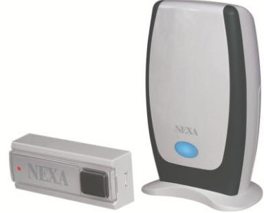

**Produkt namn/typ: MLR-1105 & MLRR-1105 Art: Nr: 18661 MLR-1105 & LMLT-711 EAN: 7330545186611 Art.nr: 18662 MLRR-1105 (endast lös mottagare) EAN: 7330545186628** 

## **Produktbeskrivning:**

Trådlös batteridriven dörrklocka som är kompatibel med samtliga sändare i System Nexa (**Ej MDT-507, Rörelsevakt**). Förutom användningsområdet "dörrklocka", så kan man enkelt skapa ett enkelt bevakningssystem med hjälp av andra sändare i System Nexa.

**Rekommenderad rörelsevakt är LMDT-810 / http://www.nexa.se/LMDT-810-IR-detektor.htm**

- * 5 ringsignaler och 4 ljudnivåer (hög, mellan, låg, avstängd)
- * 4 programmerbara minnen (4.a olika sändare kan användas).
- * Lysdiodsindikator för hörselskadade.
- * Dörrklockan/mottagaren är kompatibel med självlärande kodsändare, till exempel tryckknappsenheten LMLT-711 eller rörelsedetektorn LMDT-609/LMDT-810/MDT-507 och magnetgivaren LMST-606 som larmsystem.
- * Varje sändare kan kopplas till olika ringsignaler hos dörrklockan som dörrsignal eller larmsignal.
- * Användningsavstånd upp till 200 meter (utan hinder).
- * Batterierna (ingår ej) räcker i 2 år (med nya Duracell alkaliska batterier).

## **SPECIFIKATION**

## **MOTTAGARE:**

Frekvens: 433,92 MHzBatteridriven: 4,5 V DC (3 st AA). Batteri ingår ej. Batterilivslängd: 2 år (med nya Duracell alkaliska batterier) Ringsignaler: 5 olika ljud Ljudvolym: Hög – Mellan – Låg – Mute Minnen: 4 koder Mottagningsavstånd: upp till 200 meter (utan hinder) om både sändare och mottagare har tillräcklig batterispänning.

## **SÄNDARE (LMLT-711):**

IP 44-godkänd, väderbeständig. Batteri: CR2032 (ingår)

www.nexa.se