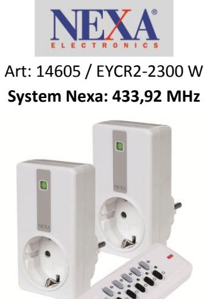

## **Allmänt**

Komplett sats med 2 st mottagare för vägguttag samt 1 st fjärrkontroll, AV – PÅ funktion av belysning, självlärande kodsystem. Max 2300 W / mottagare. Fjärrkontrollen erbjuder styrning av 16 st mottagare individuellt samt gruppstyrning. Låg standby förbrukning – endast 0,2 W/mottagare.

## **Kompatibla Fjärrkontroller**

Samtliga System NEXA fjärrkontroller kan styra EYCR mottagare, både självlärande samt kodvredes mottagare.

**Glödljus**  Ja **Halogen 230 V**  Ja **Halogen 12 V/Elektroniska transformatorer**  Ja **Lågenergilampor** 

Ja, däremot levererar lågenergilampor induktiva laster som över lång tid kan påverka mottagarens reläkontakter negativt, det kan också variera från lampa till lampa, men generellt Ja.

## **Lysrör**

Nej, det är tyvärr inte resistiv last!

## **Led lampor**

Ja, om man har stickproppsansluten transformator och styr på primärsidan. Alternativt LED 230 V GU-10.

**Motorer**  Ja, max 75 W. **Elradiatorer** (Maxlaster -30%) Ja, EYCR-2300 klarar av exempelvis värmeelement, max 1600 W. / Stickpropsansluten.