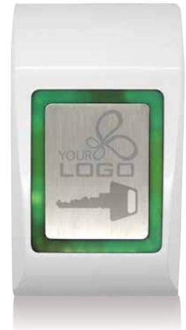
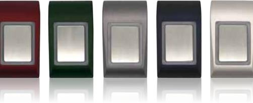
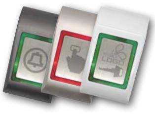

## Öppnaknapp Scoria Touch

*Scoria Touch är en öppnaknapp som fungerar dels som oberoende öppnaknapp (Stand Alone) i direkt samverkan med ett elektriskt lås, eller ansluten till ett passersystems undercentral.*

> Scoria Touch är utformad för ett högfrekvent användande samt hårda och vandalutsatta miljöer. Öppnaknappen aktiveras vid lätt beröring i kombination med användarens statiska elektricitet. Med sin smäckra design i gjuten metall, kombinerar Scoria Touch elegans och estetik med robusthet och tillförlitlighet i en och samma produkt. Öppnaknappens indikeringar kan även styras från passersystemet via en fri ingång.

*Du kan få öppnaknappen med din egen profilering. Med din egen logo eller annat motiv hamnar du i blickfånget och tack vare lasergraveringstekniken får du en bestående produkt med minimal påverkan av slitage.*

## **Funktioner**

Scoria Touch öppnaknapp

- Touch-kontroll
- Valbar puls- eller latchfunktion på relä
- Kan med fördel appliceras i rad olika användningsområden
- Vandalsäker
- Separat anslutning till jord
- Tydlig visuell indikering för låst/olåst
- Tydlig summer indikering vid användande

1

- Fri extern LED styrning

## **Teknisk specifikation**

- Spänningsmatning: 12/24V AC/DC
- Strömförbrukning: Max 65mA
- Utgång växlande relä: 1A 24 DC / 120V AC.
- Ljuskälla (LED): Normal Röd
- Vid aktivering grön LED
- Vilande röd LED
- Omgivningstemperatur: –15° 55°C (inomhusbruk)
- Luftfuktighet: Ej kondenserande upp till 95%
- Dimensioner (mm): L92 x B51 x H25
- Kapsling: Pressgjuten zink
- Touchpanel: Rostfritt stål

| Öppnaknapp Scoria Touch                                                     |          |
|-----------------------------------------------------------------------------|----------|
| Benämning                                                                   | Art. nr  |
| Öppnaknapp med touchfunktion (säljs om 10st)                                | PV1170-X |
| Finns i färgerna Röd = R, Grön = G, Grå = D, Blå = B, Silver = SD, Vit = V. |          |