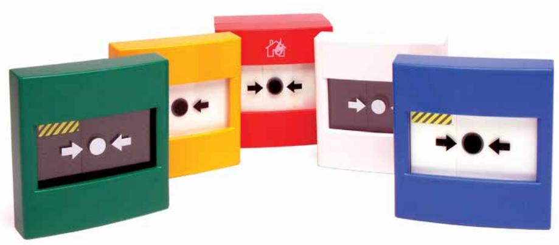

Larmknapp LK-5-X Utanpåliggande larmknapp i oilka färger

**Artikelnummer LK-5-X**

Den återställningsbara Larmknappen är en EN54 Part 11 godkänd manuell larmknapp som är återställningsbar utan att glaset krossas. Larmknappen har 2 fria växlingar.

Larmknappen levereras som standard med symbol "springande gubbe alt. brinnande hus". Övriga symboler och texter levereras efter önskemål.

| Artikelnr. |      |
|------------|------|
| LK-5-R     | Röd  |
| LK-5-GL    | Gul  |
| LK-5-GN    | Grön |
| LK-5-BL    | Blå  |
| LK-5-VT    | Vit  |

| Specifikationer |           |
|-----------------|-----------|
| Spänning        | 12-24V    |
| Maxström        | 3A        |
| Dimension       | 87x87x58  |
| Tempområde      | 20-65 grC |
| IP-Klass        | IP24      |

## **3TComp AB**

Kämpevägen 17 553 02 Jönköping

Tel: 036 - 16 53 60 Fax: 036 - 12 22 80