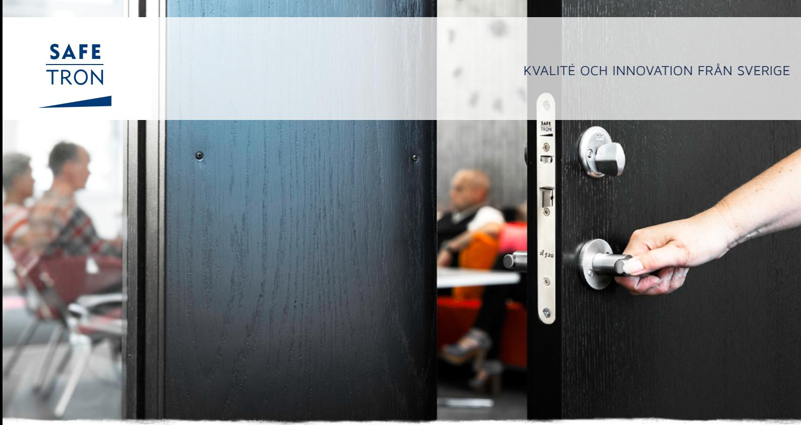
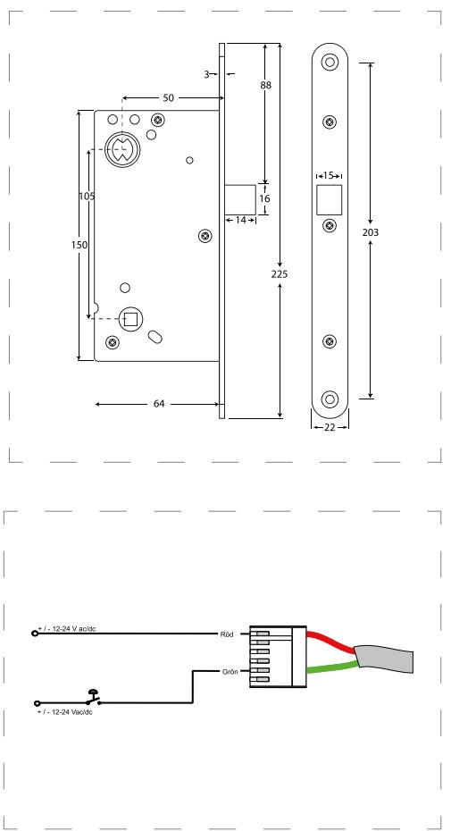

### E LT R Y C K E S L Å S SL 506

# Förenklat eltryckeslås med split funktion för högtrafikerade dörrar

Safetron SL 506 är ett elektromekaniskt styrt tryckesfunktionslås utan förregling med s.k. split funktion i modulutförande. Typiska användningsområden är intern låsning inom äldrevården tack vare den lätta tryckesrörelsen. Även lämplig som enklare daglåsning inom handel, kontor och industri eller entréer och andra allmänna utrymmen i flerbostadshus.

SL 506 har rättvänd funktion vilket betyder låst i strömlöst läge.

#### Split funktion

Split funktionen möjliggör mekanisk utpassering och elektrisk inpassering genom en delad tryckespinne.

### Ingen förregling

Safetron SL 504 saknar förreglingskolv och lämpar sig därför för överfalsade dörrar eller dörrar med lågt ställda krav på säkerhet.

### Låg tryckeskraft

Tryckeskraften som krävs för att manövrera låset är väldigt låg, därför lämpar sig låset för användning inom t.ex. äldrevården där denna faktor har betydelse.

Strömsnål Endast 65mA @ 24 VDC.

## E LT R Y C K E S L Å S SL 506

### EGENSKAPER

- Split funktion
- Dorndjup 50 mm
- Rättvänd funktion: SL 506
- Omvänd funktion: SL 507
- Omställbar höger eller vänster
- Fallutsprång 14 mm
- Kolvplacering enligt klassisk standard

### TEKNISKA DATA

- Multispänning 12 VDC / 24 VDC +/- 15%
- Strömförbrukning: 12 VDC: 130 mA, 24 VDC: 65 mA
- Arbetstemperatur -20°C till +40°C

### BENÄMNING ART NR

SL 506 H Låshus, rättvänd funktion 202 144 601 SL 507 H Låshus, omvänd funktion 202 144 603 SL 506 V Låshus, rättvänd funktion 202 144 602 SL 507 V Låshus, omvänd funktion 202 144 604

### **SAFETRON AB**

Säterivägen 18 P.O. Box 2096 65002 Karlstad Sweden

Tel: +46 54 19 02 45 Email: info@safetron.com

Du hittar alltid det senaste på safetron.com