Reservation för tryckfel och förändringar i manualen

| 1 |            | Introduktion 5                                                     |  |
|---|------------|--------------------------------------------------------------------|--|
|   | 1.1        | Egenskaper  5                                                      |  |
|   | 1.2        | Specifikationer  5                                                 |  |
|   | 1.3        | Systemöverblick 6                                                  |  |
|   | 1.4        | Strömförbrukning moduler  6                                        |  |
| 2 |            | Installation7                                                      |  |
|   | 2.1        | Lokalisering och montering  7                                      |  |
|   | 2.2        | Jordning  7                                                        |  |
|   | 2.3        | AC-strömförsörjning  7                                             |  |
|   | 2.4        | Backupbatteri  7                                                   |  |
|   | 2.5        | MG 5050 Layout8                                                    |  |
|   | 2.6        | SP6000 Layout9                                                     |  |
|   | 2.7        | SP7000 Layout 10                                                   |  |
|   | 2.8        | Strömuttag AUX 11                                                  |  |
|   | 2.9        | Telefonlinjeanslutning 11                                          |  |
|   | 2.10       | Sirenutgång 11                                                     |  |
|   | 2.11       | Programmerbara utgångar 11                                         |  |
|   | 2.12       | Enkelsektionsingångar 12                                           |  |
|   | 2.13       | Dubbelsektionsanslutningar (ATS) 13                                |  |
|   | 2.14       | Brandkretsar 14                                                    |  |
| 3 |            | Programmeringsmetoder 15                                           |  |
|   | 3.1        | WinLoad mjukvara för Windows 15                                    |  |
|   | 3.2        | Programmering med knappsats 15                                     |  |
|   | 3.3        | Konfigurera knappsatssektionsnummer 16                             |  |
|   | 3.4        | Programmering med Paradox minnesnyckel 16                          |  |
| 4 |            | LCD knappsatsetiketter 18                                          |  |
|   | 4.1        | Inmatningsknappar 18                                               |  |
|   | 4.2        | Etikettadresser 18                                                 |  |
|   | 4.3        | Specialtecken och knappsats bokstavstilldelning 18                 |  |
| 5 |            | Åtkomstkoder19                                                     |  |
|   | 5.1        | Åtkomstkodlängd 19                                                 |  |
|   | 5.2        | Installatörskod (Default: 0000 / 000000) 19                        |  |
|   | 5.3        | Servicekod (Default: tom)19                                        |  |
|   |            |                                                                    |  |
|   | 5.4        | Systemmasterkod (Default: 1234 / 123456) 19                        |  |
|   | 5.5        | Användarkodoptioner 19                                             |  |
|   | 5.6        | Lås masterkod 20                                                   |  |
| 6 |            | StayD läge21                                                       |  |
|   | 6.1        | Överblick  21                                                      |  |
|   | 6.2        | Ingång/utgångsplaceringar 21                                       |  |
|   | 6.3        | Ingång/utgång med knappsats 21                                     |  |
|   | 6.4        | Ingång/utgång med en fjärrkontroll  21                             |  |
|   | 6.5        | Fönsterläge och återtillkopplingsfördröjning 21                    |  |
|   | 6.6        | Avancerade inställningar 22                                        |  |
| 7 |            | Sektionsprogrammering23                                            |  |
|   | 7.1        | Sektionsdefinitioner 23                                            |  |
|   | 7.2        | Sektionsdefinitionsstatus26                                        |  |
|   | 7.3        | Sektionsområdestilldelning 26                                      |  |
|   | 7.4        | Sektionsoptioner 26                                                |  |
|   | 7.5        | Ändmotståndsektioner 28                                            |  |
|   | 7.6        | ATS Sektionsdubblering 28                                          |  |
|   | 7.7        | Sabotageingång på APR-ZX8 ID A (Central +1) 28                     |  |
|   | 7.8        | Sabotageingång på APR-ZX8 ID B (Central +9) 28                     |  |
|   | 7.9        | Sabotageingång på APR-ZX8 ID C (Central +17) 28                    |  |
|   | 7.10       | ATS kabeloptioner 28                                               |  |
|   | 7.11       | Sektionsingång 1 blir en 2-tråds rökingång 28                      |  |
|   | 7.12       | Sektionstimers 28                                                  |  |
| 8 |            | Nyckelomkopplarprogrammering29                                     |  |
|   | 8.1        | Nyckelomkopplarnumrering 29                                        |  |
|   | 8.2        | Nyckelomkopplardefinitioner 29                                     |  |
|   | 8.3        | Nyckelomkopplaroptioner 29                                         |  |
| 9 |            | Trådlösa funktioner30                                              |  |
|   | 9.1        | Trådlös sändare programmering 30                                   |  |
|   | 9.2 9.3 | Se signalstyrkan på trådlösa sändare 30 Övervakningsoptioner 30 |  |

| 9.4            | RF störningsövervakning 31                                                      |  |
|----------------|---------------------------------------------------------------------------------|--|
| 9.5            | Trådlös serienummerdisplay 31                                                   |  |
| 9.6            | Fjärrkontrollsprogrammering 31                                                  |  |
| 9.7            | Trådlös knappsatstilldelning 32                                                 |  |
| 9.8            | Se signalstyrkan på trådlös knappsats 32                                        |  |
| 9.9            | Trådlös knappsats optioner 32                                                   |  |
| 9.10           | Trådlös knappsats Live Display läge 33                                          |  |
|                |                                                                                 |  |
| 9.11           | Trådlös repeater programmering 33                                               |  |
| 9.12           | Visa repeaterns signalstyrka 33                                                 |  |
| 9.13           | Trådlös repeater optioner 33                                                    |  |
| 9.14           | Trådlösa optioner 34                                                            |  |
| 10             | Tillkopplings- och frånkopplingsoptioner 37                                     |  |
| 10.1           | Växla till Hemmatillkoppling om ingen ingångsfördröjning öppnas 37              |  |
| 10.2           | När fördröjningssektion förbikopplas blir följsektioner ingångsfördröjning 2 37 |  |
| 10.3           | Normal tillkoppling växlar till tvångstillkoppling 37                           |  |
| 10.4           | Hemmatillkoppling växlar till hemmatvångstillkoppling 37                        |  |
| 10.5           | Sovtillkoppling växlar till sovtvångstillkoppling 37                            |  |
| 10.6           | Ej tillkoppling vid batterifel 37                                               |  |
| 10.7           | Ej tillkoppling vid sabotagefel  37                                             |  |
| 10.8           | Ej tillkoppling vid trådlöst övervakningsfel 38                                 |  |
| 10.9           | Till-/frånkoppla med VDMP3 38                                                   |  |
| 10.10          | Tidsinställd autotillkoppling 38                                                |  |
| 10.11          | Ingen rörelse autotillkoppling 38                                               |  |
| 10.12          | Autotillkopplingsoptioner 39                                                    |  |
|                |                                                                                 |  |
| 10.13          | Snabbtillkoppling 39                                                            |  |
| 10.14          | Snabbtillkoppling förbigå programmering 39                                      |  |
| 10.15          | Utgångsfördröjning 39                                                           |  |
| 10.16          | Sirenpip vid till-/frånkoppling med knappsats 39                                |  |
| 10.17          | Sirenpip vid till/frånkoppling med fjärrkontroll 39                             |  |
| 10.18          | Ingen utgångsfördröjning vid tillkoppling med fjärrkontroll 40                  |  |
| 10.19          | Inga utgångsfördröjningspip och inga sirenpip vid hemma-/sovtillkoppling 40     |  |
| 10.20          | Utgångsfördröjning termination 40                                               |  |
| 10.21          | Snabbutgång 40                                                                  |  |
|                |                                                                                 |  |
| 11             | Larmoptioner41                                                                  |  |
|                |                                                                                 |  |
| 11.1           | Sirenavstängningstid 41                                                         |  |
| 11.2           | Återanvänd larm 41                                                              |  |
| 11.3           | Sabotageigenkänning 41                                                          |  |
| 11.4           | RF modul övervakning 41                                                         |  |
| 11.5           | Sabotageförbikopplingsoptioner 41                                               |  |
| 11.6           | Sabotageövervakning på bussmodulen 42                                           |  |
| 11.7           | Knappsatspanikoptioner 42                                                       |  |
| 11.8           | Panik utstängningstimer 42                                                      |  |
| 11.9           | Flex-direkt fördröjning 42                                                      |  |
| 12             | Rapportering och uppringaroptioner 43                                           |  |
| 12.1           | Sektionsrapporteringskoder 43                                                   |  |
| 12.2           | Användarrapporteringskoder 43                                                   |  |
| 12.3           | Specialtillkopplingsrapportkoder 43                                             |  |
| 12.4           | Specialfrånkopplingsrapportkoder 43                                             |  |
| 12.5           | Speciallarmrapportkoder 43                                                      |  |
| 12.6           | Systemfelrapportkoder 44                                                        |  |
| 12.7           | Systemfelåterställningsrapportkoder 44                                          |  |
| 12.8           | Systemspecialrapportkoder 44                                                    |  |
|                |                                                                                 |  |
| 12.9           | Rensa rapporteringskoder 45                                                     |  |
| 12.10          | Återställ rapporteringskoder 45                                                 |  |
| 12.11          | Larmcentraltelefonnummer 45                                                     |  |
| 12.12          | Personliga uppringningsnummer 45                                                |  |
| 12.13          | Rapporteringsformat 46                                                          |  |
| 12.14          | Uppringningsmetod 47                                                            |  |
| 12.15          | Pulsförhållande 47                                                              |  |
| 12.16          | Maximalt antal uppringningsförsök 47                                            |  |
| 12.17          | Maximalt antal uppringningsförsök - VDMP3 47                                    |  |
| 12.18          | Fördröjning mellan uppringningsförsök 47                                        |  |
| 12.19          | Byt till puls på femte försöket 48                                              |  |
| 12.20          | Alternativ uppringningsoption 48                                                |  |
| 12.21          | Tvångsuppringaroption 48                                                        |  |
| 12.22 12.23 | Nyligen stängd fördröjning 48 Autotestrapport 48                             |  |

| 12.24 | Stängningsförseelsefördröjning 49                     |  |
|-------|-------------------------------------------------------|--|
| 12.25 | Strömförsörjningsfel rapportfördröjning 49            |  |
| 12.26 | Rapportera systemfrånkoppling 49                      |  |
| 12.27 | Sektionsåterställning rapportoptioner 49              |  |
| 12.28 | Telefonlinjeövervakning (TLÖ) 49                      |  |
| 12.29 | Personsökarrapporteringsfördröjning 50                |  |
| 12.30 | Personsökarrapportering meddelanderepetition 50       |  |
| 12.31 | Personlig rapporteringsfördröjning 50                 |  |
| 12.32 | Personlig rapportering meddelanderepetition 50        |  |
| 12.33 | Avaktivera rapportering 50                            |  |
| 13    | Programmerbara utgångar 51                            |  |
| 13.1  | PGM aktiveringshändelse 51                            |  |
| 13.2  | PGM deaktiveringshändelse 51                          |  |
| 13.3  | PGM fördröjning51                                     |  |
| 13.4  | PGM optioner 51                                       |  |
| 13.5  | PGM programmering 52                                  |  |
| 13.6  | Visa PGM signalstyrka 52                              |  |
| 14    | Systeminställningar 53                                |  |
| 14.1  | Versionnummerdisplay 53                               |  |
| 14.2  | Tryck knapp för strömförsörjningåterställning 53      |  |
| 14.3  | Installatörslås 53                                    |  |
| 14.4  | Knappsats utelåsningsfunktion 53                      |  |
| 14.5  | Batteriladdningsström 53                              |  |
| 14.6  | Områdesindelning 53                                   |  |
| 14.7  | Konfidentiellt läge 53                                |  |
| 14.8  | Installatörsfunktionsknappar 54                       |  |
| 14.9  | Sommartid 54                                          |  |
| 14.10 | Specialinställd sommartidsprogrammering 54            |  |
| 14.11 | Ljudlig felvarning förutom AC-fel 55                  |  |
| 14.12 | Ljudlig felvarning vid AC-fel 55                      |  |
| 14.13 | Visa ingångsfördröjning på LCD knappsats (MG32LCD) 55 |  |
| 14.14 | Visa utgångsfördröjning på LCD knappsats (MG32LCD) 55 |  |
| 15    | Inställningar för WinLoad mjukvara56                  |  |
| 15.1  | Central svarsoptioner 56                              |  |
| 15.2  | Centralidentifierare 56                               |  |
| 15.3  | PC lösenord 56                                        |  |
| 15.4  | PC telefonnummer 56                                   |  |
| 15.5  | Ring WinLoad mjukvara 56                              |  |
| 15.6  | Svara WinLoad mjukvara 57                             |  |
| 15.7  | Automatisk händelsebuffertsändning 57                 |  |
| 15.8  | Ring tillbaka till WinLoad 57                         |  |
| 15.9  | Ansluta till WinLoad 57                               |  |
| 16    | Användardrift58                                       |  |
| 16.1  | Larmdisplay 58                                        |  |
| 16.2  | Feldisplay  58                                        |  |

# **1 Introduktion**

### **1.1 Egenskaper**

- 32 sektioner (vilken som helst kan vara trådlös eller knappsatssektion).
- 32 användare och 32 fjärrkontroller (en per användare).
- In-field uppgraderingar: Uppdatera centralens mjukvara genom att ansluta den till en PC via ett 307USB interface och sedan använda WinLoad mjukvara (V2.80 eller högra).
- Menydriven programmering för Installatör-, Master- och Servicekoder. Detta tillåter dig programmera centralen genom ett enkelt interface, utan att behöva använda adressnummer.
- Flera telefonnummer för händelserapportering: Tre för larmcentralen, fem för personliga samtal och ett för pagerrapportering.
- Kalender med sommar/vintertid (aktivera adress **[730]**, option [1] och välj adress **[731]** för att lägga in landskod): Du kan nu välja 1 av 18 olika landsgrupper var och en med sin egen förprogrammerade lokala sommar/vintertid. Du kan också skräddarsy sommar/vintertid genom att programmera adresserna **[732]** och **[733]**.
- Ny Sovtillkopplingsmetod: Liknande hemmatillkoppling, sovtillkoppling låter användare vara kvar i ett skyddat område, men ger ett ökat skydd. Till exempel, i ett tvåvåningshus, är skalskyddet skyddat med hemmatillkoppling. Med sovtillkoppling, är både skalskyddet och första våningen skyddad (med rörelse-detektorer etc.), vilket låter dig fritt gå omkring på andra våningen.
- Anslut upp till 15 trådbundna knappsatser på 4-tråds kommunikationsbussen.
- Tryck på en knapp för att återställa: en behändig återställningsknapp sparar tid när ett tillfälligt strömavbrott är nödvändigt istället för att fysiskt behöva rycka ur centralens kraftkablar. Tryckoch håll ned RESET-brytaren i fem sekunder. STATUS-LEDen kommer börja blinka. Inom 2 sekunder av detta blinkande, tryck på resetbrytaren igen. Centralen kommer återställas till default och starta om. Du kan också återställa alla programmerbara adresser till fabriksinställningar i adress **[950]**.
- Finns med 433MHz eller 868MHz.
- Stöder minnesnyckel (PMC-4 och PMC-5).
- RF störningsövervakning (adress **[700]**, option [5]): centralen kommer att rapportera ett fel om RF signalen störs ut.
- Stöder SIA rapporteringsformat till larmcentralen.

#### **OBS!**

Alla batterier ska bytas inom en period av 24 månader enligt norm. Centralen bör servas enligt SSF regler, inom en period av 15 månader.

**OBS!**

**Trådlösa enheter är känsliga för störningar i omgivningen från till exempel strömledningar, andra radiosändarenheter och ytor som reflekterar (metall, speglar), absorberar (solida väggar) eller förvränger (metallnät, pelare) radiosignaler. även närliggande GSM/Tele sändare kan påverka de trådlösa enheterna.**

### **1.2 Specifikationer**

#### **1.2.1 Magellan / Spectra SP Centraler**

- AC-strömmatning: 16Vac transformator (referera till Tabell 1 på sidan 7) med
- Batteri: 12Vdc, 4Ah/7Ah
- Strömuttag AUX: 600mA typisk, 700mA maximum, säkringslös nedstängning
- Sirenutgång: 1A, säkringslös nedstängning vid 3A
- PGMar: 100mA svagström (varje PGM)

**1.2.2 Magellan / Spectra SP Knappsatser** 

- 
- 
- 1 standard knappsatssektion
- On-board antisabotage brytare (valfri)
- 

AC-strömmatning: Typisk 9-16Vdc Strömförbrukning MG32LED: 170mA, MG10LEDV/H: 95mA, MG32LRF: 40mA, MG32LCD: 110mA

MG5000/SP6000 = 2 on-board PGMar* MG5050/SP7000 = 4 on-board PGMar

minimum 20VA klassificering (rek. 40VA), 50 till 60Hz

Maximal räckvidd Maximal kabellängd är 230m

*Specifikationer kan komma att ändras utan förvarning.* 

* PGM3 och PGM4 är valfria för SP6000

vid 1,1A

### **1.3 Systemöverblick**

| Modul                | Beskrivning                                 | Maximalt antal per system   |
|----------------------|---------------------------------------------|-----------------------------|
| MG32LRF              | 32-sektioners trådlös LED knappsatsmodul    | 8                           |
| MG10LEDV/H, MG32LED, | 10 och 32-sektioners trådbunden LED och LCD | 15 totalt inklusive APR-ZX8 |
| MG32LCD, MG32I       | knappsatsmodul                              |                             |
| APR-ZX8              | 8-sektioners expansionsmodul                | 3                           |
| MG-RPT1              | Magellan trådlös repeterarmodul             | 2                           |
| VDMP3                | Plug-in röstuppringare                      | 1                           |
| IP100                | Internetmodul                               | 1                           |
| MG-RTX3              | Trådlös expansionsmodul (endast Spectra SP) | 1                           |

### **1.4 Strömförbrukning moduler**

| Modul      | Strömförbrukning           |
|------------|----------------------------|
| MG10LEDV/H | Min. = 44mA / Max. = 72mA  |
| MG32LED    | Min. = 49mA / Max. = 148mA |
| MG32LCD    | Min. = 43mA / Max. = 86mA  |
| MG32LRF    | Min. = 48mA / Max. = 130mA |
| MG32I      | Min. = 30mA / Max. = 70mA  |
| APR-ZX8    | Min. = 29mA / Max. = 31mA  |
| MG-RTX3    | Min. = 61mA / Max. = 143mA |
| IP100      | Min. = 90mA / Max. = 120mA |
| VDMP3      | Min. = 28mA / Max. = 28mA  |

# **2 Installation**

## **2.1 Lokalisering och montering**

Innan lådan monteras tryck dit de fem vita plaststöden baktill i lådan. Dra alla kablar till lådan och förbered dem för anslutning innan kretskortet monteras i lådan. Välj en installationsplats som inte lätt nås av inkräktare och lämna åtminstone 5 cm fritt runt centrallådan för att tillåta god ventilation och värmeavgång. Installationsplatsen skall vara torr och nära ett AC-uttag, jorduttag och en telefonlinje-anslutning. Undvik installation nära eller i vägen för starkaRF fält (som t.ex. neonljus, datorer), på eller nära metallobjekt, proppskåp, luftkonditionerare och värmeledningar eftersom de kan orsaka störningar och minska känsligheten. Undvik att installera centralen i källaren.

Kapa, böj eller ändra ej antennerna och se till att elektriska ledningar ej korsar över antennerna, eftersom detta kan påverka signalmottagningen.

## **2.2 Jordning**

Anslut sektions- och uppringarjordanslutningarna från centralen till lådan och jorduttaget.

För maximalt åskskydd används separata jordledningar för sektionsjord och uppringarjord.

### **2.3 AC-strömförsörjning**

Använd inte strömbrytarstyrda uttag för att mata transformatorn. Anslut transformatorn enligt Figur 1 på sida 7. Använd Tabell 1 för att bestämma erforderlig transformator.

| Transformator:                        | Amseco XP-1620 16VAC 20VA | Universell UB1640W 16,5VAC 40VA |  |  |  |
|---------------------------------------|---------------------------|---------------------------------|--|--|--|
| DC strömförsörjning:                  | 1,1A                      | 1,5A                            |  |  |  |
| AUX-strömförsörjning kan maximalt ge: | typ.: 600mA, max: 700mA   | typ.: 600mA, max: 700mA         |  |  |  |
| Acceptabel batteriladdningsström      | 350mA                     | 350mA/700mA                     |  |  |  |

| Tabell 1: Transformatorkrav |  |
|-----------------------------|--|
|-----------------------------|--|

### **2.4 Backupbatteri**

För att ge ström vid strömavbrott ansluts ett 12 VDC 4Ah/7Ah uppladdningsbart backupbatteri enligt Figur 1. Anslut batteriet efter AC-anslutning. Vid installation verifiera rätt polaritet eftersom säkringen går vid anslutning med fel polaritet.

### **2.4.1 Batteritest**

Om batteriet inte är anslutet eller om batterisäkringen går, kommer ett Inget/Lågt batterifel visas i knappsatsens feldisplay (se Feldisplay på sida 58). Detta fel visas också om batteriets kapacitet är för lågt eller om batterispänningen sjunker till 10,5V eller lägre när centralen kör på backupbatteriet. Vid 8,5V eller lägre, kommer centralen att stängas ner och alla utgångar stängas.

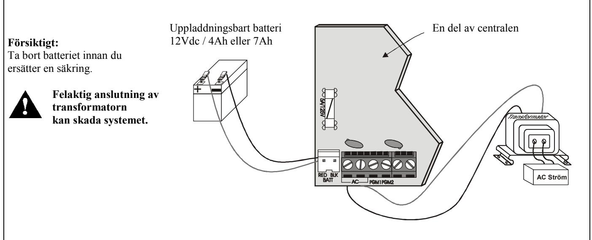

### **2.5 MG 5050 Layout**

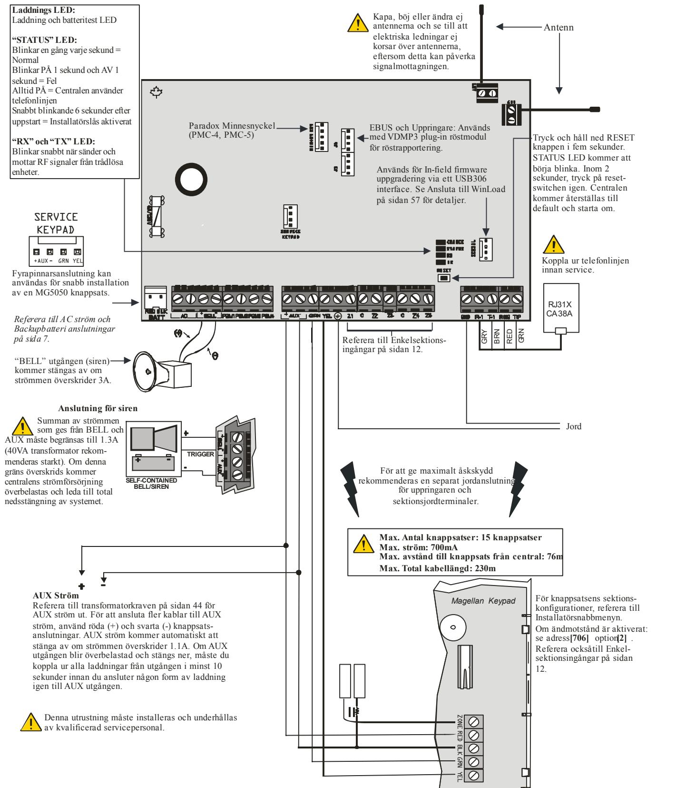

### **2.6 SP6000 Layout**

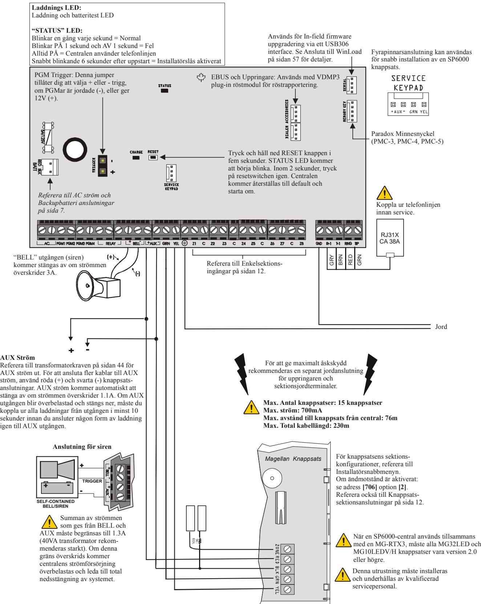

### **2.7 SP7000 Layout**

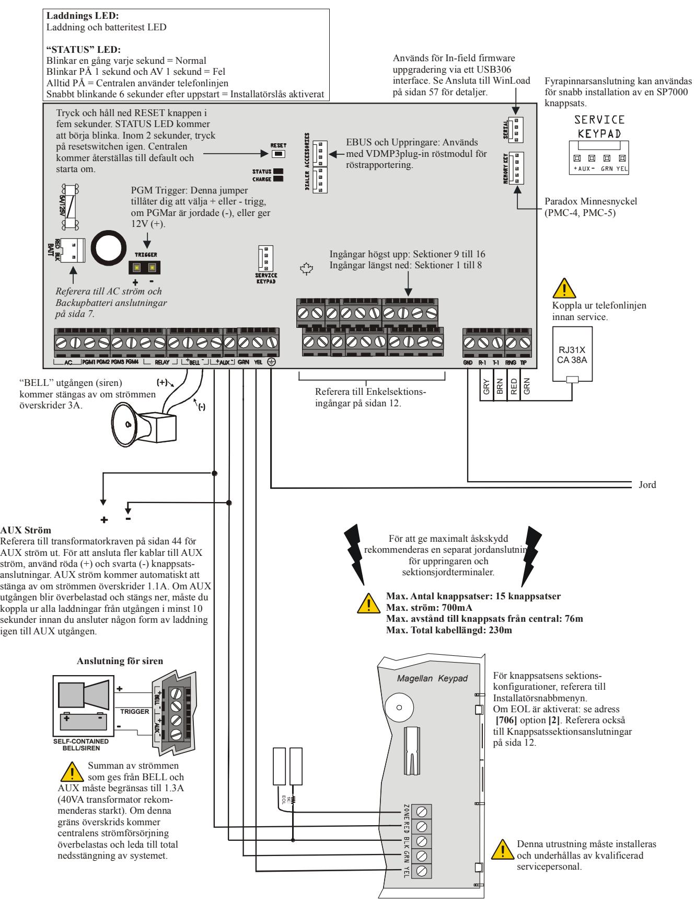

### **2.8 Strömuttag AUX**

Du kan använda AUX-strömuttaget för att ge ström till rörelsedetektorer, knappsatser och andra tillbehör till säkerhetssystemet. En automatisk säkringskrets skyddar AUX-strömuttaget mot överbelastning och stänger automatiskt av om strömmen överskrider 1,1A. Om detta inträffar, kommer Maximal AUX-strömförsörjning felet visas i knappsatsens feldisplay (se Feldisplay på sida 58). Därför skall ej den kombinerade strömförbrukningen av alla anslutna enheter ej överskrida 700mA. Om AUX-strömuttaget överbelastas och stängs ner, måste du koppla ur alla laddningar från utgången i minst 10 sekunder innan du kan koppla tillbaka laddningar till AUX-utgången.

### **2.9 Telefonlinjeanslutning**

För att kunna rapportera systemhändelser till larmcentralen, måste du ansluta inkommande telefonlinje till TIP- och RINGanslutningarna på centralen. Anslut sedan sladdarna från T1 och R1 till telefonsystemet, enligt centrallayouten för respektive central.

### **2.10 Sirenutgång**

BELL+ och BELL- anslutningarna matar sirener och/eller andra varningsenheter som kräver en konstant utspänning under ett larm. Sirenutgången ger 12Vdc vid larm och kan mata två 20-watts sirener eller en 30-watts siren. Sirenutgången använder en säkringslös krets som stängs av automatiskt om strömmen överskrider 3A. Om detta inträffar, kommer Maximal AUX-strömförsörjning felet visas i knappsatsens feldisplay (se Feldisplay på sida 58) under larm. Om belastningen på sirenutgången återgår till det normala, kommer centralen att återinkoppla ström till sirenutgången. Vid anslutning av sirener skall rätt polaritet verifieras. Anslut den positiva ledaren till BELL+ terminalen och den negativa ledaren till BEL- terminalen på centralen, enligt centrallayouten för respektive central.

När sirenutgången inte används visas "Siren saknas"-meddelandet i feldisplayen. För att undvika detta sätt ett 1 kohms motstånd över sirenutgången.

### **2.11 Programmerbara utgångar**

När en specifik händelse inträffar i systemet, kan en PGM återställa rökdetektorer, aktivera strobeljus, öppna/stänga garagedörrar och mycket mer.

### **2.11.1 PGMar**

Centralerna inkluderar två/fyra on-board programmerbara utgångar (PGMar). För detaljer om hur man programmerar PGMar, se *Programmerbara utgångar* på sida 51. PGM1 och PGM2 kan stödja upp till 150mA, PGM4 kan ändras om till + trigg. PGMarna begränsas av vilken strömkälla som används. Om försörjd av:

- **AUX-terminalerna.** Strömförbrukningen av AUX-terminalerna kan ej överskrida 700mA. Därför kan ej enheter (moduler och PGMar) ansluta till AUX-terminalerna överskrida 700mA totalt. Till exempel, om 6 stycken moduler är anslutna till AUX-terminalerna som använder 600mA, och du vill ansluta en PGM till en AUX-terminal, kan ej den PGMens strömförbrukning överskrida 100mA.
- **En extern strömkälla.** Om en extern strömkälla används, kan strömförbrukningen ej överskrida 150mA för PGM1 och PGM2.Om den externa strömkällans strömförbrukningsgräns är mindre än den för PGMen som den är ansluten till, kommer strömförbrukningen ej att gå över strömkällans gräns.

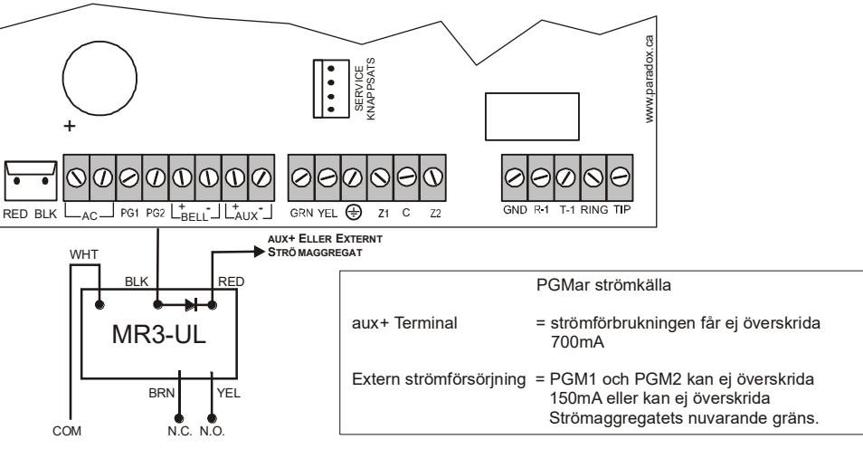

Figur 2: Relä och PGM anslutningar

## **2.12 Enkelsektionsingångar**

Detektionsenheter som t.ex. rörelsedetektorer och dörrkontakter ansluts till centralens sektionsingångsterminaler. Figur 3 demonstrerar enkelsektions terminalanslutningar som centralen känner igen. När ansluten måste den associerade sektionens parametrar vara definierade.

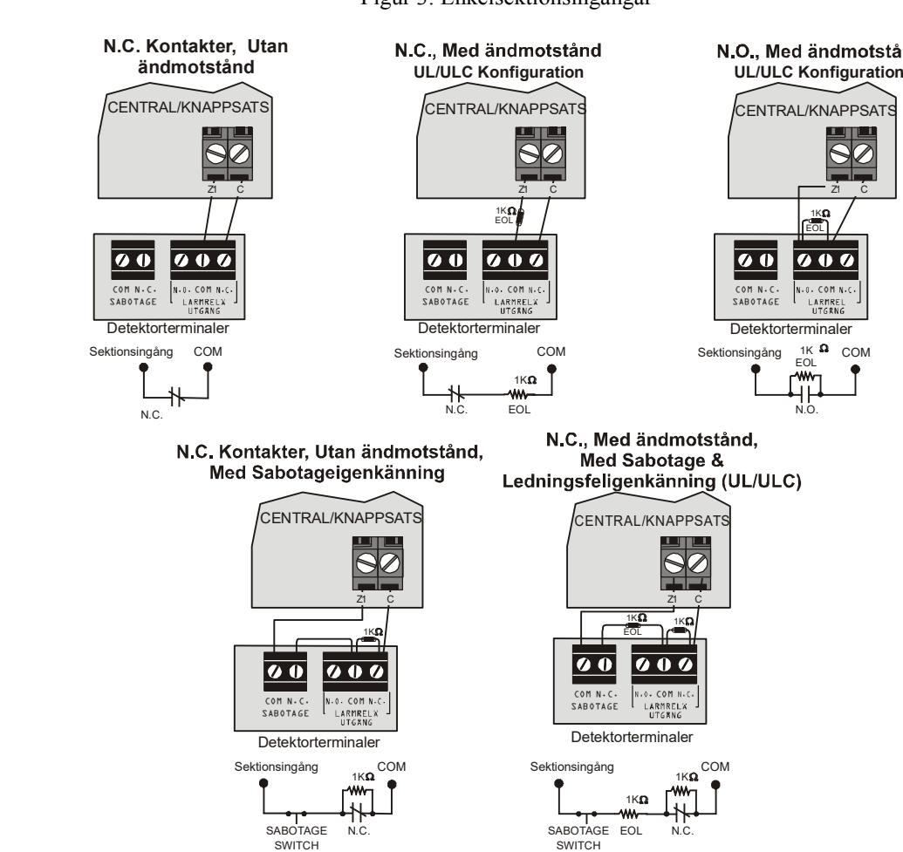

### **2.13 Dubbelsektionsanslutningar (ATS)**

ATS funktionen är en mjukvaruorienterad funktion som låter två detektionsenheter installeras per trådbunden ingångsterminal. Varje detektionsenhet har sin egen sektion, visar sektionsstatus på knappsatsen och skickar sina egna larmkoder. Brandsektioner can ej dubbleras.

#### Figur 4: Dubbelsektionsanslutningar

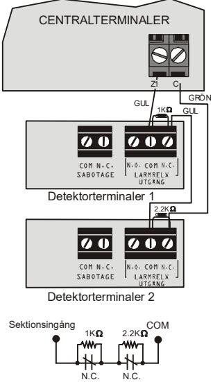

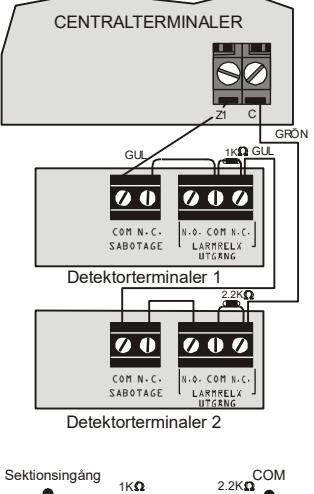

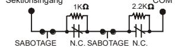

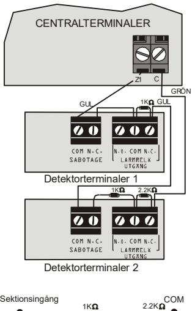

N.C.

SABOTAGE

EOL

SABOTAGE

1K

N.C.

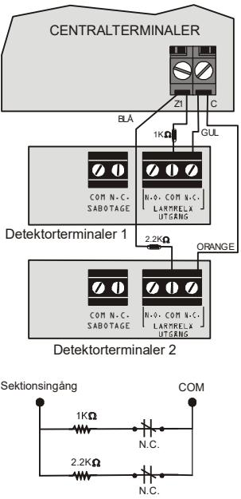

### **2.14 Brandkretsar**

När en sektion programmerats som en brandsektion, blir sektionen normalt öppen och behöver ett EOL motstånd. Om en kortslutning inträffar eller om rökdetektorn blir aktiv, om systemet antingen är till eller frånkopplat, kommer centralen generera ett larm. Om ett fel inträffar i en brandsektion, kommer brandkretsfel visas i knappsatsens feldisplay (se Feldisplay på sida 58) och centralen kan skicka brandkretsfelrapporten, om programmerad, i adress **[866]**.

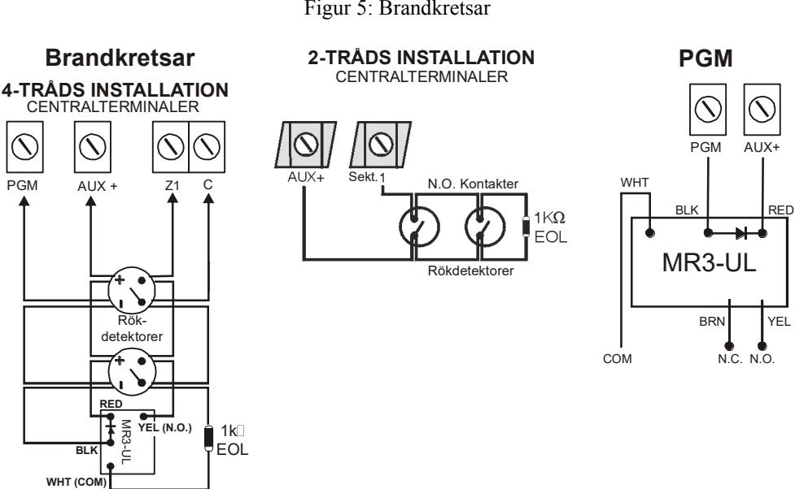

#### **2.14.1 4-tråds och 2-trådsinstallation**

För 4-tråds installation, programmera aktiveringshändelsen så att rökdetektorerna kan återställas genom att trycka **[CLEAR] + [ENTER]** knapparna i tre sekunder. Se händelsegrupp # 6 i händelsebeskrivningslistan i programmeringsguiden.

För 2-tråds rökdetektorinstallation, anslut 2-tråds rökdetektorerna. Om en kortslutning inträffar eller om rökdetektorn aktiveras, om systemet är frånkopplat, kommer centralen generera ett larm. Om linan är öppen, kommer "Sektionsfel" felindikatorn att visas i feldisplayen och rapportkoden skickas till larmcentralen, om programmerad. För att återställa 2-tråds rökdetektorer, tryck **[CLEAR] + [ENTER]** knapparna i tre sekunder. För återställning av rökdetektorer med en TM40/TM50 enhet, tryck Tysta Larmdon.

# **3 Programmeringsmetoder**

### **3.1 WinLoad mjukvara för Windows**

Programmera centralerna fjärrstyrt eller lokalt genom att använda WinLoad mjukvaran (V2.80 eller högre) för Windows. För mer information, kontakta Paradox Security AB. Om du använder WinLoad mjukvaran, måste du programmera funktionerna (se Inställningar för WinLoad mjukvara på sida 56). Uppdatera centralens mjukvara genom att ansluta den till en PC via ett 307 Direct Connect interface och sedan använda WinLoad mjukvaran.

### **3.2 Programmering med knappsats**

Använd den medföljande programmeringsguiden för att hålla reda på vilka adresser som har programmerats och hur. Vi rekommenderar att du läser hela manualen innan du börjar programmera.

#### **Hur går jag in i programmeringsläge?**

- 1) Tryck **[ENTER]**
- 2) Knappa in din **[INSTALLATÖRSKOD]** (default: 0000 / 000000) eller **[SERVICEKOD]** (tom i default)
- 3) Knappa in den 3-siffriga **[ADRESSEN]** som du vill programmera
- 4) Knappa in erforderliga **[DATA]**

### **3.2.1 Enkelsiffrig datainmatningsmetod (decimal och hexadecimal)**

Enkelsiffrig datainmatningsmetod används i alla adresser utom de som är specifierade i Egenskapsvalsprogrammeringsmetod (nedan). Efter att du har gått in i programmeringsläge som beskrivs i rutan ovan, kommer vissa adresser kräva att du knappar in **decimala** värden från **000 till 255**. Andra adresser kommer kräva att du knappar in **hexadecimala** värden från **0 till F**. Erforderliga data kommer klart och tydligt visas i denna manual och även i programmeringsguiden. När du har knappat in den sista siffran i en adress, kommer centralen automatiskt att spara och gå vidare till nästa adress. Förutom adresserna 001 till 032, efter att du har knappat in de tre första siffrorna kommer centralen byta till egenskapsvalsprogrammering. För telefonnummerprogrammering, tryck **[ENTER]** för att spara data.

| Värde eller                                 | Vad ska jag  | Vad ser jag?                                 |                                              |  |  |  |  |
|---------------------------------------------|--------------|----------------------------------------------|----------------------------------------------|--|--|--|--|
| aktion                                      | trycka?      | 32-sektions LED                              | 10-sektions LED                              |  |  |  |  |
| Värde 0 / Ersätt aktuell siffra med 0 | [SLEEP]      | Ta bort siffra och stanna kvar i adressen | Ta bort siffra och stanna kvar i adressen |  |  |  |  |
| Värdena 1 till 9                            | [1] till [9] | Sektion 1 till 9                             | Knapparna 1 till 9                           |  |  |  |  |
| A (endast hex)                              | [0]          | Sektion 10                                   | Knapp 0(10)                                  |  |  |  |  |
| B (endast hex)                              | [OFF]        | Sektion 11                                   | OFF                                          |  |  |  |  |
| C (endast hex)                              | [BYP]        | Sektion 12                                   | BYP                                          |  |  |  |  |
| D (endast hex)                              | [MEM]        | Sektion 13                                   | MEM                                          |  |  |  |  |
| E (endast hex)                              | [TBL]        | Sektion 14                                   | TBL                                          |  |  |  |  |
| F (endast hex)                              | [ ]       | Sektion 15                                   | [ ]                                       |  |  |  |  |
| Gå ur utan att spara                     | [CLEAR]      | Tillkoppla & Hemma LED blinkar               | Tillkoppla & Hemma LED blinkar               |  |  |  |  |
| Spara data (endast hex)                  | [ENTER]      | Avancerar till nästa adress                  | Avancerar till nästa adress                  |  |  |  |  |

#### Tabell 2: Decimal och hexadecimal programmeringstabell

#### **3.2.2 Egenskapsvalsprogrammering**

Efter att du har gått in i vissa adresser, kommer åtta optioner att visas där varje option från **[1]** till **[8]** representerar en specifik egenskap. Tryck på den knappen som motsvarar önskad option. Detta betyder att optionen är PÅ. Tryck på knappen igen för att ta bort siffran, och därmed stänga AV optionen. När optionerna är inställda, tryck på **[ENTER]** knappen för att spara och gå vidare till nästa adress.

### **3.2.3 Data displayläge (förutom MG32LCD)**

I Data displayläge kan du se det programmerade innehållet för varje adress en siffra i taget.

#### Figur 6: Data displayläge

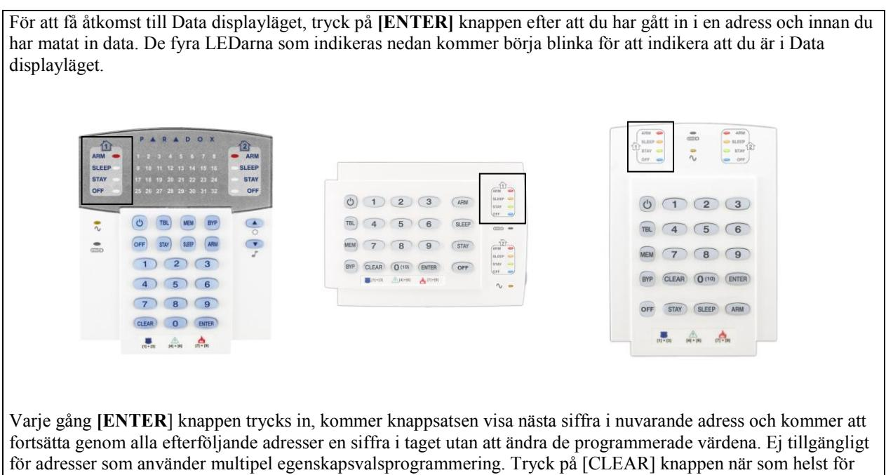

att gå ut ur Data displayläget.

### **3.3 Konfigurera knappsatssektionsnummer**

Hur konfigurerar jag knappsatsen?

Tryck **[ENTER]**

Knappa in **[INSTALLATÖRSKODEN]** (default: 0000 / 000000) eller **[SERVICEKODEN]** (tom i default)

Tryck och håll ned **[ ]** i tre sekunder

Knappa in önskat sektionsnummernyckel (MG32LED/MG32LCD: 2-siffrig inmatning 01 till 32, MG10LEDV/H: 1-siffrig inmatning 1 till 0(10))

Tryck **[ENTER]** för att spara och gå ur programmeringsläge

Tryck **[CLEAR]** för att ta bort data utan att spara

Tryck **[CLEAR]+[CLEAR]** för att gå ut ur programmeringsläge utan att spara

#### **Notera: Efter fem minuter kommer knappsatsen att gå ut ur programmeringsläge.**

### **3.4 Programmering med Paradox minnesnyckel**

Kopiera adresserna i en central till Paradox minnesnyckel (PMC-4/PMC-5). Kopiera sedan minnesnyckelns innehåll till så många centraler som är nödvändigt. Varje central programmeras under 3 sekunder.

#### **Ladda ned till DESTINATION Central eller modul**

- 1) Koppla bort AC och batteri frår centralen.
- 2) Placera minnesnyckeln i serialanslutningen som är markerad MEMORY KEY på centralen som ska ta emot innehållet i minnesnnyckeln.
- 3) Koppla tillbaks AC och batteri.
- 4) I Installatörprogrammeringsläge, knappa in adress **[970]**, knappsatsen avger då ett bekräftelsepip.
- 5) När knappsatsen avger ett andra bekräftelsepip, ta bort minnesnyckeln.

#### **Kopiera till minnesnyckel från KÄLLA Central eller modul**

- 1) Koppla bort AC och batteri frår centralen.
- 2) Placera minnesnyckeln i serialanslutningen som är markerad MEMORY KEY på centralen som du vill kopiera. Se till att "write protect jumper" är PÅ, på minnesnyckeln.
- 3) Koppla tillbaks AC och batteri.
- 4) I Installatörprogrammeringsläge, knappa in adress **[975]**, knappsatsen avger då ett bekräftelsepip.
- 5) När knappsatsen avger ett andra bekräftelsepip, ta bort minnesnyckeln. Ta bort minnesnyckelns jumper om du inte vill skriva över minnesnyckelns innehåll av misstag.

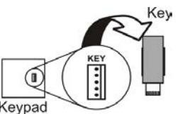

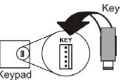

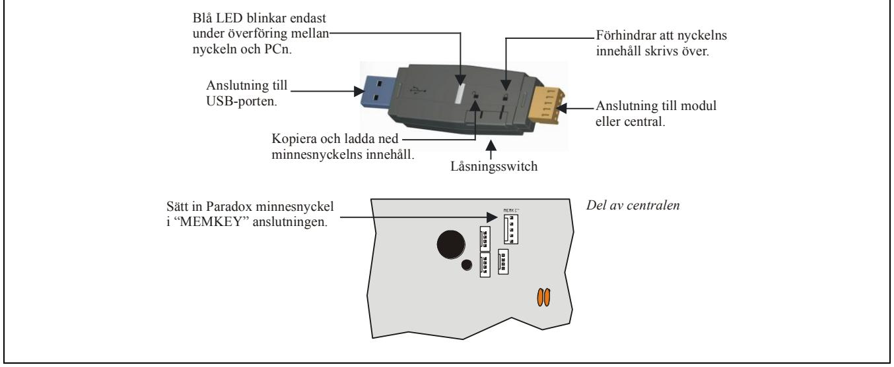

# **4 LCD knappsatsetiketter**

### **4.1 Inmatningsknappar**

|         | Specialfunktionsknappar           | Alfanumerisk knappinmatning |           |  |  |
|---------|-----------------------------------|-----------------------------|-----------|--|--|
| Knapp   | Funktion                          | [1]                         | A / B / C |  |  |
| [STAY]  | Lägg till blanksteg               | [2]                         | D / E / F |  |  |
| [SLEEP] | Ta bort                           | [3]                         | G / H / I |  |  |
| [ARM]   | Ta bort helt inlägg               | [4]                         | J / K / L |  |  |
| [OFF]   | Välj mellan numerisk/alfanumerisk | [5]                         | M / N / O |  |  |
| [BYP]   | Välj mellan gemener och versaler  | [6]                         | P / Q / R |  |  |
| [MEM]   | Specialtecken                     | [7]                         | S / T / U |  |  |
|         |                                   |                             |           |  |  |

| [8] | V / W / X |
|-----|-----------|
| [9] | Y / Z     |

#### **4.2 Etikettadresser**

| Etikettadresser  |                        |  |  |  |  |  |
|------------------|------------------------|--|--|--|--|--|
| [181] till [212] | 32 Sektionsetiketter   |  |  |  |  |  |
| [341] till [356] | 16 PGM-etiketter       |  |  |  |  |  |
| [511] till [542] | 32 Användaretiketter   |  |  |  |  |  |
| [771] till [772] | 2 Områdesetiketter     |  |  |  |  |  |
| [568] till [569] | 2 Trådlösa etiketter   |  |  |  |  |  |
| [599] till [606] | 8 Trådlösa knappsatser |  |  |  |  |  |
| [781] till [795] | 15 Bussmoduletiketter  |  |  |  |  |  |

### **4.3 Specialtecken och knappsats bokstavstilldelning**

| 032   | 048 | 064                                                                                                                                                                            | 080 | 096 | 112                                                                                                                                                                            | 128      | 144 | 160       | 176 | 192     | 208 |
|-------|-----|--------------------------------------------------------------------------------------------------------------------------------------------------------------------------------|-----|-----|--------------------------------------------------------------------------------------------------------------------------------------------------------------------------------|----------|-----|-----------|-----|---------|-----|
|       | 0   | 0                                                                                                                                                                              | P   | r   | p                                                                                                                                                                              | Û        | É   | ದ         | S   | ರ್      | ע   |
| 033   | 049 | 065                                                                                                                                                                            | 081 | 097 | 113                                                                                                                                                                            | 129      | 145 | 161       | 177 | 193     | 209 |
| l     | 1   | (                                                                                                                                                                              | O   | വ   | O                                                                                                                                                                              | 1 J      | E   |           | ਣ   | 1       | יינ |
| 034   | 050 | 066                                                                                                                                                                            | 082 | 098 | 114                                                                                                                                                                            | 130      | 146 | 162       | 178 | 194     | 210 |
| 贝萝    | 2   | B                                                                                                                                                                              | R   | b   | r                                                                                                                                                                              | U        | É   |           | =   | D       | 0   |
| 035   | 051 | 067                                                                                                                                                                            | 083 | 099 | 115                                                                                                                                                                            | 131      | 147 | 163       | 179 | 195     | 211 |
| ત્ત્વ | 3   | C                                                                                                                                                                              | S   | C   | S                                                                                                                                                                              | U        | Ë   | Í         | 1   | ਤਿ      | r   |
| 036   | 052 | 068                                                                                                                                                                            | 084 | 100 | 116                                                                                                                                                                            | 132      | 148 | 164       | 180 | 196     | 212 |
| 6     | র্ব | D                                                                                                                                                                              | T   | ರ   | t                                                                                                                                                                              | 0        | ê   |           | -   | ್ತ      | ﺮ   |
| 037   | 053 | 069                                                                                                                                                                            | 085 | 101 | 117                                                                                                                                                                            | 133      | 149 | 165       | 181 | 197     | 213 |
| %     | 5   | E                                                                                                                                                                              | U   | e   | U                                                                                                                                                                              | ப்       | e   | i         | J   | 3       | l   |
| 038   | 054 | 070                                                                                                                                                                            | 086 | 102 | 118                                                                                                                                                                            | 134      | 150 | 166       | 182 | 198     | 214 |
| હ્યું | C   | F                                                                                                                                                                              | V   | f   | V                                                                                                                                                                              | Ú        | é   | N         | f   | ದ       | --  |
| 039   | 055 | 071                                                                                                                                                                            | 087 | 103 | 119                                                                                                                                                                            | 0× O×配   | 151 | 167       | 183 | 199     | 215 |
| 개     | 7   | G                                                                                                                                                                              | W   | O   | W                                                                                                                                                                              |          | ë   | గ్        | মে  | רו 1 | <<  |
| 040   | 056 | 072                                                                                                                                                                            | 088 | 104 | 120                                                                                                                                                                            | 136      | 152 | 168       | 184 | 200     | 216 |
|       | 8   | H                                                                                                                                                                              | ×   | n   | ×                                                                                                                                                                              |          | Å   | N         | ル   | U       | >>  |
| 041   | 057 | 073                                                                                                                                                                            | 089 | 105 | 121                                                                                                                                                                            | 137      | 153 | 169       | 185 | 201     | 217 |
| -     | 0   | ------------------------------------------------------------------------------------------------------------------------------------------------------------------------------ | Y   | İ   | V                                                                                                                                                                              | O        | A   | ത         | ਦੇ  | ರ       | -   |
| 042   | 058 | 074                                                                                                                                                                            | 090 | 106 | 122                                                                                                                                                                            | 138      | 154 | 170 ರು | 186 | 202     | 218 |
| 米     | 로 제 | J                                                                                                                                                                              | Z   |     | N                                                                                                                                                                              | Ol       | å   |           | র-  | у       | -   |
| 043   | 059 | 075                                                                                                                                                                            | 091 | 107 | 123                                                                                                                                                                            | 139 ô | 155 | 171 V  | 187 | 203     | 219 |
| +     | ु   | K                                                                                                                                                                              |     | K   | ﻴﺔ ﺍﻟﻤﺴﺎﻫﻤﺔ ﺍﻟﻤﺘﺤﺪﺓ ﺍﻟﻤﺘﺤﺪﺓ ﺍﻟﻤﺘﺤﺪﺓ ﺍﻟﻤﺘﺤﺪﺓ ﺍﻟﻤﺘﺤﺪﺓ ﺍﻟﻤﺘﺤﺪﺓ ﺍﻟﻤﺘﺤﺪﺓ ﺍﻟﻤﺘﺤﺪﺓ ﺍﻟﻤﺘﺤﺪﺓ ﺍﻟﻤﺘﺤﺪﺓ ﺍﻟﻤﺘﺤﺪﺓ ﺍﻟﻤﺘﺤﺪﺓ ﺍﻟﻤﺘﺤﺪﺓ ﺍﻟﻤﺘﺤﺪﺓ ﺍﻟﻤﺘﺤﺪﺓ ﺍﻟﻤﺘﺤﺪﺓ ﺍﻟﻤﺘﺤﺪﺓ ﺍﻟﻤﺘﺤﺪﺓ ﺍﻟﻤﺘﺤﺪﺓ ﺍﻟﻤﺘﺤﺪﺓ ﺍ  |          | â   |           | >   | র্ধা    | ×   |
| 044   | 060 | 076                                                                                                                                                                            | 092 | 108 | 124                                                                                                                                                                            | 140      | 156 | 172 V  | 188 | 204     | 220 |
| ア     | V   | ட                                                                                                                                                                              | ਣ   | -   | ------------------------------------------------------------------------------------------------------------------------------------------------------------------------------ | ರ        | à   |           | -   | C       | (ર) |
| 045   | 061 | 077                                                                                                                                                                            | 093 | 109 | 125                                                                                                                                                                            | 141      | 157 | 173 W  | 189 | 205     | 221 |
| ■     | ==  | M                                                                                                                                                                              | 1   | m   | ﻟﺴﻴﺎ                                                                                                                                                                           | ó        | á   |           | 1/2 | ਕਿ      | C)  |
| 046   | 062 | 078                                                                                                                                                                            | 094 | 110 | 126                                                                                                                                                                            | 142      | 158 | 174       | 190 | 206     | 222 |
|       | V   | N                                                                                                                                                                              | 人   | n   |                                                                                                                                                                                | ﺔ        | a   | ന         | 1/3 | O       | T   |
| 047   | 063 | 079                                                                                                                                                                            | 095 | 111 | 127                                                                                                                                                                            | 143      | 159 | 175       | 191 | 207     | 223 |
|       | 2   | O                                                                                                                                                                              |     | O   | 1                                                                                                                                                                              | C        | A   | AE        | 1/4 | ర్      |     |

# **5 Åtkomstkoder**

Centralen stöder följande åtkomstkoder:

| Installatörskod [397]: | Används för att programmera alla centralinställningar förutom användarkoder.                 |  |  |
|------------------------|----------------------------------------------------------------------------------------------|--|--|
| Servicekod [398]:      | Servicekoden är lik Installatörskoden. Den kan användas för att gå in i programmeringsläge,  |  |  |
|                        | vilket tillåter dig programmera alla funktioner, optioner och kommandon förutom centralens   |  |  |
|                        | kommunikationsinställningar. Servicekoden är tom i default.                                  |  |  |
| Systemmasterkod [399]: | Tillåter full access. Tillkoppla och frånkoppla genom att använda vilken metod som helst som |  |  |
|                        | beskrivs i Användarkodoptioner nedan och även programmera användarkoder.                     |  |  |
| Masterkod 1:           | Permanent tilldelad till område 1. Samma som en vanlig användarkod förutom att den kan       |  |  |
|                        | programmera accesskoder för användarkoder som är tilldelade til område 1.                    |  |  |
| Masterkod 2:           | Permanent tilldelad till område 2. Samma som en vanlig användarkod förutom att den kan       |  |  |
|                        | programmera accesskoder för användarkoder som är tilldelade til område 2. Om systemet ej är  |  |  |
|                        | områdesindelat kommer Masterkod 2 att tilldelas till område 1.                               |  |  |
| 29 Användarkoder:      | Kan tillkoppla och frånkoppla enligt Användarkodoptioner nedan.                              |  |  |

### **5.1 Användarkodlängd**

Adress **[701]**: Systemoptioner Option **[1]** AV = 6-siffriga användarkoder Option **[1]** PÅ = 4-siffriga användarkoder (default)

Alla användarkoder kan vara antingen 4- eller 6-siffriga. När den 4-siffriga optionen väljs, kommer 4-siffriga koder ge åtkomst. När den 6-siffriga optionen används, måste en 6-siffrig kod knappas in för att ge åtkomst.

Om kodlängden ändras från fyra till sex siffror när användarkoder redan har programmerats, kommer centralen automatiskt att lägga till de 2 sista siffrorna genom att använda de 2 första siffrorna.

### **5.2 Installatörskod (Default: 0000 / 000000)**

Installatörskoden används för att gå in i systemets programmeringsläge, vilket låter dig programmera alla funktioner, optioner och kommandon i centralen. Installatörskoden kan vara 4 eller 6 siffror långa (se Åtkomstkodlängd ovan) där varje siffra kan vara ett värde från 0 till 9. Installatörskoden kan ej användas för att programmera Masterkod 1, Masterkod 2 eller användarkoder. För att programmera installatörskoden tryck:

**[ENTER]** + **[NUVARANDE INSTALLATÖRSKOD]** + **[397]** + ny 4- eller 6-siffrig installatörskod

### **5.3 Servicekod (Default: tom)**

Servicekoden är lik installatörskoden. Den kan användas för att gå in i programmeringsläget, vilket låter dig programmera alla funktioner, optioner och kommandom *förutom* systemets kommunikationsinställningar (adresserna **[395]**, **[397]**, **[398]**, **[815]**, **[816]**, **[817]**, **[910]** och **[911]**) samt användarkoder. Servicekoden kan vara 4 eller 6 siffror lång där varje siffra kan ha ett värde från 0 till 9. Servicekoden är tom i default. Ställ in servicekoden i adress **[398]**.

**[ENTER]** + **[INSTALLATÖRSKOD]** + **[398]** + ny 4- eller 6-siffrig servicekod

### **5.4 Systemmasterkod (Default: 1234 / 123456)**

Installatörskoden kan användas för att programmeria Systemmasterkoden. med Systemmasterkoden kan användaren använda alla tillkopplingsmetoder och kan programmera alla användarkoder, men ej användarkodoptionerna. Systemmasterkoden kan vara 4 eller 6 siffror lång där varje siffra kan ha ett värde från 0 till 9. Systemmasterkoden kan modifieras men kan ej tas bort. För att ändra systemmasterkoden tryck:

**[ENTER]** + **[INSTALLATÖRSKOD]** + **[399]** + ny 4- eller 6-siffrig systemmasterkod

### **5.5 Användarkodoptioner**

Adresserna **[404]** till **[432]**: Optionerna **[1]** till **[8]**

Användarkodoptionerna definierar vilka tillkopplingsmetoder varje användare kan använda för att tillkoppla eller frånkoppla systemet.

#### **5.5.1 Område 1 tilldelning**

Adresserna **[404]** till **[432]**: Användarkoder 004 till 032 Option **[1]** AV = Neka åtkomst till område 1 Option **[1]** PÅ = Användarkod har åtkomst till område 1 (default)

Om systemet är områdesindelat (se Områdesindelning på sida 53), kommer användarkoder med denna option aktiverad att kunna tillkoppla och frånkoppla område 1.

**Om systemet ej är områdesindelat, måste du tilldela område 1 till användarkoden. Annars kommer användarkoden betraktas som avaktiverad.** 

### **5.5.2 Område 2 tilldelning**

Adresserna **[404]** till **[432]**: Användarkoder 004 till 032

Option **[2]** AV = Neka åtkomst till område 2 (default)

Option **[2]** PÅ = Användarkod hat åtkomst till område 2

Om systemet är områdesindelat (se Områdesindelning på sida X), kommer användarkoder med denna option aktiverad att kunna tillkoppla och frånkoppla område 2. Om systemet ej är områdesindelat, kommer centralen ignorera denna option.

### **5.5.3 Förbikoppla programmering**

Adresserna **[404]** till **[432]**: Användarkoder 004 till 032 Option **[3]** AV = Förbigå programmering avaktiverad Option **[3]** PÅ = Förbigå programmering aktiverad (default) Användarkoder med denna option aktiverad kan förbigå programmering i tilldelade områden.

### **5.5.4 Hemma/sovtillkoppling**

Adresserna **[404]** till **[432]**: Användarkoder 004 till 032 Option **[4]** AV = Hemma/sovtillkoppling avaktiverad Option **[4]** PÅ = Hemma/sovtillkoppling aktiverad för vald användarkod (default) Användarkoder med denna option aktiverad kan hemma- eller sovtillkoppla tilldelade områden.

### **5.5.5 Tvångstillkoppling**

Adresserna **[404]** till **[432]**: Användarkoder 004 till 032 Option **[5]** AV = Tvångstillkoppling avaktiverad Option **[5]** PÅ = Tvångstillkoppling aktiverad för vald användarkod (default) Användarkoder med denna option aktiverad kan tvångstillkoppla tilldelade områden.

#### **5.5.6 Endast tillkoppling**

Adresserna **[404]** till **[432]**: Användarkoder 004 till 032

Option **[6]** AV = Endast tillkoppling avaktiverad (default)

Option **[6]** PÅ = Endast tillkoppling aktiverad

Användarkoden med denna option aktiverad kan tillkoppla tilldelade områden, men kan ej frånkoppla områden. Typ av tillkoppling är beroende av de andra användarkodoptionerna som väljs. Notera att med endast tillkoppling optionen, kan användaren avbryta ett nyligen tillkopplat system genom att knappa in åtkomstkoden igen innan utgångsfördröjningen går ut.

### **5.5.7 PGM aktivering**

Adresserna **[404]** till **[432]**: Användarkoder 004 till 048

Option **[7]** AV = Användarkod följer användarkodoptioner och kan aktivera en PGM (default)

Option **[7]** PÅ = Användarkod kan endast aktivera en PGM

När option [7] är AV, inknappande av användarkod kommer att tillkoppla eller frånkoppla enligt de programmerade Användarkodoptionerna och även aktivera eller deaktivera en PGM. Den passande PGM aktiverings/deaktiveringshändelsen måste också programmeras (se Programmerbara utgångar på sidan 51). Med option [7] PÅ, kommer centralen att ignorera alla andra Användarkodoptioner. Därför kommer inknappande av koden bara aktivera eller deaktivera PGMen.

#### **5.5.8 Hot**

Adresserna **[404]** till **[432]**: Användarkoderna 004 till 032

Option **[8]** AV = Användarkod med hot avaktiverat (default)

Option **[8]** PÅ = Användarkod med hot aktiverat

Om du under hot övertalas att tillkoppla eller frånkoppla ditt system, kan du slå in användarkoden med hotoptionen aktiverad för att tillkoppla eller frånkoppla systemet och skicka ett tyst larm till (hotkod) till larmcentralen.

#### **5.6 Lås masterkod**

Adress **[701]**: Systemoptioner

Option **[2]** AV: Lås systemmasterkod avaktiverad (default)

Option **[2]** PÅ: Lås systemmasterkod aktiverad

När denna funktion är aktiverad, kommer centralen att låsa systemmasterkoden (001) och den kan ej modifieras. När funktionen är avaktiverad, kommer centralen att låsa upp systemmasterkoden så att den kan ändras. Systemmasterkoden kan ej tas bort (se Master snabbmenyprogrammering i användarguiden).

# **6.1 Överblick**

- **Notera att: StayD är automatiskt aktiverad när en placering är programmerad med knappsatsen. När en trådlös knappsats (MG32LRF) tas bort från systemet, kommer motsvarande placering också tas bort.** StayD gör ditt liv enklare och gör det säkrare genom att skydda dig 24 timmar om dygnet, 7 dagar i veckan utan att aldrig behöva frånkoppla systemet - även när du går in i ett tillkopplat område. StayD lever med dig och skyddar dig alltid, utan några oskyddade perioder samtidigt som den automatiskt återtillkopplar systemet så att du ej behöver komma ihåg att göra det. Denna unika funktion integrerar säkerhet i ditt vardagliga liv för att ge dig ett säkert, enkelt liv med sinnesro.
### **6.2 Ingång/utgångsplaceringar**

- StayD har programmerade placeringar, där användaren går in i och går ut ur lokalen genom fördefinierade vägar, med endast vägarnas respektive sektioner öppna för passage. En placering kan programmeras för varje individuell knappsats, med maximalt fyra sektioner per placering. Placeringar måste definieras som följ eller fördröjningssektioner endast. StayD är automatiskt aktiverat när en placering är programmerad till en knappsats.
- Den första sektionen programmerad i en placering är dess tilldelade ingångspunkt (t.ex. dörrar, garage). Tilldelade ingångspunkter är ej samma sak som multipla placeringar. Det finns endast en tilldelad ingångspunkt per placering. De används också endast när en fjärrkontroll används för in- och utgång (se nedan).
- Systemet avaktiverar endast placeringarna motsvarande den knappsats vid in-/utgångspunkten, samtidigt som den återtillkopplar när du går in/ut.
- Om en annan placering öppnas innen den försöker frånkoppla systemet, kan du validera sektionen genom att knappa in användarkoden. Till exempel, om du har gått in i ditt hem genom Placering 1 och är vid din knappsats. Innan du frånkopplar systemet, upptäcker du att Placering 2 har öppnats. Om du vet att det är en familjemedlem och vill validera den öppna sektionen, knappa in användarkoden. Alla placeringar, inklusive Placering 1m kommer då att valideras. Om Placering 2 sektionen öppnas efter att du har knappat in koden för att validera Placering 1, måste du knappa in koden igen för att validera Placering 2.
- Du måste knappa in koden för varje sektion som öppnas som ej tillhör en placering. Till exempel, Om du har gått in genom Placering 1 och en icke-placeringssektion öppnas, måste du knappa in din kod en gång för att validera din placering och en gång för icke-placeringssektionen. Om du ej validerar icke-placeringssektionen kommer systemet att larma.

### **6.3 Ingång/utgång med knappsats**

- När ingång sker med en knappsats, kommer placeringarna att gå in i ingångsfördröjning, vilket låter dig nå knappsatsen. Använd knappsatsen för att frånkoppla systemet och ändra till hemmatillkopplingsläge.
- När utgång sker med en knappsats, kommer endast placeringarna gå in i fördröjning (samma som utgångsfördröjning), vilket låter dig lämna huset området utan medans resten av lokalen är säkert.

### **6.4 Ingång/utgång med en fjärrkontroll**

- När en fjärrkontroll används, kommer placeringen du använder vara definierad av en tilldelad ingångspunkt. Till exempel: om efter att du har tryckt på fjärrkontrollen för att frånkoppla systemet utlöser du sektion 1, kommer systemet kontrollera vilka placeringar som inkluderar sektion 1. Alla placeringar som inkluderar sektion 1 kommer att öppnas. Endast efter att den tilldelade ingångspunkten har nåtts kommer systemet veta vilken väg du tar, och kommer då att återtillkoppla alla andra placeringar. Efter ingång med en fjärrkontroll, kommer systemet automatiskt tillkoppla i hemmaläge.
- För att frånkoppla systemet med en fjärrkontroll: Tryck en gång för att frånkoppla område 1, två gånger för område 2, och tre gånger för båda områdena. Tryck på knappen fyra gånger för att avbryta utgångsfördröjningen och tillkoppla systemet i hemmaläge.

### **6.5 Fönsterläge och återtillkopplingsfördröjning**

- I ett hemmatillkopplat system: Detta läge låter dig öppna en exteriör sektion utan att utlösa larm. För att gå in i fönsterläge, tryck **[AV]**, sedan din **[TILLTRÄDESKOD]**. Alla sektioner som kan öppnas blinkar. Systemet kommer att starta en utgångsfördröjning, vilket låter dig öppna en exteriör sektion som t.ex. en dörr eller ett fönster. Systemet kommer endast låta dig öppna en sektion eftersom utgångsfördröjningen slutar efter att du gjort så. När du stänger den öppna sektionen (fönster, dörr, etc.) kommer den sektionen att återtillkoppla.
- Återtillkopplingsfördröjning är en fördröjningstimer som är inställd så att när du stänger den öppna exteriörsektionen (fönster, dörr, etc.), kommer den ej att återtillkoppla sektionen direkt. Istället startar systemet fördröjningen för att låta dig stänga sektionen ordentligt. Fördröjningen startar varje gång du öppnar sektionen när den försöker stänga, och du måste stänga sektionen i 5 sekunder för att den ska larma. Detta är speciellt användbart för att eliminera falsklarm orsakade av fönster som fastnar.

### **6.6 Avancerade inställningar**

| Adress | Data        |                     | Beskrivning                                                                                                                                                            |
|--------|-------------|---------------------|------------------------------------------------------------------------------------------------------------------------------------------------------------------------|
| [720]  | ___/___/___ | (000 till 255) sek. | Flex-direkt = Direkt och följsektioner kommer följa fördröjningen i adress [720] när hemma- eller sovtillkopplad (default är 15 sekunder / 000 = direktsektion). |

| Adress | Data        |                     | Beskrivning                                                                                                       |
|--------|-------------|---------------------|-------------------------------------------------------------------------------------------------------------------|
| [721]  | ___/___/___ | (000 till 255) sek. | Återtillkopplingsfördröjning (fördröjning innan sektionen återtillkopplar). Default = 000 (ingen fördröjning). |

# **7 Sektionsprogrammering**

När sektioner programmeras, är sektionstilldelningar beroende av tilldelningen av trådlösa sändare, tilldelning av knappsatssektioner, och detektorenheter som är kopplade till centralen. För trådlös tilldelning, se Trådlös sändarprogrammering på sidan 30 eller Installatörssnabbmenyn i programmeringsguiden. För knappsatstilldelning, se Konfigura knappsatssektionsnummer på sidan 16. Efter att de du har tilldelat sektionerna, måste du ställa in sektionernas definitioner, områdestilldelning, och optioner, se figur 8 nedan.Vissa sektionsdefinitioner ändras om en Flex-direkt fördröjning aktiveras (adress **[720]**). Se Sektionsdefinitionsstatus på sidan 26.

|                   | Trådlös | Knappsats | Trådbunden             |
|-------------------|---------|-----------|------------------------|
| Sektion 1         | Ja      | Ja        | Ja (ingång Z1)         |
| Sektion 2         | Ja      | Ja        | Ja (ingång Z2)         |
| Sektion 3         | Ja      | Ja        | Ja (ingång Z1 med ATS) |
| Sektion 4         | Ja      | Ja        | Ja (ingång Z2 med ATS) |
| Sektion 5 till 32 | Ja      | Ja        | Nej                    |

Tabell 3: Sektionsigenkänning tabell

Om en sektion redan är programmerad och du tilldelar en enhet till samma sektion, kommer en trådlös sektion att skriva över en knappsats/trådbunden sektion, och en knappsatssektion kommer att skriva över en trådbunden sektion.

|  | Figur 8: Sektionsprogrammering |  |
|--|--------------------------------|--|
|  |                                |  |

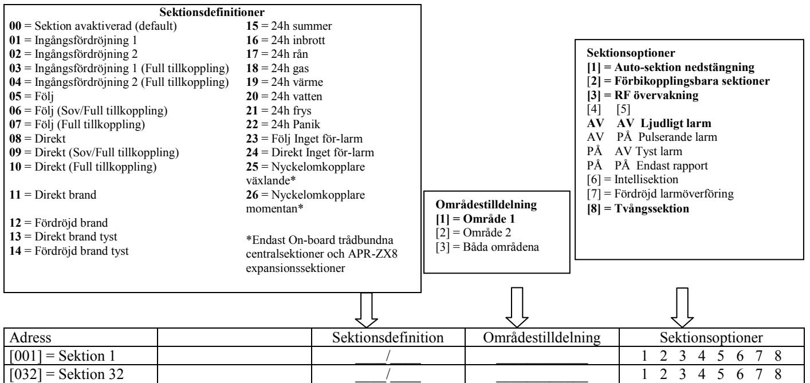

### **7.1 Sektionsdefinitioner**

Som demonstreras i figur 8 ovan, adresserna **[001]** till **[032]** representerar sektionerna 1 till 32 respektive, där de två första siffrorna i varje av dessa sektioner representerar sektionens definition. För att avaktivera en sektion, knappa in **[00]**. Det finns 26 tillgängliga sektionsdefinitioner.

#### **7.1.1 Ingångsfördröjningssektioner 1**

Adresserna **[001]** till **[032]**: Sektionerna 1 till 32, första siffrorna = **01**

När systemet är tillkopplat och en sektion definierad med Ingångsfördröjning 1 öppnas, kommer centralen att generera larm efter den programmerade Ingångsfördröjning 1 timern går ut. Detta för att ge användare tillräckligt med tid för att gå in i det skyddade området och frånkoppla systemet. För att programmera Ingångsfördröjning 1 timern, knappa in det önskade 3 siffriga fördröjningsvärdet (000 till 255 sekunder, default = 45 sekunder) i adress **[710]**. Ingångsfördröjningssektioner används ofta vid ingångs/utgångspunkter i det skyddade området (t.ex. entré/bakdörr, garage, etc.). Att använda olika ingångsfördröjningar är användbart när, till exempel, en ingångspunkt kräver längre fördröjningstid än den andra ingångspunkten eller i ett områdesindelat system där varje område kan kräva en annan ingångsfördröjning.

#### **7.1.2 Ingångsfördröjningssektioner 2**

Adresserna **[001]** till **[032]**: Sektionerna 1 till 32, första siffrorna = **02**

Ingångsfördröjning 2 sektioner är identiska Ingångsfördröjning 1 sektioner, förutom att den använder en separat timer. För att programmera Ingångsfördröjning 2 timer, knappa in det önskade 3-siffriga fördröjningsvärdet (000 till 255 sekunder, default = 45 sekunder) i adress **[711]**.

### **7.1.3 Ingångsfördröjningssektioner 1 (Full tillkoppling)**

Adresserna **[001]** till **[032]**: Sektionerna 1 till 32, första siffrorna = **03**

Vid normal tillkoppling, är sektionen Ingångsfördröjning 1 (se Ingångsfördröjningssektioner 2 på sidan 23). Vid hemma/ sovtillkoppling, är sektionen förbikopplad av systemet. Se Sektionsdefinitionsstatus på sidan 26 för undantag.

### **7.1.4 Ingångsfördröjningssektioner 2 (Full tillkoppling)**

Adresserna **[001]** till **[032]**: Sektionerna 1 till 32, första siffrorna = **04**

Vid normal tillkoppling, är sektionen Ingångsfördröjning 2 (se Ingångsfördröjningssektioner 2 på sidan 23). Vid hemma/ sovtillkoppling, är sektionen förbikopplad av systemet. Se Sektionsdefinitionsstatus på sidan 26 för undantag.

### **7.1.5 Följsektioner**

Adresserna **[001]** till **[032]**: Sektionerna 1 till 32, första siffrorna = **05**

När en normal, hemma, eller sovtillkopplad följsektion öppnas, kommer centralen att omedelbart generera ett larm, om ej en ingångsfördröjningssektion öppnas först:

- Om en normal/hemma/sovtillkopplad följsektion öppnas efter att en ingångsfördröjningssektion öppnas, kommer centralen att vänta tills ingångsfördröjningstimern har gått ut innan ett larm genereras.
- Om en normal/hemma/sovtillkopplad följsektion öppnas efter att mer än en ingångsfördröjningssektion öppnas, kommer centralen att vänta tills ingångsfördröjningstimern för sektionen som öppnade först har gått ut.

Denna funktion används ofta när en rörelsedetektor skyddar området som har ingångspunktknappsatsen. Detta förhindrar att rörelsedetektorn genererar larm när en användare går in genom entrén för att frånkoppla systemet. Se Sektionsdefinitionsstatus på sidan 26 för undantag.

### **7.1.6 Följ (Sov / Full tillkoppling)**

Adresserna **[001]** till **[032]**: Sektionerna 1 till 32, första siffrorna = **06** Vid normal tillkoppling eller sovtillkoppling, är sektionen följ. Vid hemmatillkoppling, är sektionen förbikopplad av systemet. Se Sektionsdefinitionsstatus på sidan 26 för undantag.

### **7.1.7 Följsektioner (Full tillkoppling)**

Adresserna **[001]** till **[032]**: Sektionerna 1 till 32, första siffrorna = **07** Vid normal tillkoppling, är sektionen följ (se Följsektioner på sidan 24). Vid hemma- eller sovtillkoppling, är sektionen förbikopplad av systemet. Se Sektionsdefinitionsstatus på sidan 26 för undantag.

#### **7.1.8 Direktsektioner**

Adresserna **[001]** till **[032]**: Sektionerna 1 till 32, första siffrorna = **08** När en tillkopplad direktsektion öppnas, kommer systemet omedelbart att generera ett larm. Direktsektioner används vanligtvis för t.ex. fönster. Se Sektionsdefinitionsstatus på sidan 26 för undantag.

### **7.1.9 Direktsektioner (Sov / Full tillkoppling)**

Adresserna **[001]** till **[032]**: Sektionerna 1 till 32, första siffrorna = **09**

När du normal- eller sovtillkopplar, är sektionen direkt. När du hemmatillkopplar, är sektionen förbikopplad av systemet. Se Sektionsdefinitionsstatus på sidan 26 för undantag.

#### **7.1.10 Direktsektioner (Full tillkoppling)**

Adresserna **[001]** till **[032]**: Sektionerna 1 till 32, första siffrorna = **10** Vid normal tillkoppling, är sektionen direkt. Vid hemma- eller sovtillkoppling, är sektionen förbikopplad av systemet. Se Sektionsdefinitionsstatus på sidan 26 för undantag.

#### **7.1.11 Direktsektioner brand**

Adresserna **[001]** till **[032]**: Sektionerna 1 till 32, första siffrorna = **11**

När en direktbrandsektion öppnas, antingen den är tillkopplad eller frånkopplad, kommer centralen skicka motsvarande larm-rapportkod och larmet är alltid ljudligt oavsett andra inställningar. Brandlarm genererar en intermittent (pulserande) sirenutgångssignal enligt figur 9 nedan.

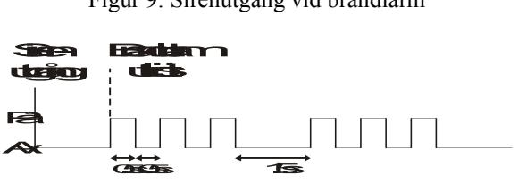

### **7.1.12 Fördröjda brandsektioner**

Adresserna **[001]** till **[032]**: Sektionerna 1 till 32, första siffrorna = **12** Figur 10: Fördröjd 24h brandsektion När en fördröjd 24h brandsektion öppnas, antingen den är tillkopplad eller frånkopplad, kommer centralen reagera enligt figur 10. Fördröjda 24h brandsektioner används ofta i hem där rökdetektorn ofta genererar falsklarm. Brandlarm genererar en intermittent (pulserande) sirenutgångssignal enligt figur 9 ovan.

### **7.1.13 Direkbrandtsektioner tyst**

Adresserna **[001]** till **[032]**: Sektionerna 1 till 32, första siffrorna = **13** När en tyst direktbrandsektion öppnar, antingen den är tillkopplad eller frånkopplad, kommer centralen generera följande: Centralen kan skicka motsvarande larmrapportkod och larmet kommer att vara tyst oavsett andra inställningar.

### **7.1.14 Fördröjda brandsektioner tyst**

Adresserna **[001]** till **[032]**: Sektionerna 1 till 32, första siffrorna = **14** När en tyst fördröjd brandsektion öppnas, antingen den är tillkopplad eller frånkopplad, kommer centralen reagera enligt figur 10. Fördröjda brandsektioner används ofta i hem där rökdetektorn ofta genererar falsklarm. Centralen kan skicka motsvarande larmrapportkod och larmet kommer att vara tyst oavsett andra inställningar.

### **7.1.15 24h summersektion**

Adresserna **[001]** till **[032]**: Sektionerna 1 till 32, första siffrorna = **15** När en 24h summersektion öppnas, antingen den är tillkopplad eller frånkopplad, kommer centralen sätta igång knappsatsens summer för att indikera att en sektion har överträtts. Centralen kommer rapportera larmet, men kommer ej aktivera sirenutgången. Knappa in en giltig kod på knappsatsen för att stoppa summern. Denna sektionsdefinition är framförallt användbart när en användare önskar bli underrättad när något som t.ex. ett kassaskåp i hemmet har öppnats.

#### **7.1.16 24h inbrottsektion**

Adresserna **[001]** till **[032]**: Sektionerna 1 till 32, första siffrorna = **16**

När en 24h inbrottsektion öppnas, antingen den är tillkopplad eller frånkopplad, kommer centralen omedelbart generera ett larm. Larmet definieras av larmtyp, som konfigureras i sektionsprogrammering under sektionsoptioner **[4]** och **[5]**. Se larmtyper på sidan 27.

#### **7.1.17 24h överfallssektion**

Adresserna **[001]** till **[032]**: Sektionerna 1 till 32, första siffrorna = **17**

När en 24h överfallsektion öppnas, antingen den är tillkopplad eller frånkopplad, kommer centralen omedelbart generera ett larm. Larmet definieras av larmtyp, som konfigureras i sektionsprogrammering under sektionsoptioner **[4]** och **[5]**. Se larmtyper på sidan 27. SIA FSK och CID rapporteringsformaten inkluderar specifika rapportkoder för att identifiera larmet som ett överfallslarm.

#### **7.1.18 24h gaslarmsektion**

Adresserna **[001]** till **[032]**: Sektionerna 1 till 32, första siffrorna = **18**

När en 24h gaslarmsektion öppnas, antingen den är tillkopplad eller frånkopplad, kommer centralen omedelbart generera ett larm. Larmet definieras av larmtyp, som konfigureras i sektionsprogrammering under sektionsoptioner **[4]** och **[5]**. Se larmtyper på sidan 27. SIA FSK och CID rapporteringsformaten inkluderar specifika rapportkoder för att identifiera larmet som ett gaslarm.

#### **7.1.19 24h värmesektion**

Adresserna **[001]** till **[032]**: Sektionerna 1 till 32, första siffrorna = **19**

När en 24h värmesektion öppnas, antingen den är tillkopplad eller frånkopplad, kommer centralen omedelbart generera ett larm. Larmet definieras av larmtyp, som konfigureras i sektionsprogrammering under sektionsoptioner **[4]** och **[5]**. Se larmtyper på sidan 27. SIA FSK och CID rapporteringsformaten inkluderar specifika rapportkoder för att identifiera larmet som ett värmelarm.

#### **7.1.20 24h vattensektion**

Adresserna **[001]** till **[032]**: Sektionerna 1 till 32, första siffrorna = **20**

När en 24h vattensektion öppnas, antingen den är tillkopplad eller frånkopplad, kommer centralen omedelbart generera ett larm. Larmet definieras av larmtyp, som konfigureras i sektionsprogrammering under sektionsoptioner **[4]** och **[5]**. Se

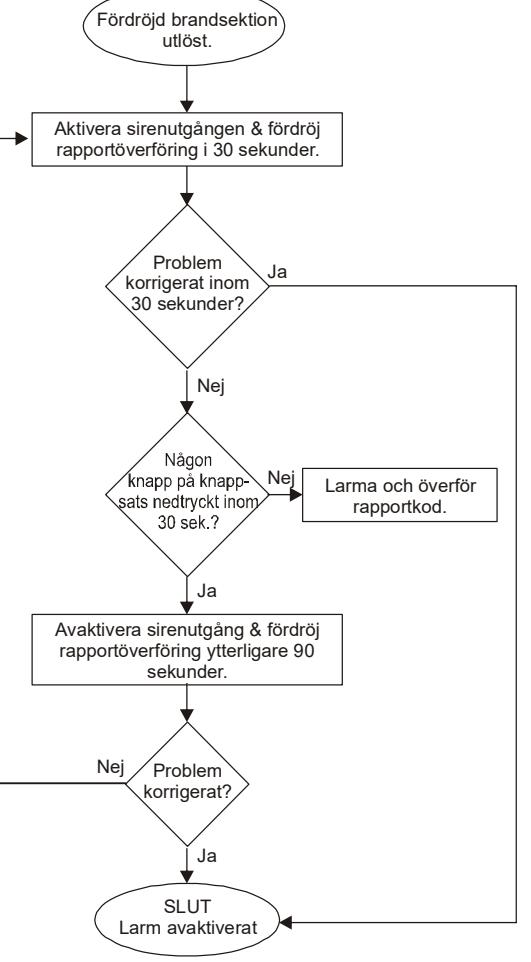

larmtyper på sidan 27. SIA FSK och CID rapporteringsformaten inkluderar specifika rapportkoder för att identifiera larmet som ett vattenlarm.

#### **7.1.21 24h fryssektion**

Adresserna **[001]** till **[032]**: Sektionerna 1 till 32, första siffrorna = **21**

När en 24h fryssektion öppnas, antingen den är tillkopplad eller frånkopplad, kommer centralen omedelbart generera ett larm. Larmet definieras av larmtyp, som konfigureras i sektionsprogrammering under sektionsoptioner **[4]** och **[5]**. Se larmtyper på sidan 27. SIA FSK och CID rapporteringsformaten inkluderar specifika rapportkoder för att identifiera larmet som ett fryslarm.

### **7.1.22 24h panik**

Adresserna **[001]** till **[032]**: Sektionerna 1 till 32, första siffrorna = **22**

När en 24h paniksektion öppnas, antingen den är tillkopplad eller frånkopplad, kommer centralen omedelbart generera ett larm. Larmet definieras av panikoptionerna som ställs in i adress **[702]**. SIA FSK och CID rapporteringsformaten inkluderar specifika rapportkoder för att identifiera larmet som ett paniklarm. Adress **[702]** option **[1]** (Panik 1) måste vara aktiverat för att 24h panik ska fungera.

### **7.1.23 Direkt inget för-larm**

Adresserna **[001]** till **[032]**: Sektionerna 1 till 32, första siffrorna = **23** Denna sektionsdefinition ignorerar Flex-direkt fördröjningen, och agerar som en traditionell direktsektion.

#### **7.1.24 Följ inget för-larm**

Adresserna **[001]** till **[032]**: Sektionerna 1 till 32, första siffrorna = **24** Denna sektionsdefinition ignorerar Flex-direkt fördröjningen, och agerar som en traditionell följsektion.

### **7.2 Sektionsdefinitionsstatus**

Det finns åtta sektionsdefinitioner som påverkas av Flexdirekt fördröjning (adress **[720]**). Följande tabell visar hur sektionsdefinitionen ändras beroende på tillkopplingsstatus och om Flexdirekt fördröjning är aktiverad. Se Sektionsdefinitionsstatus på sidan 26.

| Sektionsdefinitioner                                                                                           | Hemmatillkoppling    | Sovtillkoppling      | Full tillkoppling    |  |
|----------------------------------------------------------------------------------------------------------------|----------------------|----------------------|----------------------|--|
| 01 = Ingångsfördröjning 1                                                                                      | Ingångsfördröjning 1 | Ingångsfördröjning 1 | Ingångsfördröjning 1 |  |
| 02 = Ingångsfördröjning 2                                                                                      | Ingångsfördröjning 2 | Ingångsfördröjning 2 | Ingångsfördröjning 2 |  |
| 03 = Ingångsfördröjning 1 (full tillkoppling)                                                                  | Ej tillkopplad       | Ej tillkopplad       | Ingångsfördröjning 1 |  |
| 04 = Ingångsfördröjning 2 (full tillkoppling)                                                                  | Ej tillkopplad       | Ej tillkopplad       | Ingångsfördröjning 2 |  |
| 05 = Följ                                                                                                      | Följ*                | Följ*                | Följ                 |  |
| 06 = Följ (sov/full tillkoppling)                                                                              | Ej tillkopplad       | Följ*                | Följ                 |  |
| 07 = Följ (full tillkoppling)                                                                                  | Ej tillkopplad       | Ej tillkopplad       | Följ                 |  |
| 08 = Direkt                                                                                                    | Direkt*              | Direkt*              | Direkt               |  |
| 09 = Direkt (sov/full tillkoppling)                                                                            | Ej tillkopplad       | Direkt*              | Direkt               |  |
| 10 = Direkt (full tillkoppling                                                                                 | Ej tillkopplad       | Ej tillkopplad       | Direkt               |  |
|                                                                                                                |                      |                      |                      |  |
| 23 = Direkt inget för-larm                                                                                     | Direkt               | Direkt               | Direkt               |  |
| 24 = Följ inget för-larm                                                                                       | Följ                 | Följ                 | Följ                 |  |
| * Flexdirekt = Sektion kommer följa fördröjningen i adress [720], (default är 15 sekunder / 0 = direktsektion) |                      |                      |                      |  |

### **7.3 Sektionsområdestilldelning**

Adresserna **[001]** till **[032]**: Sektionerna 1 till 32

Centralen tillhandahåller optionen att områdesindela säkerhetssystemet i två helt oberoende system. Adresserna **[001]** till **[032]** representerar sektionerna 1 till 32 respektive, där den tredje siffran i varje av dessa adresser representerar sektionens områdestilldelning. Sektionen tilldelas till område 1 om tredje siffran = **1**, område 2 om tredje siffran = **2**, eller båda områdena om tredje siffran = **3**. För mer information, se Områdesindelning på sida 53.

#### **7.4 Sektionsoptioner**

Adresserna **[001]** till **[032]** representerar sektionerna 1 till 32 respektive. Efter att definition och områdestilldelning har matats in, välj en eller fler av följande sektionsoptioner genom att använda multipel funktionsvalsprogrammeringsmetod:

#### **7.4.1 Autosektionsnedstängning**

Adresserna **[001]** till **[032]** = Sektionerna 1 till 32

Option **[1]** AV = Autosektionsnedstängning avaktiverad

Option **[1]** PÅ = Autosektionsnedstängning aktiverad för vald sektion (default)

Om, i en enda tillkopplad period, numret av larm genererat av en sektion med autosektionsnedstängningsoptionen aktiverad överskrider numret definierat av autosektionsnedstängningsräknaren, kommer centralen ej längre generera ett larm för den sektionen. För att programmera autosektionsnedstängningsräknaren, knappa in den önskade gränsen (000=avaktiverad, 001 till 015, default = 5) i adress **[712]**. Autosektionsnedstängningsräknaren återställs varje gång en giltig kod knappas in.

### **7.4.2 Förbikopplingsbara sektioner**

Adresserna **[001]** till **[032]** = Sektionerna 1 till 32

Option **[2]** AV = Förbikoppla sektion avaktiverad

Option **[2]** PÅ = Förbikoppla sektion aktiverad för vald sektion (default)

När en användare använder förbikopplingsbara sektioner funktionen (se Förbikoppla programmering på sida X), kommer endast sektioner med förbikopplingsoptionen aktiverad programmeras som förbikopplingsbara.

#### **Programmera ej en brandsektion med förbikopplingsoptionen, eftersom centralen aldrig kommer att förbikoppla brandsektioner.**

### **7.4.3 RF sektion övervakning**

Adresserna **[001]** till **[032]** = Sektionerna 1 till 32

Option **[3]** AV = RF sektion övervakning avaktiverad

Option **[3]** PÅ = RF sektion övervakning aktiverad (default)

Centralen väntar för varje av dess tilldelade trådlösa sändare att skicka en statussignal inom en specifik tidsperiod (adress **[706]**, option [1]) för att bekräfta dess närvaro och funktionalitet. Om en enhet ej har skickat en signal inom tidsperioden, kan centralen generera ett fel, larm, och/eller skicka en rapportkod till larmcentralen. Se Feldisplay på sida 58.

### **7.4.4 Larmtyper**

Adresserna **[001]** till **[032]**: Sektionerna 1 till 32

#### **[4]** AV / **[5]** AV: *Ljudligt stadigt* (default)

När förutsättningarna för ett larm har nåtts, kommer centralen skicka den lämpliga sektionslarmrapportkoden och tillhandahåller en stadig utgång för sirener anslutna till centralens sirenutgång.

#### **[4]** AV / **[5]** PÅ: *Ljudligt pulserande larm*

När förutsättningarna för ett larm har nåtts, kommer centralen skicka den lämpliga sektionslarmrapportkoden och tillhandahåller en pulserande utgång (se Figur 9 på sida 24) för sirener anslutna till centralens sirenutgång.

#### **[4]** PÅ / **[5]** AV: *Tyst larm*

När förutsättningarna för ett larm har nåtts, kommer centralen skicka den lämpliga sektionslarmrapportkoden och kommer ej att aktivera centralens sirenutgång. ARM eller STATUS LEDarna på knappsatserna kommer blinka för att indikera ett larm och användaren måste fortfarande frånkoppla systemet.

#### **[4]** PÅ / **[5]** PÅ: *Endast rapport*

När förutsättningarna för ett larm har nåtts, kommer centralen skicka den lämpliga sektionslarmrapportkoden. Systemet behöver ej frånkopplas.

#### **7.4.5 Intellisektion**

Adresserna **[001]** till **[032]**: Sektionerna 1 till 32 Option **[6]** AV = Instellisektion avaktiverad (default) Option **[6]** PÅ = Intellisektion aktiverad

Denna funktion minskar möjligheten för falsklarm. När en sektion med Intellisektionoptionen öppnar, kommer centralen ej att omedelbart generera ett larm. Först utlöser den Intellisektionsfördröjningstimern. För att programmera Intellisektionsfördröjningstimern, knappa in önskat 3-siffrigt värde (000 till 255 sekunder, Default = 48 sekunder) i adress **[713]**. Om något av följande tillstånd inträffar under denna period, kommer centralen generera ett larm:

- Under Intellisektionsfördröjningen, en andra sektion har orsakat ett larm.
- Under Intellisektionsfördröjningen, sektionen i larm har återställt (stängt) och återinträffat (öppnat).
- Sektionen i larm förblir öppen under hela Intellisektionsfördröjningen.

#### **7.4.6 Fördröj larmsändning**

Adresserna **[001]** till **[032]**: Sektionerna 1 till 32

Option **[7]** AV = Fördröj larmsändning avaktiverad (default)

Option **[7]** PÅ = Fördröj larmsändning aktiverad

När ett larmtillstånd inträffar på en sektion med denna option aktiverad, kommer centralen aktivera sirenutgången, men kommer ej att rapportera larmet till larmcentralen innan slutet av larmsändningsfördröjningen. För att programmera larmsändningsfördröjningen, knappa in önskat 3-siffrigt värde (000 = avaktiverad, 001 till 255 sekunder) i adress **[833]**. Under denna period, kommer frånkoppling av systemet avaktivera sirenutgången och avbryta rapportkodsändningen. Denna funktion används ofta med ingångsfördröjningssektioner för att minska falsklarm skapade av nya användare som kanske ej hinner frånkoppla systemet i tid.

#### **7.4.7 Tvångssektioner**

Adresserna **[001]** till **[032]**: Sektionerna 1 till 32

Option **[8]** AV = Tvångssektion avaktiverad (default)

Option **[8]** PÅ = Tvångssektion aktiverad på vald sektion

Vilka öppna tvångssektioner som helst vid tidpunkten för tillkoppling kommer betraktas som avaktiverade av centralen. Om under denna period en avaktiverad sektion stängs, kommer centralen återgå den sektionen till aktiv status. Följaktligen kommer centralen generera larm om sektionen forceras.

**Programmera ej en brandsektion med tvångsoptionen, eftersom centralen aldrig kommer att förbikoppla brand-sektioner vid tvångstillkoppling.** 

### **7.5 Ändmotståndsektioner**

Adress **[706]**: Sektionsoptioner

Option **[2]** AV = Sektioner använder ej ändmotstånd (default)

Option **[2]** PÅ = Sektioner kräver ändmotstånd

Om alla detektorenheter anslutna till centralen har ingångsterminaler som kräver 1K motstånd, aktivera option **[2]** i adress **[706]**. För detaljer om användning av ändmotstånd, se Enkelsektionsingångar på sida 12.

### **7.6 ATS Sektionsdubblering**

Adress **[705]**: Generella sektionsoptioner

Option **[1]** AV = ATS sektionsdubblering avaktiverad (default)

Option **[1]** PÅ = ATS sektionsdubblering aktiverad

Aktivering av ATS sektionsdubblering låter dig installera två detektorenheter per ingångsterminal.

### **7.7 Sabotageingång på APR-ZX8 ID A (Central +1)**

Adress **[706]**: Generella sektionsoptioner 2

Option **[4]** AV = Sektion A (default)

Option **[4]** PÅ = Sabotageingång

Aktivering av denna option kommer att göra den första sektionen på APR-ZX8 ID A (Central +1) till en sabotageingång. I default är den en sektion.

### **7.8 Sabotageingång på APR-ZX8 ID B (Central +9)**

Adress **[706]**: Generella sektionsoptioner 2

Option **[5]** AV = Sektion B (default)

Option **[5]** PÅ = Sabotageingång

Aktivering av denna option kommer att göra den första sektionen på APR-ZX8 ID B (Central +9) till en sabotageingång. I default är den en sektion.

### **7.9 Sabotageingång på APR-ZX8 ID C (Central +17)**

Adress **[706]**: Generella sektionsoptioner 2 Option **[6]** AV = Sektion C (default) Option **[6]** PÅ = Sabotageingång Aktivering av denna option kommer att göra den första sektionen på APR-ZX8 ID C (Central +17) till en sabotageingång. I default är den en sektion.

### **7.10 ATS kabeloptioner**

Adress **[705]**: Generella sektionsoptioner Option **[2]** AV = ATS serie (default) Option **[2]** PÅ = ATS parallelldubblering aktiverad ATS sektionsdubblering kan konfigureras i antingen en serie eller parallell anslutning.

### **7.11 Sektionsingång 1 blir en 2-tråds rökingång**

Adress **[706]**: Generella sektionsoptioner Option **[3]** AV = Sektionsingång 1 är en standard sektionsingång (default) Option **[3]** PÅ = Sektionsingång 1 blir en 2-tråds rökingång Med denna option aktiverad, blir sektionsingång 1 en 2-tråds rökingång (alla centraler förutom SP5500).

### **7.12 Sektionstimers**

Adresserna **[041]** till **[044]**: Sektionerna 1 till 4

001 till 255 X 10ms, Default = 060

Sektionstimern definierar hur snabbt centralen svarar på en öppen sektion. Centralen kommer ej visa en öppen sektion på knappsatsen eller generera larm förrän den programmerade sektionstimern har gått ut. Alla andra sektionsdefinitioner och optioner kommer ej genomföras förrän sektionstimern har gått ut. Denna funktion förhindrar tillfälliga fel från att generera ett larm eller onödig rapportering.

# **8 Nyckelomkopplarprogrammering**

### **8.1 Nyckelomkopplarnumrering**

### **Endast on-board trådbundna centralsektioner.**

Nyckelomkopplarnumrering låter dig tilldela vilken som helst trådbunden ingång i systemet till någon av de 32 nyckelomkopplarsektionerna i centralen.

### **8.2 Nyckelomkopplardefinitioner**

Nyckelomkopplardefinitioner bestämmer hur en nyckelomkopplare används.

#### **8.2.1 Växlande nyckelomkopplare**

#### **Endast on-board trådbundna centralsektioner.**

För att tillkoppla ett område med växlande nyckelomkopplare, vrid omkopplaren från ON till OFF. Frånkoppla den genom att sätta den till ON positionen.

### **8.2.2 Momentan nyckelomkopplare**

#### **Endast on-board trådbundna centralsektioner.**

För att tillkoppla eller frånkoppla ett område med momentan nyckelomkopplare, vrid omkopplaren till ON positionen i tre sekunder, sedan till OFF positionen.

### **8.3 Nyckelomkopplaroptioner**

Varje nyckelomkopplarsektion kan programmeras med en eller flera optioner.

#### **8.3.1 Hemma/Sov frånkopplingsoption (nyckelomkopplare)**

#### **Endast on-board trådbundna centralsektioner:** Option 4

När aktiverad, kommer nyckelomkopplaren endast att kunna frånkoppla tilldelade hemma- eller sovtillkopplade områden. När option **[4]** är avaktiverad, kan nyckelomkopplaren frånkoppla områden som är tillkopplade med vilken tillkopplingsmetod som helst.

#### **8.3.2 Endast tillkoppling (nyckelomkopplare)**

#### **Endast on-board trådbundna centralsektioner:** Option 5

När aktiverad, kommer nyckelomkopplaren endast att kunna tillkoppla tilldelade områden. Typ av tillkoppling bestäms av de andra valda nyckelomkopplaroptionerna.

#### **8.3.3 Hemmatillkoppling (nyckelomkopplare)**

#### **Endast on-board trådbundna centralsektioner:** Option 6

Aktivering av nyckelomkopplaren kommer att hemmatillkoppla området.

#### **8.3.4 Sovtillkoppling (nyckelomkopplare)**

**Endast on-board trådbundna centralsektioner:** Option 7 Aktivering av nyckelomkopplaren kommer att sovtillkoppla området.

Endast en av tillkopplingsoptionerna (hemma, tvång, direkt och normal) kan väljas.

# **9 Trådlösa funktioner**

Centralen/centralerna tillåter tillägg av upp till trettiotvå fullt övervakade trådlösa sändare, och upp till trettiotvå programmerbara fjärrkontroller.

### **9.1 Trådlös sändare programmering**

Programmeringen av trådlösa sändare (detektorer och dörrkontakter) görs i två steg:

- 1. Tilldela den trådlösa sändaren till centralen.
- 2. Programmera sektionerna.

Trådlös programmering av sändare kan göras genom installatörssnabbmenyn i programmeringsguiden. Adresserna **[061]** till **[092]** motsvarar expansionsingångar 1 till 32 respektive.

Serienumret finns på insidan av sändaren eller så kan du använda serienummerdisplayen (adress **[960]**) för att få reda på serienumret. Sändarna måste aktiveras när de har tilldelats till centralen. För att aktivera en sändare, sätt in batterierna och stäng höljet. För att försäkra sig om korrekt synkronisering mellan centralen och sändaren, öppna och stäng sektionen som motsvarar sändaren.

#### **Hur tilldelar jag trådlösa sändare till centralen?**

- 1) Tryck **[ENTER]** knappen.
- 2) Knappa in din **[INSTALLATÖRSKOD]** (default: 0000 / 000000) eller **[SERVICEKOD]** (tom i default)
- 3) Knappa in önskat **[ADRESSNUMMER]** (från adresserna **[061]** till **[092]**).
- 4) Knappa in det 6-siffriga **[SERIENUMRET]** för den trådlösa sändaren.

#### **Hur tar jag bort tilldelade trådlösa sändare?**

- 1) Tryck **[ENTER]** knappen.
- 2) Knappa in din **[INSTALLATÖRSKOD]** (default: 0000 / 000000) eller **[SERVICEKOD]** (tom i default)
- 3) Knappa in önskat **[ADRESSNUMMER]** (från adresserna **[061]** till **[092]**).
- 4) Tryck på **[0]** knappen sex gånger för att radera serienumret.

### **9.2 Se signalstyrkan på trådlösa sändare**

Adresserna **[101]** till **[132]**

När trådlösa sändare har installerats och tilldelade till centralen, kan signalstyrkan för varje sändare verifieras i adresserna **[101]** till **[132]**. Varje adress representerar signalstyrkevisaren för varje specifik enhet. Till exempel, adress **[101]** är visaren för sektion 1 och adress **[132]** är visaren för sektion 32. Ibland ökar signalstyrkan mycket om sändaren eller centralen flyttas lite grann.

#### **Hur ser jag en trådlös sändares signalsyrka?**

- 1) Tryck **[ENTER]** knappen.
- 2) Knappa in din **[INSTALLATÖRSKOD]** (default: 0000 / 000000) eller **[SERVICEKOD]** (tom i default)
- 3) Knappa in önskat **[ADRESSNUMMER]** (från adresserna **[101]** till **[132]**).
- 4) Tryck på sändarens sabotageknapp eller öppna motsvarande sektion.
- 5) Knappsatsens nummer 1 till 10 kommer att lysa upp.

**Signalstyrkeindikator** 8 till 10 / 3 pip = Starkast signal 5 till 7 / 2 pip = Medelstark signal 1 till 4 / 1 pip = Svag signal (relokera)

### **9.3 Övervakningsoptioner**

**Övervakningsoptionerna kan ej användas med fjärrkontroller tilldelade till centralen.** 

#### **9.3.1 Förbikoppla övervakningsoptioner**

Adress **[705]**: Tillkopplings/frånkopplingsoptioner

Option **[8]** PÅ = Generera övervakningsfel om detekterad på en förbikopplad trådlös sändare sektion (default) Option **[8]** AV = Inget övervakningsfel om detekterad på en förbikopplad trådlös sändare sektion

När denna funktion är avaktiverad, kommer trådlös sändare övervakningsoptioner att följa sektionens förbikopplingsdefinition. Detta betyder att centralen ej kommer utföra någon funktion om ett övervakningsfel inträffar på en förbikopplad sektion. När funktionen är aktiverad, kommer trådlös sändare optioner att ignorera förbikopplingsdefinitionen. Detta betyder att centralen kommer generera en incident i enlighet med trådlös sändare övervakningsoptioner om ett övervak-ningsfel inträffar på en förbikopplad sektion.

### **9.3.2 RF Modul övervakningstimer inställningar**

Adress **[706]**: Övervakningsoptioner

Option **[1]** AV = Check-in övervakningsintervall är var tjugofjärde timme (default)

Option **[1]** PÅ = Check-in övervakningsintervall är var åttionde minut

Option **[1]** definierar tidsperioden som centralen förväntar sig en check-in statussignal från dess tilldelade trådlösa sändare. Till exempel, om timern är inställd på 80 minuter (option **[1]** = PÅ), förväntar sig centralen att en check-in statussignal skickas från dess tilldelade trådlösa sändare inom 80 minuter. Om centralen ej får en signal från en av dess trådlösa sändare inom den definierade tidsperioden, kan den generera ett fel, ett larm, och/eller skicka en rapportkod till larmcentralen (se Övervakningsoptioner på sida 30).

### **9.4 RF störningsövervakning**

Adress **[700]**: Sektionsoptioner

Option **[5]** AV = RF störningsövervakning avaktiverad (default)

Option **[5]** PÅ = RF störningsövervakning aktiverad

Med option **[5]** PÅ, kommer ett fel genereras när centralens RF signal störs i minst 10 sekunder.

### **9.5 Trådlös serienummerdisplay**

Adress **[960]**: Hitta trådlös serienummerdisplay

För att se den trådlösa serienummerdisplayen, knappa in adress **[960]**. Tryck på sabotageknappen på den önskade modulen som ska visas. Den första siffran i serienumret kommer lysa upp på knappsatsen. Tryck **[ENTER]** för att se nästkommande siffra. Tryck **[CLEAR]** för att gå ur.

### **9.6 Fjärrkontrollsprogrammering**

Centralen accepterar upp till trettiotvå fullt programmerbara fjärrkontroller. Att programmera fjärrkontrollerna görs i två steg:

1. Tilldela fjärrkontrollerna till centralen.

2. Programmera knapparna på fjärrkontrollerna.

### **9.6.1 Tilldela en fjärrkontroll till centralen**

Adresserna **[651]** till **[682]**: Fjärrkontrollerna 1 till 32 respektive

Fjärrkontroller tilldelas till centralen genom automatisk inlärningsmetod via master snabbmenyprogrammering eller genom att knappa in serienumret.

#### **Hur tilldelar jag en fjärrkontroll till centralen?**

- 1) Tryck **[ENTER]** knappen.
- 2) Knappa in din **[INSTALLATÖRSKOD]** (default: 0000 / 000000) eller **[SERVICEKOD]** (tom i default)
- 3) Knappa in önskat **[ADRESSNUMMER]** (från adresserna **[651]** till **[682]**).
- 4) Knappa in fjärrkontrollens sex-siffriga serienummer.

#### **9.6.2 Ta bort tilldelade fjärrkontroller**

Adresserna **[651]** till **[682]**: Fjärrkontrollerna 1 till 32 respektive Fjärrkontroller kan tas bort genom att radera motsvarande användare (se snabbmenyn i användarguiden).

#### **Hur tar jag bort en fjärrkontroll?**

- 1) Tryck **[ENTER]** knappen.
- 2) Knappa in din **[INSTALLATÖRSKOD]** (default: 0000 / 000000) eller **[SERVICEKOD]** (tom i default)
- 3) Knappa in önskat **[ADRESSNUMMER]** (från adresserna **[651]** till **[682]**).
- 4) Tryck på **[0]** knappen sex gånger för att radera serienumret.

#### **9.6.3 Programmera fjärrkontrollknapparna**

Adresserna **[611]** till **[642]**: Fjärrkontrollerna 1 till 32 respektive

Varje fjärrkontroll kan programmeras att utföra upp till 4 olika funktioner. Varje siffra i adresserna **[611]** till **[642]** representerar en knapp eller kombination av knappar. Siffrorna 1 till 4 kan programmeras, medans siffrorna 5 till 8 är reserverade för framtida användning och måste definieras som tomma (påminnelse: [SLEEP] = tom).

#### **Hur programmerar jag fjärrkontrollens knappar?**

- 1) Tryck **[ENTER]** knappen.
- 2) Knappa in din **[INSTALLATÖRSKOD]** (default: 0000 / 000000) eller **[SERVICEKOD]** (tom i default)
- 3) Knappa in önskat **[ADRESSNUMMER]** (från adresserna **[610]** till **[642]**).
- 4) Knappa in det **[HEXADECIMALA VÄRDET]** (0 till F) för den önskade knappoptionen från Tabell 4 på sida 32 i det lämpliga utrymmet. Om du ej vill programmera en knappkombination, tryck på **[SLEEP]** knappen för att hoppa över.

#### **Varning: När adress [610] används, kommer centralen att kopiera det sparade värdet i den adressen till alla fjärrkontroller.**

| Tabell 4: Knappoptioner                                                           |                                                                                   |  |
|-----------------------------------------------------------------------------------|-----------------------------------------------------------------------------------|--|
| [0] = Knapp avaktiverad*                                                          | [8] = Generera paniklarm 1                                                        |  |
| [1] = Normal/normal tvångstilloppling                                             | [9] = Generera paniklarm 2                                                        |  |
| [2] = Hemma/hemma tvångstillkoppling                                              | [0] eller [0(10)] = Generera paniklarm 3                                          |  |
| [3] = Ej tillgänglig                                                              | [OFF] = Aktiverar någon PGM som har händelsegrupp #08 som sin aktiveringshändelse |  |
| [4] = Sov/sov tvångstillkoppling                                                  | [BYP] = Aktiverar någon PGM som har händelsegrupp #09 som sin aktiveringshändelse |  |
| [5] = Ej tillgänglig                                                              | [MEM] = Aktiverar någon PGM som har händelsegrupp #10 som sin aktiveringshändelse |  |
| [6] = Ej tillgänglig                                                              | [TBL] = Aktiverar någon PGM som har händelsegrupp #11 som sin aktiveringshändelse |  |
| [7] = Ej tillgänglig                                                              | [ ] = Medicinskt larm                                                          |  |
| * Om du ej knappar in ett värde för en knapp, kommer den knappen att avaktiveras. |                                                                                   |  |

### **9.7 Trådlös knappsatstilldelning**

Adresserna **[571]** till **[578]**

*Automatisk tilldelning*: Efter centraluppstart, kommer centralen öppna ett 10 minuters fönster för automatisk tilldelning. Tryck och håll ned **[ ]** och **[BYP]** knapparna i tre sekunder på respektive knappsats. Knappsatsen tilldelas till centralen. Upp till 8 trådlösa knappsatser kan tilldelas inom 10 minuters fönstret.

*Standardtilldelning*: Tryck **[ENTER]**. Knappa in din [INSTALLATÖRSKOD] eller [SERVICEKOD]. Gå till adress(erna) **[571]** = Knappsats 1, **[572]** = Knappsats 2, **[573]** = Knappsats 3, **[574]** = Knappsats 4, **[575]** = Knappsats 5, **[576]** = Knappsats 6, **[577]** = Knappsats 7, **[578]** = Knappsats 8.

Tryck och håll ned **[ ]** och **[BYP]** knapparna i tre sekunder på respektive knappsats. Knappsatsen tilldelas till centralen. Alternativt, knappa in serienumret för MG32LRF i en av de åtta adresserna för att tilldela den till centralen.

#### **9.8 Se signalstyrkan på trådlös knappsats**

Adresserna **[591]** till **[598]**

När trådlösa knappsatser har installerats och tilldelade till centralen, kan signalstyrkan för varje sändare verifieras i adresserna **[591]** till **[598]**. Varje adress representerar signalstyrkevisaren för en specifik knappsats. Till exempel, adress **[591]** är visaren för knappsats 1 och adress **[598]** är visaren för knappsats 8. Ibland räcker det med att flytta knappsatsen en liten bit för att öka signalmottagningen markant.

#### **Hur ser jag en trådlös knappsats signalstyrka?**

- 1) Tryck **[ENTER]** knappen.
- 2) Knappa in din **[INSTALLATÖRSKOD]** (default: 0000 / 000000) eller **[SERVICEKOD]** (tom i default)
- 3) Knappa in önskat **[ADRESSNUMMER]** (från adresserna **[591]** till **[598]**).
- 4) Tryck på sändarens sabotageknapp eller öppna motsvarande knappsatssektion.
- 5) Knappsatsens nummer 1 till 10 kommer att lysa upp.

**Signalstyrkeindikator** 8 till 10 / 3 pip = Starkast signal 5 till 7 / 2 pip = Medelstark signal 1 till 4 / 1 pip = Svag signal (relokera)

#### **9.9 Trådlös knappsats optioner**

Adress **[588]**: Trådlös knappsats optioner

Om aktiverad, kommer centralen vänta för varje av dess tilldelade trådlösa sändare att skicka en statussignal inom en specifik tid för att bekräfta sin närvaro och funktionalitet.

| Option [1] AV = Knappsats 1 övervakning avaktiverad Option [1] PÅ = Knappsats 1 övervakning aktiverad (default) |
|--------------------------------------------------------------------------------------------------------------------|
| Option [2] AV = Knappsats 2 övervakning avaktiverad Option [2] PÅ = Knappsats 2 övervakning aktiverad (default) |
| Option [3] AV = Knappsats 3 övervakning avaktiverad Option [4] PÅ = Knappsats 3 övervakning aktiverad (default) |
| Option [4] AV = Knappsats 4 övervakning avaktiverad Option [4] PÅ = Knappsats 4 övervakning aktiverad (default) |
| Option [5] AV = Knappsats 5 övervakning avaktiverad Option [5] PÅ = Knappsats 5 övervakning aktiverad (default) |
| Option [6] AV = Knappsats 6 övervakning avaktiverad Option [6] PÅ = Knappsats 6 övervakning aktiverad (default) |

Option **[7]** AV = Knappsats 7 övervakning avaktiverad Option **[7]** PÅ = Knappsats 7 övervakning aktiverad (default)

Option **[8]** AV = Knappsats 8 övervakning avaktiverad Option **[8]** PÅ = Knappsats 8 övervakning aktiverad (default)

### **9.10 Trådlös knappsats Live Display läge**

Adress **[587]**: Trådlös knappsats optioner

Option **[8]** AV = Live Display läge avaktiverad Option **[8]** PÅ = Live Display läge aktiverad (default)

MG32LRF har två displaylägen. I default, visar knappsatsen alla händelser (sektioner i larm, förbikopplade sektioner, etc.) live när de inträffar. Alternativt, med Live Display läget av, kommer systemet endast visa sektioner som orsakar larm eller ingångsfördröjning. Om du vill se status för alla sektioner, tryck på **[ ]** knappen. Sektioner som är öppna men ej har utlöst ett larm kommer endast att visas efter **[ ]** knappen har tryckts. Displayen syns i 30 sekunder, och visar status för alla sektioner vid tidpunkten som **[ ]** knappen trycktes ned. Sektionsdisplayen stängs ned efter 30 sekunder.

### **9.11 Trådlös repeater programmering**

Adresserna **[545]** till **[546]** representerar trådlös repeater 1 och 2 respektive.

Den trådlösa repeatermodulen förbättrar räckvidden på ditt system genom att skicka vidare information från sektioner, PGMar, trådlösa knappsatser och centralen. Notera att alla fjärrkontrollsignaler alltid repeteras. Du kan ha två MG-RPT1 per system. Den trådlösa repeatern tillgodoser också en PGM och en sektionsingång med två-vägs trådlös kommunikation med centralen.

#### **Hur tilldelar jag trådlösa repeaters till centralen?**

- 1) Tryck **[ENTER]** knappen.
- 2) Knappa in din **[INSTALLATÖRSKOD]** (default: 0000 / 000000) eller **[SERVICEKOD]** (tom i default)
- 3) Knappa in önskat **[ADRESSNUMMER]** (från adresserna **[545]** till **[546]**).
- 4) Knappa in det 6-siffriga **[SERIENUMRET]** för den trådlösa repeatern.

#### **Hur tar jag bort tilldelade trådlösa repeaters?**

- 1) Tryck **[ENTER]** knappen.
- 2) Knappa in din **[INSTALLATÖRSKOD]** (default: 0000 / 000000) eller **[SERVICEKOD]** (tom i default)
- 3) Knappa in önskat **[ADRESSNUMMER]** (från adresserna **[545]** till **[546]**).
- 4) Tryck på **[0]** knappen sex gånger för att radera serienumret.

#### **9.12 Visa repeaterns signalstyrka**

Adresserna **[548]** till **[549]**

När repeterarna har installerats och tilldelade till centralen, kan signalstyrkan för varje repeater verifieras i adresserna **[548]** till **[549]**. Adress **[548]** är visaren för repeater 1 och adress **[549]** är visaren för repeater 2. Ibland ökar signalstyrkan mycket om repeatern eller centralen flyttas lite grann.

#### **Hur ser jag en trådlös repeaters signalsyrka?**

- 1) Tryck **[ENTER]** knappen.
- 2) Knappa in din **[INSTALLATÖRSKOD]** (default: 0000 / 000000) eller **[SERVICEKOD]** (tom i default)
- 3) Knappa in önskat **[ADRESSNUMMER]** (från adresserna **[548]** till **[549]**).
- 4) Tryck på repeaterns sabotageknapp.
- 5) Knappsatsens nummer 1 till 10 kommer att lysa upp.

**Signalstyrkeindikator** 8 till 10 / 3 pip = Starkast signal 5 till 7 / 2 pip = Medelstark signal 1 till 4 / 1 pip = Svag signal (relokera)

#### **9.13 Trådlös repeater optioner**

Adress **[587]**: Trådlös repeater optioner

Option **[1]** AV = Repeater 1 övervakning avaktiverad Option **[1]** PÅ = Repeater 1 övervakning aktiverad (default)

Option **[2]** AV = Repeater 2 övervakning avaktiverad

Option **[2]** PÅ = Repeater 2 övervakning aktiverad (default)

Om aktiverad, kommer centralen vänta för varje av dess tilldelade trådlösa repeater att skicka en statussignal inom en specificerad tid för att bekräfta sin närvaro och funktionalitet.

### **9.14 Trådlösa optioner**

#### **Adress [551] (Repeater 1) och adress [561] (Repeater 2): Trådlös repeater optioner**

*Aktivera eller avaktivera repetitionen av trådlösa knappsatser i denna adress. Aktivering av dessa optioner för knappsatser betyder att repeatern kommer skicka vidare signaler som är relevanta.* 

| Option [1] AV = Repetera trådlös knappsats 1 signaler (default) Option [1] PÅ = Repetera trådlös knappsats 1 signaler |
|--------------------------------------------------------------------------------------------------------------------------|
| Option [2] AV = Repetera trådlös knappsats 2 signaler (default) Option [2] PÅ = Repetera trådlös knappsats 2 signaler |
| Option [3] AV = Repetera trådlös knappsats 3 signaler (default) Option [3] PÅ = Repetera trådlös knappsats 3 signaler |
| Option [4] AV = Repetera trådlös knappsats 4 signaler (default) Option [4] PÅ = Repetera trådlös knappsats 4 signaler |
| Option [5] AV = Repetera trådlös knappsats 5 signaler (default) Option [5] PÅ = Repetera trådlös knappsats 5 signaler |
| Option [6] AV = Repetera trådlös knappsats 6 signaler (default) Option [6] PÅ = Repetera trådlös knappsats 6 signaler |
| Option [7] AV = Repetera trådlös knappsats 7 signaler (default) Option [7] PÅ = Repetera trådlös knappsats 7 signaler |
| Option [8] AV = Repetera trådlös knappsats 8 signaler (default)                                                          |

- Option **[8]** PÅ = Repetera trådlös knappsats 8 signaler
#### **Adress [552] (Repeater 1) och adress [562] (Repeater 2): Trådlös repeater optioner**

*Aktivera eller avaktivera repetitionen av trådlösa sektionsignaler i denna adress. Aktivering av dessa optioner för sektioner betyder att repeatern kommer skicka vidare signaler som är relevanta.*

| Option [1] AV = Repetera trådlös sektion 1 signaler (default) Option [1] PÅ = Repetera trådlös sektion 1 signaler |
|----------------------------------------------------------------------------------------------------------------------|
| Option [2] AV = Repetera trådlös sektion 2 signaler (default) Option [2] PÅ = Repetera trådlös sektion 2 signaler |
| Option [3] AV = Repetera trådlös sektion 3 signaler (default) Option [3] PÅ = Repetera trådlös sektion 3 signaler |
| Option [4] AV = Repetera trådlös sektion 4 signaler (default) Option [4] PÅ = Repetera trådlös sektion 4 signaler |
| Option [5] AV = Repetera trådlös sektion 5 signaler (default) Option [5] PÅ = Repetera trådlös sektion 5 signaler |
| Option [6] AV = Repetera trådlös sektion 6 signaler (default) Option [6] PÅ = Repetera trådlös sektion 6 signaler |
| Option [7] AV = Repetera trådlös sektion 7 signaler (default) Option [7] PÅ = Repetera trådlös sektion 7 signaler |
| Option [8] AV = Repetera trådlös sektion 8 signaler (default) Option [8] PÅ = Repetera trådlös sektion 8 signaler |

#### **Adress [553] (Repeater 1) och adress [563] (Repeater 2): Trådlös repeater optioner**

*Aktivera eller avaktivera repetitionen av trådlösa sektionsignaler i denna adress. Aktivering av dessa optioner för sektioner betyder att repeatern kommer skicka vidare signaler som är relevanta.*

- Option **[1]** AV = Repetera trådlös sektion 9 signaler (default)
- Option **[1]** PÅ = Repetera trådlös sektion 9 signaler
- Option **[2]** AV = Repetera trådlös sektion 10 signaler (default)
- Option **[2]** PÅ = Repetera trådlös sektion 10 signaler

Option **[3]** AV = Repetera trådlös sektion 11 signaler (default)

Option **[3]** PÅ = Repetera trådlös sektion 11 signaler

Option **[4]** AV = Repetera trådlös sektion 12 signaler (default) Option **[4]** PÅ = Repetera trådlös sektion 12 signaler

Option **[5]** AV = Repetera trådlös sektion 13 signaler (default)

- Option **[5]** PÅ = Repetera trådlös sektion 13 signaler
- Option **[6]** AV = Repetera trådlös sektion 14 signaler (default)
- Option **[6]** PÅ = Repetera trådlös sektion 14 signaler
- Option **[7]** AV = Repetera trådlös sektion 15 signaler (default)
- Option **[7]** PÅ = Repetera trådlös sektion 15 signaler
- Option **[8]** AV = Repetera trådlös sektion 16 signaler (default)
- Option **[8]** PÅ = Repetera trådlös sektion 16 signaler

#### **Adress [554] (Repeater 1) och adress [564] (Repeater 2): Trådlös repeater optioner**

*Aktivera eller avaktivera repetitionen av trådlösa sektionsignaler i denna adress. Aktivering av dessa optioner för sektioner betyder att repeatern kommer skicka vidare signaler som är relevanta.*

**Adress [555] (Repeater 1) och adress [565] (Repeater 2): Trådlös repeater optioner**

*Aktivera eller avaktivera repetitionen av trådlösa sektionsignaler i denna adress. Aktivering av dessa optioner för sektioner betyder att repeatern kommer skicka vidare signaler som är relevanta.*

- Option **[1]** AV = Repetera trådlös sektion 25 signaler (default) Option **[1]** PÅ = Repetera trådlös sektion 25 signaler Option **[2]** AV = Repetera trådlös sektion 26 signaler (default) Option **[2]** PÅ = Repetera trådlös sektion 26 signaler Option **[3]** AV = Repetera trådlös sektion 27 signaler (default) Option **[3]** PÅ = Repetera trådlös sektion 27 signaler Option **[4]** AV = Repetera trådlös sektion 28 signaler (default) Option **[4]** PÅ = Repetera trådlös sektion 28 signaler Option **[5]** AV = Repetera trådlös sektion 29 signaler (default) Option **[5]** PÅ = Repetera trådlös sektion 29 signaler Option **[6]** AV = Repetera trådlös sektion 30 signaler (default) Option **[6]** PÅ = Repetera trådlös sektion 30 signaler
Option **[7]** AV = Repetera trådlös sektion 31 signaler (default)

Option **[7]** PÅ = Repetera trådlös sektion 31 signaler

Option **[8]** AV = Repetera trådlös sektion 32 signaler (default)

Option **[8]** PÅ = Repetera trådlös sektion 32 signaler

#### **Adress [556] (Repeater 1) och adress [566] (Repeater 2): Trådlös repeater optioner**

*Aktivera eller avaktivera repetitionen av MG-2WPGM signaler i denna adress. Aktivering av dessa optioner för MG-2WPGMar betyder att repeatern kommer skicka vidare signaler som är relevanta.*

| Option [1] AV = Repetera trådlös 2-vägs PGM 1 signaler (default) Option [1] PÅ = Repetera trådlös 2-vägs PGM 1 signaler |
|----------------------------------------------------------------------------------------------------------------------------|
| Option [2] AV = Repetera trådlös 2-vägs PGM 2 signaler (default) Option [2] PÅ = Repetera trådlös 2-vägs PGM 2 signaler |
| Option [3] AV = Repetera trådlös 2-vägs PGM 3 signaler (default) Option [3] PÅ = Repetera trådlös 2-vägs PGM 3 signaler |
| Option [4] AV = Repetera trådlös 2-vägs PGM 4 signaler (default) Option [4] PÅ = Repetera trådlös 2-vägs PGM 4 signaler |
| Option [5] AV = Repetera trådlös 2-vägs PGM 5 signaler (default) Option [5] PÅ = Repetera trådlös 2-vägs PGM 5 signaler |
| Option [6] AV = Repetera trådlös 2-vägs PGM 6 signaler (default) Option [6] PÅ = Repetera trådlös 2-vägs PGM 6 signaler |
| Option [7] AV = Repetera trådlös 2-vägs PGM 7 signaler (default) Option [7] PÅ = Repetera trådlös 2-vägs PGM 7 signaler |
| Option [8] AV = Repetera trådlös 2-vägs PGM 8 signaler (default) Option [8] PÅ = Repetera trådlös 2-vägs PGM 8 signaler |

#### **Adress [557] (Repeater 1) och adress [567] (Repeater 2): Trådlös repeater optioner**

*Aktivera eller avaktivera repetitionen av MG-2WPGM signaler i denna adress. Aktivering av dessa optioner för MG-2WPGMar betyder att repeatern kommer skicka vidare signaler som är relevanta.*

Option **[1]** AV = Repetera trådlös 2-vägs PGM 9 signaler (default) Option **[1]** PÅ = Repetera trådlös 2-vägs PGM 9 signaler Option **[2]** AV = Repetera trådlös 2-vägs PGM 10 signaler (default) Option **[2]** PÅ = Repetera trådlös 2-vägs PGM 10 signaler Option **[3]** AV = Repetera trådlös 2-vägs PGM 11 signaler (default) Option **[3]** PÅ = Repetera trådlös 2-vägs PGM 11 signaler Option **[4]** AV = Repetera trådlös 2-vägs PGM 12 signaler (default) Option **[4]** PÅ = Repetera trådlös 2-vägs PGM 12 signaler Option **[5]** AV = Repetera trådlös 2-vägs PGM 13 signaler (default) Option **[5]** PÅ = Repetera trådlös 2-vägs PGM 13 signaler Option **[6]** AV = Repetera trådlös 2-vägs PGM 14 signaler (default) Option **[6]** PÅ = Repetera trådlös 2-vägs PGM 14 signaler Option **[7]** AV = Repetera trådlös 2-vägs PGM 15 signaler (default) Option **[7]** PÅ = Repetera trådlös 2-vägs PGM 15 signaler Option **[8]** AV = Repetera trådlös 2-vägs PGM 16 signaler (default) Option **[8]** PÅ = Repetera trådlös 2-vägs PGM 16 signaler

# **10 Tillkopplings- och frånkopplingsoptioner**

## **10.1 Växla till Hemmatillkoppling om ingen ingångsfördröjning öppnas**

Adress **[741]**: Område 1, adress **[742]** = Område 2

Option **[5]** AV = Växla till hemmatillkoppling avaktiverad (default)

Option **[5]** PÅ = Växla till hammatillkoppling aktiverad

Om en användare normaltillkopplar ett område, men går ej igenom (öppna och stäng) en ingångsfördröjningssektion under utgångsfördröjningen, kan centralen programmeras att växla från normaltillkoppling till hemmatillkoppling.

### **10.2 När fördröjningssektion förbikopplas blir följsektioner ingångsfördröjning 2**

Adress **[741]**: Område 1, adress **[742]** = Område 2 Option **[6]** AV = Följsektioner blir ingångsfördröjning 2 när fördröjningssektion förbikopplas avaktiverad (default) Option **[6]** PÅ = Följsektioner blir ingångsfördröjning 2 när fördröjningssektion förbikopplas aktiverad

Om en användare har definierat en ingångspunkt som en fördröjning, och en rörelsedetektor som en följsektion, tillåter denna option användaren att förbikoppla en fördröjningssektion så att rörelsedetektorn blir en ingångsfördröjning 2 sektion. Till exempel, om en användare har en ej fungerande dörrkontakt, kan de förbikoppla fördröjningssektionen och göra rörelsedetektorn till en ingångsfördröjning 2 sektion så att de har tillräcklig tid för att frånkoppla systemet. Alla följsektioner blir ingångsfördröjning 2 om åtminstone en fördröjningssektion förbikopplas.

### **10.3 Normal tillkoppling växlar till tvångstillkoppling**

Adress **[704]**: Tillkoppling/frånkopplingsoptioner

Option **[1]** AV = Normal tillkoppling växlar till tvångstillkoppling avaktiverad

Option **[1]** PÅ = Normal tillkoppling växlar till tvångstillkoppling aktiverad (default)

Med denna funktion aktiverad, kommer centralen alltid att tvångstillkoppla (om en tvångs-aktiverad sektion är öppen, se tvångssektioner på sida 27) istället för att normaltillkoppla när en giltig användarkod med tvångstillkopplingsoptionen knappas in.

### **10.4 Hemmatillkoppling växlar till hemmatvångstillkoppling**

Adress **[704]**: Tillkoppling/frånkopplingsoptioner

Option **[2]** AV = Hemmatillkoppling växlar till hemmatvångstillkoppling avaktiverad

Option **[2]** PÅ = Hemmatillkoppling växlar till hemmatvångstillkoppling aktiverad (default)

Med denna funktion aktiverad, kommer centralen alltid att tvångstillkoppla (om en tvångs-aktiverad sektion är öppen, se tvångssektioner på sida 27) istället för att hemmatillkoppla när en giltig användarkod med tvångstillkopplingsoptionen knappas in.

### **10.5 Sovtillkoppling växlar till sovtvångstillkoppling**

Adress **[704]**: Tillkoppling/frånkopplingsoptioner

Option **[3]** AV = Sovtillkoppling växlar till sovtvångstillkoppling avaktiverad

Option **[4]** PÅ = Sovtillkoppling växlar till sovtvångstillkoppling aktiverad (default)

Med denna funktion aktiverad, kommer centralen alltid att tvångstillkoppla (om en tvångs-aktiverad sektion är öppen, se tvångssektioner på sida 27) istället för att sovtillkoppla när en giltig användarkod med tvångstillkopplingsoptionen knappas in.

### **10.6 Ej tillkoppling vid batterifel**

Adress **[703]**: Tillkoppling/frånkopplingsoptioner Option **[5]** AV = Tillåt tillkoppling vid batterifel (default) Option **[5]** PÅ = Ej tillkoppling vid batterifel

Om denna option är aktiverad, kommer centralen ej tillkoppla systemet om centralen detekterar att backupbatteriet är urkopplat, att säkringen har gått, eller att batterispänningen sjunker under 10,5V. Centralen kommer ej tillkoppla systemet förrän alla batterifel har åtgärdats.

### **10.7 Ej tillkoppling vid sabotagefel**

Adress **[703]**: Tillkoppling/frånkopplingsoptioner Option **[6]** AV = Tillåt tillkoppling vid sabotagefel (default) Option **[6]** PÅ = Ej tillkoppling vid sabotagefel

Om denna option är aktiverad, kommer centralen ej tillkoppla systemet om centralen detekterar ett sabotagefel på en eller flera sektioner. Centralen kommer ej tillkoppla systemet förrän alla sabotagefel har åtgärdats.

**Denna funktion kommer ej att fungera om sabotageigenkänningsoptionerna (se sabotageigenkänning på sida 41) är avaktiverade eller när den saboterade sektionen förbikopplas och sabotageförbikopplingsoptionerna har aktiverats (se sabotageförbikopplingsoptioner på sida 41).** 

### **10.8 Ej tillkoppling vid trådlöst övervakningsfel**

Adress **[703]**: Tillkoppling/frånkopplingsoptioner Option **[7]** AV = Tillåt tillkoppling vid trådlöst övervakningsfel (default) Option **[7]** PÅ = Ej tillkoppling vid trådlöst övervakningsfel

Om denna option är aktiverad, kommer centralen ej tillkoppla systemet om centralen detekterar ett trådlöst övervakningsfel på en eller flera sektioner. Centralen kommer ej tillkoppla systemet förrän alla trådlösa övervakningsfel har åtgärdats.

**Denna funktion kommer ej att fungera om sabotageigenkänningsoptionerna (se sabotageigenkänning på sida 41) är avaktiverade eller när den saboterade sektionen förbikopplas och sabotageförbikopplingsoptionerna har aktiverats (se sabotageförbikopplingsoptioner på sida 41).**

### **10.9 Till-/frånkoppla med VDMP3**

Adress **[703]**: Tillkoppling/frånkopplingsoptioner Option **[8]** AV = Till-/frånkoppla med VDMP3 avaktiverad Option **[8]** PÅ = Till-/frånkoppla med VDMP3 aktiverad (default)

Om denna option är aktiverad, kan du tillkoppla/frånkoppla med VDMP3. Avaktivera optionen om du ej vill att det ska gå att tillkoppla/frånkoppla systemet via telefonen.

### **10.10Tidsinställd autotillkoppling**

Adress **[741]** = Område 1, **[742]** = Område 2 Option **[1]** AV = Tidsinställd autotillkoppling avaktiverad (default) Option **[1]** PÅ = Tidsinställd autotillkoppling aktiverad

Varje område kan programmeras att tillkoppla varje dag vid tidpunkten som specificeras av autotillkopplingstimern. Autotillkopplingsoptionerna (se sida 39) bestämmer områdets tillkopplingsmetod. Alla öppna sektioner som detekteras när ett område är autotillkopplat kommer förbikopplas oberoende av deras definition (förutom 24h sektioner). Centralen kommer att gå in i en 60-sekunders utgångsfördröjningsperiod innan systemet tillkopplas. Vid denna tidpunkt, kan autotillkoppling avbrytas genom att knappa in en giltig kod. När området har tillkopplats, kommer centralen skicka tidsinställd autotillkopplingsrapportkoden programmerad i adress **[860]**.

*Exempel: För att automatiskt tillkoppla område 2 varje dag klockan 18:15, aktivera tidsinställd autotillkoppling för område 2 genom att aktivera option [1] i adress [742]. Knappa sedan in 18:45 i adress [762].* 

#### **10.10.1 Autotillkopplingstimer**

Adress **[761]** = Område 1, **[762]** = Område 2

Välj adressen som motsvarar önskat område och programmera tiden som du vill att centralen ska försöka tillkoppla det valda området och/eller skicka sen att stänga rapportkoden.

### **10.11 Ingen rörelse autotillkoppling**

Adress **[741]** = Område 1, **[742]** = Område 2 Option **[2]** AV = Ingen rörelse autotillkoppling avaktiverad (default) Option **[2]** PÅ = Ingen rörelse autotillkoppling aktiverad

Om ingen rörelse inträffar i ett skyddat område under perioden som specificeras av Ingen rörelse timern, kan centralen automatiskt tillkoppla det området. Autotillkopplingsoptionen bestämmer områdets tillkopplingsmetod. Alla öppna sektioner som detekteras när ett område är autotillkopplat kommer förbikopplas oberoende av deras definition (förutom 24h sektioner). Vid tillkoppling, kommer centralen skicka Ingen rörelse rapportkoden om programmerad i adress **[860]**. Oberoende av att systemet lyckas tillkoppla eller ej, kommer centralen alltid skicka Ingen rörelse rapportkoden om programmerad i adress **[860]**. Om Ingen rörelse autotillkoppling är avaktiverad, kommer centralen fortfarande skicka Ingen rörelse rapportkoden vid tidpunkten som specificeras av Ingen rörelse timern.

*Exempel: För att tillkoppla område 1 närhelst det ej är någon rörelse under en 4-timmars period, aktivera Ingen rörelse autotillkoppling för område 1 genom att aktivera option [2] i adress [741]. Knappa sedan in 016 (16x15 min = 240 min = 4 timmar) i adress [749].* 

**10.11.1 Ingen rörelse timer**  Adress **[749]** = Område 1, **[750]** = Område 2 000 till 255 x 15 minuter, Default = avaktiverad Välj adressen som motsvarar önskat område och programmera in tidsintervallet utan rörelse som du vill att centralen ska vänta innan den tillkopplar och/eller skickar Ingen rörelse rapportkoden. Om ingen rörelse autotillkoppling är avaktiverad, kommer centralen fortfarande skicka ingen rörelse rapportkoden när ingen rörelse har detekterats under perioden specificerad av ingen rörelse timern.

### **10.12 Autotillkopplingsoptioner**

Adress **[741]** = Område 1, **[742]** = Område 2

| [3] | [4] |        |
|-----|-----|--------|
| AV  | AV  | Normal |
| AV  | PÅ  | Sov    |
| PÅ  | AV  | Hemma  |

När tidsinställd autotillkoppling eller ingen rörelse autotillkoppling används, kan centralen normal-, sov- eller hemmatillkoppla det valda området.

### **10.13 Snabbtillkoppling**

Adress **[703]**: Optionerna **[1]** till **[3]** Option **[1]** PÅ = Tryck och håll ned **[ARM]** knappen för snabbnormaltillkoppling. Option **[2]** PÅ = Tryck och håll ned **[STAY]** knappen för snabbhemmatillkoppling. Option **[3]** PÅ = Tryck och håll ned **[SLEEP]** knappen för snabbsovtillkoppling.

Snabbtillkopplingsfunktionerna tillåter användare att tillkoppla systemet utan att behöva knappa in koder. För att tillkoppla systemet, tryck och håll ned lämplig knapp (se ovan) i ungefär 3 sekunder. Om systemet är områdesindelat, måste du även trycka ned knappen som motsvarar det område du vill tillkoppla.

### **10.14 Snabbtillkoppling förbigå programmering**

Adress **[703]**: Option **[4]** Option **[4]** PÅ = Tryck och håll ned **[BYP]** knappen för snabbtillkoppling förbigå programmering.

Förbigå programmering tillåter användare att programmera larmsystemet att ignorera (avaktivera) specificerade sektioner nästa gång systemet tillkopplas. Tryck och håll ned **[BYP]** knappen i tre sekunder för att gå in i förbigå programmering läget.

### **10.15 Utgångsfördröjning**

Adress **[745]** = Område 1, **[746]** = Område 2 001 till 255 sekunder, Default = 60 sekunder

Efter att den obligatoriska tillkopplingssekvensen knappats in (användarkoder etc.), bestämmer utgångsfördröjningsparametern hur lång tid en användare har på sig att lämna det skyddade området innan centralen tillkopplar området. Utgångsfördröjningen gäller för alla sektioner i det valda området. När aktiverad, kommer knappsatsen pipa en gång varje sekund under utgångsfördröjningen och pipa snabbt under de sista 10 sekunderna av utgångsfördröjningen.

#### **10.15.1 Pip vid utgångsfördröjning**

Adress **[704]**: Tillkoppling/frånkopplingsoptioner Option **[6]** AV = Pip vid utgångsfördröjning avaktiverad Option **[6]** PÅ = Pip vid utgångsfördröjning aktiverad (default)

### **10.16 Sirenpip vid till-/frånkoppling med knappsats**

Adress **[704]**: Tillkoppling/frånkopplingsoptioner Option **[5]** AV = Sirenpip vid till-/frånkoppling avaktiverad (default) Option **[5]** PÅ = Sirenpip vid till-/frånkoppling aktiverad

När denna funktion är aktiverad, kommer sirenen att pipa en gång vid tillkoppling och två gånger vid frånkoppling via knappsatsen.

#### **10.17 Sirenpip vid till/frånkoppling med fjärrkontroll**

Adress **[704]**: Tillkoppling/frånkopplingsoptioner Option **[4]** AV = Sirenpip vid till-/frånkoppling med fjärrkontroll avaktiverad (default) Option **[4]** PÅ = Sirenpip vid till-/frånkoppling med fjärrkontroll aktiverad

När denna funktion är aktiverad, kommer sirenen att pipa en gång vid tillkoppling med en fjärrkontroll.och två gånger vid frånkoppling med en fjärrkontroll.

## **10.18 Ingen utgångsfördröjning vid tillkoppling med fjärrkontroll**

Adress **[704]**: Tillkoppling/frånkopplingsoptioner

Option **[8]** AV = Utgångsfördröjning vid tillkoppling med en fjärrkontroll (default)

Option **[8]** PÅ = Ej utgångsfördröjning vid tillkoppling med en fjärrkontroll

När optionen är aktiverad, kommer centralen avbryta utgångsfördröjningen (tillkopplar direkt) när ett område tillkopplas med en fjärrkontroll. När avaktiverad, kommer utgångsfördröjningstimern starta när ett område tillkopplas med en fjärrkontroll.

### **10.19 Inga utgångsfördröjningspip och inga sirenpip vid hemma-/sovtillkoppling**

Adress **[704]**: Tillkoppling/frånkopplingsoptioner

Option **[7]** AV = Inga utgångsfördröjningspip och inga sirenpip vid hemma-/sovtillkoppling avaktiverad

Option **[7]** PÅ = Inga utgångsfördröjningspip och inga sirenpip vid hemma-/sovtillkoppling aktiverad (default)

När denna funktion är aktiverad, kommer centralen förhindra sirenen och knappsatserna från att pipa under utgångsfördröjningen när ett område är hemma-/sovtillkopplat.

### **10.20 Utgångsfördröjning termination**

Adress **[700]**: Tillkoppling/frånkopplingsoptioner Option **[6]** AV = Utgångsfördröjning termination avaktiverad Option **[6]** PÅ = Utgångsfördröjning termination aktiverad (default)

När option [6] är aktiverad (PÅ), kommer centralen minska utgångsfördröjningen till 10 sekunder när en ingångsfördröjningssektion öppnas och stängs under utgångsfördröjningen.

*Exempel: 15 sekunder in i en 45-sekunders utgångsfördröjning, kommer en ingångsfördröjningssektion öppnas och stängas. De resterande 30 sekunderna reduceras till 10 sekunder.* 

### **10.21 Snabbutgång**

När systemet redan är hemma- eller sovtillkopplat: Denna funktion låter dig gå ut och hålla systemet tillkopplat. Tryck och håll ned **[OFF]** knappen i 3 sekunder för att starta utgångsfördröjningen. Efter att utgångsfördröjningen har gått ut, kommer systemet återgå till det tidigare tillkopplingsläget.

# **11 Larmoptioner**

### **11.1 Sirenavstängningstid**

Adress **[747]** = Område 1, **[748]** = Område 2 000 = avaktiverad, 001 till 255 minuter, default = 4 minuter

Efter ett ljudligt larm, kommer sirenen stängas av vid frånkoppling av området eller när sirenavstängningstiden har gått ut, beroende på vilket som händer först.

### **11.2 Återanvänd larm**

Efter att sirenavstängningstiden och återanvändningstiden har gått ut, kommer centralen återverifiera sektionsstatus. Om det finns några öppna sektioner, kommer centralen generera larm. I en tillkopplingsperiod, kommer centralen upprepa denna sekvens så många gånger som definieras av återanvändningstiden.

### **11.2.1 Återanvänd larm fördröjning**

Adress **[714]**

000 = avaktiverad, 001 till 255 minuter, default = avaktiverad

Återanvänd larm fördröjning bestämmer hur lång tid efter sirenavstängning som centralen kommer att vänta innan den återverifierar sektionsstatus.

#### **11.2.2 Återanvänd larm räknare**

Adress **[715]**

000 = avaktiverad, 001 till 255, default = avaktiverad

Återanvänd larm räknare bestämmer hur många gånger efter sirenavstängning som centralen kommer att återverifiera sektionsstatus under en tillkopplingsperiod.

### **11.3 Sabotageigenkänning**

#### **11.3.1 Sektioner/RF modul och knappsats/bussmodul sabotageigenkänning**

Adress **[705]**: Sabotageigenkänningsoptioner

| [3]                                                                                          | [4] | Sektioner/RF modul sabotageigenkänningsoptioner | Knappsats/bussmodul sabotageigenkänningsoptioner* |
|----------------------------------------------------------------------------------------------|-----|-------------------------------------------------|---------------------------------------------------|
| AV                                                                                           | AV  | Avaktiverad                                     | Avaktiverad                                       |
| AV                                                                                           | PÅ  | ENDAST FEL                                      | ENDAST FEL                                        |
| PÅ                                                                                           | AV  | När frånkopplad: ENDAST FEL                     | ENDAST FEL                                        |
|                                                                                              |     | När tillkopplad: Följ sektionens larmtyp        |                                                   |
| PÅ                                                                                           | PÅ  | När frånkopplad: LJUDLARM                       | LJUDLARM                                          |
|                                                                                              |     | När tillkopplad: Följ sektionens larmtyp        |                                                   |
| * Sabotageigenkänning på knappsats/bussmodul endast om adress [700] option [7] är aktiverad. |     |                                                 |                                                   |

Om en enhet har saboterats (t.ex. om sabotageknappen har stängts av), kan centralen generera ett fel, ett larm, och/eller skicka en rapportkod till larmcentralen. Systemet kommer att reagera olika på en RF sektion och en knappsats/bussmodul.

#### **11.4 RF modul övervakning**

Adress **[705]**: Övervakningsoptioner

| [6] | [7] | RF övervakningsoptioner                  | Knappsats/bussmodul övervakningsoptioner |
|-----|-----|------------------------------------------|------------------------------------------|
| AV  | AV  | Avaktiverad                              | Avaktiverad                              |
| AV  | PÅ  | ENDAST FEL                               | ENDAST FEL                               |
| PÅ  | AV  | När frånkopplad: ENDAST FEL              | ENDAST FEL                               |
|     |     | När tillkopplad: Följ sektionens larmtyp |                                          |
| PÅ  | PÅ  | När frånkopplad: LJUDLARM                | LJUDLARM                                 |
|     |     | När tillkopplad: Följ sektionens larmtyp |                                          |

Centralen väntar för varje av dess tilldelade trådlösa sändare att skicka en statussignal inom en specificerad tidsperiod för att bekräfta sin funktionalitet. Om en enhet ej har skickat en signal inom tidsperioden, kan centralen generera ett fel, ett larm, och/eller skicka en rapportkod till larmcentralen. Systemet kommer att reagera olika på en RF sektion och en knappsats/bussmodul.

### **11.5 Sabotageförbikopplingsoptioner**

Adress **[705]**: Sektionsoptioner

Option **[5]** AV = Sabotage på förbikopplade sektioner kommer ignoreras

Option **[5]** PÅ = Kommer generera ett sabotagefel om detekterat på en förbikopplad sektion (default)

Med option **[5]** av, kommer sabotageigenkänningsfunktionen följa sektionens förbikopplingsdefinition. Detta betyder att centralen kommer att ignorera sabotage detekterade i en förbikopplad sektion. Med option **[5]** på, ignorerar sabotageigenkänning förbikopplingsdefinitionen. Detta betyder att centralen kommer generera en incident enligt sabotageigenkänningsinställningarna om ett sabotage eller ledningsfel inträffar på en förbikopplad sektion.

### **11.6 Sabotageövervakning på bussmodulen**

Adress **[700]**: Övervakningsoptioner Option **[7]** AV = Sabotageövervakning avaktiverad (default) Option **[7]** PÅ = Sabotageövervakning aktiverad När centralen detekterar ett sabotage på en bussmodul, kommer centralen generera ett larm eller fel, såvida inte sabotageövervakningen är avaktiverad.

### **11.7 Knappsatspanikoptioner**

Adress **[702]**: Allmäna optioner Option **[1]** AV = Panik 1 avaktiverad (default) Option **[1]** PÅ = Panik 1 aktiverad

Nedtryckning av knapparna **[1]** och **[3]** samtidigt på knappsatsen i 3 sekunder genererar ett tyst eller ljudligt larm som definieras i option **[4]**.

Option **[2]** AV = Panik 2 avaktiverad (default) Option **[2]** PÅ = Panik 2 aktiverad

Nedtryckning av knapparna **[4]** och **[6]** samtidigt på knappsatsen i 3 sekunder genererar ett tyst eller ljudligt larm som definieras i option **[5]**.

Option **[3]** AV = Panik 3 avaktiverad (default) Option **[3]** PÅ = Panik 3 aktiverad

Nedtryckning av knapparna **[7]** och **[9]** samtidigt på knappsatsen i 3 sekunder genererar ett tyst eller ljudligt larm som definieras i option **[6]**.

Option **[4]** AV = Panik 1 är tyst (default) Option **[4]** PÅ = Panik 1 är ljudligt Option **[5]** AV = Panik 2 är tyst (default) Option **[5]** PÅ = Panik 2 är ljudligt Option **[6]** AV = Panik 3 är tyst (default) Option **[6]** PÅ = Panik 3 är ljudligt

#### **Tyst larm:**

Centralen avger ett konfirmationspip och skickar lämplig panikrapportkod om programmerad i adress **[863]**. Centralen kommer ej aktivera knappsatssummers eller centralens sirenutgång (ej ljudliglt larm).

#### **Ljudligt larm:**

Samma som tyst larm, förutom att knappsatssummers och sirenutgången kommer aktiveras tills en användare avbryter larmet (frånkopplar) med en giltig användarkod eller när sirenavstängningstiden går ut (se Sirenavstängningstid på sida 41).

Om systemet är områdesindelat eller inte, kommer centralen rapportera alla paniklarm till område 1.

### **11.8 Panik avstängningstimer**

Adress **[718]**

När ett paniklarm aktiveras, kan centralen ignorera frånkopplingssignalen från en fjärrkontroll under en specificerad period. Detta förhindrar en attackerare från att frånkoppla systemet genom fjärrkontrollen i en paniksituation. I adress **[718]** knappa in ett 3-siffrigt värde (000 till 255, 000 = avaktiverad) som representerar antal sekunder som fjärrkontrollen kommer vara utlåst från systemet.

### **11.9 Flex-direkt fördröjning**

Adress **[720]**

Flex-direkt fördröjning används för att förhindra falsklarm när lokalerna är Hemma/sovtillkopplade. I adress **[720]** knappa in ett 3-siffrigt värde (000 till 255, 000 = avaktiverad) som representerar antal sekunder som centralen kommer fördröja ett larm för att låta dig frånkopppla systemet (default 15 sekunder).

# **12 Rapportering och uppringaroptioner**

Följande kapitel förklarar alla funktioner och optioner som måste programmeras för att ditt säkerhetssystem korrekt ska rapportera systemhändelser till en larmcentral. När en händelse (t.ex. sektion i larm) inträffar i systemet, kommer centralen verifiera om en rapportkod är programmerad i adressen motsvarande händelsen (förutom Ademco Contact ID "Alla koder"). Om en rapportkod programmerats, kommer centralen ringa larmcentralens telefonnummer som definieras i Händelseuppringarriktningsfunktionen. När larmcentralen svarar, skickar centralen Systemkontokoden, följd av den programmerade rapportkoden.

### **12.1 Sektionsrapporteringskoder**

Adresserna **[141]** till **[172]**

En rapportkod kan bli programmerad för varje av de tillgängliga 32 sektionerna. När ett larm, larmåterställning, sabotage, eller sabotageåterställning intråffar på en sektion, kommer centralen skicka den lämpliga rapportkoden till larmcentralen.

### **12.2 Användarrapporteringskoder**

Adresserna **[471]** till **[502]**

En rapportkod kan bli programmerad för varje av de tillgängliga 32 sektionerna. När en användare tillkopplar, frånkopplar eller avbryter ett larm, kommer centralen skicka den lämpliga rapportkoden till larmcentralen.

### **12.3 Specialtillkopplingsrapportkoder**

Adresserna **[860]** och **[861]**

När systemet är tillkopplat med en av specialtillkopplingsfunktionerna nedan, kommer centralen skicka den lämpliga rapportkoden till larmcentralen och identifiera hur systemet var tillkopplat.

Adress **[860]** 

- **Auto-tillkoppling:** Ett område har tillkopplat sig själv vid den programmerade tidpunkten.
- **Sen att stänga:** Rapporterar varje dag vid tidpunkten specificerad av Auto-tillkopplingstimern.
- **Ingen rörelse:** Ingen rörelse har detekterats under den programmerade tiden i området.
- **Partiell tillkoppling:** Ett område var hemma, sov, eller tvångstillkopplad eller tillkopplad med förbikopplade sektioner.

Adress **[861]**

- **Snabbtillkoppling:** Ett område tillkopplades med "One-touch"-tillkopplingsmetod.
- **Tillkoppling via PC:** Ett område tillkopplades med Winload-mjukvaran.
- Ej tillgänglig
- Ej tillgänglig

### **12.4 Specialfrånkopplingsrapportkoder**

Adress **[862]**

När en av specialfrånkopplingsfunktionerna används, kan centralen skicka rapportkoden till larmcentralen och identifiera hur systemet frånkopplades.

- **Avbryt auto-tillkoppling:** Ett område frånkopplas under Timade auto-tillkopplingens 60-sekunders utgångsfördröjning. Rapporterar endast om Frånkopplingsrapporteringsoptionerna är inställda på att alltid rapportera frånkoppling.
- **Frånkoppla via PC:** Systemet frånkopplas med WinLoad mjukvaran. Rapporterar endast om Frånkopplingsrapporteringsoptionerna är inställda på att alltid rapportera frånkoppling.
- **Avbryt larm med användare eller WinLoad:** Ett larm avbryts med WinLoad mjukvaran.
- **Avbryt medicinskt larm:** Ett medicinskt larm avbryts.

### **12.5 Speciallarmrapportkoder**

Adresserna **[863]** och **[864]**

När systemet genererar ett larm på grund av ett av tillstånden nedan, kan centralen skicka den lämpliga rapportkoden till larmcentralen och identifiera typ av larm.

Adress **[863]**

- **Nödsituationpanik:** Panikknapparna **[1]** och **[3]** har tryckts ned.
- **AUX-panik:** Panikknapparna **[4]** och **[6]** har tryckts ned.
- **Brandpanik:** Panikknapparna **[7]** och **[9]** har tryckts ned.

- **Nyligen stängd:** Rapporterar när ett larm genereras efter tillkoppling av systemet inom perioden definierad av Nyligen stängd fördröjning.
Adress **[864]**

- **Sektionsnedstängning:** En sektion kommunicerar mer än det programmerade antalet sändningar i en enda tillkopplad period.
- **Hot:** En hotkod har knappats in.
- **Knappsatsutelåsning:** Om flera ogiltiga koder har knappats in på knappsatsen, kan centralen ställas in att neka tillgång från alla knappsatser under en specificerad period.
- **Medicinskt larm:** Ett medicinskt larm skickas till larmcentralen.

### **12.6 Systemfelrapportkoder**

Adresserna **[865]** till **[869]**

När systemet genererar någon av händelserna nedan, kan centralen skicka den lämpliga rapportkoden till larmcentralen och identifiera typ av systemfel.

Adress **[865]**

- Ej tillgänglig
- **AC fel:** Centralen har detekterat förlust av AC-ström. Sändning av denna rapportkod kan fördröjas.
- **Batterifel:** Backupbatteri är urkopplad eller urladdat.
- **AUX-försörjning:** AUX-strömförsörjning har överbelastats.

#### Adress **[866]**

- **Sirenutång överbelastad:** Sirenutgången har överbelastats.
- **Sirenutgång urkopplad:** Enheter anslutna till sirenutgången har kopplats ur.
- **Timerförlust:** Centralen har detekterat ett tidsfel.
- **Brandkretsfel:** Centralen har detekterat ett sabotagefel i en brandsektion.

Adress **[867]**

- **Misslyckas att kommunicera:** Centralen har misslyckats med alla försök att kommunicera med larmcentralen. Rapportkoden kommer skickas vid nästa lyckade försök.
- **RF störning:** Kommer rapportera om RF signalen störs ut.
- **Modulfel:** Centralen har misslyckats att kommunicera med en eller flera moduler (inklusive knappsatser).
- **Modulsabotage:** Sabotageknappen på en modul (inklusive knappsatser) har utlösts.

Adress **[868]**

- **Modul AC fel:** AC-spänningen på en modul har sjunkit under rekommenderad gräns.
- **Modul lågt/inget batteri:** Batterispänningen på en modul har sjunkit under rekommenderad gräns.
- **Trådlös sektion lågt batteri:** Batterispänningen på en trådlös sändare har sjunkit under rekommenderad gräns.
- **Trådlös sektion övervakningsfel:** Centralen har förlorat kommunikation med en trådlös sektion.

Adress **[869]**

- **Trådlös PGM övervakningsfel:** Centralen har förlorat kommunikation med en trådlös PGM.
- **Trådlös PGM sabotage:** Sabotageknappen på en trådlös PGM har utlösts.
- Ej tillgänglig
- Ej tillgänglig

#### **12.7 Systemfelåterställningsrapportkoder**

Adresserna **[870]** till **[874]**

När systemet återställer ett av felen som listas i Systemfelrapportkoder ovan, kan centralen skicka den lämpliga rapportkoden till centralen och identifiera typ av systemfelåterställning. Om telefonlinjeövervakning är aktiverad, kan centralen också skicka en TLÖ återställningsrapportkod.

#### **12.8 Systemspecialrapportkoder**

Adresserna **[875]** och **[876]**

När systemet genererar en av händelserna nedan, kan centralen skicka den lämpliga rapportkoden till larmcentralen och identifiera typ av systemhändelse.

#### Adress **[875]**

- **Kallstart:** Centralen stängdes ned helt (inget batteri, ingen AC) och startades om.
- **Testrapport:** En testrapport har genererats automatiskt.
- **WinLoad In:** Centralen har påbörjat kommunikation med WinLoad.

- **WinLoad Ut:** Centralen har slutat kommunikation med WinLoad.
Adress **[876]**

- **Installatör In:** Installatör/Service har gått in i programmeringsläge.
- **Installatör Ut:** Installatör/Service har gått ur programmeringsläge.
- **Stängningsförseelse:** Centralen kommer skicka en stängningsförseelserapportkod om systemet ej har tillkopplats inom ett programmerat antal dagar.
- Ej tillgänglig

#### **12.9 Rensa rapporteringskoder**

Adress **[966]**: Rensa rapporteringskoder

- Option **[1]** AV = Rensa sektionsrapporteringskoder
- Option **[1]** PÅ = Rensa sektionsrapporteringskoder (default)
- Option **[2]** AV = Rensa användarrapporteringskoder
- Option **[2]** PÅ = Rensa användarrapporteringskoder (default)
- Option **[3]** AV = Rensa tillkoppla/frånkoppla/larm rapporteringskoder
- Option **[3]** PÅ = Rensa tillkoppla/frånkoppla/larm rapporteringskoder (default)
- Option **[4]** AV = Rensa felrapporteringskoder
- Option **[4]** PÅ = Rensa felrapporteringskoder (default)

Aktivera alla optioner du vill ska rensas. Respektive set rapporteringskoder kommer rensas efter att du har gått ut ur adressen.

### **12.10 Återställ rapporteringskoder**

Adress **[967]**: Återställ rapporteringskoder

- Option **[1]** AV = Återställ sektionsrapporteringskoder
- Option **[1]** PÅ = Återställ sektionsrapporteringskoder (default)
- Option **[2]** AV = Återställ användarrapporteringskoder
- Option **[2]** PÅ = Återställ användarrapporteringskoder (default)
- Option **[3]** AV = Återställ tillkoppling/frånkoppling/larmrapporteringskoder
- Option **[3]** PÅ = Återställ tillkoppling/frånkoppling/larmrapporteringskoder (default)
- Option **[4]** AV = Återställ felrapporteringskoder
- Option **[4]** PÅ = Återställ felrapporteringskoder (default)

Aktivera alla optioner du vill ska återställas till default. Respektive set rapporteringskoder kommer återställas efter att du har gått ut ur adressen.

#### **12.11Larmcentraltelefonnummer**

Adress **[815]** = Telefon# 1, **[816]** = Telefon# 2, **[817]** = Backuptelefon# 3, **[818]** = Personsökar# 1, **[819]** = Numeriskt meddelande skickat med personsökarrapportering: Upp till 32 siffror

Centralen kan ringa upp till 2 olika larmcentraltelefonnummer. Du kan knappa in vilken siffra som helst från 0 till 9 och även specialknappar eller funktioner (se tabell 5 på sida 45) upp till ett maximum av 32 siffror. Efter maximalt antal uppringningsförsök (se Maximalt antal uppringningsförsök på sida 47) till ett larmcentraltelefonnummer har misslyckats, kommer centralen ringa backuptelefonnumret. Om den alternativa uppringningsoptionen (se Alternativ uppringningsoption på sida 48) är aktiverad, kommer centralen ringa det programmerade backuptelefonnumret efter varje misslyckat försök. Om inget backuptelefonnummer är programmerat, kommer centralen aldrig att rapportera till backuptelefonnumret. Se även Fördröjning mellan uppringningsförsök på sida 47.

| Tryck   | Aktion eller värde                                 |
|---------|----------------------------------------------------|
| [OFF]   | *                                                  |
| [BYP]   | #                                                  |
| [MEM]   | byt från puls till tonuppringning eller vice versa |
| [TBL]   | 4-sekunders paus                                   |
| [SLEEP] | tar bort nuvarande siffra                          |
| [ ]  | lägger till blanksteg                              |

Tabell 5: Specialknappar för telefonnummer

#### **12.12Personliga uppringningsnummer**

Personliga uppringningsnummer är personliga nummer (som t.ex. mobil, kontor) som centralen kan ringa vid larm eller panik. För att programmera dessa fem nummer se Kommunikationsmenyn i antingen Master eller Snabbmenyn. För att ställa in uppringningsparametrarna, se optionerna **[5]**, **[6]** och **[7]** i adress **[804]**.

Centralen kommer ringa dessa personliga nummer om programmerade i händelse av panik eller larm (default) och avge ett sirenpip. För att programmera fördröjningen mellan uppringningsförsök, se adress **[832]**. Centralen kan också programmeras att fördröja innan den avger ett sirenpip, vilket kan programmeras i adress **[836]**.

Default-fördröjningen är 20 sekunder. För att bestämma längden tid sirenpipet hörs på telefonlinjen, se adress **[837]**. Default-värdet är 003, vilket betyder att 10-sekunders sirenpipet kommer upprepas 3 gånger efter initialsekvensen (totalt = 40 sekunder).

### **12.13 Rapporteringsformat**

Adress **[810]**: Första siffran = format för telefon #1, Andra siffran = format för telefon #2

Centralen kan använda ett antal olika rapporteringsformat och varje larmcentraltelefonnummer kan programmeras med ett annat rapporteringsformat. Den första siffran som knappas in i adress **[810]** representerar rapporteringsformatet som används för att kommunicera med larmcentraltelefonnummer 1, den andra siffran representerar rapporteringsformatet som används för att kommunicera med larmcentraltelefonnummer 2. Backuptelefonnumret använder samma rapporteringsformat som det senast ringda larmcentraltelefonnumret.

| Inknappat värde | Rapporteringsformat                        |
|-----------------|--------------------------------------------|
| 0               | Ademco Slow (1400Hz, 1900Hz, 10BPS)        |
| 1               | Silent Knight Fast (1400Hz, 1900Hz, 10BPS) |
| 2               | SESCOA (2300Hz, 1800Hz, 20BPS)             |
| 3               | Ademco Express (DTMF 4+2)                  |
| 4               | Ademco Contact ID                          |
| 5               | SIA                                        |

Tabell 6: Rapporteringsformat

#### **12.13.1 Standardpulsformat**

Centralen kan använda Ademco Slow, Silent Knight och Sescoa standardpulsrapporteringsformat som kommer skicka 2 siffriga (00 till FF) rapportkoder programmerade i adresserna **[860]** till **[876]** (se tabell 6 på sida 46).

#### **12.13.2 Ademco Express**

Ademco Express är ett höghastighetsrapporteringsformat, som kommer skicka 2-siffriga (00 till FF) rapportkoder programmerade i adresserna **[860]** till **[876]**.

#### **12.13.3 Ademco Contact ID**

Ademco Contact ID är ett snabbt kommunikationsformat som använder tonrapportering istället för pulsrapportering. Detta kommunikationsformat använder också en fördefinierad lista av industristandardmeddelanden och rapportkoder som kommer passa dina mest grundläggande installationsbehov. Var god referera till Contact ID rapportkodlista i Programmeringsguiden för en komplett lista av dessa rapportkoder och meddelanden. Om rapporteringskoderna är inställda på 0xFF, kommer centralen skicka den lämpliga rapportkoden från den automatiska rapportkodlistan i programmeringsguiden. Alternativt så kan rapportkoderna programmeras genom att använda Ademco Contact ID rapportkoder i programmeringsguiden.

#### **12.13.4 Händelseuppringarriktning**

- Adress **[802]**: Optionerna [1] till [3]; Tillkoppling/frånkoppling
- Option **[1]** PÅ = Ring larmcentraltelefonnummer 1
- Option **[2]** PÅ = Ring larmcentraltelefonnummer 2
- Option **[3]** PÅ = Ring personsökarnummer

Adress **[802]**: Optionerna [5] till [7]; Larm/larmåterställning

- Option **[5]** PÅ = Ring larmcentraltelefonnummer 1
- Option **[6]** PÅ = Ring larmcentraltelefonnummer 2
- Option **[7]** PÅ = Ring personsökarnummer

Adress **[803]**: Optionerna [1] till [3]; Sabotage/sabotageåterställning

Option **[1]** PÅ = Ring larmcentraltelefonnummer 1

- Option **[2]** PÅ = Ring larmcentraltelefonnummer 2
- Option **[3]** PÅ = Ring personsökarnummer

Adress **[803]**: Optionerna [5] till [7]; Fel/felåterställning

- Option **[5]** PÅ = Ring larmcentraltelefonnummer 1
- Option **[6]** PÅ = Ring larmcentraltelefonnummer 2
- Option **[7]** PÅ = Ring personsökarnummer

Adress **[804]**: Optionerna [1] till [3]; Specialrapportering

Option **[1]** PÅ = Ring larmcentraltelefonnummer 1 Option **[2]** PÅ = Ring larmcentraltelefonnummer 2 Option **[3]** PÅ = Ring personsökarnummer

Adress **[804]**: Optionerna [5] till [7]; Specialrapportering Option **[1]** PÅ = Ring röst vid sektionslarm (inbrott/brand) Option **[2]** PÅ = Ring röst vid paniklarm Option **[3]** PÅ = Ring röst vid medicinskt larm

Händelserna är indelade i sex grupper (se ovan) där varje händelsegrupp kan programmeras att ringa upp till tre telefonnummer (larmcentraltelefonnummer 1 & 2 och personsökarnumret).

När en rapporterbar händelse inträffar i systemet, kommer centralen börja ringa numren i följande ordning från larmcentraltelefonnummer 1 (om aktiverad), hoppa över alla avaktiverade nummer och stoppa när alla valda telefonnummer har ringts upp. Efter ett visst antal misslyckade försök (adress **[831]**) att ringa larmcentralen, kommer centralen ringa det valda backuptelefonnumret (om aktiverad; se Programmeringsguiden).

Om den alternativa uppringningsoptionen är aktiverad, kommer centralen ringa det programmerade backuptelefonnumret (om aktiverad) efter varje misslyckat försök. Om inget backuptelefonnummer är programmerat, kommer centralen aldrig rapportera till backuptelefonnumret.

*Exempel: Systemet är tillkopplat och sektion 1 har utlöst ett larm. Om optionerna [5] och [7] är AV och option [6] är PÅ i adress [802], kommer centralen försöka kommunicera med larmcentraltelefon# 2.* 

#### **12.13.5 Kontonummer**

Adress **[811]**: Område 1, Adress **[812]**: Område 2

Alla rapportkoder föregås av ett 4-siffrigt eller 3-siffrigt områdeskontonummer för att säkerställa korrekt identifikation i ett områdesindelat system. Områdeskontonummer kan vara en hexadecimal siffra från 1 till F. För att knappa in ett 3-siffrigt kontonummer, tryck **[SLEEP]**-knappen följt av ett 3-siffrigt kontonummer. Även när 3-siffriga kontonummer används, måste du använda 1-siffriga rapportkoder.

### **12.14 Uppringningsmetod**

Adress **[800]**: Uppringaroptioner Option **[6]** AV = Pulsuppringning (se Pulsförhållande på sida 47) Option **[6]** PÅ = Ton/DTMF uppringning (default)

### **12.15Pulsförhållande**

Adress **[800]**: Uppringaroptioner Option **[7]** AV = Europeiskt pulsförhållande av 1:2 Option **[7]** PÅ = U.S.A. pulsförhållande av 1:1,5 (default)

När pulsuppringning används, kan du välja en av två pulsförhållanden. Även om de flesta Europeiska länder använder ett pulsförhållande av 1:2, kan 1:1,5 förhållandet i vissa fall ge bättre resultat.

### **12.16Maximalt antal uppringningsförsök**

Adress **[831]** 000 till 255 försök, Default = 8 försök

Värdet som programmeras i adress **[831]** bestämmer hur många gånger centralen kommer ringa upp samma larmcentraltelefonnummer innan den går vidare till nästa nummer.

### **12.17Maximalt antal uppringningsförsök - VDMP3**

Adress **[841]** 000 till 255 försök, Default = 8 försök

Värdet som programmeras i adress **[841]** bestämmer hur många gånger centralen kommer ringa upp samma larmcentraltelefonnummer innan den går vidare till nästa nummer. Maximalt antal uppringningsförsök som programmeras i denna adress är oberoende av de programmerade i adress **[831]** av centraluppringaren som används för larmcentralrapportering.

### **12.18Fördröjning mellan uppringningsförsök**

Adress **[832]** 000 till 255 sekunder, Default = 20 sekunder

Denna fördröjning bestämmer hur lång tid som centralen kommer vänta mellan varje uppringningsförsök. **Detta tillämpas Plug-In röstuppringaren när VDMP3 används.**

### **12.19Byt till puls på femte försöket**

Adress **[800]** Option **[3]** AV = Byt till puls på femte försöket avaktiverad (default) Option **[3]** PÅ = Byt till puls på femte försöket aktiverad

Med option **[3]** PÅ, kommer centralen byta till pulsuppringning på femte försöket att nå larmcentralen.

### **12.20 Alternativ uppringningsoption**

Adress **[800]**

Option **[4]** AV = Alternativ uppringningsoption avaktiverad (default)

Option **[4]** PÅ = Alternativ uppringningsoption aktiverad

Med option **[4]** AV, kommer centralen ringa backupen programmerad i adress **[817]** efter att alla försök till ett larmcentralnummer har misslyckats.

### **12.21Tvångsuppringaroption**

Adress **[800]** Option **[5]** AV = Tvångsuppringaroption avaktiverad Option **[5]** PÅ = Tvångsuppringaroption aktiverad (default)

Med option **[5]** aktiverad, kommer centralen ringa ett telefonnummer även om ingen signal hörs efter 4 sekunder.

### **12.22 Nyligen stängd fördröjning**

Adress **[838]** 000 = avaktiverad, 001 till 255 sekunder, Default = avaktiverad

Om efter du har tillkopplat systemet, ett larm genereras inom perioden som definieras av Nyligen stängd fördröjning, kommer centralen försöka skicka nyligen stängd rapportkoden programmerad i adress **[863]**.

#### **12.23 Autotestrapport**

Adress **[840]** 000 = avaktiverad, 001 till 255 dagar, Default = avaktiverad Adress **[850]**: Tid (HH:MM)

Centralen kommer skicka testrapportkoden programmerad i adress **[875]** efter antal dagar programmerade i adress **[840]** har förflutit vid tidpunkten programmerad i adress **[850]**. Använd 24-timmars klockan för att programmera tiden. Den första testrapporten kommer skickas inom 24 timmar efter att funktionen har aktiverats vid tidpunkten programmerad i adress **[850]**.

*Exempel: Adress [840] = 005 och adress [850] = 13:00. Den första testrapporten kommer skickas klockan 13:00 den dagen och sedan kommer rapporten skickas var femte dag klockan 13:00.* 

### **12.23.1 Autotestrapport överföringsoptioner**

Adress **[800]**

| [3] | [4] | Autotestrapport sändningsoptioner                                                                            |
|-----|-----|--------------------------------------------------------------------------------------------------------------|
| AV  | AV  | Skicka testrapportkoden varje gång dagarna programmerade i adress [840] har förflutit vid tidpunkten         |
|     |     | programmerad i adress [850] (default).                                                                       |
| AV  | PÅ  | När frånkopplad: Skicka testrapportkoden varje gång tiden programmerad i adress [852] har förflutit. När     |
|     |     | tillkopplad: Skicka testrapportkoden varje gång tiden programmerad i adress [851] har förflutit.             |
| PÅ  | AV  | Centralen kommer skicka testrapportkoden varje timme på minutvärdet programmerad i adress [850] (de två      |
|     |     | sista siffrorna). Notera att de två första siffrorna i adress [850] kommer ignoreras. Exempel: Om 10:25      |
|     |     | programmerats i adress [850], kommer testrapportkoden skickas på den tjugofemte minuten av varje timme,      |
|     |     | 11:25, 12:25 osv.                                                                                            |
| PÅ  | PÅ  | Testrapportkoden kommer skickas när något av villkoren i de andra och tredje optionerna ovan (optionerna [3] |
|     |     | = AV och [4] = PÅ / optionerna [3] = PÅ och [4] = AV) har mötts.                                             |

### **12.23.2 Tillkopplad rapportfördröjning**

Adress **[851]**

000 = avaktiverad, 001 till 255 minuter, Default = 5 min.

Tillkopplad rapportfördröjning bestämmer hur lång tid efter en tillkopplingshändelse som centralen kommer att vänta innan en rapport skickas.

### **12.23.3 Frånkopplad rapportfördröjning**

Adress **[852]** 000 = avaktiverad, 001 till 255 minuter, Default = 60 min.

Frånkopplad rapportfördröjning bestämmer hur lång tid efter en frånkopplingshändelse som centralen kommer att vänta innan en rapport skickas.

### **12.24 Stängningsförseelsefördröjning**

Adress **[719]** 000 = avaktiverad, 001 till 255 dagar, Default = avaktiverad

Vid midnatt varje dag, kommer centralen verifiera när området senast frånkopplades. Om området ej har tillkopplats inom tiden programmerad i Stängningsförseelsefördröjning, kommer centralen skicka en stängningsförseelsehändelse till larmcentralen.

**Exempel**: Stängningsförseelsetimern för område 1 i adress **[719]** programmeras för 005 dagar. Centralen verifierar när område 1 senast frånkopplades vid midnatt varje dag. Om område 1 ej tillkopplades inom de senaste 5 dagarna, kommer centralen skicka en stängningsförseelsehändelse till larmcentralen. **Stängningsförseelsehändelsen och timern gäller endast för område 1.**

### **12.25 Strömförsörjningsfel rapportfördröjning**

Adress **[839]** 001 till 255 minuter, Default = 15 minuter

Centralen kommer skicka AC-felrapportkoden programmerad i adress [865] efter att Strömförsörjningsfel rapportfördröjningsperioden har förflutit.

### **12.26 Rapportera systemfrånkoppling**

Adress **[801]**: Tillkopplings/frånkopplingsoptioner Option **[1]** AV = Rapportera alltid frånkoppling Option **[1]** PÅ = Rapportera frånkoppling endast efter larm (default)

Med option **[1]** AV, kommer centralen skicka frånkopplingsrapportkoderna (se Specialfrånkopplingsrapportkoder på sida 43) till larmcentralen varje gång systemet frånkopplas. Med option **[1]** PÅ, kommer centralen skicka frånkopplingsrapportkoderna till larmcentralen när systemet är frånkopplat efter larm.

### **12.27 Sektionsåterställning rapportoptioner**

Adress **[801]**: Sektionsoptioner Option **[2]** AV = Rapportera vid sirenavstängning (default) Option **[2]** PÅ = Rapportera vid sektionsstängning

Med option **[2]** AV, kommer centralen skicka sektionslarmåterställningsrapportkoderna till larmcentralen när sektionen har återgått till normal och sirenavstängningstimern har förflutit. Med option **[2]** PÅ, kommer centralen skicka sektionslarmåterställningsrapportkoderna till larmcentralen så fort när sektionen återgår till normal eller när systemet frånkopplas.

### **12.28Telefonlinjeövervakning (TLÖ)**

När aktiverad, kommer systemet verifiera existensen av en telefonlinje en gång i sekunden. Ett linjetestfel uppstår när TLÖ detekterar mindre än 3 volt för perioden definierad av TLÖ feltimern. Om linjetestet misslyckas, kommer centralens Status LED blinka och generera ett eller flera villkor som definieras av TLÖ inställningarna nedan. Dessa kommer återställas när centralen detekterar telefonlinjen igen. Var god notera att när uppringaren detekterar ett inkommande samtal, kommer TLÖ testet att stoppas i 1 minut.

Adress **[800] [1]** AV / **[2]** AV = TLÖ avaktiverad

**[1]** AV / **[2]** PÅ = Endast fel Vid linjetestfel, kommer ett TLÖ-fel visas i knappsatsens feldisplay (se Feldisplay på sida 58).

**[1]** PÅ / **[2]** AV = Ljudlarm om systemet är tillkopplat

Vid linjetestfel, kommer ett TLÖ-fel visas i knappsatsens feldisplay (se Feldisplay på sida 58) och om systemer är tillkopplat, kommer centralen generera ett ljudlarm.

**[1]** PÅ / **[2]** PÅ = Tyst larm blir ljudlarm

Vid linjetestfel, kommer ett TLÖ-fel visas i knappsatsens feldisplay (se Feldisplay på sida 58) och orsakar en tyst sektion eller tyst paniklarm att ändra till ljudlarm.

#### **12.28.1 TLÖ feltimer**  Adress **[830]** 016 till 255 x 2 sekunder, Default = 32 sekunder

Om TLÖ ej detekterar en telefonlinje under denna period, kommer centralen generera villkoren definierade av TLÖ optionerna.

### **12.29Personsökarrapporteringsfördröjning**

Adress **[834]**: Kommunikationstimers 000 till 255 sekunder, Default = 20 sekunder

När personsökarrapporteringsformatet används, kommer centralen vänta på personsökarfördröjningsperioden innan den skickar rapportkoderna. Detta för att ge mer tid åt personsökarsystemet att ge en uppringningston eller för att förbigå välkomstmeddelandet innan den skickar data.

### **12.30Personsökarrapportering meddelanderepetition**

Adress **[835]**: Kommunikationstimers 000 till 255 gånger, max. 10, Default = 3

När personsökarrapporteringsformatet används, kommer centralen gång på gång skicka rapportkoderna till personsökaren tills sändningen har bekräftats.

### **12.31Personlig rapporteringsfördröjning**

Adress **[836]**: Kommunikationstimers 000 till 255 gånger, max. 127, Default = 5

När det personliga rapporteringsformatet används, kommer centralen vänta på den personliga fördröjningsperioden innan den skickar rapportkoderna. Detta för att ge mer tid åt systemet att ge en uppringningston eller för att förbigå välkomstmeddelandet innan den skickar data. **Detta tillämpas Plug-In röstuppringaren när VDMP3 används.**

### **12.32Personlig rapportering meddelanderepetition**

Adress **[837]**: Kommunikationstimers 000 till 255 gånger, max. 10, Default = 3

När det personliga rapporteringsformatet används, kommer centralen gång på gång skicka rapportkoderna till personsökaren tills sändningen har bekräftats. **Detta tillämpas Plug-In röstuppringaren när VDMP3 används.**

### **12.33 Avaktivera rapportering**

Adress **[800]** Option **[1]** AV = Uppringare aktiverad (default) Option **[1]** PÅ = Ingen uppringare

Med denna option AV (default), kommer centralen fortsätta rapportera händelser. Med optionen PÅ, är rapportering avaktiverad.

# **13 Programmerbara utgångar**

En PGM är en programmerbar utgång som byter till sitt motsatta tillstånd (en normalt öppen PGM kommer stängas) när en specifik händelse har inträffat i systemet. Till exempel, en PGM kan användas till att aktivera sirenen, öppna/stänga garagedörrar och mycket mera. När en PGM aktiveras, kommer centralen utlösa enheter eller relä som är ansluta till den. Centralen inkluderar två/fyra PGMar. Den kan stödja upp till 16 PGMar totalt.

En trådlös PGM modul kan tilldelas till vilken PGM som helst. Den kommer fungera parallellt med centralens utgång.

### **13.1 PGM aktiveringshändelse**

Adresserna **[220]**, **[222]**, **[224]**, **[226]**, **[228]**, **[230]**, **[232]**, **[234]**, **[236]**, **[238]**, **[240]**, **[242]**, **[244]**, **[246]**, **[248]**, och **[250]** 

Denna funktion låter dig programmera centralen att aktivera en PGM när en specifik händelse inträffar i systemet. PGMen kommer fortsätta vara i sitt aktiva stadie tills den programmerade PGM deaktiveringshändelsen inträffar eller när PGM fördröjningsperioden förflutit. För Händelselistan se programmeringsguiden. För att programmera en PGM aktiveringshändelse:

1) Knappa in adressen som representerar önskad PGM. PGM1 = **[220]**, PGM2 = **[222]**, osv.

- 2) Knappa in **Händelsegrupp #**.
- 3) Knappa in **Undergrupp #**.

4) Knappa in **Område #** (**01** = Område 1 **02** = Område 2 **99** = båda områdena)

### **13.2 PGM deaktiveringshändelse**

Adresserna **[221]**, **[223]**, **[225]**, **[227]**, **[229]**, **[231]**, **[233]**, **[235]**, **[237]**, **[239]**, **[241]**, **[243]**, **[245]**, **[247]**, **[249]**, och **[251]**

Efter PGM aktivering, kommer PGMen återgå till sitt normala tillstånd (deaktivera) när den programmerade PGM deaktiveringshändelsen inträffar. Istället för att deaktivera PGMen när en specifik händelse inträffar, kan PGMen deaktiveras efter att en programmerad period förflutit (se PGM fördröjning på sida 51). För Händelselistan se programmeringsguiden. **Om PGM fördröjning används, kan dessa adresser användas som en andra aktiveringshändelse.**

1) Knappa in adressen som representerar önskad PGM. PGM1 = **[221]**, PGM2 = **[223]**, osv. 2) Knappa in **Händelsegrupp #**. 3) Knappa in **Undergrupp #**. 4) Knappa in **Område #** (**01** = Område 1 **02** = Område 2 **99** = båda områdena)

#### **13.3 PGM fördröjning**

Adress **[281]** = PGM 1 till **[296]** = PGM 16, 001 till 255 sek./min., 000 = följer deaktiveringshändelse, Default = 5 sekunder

Istället för att deaktivera PGMen om en specific händelse inträffar, kommer PGMen deaktivera efter att perioden som programmeras här har förflutit.

Om en PGM fördröjning är programmerad, kan deaktiveringshändelsen användas som en andra aktiveringshändelse.

#### **13.4 PGM optioner**

Adress **[261]** till **[276]**: PGM optioner

Option **[1]** AV = PGM bastid i sekunder (default) Option **[1]** PÅ = PGM bastid i minuter

Denna option ställer in PGM fördröjningen ökande i minuter eller sekunder.

Option **[2]** AV = PGM tillstånd normalt öppen (N.O.) (default)

Option **[2]** PÅ = PGM tillstånd normalt stängd (N.C.)

Option **[3]** AV = PGM övervakning avaktiverad Option **[3]** PÅ = PGM övervakning aktiverad (default)

Om aktiverad, kan centralen vänta för varje av sina tilldelade trådlösa sändare att skicka en statussignal inom en specificerad tid för att bekräfta deras närvaro och funktionalitet.

Option **[4]** AV = PGM aktiveringsläge stadig (default) Option **[4]** PÅ = PGM aktiveringsläge puls Option **[5]** AV = PGM puls en gång var 30de sekund avaktiverad (default) Option **[5]** PÅ = PGM puls en gång var 30de sekund aktiverad

När tillkopplad, kommer PGMen pulsera en gång var 30de sekund.

Option **[6]** AV = PGM puls vid varje larm avaktiverad (default) Option **[6]** PÅ = PGM puls vid varje larm aktiverad

Denna option ställer in PGMen att pulsera vid varje larm.

Option **[7]** AV = PGM puls vid varje larm Område 1 (default) Option **[7]** PÅ = PGM puls vid varje larm Område 2

Programmera PGMar att pulsera vid larm för områden. Med denna option aktiverad och i kombination med följ tillkoppling/hemmatillkoppling/sovtillkoppling PGM typ, kommer PGMen härma tillkopplings LEDen.

### **13.5 PGM programmering**

Adresserna **[301]** till **[316]** Programmeringen av PGMar utförs i två steg:

1. Tilldela PGMarna till centralen.

2. Programmera PGMarna.

PGM programmering kan göras genom Installatörssnabbmenyn i programmeringsguiden.

#### **Hur tilldelar jag PGMar till centralen?**

- 1) Tryck på **[ENTER]** knappen.
- 2) Knappa in din **[INSTALLATÖRSKOD]** (default: 0000 / 000000) eller **[SERVICEKOD]** (tom i default)
- 3) Knappa in önskat **[ADRESSNUMMER]** (från adresserna **[301]** till **[316]**).
- 4) Knappa in det 6-siffriga **[SERIENUMRET]** för PGMen.

#### **Hur tar jag bort tilldelade PGMar?**

- 1) Tryck på **[ENTER]** knappen.
- 2) Knappa in din **[INSTALLATÖRSKOD]** (default: 0000 / 000000) eller **[SERVICEKOD]** (tom i default)
- 3) Knappa in önskat **[ADRESSNUMMER]** (från adresserna **[301]** till **[316]**).
- 4) Tryck på **[0]** knappen sex gånger för att ta bort serienumret.

### **13.6 Visa PGM signalstyrka**

Adresserna **[321]** till **[336]**

När PGMen har installerats och tilldelats till centralen, kan signalstyrkan för varje PGM verifieras i adresserna **[321]** till **[336]**. Att flytta PGMen eller centralen en liten bit kan ibland höja signalstyrkan markant.

#### **Hur ser jag en trådlös sändares signalstyrka?**

- 1) Tryck på **[ENTER]** knappen.
- 2) Knappa in din **[INSTALLATÖRSKOD]** (default: 0000 / 000000) eller **[SERVICEKOD]** (tom i default)
- 3) Knappa in önskat **[ADRESSNUMMER]** (från adresserna **[321]** till **[336]**).
- 4) Tryck på sändarens sabotageknapp eller öppna motsvarande sektion.
- 5) Knappsatsen kommer lysa upp siffrorna 1 till 10.

**Signalstyrkeindikator** 8 till 10 / 3 pip = Starkast signal 5 till 7 / 2 pip = Medelstark signal 1 till 4 / 1 pip = Svag signal (relokera)

# **14 Systeminställningar**

### **14.1 Versionnummerdisplay**

Knappa in adress **[980]** för att se centralens versionsnummer. Den första siffran kommer visas. Tryck **[ENTER]** för att scrolla igenom varje siffra (knappsatsen kommer pipa två gånger efter varje siffra i versionsnumret). När hela versionsnumret har visats, kommer ett konfirmationspip (3 pip) ljuda och den första siffran kommer visas igen.

### **14.2 Tryck knapp för strömförsörjningåterställning**

Att göra en hårdvaruåterställning kommer att ställa in alla centralinställningar till fabriksdefault förutom central ID och PC lösenord. Händelsebufferten kommer **ej** att raderas. För att göra en strömförsörjningsåterställning: Tryck och håll ned RESET-switchen i fem sekunder. STATUS LED kommer att börja blinka snabbt. Inom 2 sekunder, tryck resetswitchen igen. Centralen kommer återställas till default och startas om.

### **14.3 Installatörslås**

Adress **[395]** 000 = avaktiverad, 147 = Lås aktiverat, Default = avaktiverat

Programmera in 147 i adress **[395]** för att låsa all programmering. Att göra en hårdvaruåterställning kommer ej påverka nuvarande centralinställningar. För att ta bort installatörslåset, knappa in 000. Var god notera att tre sekunder efter att centralen har satts igång kommer STATUS LED och reläet på centralen blinka snabbt i 6 sekunder för att indikera att installatörslåset är aktiverat. När det är aktiverat, kan centralen ej återställas.

### **14.4 Knappsats utelåsningsfunktion**

Adress **[864]**

Om flera ogiltiga koder knappas in på knappsatsen, kan centralen ställas in att neka åtkomst från alla knappsatser under en specificerad period och skicka rapportkoden programmerad i adress **[864]**. Programmera antalet ogiltiga koder från 001 till 255 (000 = avaktiverad) i adress **[717]**. Programmera hur lång tid utelåsningen ska vara från 001 till 255 minuter i adress **[716]**.

### **14.5 Batteriladdningsström**

Adress **[700]**: Generella optioner Option **[2]** AV = Batteriladdningsström: 350mA (default) Option **[2]** PÅ = Batteriladdningsström: 700mA (behöver 40VA transformator)

### **14.6 Områdesindelning**

Adress **[700]**: Generella optioner Option **[1]** AV = Områdesindelning avaktiverad (default) Option **[1]** PÅ = Områdesindelning aktiverad

Centralen är utrustad med en områdesindelningsfunktion som kan dela larmsystemet i två distinkta områden identifierade som Område 1 och Område 2. Områdesindelning kan användas i installationer där delade säkerhetssystem är mer praktiska, som t.ex. ett kontor eller en lagerbyggnad. När områdesindelad, kan varje sektion, varje användarkod (se Åtkomstkoder på sida 19) och några av centralens funktioner tilldelas till Område 1, Område 2 eller båda. **Om systemet ej är områdesindelat, kommer alla användarkoder och funktioner tillhöra Område 1.** 

- Användare kan endast tillkoppla områden som de har tilldelats.
- Endast sektioner tilldelade till Område 1 kommer till/frånkoppla när Område 1 tillkopplas eller frånkopplas.
- Endast sektioner tilldelade till Område 2 kommer till/frånkoppla när Område 2 tillkopplas eller frånkopplas.
- Sektioner tilldelade till båda områdena kommer tillkoppla när båda områdena är tillkopplade och kommer frånkoppla när åtminstone en frånkopplas.
- Följande funktioner kan programmeras separat för varje område: Ingångs/utgångsfördröjningstimer, Auto-tillkoppling optioner, sirenavstängningstimer, byt till hemmatillkoppling, PGM händelser och Kontonummer.

**Om systemet ej är områdesindelat, kommer alla sektioner, användarkoder och funktioner tillhöra Område 1. Sektioner som har blivit manuellt tilldelade till Område 2 kommer ej längre att fungera.**

### **14.7 Konfidentiellt läge**

Adress **[701]** Optionerna **[3]**, **[4]** och **[5]**

Option **[3]** AV = Konfidentiellt läge avaktiverad (default) Option **[3]** PÅ = Konfidentiellt läge aktiverad

Option **[4]** AV = Knappsatser aktiveras när en kod knappas in (default) Option **[4]** PÅ = Knappsatser aktiveras när en knapp trycks in

Option **[5]** AV = Konfidentiellt läge timer är 2 minuter (default) Option **[5]** PÅ = Konfidentiellt läge timer är 5 sekunder

Om konfidentiellt läge är aktiverat och ingenting görs på knappsatserna under tiden definierad av konfidentiellt läge timer, kommer alla knappsatsers LEDar vara släckta tills antingen en knapp trycks in eller en kod knappas in. När systemet går ur konfidentiellt läge, kommer knappsatserna visa systemets status. Konfidentiellt läge aktiveras genom att aktivera option **[3]**. Option **[4]** reglerar om knappsatserna ska aktiveras med endast en knapptryckning eller endast när en kod knappas in. Option **[5]** bestämmer hur lång tid utan aktion innan systemet går in i konfidentiellt läge (5 sekunder eller 2 minuter).

### **14.8 Installatörsfunktionsknappar**

För att få åtkomst till installatörsfunktionsknapparna, tryck:

**[ENTER]+[INSTALLATÖRSKOD]+[MEM]** = *Testrapport*: Skicka "testrapport" rapportkoden programmerad i adress **[875]** till larmcentralen.

**[ENTER]+[INSTALLATÖRSKOD]+[STAY]** = *Avbryt kommunikation*: Avbryter all kommunikation med WinLoad mjukvaran eller med larmcentralen tills nästa rapporterbara händelse.

**[ENTER]+[INSTALLATÖRSKOD]+[SLEEP]** = *Svara WinLoad mjukvara*: Kommer tvinga centralen att svara ett inkommande samtal från larmcentralen som använder WinLoad mjukvaran.

**[ENTER]+[INSTALLATÖRSKOD]+[BYP]** = *Ring WinLoad mjukvara*: Kommer ringa upp PC telefonnumret programmerat i adress **[915]** för att initiera kommunikation med en dator som använder WinLoad mjukvaran.

**[ENTER]+[INSTALLATÖRSKOD]+[TBL]** = *Installatörtestläge*: Installatörtestläget låter dig utföra gångtester där sirenen kommer pipa för att indikera öppnade sektioner. Tryck **[TBL]** knappen igen för att gå ur.

### **14.9 Sommartid**

Adress **[730]**: Generella sektionsoptioner 2 Option **[1]** AV = Sommartid avaktiverad (default) Option **[1]** PÅ = Sommartid aktiverad

Med adress **[730]** option **[1]** PÅ, kommer centralen justera systemets klocka (tid) för sommartidsändringar. Klockan 2:00 på den andra söndagen av en full helg i mars, lägger centralen till en timme till den programmerade tiden (klockan). Klockan 2:00 på den första söndagen av en full helg i november, drar centralen bort en timme från den programmerade tiden (klockan). I default, när adress **[730]** är inställd på 18, är tiden inställd för USA och Kanada. För andra länder se Sommartidsprogrammering i programmeringsguiden och ställ in landskoden i adress **[731]**.

| Landskoder (default = fet text)                              |                                          |  |
|--------------------------------------------------------------|------------------------------------------|--|
| 00 = USA, Kanada, Mexico, St. Johns, Bahamas, Turks och      | 09 = Lord Howe Islands- Tasmanien        |  |
| Caicos                                                       | 10 = Nya Zealand, Chatham                |  |
| 01 = Kuba                                                    | 11 = Tonga                               |  |
| 02 = Brasilien                                               | 12 = Irak och Syrien                     |  |
| 03 = Chile                                                   | 13 = Israel                              |  |
| 04 = Falklandsöarna                                          | 14 = Libanon, Kirgizstan                 |  |
| 05 = Paraguay                                                | 15 = Palestina                           |  |
| 06 = EU, Storbritannien, och Grönland                        | 16 = Egypten                             |  |
| 07 = Ryssland och omgivande länder                           | 17 = Namibia                             |  |
| 08 = Australien- Södra Australien, Victoria, Australiensiska | 18 = USA, Kanada (ny sommartid för 2007) |  |
| kapitalterritoriet, New South Wales                          | 19 = Nya Zealand (ny sommartid för 2007) |  |

#### **14.10 Specialinställd sommartidsprogrammering**

Förutom Sommartidsinställningar i adress **[731]**, kan du även ställa in en specialinställd sommartid. Ställ in adress **[732]** för sommartid och **[733]** för vintertid. Båda adresserna känner igen 5 olika poster av 2 siffror varje. Alla poster måste tilldelas i denna ordning:

| Månader | 01 till 12 | 01 = Januari                  |                                                        |
|---------|------------|-------------------------------|--------------------------------------------------------|
| Datum   | 01 till 31 | 01 = Första dagen i månaden   | * Om dagen är inställd på 00, kommer sommartid         |
| Dag     | 01 till 07 | 00 = Default*, 01 = Söndag    | automatiskt ändras på den programmerade landskodlistan |
| Timmar  | 00 till 23 | 00 = Midnatt                  | ovan.                                                  |
| Minuter | 00 till 59 | 00 = 60 minuter eller 1 timme |                                                        |

| Adress | Data                           | Beskrivning |
|--------|--------------------------------|-------------|
| [732]  | __/__/__/__/__/__/__/__/__/__/ | Sommartid   |
| [733]  | __/__/__/__/__/__/__/__/__/__/ | Vintertid   |

## **14.11Ljudlig felvarning förutom AC-fel**

Adress **[700]**: Generella systemoptioner Option **[3]** AV = Ljudlig felvarning förutom AC-fel (default) Option **[3]** PÅ = Ljudlig felvarning förutom AC-fel

När denna option är aktiverad kommer centralen generera en ljudlig felvarning vid alla fel förutom AC-fel.

### **14.12Ljudlig felvarning vid AC-fel**

Adress **[700]**: Generella systemoptioner Option **[4]** AV = Ljudlig felvarning vid AC-fel (default) Option **[4]** PÅ = Ljudlig felvarning vid AC-fel

När denna option är aktiverad kommer centralen generera en ljudlig felvarning i händelse av AC-fel.

### **14.13 Visa ingångsfördröjning på LCD knappsats (MG32LCD)**

Adress **[701]**: Generella systemoptioner

Option **[7]** AV = Visa ingångsfördröjning på LCD knappsats Option **[7]** PÅ = Visa ingångsfördröjning på LCD knappsats (default)

När denna option är aktiverad kommer centralen visa ingångsfördröjningar på MG32LCD knappsatsmoduler.

### **14.14 Visa utgångsfördröjning på LCD knappsats (MG32LCD)**

Adress **[701]**: Generella systemoptioner

Option **[8]** AV = Visa utgångsfördröjning på LCD knappsats

Option **[8]** PÅ = Visa utgångsfördröjning på LCD knappsats (default)

När denna option är aktiverad kommer centralen visa utgångsfördröjningar på MG32LCD knappsatsmoduler.

# **15 Inställningar för WinLoad mjukvara**

### **15.1 Central svarsoptioner**

Följande två optioner definierar hur centralen svarar på ett inkommande samtal från en dator som använder WinLoad mjukvara för Windows .

### **15.1.1 Telefonsvarare förbikopplingsfördröjning**

Adress **[902]**

000 = avaktiverad, 000 till 255 sekunder, Default = 030

När WinLoad mjukvaran används för att kommunicera med en installationsplats som använder en telefonsvarare eller tjänst, måste telefonsvararförbikoppling programmeras. Genom att använda WinLoad mjukvaran kommer du ringa centralen, lägga på, sedan ringa tillbaka. Om installationsplatsen rings tillbaka inom den programmerade fördröjningstiden, kommer centralen förbikoppla telefonsvararen eller tjänsten genom att svara efter den första signalen på andra samtalet. Du måste vänta minst 10 sekunder innan du försöker ringa en andra gång, annars kommer centralen tro att det är samma samtal. För detaljer hur WinLoad mjukvaran används, referera till WinLoad hjälpmanual. **Denna del gäller Plug-in röstuppringaren när VDMP3 används.**

*Exempel: En säkerhetsinstallation använder en telefonsvarare inställd att svara efter tre signaler. Om adress [902] har programmerats med 040 (40 sekunder) och det andra samtalet görs inom 40 sekunder, kommer centralen svara på första signalen. Om det tar mer än 40 sekunder, kommer centralen ej svara på första signalen och telefonsvararen kommer svara efter tre signaler.* 

#### **15.1.2 Antal signaler**

Adress **[901]** 000 = avaktiverad, 001 till 015 signaler, Default = 8 signaler

Detta värde representerar antalet signaler som centralen kommer vänta innan den svarar. Om inget svar kommer efter antalet programmerade signaler, kommer centralen svara samtalet. **Denna del gäller Plug-in röstuppringaren när VDMP3 används.**

### **15.2 Centralidentifierare**

Adress **[910]** 0000 till FFFF

Denna 4-siffriga kod identifierar centralen till WinLoad mjukvaran innan kommunikation initieras. Centralen kommer verifiera att centralidentifieraren i WinLoad mjukvaran är samma. Om koderna ej matchar varandra, kommer centralen ej upprätta kommunikation. Därför ska du vara säker att programmera samma centralidentifierare i både centralen och WinLoad mjukvaran.

### **15.3 PC lösenord**

Adress **[911]** 0000 till FFFF

Detta 4-siffriga lösenord identifierar PCn till centralen innan kommunikation upprättas. Programmera samma PC lösenord i både centralen och WinLoad mjukvaran. Om lösenorden ej matchar varandra, kommer WinLoad mjukvaran ej att upprätta kommunikation.

### **15.4 PC telefonnummer**

Adress **[915]** Upp till 32 siffror

Centralen kommer ringa detta nummer när den försöker initiera kommunikation med en dator som använder WinLoad mjukvaran. Du kan knappa in en siffra från 0 till 9 och även specialknappar eller funktioner upp till maximalt 32 siffror.

#### **15.5 Ring WinLoad mjukvara [ENTER] + [INSTALLATÖRSKOD] + [BYP]**

Centralen kommer ringa PC telefonnumret programmerat i adress **[915]** för att kommunicera med WinLoad mjukvaran. Centralen och WinLoad mjukvaran kommer verifiera att centralidentifieraren och PC lösenordet matchar innan kommunikation upprättas.

### **15.6 Svara WinLoad mjukvara [ENTER] + [INSTALLATÖRSKOD] + [SLEEP]**

För att kunna utföra uppladdningar/nedladdningar på plats anslut din dator direkt till centralen med en ADP-1 linjeadapter. I WinLoad mjukvaran sätt uppringningsmetod till Blind uppringning. Programmera centralens telefonnummer i WinLoad mjukvaran och följ instruktionerna för ADP-1 adaptern. När datorn har ringt upp, tryck **[ENTER]** följt av installatör/ servicekod, tryck sedan **[SLEEP]** knappen för att manuellt svara WinLoad mjukvaran från centralen.

### **15.7 Automatisk händelsebuffertsändning**

Adress **[900]**: Uppringaroptioner

Option **[2]** AV = Auto händelsebuffertsändning avaktiverad (default)

Option **[2]** PÅ = Auto händelsebuffertsändning aktiverad

När händelsebufferten når 90% kapacitet, kommer centralen göra två försök att upprätta kommunikation med en PC som använder WinLoad mjukvaran genom att ringa PC telefonnumret programmerat i adress **[915]**. WinLoad mjukvaran måste vara i Vänta att ringa läge. När systemet upprätter kommunikation, kommer den ladda upp innehållet i händelsebufferten till WinLoad mjukvaran. Om kommunikationen bryts innan sändningen är klar eller om efter två försök kommunikation ej upprättats, kommer systemet vänta tills händelsebufferten når en annan 90% kapacitet innan den försöker kommunicera igen med larmcentralen. När händelsebufferten är full, kommer varje efterföljande ny händelse att radera den äldsta händelsen i bufferten.

### **15.8 Ring tillbaka till WinLoad**

Adress **[900]**: Uppringaroptioner

Option **[1]** AV = Ring tillbaka till WinLoad avaktiverad (default) Option **[1]** PÅ = Ring tillbaka till WinLoad aktiverad

För ytterligare säkerhet, när en PC som använder WinLoad mjukvaran försöker kommunicera med centralen, kan centralen lägga på och ringa tillbaks till PCn för att återverifiera identifikationskoder och återupprätta kommunikation. När centralen lägger på, kommer WinLoad mjukvaran automatiskt gå in i Vänta på samtal läge, redo att svara när centralen ringer tillbaka. Var god notera att PC telefonnumret måste vara programmerat i adress **[915]** för att återuppringningsfunktionen ska kunna användas.

### **15.9 Ansluta till WinLoad**

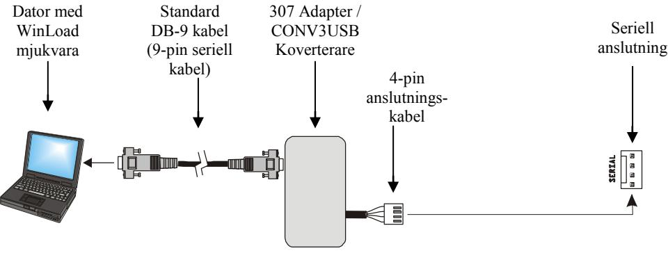

# **16 Användardrift**

## **16.1 Larmdisplay**

Om ett larm har inträffat på en sektion, kommer respektive sektions-LED att blinka, **[MEM]** knappen lysas upp, och sektionerna kommer sparas i minnet. Dessa respektive LEDar kommer fortsätta blinka tills frånkoppling även om sektionerna är återställda. För att gå ur detta läge och byta till live display läge innan frånkoppling, tryck på **[CLEAR]** knappen. När systemet har frånkopplats, kommer sektionens LED att stängas av, medans **[MEM]** knappen fortsätter att lysa. Tryck **[MEM]** knappen för att lysa upp LEDarna som motsvarar sektionerna som var i larm. Larmminnet kommer raderas när nästa larm inträffar och efter att en giltig kod knappas in eller vid full tillkoppling av systemet.

### **16.2 Feldisplay**

Tryck på **[TBL]** knappen för att se feldisplayen. Var god notera att knappsatsen kan programmeras att avge ett pip var femte sekund närhelst ett nytt feltillstånd har inträffat. Tryck på **[TBL]** knappen för att stoppa pipandet. För att visa undermenyn, tryck motsvarande knapp i huvudmenyn.

| Huvudmeny fel                                | Undermeny fel                                                                  |
|----------------------------------------------|--------------------------------------------------------------------------------|
| [1] Trådlös sektion lågt batteri             | [1] till [32] Sektioner har lågt batteri                                       |
| [2] Strömförsörjningsfel                     | [1] Lågt/inget batteri i centralen                                             |
|                                              | [2] AC fel på centralen                                                        |
|                                              | [3] AUX överbelastning på centralen                                            |
|                                              | [4] Trådlös knappsats AC fel                                                   |
|                                              | [5] Trådlös knappsats batterifel                                               |
|                                              | [6] Trådlös Repeater AC fel                                                    |
|                                              | [7] Trådlös Repeater batterifel                                                |
| [3] Sirenfel                                 | [1] Siren urkopplad på centralen                                               |
|                                              | [2] Siren överbelastning på centralen                                          |
| [4] Kommunikationsfel                        | [1] Telefonlinjeövervakning på centralen                                       |
|                                              | [2] Misslyckas att kommunicera på Övervakningstelefon 1 på centralen           |
|                                              | [3] Misslyckas att kommunicera på Övervakningstelefon 2 på centralen           |
|                                              | [4] Misslyckas att kommunicera på personsökartelefon på                        |
|                                              | centralen                                                                      |
|                                              | [5] Misslyckas att kommunicera på rösttelefon på centralen                     |
|                                              | [6] Misslyckas att kommunicera med PC på centralen                             |
| [5] Sabotage och sektionsledningdragningsfel | [1] till [32] Sektioner i sabotage och sektionsledningdragningsfel             |
| [6] Modulsabotagefel                         | [1] MG-2WPGM                                                                   |
|                                              | [2] Knappsatsbuss                                                              |
|                                              | [3] ZX8 bussmodul                                                              |
|                                              | [4] RTX3 bussmodul                                                             |
|                                              | [5] Trådlös knappsats                                                          |
| [7] Brandkretsfel                            | [1] till [32] Sektioner i brandkretsfel                                        |
| [8] Timerbortfall                            |                                                                                |
| [9] Trådlös sektion                          | [1] till [32] Sektioner i övervakningsbortfall                                 |
| övervakningsfel                              | [HEMMA] RF störningsfel                                                        |
| [0 (10)] eller [10]                          | [1] MG-2WPGM                                                                   |
| Modulövervakningsfel                         | [2] Knappsatsbuss (Centralåterställning kommer ej att cleara detta fel, cleara |
|                                              | felet i adress [955])                                                          |
|                                              | [3] ZX8 bussmodul                                                              |
|                                              | [4] RTX3 bussmodul                                                             |
|                                              | [5] Trådlös knappsats övervakningsfel                                          |
|                                              | [6] Trådlös Repeater övervakningsfel                                           |
| [16] Knappsatsfel (endast                    |                                                                                |
| MG32LED/MG32LRF)                             |                                                                                |
| [SLEEP] Knappsatsfel (endast                 |                                                                                |
| MG10LEDV/H)                                  |                                                                                |

### **Garanti**

Säljaren garanterar att hans produkter är fria från materialfel och tillverkningsfel vid normal användning för en tidsperiod av ett år. Eftersom säljaren inte installerar eller ansluter produkterna och emedan produkterna kan användas tillsammans med produkter som inte tillverkats av säljaren kan inte säljaren garantera säkerhetssystemets prestanda. Alla garantikrav som inte uttryckligen specificeras här är exkluderade. Säljarens skyldighet under denna garanti är uttryckligen begränsad till att reparera eller byta ut, efter säljarens val, produkter som inte motsvarar specifikationerna. I inget fall skall säljaren vara ansvarig inför köparen eller annan för förlust eller skada, direkt eller indirekt, inkluderande utan begränsning skador såsom utebliven vinst, stulna varor eller krav från annan part orsakat av felaktiga varor eller annars pga felaktig installation eller användning av sålda produkter.

**Paradox security AB Ekholmsvägen 36 127 48 Skärholmen tel: 08 556 465 50 fax: 08 556 465 59 www.paradox-security.se**