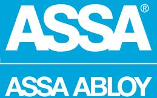
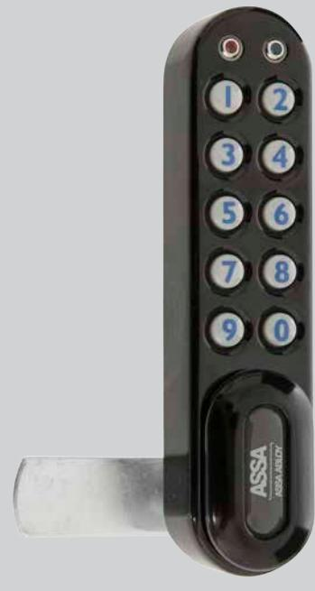
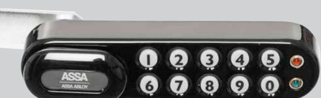
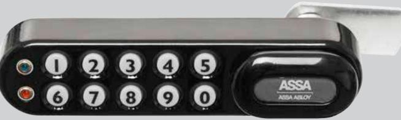
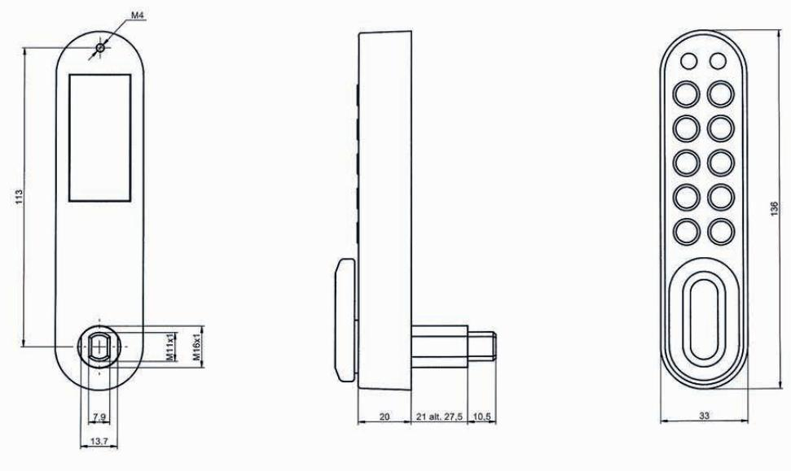
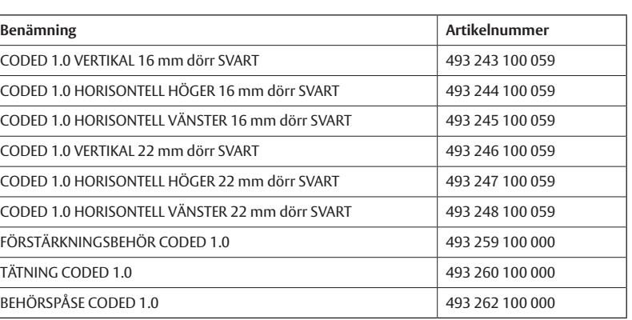
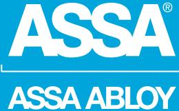

## ASSA CODED 1.0

ASSA ABLOY, the global leader in door opening solutions

### Elektromekaniskt kombinationslås

ASSA CODED 1.0 vertikal ASSA CODED 1,0 vänster

ASSA CODED 1,0 höger

### **Användningsområde**

ASSA CODED 1.0 är ett fristående batteridrivet kombinationslås. Låset är framtaget som ett nyckelfritt alternativ till traditionella skåplås. Låset är avsett för torra utrymmen inomhus, men kan kompletteras med ett tätande tillbehör vid användande i fuktiga inomhusmiljöer. Låset kan enkelt monteras på nya skåp och även eftermonteras på de flesta skåp där det finns behov att byta ut ett befintligt skåplås.

### **Egenskaper**

- Knappsats med 10 siffror.
- Användarkod med 4-siffror.
- Huvudkod och grupphuvudkod med 8-siffror.
- Långtidsanvändarläge (samma öppningskod varje gång).
- Korttidsanvändarläge (ny kod kan sättas för varje låsning) – OBS! för detta driftsläge rekommenderas ASSA CODED 1.2.
- Batterlivslängd > 15 000 öppningar med 2 st standard AAA batterier (medföljer).
- Batterivarning när batterierna är på väg att laddas ur.
- Möjlighet att tillföra energi utifrån med 9V batteri och huvudkod vid urladdade batterier.
- Finns i två inbyggnadslängder för dörrar upp till 16 mm respektive dörrar upp till 22 mm.
- Använder sig av samma regelsortiment som ASSA OEM skåplåscylindrar, reglar beställs separat.
- Finns som vertikal, horisontell höger och horisontell vänster modell.
- Uppfyller IP54 med tätande tillbehör, tillbehöret beställs separat.
- Zinkgjutet hus.
- Produkten kan vid behov kompletteras med ett förstärkningsbehör för en starkare infästning – beställas separat.

### **Funktion**

Låset fungerar som en traditionell skåplåscylinder, fast istället för att använda en nyckel som kodbärare knappas en kod in på knappsatsen och ett vred vrider regeln +/- 90º. Standardreglar för mekaniska skåplåscylindrar används (se datablad för reglar) och beställs separat.

# ASSA CODED 1.0

### **Låset kan ställas i två olika driftslägen:** *Långtidsanvändarläge:*

Lämpligt för personalskåp, skolskåp och dyligt där samma användare nyttjar skåpet under en längre tid och använder samma kod till dess låset programmeras om.

### *Korttidsanvändarläge:*

Korttidsanvändarläget är lämpligt för skåp som frekvent nyttjas av olika användare som till exempel skåp på hotell, gym, spa och dyligt. Användaren knappar in sin 4-siffriga kod, stänger skåpsdörren och kan därefter öppna skåps-dörren igen med samma kod. Nästa användare av skåpet kan därefter knappa in sin egen kod, och den föregående koden är då raderad.

OBS! Vid behov av korttidsanvändarläge rekommenderas ASSA CODED 1.2, vilken innehåller en mikrobrytare som förhindrar risk för felaktig användning.

### **Dimension**

- **Data**
- Drivs av 2 st standard AAA batterier.
- Batterlivslängd >15 000 öppningar.
- Dörrtjocklek upp till 22 mm.
- Använder ASSA OEM Standardreglar.
- Uppfyller IP54 med tätande tillbehör.
- Svart som standard, silvergrå som option.

#### **Miljökrav**

- För användning i normal inomhusmiljö.
ASSA ABLOY is the global leader in door opening solutions, dedicated to satisfying end-user needs for security, safety and convenience

ASSA OEM AB P.O. Box 371 SE-631 05 Eskilstuna Sweden

Phone +46 (0)16 17 70 00 Fax +46 (0)16 17 71 77

Customer support: Phone intl. +46 (0)16 17 70 00 e-mail: kundservice.etuna@assaabloy.com

www.assaoem.se

ASSA ABLOY, the global leader in door opening solutions