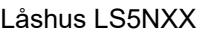
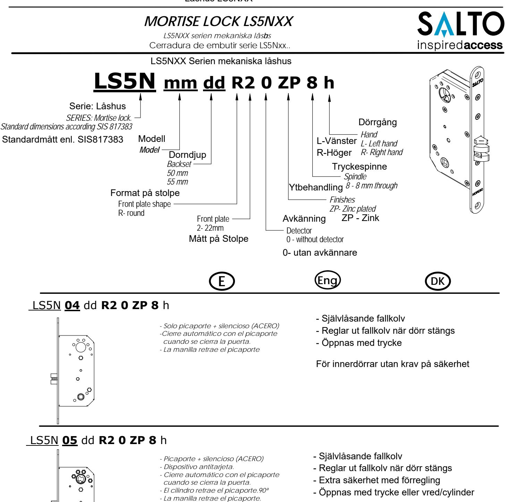
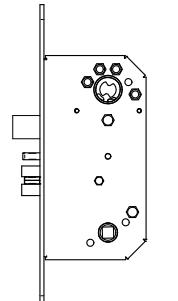
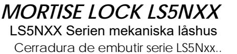
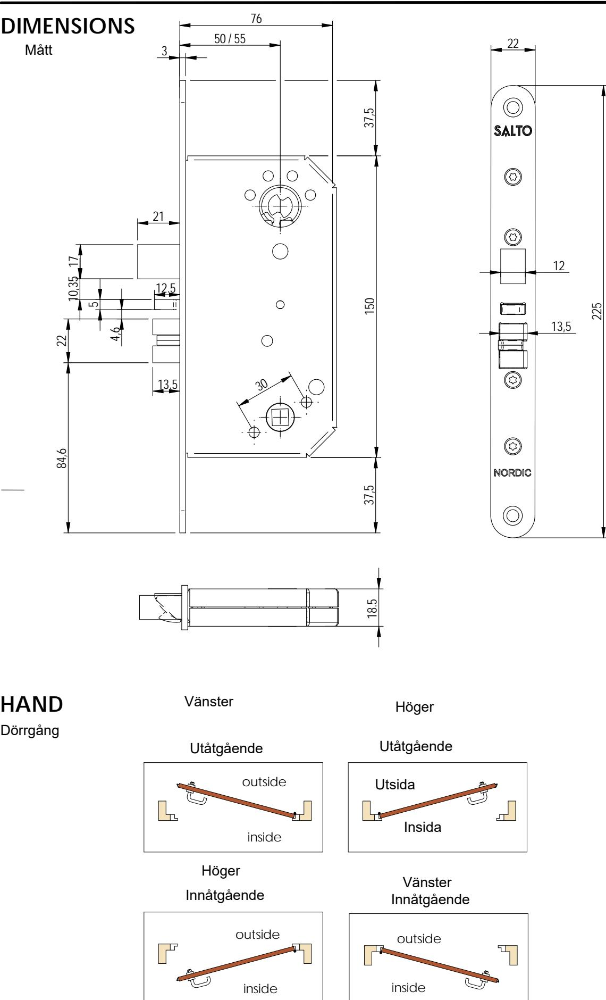

#### LS5N **25** dd **R2 0 ZP 8** h

#### *- Picaporte + silencioso (ACERO) - Dispositivo antitarjeta.*

- *Palanca*
- *Cierre automático con el picaporte*
- *cuando se cierra la puerta. - El cilindro o botón interior retrae la*
- *palanca y el picaporte.90º*
- *La manilla retrae el picaporte.*
- Självlåsande fallkolv
- Reglar ut fallkolv när dörr stängs
- Extra säkerhet med förregling
- Öppnas med trycke eller vred/cylinder
- Låsbar regelkolv

## Mått i millimeter

# **Dimension in milimeters.**

All contents current at time of publication. SALTO Systems S.L. reserves the right to change availability of any item in this catalog, its design, construction, and/or materials.

## **www.saltosystems.com European view**

4MO01454 - 1/2 -ED.06/03/2012

