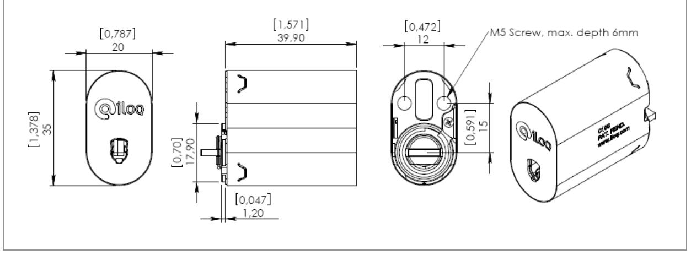

# iLOQ C10S.10 LOCK CYLINDER

### Features

The patented, award winning iLOQ S10 locking system offers advanced security and convenient access management for master-key locking environments.

The unique self-powered iLOQ C10.1 lock cylinder is powered by harvesting electricity from inserting of the iLOQ K10S.1 key. Being self-powered, the iLOQ C10S cylinder eliminates work, costs, wastes and harms associated with battery powered or cabled solutions. As no batteries or electric wiring are required, the locks and keys are easy to install and maintain, and it is an environmentally friendly "green" solution. The communication between the lock and the iLOQ K10S.1 key is strongly encrypted using standardized powerful SHA-1 encryption methods. The mechanically identical shape of the iLOQ C10S cylinders enables flexible stocking and fast delivery. Mechanical and electronic strength are compliant with international standards.

The lock cylinder is programmed at the installation site using a mobile phone or computer and iLOQ P10S programming device. A key is erased upon return. The lock can also be erased, and both may be reused, for instance in another locking system. An electronic key cannot be duplicated, and lost keys are easily blacklisted using programming device. This maintains a high level of security and ensures a long lifecycle for the security solution. The lock cylinder records audit trail of lock events.

## iLOQ C10S.10 lock cylinder in brief

- Programmable electromechanic lock cylinder
- Self-powered: no batteries or external energy source required for the lock and key, and no need for cabling
- All iLOQ C10S lock cylinders and iLOQ K10S.1 keys are mechanically alike
- Standard sized and mechanically compatible with existing Scandinavian oval lock cylinders, and therefore easy to install
- Secured using powerful encryption methods; unique 64bit challenge and SHA-1 computed 160bit MAC pair for key authentication
- Programmed using a mobile phone or computer and iLOQ P10S Programming device
- Blacklist for individual lost keys
- Access group list for key accesses
- Combined blacklist and access group capacity 128 entries
- Audit trail capacity 512-572 events
- Pre-blacklisting of lost key using new replacing key

## Technical Data

#### **prEN 15684:2007 (see Note 1)**

| Ten digit coding classification                        | Grade, Requirements                            | Notes                                        |
|--------------------------------------------------------|------------------------------------------------|----------------------------------------------|
| 1. Category in use (Grades 02)                         | Grade 2                                        | See Note 2                                   |
| 2. Durability EN 1303:2005 (Grades 46)                 | Grade 6, >200 000 openings                     |                                              |
| 3. Door mass (Not applicable)                          | NA                                             |                                              |
| 4. Fire resistance EN 1303:2005 (Grades 01)            | Grade 0                                        |                                              |
| 5. Safety (Not applicable)                             | NA                                             |                                              |
| 6. Environmental resistance (Grades 03)                | Grade 2, -10ºC+55ºC, IP21                      | For indoor use                               |
| 7. Mechanical code variations (Grades AF)              | Grade A, 0                                     | Not individual cut                           |
| 8. Electronic code variations (Grades AF)              | Grade F, 1000 000 000                          | 64bits, unique challenge                     |
| 9. System management (Grades AI)                       | Grade B, 100 records without time recording | Actual 512 records without time recording |
| 10. Attack Resistance EN 1303:2005 (Grades 02) Grade 2 |                                                | See Note 3                                   |

**Note 1)**, Requirements of iLOQ C10S.10 Lock Cylinder and iLOQ K10S.1 Key is defined according to prEN 15684:2007 Building hardware – Mechatronic cylinders – Requirements and test methods. prEN 15684:2007 draft European Standard is submitted to CEN members for enquiry. It has been drawn up by the Technical Committee CEN/TC 33.

**Note 2)**, Grade 2 include requirements and tests against bumps, hits, vibrations, high voltage, electrostatic discharge, electromagnetic field and magnetic field attacks.

**Note 3)**, High security escutcheons iLOQ E10.D1 or iLOQ E10.E1 required to meet Attack Resistance Grade 2.

Approved in accordance with non-life insurers' approval procedure by the Federation of Finnish Financial Services.

#### Operation

To operate the lock, insert the key entirely into the keyway and turn the key. If the lock does not open, remove the key and re-insert it into the lock, this time more slowly.

The electric energy is harvested for lock operations when the key is inserted into the lock. If the movement is too fast the lock is kept in the locked state. Do not use force when inserting a key into the lock.

The contact wire on the metal part of the key must be clean and smooth. If the contact wire is dirty, wipe it clean using a soft tissue. Replace the key if the contact wire is damaged.

