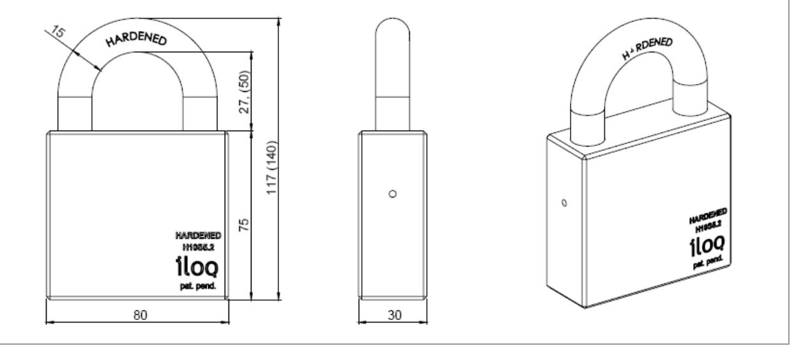

# iLOQ H10S5.x PADLOCK

#### Features

The patented, award winning iLOQ S10 locking system offers advanced security and convenient access management for master-key locking environments.

The iLOQ H10S5.x pad lock enables usage of the iLOQ S10 locking system for securing remote objects and locations. The self-powered iLOQ H10S5.x pad lock is available in two different shackle sizes, 27mm and 50mm. The iLOQ padlock records audit trail of the key usages and enables flexible access management for each key and each padlock. The security level is kept high and security gaps caused by lost key can be eliminated completely without costly change of locks and keys.

As an option the iLOQ H10S5.2 pad lock can be equipped with a internal clock for a time stamp on the audit trail.

### iLOQ padlock in brief

- Programmable electromechanic padlock
- Self-powered: no batteries or external energy source required for the lock and key
- All iLOQ padlocks and iLOQ K10S.1 keys are mechanically alike
- Secured using powerful encryption methods; unique 64bit challenge and SHA-1 computed 160bit MAC pair for key authentication
- Programmed using a mobile phone or computer and iLOQ P10S Programming device
- Blacklist for individual lost keys
- Access group list for key accesses
- Combined blacklist and access group capacity 128 entries
- Audit trail capacity 512-572 events
- Pre-blacklisting of lost key using new key

## Technical Data

The iLOQ padlock consists of standard iLOQ C10S.1 lock cylinder which is inserted into EN 12320 Grade 5 padlock case.

#### **Technical data of iLOQ C10S.1**

#### **prEN 15684:2007 (see Note 1)**

| Ten digit coding classification             | Grade, Requirements                            | Notes                                                |
|---------------------------------------------|------------------------------------------------|------------------------------------------------------|
| 1. Category in use (Grades 02)              | Grade 2                                        | See Note 2                                           |
| 2. Durability EN 1303:2005 (Grades 46)      | Grade 6, >200 000 openings                     |                                                      |
| 3. Door mass (Not applicable)               | NA                                             |                                                      |
| 4. Fire resistance EN 1303:2005 (Grades 01) | Grade 0                                        |                                                      |
| 5. Safety (Not applicable)                  | NA                                             |                                                      |
| 6. Environmental resistance (Grades 03)     | Grade 2, -10ºC+55ºC                            | tested to -40ºC+70ºC                                 |
| 7. Mechanical code variations (Grades AF)   | Grade A, 0                                     | Not individual cut                                   |
| 8. Electronic code variations (Grades AF)   | Grade F, 1000 000 000                          | 64bits, unique challenge                             |
| 9. System management (Grades AI)            | Grade B, 100 records without time recording | Actual 512 records with or without time recording |
| 10. Attack Resistance                       |                                                | See Note 3                                           |

**Note 1)**, Requirements of iLOQ C10S.1 Lock Cylinder and iLOQ K10S.1 Key is defined according to prEN 15684:2007 Building hardware – Mechatronic cylinders – Requirements and test methods. prEN 15684:2007 draft European Standard is submitted to CEN members for enquiry. It has been drawn up by the Technical Committee CEN/TC 33.

**Note 2)**, Grade 2 include requirements and tests against bumps, hits, vibrations, high voltage, electrostatic discharge, electromagnetic field and magnetic field attacks.

**Note 3)**, Attack resistance of the iLOQ H10S5.x padlock meets EN 12320 building hardware – padlocks and padlock fittings requirements and test methods grade 5.

#### Operation

To operate the lock, insert the key entirely into the keyway and turn the key. If the lock does not open, remove the key and re-insert it into the lock, this time more slowly.

Always insert the key into the keyway gently and slowly. The electric energy is harvested for lock operations when the key is inserted into the lock. If the movement is too fast the lock is kept in the locked state. Do not use force or bend the key when inserting it into the lock.

The contact wire on the metal part of the key must be clean and smooth. If the contact wire is dirty, wipe it clean using a soft tissue. Replace the key if the contact wire is damaged.

