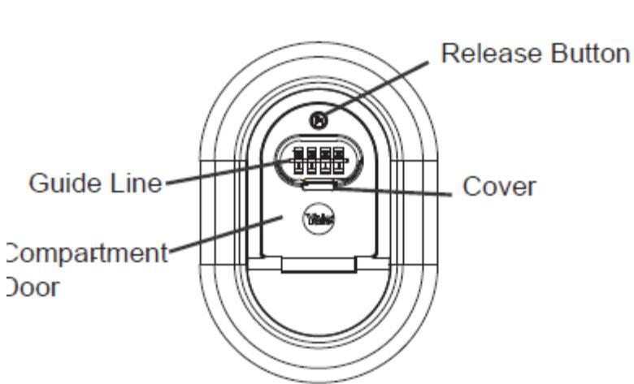
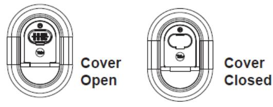
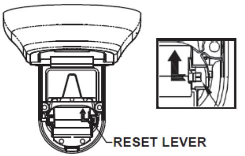
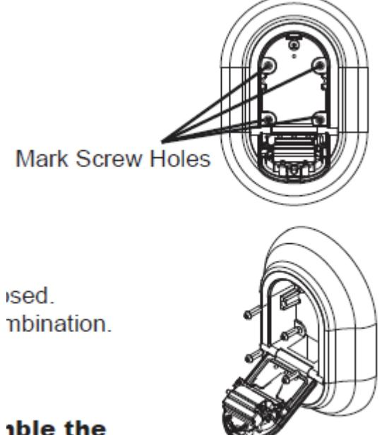

# Nyckelförvaringsbox Y500 / 187 / 1

### Öppna förvaringsutrymmet

•Skjut ned täcklocket för att få fram siffrorna.

•Vrid fram den förinställda fabrikskoden 0-0-0-0 utmed den horisontella hjälplinjen.

•Tryck på öppningsknappen för att frigöra luckan.

### Lås förvaringsutrymmet

- Stäng luckan och håll stängt.
- Blanda/vrid siffrorna för att låsa luckan.
- Skjut upp täcklocket över siffrorna.

# Ändra sifferkod på låset

- Öppna luckan.
- Tryck återställningsarmen åt vänster och framåt och lämna den i det läget.
- Ställ in önskad sifferkombination.
- Tryck tillbaka återställningsarmen till sin ursprungliga position.
- Stäng luckan och håll stängt..
- Blanda/vrid siffrorna för att låsa luckan och dölja din kod.
- Skjut upp täcklocket över siffrorna.
- Koden är nu ändrad. Spara den på en säker plats.

### Montering på vägg

#### Verkyg:

#### Penna, Stjärnskruvmejsel (Philips), vattenpass, borrmaskin och borr. Vid behov plugg lämpliga för underlaget.

- Öppna luckan.
- Placera nyckelboxen på tänkt plats.
- Använd gärna ett vattenpass för att få det rakt.
- Med produkten som mall markera hålens position mot underlaget med en penna.
- Ta bort nyckelboxen.
- Förborra med lämplig borr.
- Slå i plugg där det behövs, t ex vid betong eller stenvägg.
- Placera nyckelboxen över hålen och skruva dit skruvarna.
- Stäng luckan och håll stängt.
- Blanda/vrid siffrorna för att låsa luckan och dölja din kod.
- Skjut upp täcklocket över siffrorna.

### Tänk på:

Förvaringsutrymmets lucka är olåst om du inte blandar/vrider bort siffrorna. Håll täcklocket över siffrorna stängd för att skydda mot smuts och fukt.

BILDTEXTER

Release Button= öppningsknapp Guide Line= Hjälplinje Cover= Täcklock

Compartment Door=Lucka

Cover Open=Täcklock öppet

Cover Closed=Täcklock stängt

Reset lever=Återställningsarm

Mark Screw Holes=Markera skruvhålen nd drill bit.

## nble the

### ınd to