## MONTERINGSANVISNING Fönsterhasp med spärrfunktion

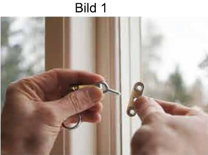

Skruva ur haspbeslaget.

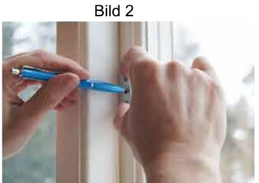

Gör en markering i centrum av de tre hålen.

Bild 3

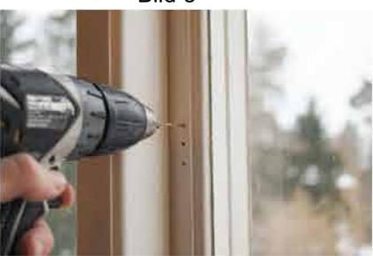

Borra 3 hål (grunt).

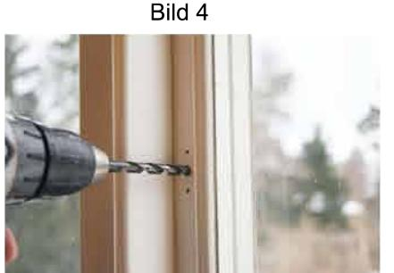

Borra mittenhålet ca 12 mm djupt.

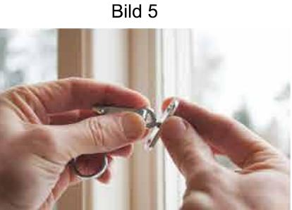

Skruva i maskingängan till hälften.

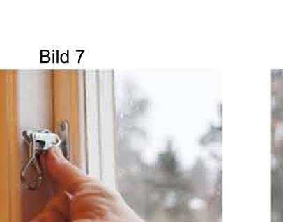

Haka på fönsterhaspen på karmbeslaget (se till att fönstret är helt stängt) och spänn haspen genom att föra karmbeslaget inåt rummet.

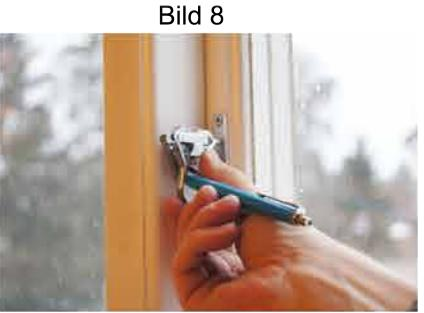

Se till att karmbeslaget sitter rakt och gör en markering i centrum av karmbeslagets tre hål, samtidigt som det hålls (spänt) inåt rummet.

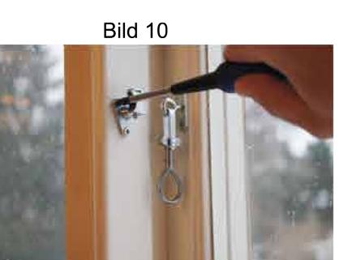

Skruva fast karmbeslaget.

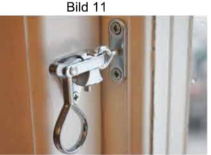

Haka på haspen.

Färdigmonterat!

Bild 6

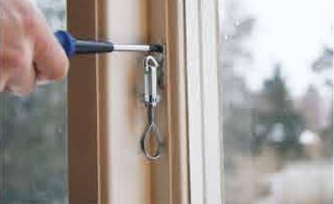

Skruva fast haspbeslaget på fönsterbågen.

Bild 9

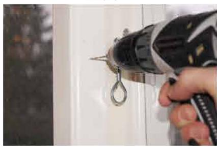

Förborra (grunt) för karmbeslaget.