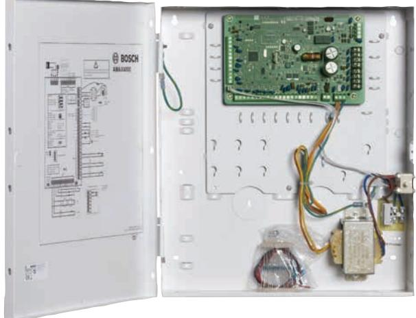
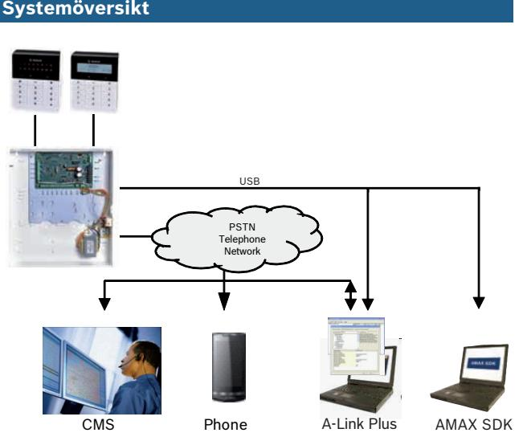

# AMAX panel 4000

www.boschsecurity.se

Centralapparaten är avsedd för användning i hemmiljö och på små till medelstora företag. Den har 64 sektioner och 16 områden och levereras med kapsling och transformator.

En inbyggd PSTN-sändare skickar ett larm via det vanliga telefonnätet till en telefon och/eller en larmcentral samtidigt som ett röstmeddelande skickas till ägarens fasta telefon eller mobiltelefon för att informera om en obehörig persons närvaro. Installationen av systemet är enkel och kräver minimal programmering: standardinställningarna utgör redan 90 % av de tillgängliga funktionerna. Programmering kan ske antingen med AMAX TEXT-, LCD- eller LEDmanöverpanelerna eller med

programmeringsprogrammet (A-Link Plus). Inbrottssystemet kan användas med både RADION trådlös kringutrustning som använder frekvensen 433 Mhz och fast anslutna detektorer från Bosch.

- u 64 fast anslutna sektioner/16 områden/250 användarkoder
- u 3 × 256 logghändelser med datum och tid
- u Inbyggd röstuppringare
- u Makrofunktion

- u Direkt USB-anslutning

## **Grundfunktioner**

**Funktioner**

- Tillkoppling/delvis tillkoppling med manöverpanelskod
- Tillkoppling/delvis tillkoppling med en knapp
- Inbyggd sändare med CID-/SIA-överföringsformat. Röstuppringaren skickar upp till 4 inspelade meddelanden till den fasta telefonen/mobiltelefonen i händelse av ett larm. Meddelanden kan spelas in med A-Link Plus och skickas till centralapparaten med fjärrprogrammet A-Link Plus.
- 16-veckoscheman med alternativet för att lägga till undantag i kalendern
- Tre programmerbara makron: flera enskilda funktioner från manöverpanelen har kombinerats till en kundmakrofunktion som kan utföras med hjälp av en knapptryckning.
- Fjärrunderhåll (t.ex. gångtest och förbikoppling)
- Installatören kan aktivera läget för bekväm programmering utan larm eller utgångar utlöst
- I konfigurationer med flera områden (direkt aktivering och multiaktivering) visas områdesstatus
- Områdesnamn visas i manöverpanelens huvudområde eller textområde
- Fyra inbyggda utgångar (två övervakade)
- Upp till tre utgående händelsetyper kan konfigureras för en fysiska utgång
- Alla zoner utom sektion 1 kan användas med branddetektorer med fyra ledare
- Alla sektioner kan användas för signalläge (dörrsignal)
- Alla sektioner kan användas för att upptäcka sensorsabotage (DEOL)
- Sektioner kan förbikopplas av namn
- Testläge för utgångar och sektioner

## **Tillvalsfunktioner**

- Trådlösa enheter (433 MHz) RADION från Bosch
- Sektionsingångar på expansionsmoduler (med DX2010)
- Reläutgångar på expansionsmoduler (med DX3010)
- Anslut utomhussirener och IP-kameror till en tillvalsmodul med 8 reläer (DX3010)
- Programmeringsnyckel

## **Larmöverföring som tillval**

- IP-kommunikation med Bosch Conettix IP, SIA DC09 UDP och SIA DC 09 TCP-protokoll via B426 och B450 med B442- eller B443-moduler
- GPRS-kommunikation med Bosch Conettix IP, GPRS SIA DC09 och SIA DC 09 TCP-protokoll via B450 med B442- eller B443-moduler

#### **Fjärrprogrammering som tillval via A-Link Plus**

- IP-kommunikation (B426 och B450 med B442 eller B443 moduler)
- GPRS-kommunikation (B450 med B442- eller B443 modul)

## **Videolarmsverifiering som tillval**

Extra videolarmsverifiering är möjlig i kombination med en DX3010 8-relämodul och en IP-kamera med analog larmingång och en reläutgång. Med direkt videoverifiering sker en platskontroll och en minskning av antalet falsklarm via internet från alla möjliga platser runt om i världen. Detta innebär att du eller larmcentralen kan få larmmeddelanden för att upptäcka exakt var larmet utlöstes och om det finns någon inkräktare.

## **Kommunikation med Boschs programvarupaket**

AMAX-systemet kan kommunicera med följande programvarupaket:

#### **Fjärrprogrammeringsprogramvaran A‑Link Plus**

AMAX-systemet kan användas och programmeras via programvaran A-Link Plus för fjärrprogrammering. All information om centralapparaten och statusinformation är tillgänglig och AMAX-panelen kan

manövreras från en fjärransluten plats.

A-Link Plus kan ansluta till AMAX-centralapparaten via USB, IP eller modem.

## **AMAX SDK (software development kit)**

AMAX SDK är en Windows DLL-fil (dynamic link library) som används för att integrera information från AMAXcentralapparaten i programvara från tredje part. AMAX SDK integrerar AMAX-centralapparatens funktioner och möjliggör mottagning av data från AMAXcentralapparaten med programvara för

systemhantering från tredje part.

AMAX SDK kan ansluta till AMAX-centralapparaten via USB eller IP.

### **Kompatibilitetsinformation**

### Grundläggande

| PSTN-sändare (integrated)     | Format: Contact ID, SIA DC 03                                                                                                       |
|-------------------------------|----------------------------------------------------------------------------------------------------------------------------------------|
| Magnetkontakter               | Alla magnetkontakter, inklusive infällda, utanpåliggande och ytmonterade kontakter samt överhängda dörrkontakter.             |
| Inbrottsdetektorer            | Alla konventionella inbrottsdetektorer, till exempel Blue Line, seismiska, PIR, TriTech, optiska och TriTech PIR mikrovåg. |
| Rökdetektorer med fyra ledare | Konventionella 12 V rök- och värmedetektorer, samt optiska rökdetektorer.                                                        |
| Tillval                       |                                                                                                                                        |
| Sektion                       | DX2010-sektionsingångsmodul                                                                                                            |
| Reläer                        | DX3010-utgångsmodul                                                                                                                    |

| IP-kommunikationsenhet          | B426 och B450 med B442- eller B443- moduler |
|---------------------------------|------------------------------------------------|
| GPRS/GSM kommunikationsenhet | B450 med B442-eller B443- modul             |

Olika typer av information är tillgängliga. Läs mer i respektive datablad, broschyr och

installationsmanualer om du vill ha mer information. Tillgängligheten beror på försäljningsregionen.

## **Certifikat och godkännanden**

| Region    | Certifiering |                                                                                                               |
|-----------|--------------|---------------------------------------------------------------------------------------------------------------|
| Tyskland  | VdS          | H113018 AMAX panel 4000 EN, IUI AMAX4-TEXT, IUI-AMAX3-LED8, IUI AMAX3-LED16                             |
| Europa    | CE           | EN 50130-4, EN 6100-3-2, EN 6100-3-3, EN 6100-6-3, EN 60950-1 AMAX panel 4000 EN, AMAX panel 3000 BE |
|           | CE           | EN 50130-4, EN 6100-3-2, EN 6100-3-3, EN 6100-6-3, EN 60950-1 AMAX panel 4000                           |
|           | EN5013 1  | EN-ST-000123 ICP-AMAX4-P2-EN, ICP AMAX4-P3-EN                                                              |
| Belgien   | INCERT       | B-509-0063 a AMAX panel 4000 EN                                                                               |
| Sverige   | SBSC         | 13-387 AMAX panel 4000 EN                                                                                     |
| Frankrike | AFNOR        | 1223400001 ICP-AMAX4-P2-EN, ICP AMAX4-P3-EN                                                                |

## **Delar som medföljer**

| Antal | Beskrivning                                                      |
|-------|------------------------------------------------------------------|
| 1     | AMAX panel 4000 inklusive integrerad PSTN kommunikationsenhet |
| 1     | Kapsling                                                         |
| 1     | Transformator                                                    |
| 1     | Sabotagekontakt                                                  |
| 1     | Terminalblock för strömförsörjning                               |
| 1     | Utrustningspaket för tillbehör: ändmotstånd                      |
| 1     | Driftshandbok                                                    |

## **Tekniska specifikationer**

## **Electrical**

| Power supply type            | EN = A |  |
|------------------------------|--------|--|
| Transformer                  |        |  |
| Transformer input in VAC     | 230    |  |
| Transformer output in VAC    | 18     |  |
| Transformer AC power in VA   | 50     |  |
| Transformer fuse in mA       | 1000   |  |
| AC input                     |        |  |
| Lägsta driftspänning i V DC  | 195    |  |
| Högsta driftspänning i V DC  | 253    |  |
| Line voltage frequency in Hz | 50     |  |
| DC output                    |        |  |

| DC output maximum current for 2000 all components in mA DC output maximum current for • 7 Ah-batteri, viloläge all components: dependency on 12 tim (ladda batteri till battery 80 % på 72 tim) =                                                                                                                                                                                                                  |        |
|-----------------------------------------------------------------------------------------------------------------------------------------------------------------------------------------------------------------------------------------------------------------------------------------------------------------------------------------------------------------------------------------------------------------------------------------------|--------|
|                                                                                                                                                                                                                                                                                                                                                                                                                                               |        |
| • 7 Ah-batteri, viloläge 36 tim + 15 min larmström 500 mA (ladda batteri till 80 % på 72 tim) = 150 mA • 18 Ah-batteri, viloläge 12 tim (ladda batteri till 80 % på 72 tim) = 1 500 mA • 18 Ah-batteri, viloläge 36 tim (ladda batteri till 80 % på 24 tim) = 480 mA • 18 Ah-batteri, viloläge 36 tim + 15 min larmström 1 000 mA (ladda batteri till 80 % på 24 tim) = 400 mA | 550 mA |

## Tillbehörsutgång 1/2

| Utspänning för tillbehör 1/2                                    | +12V / GND       |
|-----------------------------------------------------------------|------------------|
| Aux 1 / 2 nominal output voltage under AC line input in VDC  | 13.8 (+3% / -5%) |
| Aux 1 / 2 output max. Vpp in mV                                 | 675              |
| Aux 1 / 2 output voltage range under AC line input in VDC    | 13.11 – 14.2     |
| Aux 1 / 2 output current in mA                                  | 900              |
| Outputs                                                         |                  |
| PO -1 / PO -2 maximum supervised output current in mA        | 500              |
| PO +3/PO +4, maximal ström i mA (+12 V)                      | 750              |
| Watchdog PO –5, maximal ström i mA                           | 100              |
| Option bus                                                      |                  |
| Option bus nominal output voltage under AC line input in VDC | 13.8 (+3% / -5%) |
| Option bus output voltage range under AC line input in VDC   | 13.11 – 14.2     |
| Option bus 1 maximum current in mA                           | 900              |
| Optionsbuss 2, maximal ström i mA                            | 900              |
| Panel PCB maximum quiescent current in mA                    | 100              |

## Battery

| Battery type                        | 12 V/7 Ah/12 V/18 Ah Bosch IPS-BAT12V-18AH |
|-------------------------------------|-----------------------------------------------|
| Low battery condition in VDC        | below 11.0                                    |
| Minimum battery condition in VDC | 10.8                                          |

## **Mekaniska specifikationer**

| Mått i cm (H x B x D) | 37,5 × 32,2 × 8,8 mm |
|-----------------------|----------------------|
| Vikt i g              | 4700                 |

## Centralapparatsfunktioner

| Antal sektioner                                           | 64                                                                                                                                                     |
|-----------------------------------------------------------|--------------------------------------------------------------------------------------------------------------------------------------------------------|
| Antal användare                                           | 250                                                                                                                                                    |
| Antal händelser                                           | 256 historikhändelser med tid och datum 256 EN historikhändelser med tid och datum 256 larmsändarhändelser i historik med tid och datum |
| Pinkodsvarianter                                          | 1000000                                                                                                                                                |
| Antal enheter                                             |                                                                                                                                                        |
| Antal manöverpaneler                                      | 16                                                                                                                                                     |
| Antal DX 2010-moduler                                     | 6                                                                                                                                                      |
| Antal DX 3010-moduler                                     | 2                                                                                                                                                      |
| Antal DX 4010-moduler                                     | 1                                                                                                                                                      |
| Antal GPRS-moduler: B450 med B442 eller B443, DX4020-G | 1                                                                                                                                                      |
| Antal IP-moduler: B426                                    | 2 (1 om en av GPRS-modulerna ovan är ansluten)                                                                                                      |
| Antal radiomottagare                                      | 1                                                                                                                                                      |
| Antal RADION-radiorepeatrar                               | 8                                                                                                                                                      |
| Antal radiosensorer                                       | 64                                                                                                                                                     |
| Antal DSRF-radiofjärrkontroller                           | 24                                                                                                                                                     |
| Antal RADION-radiofjärrkontroller                         | 128                                                                                                                                                    |
|                                                           |                                                                                                                                                        |

## Sektioner

| Sektion 1          | Tvåtrådig brandsektion, enkla eller dubbelbalanserade (EOL 2,2 kΩ) sektioner NC, NO |
|--------------------|----------------------------------------------------------------------------------------------|
| Sektion 2 – 16 COM | 15 enkla eller dubbelbalanserade (EOL 2,2 kΩ) sektioner NC, NO                         |

| Sabotageskydd               | Sabotageingång för kapsling (minskar inte sektionskapaciteten) |  |
|-----------------------------|----------------------------------------------------------------------|--|
| Optionsbuss                 |                                                                      |  |
| Mått i mm                   | 4-trådig, Ø 0,6–1,2                                                  |  |
| Maximal kabellängd i m      | 200 (centralapparat till sista manöverpanel)                      |  |
| Maximal busslängd i m       | 700 (högst 14 enheter, högst 8 manöverpaneler)                    |  |
| Miljöspecifikationer        |                                                                      |  |
| Lägsta drifttemperatur i °C | -10                                                                  |  |
| Högsta drifttemperatur i °C | 55                                                                   |  |

| Högsta drifttemperatur i °C   | 55           |
|-------------------------------|--------------|
| Minsta relativa fuktighet i % | 10           |
| Högsta relativa fuktighet i % | 95           |
| Skyddsklass                   | IP 30, IK 06 |

## **Beställningsinformation**

#### **AMAX panel 4000**

Språkpaket 1: engelska, polska, turkiska Inte certifierad enligt europeiska standarder Ordernummer **ICP-AMAX4-P1**

#### **AMAX panel 4000 EN**

Språkpaket 2: franska, tyska, nederländska, portugisiska Ordernummer **ICP-AMAX4-P2-EN**

## **AMAX panel 4000 EN**

Språkpaket 3: engelska, spanska, polska, svenska Ordernummer **ICP-AMAX4-P3-EN**

#### **Hårdvarutillbehör**

## **Manöverpanel AMAX 2000 D8** AMAX keypad 2000 D8, LCD-ikonmanöverpanel med åtta sektioner Ordernummer **IUI-AMAX-LCD8**

#### **Manöverpanel AMAX 3000 L8**

AMAX keypad 3000 L8 är en LED-manöverpanel med åtta sektioner Certifiering: EN 50131-3 Grade 2 Ordernummer **IUI-AMAX3-LED8**

#### **Manöverpanel AMAX 3000 L16**

AMAX keypad 3000 L16 är en LED-manöverpanel med 16 sektioner Certifiering: EN 50131-3 Grade 2 Ordernummer **IUI-AMAX3-LED16**

## **DX2010 Expansionsenheter med åtta sektioner** Sektionsexpansionsmodul med åtta DOELinmatningssektioner Ordernummer **DX2010**

### **Expanderingsenhet DX3010 med åtta utgångar**

I paketet ingår endast DX3010-kortet Ordernummer **DX3010**

#### **AE20EN – kapsling**

AE20EN-plastkapsling för DX2010/DX3010 Ordernummer **AE20EN**

#### **B426 Ethernet-kommunikationsmodul**

Stöder dubbelriktad kommunikation över Ethernetnätverk för kompatibla centralapparater Ordernummer **B426**

#### **B450 Conettix kommunikationsgränssnitt av plug-in-typ**

Stöder dubbelriktad IP-kommunikation över vanliga mobilnätverk vid användning av en mobil kommunikationsenhet av plug-in-typ för kompatibla centralapparater. Ordernummer **B450**

### **B442 Conettix mobilt GPRS-kommunikationsgränssnitt av plug-in-typ**

Mobil kommunikationsenhet med flera funktioner som ger IP-kommunikation över ett mobilt (GPRS) nätverk Ordernummer **B442**

### **B443 Conettix mobil HSPA+-kommunikationsenhet av plug-in-typ**

Mobil 3G/4G-kommunikationsenhet med flera funktioner ger IP-kommunikation över ett mobilt GPRS-/EDGE-/UMTS-/HSPA+-nätverk Ordernummer **B443**

#### **ICP‑EZPK Programmeringsnyckel**

Blå nyckel för överföring av konfigurationer till och från Easy Series och AMAX-centralapparater. Ordernummer **ICP-EZPK**

#### **Uppdateringsnyckel ICP‑EZRU2 ROM**

Grön nyckel för uppgradering av centralapparatsversioner Ordernummer **ICP-EZRU-0106**

#### **Representeras av:**

**Sweden:** Robert Bosch AB Security Systems Isafjordsgatan 15 164 40 Kista Phone: +46 8 750 1980 se.securitysystems@bosch.com www.boschsecurity.se

© Bosch Security Systems AB 2016 | data kan ändras utan föregående meddelande 10486400139 | sv, V23, 30. maj 2016