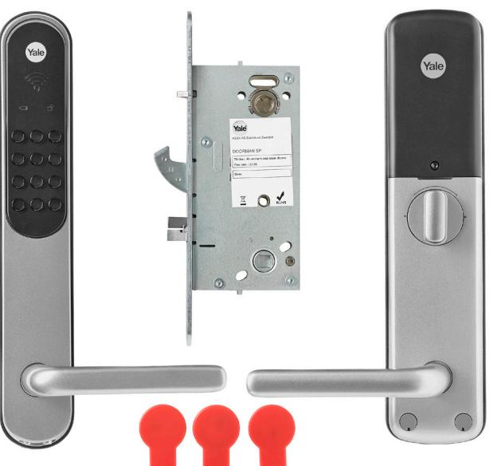

## **Yale Doorman för Aptus Elektroniskt lås med inbyggd beröringsfri mifareläsare**

**EGENSKAPER OCH FÖRDELAR**

- Inbyggt eltryckeslås och beröringsfri läsare i samma produkt.
- Systemanslutet via radio.
- Delat montage med insida, utsida samt lås.
- Byt ut nuvarande låshus mot Yale Doorman för Aptus.
- Ingen mekanisk nyckel behövs. Traditionell cylinder finns ej.
- Enkelt att installera, ingen kabeldragning behövs.
- Låset är av hakregeltyp för att vara inbrottssäkert.
- Lås upp med nyckelbricka eller kod.
- Öppning med vred från insida även i strömlöst tillstånd.
- Tillverkat i metall med UV-skyddad yta.
- Läser beröringsfria brickor av typ Yale Doorman Kombinyckel för Aptus.
- Tydlig interaktion med brukaren med bl.a. talade instruktioner på valbart språk.
- Utsida är avsedd för inom- och utomhusbruk, insida endast inomhusbruk.
- Kommunikation mellan lås och centralenhet sker över radio, krypterat för högsta säkerhet.
- Stabil funktion eftersom enheten fungerar även utan att ha kontakt med passersystemet. Behöriga nyckebrickor och koder lagras lokalt.
- Brukaren kan administrera sin egen dörr via mobil-appen Aptus för iPhone / Android.
- Levereras med tre nyckelbrickor: Yale Doorman Kombinyckel för Aptus.

**art.nr.**

## **Yale Doorman för Aptus Elektroniskt lås med inbyggd beröringsfri mifareläsare**

**EGENSKAPER OCH FÖRDELAR**

- Inbyggt eltryckeslås och beröringsfri läsare i samma produkt.
- Systemanslutet via radio.
- Delat montage med insida, utsida samt lås.
- Byt ut nuvarande låshus mot Yale Doorman för Aptus.
- Ingen mekanisk nyckel behövs. Traditionell cylinder finns ej.
- Enkelt att installera, ingen kabeldragning behövs.
- Låset är av hakregeltyp för att vara inbrottssäkert.
- Lås upp med nyckelbricka eller kod.
- Öppning med vred från insida även i strömlöst tillstånd.
- Tillverkat i metall med UV-skyddad yta.
- Läser beröringsfria brickor av typ Yale Doorman Kombinyckel för Aptus.
- Tydlig interaktion med brukaren med bl.a. talade instruktioner på valbart språk.
- Utsida är avsedd för inom- och utomhusbruk, insida endast inomhusbruk.
- Kommunikation mellan lås och centralenhet sker över radio, krypterat för högsta säkerhet.
- Stabil funktion eftersom enheten fungerar även utan att ha kontakt med passersystemet. Behöriga nyckebrickor och koder lagras lokalt.
- Brukaren kan administrera sin egen dörr via mobil-appen Aptus för iPhone / Android.
- Levereras med tre nyckelbrickor: Yale Doorman Kombinyckel för Aptus.

| ELEKTRISK ANSLUTNING               | Yale Doorman för Aptus                                                          |
|------------------------------------|---------------------------------------------------------------------------------|
| Strömförsörjning V DC              | 6, levereras via batterier                                                      |
|                                    |                                                                                 |
| Batterier                          | 4 st AA 1,5V Alkaliska                                                          |
| Batterilivslängd                   | 7 - 10 mån. vid normal användning                                               |
| Varning vid låg batterinivå        | Ja                                                                              |
| OMGIVNING                          |                                                                                 |
| Temperatur insida o C           | 0 till +50                                                                      |
| Luftfuktighet insida %             | 10 till 90                                                                      |
| Temperatur utsida o C           | -25 till +70                                                                    |
| Luftfuktighet utsida %             | 10 till 100                                                                     |
|                                    |                                                                                 |
| ANSLUTNING TILL CENTRALENHET       |                                                                                 |
| 700 XX                             | Nej                                                                             |
| MC1                                | Nej                                                                             |
| Styra 3000                         | Ja, från version D0, Multiaccess Styra version 8.1 krävs                     |
| RADIO                              |                                                                                 |
| Frekvensband MHz                   | 868                                                                             |
| Antal kanaler                      | 4                                                                               |
| Räckvidd, upp till, m              | Fri sikt: 25, Genom vägg / dörr: 15                                             |
| Kryptering                         | AES 128-bit EAX mode                                                            |
| Antal lås per Koppla 0010          | 8                                                                               |
| Antal lås per Styra 3000           | 32                                                                              |
| KORTDATA                           |                                                                                 |
| Yale Doorman Kombinyckel för Aptus | Ja Mifare Classic 1K / 4 bytes UID                                           |
| Floating ID                        | Ja, Nyckelbricka omkodas efter varje upplåsning för att förhindra kopiering. |
| Dörrdata                           |                                                                                 |
| Tjocklek dörrblad mm               | 40 - 88                                                                         |
| Symmetriskt                        | Ja, monteras höger- eller vänsterhängt.                                         |
| Slutbleck                          | ASSA 1487                                                                       |
| Dörrspringa mm                     | Max 5                                                                           |
|                                    |                                                                                 |
| MÅTT I MM                          |                                                                                 |
| Höjd                               | 290/290                                                                         |
| Bredd                              | 46/64                                                                           |
| Djup                               | 23,2/54,8                                                                       |
| Nettovikt i kg                     | 4,6                                                                             |

**LÅS**

## **www.aptus.se**

Aptus Elektronik AB . Ekonomivägen 3-5, 436 33 Askim . telefon **växel:** 031 68 97 00 **försäljning:** 031 68 97 10 **fax:** 031 68 97 99 aptus@aptus.se . www.aptus.se

| ELEKTRISK ANSLUTNING                   | Yale Doorman för Aptus                                                          |
|----------------------------------------|---------------------------------------------------------------------------------|
| Strömförsörjning V DC                  | 6, levereras via batterier                                                      |
|                                        |                                                                                 |
| Batterier                              | 4 st AA 1,5V Alkaliska                                                          |
| Batterilivslängd                       | 7 - 10 mån. vid normal användning                                               |
| Varning vid låg batterinivå            | Ja                                                                              |
| OMGIVNING                              |                                                                                 |
| Temperatur insida o C               | 0 till +50                                                                      |
| Luftfuktighet insida %                 | 10 till 90                                                                      |
| Temperatur utsida o C               | -25 till +70                                                                    |
| Luftfuktighet utsida %                 | 10 till 100                                                                     |
|                                        |                                                                                 |
| ANSLUTNING TILL CENTRALENHET 700 XX | Nej                                                                             |
| MC1                                    | Nej                                                                             |
| Styra 3000                             | Ja, från version D0, Multiaccess Styra version 8.1 krävs                     |
| RADIO                                  |                                                                                 |
| Frekvensband MHz                       | 868                                                                             |
| Antal kanaler                          | 4                                                                               |
| Räckvidd, upp till, m                  | Fri sikt: 25, Genom vägg / dörr: 15                                             |
| Kryptering                             | AES 128-bit EAX mode                                                            |
| Antal lås per Koppla 0010              | 8                                                                               |
| Antal lås per Styra 3000               | 32                                                                              |
| KORTDATA                               |                                                                                 |
| Yale Doorman Kombinyckel för Aptus     | Ja Mifare Classic 1K / 4 bytes UID                                           |
| Floating ID                            | Ja, Nyckelbricka omkodas efter varje upplåsning för att förhindra kopiering. |
| Dörrdata                               |                                                                                 |
| Tjocklek dörrblad mm                   | 40 - 88                                                                         |
| Symmetriskt                            | Ja, monteras höger- eller vänsterhängt.                                         |
| Slutbleck                              | ASSA 1487                                                                       |
| Dörrspringa mm                         | Max 5                                                                           |
|                                        |                                                                                 |
| MÅTT I MM                              |                                                                                 |
| Höjd                                   | 290/290                                                                         |
| Bredd                                  | 46/64                                                                           |
| Djup                                   | 23,2/54,8                                                                       |
| Nettovikt i kg                         | 4,6                                                                             |

**LÅS**

## **www.aptus.se**

Aptus Elektronik AB . Ekonomivägen 3-5, 436 33 Askim . telefon **växel:** 031 68 97 00 **försäljning:** 031 68 97 10 **fax:** 031 68 97 99 aptus@aptus.se . www.aptus.se