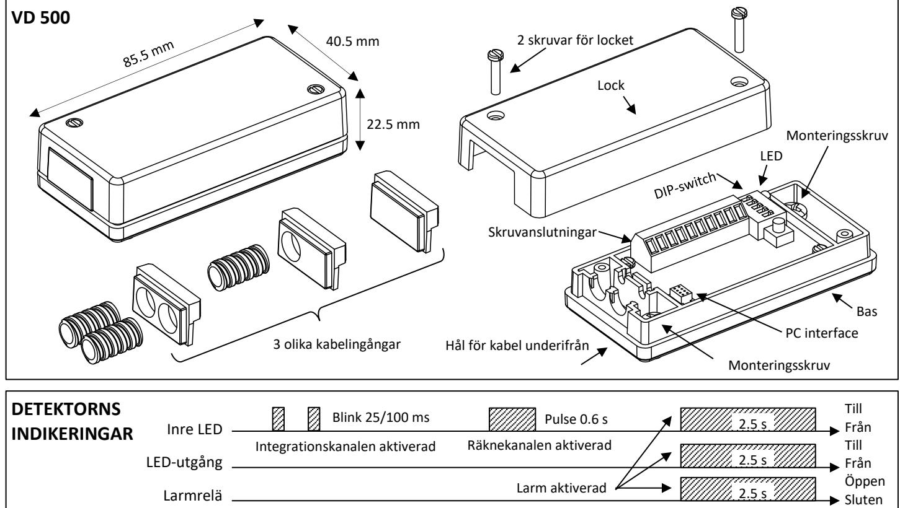
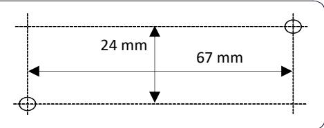

# **Detektorer Seismisk detektor**

# **Datablad och installationsanvisning VD 500**

### **FUNKTIONSBESKRIVNING**

Alarmtech VD 500 seismiska detektor monteras på stål och betongytor och ger ett effektivt skydd för riskobjekt såsom kassaskåp, bankvalv, bankomater, arkiv - skåp, betongväggar etc. VD 500 ger larm om någon försöker angripa de skyddade objektet med sprängämnen eller verktyg såsom borrar, diamantskärmaskiner eller termiska verktyg såsom acetylen-skärbränning eller termisk lans. Detektorn har 3 separata detekteringskanaler som känner olika energinivåer på angreppet:

- Integrationskanal som detekterar låga amplituder med höga frekvenser och med lång varaktighet.
- Räkne-kanal som detekterar händelser med hög amplitud och kort varaktighet.
- Explosionskanal detekterar mycket hög amplitud med mycket kort varaktighet.

Känsligheten justeras på digital väg med hjälp av en förprogrammerad DIP- switch.

Vid montering av VD 500 kontrollera att ytan är jämn och att detektorn sitter fast ordentligt i underlaget. Som tillbehör finns en monteringsplatta MP 500 tillsammans med en expanderbult bult som underlättar montering av detektorn på betong och tegelväggar.

För montering utomhus på platser med svåra väderförhållanden eller för installationer i kylrum, bör detektorn monteras i ett väderhus WH 500 med värmare som höjer lufttemperatur något för att hindra luftfuktigheten att kondensera.

VD 500 har en LED för indikering av larm, en inbyggd temperatursensor, öppnings- och bortbrytningsskydd samt en inbyggd självtest generator som automatiskt regelbundet kontrollerar detektorns funktion och med en ingång för fjärr - kontroll. Den ljusgrå detektorn är helt i metall och kan monteras i krävande miljöer.

## **NÅGRA EGENSKAPER**

- Liten och med låg profil för tillämpning i begränsade utrymmen.
- 24-timmarsövervakning av valv, kassaskåp, bankomater, valvdörrar och väggar, etc.
- Avancerad signalanalys för säker detektering för att sortera bort omgivningsstörningar.
- Hög immunitet mot omgivningsbuller och andra störningar.
- Enkel känslighetsinställning med en DIP-switch.
- Förprogrammerade inställningar för olika objekt som väljs med en DIP-switch.
- Inbyggd självtestgenerator som regelbundet kontrollerar detektorns funktion.
- Ingång TEST för fjärrkontroll av testfunktionen.
- TEST har två funktioner:
	- o Start av självtest (Låg->Hög)
	- o Återställning av alarm (Hög->Låg)
- Programmerbart larmrelä för automatisk återställning eller låsning i larmläge.
- Inbyggd LED för indikering av larm samt en utgång för extern LED.
- Öppningsskydd.
- Bortbrytningsskydd.
- Temperaturövervakning larm vid >75°C samt vid temperaturstegring > 6°C/min.
- Brett inspänningsområde-från 8-30V DC
- Indikering av låg spänning.
- Inbyggd händelselog med tidsangivelse ("black-box").
- Gränssnitt för övervakning av detektorns med Alarmtech programvara CVDlink.
- Certifierad av SBSC, VdS och EN

# **TILLÄMPNINGSOMRÅDEN**

VD 500 ger ett tillförlitligt och säkert skydd mot angrepp med mekaniska och smältande metoder mot den yta som detektorn är monterad på. Typiska objekt som detektorn monteras på är:

- Bankvalv och betongväggar
- Kassaskåp, ståldörrar
- Utbetalningsautomater, bensinpumpar
- Förstärkta väggar och tak med stålplåt i museer och köpcentra

### **RÄCKVIDD**

Detektorn skall monteras på ett hårt och jämt underlag med god anliggning mot ytan som skall skyddas. Den skall placeras så att inga sprickor eller skarvar på ytan finns. Varje spricka eller skarv dämpar vibrationerna kraftigt. Likaså är det viktigt att den inte monteras nära störande källor typ maskiner eller luftintag som vibrerar. Ju hårdare material desto bättre ledningsförmåga av vibrationer.

Den typiska täckningen i olika material visas i tabellen nedan med känsligheten ställd på Hög. Räckvidden presenteras som riktlinjer och praktiska tester måste alltid utföras för att kontrollera räckvidden.

- Typ av material och ytans konstruktion
- Detektorns placering I förhållande till skarvar, sprickor, gångjärn etc.
- Eventuella störkällor typ ventilationsutsläpp, roterande maskiner etc.

| Ytmaterial | Stål | Betong med MP (*) 500 | Tegel (*) |
|------------|------|-----------------------|-----------|
| Räckvidd   | 5 m  | 5 m                   | 4 m       |
|            |      |                       |           |

* – med monteringsplattan MP 500

### **MONTERING**

- 1. Lossa lockets skruvar och lyft bort locket
- 2. Välj ut den lämpligaste placeringen
- 3. Mät ut monteringsskruvarna läge
- 4. Borra och gänga för M4 vid montering på stål. Skruvarna finns I packsatsen
- 5. För montering på betong och tegel använd monteringsplatta MP 500 och använd expanderbulten i packsatsen.

### Borrmall för stål:

### **SKRUVANSLUTNINGAR**

Detektorn har 10 skruvanslutningar.

|    | Nr. Märkning | Funktion                                                               |  |  |
|----|--------------|------------------------------------------------------------------------|--|--|
| 1  | (-)          | Minus                                                                  |  |  |
| 2  | (+)          | Plus                                                                   |  |  |
| 3  | LED          | Extern LED. Öppen Kollektor–utgång med 1k I se rie. Max ström 100mA |  |  |
| 4  | TEST         | Start av självtest. Återställning av alarm.                            |  |  |
| 5  | C            | Larmrelä                                                               |  |  |
| 6  | NC           |                                                                        |  |  |
| 7  | Spare        | Reserv                                                                 |  |  |
| 8  | Open case    | Öppningskontakt och bortbrytningskontakt kopp                          |  |  |
| 9  | Pry-off      | lade i serie                                                           |  |  |
| 10 | Spare        | Reserv                                                                 |  |  |

### **TEST-INGÅNGENS FUNKTION**

- Med TEST-ingången kontrolleras 2 funktioner:
- Start av självtest (Låg -> Hög)
- Återställning av LARM (Hög -> Låg)

Vid självtest startar en inbyggd vibrationsgivare. Detektorn skall då generera ett LARM. LARMRELÄET öppnas och lysdioden tänds.

| TEST Ingången | Action                                       |
|---------------|----------------------------------------------|
| Låg -> Hög    | Start av självtest som simulerar ett angrepp |
| Hög -> Låg    | Återställning av Larm                        |

## **ANSLUTNING AV EN EXTERN LED**

Utgången för Extern LED kan användas för att tända upp en yttre indikering. Det är en öppen kollektor med 1k i serie som kan driva en last på max 100mA.

### **PROGRAMMERING AV DIP-OMKOPPLAREN**

Med den 5-poliga DIP omkopplaren kan följande funktioner programmeras:

- 1. Känsligheten I 4 fördefinierade nivåer
- 2. Typ av objekt som skall skyddas (3)
- 3. Relä och LED funktion:
	- a. Automatisk återställning efter ca.2.5 sek
	- b. Låst I larmläge Återställning genom att bryta strömmen eller med TEST ingången.

| Position   | Inställning av DIP-kontakten |        |                 |          |  |  |
|------------|------------------------------|--------|-----------------|----------|--|--|
| Känslighet | Mycket låg                   | Låg    | Standard        | Hög      |  |  |
| 1          | OFF                          | OFF    | ON              | ON       |  |  |
| 2          | OFF                          | ON     | OFF             | ON       |  |  |
| Objekttyp  | Kassaskåp                    | Betong |                 | Kund pro |  |  |
|            | Metall                       | Tegel  | ATM             | gram     |  |  |
| 3          | OFF                          | OFF    | ON              | ON       |  |  |
| 4          | OFF                          | ON     | OFF             | ON       |  |  |
| Relä       | Återställning (2.5 s)        |        | Låst i larmläge |          |  |  |
| 5          | OFF                          |        | ON              |          |  |  |

Vid leverans är alla ställda I OFF

### **INSTÄLLNING AV KÄNSLIGHETEN**

Justering och inställning är ganska enkel. Välj programmet med DIP-omkopplare 3 och 4. Kontrollera om detektorn är inställd på automatisk återställning (DIP-omkopplare pos.5 = OFF). Lysdioden indikerar aktivering och larmrelä återställs efter två sekunder. Varje registrerad puls visas med en kort ljusindikering på LED, larm visas med en längre ljusindikering.

- 1. Ställ upp till den högsta känsligheten (1 = ON, 2 = ON).
- 2. Använd testare GVT 5000 eller knacka lätt med en skruvmejsel nära detektorn och kontrollera om varje puls detekteras.
	- a. Ställ in på den lägsta känsligheten (1 = OFF, 2 = OFF).
	- b. Använd testaren GVT 5000 eller knacka med en skruvmejsel på den mest avlägsna punkten som skall skyddas och öka känsligheten tills LED indikerar.

### **ANSLUTNING TILL PC**

Detektor VD 500 är utrustad med kontakt (röd) för gränssnitt till PC. Kommunikationen kan uppnås med hjälp av ett USB-interface Urs samt programvaran CVDlink. Visualisering erhålls av detektorns funktion med möjlighet till inspelning och lång- tidsövervakning av objektet samt tillgång till detektorns inre händelseminne (black-box).

*OBS: Detektorn kan programmeras av användaren. Detta är inte inkluderat i certifieringen av detektorn*

### **TEKNISKA DATA**

Spänning 8 – 30 Vdc Stabilisering efter 5 sek är detektorn klar Max rippel 2 Vpp (@ 12 Vdc) Strömförbrukning 7.5 mA @ 12 Vdc /4.6 mA @24 Vdc Förbrukning I larm 8.4 mA @ 12 Vdc TEST Låg / Hög 0 – 1 V / 3 – 30 V Alarmutgång relä, NC, res. < 30 Ω Alarmtid 2.5 s i automatisk återställning Reläkontakt 35V/100mA Låg spänning < 7.5 Vdc Temperaturlarm >75⁰C och temperaturökning 6⁰C0/min Sabotagekontakter mikro-switch, NC Kontaktdata 35V/50mA Detekterar Öppning och bortbrytning Storlek [HxBxL] 22.5 x 40.5 x 85.5 mm Arbetstemperatur från -40⁰C till +70⁰C Lagringstemperatur från -50⁰C till +70⁰C Fuktighet max. 95% RH Skyddsklass. IP 43, IK07 Certifierad: CE, RoHS, WEEE, EN 50130-4, EN 50130-5 Class IIIA,

SBSC Nr 13-573 Class 3/4, VdS G 114006 Class C, Miljöklass IIIA