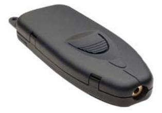
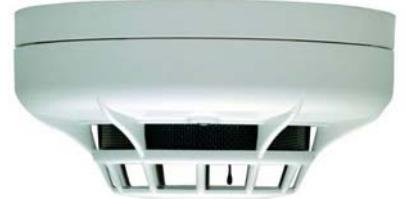
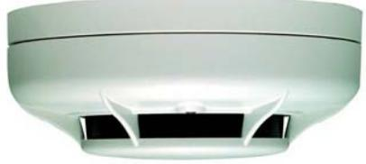
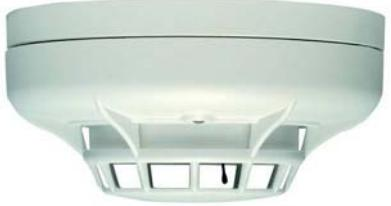
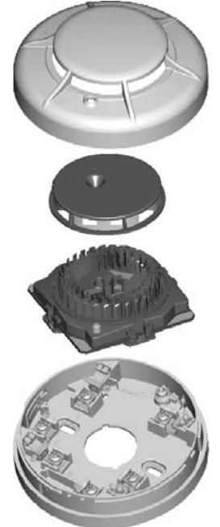

*Utgåva nov. 2008*

# **ECO1000**

**Konventionella Detektorer**

## **EGENSKAPER**

- **Multidetektor ger enastående skydd**
- **Unik laser fjärrkontroll vid testning**
- **EN54 del 5 och 7 godkänd (2000 ver.)**
- **Optisk, optisk/värme och värmedetektorer**
- **Förbättrad kammare design reducerar nedsmutsning**
- **8 till 30VDC driftsspänning sörjer för kompatibilitet med både brand- och inbrottslarmcentraler**
- **-30 till +70°C driftstemperatur**
- **Olika typer av socklar, inkluderat 12V relä´ version**
- **Automatisk drift kompensation**

# **GENERELLT**

Kombinationen av avancerad teknologi och modern produktionskapacitet gör ECO1000 både prisvärd och användarvänlig.

ECO1000 konventionella detektorer har funktioner som man normalt bara finner bland analoga adresserbara detektorer. Detta ger bättre detektion och färre oönskade larmer i mindre komplexa system när det inte är behov av analoga adresserbara funktioner.

Periodisk testning har tidigare medfört att man har haft behov av fysisk tillgång till detektorn, något som har inneburit krävande användning av teststänger och stegar. ECO1000 testas från golvnivå med användning av en laserbaserad fjärrkontroll. Personen som utför testen riktar den modulerade signalen mot detektorns LED och utlöser ett larm. Vad kan vara enklare?

### **MODELLER**

*ECO1002* är en multidetektor med optisk kammare och termistor som övervakas kontinuerligt av en inbyggd microprocessor med algoritmer utvecklad specifikt för denna detektorn. Vid detektering av både rök och värme reduceras antalet oönskade larmer samtidig som reaktionstiden är snabbare.

*ECO1003* har en optisk kammare som har utvecklats för att förhindra nedsmutsning och därmed reducera oönskade larmer förorsakade av damm som ökar detektorns känslighet. I tillägg värderar detektorn signalen från kammaren för att ignorera snabba ändringar i miljön som inte överensstämmer med ett brandförlopp. Detta resulterar i en mycket stabil detektor.

*ECO1004* och *ECO1005* värmedetektorer är finns med fast larmgräns på 58°C och 78°C samt som differential version. Detektorerna med fast larmgräns är avsedda för områden där snabba ändringar i temperaturen kan förväntas, medan differential versionen används i områden med relativt stabil temperatur.

Sida 1 av 2 – ECO1000 SWE

# **TEKNISKA SPECIFIKATIONER**

- Driftsspänning: 8 30 VDC
- 

- Diameter: 102mm
- Vikt: 75g

Detektor höjd: 42mm (optisk) eller 50mm (värme)

- Multifunksjon LED
- Standard sockel har LED utgång
- Optisk kammare med dammskydd
- Unik laserbaserad fjärrkontroll

| ECO1002 Multidetektor                                    |                               |  |
|----------------------------------------------------------|-------------------------------|--|
| Strömförbrukn. vid drift 25°C: 60µA @ 24V                |                               |  |
| Strömfröbrukn. vid larm:                                 | 80mA (begränsat av centralen) |  |
| Max fuktighet:                                           | 95% relativ fuktighet         |  |
| Driftstemperatur:                                        | -30 till +70°C                |  |
| Vikt utan sockel:                                        | 78g                           |  |
| Godkänd enl. EN54-7:2000; EN54-5:2000 klass A1R; CEA4021 |                               |  |

#### **ECO1003 Optisk detektor**

Strømförbrukn. vid drift 25°C: 45µA @ 24V Strömförbrukn. vid larm: 80mA (begränsat av centralen) Max fuktighet: 95% relativ fuktighet Driftstemperatur: -30 till +70°C Vikt utan sockel: 75g Godkänd enl. EN54-7:2000

#### **ECO1004T Värmedetektor, 78°C fast**

Strömförbrukn. vid drift 25°C: 60µA @ 24V Strömförbrukn. vid larm: 80mA (begränsat av centralen) Max fuktighet: 95% relativ fuktighet Driftstemperatur: -30 till +70°C Vikt utan sockel: 70g Godkänd enl. EN54-:2000 klass BS

#### **ECO1005 Värmedetektor, differential**

Strömförbrukn. vid drift 25°C: 55µA @ 24V Strömförbrukn. vid larm: 80mA (begränsat av centralen) Max fuktighet: 95% relativ fuktighet Driftstemperatur: -30 till +70°C Vikt utan sockel: 70g Godkänd enl. EN54-:2000 klass A1R

#### **ECO1005T Värmedetektor, 58°C fast**

Strömförbrukn. vid drift 25°C: 55µA @ 24V Strömförbrukn. vid larm: 80mA (begränsat av central) Max fuktighet: 95% relativ fuktighet Driftstemperatur: -30 till +70°C Vikt utan sockel: 70g Godkänd enl. EN54-:2000 klass A2S

| Socklar:        |                                                      |
|-----------------|------------------------------------------------------|
| ECO1000B        | Standard sockel                                      |
| ECO1000BSD      | Standard sockel med Shottky diod                     |
| ECO1000BR       | Sockel med 470 Ohm motstånd                          |
| ECO1000BRSD     | Sockel med 470 Ohm motstånd och Shottky diod      |
| ECO1000DB       | Djup sockel                                          |
| ECO1000DBR      | Djup sockel med 470 Ohm motstånd                     |
| ECO1000DBRSD    | Djup sockel med 470 Ohm motstånd och Shottky diod |
| ECO1000BREL12L  | Relä´sockel 12V, låsande                             |
| ECO1000BREL12NL | Relä´sockel 12V, återställningsbar                   |
| ECO1000BREL24NL | Relä´sockel 24V, låsande                             |

# **Tillbehör:**

| ECO1000RTU | Laserbaserad fjärrkontroll för testning   |
|------------|-------------------------------------------|
| ECO1000BA1 | Sockel adapter för utanpåliggande kablage |
| ECO1000DRT | Verktyg för demontering av detektor       |

