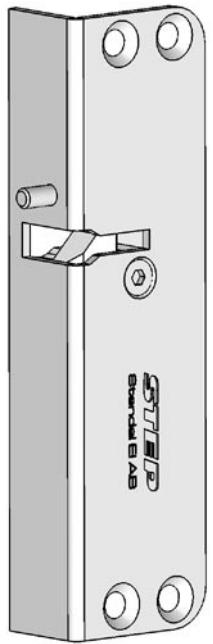

### *Technical specifications*

Material: SS1142 with Zinc electroplatingzinc plating Voltage: Ordered in specified 12 or 24V DC +/- 10%, 100% ED, CE compliant

### *Current draw*

| Current      | 24 VDC ± 10% | 12 VDC ± 10% |
|--------------|--------------|--------------|
| Current draw | 0,23A        | 0,42A        |
| Watt         | 2,5W         | 5W           |

### *2 Year Limited Warranty*

STEAB guarantees for a period of 2 years in accordance with STEAB Warranty Conditions, against defects in manufacture, workmanship or materials, provided that all electrical and mechanical installation requirements are adhered to as per this datasheet. All third party and consequential claims are expressly excluded from this warranty.

#### **Stendal El. AB • Signalistgatan 17 • 721 31 Västerås • Sweden Tel. +46 (0)21-189750 • Fax +46 (0)21-130169 • www.steab.se postmaster@steab.se**

# *Installation instructions*

### *STEP 36 Article no. ST3601 fail secure*

The STEP 36 is a small electric strike that is designed to be installed for cabinets, cupboards or secure areas that are restricted by size.

The compact design allows easy installation without impacting on the aesthetics of the area that needs securing.

### *Wiring STEP 36*

Connect wires as specifications (Fig. 2). Allow suficient space between the electric strike unit and jamb cut-out for the wires. Bunching of wires may cause the unit to malfunction.

CAUTION! Incorrect supply voltage may cause damage not covered by warranty. Please check supply voltage with a suitable meter to ensure it is within +/- 10% of the nominal voltage marked on the strike.

## *Strike Dimensions*

Fig. 2

### **Installation**

Prepare door frame so that STEP 36 fits in it, for measurement use template drawing.

Page 2 of 4 Page 3 of 4