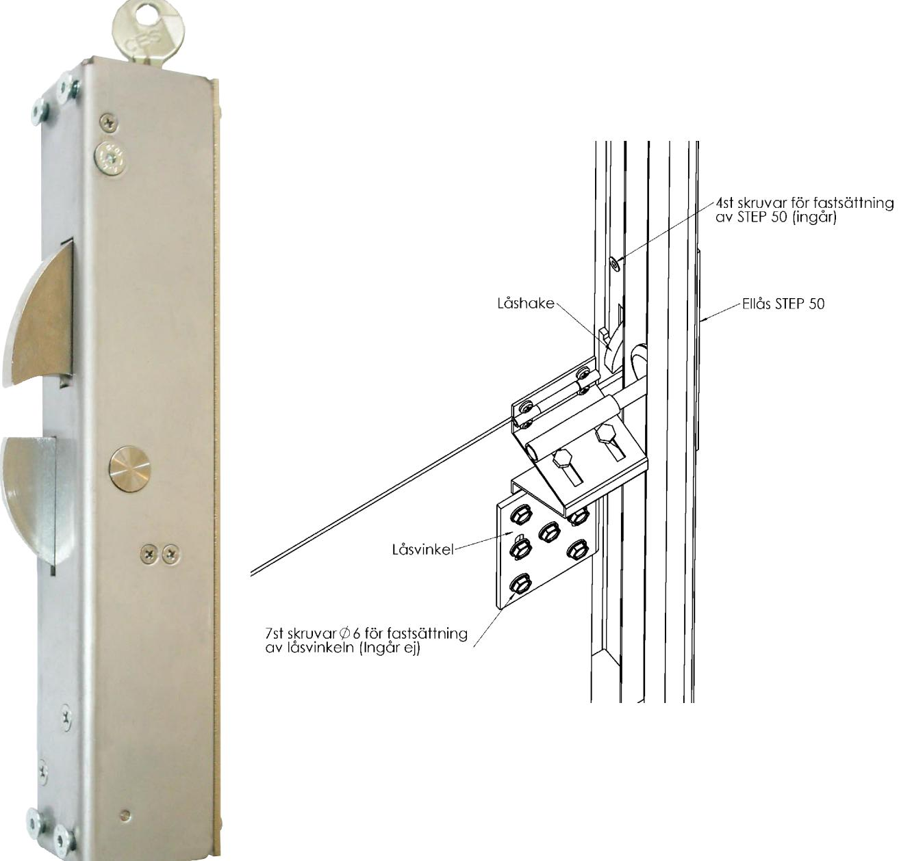
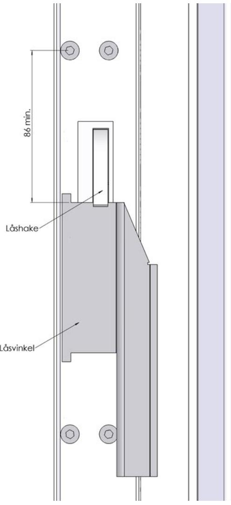
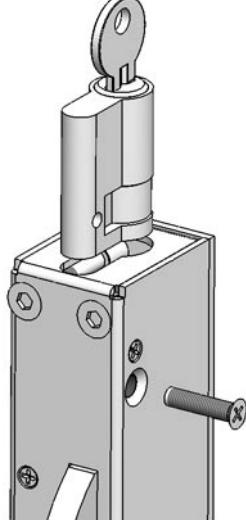
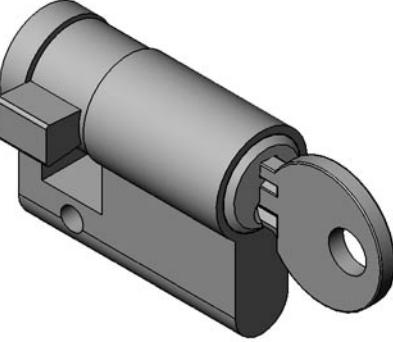
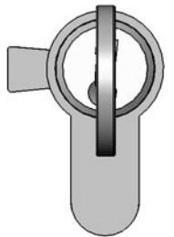
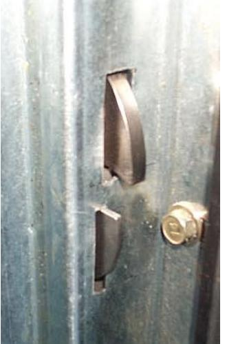
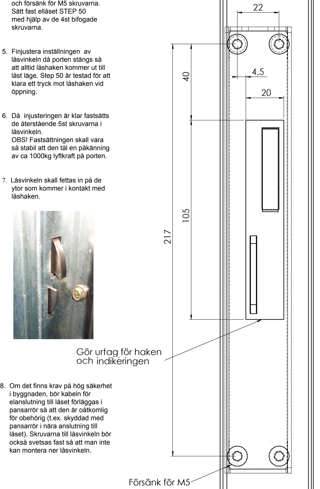
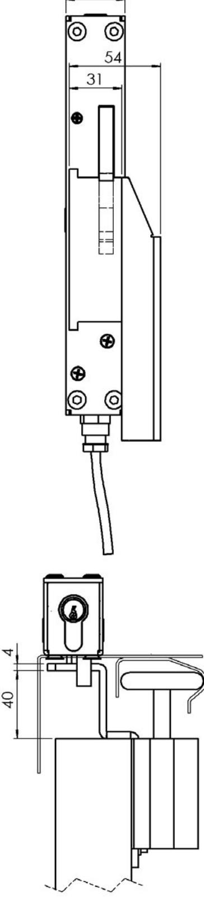
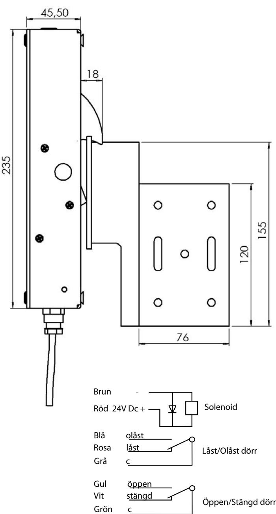

Montageinstruktion STEP 50 med låsvinkel ST527-1för industriport med 2 tums skena samt vertikal och höglyftsutförande

#### **Montering av nyckel cylinder (tillval)**

Euro cylindern går att få i befintligt Assa Twin system.

För in euro cylindern i STEP 50 med nyckeln i. Skruva fast cylindern med M5 skruven som ingår. Tappen skall peka åt vänster enligt bild när nyckeln är urtagen.

## **Montageinstruktion Portlås typ STEP 50**

- 1. Bestäm och märk ut ungefärligt läge för placering av låsvinkeln. Ellåset kan monteras på höger eller vänster sida av porten.
Låsvinkeln skall placeras så nära gångjärnsfästet som möjligt för att klara böjen på skenan. På högersida monteras låsvinkeln nedan för gångjärnsfästet och på vänster sida monteras låsvinkeln ovanför gångjärnsfästet. Man kan även montera låsvinkeln under hjulfästet för att undvika att böjen på väggskenan tar i Låsvinkeln. Testa att skjuta upp porten med låsvinkeln provisoriskt fastsatt.

- 2. Upprikta och sätt fast låsvinkeln i de två slitsade hålen så att låsvinkeln senare kan justeras både i upp och nedåt riktning.
- 3. Ställ porten i sitt nedersta läge, märk upp det läge på väggskenan där låshaken skall träffa låsvinkeln. Ellåset låser upp även vid tryck mot låshaken när öppnarsignal givits, låsvinken skall därför monteras med så lite spel som möjligt (max 5mm) för att erhålla en solid låsning. Markera sedan var det första hålet skall placeras (min 86mm från låsvinkeln se ritning).

- 4. Skär ut för låshaken och indikeringen enl. skiss. Borra och försänk för M5 skruvarna. Sätt fast ellåset STEP 50 med hjälp av de 4st bifogade skruvarna.
- 5. Finjustera inställningen av låsvinkeln då porten stängs så att alltid låshaken kommer ut till låst läge. Step 50 är testad för att klara ett tryck mot låshaken vid öppning.
- 6. Då injusteringen är klar fastsätts de återstående 5st skruvarna i låsvinkeln. OBS! Fastsättningen skall vara så stabil att den tål en påkänning av ca 1000kg lyftkraft på porten.
- 7. Låsvinkeln skall fettas in på de ytor som kommer i kontakt med låshaken.

i byggnaden, bör kabeln för

pansarrör i nära anslutning till

kan montera ner låsvinkeln.

# Borrmall

35

## Tekniska specifikationer

Brythållfasthet: 10 kN Material: Låshus i rostfritt stål, Låshake i härdat stål. Spänning: 24 V DC +/-10%, 100% ED 6,5W

### l förpackning

STEP 50 inkl. fästskruvar låsvinkel och 5m kabel (Bultar för fastsättning av låsvinkel i porten medföljer ej).

# Stendal El AB

Stendal El. AB • Signalistgatan 17 • 721 31 Västerås Tel. 021-189750 • Fax 021-130169 • www.steab.se • postmaster@steab.se