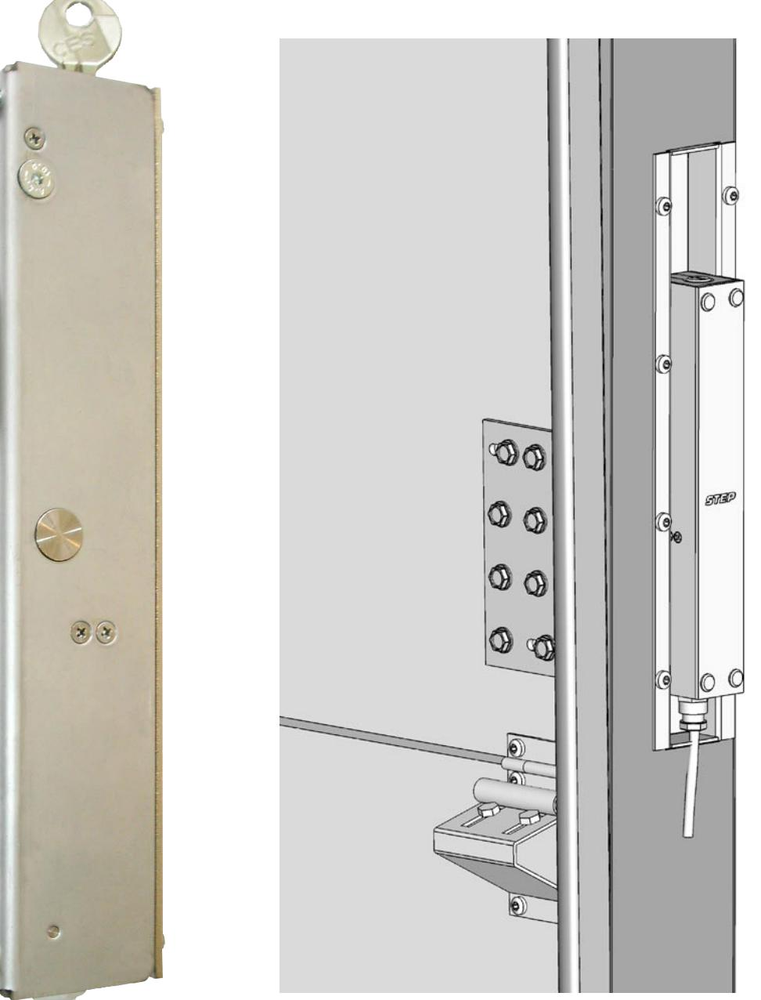
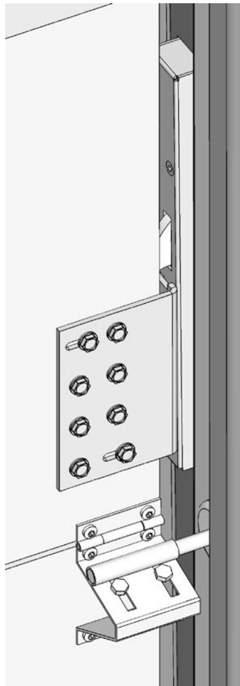
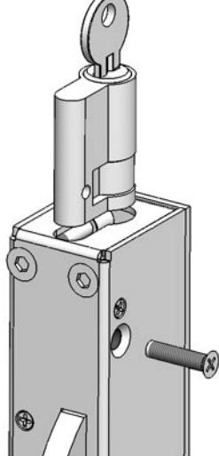
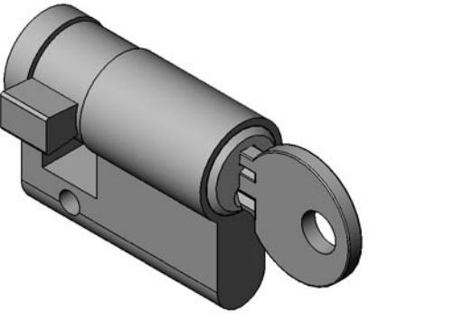
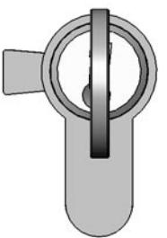
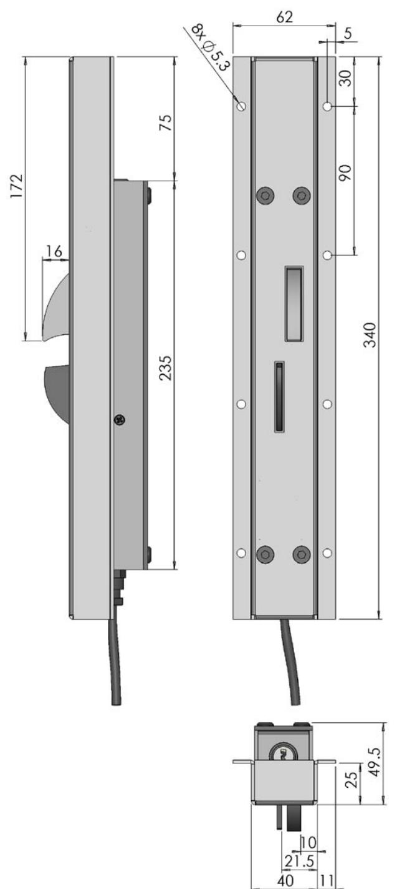
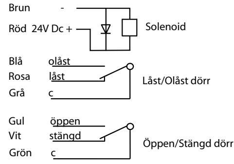

# Montageinstruktion STEP 50 med infällningskassett ST527-5 för industriport med 2 tums skena

### **Montageinstruktion Portlås typ STEP 50**

- 1. Bestäm och märk ut ungefärligt läge för placering av Ellåset STEP 50. Mät så att kassetten får plats i utrymmet mellan väggfästet och hjulskenan. Ellåset kan monteras på höger eller vänster sida av porten och bör monteras så långt ner som möjligt.
Testa att skjuta upp porten med låsvinkeln provisoriskt fastsatt. Kontrollera att inte låsvinkeln fastnar mot skenan och att den går fri från linan.

- 2. Skär ut för låshuskassetten enligt skiss. Borra för M5 skruvarna. Sätt fast kasseten med STEP 50 i skenan med 8st skruvar.
- 3. Ställ porten i sitt nedersta läge, märk upp det läge på portbladet där låsvinkeln skall monteras.
- 4. Upprikta och sätt fast Låsvinkeln i de två slitsade hålen så att låsvinkeln senare kan justeras i sidled.

#### **Montering av cylinder**

Euro cylindern går att få i befintligt Assa Twin system.

För in euro cylindern i STEP 50 med nyckeln i cylindern. Skruva fast cylindern med M5 skruven som ingår. Tappen skall peka åt vänster enligt bild när nyckeln är urtagen.

#### **Urtagsritning för kassett**

- 5. Finjustera inställningen av låsvinkeln då porten stängs så att alltid låshaken kommer ut till låst läge. Step 50 är testad för att klara ett tryck mot låshaken vid öppning. 6. Då injusteringen är klar fastsätts de återstående 5st skruvarna i låsvinkeln. OBS! Fastsättningen skall vara så stabil att den tål en påkänning av ca 1000kg lyftkraft på porten. 7. Låsvinkeln skall fettas in på de ytor som kommer i kontakt med låshaken. 8. Om det finns krav på hög säkerhet i bygnaden, bör kabeln för elanslutning till låset förläggas i pansarrör så att den är oåtkomlig för obehörig (t.ex. skyddad med pansarrör i nära anslutning till låset). Skruvarna till låsvinkeln och kassett bör fastsättas med svets.
### Måttskiss STEP 50 med kassett ST527-5

#### Elschema STEP 50

#### Tekniska specifikationer

Brythållfasthet: 10 kN Material: Låshus i rostfritt stål, Låshake i härdat stål. Spänning: 24 V DC +/-10%, 100% ED 6,5W

#### l förpackning

STEP 50 inkl. fästskruvar låsvinkel och 5m kabel (Bultar för fastsättning av låsvinkel i porten medföljer ej).

## Stendal El AB

Stendal El. AB • Signalistgatan 17 • 721 31 Västerås Tel. 021-189750 • Fax 021-130169 • www.steab.se • postmaster@steab.se