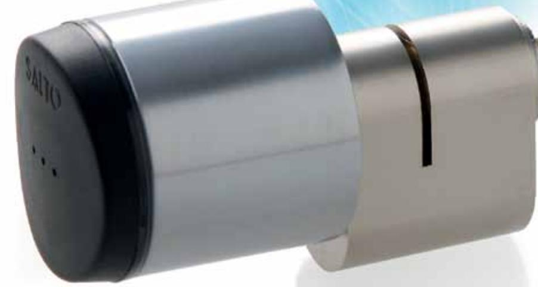
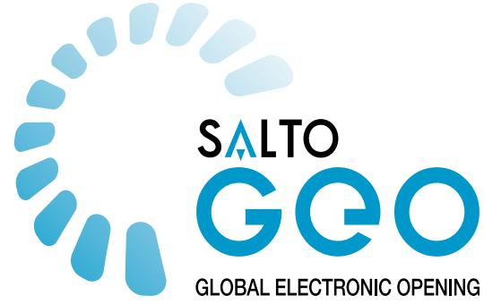
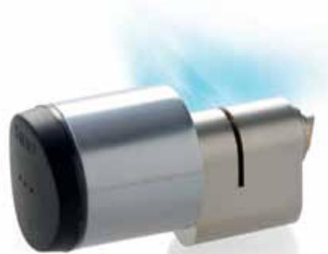
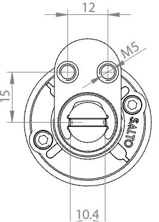
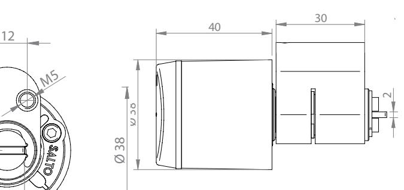

## **SALTO GEO Cylinder** | the next generation of electrionic cylinder lock

# **Scandinavian externalcylinder - G9S1**

Fully integrated with the SALTO XS4 platform, GEO is a versatile, cost effective solution and its compact size and easy installation makes it the ideal electronic locking system for almost any type of door.

## SALTO_geo Electronic **Scandinavian profile Cylinder**

The SALTO GEO Scandinavian profile cylinder is specially designed to fit most Euro doors that are equipped with a Scandinavian external profile cylinder mortise lock. A wire free fully stand alone electronic access control solution.

## **Main features and benefits**

- Fully integrated with the SALTO XS4 platform.
- Virtual network capable through SALTO Virtual Network technology.
- Choice of ID carriers: iButton, Mifare, DESfire.
- NFC compatible on contactless versions.
- All communications between the carrier and the GEO cylinder are encrypted and secure.
- Optical signalling through light ring. Dual colour green/red to indicate access authorisation.
- Acoustic signalling optional.
- Available in 4 different finishes: satin chrome, polished chrome, PVD polished brass and PVD satin brass.
- High security via high resistance, hardened anti-drill protection.
- Concealed fixing screws for greater security and improved aesthetics.
- Emergency opening by means of portable programming device (PPD).

#### **Access control features:**

- Maximum number of users per door: 4 millions.
- Maximum number of doors in a system: 64,000.
- Maximum events on lock audit: 1000.
- Time zones: 256. Time periods: 256.
- Calendars in system: 256.
- Zones in system: 1024.
- User groups: unlimited.

#### **Available lock modes:**

- Standard (locked at all times).
- Automatic opening (8 pairs of "hands free" timed lock and unlocks per day with
- holidays). • Toggle (present card to lock, present
- card to unlock). • Time toggle (present card to lock, present card to unlock depending on schedules).

#### **Technical data:**

### **Current required:**

_1 Lithium standard battery CR2 **Number of openings:** _Up to 40,000 on 1 battery **Environmental conditions: Certifications:**

_Highest EN certification IP degree 66*

* Consult SALTO for furthers details

**SALTO Systems HQ** - Polígono Lanbarren - C/ Arkotz,9 - 20180 Oiartzun Spain Tel.: +34 943 344 550 -Fax: +34 943 341 621 - info@saltosystems.com · www.saltosystems.com

**SALTO International**

SALTO Systems HQ, Spain • SALTO Systems Inc., USA • SALTO Systems Ltd., UK • SALTO Asia-Pacific, Singapore • SALTO Australia SALTO Canada • SALTO Denmark • SALTO Germany • SALTO Mexico • SALTO Middle East • SALTO Netherlands • SALTO Portugal • EVVASALTO Sweden 2