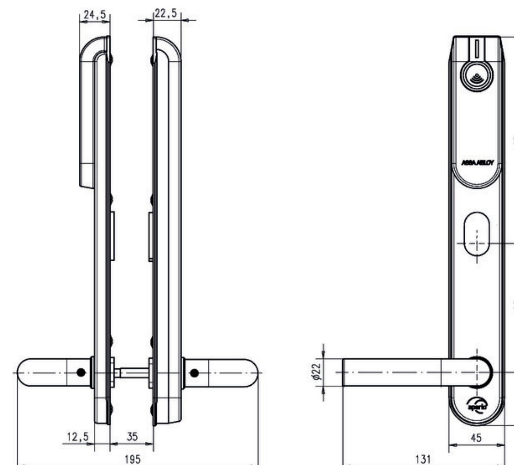

# E100 SCAND Standard dörrbladsläsare Skandinavisk profil

### **Produktbeskrivning**

- Kommunikation från hubben via RS485-bussen till online-passersystemet (adresserbart) beslut om tillträde tas via passersystemet
- Kan användas med alla skandinaviska instickslås i trä-, stål- och rörramsdörrar
- Huvudelektronik (RFID + radio) på utsidan säkerhetsrelevant elektronik på insidan
- Utsidans trycke är frikopplat insidans trycke är alltid inkopplat
- Möjligt att lagra upp till 10 nödkort (används endast om kommunikation med hubben saknas)
- LED för statusindikering

#### **Leveransomfattning**

- 1 dörrbladsläsare med batteri (Lithium CR123A) och installationsanvisning
- Skruvar, borrmall och verktyg (för kabelinföring)

#### **Tekniska data - Standard dörrbladsläsare**

|  | Autentisering                  | Tre autentiseringsnivåer (endast PIN, endast KORT, |
|--|--------------------------------|----------------------------------------------------|
|  |                                | både PIN och KORT)                                 |
|  | Code                           | PIN-kod – 4 till 8 siffror                         |
|  | Godkännanden                   | CE                                                 |
|  | Mått                           | 312 x 41 x 10/20 mm (H x W x D)                    |
|  | Version                        | Standard = Inner- och ytterdörrar upp till klass 2 |
|  | Trycke                         | L-form, U-form                                     |
|  | Yta                            | Borstat rostfritt stål (ST)                        |
|  | Avstånd                        | 105 mm med spindel 8 mm                            |
|  | Dörrtjocklek                   | 35–95 mm tjockt dörrblad, i steg om 10 mm          |
|  | Nyckelhålsavstånd              | > 40 mm                                            |
|  | Monteringsplatta               | 45 mm                                              |
|  | Batteri                        | 1 x Lithium CR123A                                 |
|  | Batterilivslängd               | > 40 000 cykler (max. 3 år)                        |
|  | Radiostandard                  | IEEE 802.15.4 (2.4 GHz)                            |
|  | Kryptering                     | AES 128 bits                                       |
|  | (radiokommunikation)           |                                                    |
|  | Avstånd mellan RFID-läsare och | 25 meters räckvidd beroende på hubtyp och          |
|  | hub                            | byggnadens planlösning                             |
|  | Skyddsklass                    | IP52 (IP54 optional verfügbar)                     |
|  | Drifttemperaturområde          | 0–60 °C                                            |
|  | Luftfuktighet                  | < 85 % (icke-kondenserande)                        |
|  | Dörrstatus                     | LED (röd/grön/orange)                              |
|  | RFID-teknologi                 | iCLASS®/ISO 14443B; MIFARE Classic® / MIFARE®      |
|  |                                | DESFire® EV1; HID PROX/ EM410x; LEGIC®             |
|  |                                | (Advant, Prime, ISO/IEC14443 UID, ISO/IEC15693     |
|  |                                | UID)                                               |
|  | RFID-avläsning                 | UID / Sektor / Block / Application / File / LEGIC® |
|  |                                | Segment Data                                       |
|  | Avläsningsavstånd              | < 4 cm                                             |
|  | Kommunikationsgränssnitt       | Micro USB firmware download and battery back up    |

ASSA ABLOY Scandinavia

Förmansvägen 11 117 43 Stockholm www.assaoem.se/aperio

#### **Sidan 1 av 2 Senaste uppdatering: 08.05.2017 Online-dörrbladsläsare E100 Produktark**

## E100 SCAND Standard dörrbladsläsare Skandinavisk profil

Powered by TCPDF (www.tcpdf.org)

#### **Sidan 2 av 2 Senaste uppdatering: 08.05.2017 Online-dörrbladsläsare E100 Produktark**