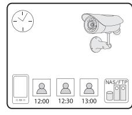

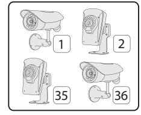

Lär känna YOYOCam Pro

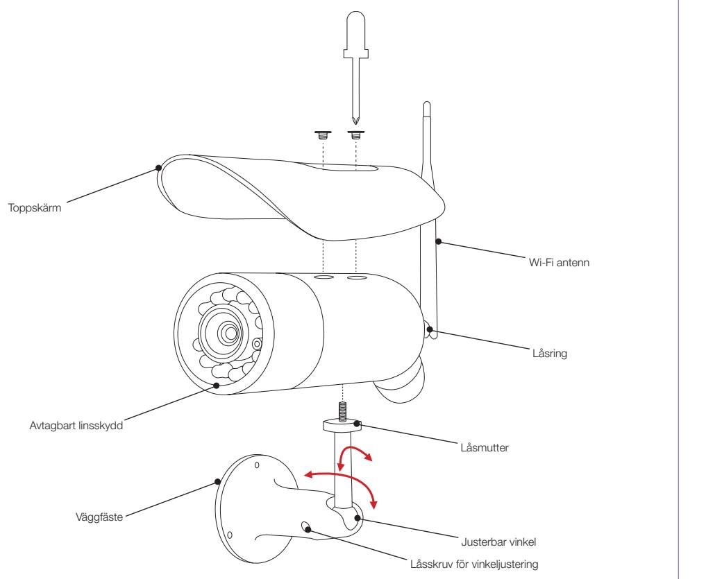

Infraröda LED-lampor för mörkerseende

Kamera

# Förbered YOYOCam Pro

## Sätt i minneskort (microSD) för inspelning

- 1. Se till att strömtillförseln är urkopplad.
- 2. Ta bort toppskärmen och skruva ur linskyddet.
- 3. Vänd undersidan av YOYOCam mot dig.
- 4. Håll microSD-kortet som bilden visar med kontakterna nedåt.
- 5. Skjut försiktigt in microSD-kortet i hållaren tills du hör ett klick.
- 6. Skruva på linsskyddet och montera därefter toppskärmen.

OBS: MicroSD-kortet går att ta ur genom att försiktigt trycka på det till ett klick hörs.

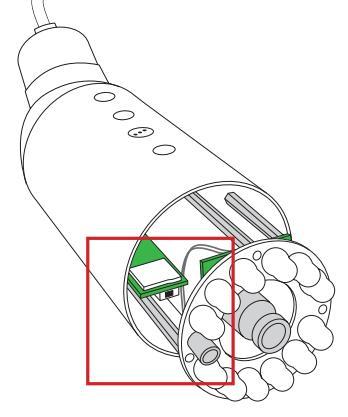

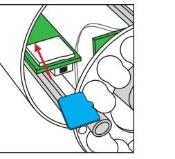

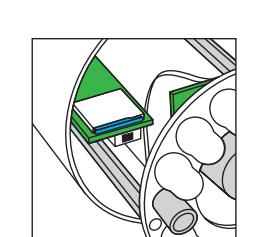

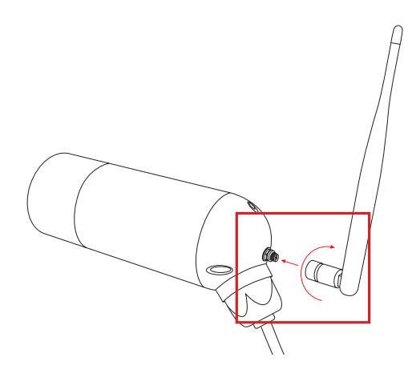

Anslut antennen

1. Placera försiktigt antennkontakten mot antennuttaget.

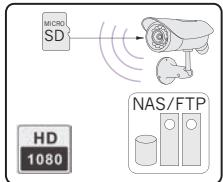

Inspelning, lagring till internt minneskort (ingår ej), nätverksdisk eller FTP-server. Bild kan lagras till smartphone, platta eller PC.

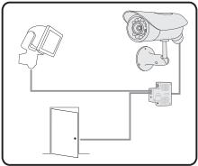

2. Vrid den räfflade låsringen försiktigt för hand tills den är låst. Använd inte verktyg.

3. Rikta antennen vertikalt för bästa mottagning.

# Funktioner

| HD 1080 |   | )))      |
|------------|---|----------|
| = C =      | 0 | 111 œ |

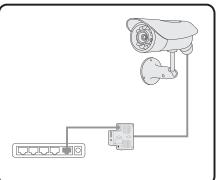

Alternativ uppkoppling med Ethernetkabel till router, inkl. "Power over Ethernet".

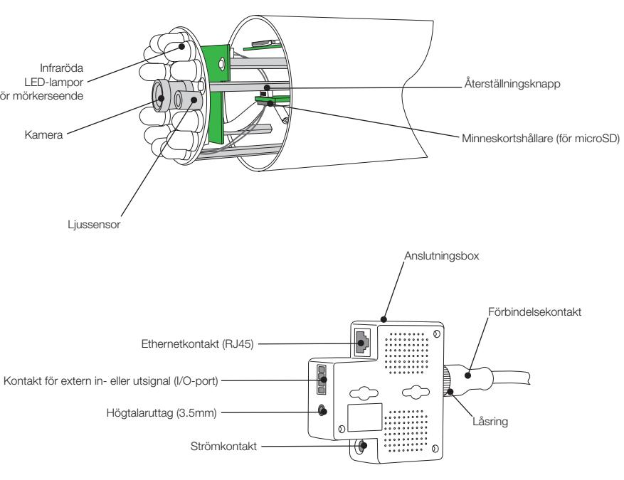

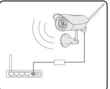

Trådlös uppkoppling via Wi-Fi alternativt med Etherntekabel till router.

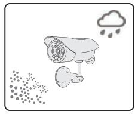

Utomhusbruk (IP66-klassificerad).

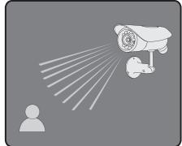

Mörkerseende med infrarött ljus. Optimal bild med automatisk in-och urkoppling av ljusfilter (IR-cut).

- Aviserar vid rörelsedetektering till smartphone, platta eller PC.
Videoström med ljud till smartphone, platta eller PC.

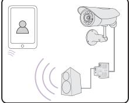

Dubbelriktat ljud – inbyggd mikrofon och anslutning för extern högtalare (ingår ej).

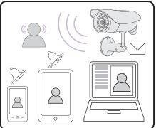

Schemaläggare för att aktivera / avaktivera larmfunktion, ställa in intervall för tagning av ögonblicksbilder samt videoinspelningar.

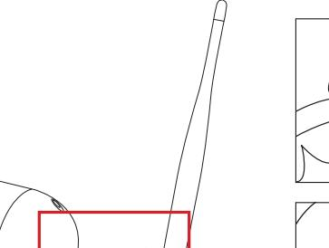

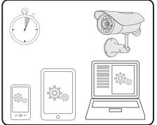

Enkel och snabb inställning från smartphone, platta eller PC.

- Port för trådbunden anslutning av extern givare (t.ex. PIR) samt aktivering av extern enhet (t.ex. siren).
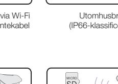

Övervakning av flera kameror (< 36 st.) från smartphone, platta eller PC.

# Lär känna YOYOCam Pro

## Koppla upp till Wi-Fi-router

- 1. Koppla ihop YOYOCam Pro och routern med den medföljande Ethernetkabeln.
- 2. Använd Anyscene-appen i mobilen eller logga in i kameran via en webbläsare:
- Anyscene i Android-mobil: Gå till Edit Camera > Advanced Setting > Network Setup > Wi-Fi Setting. • Anyscene i iPhone eller iPad: Gå till Advanced Setting > Network Setup > Wi-Fi Networks. • webbläsaren i t.ex. en PC: se stycket YOYOCam Pro i din webbläsare.
- 3. När Wi-Fi kopplingen är klar kopplar du ur Ethernetkabeln

# YOYOCam Pro på din iPhone eller iPad

- 1. Sök och installera AnyScene från App Store. (på iPad väljs iPhone Apps i sökresultatet).
- 2. Öppna AnyScene genom att trycka på på startskärmen.
- 3. Tryck på funktionsknappen "Add Camera" (lägg till kamera) längst ned i "Camera List" -vyn (huvudmenyn).
- 4. Kameror som finns i det lokala nätverket visas med UID och IP-adress och läggs till genom att trycka på aktuell UID-rad . Kameror som är uppkopplade till Internet men inte till det lokala nätverket kan läggas till genom att trycka "QRCode" och avläsa QR-koden från etiketten på kamerans kabel. Alternativt klickar du på "Add" (lägg till) och matar in UID för hand.
- 5. "Name" (namn) kan ändras till valfritt kameranamn (utan å,ä och ö). Fyll i "Account" (konto-ID, fabriksinställning: admin) och "Password" (lösenord, fabriksinställning: admin) för kameran.

## 6. Tryck på "Save" (spara).

Tryck på önskad kamera i "Camera List" -vyn (huvudmeny) för att starta direktsänd kameravisning. Tryck "Back" (tillbaka) -knappen för att avsluta. Tryck på för att få tillgång till ytterligare funktioner och redigera de flesta kamerainställningarna.

Som standard använder Anyscene en lägre bildupplösning ("Secondary Stream") vid realtidsvisning och en högre ("Primary Stream") vid inspelning.

Klicka på sedan Advanced Setting > Video Quality > Secondary Stream för att ändra upplösning.

# YOYOCam Pro på din Android Smartphone eller platta

- 1. Sök efter AnyScene-appen i Google Play och installera på din enhet.
- 2. Starta AnyScene, till exempel genom att trycka på i App-menyn.
- 3. Tryck på "Click here to add camera" (lägg till kamera).
- 4. Tryck på "Search" (sök) för att hitta YOYOCam Pro som är anslutna till det lokala nätverket, eller mata in UID från etiketten på kabeln på YOYOCam Pro eller tryck på "Scan" (avläs) och läs in QR-koden från etiketten på kamerans kabel.
- 5. Ange "Account" (konto-ID, fabriksinställning: admin), Security Code (lösen, fabriksinställning: admin) och ändra "Name" (namn) till valfritt namn (utan å,ä och ö) och tryck sedan på OK
- 6. Tryck på valfri kamera i huvudmeny för att öppna direktsänd kameravisning. Tryck tillbaka-knappen för att avsluta.
- 7. Tryck på för att få tillgång till ytterligare funktioner och redigera de flesta kamerainställningarna.

Notera: Som standard använder Anyscene en lägre bildupplösning ("Secondary Stream") vid realtidsvisning och en högre ("Primary Stream") vid inspelning.

Gå till Edit Camera > Advanced Setting > Video Quality > Secondary Stream för att ändra upplösning.

# YOYOCam Pro på din Windows PC

## Ladda ner och installera Camera Live

- 
- 

1. Gå till http://www.yoyomotion.com/yoyocampro.html och ladda ner Camera Live.

2. Dubbelklicka på CameraLive_Setup.exe och följ installationsguiden.

3. Starta Camera Live genom att klicka på Start knappen och välj Camera Live. Eller klicka på.

## Lägg till kamera

2. Klicka på "Discover" (upptäck) för att hitta YOYOCam Pro som är anslutna till det lokala nätverket via Wi-Fi eller Ethernet. Välj önskad kamera och klicka på OK. Eller, mata in för hand UID (t.ex. U7GNU5722V2F81VWCRX1) från

- 1. Klicka på "Add Video" (lägg till video).
- etiketten på kabeln på YOYOCam Pro.
- (utan å,ä och ö) och klicka sedan på "OK".

3. Ange "Password" (lösen, fabriksinställning: admin) och ändra "Name" (namn) till valfritt namn

## Visa direktsänd video från YOYOCam Pro

| Grön | symbolen ar |  |
|------|-------------|--|
|      |             |  |

| ん | Live oppnas. Vanta na |  |
|---|-----------------------|--|
|   |                       |  |

1. Grön symbolen anger att kameran är tillgänglig för visning. Dubbelklicka på kameraikonen.

2. Live öppnas. Vänta några sekunder för att anslutningen ska upprättas.

## 3. Klicka för att avsluta.

## Automatisk sökning av kameror

För att söka kameror i det lokala nätverket klickar du på "Settings" (inställningar) och sedan "Search" (sök). Tillgängliga kameror visas. Välj önskad kamera och klicka på "Browser" (webbläsare). Datorns webbläsare öppnas

och visar kamerans inloggningssida.

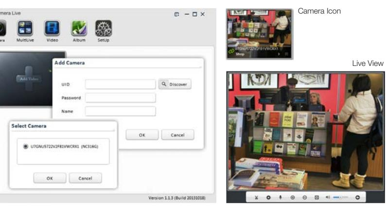

### Visa och ändra kamerans inställningar och visa direktsänd video

- 1. Sök IP-adressen för den YOYOCam Pro som du vill anpassa. En IP-adress är fyra nummer som exempelvis 192.168.1.27
- Använd Anyscene appen i din mobil för att hitta kamerans aktuella IP-adress. Har du en Android mobil eller platta: Gå till Edit Camera > Advanced Setting > About Device > Local. Har du en iPhone eller iPad: Gå till Advanced Setting > About Device > Local.
- • Använd Camera Live på din dator (se föregående avsnitt) för att automatiskt lokalisera kameran
- • I Windows Explorer (Utforskaren) kan kameran hittas genom att klicka på Nätverk
- • Slå upp IP-adressen i din router (se routerns användarhandbok)
- 2. Ange kamerans IP-adress som webbadress i din webbläsare. YOYOCam Pro hemsida visas.

# YOYOCam Pro i din webbläsare

- 3. Klicka på "Enter" för att visa direktsändning från YOYOCam Pro. Ange Användarnamn och Lösenord (fabriksinställning är admin på båda). Första gången kan Quick Time plug-in behöva installeras.
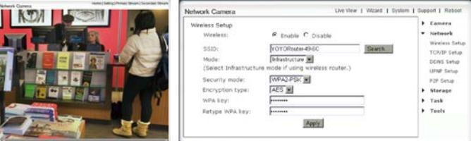

### Manuell inställning av Wi-Fi nätverk

Gå till Wireless Setup (trådlös inställning), tryck på Search... (sök). Välj ditt Wi-Fi nätverk och tryck sedan OK. Mata in säkerhetskoden för ditt nätverk och klicka sedan på Apply (tillämpa). Dra ur Ethernet-anslutningen och se om kameran hittas (enligt ovan) på YOYOCam:s hemsida.

- 4. Klicka på "Setting" (Inställning) för att anpassa inställningarna i YOYOCam Pro klicka. Ange Användarnamn och Lösenord (fabriksinställning är admin på båda). Samtliga inställningar kan visas och anpassas med hjälp av menyvalen till höger.
YOYOCam Pro kommunicerar över Ethernet-anslutningen när kabeln är inkopplad och över Wi-Fi när kabeln är urkopplad. För att kontrollera eller anpassa inställningarna för Wi-Fi så måste kameran vara kabelansluten till en router.

## Viktig information

Läs denna information före användning av YOYOCam Pro.

### YOYOCam Pro modellinformation

| Modell     | Typ                 | Upplösning | 3G | Wi-Fi WPS | Ljudutgång | I/O POE |
|------------|---------------------|------------|----|-----------|------------|---------|
| PU-VGA     | NC316G              | 640x480    |    |           |            |         |
| PU-HD1080  | NC336G              | 1920x1080  |    |           |            |         |
| PW-HD1080  | NC336W              | 1920x1080  |    |           |            |         |
| PWS-VGA    | NC312W              | 640x480    |    |           |            |         |
| PWS-HD720  | NC325W              | 1280x720   |    |           |            |         |
| PWI-HD720  | NC233W-IR 1280x720  |            |    |           |            |         |
| PPI-HD1080 | NC233W-IR 1920x1080 |            |    |           |            |         |

### Säkerhets- och användningsföreskrifter

- • Läs alltid mobiloperatörens särskilda instruktioner för det SIM-kort du använder i kameran. (endast modell YOYOCam Pro PU)
- När SIM-kort monteras skall inte kortets guldmetallkontakt vidröras. (endast modell YOYOCam Pro PU)
- Använd endast strömadapter som är godkänd för YOYOCam Pro.
- Utsätt inte din YOYOCam Pro för damm, vätska eller fukt. (endast inomhusmodeller YOYOCam Pro PWI och Pro PPI)
- Utsätt inte din YOYOCam Pro för lågor eller andra starka värmekällor.
- Vissa modeller av YOYOCam Pro innehåller radiosändare (GSM eller WiFi). Kontrollera om utrustning i närheten, t ex medicinska apparater, kan påverkas.
- Använd inte YOYOCam Pro i flygplan eller andra platser där radiosändare inte är tillåtna.
- Använd inte YOYOCam Pro i explosiv miljö, eller i absolut närhet av airbags.
- Montera inte isär YOYOCam Pro. Det finns inga komponenter som kan underhållas eller repareras av användaren.
- För optimal prestanda skall inte YOYOCam Pro täckas. Placera den för god GSM eller WiFi signalmottagning (modellberoende).

### Avyttring och återvinning

- • Släng inte YOYOCam i hushållssoporna.
- YOYOCam avyttras vid insamlingsplatser avsedda elektronisk utrustning.
- För mer information kan lokala myndigheter, sopstationer eller din återförsäljare kontaktas.

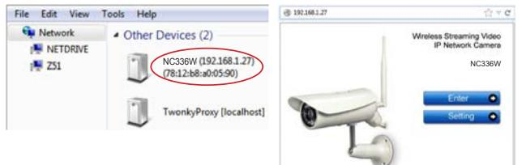

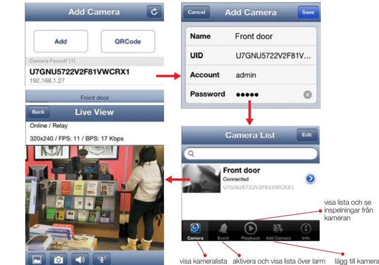

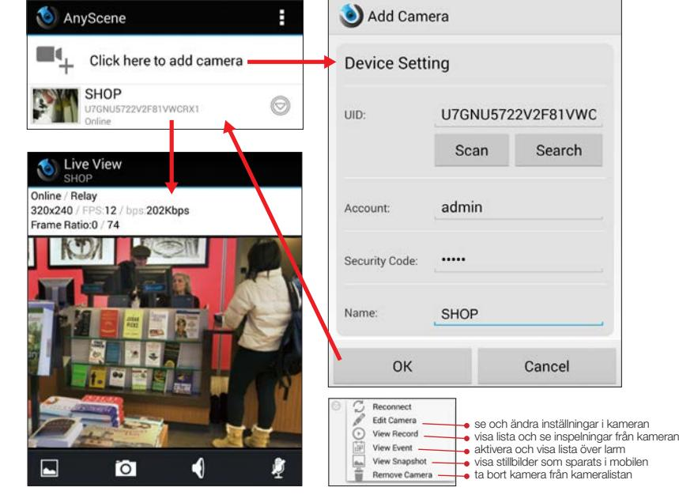