**GEZE** Automatiska dörrsystem

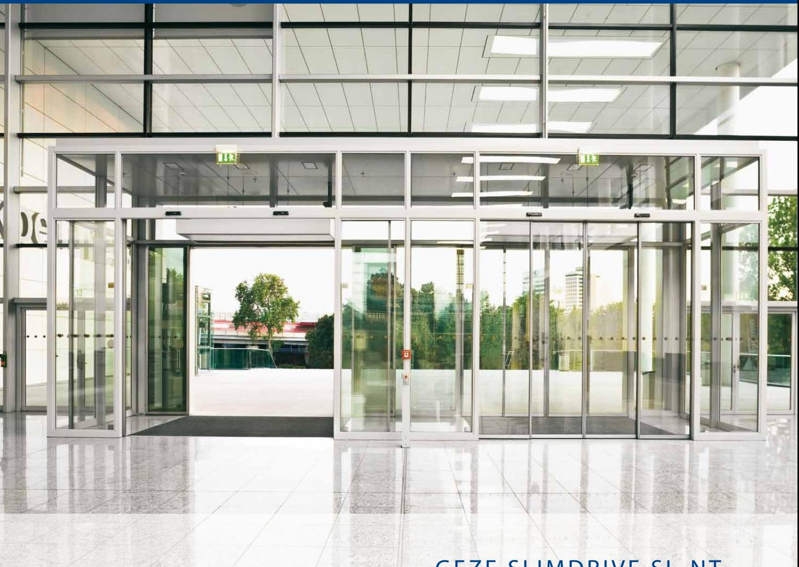

# GEZE Slimdrive sl-NT Skjutdörrsa utomati k

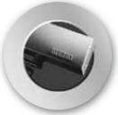

**DØRTEKNIK AUTOMATISKE** 

**Dörrteknik Automatiska**

Dørteknik

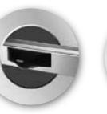

**DØRSYSTEMER**

**dörrsystem**

Dørsystemer

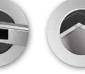

logoer 1 09/03/10 14.29

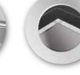

Røgventilation

**Glassystemer**

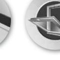

Sikkerhedsteknik

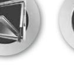

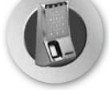

**VENTILATION OG RØGVENTILATION Komfort- och rökventilation**

**GLASSYSTEMER SIKKERHEDSTEKNIK Glassystem Säkerhetsteknik**

Glassystemer

Bewegung mit System

## Skjutdörrsautomatik GEZE Slimdrive sl - NT

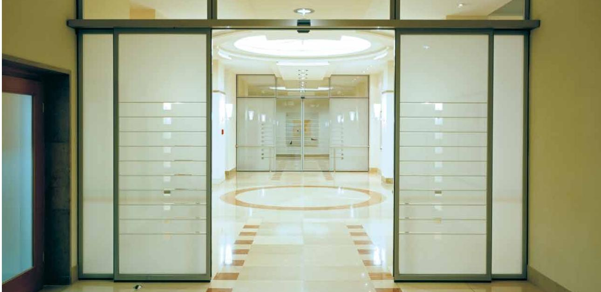

#### **GEZE Slimdrive SL - NT**

Slimdrive SL-NT är en elektromekanisk skjutdörrsautomatik som finns i många olika utföranden. Denna automatik är mycket allsidig och finns för både enkel- och dubbelflygliga dörrar. Slimdrive SL-NT ingår i GEZE's produktlinje där all automatik har en inbyggnadshöjd på 7 cm. Med sin höjd på endast 7 cm passar Slimdrive SL-NT till i stort sett alla typer av fasader och entrépartier. Med Slimdrive SL-NT går det att få en stor öppningsbredd samtidigt som den ger en stor anpassningsbarhet till den omgivande arkitekturen. Skjutdörren är inte längre ett hinder utan kan nästan osynligt integreras bakom glasfasadernas profiler.

Dessutom kännetecknas Slimdrive SL-NT av sin användarvänlighet både för brukaren och installatören. Innovation, design och funktion är krav vi ställer på alla våra automatiker.

#### **Användningsområde:**

- j Invändiga och utvändiga dörrar
- j Ramdörrar
- j Enkel- och isolergalsdörrar
- j Helglasdörrar

#### **Produktegenskaper:**

#### j Bygghöjd 7cm

- j Stilren design
- j Extremt tystgående
- j Öppningsbredd enkelflyglig 700-3000 mm
- j Öppningsbredd dubbelflyglig 900-3000mm
- j Dörrbladsvikt enkelflyglig max 125kg
- j Dörrbladsvikt dubbelflyglig max 2x125 kg
- j Dörrbladshöjd upp till 3000 mm
- j Justerbar öppningshastighet
- j Justerbar stängningshastighet
- j Inbyggnadsmått 70x190 mm
- j Självlärande mikroprocessor
- j Extern programväljare med digital manöverpanel
- j Integrerad batteribackup för nödöppning eller stängning vid strömbortfall.
- j Stängningskraft <150N
- j Öppningskraft <150N
- j Driftspänning 230VAC
- j Självrengörande hjul
- j Dörrbladshöjd upp till 3000 mm
- j Justerbar öppningshastighet
- j Programerbar trådlöst via PC (Bluetooth)
- j Standardfärger silver, brun och vitlackerad i RAL9016
- j Specialfärger i RAL och NCS vid förfrågan

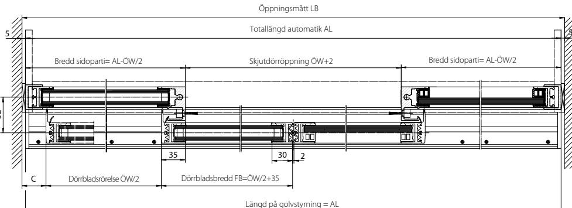

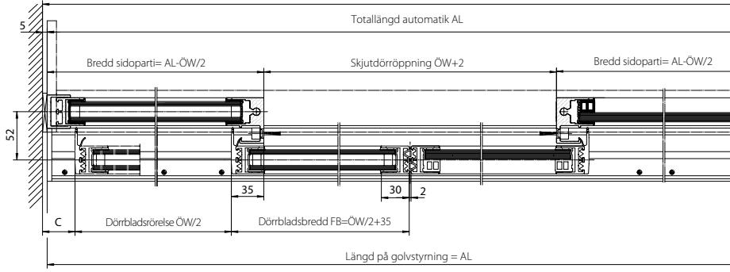

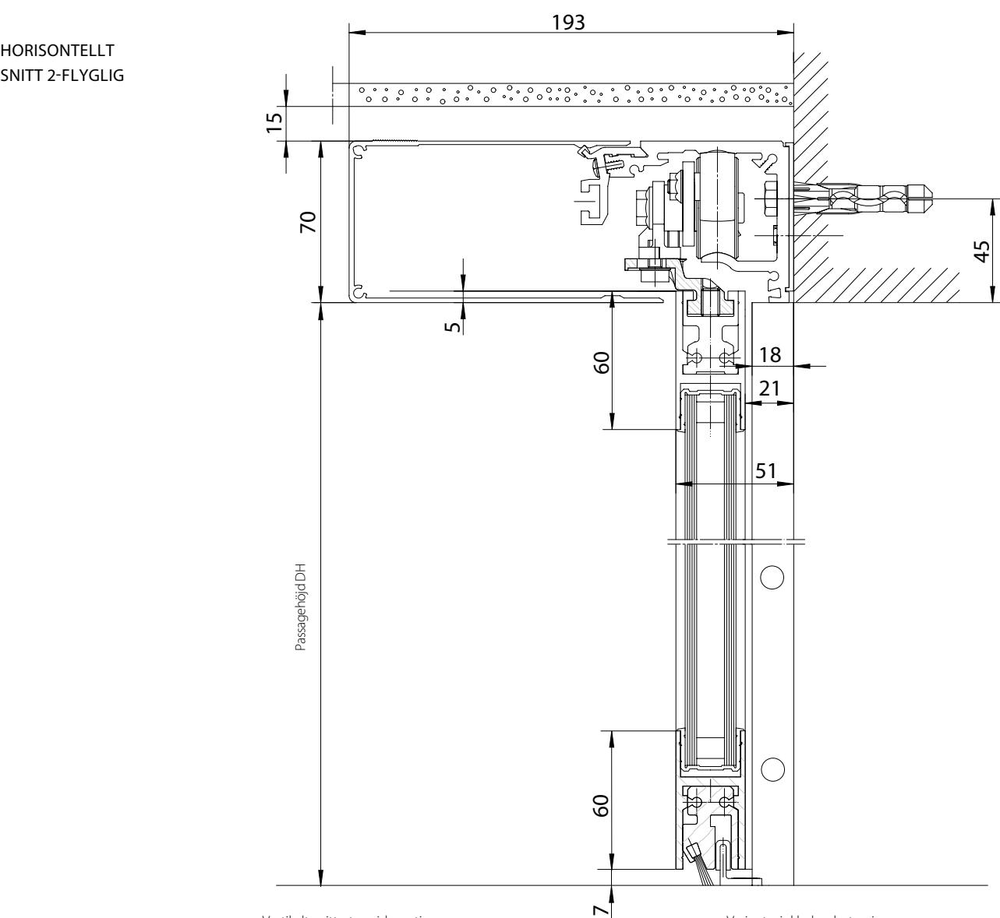

Vertikalt snitt utan sidoparti Variant: vinklad golvstyrning

## Skjutdörrsautomatik GEZE Slimdrive sl - NT

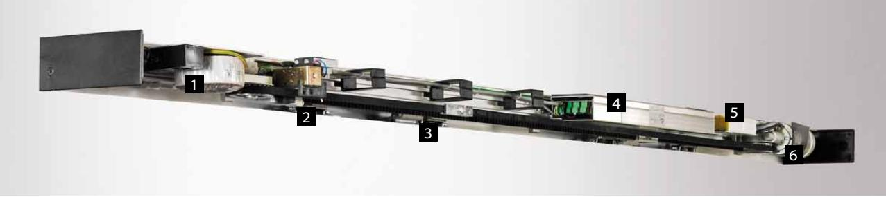

#### **GEZE slimdrive SL**

### 1 Transformator

Kraftull, ljudlös

#### 2 Elektromekaniskt lås

Stabilt och pålitligt elektromekaniskt lås, med möjlighet för manuell nödöppning. Låset övervakas konstat av styrningen som säkerhet mot missbruk.

#### 3 Rullvagn

Optimala köregenskaper och minimalt slitage genom rullarnas och löpskenans speciella utformning.

#### 4 Styrning

Den självlärande 16-bit mikroprocessorn i styrenheten anpassar själv driftparametrarna efter förhållandena för installationen. Styrningens mjukvara kan enkelt och lätt uppdateras.

#### 5 Batteri

Vid en nödsituation eller vid strömbortfall säkerställer det lätta och kompakta NiMH-batteriet att dörren kan fortsätta att öppna och stänga.

#### 6 Motor

Kraftfull men extremt tystgående 400Ncm motor med inkapslad växel.

#### **Tillbehör:**

- j Säkerhetsfotoceller
- j Radar
- j Elektromekaniskt lås
- j Programväljare
- j Armbågskontakter
- j Nyckelbrytare
- j Tryckkontakter
- j Fjärrstyrning

#### **Slimdrive SL varianter:**

- j Slimdrive SL NT, Enkel- och dubbelygliga skjutdörrar
- j Slimdrive SLT, Två- och fyrflygliga teleskopskjutdörrar
- j Slimdrive SLV, Vinklade skjutdörrar
- j Slimdrive SF, Vikskjutdörrar
- j Slimdrive SC, Halvrundöppnande skjutdörrar
- j Slimdrive SCR, Rundöppnande skjutdörrar

#### **GEZE Scandinavia GEZE Sverige**

Mallsingan 10 Box 7060 S-187 11 Täby Tel. +46 (0) 8-732 34 00 Fax +46 (0) 8-732 34 99 E-mail: sverige.se@geze.com www.geze.se

#### **GEZE Danmark**

Mårkærvej 13 J-K DK-2630 Taastrup Tel. +45 46 32 33 24 Fax +45 46 32 33 26 E-mail: danmark.se@geze.com www.geze.dk

#### **GEZE Norge**

Industrivegen 34B NO-2072 Dal Tel. +47 63 95 72 00 Fax +47 63 95 71 73 E-mail: norge.se@geze.com www.geze.no

### Bewegung mit System