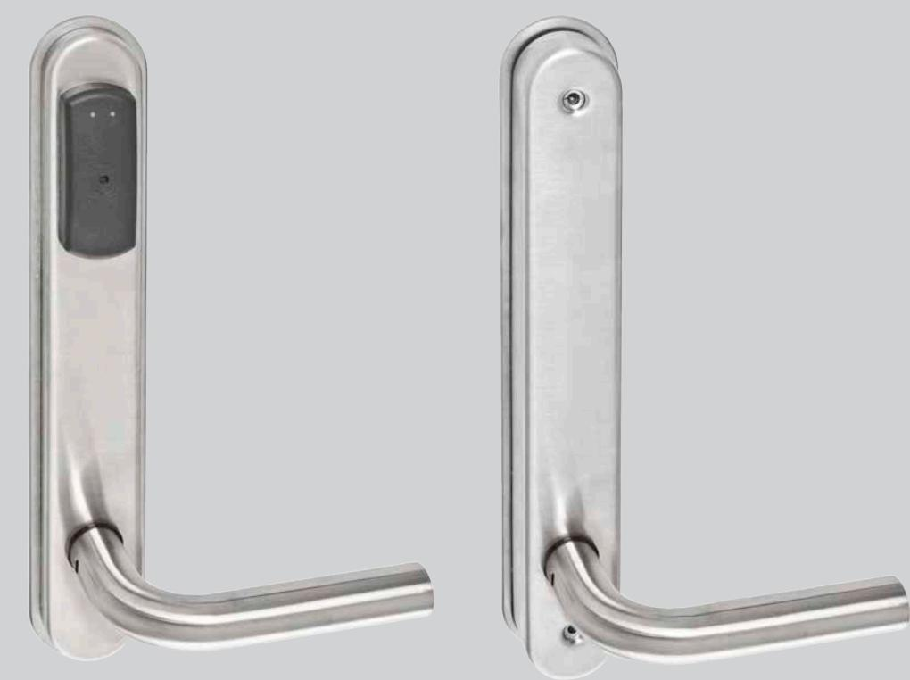
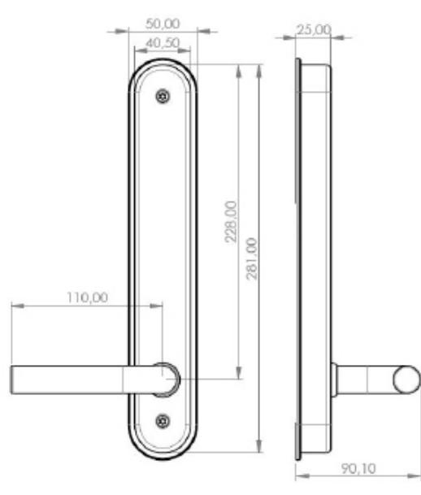

# SMARTair system dörrläsare SKAND

## Dörrmonterad läsare till TS1000 programvara

ASSA ABLOY, the global leader in door opening solutions

#### **Användningsområde**

SMARTair system dörrläsare SKAND är en dörrmonterad läsare baserad på beröringsfri MIFARE-teknik. Den har en fästplåt anpassad för Skandinaviska låshus vilket gör att du inte behöver borra i dörren.

Den är tillverkad i rostfritt stål och drivs av 3 st AAA batterier som klarar upp till 20 000 öppningar. Batterier och elektronik sitter på "den säkra sidan" av dörren vilket gör att det inte går att komma åt för obehöriga. Läsaren indikerar öppningar och stängningar via röd och grön lysdiod.

I god tid innan batterierna tar slut, blinkar lysdioderna som en varning. Skulle du trots det missa att byta batteri, kan du öppna med hjälp av programmeringsenhet och en auktoriseringsnyckel som är kopplad till SMARTair licensen och ingår i TS1000 programvara. Från insidan är dörren alltid mekaniskt öppningsbar. Läsaren programmeras och driftsätts med TS1000 programvara och programmeringsutrustning.

- Läsaren finns som standard i fyra varianter:
- Med vred och hål för standard ASSA oval cylinder (L8V)
- Med enbart vred (L5S)
- Utan vred eller cylinder (L1S)
- Med hål för standard ASSA ovalcylinder (L2V)

Det finns fyra varianter av dörrtrycke att välja mellan, utformade så att de kan anpassas till ASSAs övriga tryckessortiment. Läsaren levereras i rostfritt stål men finns även som beställningsvara med valfri ytbehandling.

Läsaren kan installeras på de flesta av ASSAs fallhakregel och fallregellås. Vi rekommenderar låshus 236 Connect eller modullås 8560,8561 och 8562 för modell L1S och L2V då dessa har förreglat tryckesfall. För modellerna L8V och L5S rekommenderar vi ASSA 340 Connect som har hakregel och förreglat tryckesfall.

# SMARTair system dörrläsare SKAND

ASSA ABLOY, the global leader in door opening solutions

## Dörrmonterad läsare till TS1000 programvara

#### **Innehåll**

- Läsaren levereras komplett med utsida och insida, 3 st AAA batterier, skruvar, insexnyckel samt 1 installationskort
- Levereras i en version för höger/vänster
- Tryckespinnesats SKAND och Torx-mejsel beställs separat.
- Tryckespinnen är ledad i två delar, där utsidan aktiveras vid godkänd öppning. Observera att det inte är samma tryckespinnar som till SMARTair standard dörrläsare
- Beräkna rätt längd på pinnen i förhållande till dörrens tjocklek samt låshusets placering i dörren (A+B mått). Max dörrtjocklek 100mm
- Läsaren levereras i s.k. installationsläge. Till varje läsare ingår ett installationskort som fungerar i läsaren tills systemet är driftsatt med systemkoden. Om du visar installationskortet en gång, öppnar dörren och låser sedan automatiskt. Visar du kortet två gånger ställs dörren i olåst läge. För att låsa, visar du kortet två gånger igen

#### **Teknisk beskrivning Läsarmodul**

- 
- Teknologi: MIFARE Classic som standard, iCLASS som beställningsvara
- Läsavstånd 10 mm med standard kort/tagg
- Anslutningskontakt för programmeringsenhet sitter i läsarmodulen

#### **Elektronik/kontrollenhet**

- Icke flyktigt minne, dvs all information, med undantag av klockan, ligger kvar om batteriet tar slut
- Upp till 1 500 personer och 1 000 loggar
- Realtidsklocka (tid förs över från PCn vid initiering) och kalender. Vid batteribyte ska tiden uppdateras

### **Säkerhetsnivåer**

- Låst (standard). Öppnas med kort/tagg och låser sedan efter 1-8 sekunder
- Olåst läge manuellt med kort/tagg eller enligt schema
- Olåst efter första godkända öppning låser enligt schema
- Tvåkortsfunktion kort från två personer krävs för att öppna dörren
- Längre öppningstid för funktionshindrade

#### **Drift**

- 3 st 1,5 V alkaline batterier, typ LR03 AAA
- 20 000 öppningar eller max 2 år
- Stand by konsumtion 20 mA

### **Temperaturområde**

- 0-65°C
- Upp till 85% luftfuktighet
- För känsliga/kalla miljöer kan fuktskyddad läsare beställas

#### **Certifikat**

- CE-testad och godkänd
#### **Övrigt**

- Elektronisk "stör ej"-funktion i läsare med vred tillträde kan nekas om vredet aktiveras från insidan. Lämpligt för t. ex. boenderum
#### **Artikelnummer**

- SNCC32SL1S008VI SMARTair system dörrläsare SKAND/L1S
- SNCC32SL2V058VI SMARTair system dörrläsare SKAND/L2V
- SNCC32SL5S058VI SMARTair system dörrläsare SKAND/L5S
- SNCC32SL8V058VI SMARTair system dörrläsare SKAND/L8V
- SNCC32XL1S008VI SMARTair system dörrläsare SKAND fuktskyddad L1S

- SMARTair tryckespinnesats SKAND beställs separat.
ASSA AB P.O. Box 371 SE-631 05 Eskilstuna

Sweden

Phone +46 (0)16 17 70 00 Fax +46 (0)16 17 70 49 Customer support: phone intl. +46 (0)16 17 71 00 Phone nat. 0771-640 640 Fax +46 (0)16 17 73 72

ASSA ABLOY is the global leader in door opening solutions, dedicated to satisfying end-user needs for security, safety and convenience

- **Tillbehör**