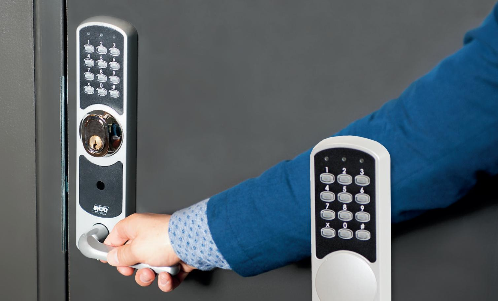
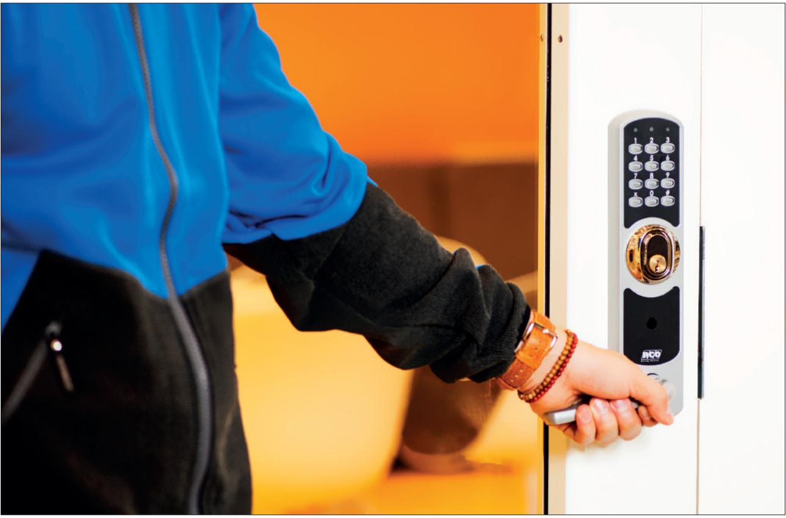
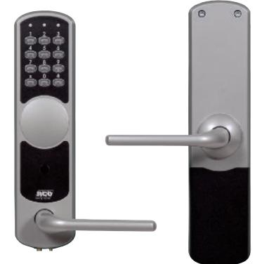
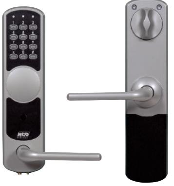
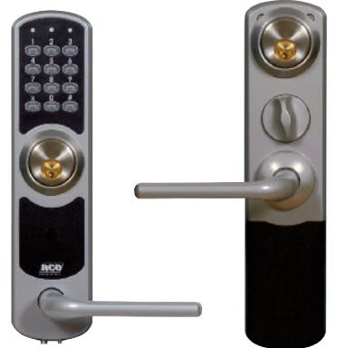
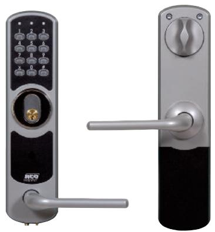

# Batteridrivet kodlås för inner- och ytterdörrar NoKey force

ELEKTRONISKA LÅS FÖR HEM OCH FÖRETAG

# **Ersätt nycklarna med ett säkert kodlås**

**Ett kodlås är det perfekta alternativet till vanliga nycklar när många personer ska passera genom en dörr, eller i en villa eller lägenhet där man vill ha låst när man går ut på tomten eller till tvättstugan. Olåsta dörrar medför låg säkerhet, dessutom är nyckelhantering både omständligt och osäkert. Lösningen på problemet är RCO:s kodlåsserie NoKey force – en svensk produkt anpassad för nordiska förhållanden där både utveckling och konstruktion sker i Järfälla i Stockholm.**

NoKey force är en serie kodlås som erbjuder snabb och smidig dörrpassage för den som är behörig samtidigt som obehöriga effektivt stängs ute. Kodlåset passar för både inner- och ytterdörrar och är mycket enkelt att montera på exempelvis kontorsdörrar, datarum, arkiv och lager.

NoKey force kan även monteras på villa- eller lägenhetsdörrar och kompletteras då med cylinder och hemma/borta-säker funktion. Alla enheter innehåller handtag, både på in- och utsidan, och vred i förekommande fall.

### **Batterier med lång livslängd**

Kodlåset använder sig av vanliga AA-batterier som har väldigt lång livslängd – cirka tre år räknat på hundra öppningar om dagen. Ett batteribyte är dessutom väldigt enkelt att göra på egen hand då endast en skruv behöver lossas för att utföra bytet.

#### **En giltig kod öppnar dörren**

NoKey force bygger på principen att handtaget i normalläge är frikopplat. Men med en giltig kod kopplas handtaget in under en inställbar tid och dörren går att öppna.

#### **Säker konstruktion försvårar sabotage**

NoKey force erbjuder hög säkerhet eftersom all inkoppling och mekanik sitter på insidan av dörren, vilket försvårar manipulation väsentligt jämfört med produkter med allt på utsidan.

### **NoKey force – fyra modeller med olika funktioner**

#### **NoKey force K01**

Denna modell är avsedd för enkla inner- och ytterdörrar och är helt utan cylinder och vred. Genom att slå förvald kod kan man öppna dörren och passera. Utpassage sker direkt genom att handtaget dras ner.

#### **NoKey force K03**

Denna modell har vred på insidan och kan monteras på inner- och ytterdörrar där man vill låsa säkert inifrån. Den är exempelvis lämplig för bakdörrar till butiker där man vill slippa nycklar men ändå kunna låsa säkert nattetid. Genom att slå förvald kod kan man öppna dörren och passera. Utpassage sker direkt genom att handtaget dras ner.

#### **NoKey force KC02**

Denna modell är lämplig för villan eller lägenheten och monteras i kombination med godkända rundcylindrar på in- och utsidan av dörren. Modellen innehåller ett litet vred på insidan som används för att låsa och låsa upp. Genom att välja 2000-, 2002- eller 2500-låshus som är godkända så kan man även ställa säkert hemma- och bortaläge. Fördelen är att det alltid är låst när man går ut även om cylinderlåsningen inte används. Genom att slå förvald kod kan man öppna dörren och passera. Utpassage sker direkt genom att handtaget dras ner när cylindern är upplåst.

#### **NoKey force KC03**

Denna modell är utförd med vred på insidan och kan kompletteras med oval eller rund cylinder på utsidan. Även denna passar för exempelvis butiker men kan även sitta på entrédörrar eftersom man kan låsa säkert med cylinder och på så sätt uppnå högre säkerhet. Genom att slå förvald kod kan man öppna dörren och passera. Utpassage sker direkt genom att handtaget dras ner när cylindern är upplåst.

### **TEKNISK DATA NoKey force**

## **KODLÅS**

| Utförande: | Silvermetalic. Chassi i zink, täck |  |
|------------|------------------------------------|--|
|            |                                    |  |

**Mått (BxHxD):** Yttre enhet: 67x260x17 millimeter

Inre enhet: 68x272x25 millimeter **Vikt:**

Yttre enhet: 1 160 gram Inre enhet: 1 440 gram

**Dörrblad:** 

Max/min tjocklek: Standard: 38–80 millimeter

**Matningsspänning:** 5 st. Alkaline AA  LR6-batterier

**Livslängd batterier:** Mer än 3 år vid normal användning

(100 passager per dag) **Alt. strömförsörjning:** 9-volts batteri (6LR6) för reservkraft på utsidan. Extern matning på insidan med 9 volt DC **Temperaturområde:** Insida: +5 till +40 grader C Utsida: -25 till +55 grader C **Antal koder:** 98 stycken 3–6-siffriga

**Öppningstid:** 1–30 sekunder

handtag i zink (nickelfria)

lock i aluzink, batterilock i PC/ABS,

Med tillbehör: 38–110 millimeter

### **FUNKTIONER**

| • Antibakteriella handtag |  |
|---------------------------|--|
|                           |  |

- Smidig montering
- Enkelt batteribyte endast en skruv behöver lossas
- Passar bra både för företaget och hemmet
- All mekanik på insidan för högre säkerhet
- Flera olika modeller för alla behov

