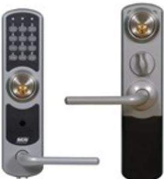

## NOKEY FORCE KC02, RUNDCYL.

Artikelnummer: 12040265, E-nummer: 5801066

NoKey force är en serie kodlås som erbjuder snabb och smidig dörrpassage för den som är behörig samtidigt som obehöriga effektivt stängs ute. Kodlåset passar för innerdörrar och är mycket enkelt att montera på exempelvis kontorsdörrar, datarum, arkiv och lager.

NoKey force kan även monteras på lägenhetsdörrar och kompletteras då med cylinder och hemma/borta-säker funktion. Alla enheter innehåller handtag (antibakteriella), både på in- och utsidan, och vred i förekommande fall.

Kodlåset använder sig av vanliga AA-batterier som har väldigt lång livslängd – cirka tre år räknat på hundra öppningar om dagen. Ett batteribyte är dessutom väldigt enkelt att göra på egen hand då endast en skruv behöver lossas för att utföra bytet. Enheterna varnar i god tid innan de förbrukat batterierna.

NoKey force bygger på principen att handtaget i normalläge är frikopplat. Men med en giltig kod kopplas handtaget in under en inställbar tid och dörren går att öppna.

Denna modell är lämplig för lägenheten och monteras i kombination med godkända rundcylindrar på in- och utsidan för att låsa och låsa upp. Genom att välja 2000-, 2002- eller 2500-låshus som är godkända så kan man även ställa säkert hemma- och bortaläge. Fördelen är att det alltid är låst när man går ut även om cylinderlåsningen inte används. Genom att slå förvald kod kan man öppna dörren och passera. Utpassage sker direkt genom att handtaget dras ner när cylindern är upplåst.

*Viktigt: Endast inomhusmontage.*

Svensk manual:  [NoKey Force – Installera och driftsätta](https://www.rco.se/File/DownLoadFile?fileId=9c1db7ca-70ce-4dd7-855b-8aaf3ae17283)

Norsk manual:  [NoKey Force – Installere og idriftsette](https://www.rco.se/File/DownLoadFile?fileId=3088d348-8b72-4bed-a91e-b9c5c0642213)

Engelsk manual:  [NoKey Force – Installing and Operating](https://www.rco.se/File/DownLoadFile?fileId=9047b13f-6e97-4081-b5e3-1c30fd264100)

| Silvermetallic                                     |
|----------------------------------------------------|
| Zink (nickelfria och antibakteriella handtag)      |
| 5 st Alkaline AA LR6-batterier (ingår ej           |
| 9-volts batteri (6LR6) för reservkraft på utsidan. |
| 1,16 kg                                            |
| 1,44 kg                                            |
| +5 till +40 °C                                     |
| +5 till +55 °C Rekommenderas för inomhusbruk       |
| 67x260x17 mm                                       |
| 68x272x25 mm                                       |
| 38-80 mm                                           |
| 38-110 mm                                          |
| Mer än 3 år vid normal användning                  |
| 98 stycken 3-6-siffriga                            |
| 1-9 sekunder, 30 sekunder                          |
|                                                    |