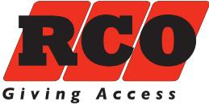
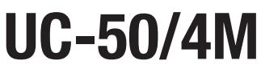
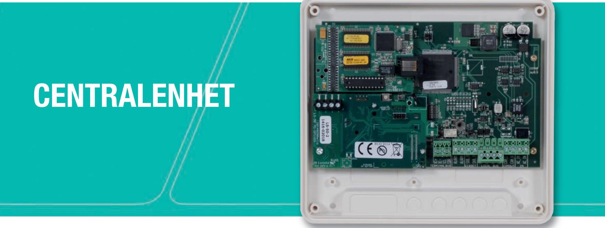
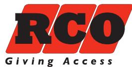

## **Undercentral för gemensam administration av flera mindre objekt med få dörrar UC-50/4M**

**ELEKTRONISKA LÅS FÖR HEM OCH FÖRETAG**

## **EN SPECIALANPASSAD UNDERCENTRAL FÖR MINDRE OBJEKT**

UC-50/4M är en kostnadseffektiv lösning för mindre anläggningar, exempelvis butiker, förskolor eller tekniska utrymmen. Produkten är en specialversion av RCO:s centralenhet UC-50 – hjärnan i R-CARD 5000-systemet som kontrollerar och övervakar övriga anslutna enheter.

UC-50/4M är speciellt framtagen för objekt där man endast behöver säkra ett fåtal dörrar med hjälp av en passer- och larmlösning, men ändå vill kunna sköta all administration centralt via mjukvaran R-CARD M5 (minst version 5.37.5 krävs) och slippa flera olika system.

Undercentralen klarar maximalt av fyra dörrmiljöer (tre dörrar och en manöverpanel) och kopplas som en anknytning till M5. Enheter som kan anslutas till UC-50/4M, förutom RCO:s utbud av larmgodkända 60-läsare, är DIO-DB, DIO-IO och manöverpanelerna R-TOUCH 50, MINI MAP samt MAP59.

## **TEKNISK DATA**

| Utförande:        | Plast, vit          |
|-------------------|---------------------|
| Matningsspänning: | 10–30V DC 8–24V  AC |
| Strömförbrukning: | 63mA                |
| Temperaturområde: | +5°C till +60°C     |
| Mått (mm, BxHxD): | 200x180x50          |

**Matningsspänning:** 10–30V DC 8–24V  AC

## **FUNKTIONER**

- Undercentral för upp till fyra dörrar
- Sabotageskyddad kapsling
- Utgång för "Summa larm"
- Inkluderar TCP/IP-modul IP50 och LS-50 PSTN
- Begränsad till att anslutas som en anknytning till M5
- Ej stöd för systembus (CAN eller över IP)
- Obs! Mjukvaran R-CARD M5 ingår ej

**ELEKTRONISKA LÅS FÖR HEM OCH FÖRETAG**

RCO Security AB | 08-546 560 00 | Order 08-546 560 10 | info@rco.se | www.rco.se