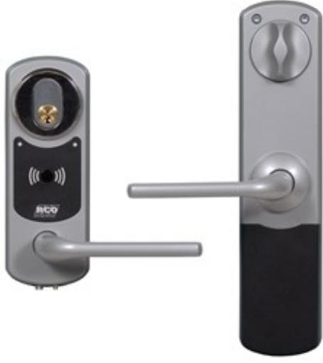

## NOKEY MIF-508 C03,OVALCYL.

Artikelnummer: 20180310, E-nummer: 5870443

NoKey online Mifare C03 utan tangentbord för ovalcylinder med vred på insidan. Läsaren passar på dörrar med modul / Connect lås. Installationen gör ingen åverkan på dörren, istället sker montering med de behör man har för vanlig cylinderfastsättning och handtagets fastsättning.

Eftersom all inkoppling och mekanik LJnns på insidan av dörren försvåras manipulation och sabotage. Samtliga NoKey online-läsare har ingång för dörravkänning och Mifare-modellerna fungerar dessutom som initieringsläsare för NoKey odžine.

| Utförande:                                 | Silvermetallic. Chassi och handtag i zink       |
|--------------------------------------------|-------------------------------------------------|
| Anslutningar:                              | Lokalbuss                                       |
| Matningsspänning:                          | 12-24 V DC                                      |
| Strömförbrukning:                          | Nominellt 35 mA @ 24 V DC. Max 300 mA @ 24 V DC |
| Vikt:                                      | 1,16 kg                                         |
| Vikt inre enhet:                           | 1,44 kg                                         |
| Temperaturområde:                          |                                                 |
| Temperaturområde insida:                   | +5 till +40 °C                                  |
| Temperaturområde utsida:                   | -25 till +55 °C                                 |
| Mått (BxHxD):                              | 67x181x17 mm                                    |
| Mått inre enhet (BxHxD:                    | 68x290x25 mm                                    |
| Lästeknik:                                 | DesLJre EV2, Mifare Classic                     |
| Sändarfrekvens:                            | 13,56 MHz                                       |
| Läsavstånd:                                | Ca 1-2 cm beroende på transponder               |
| Inläsning som stöds:                       | DesLJre RCO App, serienummer och sektorläsning  |
| Dörrblad standard (max/min tjocklek):      | 38-80 mm                                        |
| Dörrblad med tillbehör (max/min tjocklek): | 38-110 mm                                       |