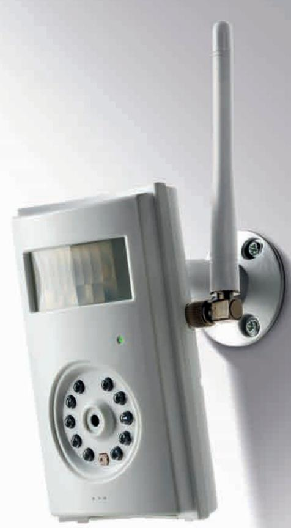
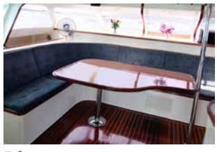
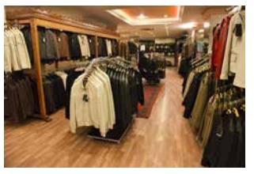
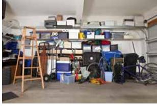
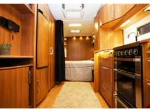
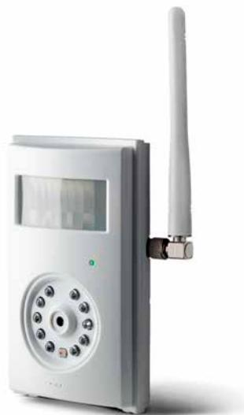
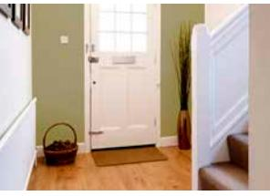
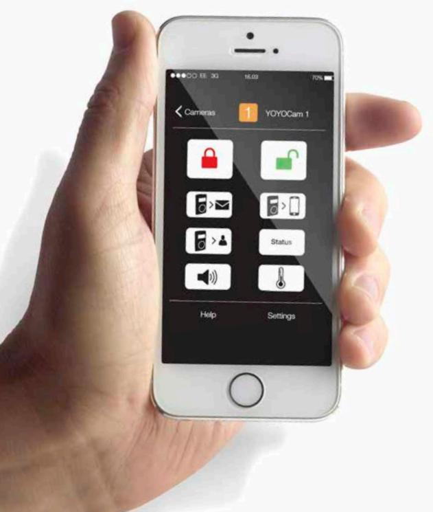
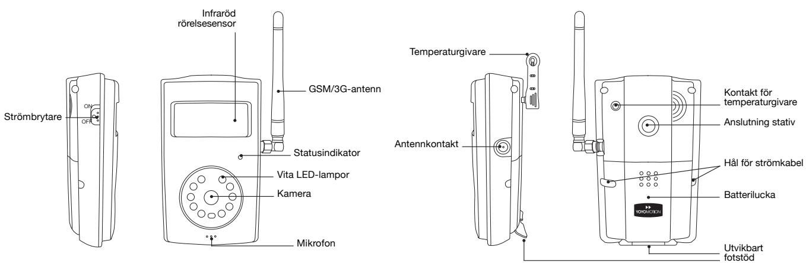
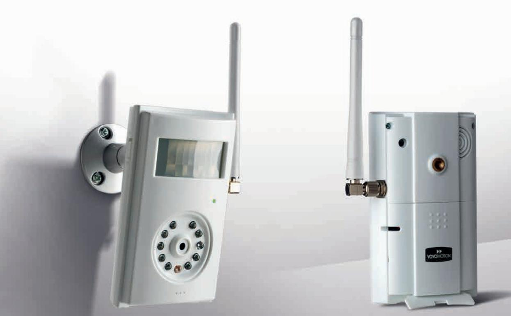

# **Cam 3G Indoor**

### 3G-kameran som larmar och bevakar inomhus

Lättinstallerad övervakningskamera för inomhusbruk som skickar sms och högupplösta bilder direkt till mobilen.

App för hantering och inställningar: **YOYOCam 3G Indoor**

**yoyomotion.com**

# **Inomhuskameran som larmar direkt till mobilen**

*Huset, sommarstugan, garaget, båten… Med YOYOCam 3G Indoor kan du enkelt och snabbt få larm och högupplösta bilder direkt till mobilen inifrån de platser du vill övervaka.*

Båten

Butiken

Förrådet

Kontoret

Husvagnen

Garaget

Stugan

Hemmet

### **Lätt att installera och använda**

YOYOCam 3G Indoor installerar du enkelt på några minuter. Allt du behöver är ett SIM-kort och elström. Du kan fjärrstyra kameran från din mobil via SMS och få larm och bilder direkt till din mobil.

#### **Användarvänlig app**

För iPhone och Android finns en användarvänlig app för hantering och inställningar. Den hjälper dig att snabbt ställa in extrafunktioner som schemalagd aktivering och avaktivering, intervaller för bildtagning, antal bilder som ska skickas, bildupplösning etc.

#### **Säker drift och backup**

YOYOCam 3G Indoor har inbyggd 3G- och GSM -kommunikation. Det ger dig bättre täckning och snabbare kommunikation via 3G-nätet. YOYOCam 3G Indoor© larmar via SMS vid strömavbrott och har inbyggd batteribackup som garanterar en störningsfri drift.

#### **Högupplösta bilder**

Kameran i YOYOCam 3G Indoor ger bilder med upplösning upp till 1 megapixel med bra färgåtergivning och skärpa. Det gör att du i detalj kan se vad som händer.

#### **Inbyggd rörelsedetektor och utvecklat mörkerseende**

YOYOCam 3G Indoor har en inbyggd infraröd detektor som direkt upptäcker rörelser. Den larmar då inom några sekunder till din mobil via SMS, därefter skickar den högupplösta bilder som MMS eller via e-post. Vid mörker och skymning sätts även kamerans vita LED-lampor automatiskt på för bättre mörkerseende och återgivning.

#### **Låga installationsoch användarkostnader**

Utöver elanslutning behövs varken tråddragning, larmabonnemang, uppkoppling till server eller internetbaserade system. Installations- och användarkostnaderna blir minimala. Det som tillkommer är kostnader för SIM-kort och GSM-/3G-trafikavgifter.

### **Återförsäljare**

För mer information om YOYOCam 3G Indoor och var du kan köpa den, besök vår hemsida på yoyomotion.com eller skicka ett mail till sales@yoyomotion.com.

## **Cam 3G Indoor**

#### **Tekniska specifikationer**

| Kommunikation                    | GSM/3G                         |
|-------------------------------------|--------------------------------|
| Larmdetektering                  | Inbyggd IR-sensor (PIR)        |
| Larmmeddelanden                  | SMS, bild (MMS, E-post)        |
| Bildupplösning                      | Upp till 1280x768 px (1 Mp)    |
| Mikrofon för avlyssning          | Inbyggd                        |
| Temperaturvakt                      | Inbyggd                        |
| Strömadapter                     | 110V~240V – DC 12V/1A          |
| Batteribackup                       | Inbyggd, upp till 10 timmar    |
| Språk                            | Svenska och engelska (valbart) |
| Användarguide                    | Svensk                         |
| App för hantering och inställningar | iOS och Android (gratis)       |
| Storlek (exklusive antenn)       | 75x125x43 mm                   |
| Vikt (inklusive antenn)             | 155 g                          |
| SIM-kort (ingår ej)              | Standardstorlek                |
| Innehåll                            | G33, strömadapter, väggfäste   |

YOYOCam 3G Indoor är designad och tillverkad av Yoyomotion AB. Yoyomotion är ett svenskt företag som utvecklar, importerar och distribuerar innovativa produkter inom områdena mobilitet, kommunikation och elektronik.

**sales@yoyomotion.com | yoyomotion.com | +46 722 256 911**