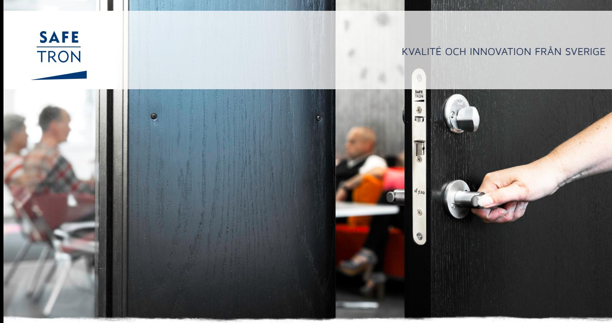
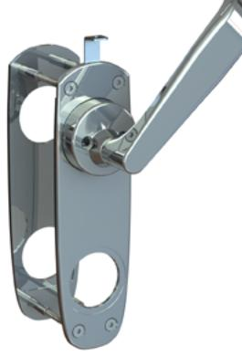
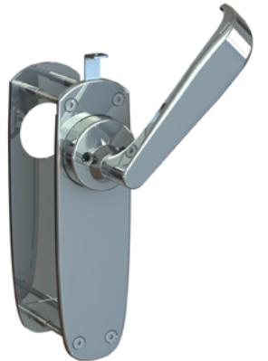
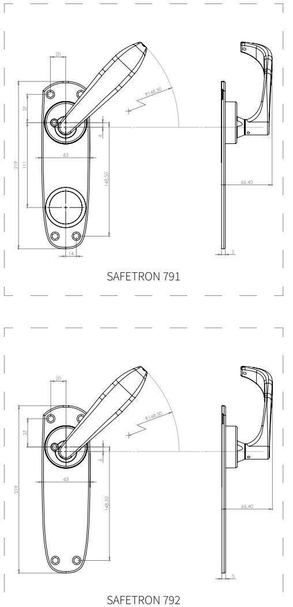

### NÖDUTRYMNINGSBEHÖR 791 / 792

SAFETRON 791

# Nödutrymningsbehör för Safetron SL 530 / SL 531

Safetron 791/792 är anpassat för slagdörrar i modulprofilutförande med krav på nödutrymning. Nödutrymningsbehöret öppnar låset med ett handgrepp och ger en säker utrymning.

### Flera ytbehandlingar tillgängliga

Nödutrymningsbehör 791/792 kan fås i antingen kromaterat eller mattkromaterat utförande.

### Mikrobrytare som tillval

Nödutrymningsbehör 791/792 kan fås med mikrobrytare som tillbehör för att plocka ut larmsignal vid användning av behöret.

SAFETRON 792

## NÖDUTRYMNINGSBEHÖR 791 / 792

### EGENSKAPER

- 791 för montering med trycke
- 792 för montering utan trycke
- Lämpligt för montage i passersystem
- Nödutrymningsbehör Safetron 791/792 är certifierat och CE-märkt enligt europastandarden SS-EN 179:2008
- Finns i ytbehandlingar krom och mattkrom
- På utsidan monteras rundcylinder
- För dörrtjocklek 42-90 mm, dorndjup 50 mm

### FUNKTION

- Godkänd enhet tillsammans med solenoidlås Safetron SL 530 / SL 531
- Dörren kan alltid öppnas från insidan via utrymningshandtaget
- Utrymningshandtaget kan plomberas med sigiltråd
- Kan monteras med dörrautomatik
- Monterat tillsammans med Safetron SL 530 ger brandigenhållning upp till brandklass E60/EI60

| BENÄMNING                               | ART NR      |
|-----------------------------------------|-------------|
| Nödutrymningsbehör 791, Höger, Krom     | 202 144 636 |
| Nödutrymningsbehör 791, Vänster, Krom   | 202 144 649 |
| Nödutrymningsbehör 792, Höger, Krom     | 202 144 662 |
| Nödutrymningsbehör 792, Vänster, Krom   | 202 144 663 |
| Nödutrymningsbehör 791, Höger, Mattkrom | 202 144 664 |

Nödutrymningsbehör 791, Vänster, Mattkrom 202 144 665

#### **SAFETRON AB**

Säterivägen 18 P.O. Box 2096 65002 Karlstad Sweden

Tel: +46 54 19 02 45 Email: info@safetron.com

Du hittar alltid det senaste på safetron.com

Rätt till ändringar av katalogens innehåll och sortiment förbehålls. Vi reserverar oss för eventuella tryckfel. SAFETRON™ är ett registrerat varumärke.