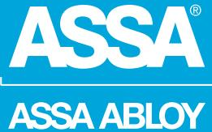
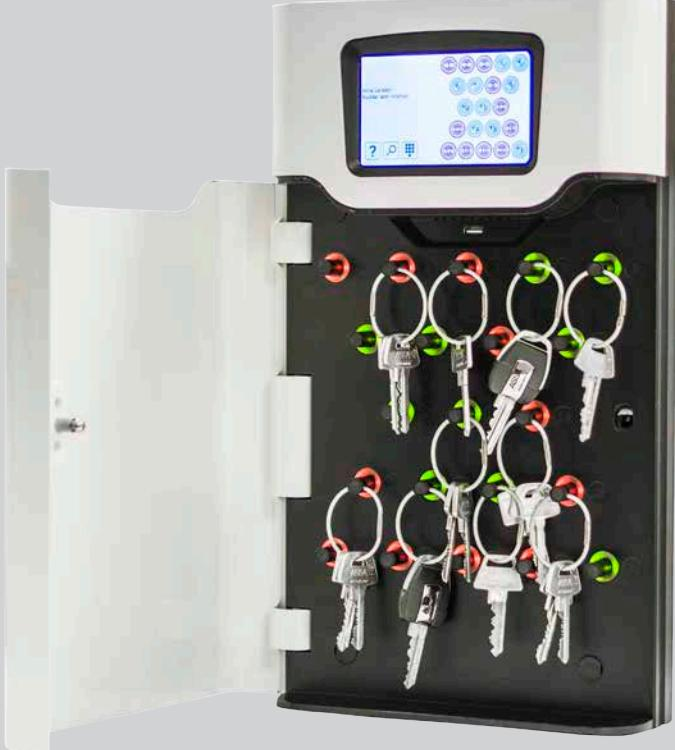
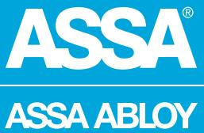
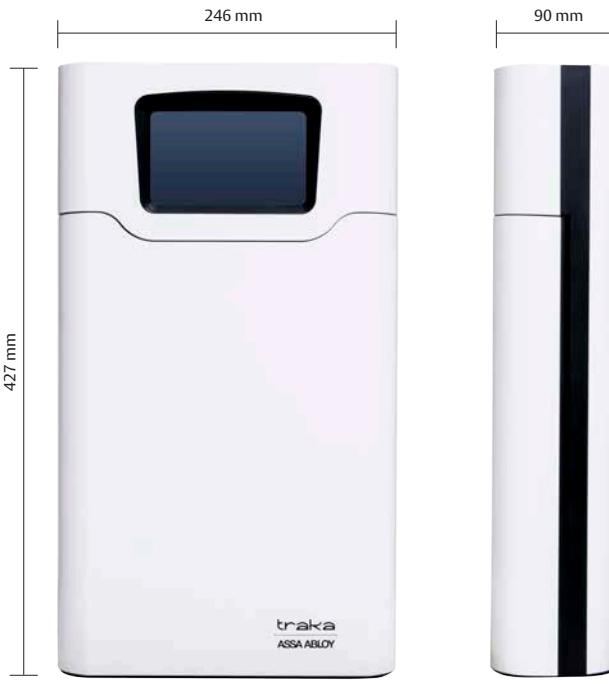
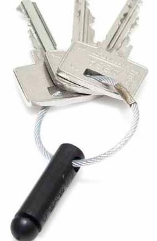

## ASSA Traka21

ASSA ABLOY, the global leader in door opening solutions

### Ett enkelt sätt att hantera dina nycklar

#### **Användningsområde**

Traka21 är ett intelligent fristående nyckelhanteringssystem som kombinerar enkel hantering och robust konstruktion. Traka21 ger små och medelstora företag kontroll på upp till 21 nycklar eller uppsättningar nycklar i en och samma enhet. Traka21 är enkelt och användarvänligt då alla användare själva kan ta de nycklar eller nyckelknippor de har behörighet till. Både administratören och respektive användare får en bra överblick med den inbyggda pekskärmen

#### **Egenskaper**

- 21 låsta positioner med LED-indikation
- Individuellt belysta positioner i färg som indikerar tillgängligheten
- 21 iFobs med avancerad RFID-teknik
- Fristående plug-and-play-lösning för enkel installation
- Administration via inbyggd pekskärm
- Användargränssnitt med flera språkalternativ
- Loggar och rapporter via inbyggd skärm (eller exportera till Excel via USB)
- Logg på 250 000 händelser

### **Funktion**

- Inloggning via personlig PIN-kod för användare och administratörer (4 -10 siffror)
- Inget behov av anslutning till nätverk eller PC
- Möjlighet till import/export av data via USB-port
- Enkel konfiguration via inbyggd installationsguide
- Nödöppning möjligt via medföljande nycklar (2 st)
- 230V strömförsörjning medföljer
- Batteribackup 12V DC 1.2 Ah (ingår ej)
- Inbyggt ljudlarm (exempelvis skåpsdörren lämnas öppen)
- Enkel väggmontering med fyra skruvar
- Inbyggt ljudlarm om exempelvis skåpsdörren lämnas öppen
- Enkel väggmontering med fyra skruvar
- Robust hölje i stål för säker förvaring
- Upp till 1000 st användare
- Vikt: 3,9 kg

# ASSA Traka21

ASSA ABLOY, the global leader in door opening solutions

## Ett enkelt sätt att hantera dina nycklar

Den intelligenta iFoben har inbyggt RFID vilket gör att respektive nyckel eller nyckelknippa får en unik identitet. iFob och nycklar fästs samman med en wireförsegling. På så vis kontrollerar Traka21 vilken nyckel som är tillgänglig för respektive användare.

ASSA ABLOY is the global leader in door opening solutions, dedicated to satisfying end-user needs for security, safety and convenience

ASSA AB P.O. Box 371 SE-631 05 Eskilstuna Sweden Phone +46 (0)16 17 70 00

Fax +46 (0)16 17 70 49 Customer support: phone intl. +46 (0)16 17 71 00 Phone nat. 0771-640 640 Fax +46 (0)16 17 73 72 e-mail: helpdesk.marknad@assaabloy.com

www.assa.se