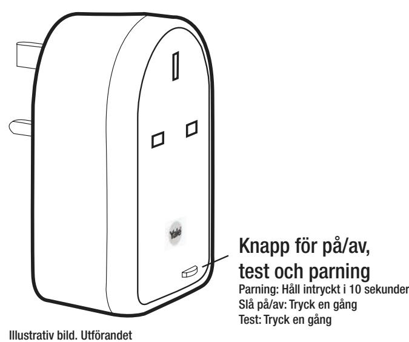
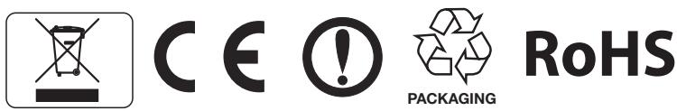

# Easy Fit EF-Series Alarm System

*Endast till SmartPhone larmet*

anpassat till respektive marknad.

# **Trådlösa 2.4GHz Yale EF-PS Strömbrytare**

*Svenska*

### **Specifikationer:**

Detta tillbehör kan användas för att slå på och av produkter anslutna till 230 V-elnätet (t.ex. lampa, radio o.s.v.) via smartphone-appen.

#### **VARNING:**

Endast för inomhusbruk. Max driftsbelastning är 2300 W och 10 A.

|             | EU                | UK                |
|-------------|-------------------|-------------------|
|             | 110-230V, 50/60Hz | 110-230V, 50/60Hz |
| Maximal     | 110V: 1760W 16A   | 110V: 550W 5A     |
| belastning: | 230V: 3680W 16A   | 230V: 1150W 5A    |

# **Driftsmiljö**

-10 °C till 40 °C, 85 % relativ luftfuktighet, icke-kondenserande. Endast för inomhusbruk

#### **Se bruksanvisningen för EF-larmsystemet avseende följande**

- Lägga till denna Strömbrytare i larmsystemet
- Felsökning

# **Förpackningens innehåll**

- 1 x Strömbrytare

WEEE

OBS: Elektriska produkter och batterier får inte slängas i hushållsavfall. Återvinn på närmsta återvinningsstation. Be lokala myndigheter eller återförsäljaren om råd för återvinning.

E1 09/12

Varumärket YALE, med dess enastående globala närvaro och produktsortiment, tryggar mer människor i fler länder än något annat låskoncept för konsumenter.

ASSA ABLOY-koncernen är världens ledande tillverkare och leverantör av låskoncept, med målsättningen att uppfylla slutanvändarens behov av trygghet, säkerhet och bekvämlighet

