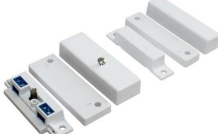
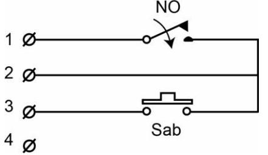
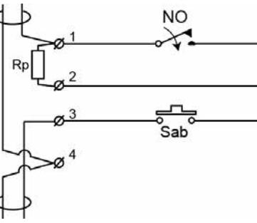
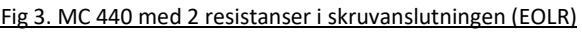
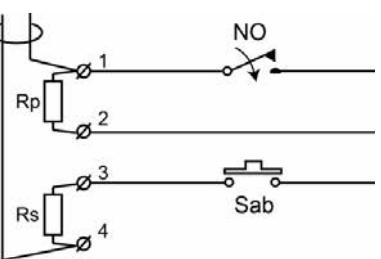
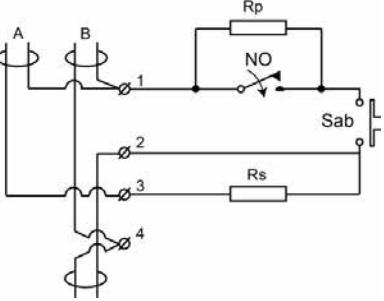

# **Detektorer**

# **Magnetkontakter** Utanpåliggande

## **Datablad och monteringsanvisning MC 440**

## **BESKRIVNING**

MC 440 är en magnetkontakt för utanpåliggande montage. Den har 4 st skruvterminaler och en öppningskontakt. Den kan användas i alla typer av säkerhetssystem och i industriella system för övervakning av dörrar och fönster. Fig.1. visar schemat för larmkontakt och öppningskontakt. För att minska antalet typer av kontakter har den konstruerad så att en enda kontakt kan användas i balanserade system med en eller två resistanser antingen med lösa resistanser anslutna i skruvterminalerna (Fig. 2 och Fig. 3)) eller med inbyggda resistanser som i Fig.4.

**MC 440 är Certifierad av VdS enligt EN 50131-2-6 Grade 2 och godkänd av SBSC i Larmklass 2**.

#### **KRETSSCHEMA (VISAS UTAN MAGNETFÄLT)**

Fig 1. MC 440 med larmkontakt och öppningskontakt:

Fig. 4. MC 440-PRpSRs med inbyggda resistanser

A= För balanserad slinga med en kontakt med EOLR B= När flera kontakter skall användas på en slinga.

## **TEKNISKA DATA**

| Monteringsunderlag                      | Trä/omagnetiskt material                                                         | Stål/magnetiskt material |
|-----------------------------------------|----------------------------------------------------------------------------------|--------------------------|
| Slutande gap                            | typ. 37 mm +/– 5mm                                                               | typ. 24 mm +/–8mm        |
| Brytande gap                            | typ. 44 mm +/– 5mm                                                               | typ. 30 mm +/– 8mm       |
| Kontakttyop                             | Form A, SPST                                                                     |                          |
| Spänning max.                           | 48 V DC/AC                                                                       |                          |
| Ström max.                              | 400 mA DC/peak AC                                                                |                          |
| Max brytande effect (UxI)               | 10 W                                                                             |                          |
| Livslängd                               | Större än 20 miljoner brytningar vid 10V/4 mA                                    |                          |
| Miljöklass enligt EN50130-5:2011        | Klass I                                                                          |                          |
| Temperaturområde                        | +5°C to +40°C                                                                    |                          |
| Fuktighet                               | max. 95% RH                                                                      |                          |
| IP Klass                                | IP 43                                                                            |                          |
| Material                                | ABS Plast                                                                        |                          |
| Dimensioner Kontaktdelen                | 65 x 14,8 x 20,6 mm                                                              |                          |
| Dimensioner Magnetdelen                 | 65 x 14,5 x 14,8 mm                                                              |                          |
| Testad enligt EN 50131-2-6:2008 av VdS; | Grade 2                                                                          |                          |
| Godkännanden                            | EN-ST-000204, SBSC 9-210, F&P 10.212-13506, FG MKT-1014/09, INCERT B-582-1003 |                          |

#### **FUNKTION**

MC 440 magnetkontakt har två delar, en kontaktdel med reedkontakt, öppningskontakt och fyra skruvplintar samt en magnetdel med en ingjuten magnet. Rätt monterad på ett objekt sluter magnetfältet reedkontakten. När avståndet mellan magnetdel och kontaktdel blir för stort bryter reedkontakten. Monteras kontaktdelen eller magnetdelen på en stålplåt avleds magnetfältet från kontaktdelen och stålet minskar magnetfältet från magneten. I dessa fall bör monteringstillbehör användas.

**Magnetkontakten får inte monteras i närheten av starka magnetfält.**

#### **INSTALLATION**

Kontaktdel och magnetdel skall monteras parallellt med varandra jämsides eller ovanför varandra. Pilarna på kontakt och magnetdelarna måste peka mot varandra. Magnetdelen skall monteras på den rörliga delen av objektet och kontaktdelen på den fasta delen av objektet. Exempelvis kontaktdelen på dörrkarmen och magneten på dörren.

För platser där det är svårt att montera kontakten direkt finns distanser och aluminiumfästen. Distanser möjliggör montering av kontakten på magnetiska ytor. Fästen kan användas för att montera kontaktdelen på avstånd från magnetiska ytor eller för att lösa problem med att rikta in kontakten med magneten. Kontakt och/eller magnet skruvas fast i de ovala skårorna i fästena och justeras till lämpligt läge.

Endast omagnetiska skruvar skall användas vid monteringen.

Alla distanser uppges i mm och kan variera.

**OBS: Kontrollera alltid kontaktens funktion och gap efter monteringen med en ohmmeter**

**OBS: Utsätt aldrig kontaktdel eller magnetdel för kraftiga slag. Det kan skada reedkontaktens glashus eller försvaga magnetens fält och därmed minska gapet.**

**OBS: Använd alltid medföljande distanser eller något av tillbehören vid montering på magnetiskt underlag** 

#### **BESTÄLLNINGSINFORMATION**

MC 440 finns i två utföranden. En för en balanserad slinga med resistanser monterade direkt i skruvplintarna samt en med inbyggda resistanser (1% tolerans).

Normalt levereras MC 440 utan resistanser men där man manuellt i skruvplinten kan montera en eller två resistanser. Det är den mest universella kontakten för olika tillämpningar. MC 440 finns också lagerhållen med inbyggda resistanser för de vanligaste värdena. Alternativt kan också MC 440 beställas med vilket värde som helst I E36-serien men då gäller en minsta orderkvantitet på 100 st.

Om speciella värden på resistanserna skall beställas använd då i beställningen P för det värde som skall monteras parallellt med reedkontakten och S för det värde som skall monteras i serie med reedkontakt och öppningskontakt.

För specialorder inbyggda resistanser använde följande orderinformation MC 440-P*Rp*S*Rs*:

- Resistans parallell med reed använd prefix P och resistorvärde
- I serie med reed och öppningskontakt använd prefix S och resistorvärde
- Med samma värde på resistanserna använd MC 440-2x*R*

### **BESTÄLLNINGSINFORMATION**

| Tillgängliga modeller | Kort beskrivning                                                                                                         |
|--------------------------|--------------------------------------------------------------------------------------------------------------------------|
| MC 440                   | Universellt användbar utanpåliggande kontakt med möjligheter till anslutning av valfria resistanser i skruvplinten |
| MC 440-PRpSRs            | Med inbyggda resistanser enligt kundens specifikation                                                                 |

#### **Lagerhållna kontakter med inbyggda resistanser**

| Lagerhållna Modeller | E-nr    | Beskrivning                                  |
|-------------------------|---------|----------------------------------------------|
|                         |         | Med 4 skruvterminaler och                    |
| MC 440                  | 6309310 | öppningskontakt Med 4 skruvterminaler och |
| MC 440-B                | 6309309 | öppningskontakt. Brun                        |
| MC 440-2x1k             | 6309428 | Med 2 st. 1k resistanser                     |
| MC 440-2x2,2k           | 6309429 | Med 2 st. 2,2k resistanser                   |
| MC 440-2x3,3k           | 6309407 | Med 2 st. 3,3k resistanser                   |
| MC 440-2x4,7k           | 6309408 | Med 2 st. 4,7k resistanser                   |
| MC 440-2x5,6k           | 6309409 | Med 2 st. 5,6k resistanser                   |

#### **Tillbehör**

| Model    | E-nr    | Beskrivning                           |
|----------|---------|---------------------------------------|
| MC-L     | 6348495 | L – vinkel I 1 mm Al plåt             |
| MC-Z     | 6348496 | Z – vinkel I 1 mm Al plåt             |
| MC 400-6 | 6309316 | Distansplatta för kontaktdelen 7mm |
| MC 400-7 | 6309317 | Distansplatta för magnetdelen 7mm  |

Med reservation för tryckfel och eventuella framtida ändringar.