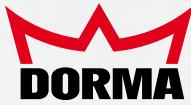
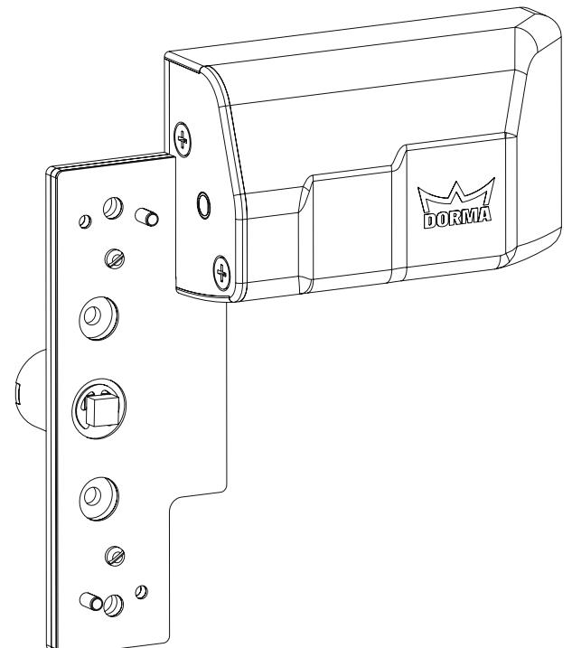

MOTORISERAD ÖPPNING AV PANIK-/UTRYMNINGSBESLAG Motor till panik-/utrymningsbeslag PHM

# MOTORISERAD ÖPPNING AV PANIK - /UTRY MNINGSBESLAG —

Motor till panik-/utrymningsbeslag PHM

PHM är en motor till utanpåliggande panikreglar och utrymningsbeslag som gör det möjligt att använda dessa i kombination med dörrautomatik och passersystem.

Med PHM installerad tillsammans med panik-/ utrymningsbeslag och dörrautomatik motoriseras öppningen av låspunkterna. Den här lösningen skapar

nya möjligheter vad gäller användning av automatik och passersystem vid utrymningsvägar. PHM fungerar tillsammans med DORMAs sortiment av utanpåliggande panik- och nödutrymningsbeslag: PHB3105, PHA2102 och Exit Pad.

# Dörrautomatik

Med PHM installerad i kombination med panik-/ nödutrymningsbeslag och dörrautomatik öppnas alla låspunkter på panik-/ nödutrymningsbeslag innan automatiken öppnar hela dörrbladet. PHM manövreras direkt från dörrautomatiken på samma sätt som ett elslutbleck.

#### Passersystem

När PHM är installerat i kombination med ett passersystem är öppningen av panik-/utrymningsbeslaget kontrollerad från utsidan. Utrymning från insidan fungerar som tidigare.

### Modeller

PHM finns i två utföranden: PHM Standard och PHM Extern. PHM Extern är anpassad för att monteras tillsammans med DORMAs utvändiga beslag (PHT03, PHT05 eller PHT07).

# Säkerhet

När PHM är monterad på aktivt dörrblad i kombination med PHB eller PHA tillgodoses fortfarande säkerhetskravet på att 60% av dörrbredden ska täckas av panikregel. Alla utrymnings-/ panikbeslagets funktioner bibehålls och påverkas inte av enheten. PHM kan kopplas till dörrens brandlarm. När brandlarmet aktiveras frigörs alla låspunkter på panik-/utrymningsbeslagen, detta för att säkra de brandkrav som finns på dörren. Montering av PHM påverkar inte panik-/utrymningsbeslagens säkerhetscertifiering EN1125 och EN179.

### Montering

PHM kan monteras samtidigt med ett nytt panik-/ utrymningsbeslag eller eftermonteras på en existerande installation. Enheten fästs i samma hål som användes för att fästa panik-/utrymningsbeslaget.

# Tillbehör

DORMA har tagit fram ett mindre sortiment underläggsskyltar. PHM bygger 7 mm mellan panik-/ utrymningsbeslag och dörrblad, därför skapas ett mellanrum mellan dessa vid montage. Med hjälp av underläggsskylt utjämnas den skillnaden och medför att panik-/utrymningsbeslaget är stadigt placerat mot dörrbladet.

# Funktionsbeskrivning

När PHM elförsörjs med 24 V DC dras panik-/utrymningsbeslagets låskolvar in och hålls inne helt tills elförsörjningen bryts. Enheten är utrustad med återkoppling på lägesstatus från låskolvarna. Enheten kräver ingen egen styrbox.

| Tekniska data |                                                                                |
|---------------|--------------------------------------------------------------------------------|
| Driftspänning | 24V DC                                                                         |
|               | Strömförbrukning 1.200mA, 350mA                                                |
| Utgångar      | Status på låskolvar Potentialfri växelkontakt C, NO, NC Max 5A, 230 V AC |

DORMA Sverige AB FO Petersons Gata 28 SE-42131 Västra Frölunda 031-355 20 00 info@dorma.se www.dorma.com