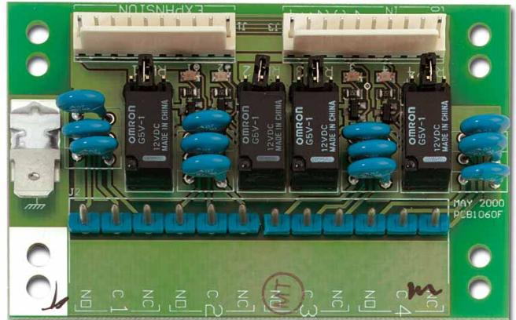

## Produktblad

# ATS1810

Reläkort, 4 utgångar

### ATS1810

Utgångskort med 4 utgångar till ATS-systemet. Ansluts i centralapparat eller DGP. Separat lysdiod indikerar om respektive utgång är aktiv. C, NO, NC

#### Standardprestanda

- E4 potentialfria reläer
- EFör placering i CE, ATS125x, ATS1201 och ATS1210
- E Spänningsmatas från CE eller DGP
- EAnsluts med flatkabel (ingår)
- ESeparat lysdiodsindikering för respektive relästatus

# ATS1810

Reläkort, 4 utgångar

### Tekniska data

| Spänningsmatning  | 10,5 till 13,8 VDC |
|-------------------|--------------------|
| Strömförbrukning  | 100 mA max         |
| Dimension (B x H) | 80 mm x 52 mm      |
| Temperatur        | 0 till +50 C       |
| Fuktighet         | 95% ej kondens     |

| Order data    |                             |
|---------------|-----------------------------|
| Artikelnummer | Beskrivning                 |
| ATS1810       | Reläkort, 4 utgångar        |
| ATS1821       | Transistorkort, 8 utgångar  |
| ATS1820       | Transistorkort, 16 utgångar |
| ATS1811       | Reläkort, 8 utgångar        |

Reservationer för produktförändringar. För uppdatering av produktdata, gå in på www. utcfssecurityproducts.se eller kontakta din lokala UTC Fire & Security återförsäljare. ATS1810-2017-01-20 09:13:45 Released :02-SEP-11