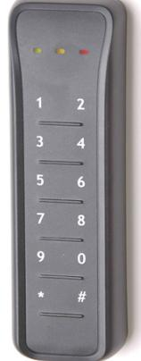

## ATS1161N

Produktblad

Mifare ATS-kortläsare med knappsats

### Produktöversikt

ATS Mifareläsaren ansluts direkt till ATS-centralens RS485 databuss eller till valfri fyrdörrarscentral ATS125x och kan adresseras via manöverpanelen eller med konfigureringskortet ATS1482. ATS1160 är designad för pålitlig och säker passagekontroll, för alla miljöer. MIFARE teknologin baseras på ISO14443 (RFID) Typ A13,56 MHZ beröringsfri smartcard standard. Kortläsaren har även en ingång för öppning av dörr och en utgång för styrning av dörröppning. Läsaren är kompatibel med Mifare standard 1k eller 4k och EV1 och DESfire kort.

#### Kommunikation

ATS1160 kommuniserar på ATS-centralernas RS485 databuss, alla ATS125x dörrcentraler samt ATS1226.

#### Design

Den unika designen garanterar att kortläsaren kan användas i de mest påfrestande miljöer. Läsaren kan dessutom monteras direkt på metall.

## Standardprestanda

- EMifare ATS kortläsare
- E Läser kortets serienummer (CSN)
- EMifare Classic och DESfire EV1 CSN
- ERobust plastkappsling
- EInomhus- och utomhusmontage
- EATS-buss interface
- EMed knappsats
- EIngång för utpassage
- EUtgång för dörrstyrning

# ATS1161N

Mifare ATS-kortläsare med knappsats

## Tekniska data

| Spänning              | 10,8 - 30 VDC                   |
|-----------------------|---------------------------------|
| Strömförbrukning      | 130 m A max.                    |
| Material              | Plast                           |
| Dimension             | 140 x 44 x 20 mm                |
| Temperatur            | -40 till +55 °C                 |
| Lagringstemperatur    | -40 till +55 °C                 |
| IP-klass              | IP64                            |
| Kabel                 | LIYY 2 m                        |
| Anslutning            | RS485 databuss                  |
| Adressering           | Manöverpanel eller konfig. kort |
| Indikeringar          | Tre                             |
| Frekvens              | 13.56 MHz                       |
| Styrka                | Enligt EN300330                 |
| EMC                   | Möter CE-krav                   |
| Sabotage              | Optisk sensor                   |
| Open collector utgång | 10 mA max                       |

Order data

Artikelnummer Beskrivning ATS1161N Mifare ATS-kortläsare med knappsats

