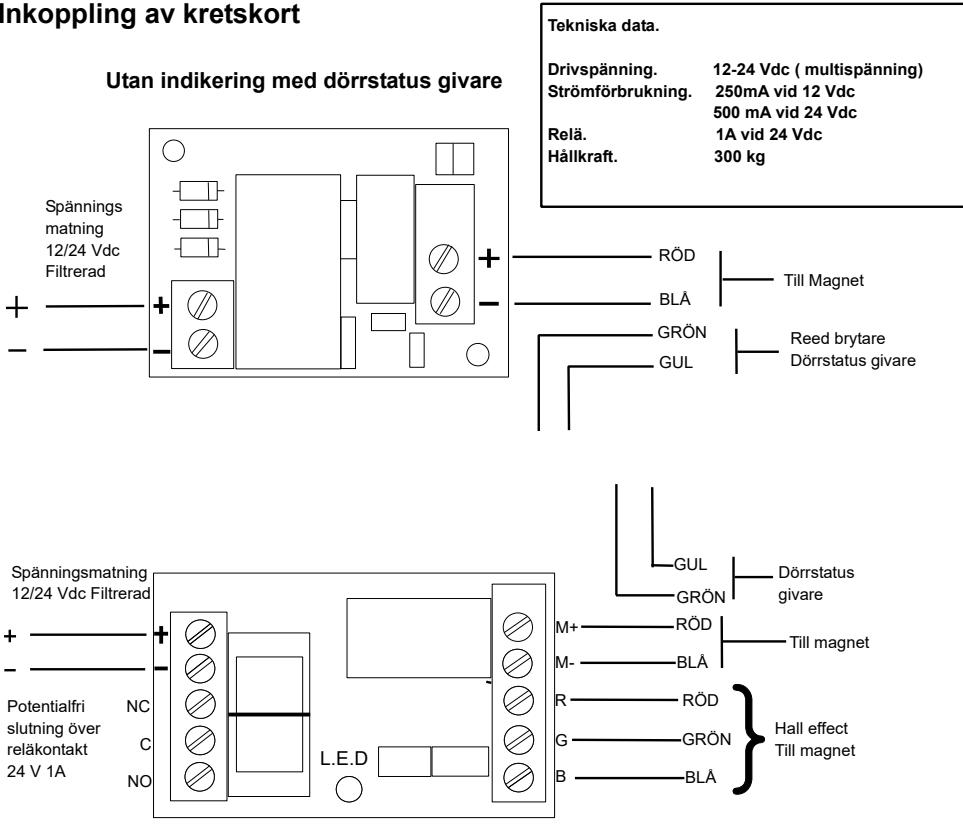
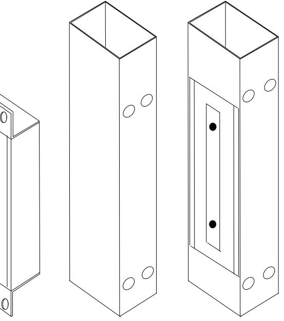
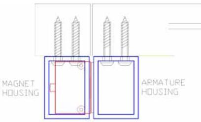
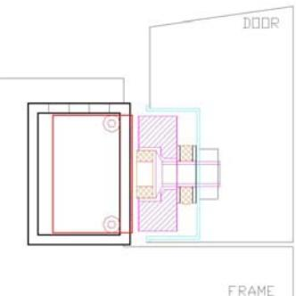
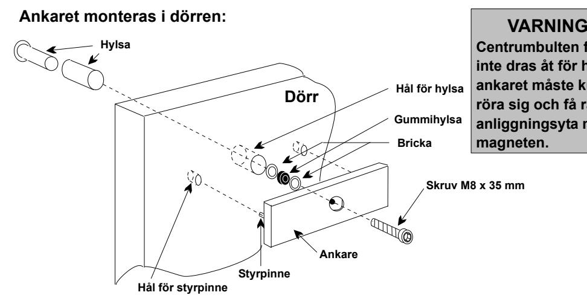
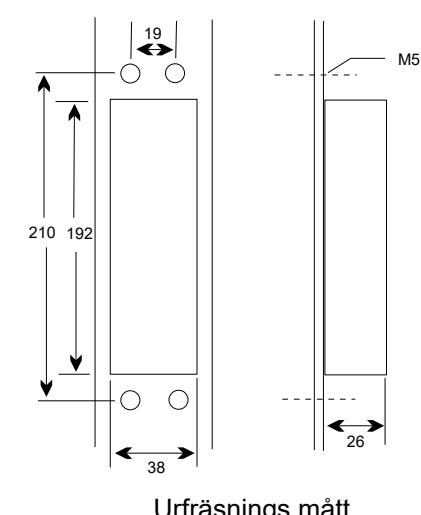
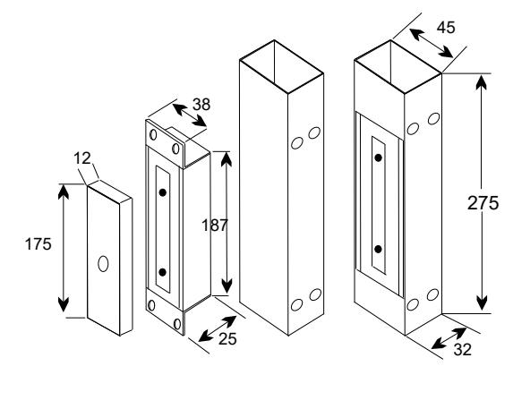
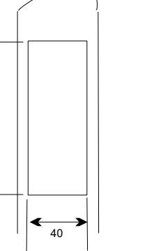
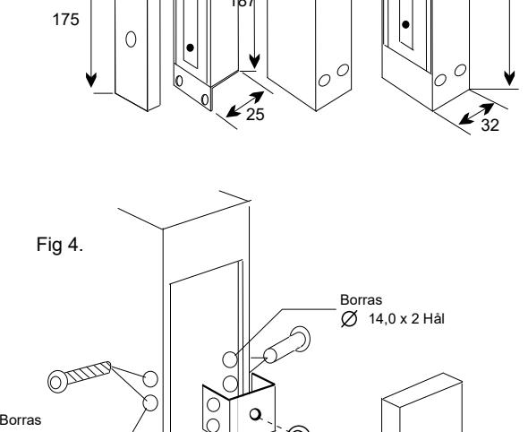

**Med indikering och dörrstatus givare**

|                                                                               | ö Fe ls kn ing                                                                                                             |                                                                                                                                                           |
|-------------------------------------------------------------------------------|----------------------------------------------------------------------------------------------------------------------------------------|-----------------------------------------------------------------------------------------------------------------------------------------------------------|
| Pro ble m                                                               | Tro lig ak ors                                                                                                                | Åtg ärd                                                                                                                                                |
| låse Dör inte ren r                                               | Strö når fram inte mm en                                                                                                | rgå Kon trol lera att spä nnin äxla öve gsv ren s nga r                                                            |
|                                                                               | till nets pole mag n                                                                                                       | är rikti gt nte rad mo e                                                                                                                |
|                                                                               | Strö mfö rsö rjnin fun gen ger ar inte kor rekt                                                          | Kon trol lera lutn inga ans rna                                                                                                         |
|                                                                               | Strö når fram inte till mm en strö mfö rsö rjnin gen                                                  | Kon trol lera säk ring och lutn inga ar ans r                                                                               |
| Mag net har låg håll kraf t en                           | För dål ig fysi sk kon takt llan me kon takt yto hos t och ank rna ma gne are | Gör t och ta bor t ojä hete ren mn r                                                                                        |
|                                                                               | Fela ktig kraf tför sörj ning                                                                                           | Kon trol lera ingå end spä nnin e g ,                                                                                          |
|                                                                               |                                                                                                                                        | Kab eln har fel diam ete och / elle läng d ( spä nnin gsfa ll ) r r                                 |
| Mag net bru en mm ar                                           | Väx elst röm finn när and s var e                                                                              | Kon trol lera strö mfö rsö rjnin olä lig strö mfö rsö rjnin g mp g ,                                      |
| lång öpp Tar tid att na                                        | Strö fela mb ryta ktig t nte rad ren mo                                                                     | strö Bry tnin till nete ska ske llan g av mm en mag n me tran sfo tor och t. rma ma gne |
| Ree d bryt fun ej på rätt sätt are ger ar       | Fela ktig fysi sk kon takt llan net me mag                                                                  | Änd ring gör och bor ojä hete nte ta t ra mo ren mn r. ,                                                     |
|                                                                               | och ank are                                                                                                                      | ingå Kon trol lera end spä nnin och spä nnin välj e g gs are                                                    |
|                                                                               | Fela ktig strö mfö rsö rjnin g                                                                                       | Kab el har fel diam ete och / elle läng d. Ano rdn ing förs törd r r                                   |
|                                                                               | Ree d bryt öve rbe last ad are                                                                                    | Se nsk ege ape r                                                                                                                              |
| på Ind iker ings diod fun inte rätt sätt ger ar | Fela ktig kon takt llan net och ank me mag are                                                           | åtg Se ärd för d bryt er ree are                                                                                                  |

**Inkopplingsanvisning Safetron Magneter Modell MS 20 SFU/SFM-DS SSU/SSM-DS**

Safetron AB Kolvgatan 7 653 41 Karlstad Tel. 054-190245 Fax. 054-190275 E mail. info@safetron.com www.safetron.com

# Fig1. **MS20SSU/SSM** För skjutdörrar med utanpåliggande monterad magnet

ankare.

Fig

 av magnet

2. och

## **MS20SFU/SFM** För skjutdörrar med försänkt montering

ankare.

 konsol **MS10/15/20AFHSG** kan användas där inte tillräcklig fastsättning av centrumbulten kan erfodras

Fig 3. Utåtgående dörr med utanpåliggande monterad magnet och ankaret försänkt med konsol **MS10/15/20AFHSG**

> **O.B.S Vid tveksamheter seEngelska original manualen**

> > **!**

 och

 **får**

 **den**

> **hårt då**

 **kunna**

 **rätt**

 **mot**

# Urfräsnings mått

# **Tillbehör.**

176

L-konsol MS20L1 Z-konsol MS10/15/20Z Z-konsol skydd MS10/15/20ZCAnkar konsol försänkt MS10/15/20AFHSGJusterbar L konsol MS10/15/20T1Justerbar L konsol skydd MS10/15/20TC1Konsol för försänkning enl fig 4

### **Viktigt. Vänligen läs nedanstående innan montering av magnet påbörjas.**

9,0 x 2 Hål

10

11

33

 + 2

- 1. Handskas varsamt med utrustningen, om anliggningsytorna på magnet eller ankare skadas kan det minska magnetens hållkraft.
- 2. Magneten monteras stumt i dörrkarmen. Ankaret monteras på dörren med den medföljande monteringssatsen vilket gör det möjligt för ankaret att röra sig runt sin mittpunkt Rörligheten gör att ankaret kan kompensera dörr slitage och snedhet.
- 3. Dra noga fast samtliga skruvar.