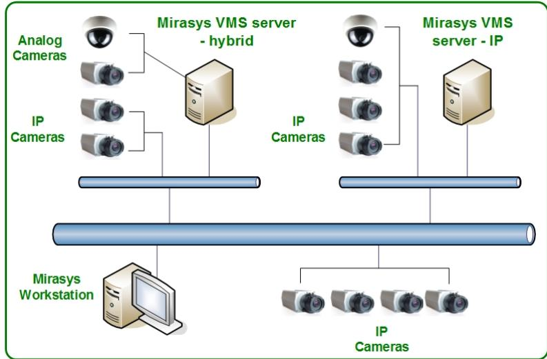

**Mirasys VMS Hardware**

**Datasheet, March 2015** 

# **Complete Set of Servers**

*Mirasys VMS Hardware includes a complete set of servers that support leading IP cameras from all major manufacturers as well as all legacy analog cameras. Mirasys VMS hardware can combine into domains of up to 150 servers. One server can have up to 128 cameras, depending on used frame rate and resolution. A system consisting of analog cameras can be augmented with high-resolution IP cameras in places where it is important to identify people and items in clear detail.*

### **Entry level / Lower Mid-Range (HP EliteDesk 800 G1 Tower PC)**

An entry-level digital video server that, due to its powerful performance and affordable price, is especially suited for small businesses and retail outlet chains. Available with up to 3 TB of storage base and a powerful i5 quad core processor.

#### **Mid-Range to Lower High End (HP Z230 Tower)**

A cost-efficient server for virtually any segment. Thousands of proven installations in all kinds of environments ranging from banks to gas stations and from police to border guard. Available both with minitower chassis and 19" rack rails.

## **High End Rack Servers (Dell PowerEdge R530)**

Powerful high-speed 19" rack servers for sites in which full-speed recording of high resolution images is

# **Features**

• **Future-proof –** Seamless migration to IP network based video surveillance

• **Wide camera support –** Supports all major camera manufacturers

• **Powerful VMS –** Scales to up to domains of 150 servers

• **Customizable –** Supports video analytics and ANPR+

• **Flexible licensing –** Fully open licensing options for analog and IP cameras

required, such as gas stations, banks, defense, or energy / water supply facilities. Available with hard disk capacity of 48 TB.

#### **Virtualized Servers**

Modern IT infrastructure has been moving to virtualization already several years. Mirasys VMS is supporting this trend in pure IP solutions. Mirasys VMS supported operating systems can be used as a guest operating system in both VMware and Hyper-V environments 8 .

#### **Client Workstations (HP Z230 Tower)**

Built especially for use as a client computer to use with Mirasys client software (Spotter for Windows and Agile Virtual Matrix Display Servers), the components have been optimized for viewing numerous high resolution video streams with up to four monitors.

# **Mirasys VMS Hardware**

**Datasheet, March 2015** 

|                                      | Entry Level / Lower Mid Range | Mid-Range / Lower High End      | High End Rack Servers            | Client Computer                    |
|--------------------------------------|-------------------------------------|------------------------------------|-------------------------------------|------------------------------------|
| Video recording                      |                                     |                                    |                                     |                                    |
| Analog video                         | 0-32 1                              | 0-32 1                             | 0-32 1                              | N/A                                |
| IP video                             | 0-128 1                             | 0-128 1                            | 0-128 1                             | N/A                                |
| Video standards                      | PAL / NTSC                          | PAL / NTSC                         | PAL / NTSC                          | PAL / NTSC                         |
| Frame rate, camera based (ips)       |                                     |                                    |                                     |                                    |
| IP cameras (PAL/NTSC)                | 25/30 / 50/60 2                     | 25/30 / 50/60 2                    | 25/30 / 50/60 2                     | 25/30 / 50/60 2                    |
| One camera (max @ D1, PAL/NTSC)      | 7/8 / 25/30 3                       | 7/8 / 25/30 3                      | 25/30                               | 25                                 |
| Image resolution                     |                                     |                                    |                                     |                                    |
| Analog cameras (max)                 | WD1                                 | WD1                                | WD1                                 | N/A                                |
| IP cameras (max)                     | Unlimited                           | Unlimited                          | Unlimited                           | N/A                                |
| Audio recording                      |                                     |                                    |                                     |                                    |
| Audio inputs (analog)                | 2                                   | 2                                  | 2                                   | N/A                                |
| Audio inputs (IP)                    | 0-64                                | 0-64                               | 0-64                                | N/A                                |
| Compression methods                  |                                     |                                    |                                     |                                    |
| Analog cameras                       | H.264                               | H.264                              | H.264                               | H.264                              |
| IP cameras                           | Camera based                        | Camera based                       | Camera based                        | Camera based                       |
| Text data recording                  |                                     |                                    |                                     |                                    |
| ASCII text channels                  | 64                                  | 64                                 | 64                                  | N/A                                |
|                                      |                                     |                                    |                                     |                                    |
| Processor                            |                                     |                                    |                                     |                                    |
| Option 1                             | Intel i3-4330, 3,4 GHz, 4 cores  | Intel i5-4670, 3.4 GHz, 4 cores | Xeon E5-2630 V3, 2.5GHz, 8 cores | Intel i7-4770, 3.4 GHz, 4 cores |
| Option 2                             | Intel i5-4570, 3.4 GHz, 4 cores  | Intel i7-4770, 3.4 GHz, 4 cores |                                     |                                    |
| Hard disk capacity                   |                                     |                                    |                                     |                                    |
| HDD size (standard)                  | 2 TB                                | 4 TB                               | 8 TB 4                              | N/A                                |
| HDD size (maximum)                   | 3 TB                                | 12 TB                              | 48 TB 4                             | N/A                                |
| Software functionality               |                                     |                                    |                                     |                                    |
| Secure data recording 5              | Yes                                 | Yes                                | Yes                                 | N/A                                |
| User profiles                        | Yes                                 | Yes                                | Yes                                 | Yes                                |
| Device support                       |                                     |                                    |                                     |                                    |
| Alarm contacts - analog (optional) 6 | 8 / 4                               | 8 / 4                              | 8 / 4                               | N/A                                |
| Alarm contacts - IP (optional) 6     | 256 / 256                           | 256 / 256                          | 256 / 256                           | N/A                                |
| Dome cameras                         | Yes                                 | Yes                                | Yes                                 | Yes                                |
| Integration API                      | Yes                                 | Yes                                | Yes                                 | Yes                                |
| Intelligent VCA & ANPR (optional)    | Yes                                 | Yes                                | Yes                                 | Yes                                |
| Joystick / keyboard support          | Yes                                 | Yes                                | Yes                                 | Yes                                |
| Video outputs (optional) 7           | 1                                   | 1                                  | N/A                                 | N/A                                |
| Device platform                      |                                     |                                    |                                     |                                    |
| PC platform (standard)               | HP EliteDesk 800 G1 Tower PC     | HP Z230 Tower                      | Dell R520 19" Rack                  | HP Z230 Tower                      |

1 Total maximum number of cameras is 128 per server, out of which 32 can be analog cameras

2 25/30 on normal IP cameras, 50/60 on high speed cameras

- 3 7/8 on mid-range capture cards, 25/30 on high end capture cards
- 4 8 pcs of hard disk slots, either 4 TB or 6 TB disks. All disks must be of same size.

5 Modified RAID 0

- 6 Mirasys alarm contacts are more versatile than standard alarm contact lines
- 7 One programmable video output is available on hybrid servers with an analog capture card
- 8 VMware ESXi version 5.x, Microsoft Windows Server 2012 Hyper-V

