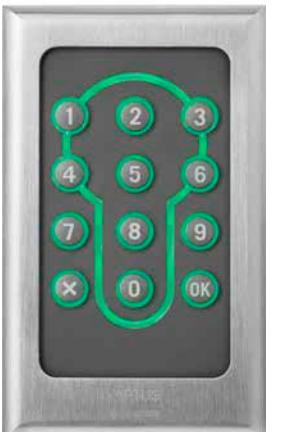
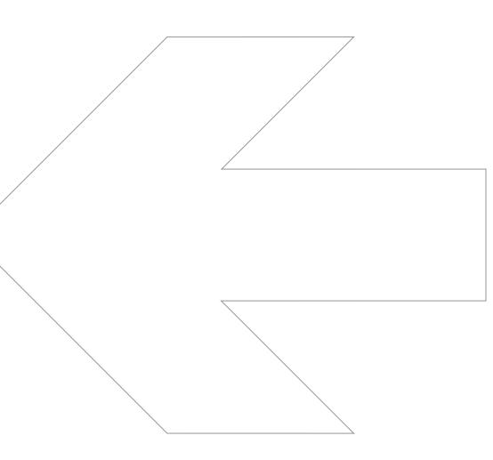

| SPECIFIKATIONER                 | Öppna 2500                           |
|---------------------------------|--------------------------------------|
| Korttyp                         | Mifare                               |
| Kommunikation till centralenhet | RS 485 (A485)                        |
| Mått mm (hxbxd)                 | 123x75x23,5                          |
| Drivspänning V DC               | 12 - 24, levereras av centralenheten |
| Nettovikt i kg                  | 0,3                                  |

## **Öppna 2500 Beröringsfri Mifare-läsare med knappsats**

**EGENSKAPER OCH FÖRDELAR**

- Tillverkad av rostfritt stål.
- Läsare med knappsats för utanpåliggande montage.
- Knappsats och nyckelhålssymbol belyst.
- Handikappanpassad med markering på siffra nummer fem.
- Läser beröringsfria kort och nycklar för mifare.
- Inbyggd summer.
- Inbyggd sabotagekontakt.
- Motståndskraftig mot sabotage.
- För inom- och utomhusbruk.
- Integrerbar med andra Multiaccess-produkter.
- Kommunikation mellan centralenhet och läsare sker krypterat med 32 bitars nycklar.

**art.nr.** 90-695-135

| ELEKTRISK ANSLUTNING                     | Öppna 2500                          |
|------------------------------------------|-------------------------------------|
| Strömförsörjning V DC                    | 12 - 24 levereras av centralenheten |
| Förbrukning Watt                         | min 0,26 max 6,91 vid 24 V          |
| Amp                                      | min 0,011 max 0,288 vid 24 V        |
|                                          |                                     |
| OMGIVNING                                |                                     |
| Temperatur 0C                            | -30 till +60                        |
| Luftfuktighet % Rh                       | 10 till 100                         |
|                                          |                                     |
| ANSLUTNING TILL CENTRALENHET             |                                     |
| Centralenheter med programmering via PC  |                                     |
| 700 XX                                   | Ja                                  |
| MC1                                      | Ja                                  |
| Styra 3000                               | Ja                                  |
|                                          |                                     |
| DATA                                     |                                     |
| Kortdata                                 |                                     |
| -Mifare Classic 1K                       | Ja                                  |
| -Mifare Classic 4K                       | Ja                                  |
| -4 byte UID                              | Ja                                  |
| -7 byte UID                              | Ja                                  |
| -Läser kortets serienummer               | Ja                                  |
| -Läser valfritt block i valfri sektor    | Ja                                  |
| Fjärruppgradering från Multiaccess Styra |                                     |
| via Styra 3000                           | Ja                                  |
|                                          |                                     |
| MÅTT I MM                                |                                     |
| Höjd                                     | 123                                 |
| Bredd                                    | 75                                  |
| Djup                                     | 23,5                                |
| Nettovikt i kg                           | 0,3                                 |
| Monteringshöjd (kabelintags mittpunkt)   | 1270                                |
|                                          |                                     |

**PASSAGE**

2015-03-24 Vi reserverrar oss för tryckfel och eventuella ändringar.

## **www.aptus.se**

Aptus Elektronik AB . Ekonomivägen 3-5, 436 33 Askim . telefon **växel:** 031 68 97 00 **försäljning:** 031 68 97 10 **fax:** 031 68 97 99 aptus@aptus.se . www.aptus.se