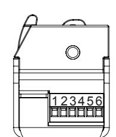
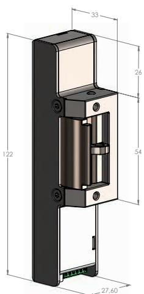

# SAFETRON ML 57 Elslutbleck

## **Användningsområde**

Safetron ML57 är ett standard elslutbleck med listtrycksteknik som passar till dörrar med normalt ställda krav på säkerhet. ML 57 passar bra som daglåsning i skalskydd och internlåsning inom handel, kontor och industri eller i entréer och allmänna utrymmen i flerfamiljshus. Svensktillverkat.

#### **Egenskaper**

- Multifunktions elslutbleck med listtrycksteknik (>20 kg)
- Multispänning 12-24 VAC/VDC med inbyggd skyddsfunktion för elektroniken.
- Omställbar rättvänd/omvänd/impuls funktion
- Skak- och slagsäkert
- Hög brythållfasthet (ca 1000kg, 10kN)
- Låshus i rostfri legering
- Klarar utlåsning av rakregel
- Kolvkontakt (ML57M)
- Kompakt design
- Passar låshus enligt skandinavisk standard med enkel eller dubbelfallås.

### **Tekniska data**

- 12-24V AC/DC +- 10%
- 15mA vid 24VDC
- Reläslutning (SSR-relä) max last 0,3W (ex 12mA vid 24VDC)
- Inbyggd strömövervakning samt PWM-styrning av motor
- Vridomkopplare för valbar funktion

#### **Tillbehörsrekommendationer**

- Se sid 6

| Benämning | Art nr      |
|-----------|-------------|
| ML 57     | 202 144 672 |
| ML 57M    | 202 144 673 |

#### **Inkopplingsanvisning Valbara funktioner**

#### 1. 12-24 VDC/VAC

- 2. 12-24 VDC/VAC
- 3. Aktivering potentialfri slutning
- 4. Aktivering potentialfri slutning
- 5. Relä NO (Endast ML 57M)
- 6. Relä NO (Endast ML 57M)

| 8-9 | Reserv |
|-----|--------|

| Position | Funktion    | Beskrivning                                 | Kolvrelä |
|----------|-------------|---------------------------------------------|----------|
| 0        | Rättvänd    | Aktivering opåverkad = låst                 | NO       |
| 1        | Omvänd      | Aktivering opåverkad = olåst                | NO       |
| 2        | Timer 7 sek | Aktivering opåverkad = låst                 | NO       |
| 3        | Timer 7 sek | Aktivering opåverkad = olåst                | NO       |
| 4        | Sekvens     | Aktivering 1 öppnar, aktivering 2 låser     | NC       |
| 5        | Impuls      | Aktivering öppnar, låser vid kolvkontakt,   | NO       |
|          |             | timeout = 1 min                             |          |
| 6        | Rättvänd    | Elslutbleck låst och dörr stängd ger signal | NC       |
| 7        | Omvänd      | Elslutbleck låst och dörr stängd ger signal | NC       |
|          |             |                                             |          |

