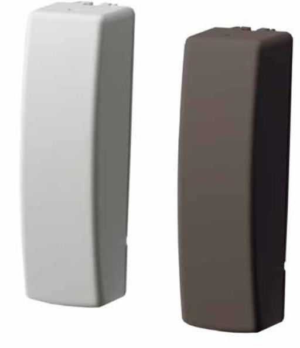

## RF320I4-N

**Magnetkontakt 433 Mhz/ Räckvidd 150 m i öppen terräng. Sänder larm, sabotage, låg batterispänning**

Each RF receiver monitors the alarm, battery, tamper and supervisory status of each transmitter. In addition it reports any change in status to the panel, which takes action according to the programmed zone types.

## **Details**

- Learn-Mode Technology
- More than 3 years battery life
- 2 internal reed switches allow for vertical or horizontal mounting
- Wall and cover tamper
- Jumper to select one of the 2 reed switcher or the supervised external input

## RF320I4-N

**Magnetkontakt 433 Mhz/ Räckvidd 150 m i öppen terräng. Sänder larm, sabotage, låg batterispänning**

## **Technical specifications**

| Allmänt               |                        |
|-----------------------|------------------------|
| Application type      | Surface Mount          |
| Trådbunden/trådlös    |                        |
| Wired-wireless        | Wireless               |
| Wireless frequency    | 433 MHz legacy         |
| Open-air range        | 150 m                  |
| Spänning              |                        |
| Batteries             | 1 x 3,6V Lithium       |
| Battery lifetime      | 3 to 5 years           |
| Mått                  |                        |
| Physical dimensions   | 32 x 32 x 102 mm       |
| Net weight            | 44 g                   |
| Colour                | White                  |
| Operating gap         | 10 mm max.             |
| Miljö                 |                        |
| Operating temperature | -34° to +60° C         |
| Relative humidity     | 0 to 90% noncondensing |

As a company of innovation, UTC Fire & Security reserves the right to change product specifications without notice. For the latest product specifications, visit UTC Fire & Security online or contact your sales representative.

Powered by TCPDF (www.tcpdf.org)