# PB501, PB511, PB521 Photoelectric Beam Sensor Installation Sheet

**EN DE ES FR IT NL SV** 

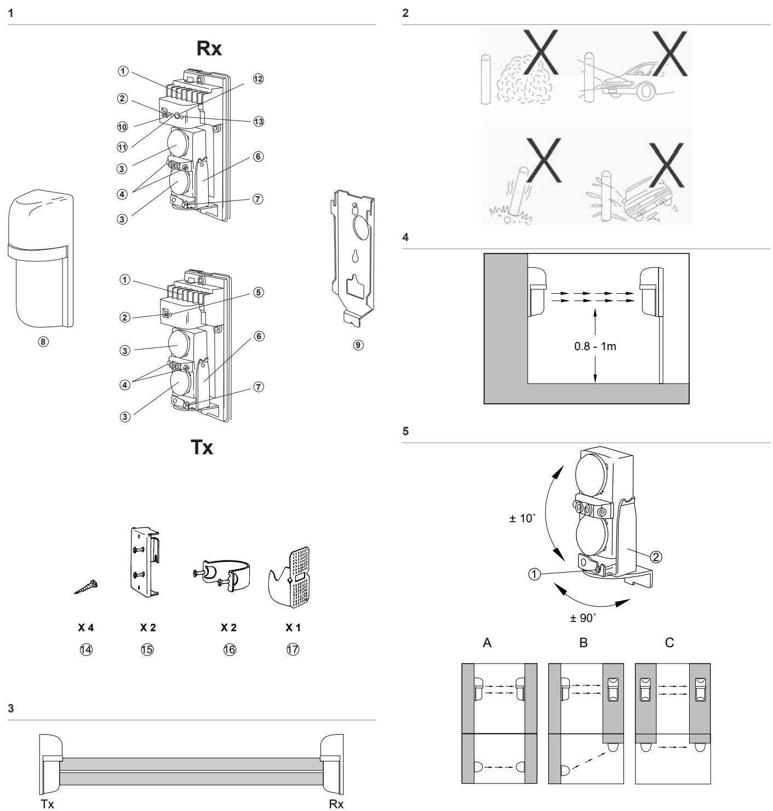

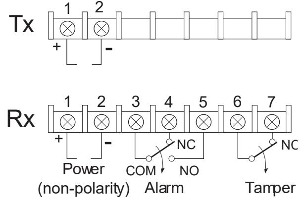

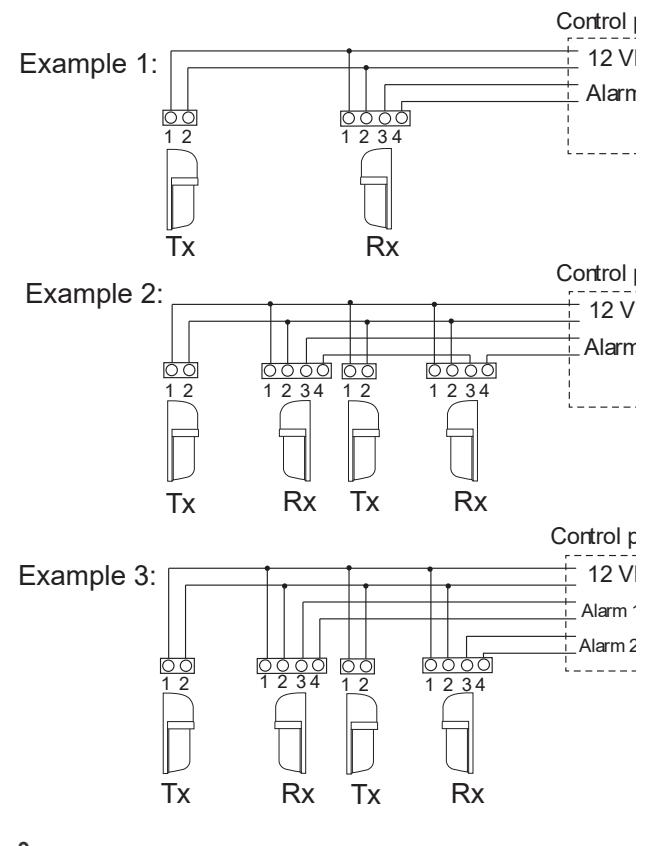

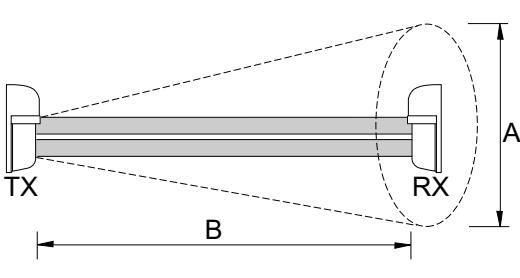

**9** 

**11** 

| Wiring distance [m] |       |      |       |      |       |    |
|---------------------|-------|------|-------|------|-------|----|
| Wire size           | PB501 |      | PB511 |      | PB521 |    |
|                     | 12 V  | 24 V | 12 V  | 24 V | 12 V  | 24 |
| AWG22 (Ø 0.65mm) | 210   | 1900 | 160   | 1400 | 150   | 13 |
| AWG20 (Ø 0.88mm) | 360   | 3200 | 260   | 2400 | 250   | 22 |
| AWG18 (Ø 1.0mm)  | 540   | 4900 | 400   | 3600 | 370   | 33 |
| AWG17 (Ø 1.1mm)  | 650   | 5900 | 480   | 4300 | 450   | 40 |

**10** 

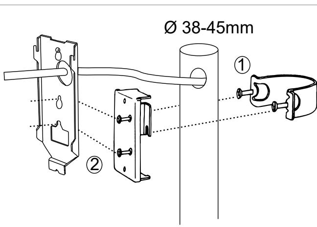

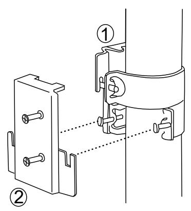

**6** 

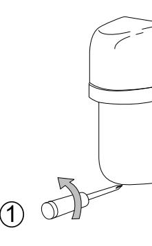

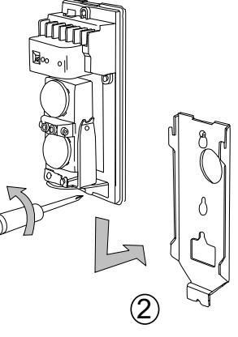

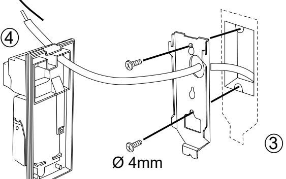

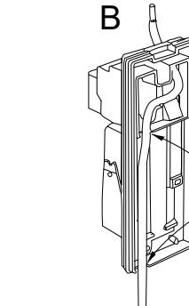

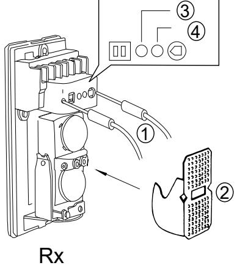

A B 5

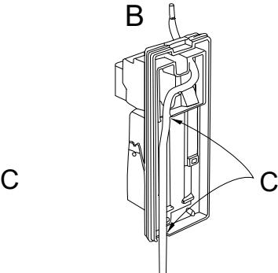

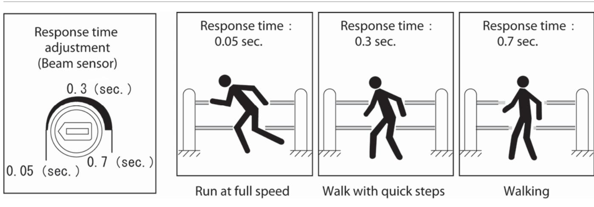

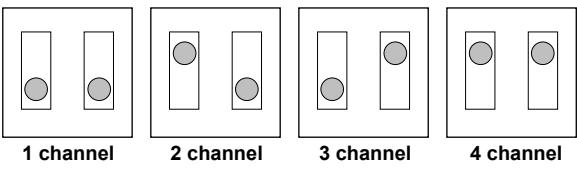

A: Line protection

**16** 

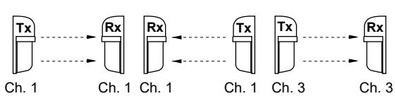

B: 2-stacked protection

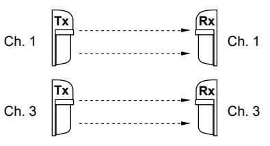

C: Line and 2-stacked protection

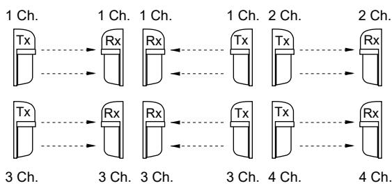

# **EN: Installation Sheet**

# **Product description**

The PB501/ PB511/ PB521 photoelectric beam sensors have an infrared transmitter (Tx) and receiver (Rx). They are designed to be "AND gated". An alarm is initiated only when two stacked beams are simultaneously interrupted. If one beam is interrupted (eg, by an insect or a leaf) it does not initiate an alarm. Four beam frequency channels are available to prevent cross talk when using multiple units.

# **Part description**

**Figure 1:** The product is supplied with the following items. Please check that they are all included.

| 1 | Terminals    |
|---|--------------|
| 2 | Beam channel |

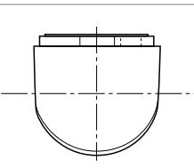

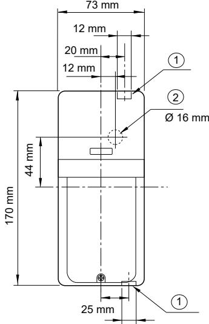

12 mm

| 3  | Lens                      |
|----|---------------------------|
| 4  | View finder               |
| 5  | Operation LED             |
| 6  | Horizontal adjustment     |
| 7  | Vertical adjustment screw |
| 8  | Cover                     |
| 9  | Mounting plate            |
| 10 | Alarm LED                 |
| 11 | Attenuation LED           |
| 12 | Response time adjustment  |
| 13 | Monitor jack              |
| 14 | Tapping screw             |
| 15 | Pole-mounting plate       |
| 16 | Pole bracket              |
| 17 | Attenuation sheet         |

#### **Guidelines when installing sensors**

**Figure 2:** Dos and Don'ts on where to install the sensor.

No obstructions (consider seasonal changes). Avoid strong light. Avoid splashing the unit. Avoid unstable ground.

**Figure 3:** Indoor and outdoor protection distances between transmitter and receiver.

| Model | Outdoor (m) | Indoor (m) |  |
|-------|-------------|------------|--|
| PB501 | 20          | 40         |  |
| PB511 | 40          | 80         |  |
| PB521 | 60          | 120        |  |

#### Avoid overhead wiring.

When installing indoors, use similar procedures as for telephones/intercoms. Outdoor wiring should be in PVC if used below ground or use a burial cable. Use conduit for aboveground wiring.

#### **Figure 4:** Recommended installation height.

**Figure 5:** Adjust the lens vertically (1) and horizontally (2) so that the unit can work in all directions. See examples A-C.

**Figure 8:** Calculating beam expansion (A). (B= protection distance)

#### A=0.03 x B

| Model | B (m) | A (m) |  |
|-------|-------|-------|--|
| PB501 | 20    | 0.6   |  |
| PB511 | 40    | 1.2   |  |
| PB521 | 60    | 1.8   |  |

#### **Wiring the system**

**Figure 6:** Terminal configuration.

**Figure 7:** Examples of connections.

**Figure 9:** Wiring distance for a power supply (m).

**Note:** The maximum wiring distance when two or more sets are connected is the value shown divided by the number of sets.

**Note:** The signal line can be wired up to approximately 1000 m with AWG22 (diameter 0.65 mm) telephone wire.

#### **Installing the system**

#### **Installing a wall-mounted unit (figure 12)**

Remove the cover from the unit (1) and detach the mounting plate (2). Break the grommet on the mounting plate and pull the wire thorough (3) (plug the opening between the grommet and the wire with a sealing material.) Secure the plate with screws. Pull the wire through the sensor body (4) and attach to the sensor plate.

Once the wiring is completed, adjust the alignment, check the operation and re-attach the cover. It is not necessary to seal the unit as it is waterproof.

If surface-wired (5), break the knockouts on the rear of the unit:

A= wiring from the top; B= wiring from the bottom; C= knockouts. Pull the wire through as shown and attach it to the mounting plate.

#### **Installing a pole-mounted system (figure 10)**

Insert two oval countersunk head screws (M4x20) in a pole bracket (1). Fix the pole mounting plate to the pole with the bracket. Remove the cover from the unit and detach the mounting plate. Insert two M4x10 screws in the pole-mounting plate (2) and fix the sensor mounting plate to them. Continue as explained for wall-mounted units.

**Installing a back-to-back pole-mounted system & rightangle pole mounted system (figure 11)** 

Fix the pole-mounting plate for the first unit. Position the pole bracket of the second unit underneath the first pole-mounting bracket and fix the second pole-mounting plate upside down. Continue as explained for wall-mounted units.

## **Aligning and operating the unit**

See figure 13.

**Figure 13 description** 

| 1 | Vertical adjustment screw. Clockwise: upwards. Counter clockwise: downwards |
|---|--------------------------------------------------------------------------------|
| 2 | Horizontal adjustment                                                          |
| 3 | View finder                                                                    |
|   |                                                                                |

Supply power to the unit with the cover removed. Set the same beam channel for both the transmitter and receiver (factory default is channel 1). To align the transmitter lens to the receiver lens, position the viewfinder between the two lenses and look through it. Line-up the optics horizontally and vertically until the opposite unit is visible.

**Figure 14:** Fine tuning the alignment.

**Figure 14 description** 

| 1 | Tester 3-10 VDC   |
|---|-------------------|
| 2 | Attenuation sheet |
| 3 | Alarm LED         |
| 4 | Attenuation LED   |

Continue fine tuning the unit until the receiver attenuation LED turns OFF.

If the unit is used outdoors, place an attenuation sheet over the receiver optics and continue fine tuning until the receiver LED turns OFF. It is recommended to use a tester when doing adjustments. Confirm the beam level by inserting the tester in the monitor jack of the receiver. See the table below for monitor output voltage (1) by recommended beam level for outdoor (2) and indoor (3) usage. Low readings need to be readjusted (4).

| Monitor output voltage (1) | Alignment outdoor (2) Alignment indoor (3) |                     |  |
|-------------------------------|--------------------------------------------|---------------------|--|
| more than 700 mV              | Best                                       |                     |  |
| 250-700 mV                    | Good                                       | Best                |  |
| 60-250 mV                     |                                            | Good                |  |
| less than 60 mV               | Poor. Re-adjust (4)                        | Poor. Re-adjust (4) |  |

**Note:** Table shows voltage under non-attenuation sheet condition.

**Testing the unit:** Test monthly. Walk in front of the receiver and see if the Alarm LED lights when the beam is blocked. Confirm the relay function by observing the status light on the control panel.

**Maintaining the unit:** The units are virtually maintenance free except for units located in dusty or dirty locations. Clean dirty units with a damp cloth as necessary.

## **Adjusting the response time**

#### See Figure 15.

Response time (sec.). 1. Response 0.05 sec: running at full speed. 2. Response 0.3 sec: walking quickly; 3. Response 0.7 sec: walking.

This feature is used to modify the response time of the beam to best suit the application. The unit cannot detect objects that move faster than the set response time. However, increasing the set response time may result in the unit not detecting people.

# **Changing beam frequency**

Change the beam frequency to prevent cross talk or bypass of beams. This can occur with line or 2-stacked protection.

**Figure 16:** Setting the beam channel.

- 1. Set the transmitter and receiver to the same channel. The units do not provide protection if set to different channels.
- 2. See figure 16 to set the beam channel when installing two or more units in a line or 2-stacked protection. **A:** Line protection; **B:** 2-stacked protection; **C.** Line and 2-stacked protection.

**Note:** When multi-stacked or line protection is used, it is recommended that beam alignment is done with a tester to improve reliability as well using the beam frequency changeover function. When multi-stacked protection is used, both upper and lower sensors should have the same model numbers.

## **External dimensions**

See Figure 17.

|   | Figure 17 description |  |  |
|---|-----------------------|--|--|
| 1 | Knockout              |  |  |
| 2 | Wire lead             |  |  |

# **Troubleshooting**

| Problem                                   | Possible cause                                    | Remedy                           |
|-------------------------------------------|---------------------------------------------------|----------------------------------|
| Operation LED does                     | No power supply.                                  | Turn on the power.               |
| not light.                                | Bad wiring connection or broken wire (short).  | Check and correct the wiring.    |
| Alarm LED does not                     | No power supply.                                  | Turn on the power.               |
| light when the beam is interrupted. | Poor wiring connection or broken wire (short). | Check and correct the wiring. |

| Problem                | Possible cause                                                                                                          | Remedy                                                                                                    |  |
|------------------------|-------------------------------------------------------------------------------------------------------------------------|-----------------------------------------------------------------------------------------------------------|--|
|                        | Beam is reflected on to another object and sent to the receiver.                                                  | Remove the reflecting object or change the beam direction.                                          |  |
|                        | Two beams are not broken simultaneously.                                                                             | Interrupt two beams simultaneously.                                                                    |  |
|                        | The beam interruption time is shorter than the set response time.                                                 | Adjust the beam response time.                                                                         |  |
| Alarm LED              | Beam alignment is out.                                                                                                  | Check and adjust again.                                                                                   |  |
| continues to light. | Shading object between the transmitter and the receiver.                                                          | Remove the shading objects.                                                                            |  |
|                        | Unit optics are dirty.                                                                                                  | Clean the optics with a soft cloth.                                                                    |  |
|                        | Frequency channel is not compatible between the transmitter and the receiver.                                  | Readjust to the same channel.                                                                          |  |
| Intermittent           | Bad wiring connection.                                                                                                  | Check again.                                                                                              |  |
| alarms                 | Change of supply voltage.                                                                                            | Stabilize supply voltage.                                                                                 |  |
|                        | Shading object between transmitter and the receiver.                                                              | Remove the shading object.                                                                                |  |
|                        | A large electrical noise source, such as a power machine, is located near the transmitter and the receiver. | Change location of the installation.                                                                   |  |
|                        | Unstable installation of transmitter and receiver.                                                                   | Stabilize.                                                                                                |  |
|                        | Dirty transmitter or receiver optics.                                                                                | Clean the optics with a soft cloth.                                                                    |  |
|                        | Incorrect alignment.                                                                                                    | Check and adjust again.                                                                                   |  |
|                        | Small animals may be passing through the two beams.                                                               | Increase the response time. (impossible in a location where the intruder can run at full speed.) |  |

# **Specifications**

| Model                  | PB501                                                                                                                                    | PB511                         | PB521                          |  |
|------------------------|------------------------------------------------------------------------------------------------------------------------------------------|-------------------------------|--------------------------------|--|
| Detection system    | Simultaneous interruption of 2 beams                                                                                                     |                               |                                |  |
| Infrared beam          | LED pulsed beam, double modulation                                                                                                       |                               |                                |  |
| Protection distance | Outdoor 20 m Indoor 40 m                                                                                                            | Outdoor 40 m Indoor 80 m | Outdoor 60 m Indoor 120 m |  |
| Response time       | 0.05-0.7 seconds variable (variable at pot)                                                                                              |                               |                                |  |
| Power supply           | 12-30 VDC (non polarity)                                                                                                                 |                               |                                |  |
| Current consumption | 55 mA or less                                                                                                                            | 75 mA or less                 | 80 mA or less                  |  |
| Alarm output           | Dry contact relay output form C Contact action: interruption time + delay time (1-3 s) Contact capacity: 30 V AC/DC, 0.5 A or less |                               |                                |  |

| Model                            | PB501                      | PB511                                        | PB521                                               |
|----------------------------------|----------------------------|----------------------------------------------|-----------------------------------------------------|
| Tamper output                 | Dry contact relay 1b (N/C) |                                              |                                                     |
|                                  | detached                   |                                              | Action: activated when the cover of the receiver is |
|                                  |                            | Contact capacity: 30 V AC/DC, 0.5 mA or less |                                                     |
| Alarm LED                        |                            |                                              | Red LED (receiver). ON: when an alarm is initiated  |
| Attenuation LED               |                            |                                              | Red LED (receiver). ON: when a beam is attenuated   |
| Functions                        |                            | jack output. AGC circuit. Frost-proof cover. | Beam frequency changeover (4 channels). Monitor     |
| Ambient temperature change | −25°C to +60°C             |                                              |                                                     |
| Mounting positions            | Indoor/outdoor             |                                              |                                                     |
| Wiring                           | Terminals                  |                                              |                                                     |
| Weight                           |                            | Transmitter: 380 g. Receiver: 400 g          |                                                     |
| Appearance                       | PC resin (wine red)        |                                              |                                                     |

# **Regulatory information**

| Manufacturer                 | UTC Fire & Security Americas Corporation, Inc. 1275 Red Fox Rd., Arden Hills, MN 55112-6943, USA                                                                                                                                                                                                                                                                        |  |  |
|------------------------------|-------------------------------------------------------------------------------------------------------------------------------------------------------------------------------------------------------------------------------------------------------------------------------------------------------------------------------------------------------------------------------|--|--|
|                              | EU authorized manufacturing representative: UTC Fire & Security B.V., Kelvinstraat 7, 6003 DH Weert, The Netherlands                                                                                                                                                                                                                                                    |  |  |
| Certification                |                                                                                                                                                                                                                                                                                                                                                                               |  |  |
| Environmental class       | Class 4                                                                                                                                                                                                                                                                                                                                                                       |  |  |
| European Union directives | 2002/95/EC (RoHs directive): Hereby, UTC Fire & Security declares that this device is in compliance with the essential requirements and other relevant provisions of Directive 2002/95/EC                                                                                                                                                                            |  |  |
|                              | 2002/96/EC (WEEE directive): Products marked with this symbol cannot be disposed of as unsorted municipal waste in the European Union. For proper recycling, return this product to your local supplier upon the purchase of equivalent new equipment, or dispose of it at designated collection points. For more information see: www.recyclethis.info. |  |  |
|                              | 2004/108/EC (EMC directive): Hereby, UTC Fire & Security declares that this device is in compliance with the essential requirements and other relevant provisions of Directive 2004/108/EC.                                                                                                                                                                       |  |  |

# **Contact information**

For contact information see our Web site: www.utcfireandsecurity.com.

# **DE: Installationsanleitung**

## **Produktbeschreibung**

Die PB501-/PB511-/PB521-Lichtschrankensensoren verfügen über einen Infrarotsender (Tx) und -empfänger (Rx). Sie wurden für Schaltungen mit einem AND-Gatter konzipiert. Dabei wird nur dann ein Alarm ausgelöst, wenn zwei übereinander angeordnete Lichtschranken gleichzeitig unterbrochen werden. Das Unterbrechen nur einer Lichtschranke (z. B. durch ein Insekt oder ein Blatt) löst noch keinen Alarm aus. Es steht eine Frequenzauswahl auf vier Kanälen zur Verfügung, um bei Verwendung mehrerer Einheiten ein Übersprechen zu verhindern.

# **Beschreibung der Teile**

**Abbildung 1:** Im Lieferumfang des Produkts sind folgende Komponenten enthalten. Überprüfen Sie das Paket auf Vollständigkeit.

| 1  | Anschlüsse                             |
|----|----------------------------------------|
| 2  | Lichtschrankenkanal                    |
| 3  | Linse/Optik                            |
| 4  | Sucher                                 |
| 5  | Betriebsanzeigen                       |
| 6  | Horizontale Ausrichtung                |
| 7  | Einstellschraube für vertikalen Winkel |
| 8  | Abdeckung                              |
| 9  | Montageplatte                          |
| 10 | Alarmanzeige                           |
| 11 | Empfindlichkeitsanzeige                |
| 12 | Reaktionszeiteinstellung               |
| 13 | Monitoranschluss                       |
| 14 | Blechschraube                          |
| 15 | Platte für Mastmontage                 |
| 16 | Masthalterung                          |
| 17 | Dämpfungsplatte                        |
|    |                                        |

### **Richtlinien zur Installation der Sensoren**

**Abbildung 2:** Für die Sensorinstallation unbedingt zu beachtende Punkte.

Vermeiden von Hindernissen (Berücksichtigung eventueller jahreszeitlich bedingter Veränderungen). Vermeiden von starkem Lichteinfall. Das Gerät muss vor Spritzwasser geschützt installiert werden. Keine Installation auf instabilem Untergrund.

**Abbildung 3:** Erfassungsreichweite zwischen Sender und Empfänger in Innen- und Außenbereichen.

| Modell | Außenbereich (m) | Innenbereich (m) |
|--------|------------------|------------------|
| PB501  | 20               | 40               |
| PB511  | 40               | 80               |
| PB521  | 60               | 120              |

#### Vermeiden Sie überflüssige Verkabelung.

Gehen Sie bei der Installation in Innenbereichen ähnlich vor, wie bei der Installation von Telefonen oder Sprechanlagen. Im Außenbereich verwendete Kabel sollten über eine PVC-Ummantelung verfügen, falls sie unterirdisch verlegt werden. Alternativ wird die Verwendung von Erdkabeln empfohlen. Zur oberirdischen Verlegung von Kabeln kann ein Kabelkanal verwendet werden.

#### **Abbildung 4:** Empfohlene Installationshöhe.

**Abbildung 5:** Richten Sie die Optik vertikal (1) und horizontal (2) so aus, dass das Gerät in allen Richtungen funktioniert. Siehe Beispiele A bis C.

**Abbildung 6:** Berechnung der Strahlaufweitung (A). (B = Schutzabstand)

#### **Installation des Systems**

#### **Wandinstallation des Geräts (Abbildung 12)**

Entfernen Sie die Abdeckung des Geräts (1) und lösen Sie die Montageplatte (2). Lösen Sie die Gummidichtung von der Montageplatte und ziehen Sie das Kabel straff (3) (verschließen Sie die Öffnung zwischen Gummidichtung und Kabel mithilfe eines geeigneten Dichtungsmaterials). Befestigen Sie die Platte mit den Schrauben. Ziehen Sie das Kabel durch das Sensorgehäuse (4) und befestigen Sie es an der Sensorplatte.

Justieren Sie nach abgeschlossener Verkabelung die Ausrichtung, kontrollieren Sie die Betriebsbereitschaft und bringen Sie die Abdeckung wieder an. Eine Versiegelung des wasserdichten Geräts ist nicht erforderlich.

Entfernen Sie bei Verlegung des Kabels auf einer Oberfläche die Ausstanzungen auf der Geräterückseite:

A= Kabelführung von oben; B= Kabelführung von unten; C= Ausstanzungen. Ziehen Sie das Kabel wie gezeigt hindurch und befestigen Sie es auf der Montageplatte.

#### **Mastmontage des Systems (Abbildung 10)**

Setzen Sie zwei Senkkopfschrauben (M4 x 20) in eine Masthalterung (1) ein. Befestigen Sie die Halterung für die Mastmontage mithilfe der Klammer am Mast. Entfernen Sie die Abdeckung des Geräts und lösen Sie die Montageplatte. Setzen Sie zwei M4 x 10-Schrauben in die Platte für die Mastmontage (2) ein und befestigen Sie daran die Platte für die Sensormontage. Fahren Sie analog zur Anleitung für Geräte mit Wandinstallation fort.

#### **Mastmontage des Systems (Rücken-an-Rücken) und Mastmontage mit Winkelverschraubung (Abbildung 11)**

Befestigen Sie die Platte für Mastmontage des ersten Geräts. Positionieren Sie die Masthalterung des zweiten Geräts unterhalb der Masthalterung des ersten Geräts und befestigen Sie die Platte der zweiten Masthalterung umgekehrt. Fahren Sie analog zur Anleitung für Geräte mit Wandinstallation fort.

#### **Ausrichtung und Betrieb des Geräts**

Siehe Abbildung 13.

#### **Erläuterung zu Abbildung 13**

| 1 | Einstellschraube für vertikalen Winkel. Im Uhrzeigersinn: nach |
|---|----------------------------------------------------------------|
|   | oben. Gegen den Uhrzeigersinn: nach unten.                     |
|   |                                                                |

2 Horizontale Ausrichtung

3 Sucher

Schalten Sie bei abgenommener Abdeckung die Stromzufuhr zum Gerät ein. Stellen Sie Sender und Empfänger auf den gleichen Lichtschrankenkanal ein (werkseitig auf Kanal 1 eingestellt). Zur Ausrichtung von Sender- auf Empfängeroptik positionieren Sie den Sucher zwischen den beiden Optiken und blicken Sie hindurch. Richten Sie die Optik jeweils so horizontal und vertikal aus, dass das gegenüber liegende Gerät zu sehen ist.

**Abbildung 14:** Feinabstimmung der Ausrichtung.

#### **Erläuterung zu Abbildung 14**

| 1 | Prüfgerät 3 - 10V DC |  |
|---|----------------------|--|
| 2 | Dämpfungsplatte      |  |
| 3 | Alarm LED            |  |
| 4 | Dämpfungsanzeige LED |  |
|   |                      |  |

Fahren Sie mit der Feinabstimmung des Geräts fort, bis die Empfindlichkeitsanzeige am Empfänger erlischt.

Bei Verwendung des Geräts in Außenbereichen müssen Sie die Dämpfungsplatte über der Empfängeroptik platzieren und mit der Feinabstimmung fortfahren, bis die Empfängeranzeige erlischt. Für die Ausrichtung wird die Verwendung eines Prüfgeräts empfohlen. Überprüfen Sie die Lichtschrankenintensität durch Anschluss des Prüfgeräts am Monitoranschluss des Empfängers. Die Tabelle unten gibt die Monitorausgangsspannung (1) sowie die empfohlene Lichtschrankenintensität bei Verwendung für Außen- (2) und Innenbereiche (3) an. Bei niedrigen Messwerten ist eine erneute Ausrichtung erforderlich (4).

| Monitorausgangs spannung (1) | Ausrichtung im Außenbereich (2):                 | Ausrichtung im Innenbereich (3):                 |  |
|---------------------------------|-----------------------------------------------------|-----------------------------------------------------|--|
| über 700 mV Optimal          |                                                     |                                                     |  |
| 250 - 700mV                     | Gut                                                 | Optimal                                             |  |
| 60 - 250mV                      |                                                     | Gut                                                 |  |
| unter 60mV                      | Schlecht Erneute Ausrichtung erforderlich (4) | Schlecht Erneute Ausrichtung erforderlich (4) |  |

**Hinweis:** Tabelle gibt Spannung ohne Dämpfungsplatte an.

**Testen des Geräts:** Führen Sie den Test monatlich durch. Gehen Sie vor dem Empfänger auf und ab. Kontrollieren Sie dabei, ob die Gehtest-LED aufleuchtet, sobald die Lichtschranke unterbrochen wird. Durch Beobachtung der Statusanzeigen können Sie sich von der ordnungsgemäßen Funktion des Relais überzeugen.

**Wartung des Geräts:** Die Geräte sind mit Ausnahme der an staubigen oder verschmutzungsanfälligen Standorten angebrachten Geräte nahezu wartungsfrei. Reinigen Sie verschmutzte Geräte gegebenenfalls mit einem feuchten Tuch.

#### **Anpassen der Reaktionszeit**

Siehe Abbildung 15.

Reaktionszeit (s) 1. Reaktionszeit 0,05s: in vollem Lauf passieren. 2. Reaktionszeit 0,3s: schnelles Gehen; 3. Reaktionszeit 0,7s: Gehen

Mithilfe dieser Funktion lässt sich die Reaktionszeit der Lichtschranke optimal auf die Anwendung abstimmen. Objekte mit einer höheren Geschwindigkeit als durch die festgelegte Reaktionszeit angegeben werden vom Gerät nicht erkannt. Allerdings kann eine Erhöhung der festgelegten Reaktionszeit dazu führen, dass Personen vom Gerät nicht mehr erfasst werden.

# **Änderung der Lichtschrankenfrequenz**

Sie können die Lichtschrankenfrequenz ändern, um ein Übersprechen oder eine Doppelbelichtung der Strahlen zu vermeiden. Diese Probleme können bei zwei hintereinander oder übereinander angebrachten Geräten auftreten.

**Abbildung 16:** Festlegen des Lichtschrankenkanals.

- 1. Legen Sie für Sender und Empfänger die Verwendung desselben Kanals fest. Sind die Geräte auf unterschiedliche Kanäle eingestellt, bieten sie keinen Schutz.
- 2. Hinweise zum Festlegen des Lichtschrankenkanals bei Installation von zwei oder mehr Geräten hintereinander oder übereinander finden Sie in Abbildung 16. **A:**  Hintereinander; **B:** Übereinander; **C.** Hinter- und übereinander.

**Hinweis:** Bei Positionierung über- und hintereinander wird die Verwendung eines Prüfgeräts für die

Lichtschrankenausrichtung empfohlen, um die Zuverlässigkeit zu erhöhen und die Funktion zur Änderung der

Lichtschrankenfrequenz nutzen zu können. Für die Positionierung der Geräte übereinander müssen für die oberen und unteren Sensoren Modelle der gleichen Serie verwendet werden.

## **Außenmaße**

Siehe Abbildung 17.

**Erläuterung zu Abbildung 17** 

| 1 | Ausstanzung |
|---|-------------|
| 2 | Kabel       |

## **Fehlerbehebung**

| Problem                                                      | Mögliche Ursache                                   | Abhilfe                                        |
|--------------------------------------------------------------|----------------------------------------------------|------------------------------------------------|
| Betriebsan zeige leuchtet nicht.                    | Keine Spannungsversorgung.                      | Schalten Sie die Spannungsversorgung ein.   |
|                                                              | Wackelkontakt oder Kabelbruch (Kurzschluss). | Prüfen und korrigieren Sie die Verkabelung. |
| Alarmanzei ge leuchtet nicht bei unterbroch ener | Keine Spannungsversorgung.                      | Schalten Sie die Spannungsversorgung ein.   |
|                                                              | Wackelkontakt oder Kabelbruch (Kurzschluss). | Prüfen und korrigieren Sie die Verkabelung. |

| Problem                                   | Mögliche Ursache                                                                                                                                   | Abhilfe                                                                                                                                                                |  |
|-------------------------------------------|----------------------------------------------------------------------------------------------------------------------------------------------------|------------------------------------------------------------------------------------------------------------------------------------------------------------------------|--|
| Lichtschran ke.                        | Strahl wird zu einem anderen Objekt reflektiert und trifft von dort auf Empfänger.                                                        | Entfernen Sie das reflektierende Objekt oder richten Sie den Strahl neu aus.                                                                                  |  |
|                                           | Die beiden Strahlen werden nicht gleichzeitig unterbrochen.                                                                                  | Unterbrechen Sie die beiden Strahlen gleichzeitig.                                                                                                                  |  |
|                                           | Die Dauer der Strahlunterbrechung liegt unter der festgelegten Reaktionszeit.                                                             | Stellen Sie die Reaktionszeit neu ein.                                                                                                                              |  |
| Alarmanzei ge leuchtet kontinuierli | Fehler bei Lichtschranken Ausrichtung.                                                                                                       | Überprüfen Sie die Ausrichtung und passen Sie diese neu an.                                                                                                      |  |
| ch.                                       | Zwischen Sender und Empfänger befindet sich ein Schatten werfendes Objekt.                                                                | Entfernen Sie dieses.                                                                                                                                                  |  |
|                                           | Verschmutzte Optik.                                                                                                                                | Reinigen Sie die Optik mit einem weichen Tuch.                                                                                                                      |  |
|                                           | Sender und Empfänger sind nicht auf den gleichen Frequenzkanal eingestellt.                                                               | Stellen Sie beide auf den gleichen Kanal ein.                                                                                                                       |  |
| Nur zeitweilig                         | Wackelkontakt.                                                                                                                                     | Erneute Überprüfung der Verkabelung.                                                                                                                                |  |
| auftretende r Alarm                    | Änderung der Versorgungsspannung.                                                                                                               | Stabilisieren Sie die Versorgungsspannung.                                                                                                                          |  |
|                                           | Zwischen Sender und Empfänger befindet sich ein Schatten werfendes Objekt.                                                                | Entfernen Sie dieses.                                                                                                                                                  |  |
|                                           | In der Nähe von Sender und Empfänger befindet sich eine starke elektromagnetische Störquelle, beispielsweise eine Kraftmaschine. | Installieren Sie die Lichtschranke an einem anderen Ort.                                                                                                         |  |
|                                           | Instabile Installation von Sender und Empfänger.                                                                                                | Sorgen Sie für die erforderliche Stabilität.                                                                                                                        |  |
|                                           | Verschmutzte Sender oder Empfängeroptik.                                                                                                        | Reinigen Sie die Optik mit einem weichen Tuch.                                                                                                                      |  |
|                                           | Falsche Ausrichtung.                                                                                                                               | Überprüfen Sie die Ausrichtung und passen Sie diese neu an.                                                                                                      |  |
|                                           | Unter Umständen werden die beiden Strahlen von Kleintieren durchquert.                                                                       | Erhöhen Sie die Reaktionszeit. (nicht möglich an Standorten, an denen ein möglicher Eindringling die Lichtschranke in vollem Lauf passieren könnte). |  |

# **Technische Daten**

| Modell                 | PB501                                      | PB511 | PB521 |
|------------------------|--------------------------------------------|-------|-------|
| Überwachung ssystem | gleichzeitige Unterbrechung von 2 Strahlen |       |       |
| Infrarotstrahl         | Impulsstrahl, Doppelmodulation             |       |       |

| Erfassungs Außenbereich Außenbereich Außenbereich reichweite 20m 40m 60m Innenbereich Innenbereich Innenbereich 40m 80m 120m Reaktionszeit 0,05-0,7 s variabel (variabel an Potentiometer) Spannungsve 12 - 30V DC (keine Polarität) rsorgung Stromaufnah 55mA oder 75mA oder 80mA oder me niedriger niedriger niedriger Alarmausgan Potentialfreier Relaisausgang von C g Kontaktwirkung: Unterbrechungszeit + Verzögerungszeit (1 - 3s) Schaltleistung: 30V AC/DC, 0,5A oder niedriger Sabotageaus Potentialfreies Relais 1b (N/C) gang Aktivierung bei Entfernung der Abdeckung Schaltleistung: 30V AC/DC, 0,5mA oder niedriger Alarmanzeige Rote LED (Empfänger). EIN: bei Auslösung eines Alarms Empfindlichke Rote LED (Empfänger). EIN: bei Abschwächung/ itsanzeige Dämpfung eines Strahls Funktionen Änderung der Lichtschrankenfrequenz (4 Kanäle). Ausgang Monitoranschluss. AGC-Schaltkreis. Frostsichere Abdeckung. Umgebungste −25°C bis +60°C mperaturberei ch Montagepositi Innen-/Außenbereich onen Verkabelung Schraubklemmen Gewicht Sender: 380g. Empfänger: 400g Ausführung PC-Harz (weinrot) | Modell | PB501 | PB511 | PB521 |  |
|------------------------------------------------------------------------------------------------------------------------------------------------------------------------------------------------------------------------------------------------------------------------------------------------------------------------------------------------------------------------------------------------------------------------------------------------------------------------------------------------------------------------------------------------------------------------------------------------------------------------------------------------------------------------------------------------------------------------------------------------------------------------------------------------------------------------------------------------------------------------------------------------------------------------------------------------------------------------------------------------------------------------------------------------------------------------------------------------------------------------------------------------------------------------------------------------------------------------------------------------------------------------------------------------------------------|--------|-------|-------|-------|--|
|                                                                                                                                                                                                                                                                                                                                                                                                                                                                                                                                                                                                                                                                                                                                                                                                                                                                                                                                                                                                                                                                                                                                                                                                                                                                                                                  |        |       |       |       |  |
|                                                                                                                                                                                                                                                                                                                                                                                                                                                                                                                                                                                                                                                                                                                                                                                                                                                                                                                                                                                                                                                                                                                                                                                                                                                                                                                  |        |       |       |       |  |
|                                                                                                                                                                                                                                                                                                                                                                                                                                                                                                                                                                                                                                                                                                                                                                                                                                                                                                                                                                                                                                                                                                                                                                                                                                                                                                                  |        |       |       |       |  |
|                                                                                                                                                                                                                                                                                                                                                                                                                                                                                                                                                                                                                                                                                                                                                                                                                                                                                                                                                                                                                                                                                                                                                                                                                                                                                                                  |        |       |       |       |  |
|                                                                                                                                                                                                                                                                                                                                                                                                                                                                                                                                                                                                                                                                                                                                                                                                                                                                                                                                                                                                                                                                                                                                                                                                                                                                                                                  |        |       |       |       |  |
|                                                                                                                                                                                                                                                                                                                                                                                                                                                                                                                                                                                                                                                                                                                                                                                                                                                                                                                                                                                                                                                                                                                                                                                                                                                                                                                  |        |       |       |       |  |
|                                                                                                                                                                                                                                                                                                                                                                                                                                                                                                                                                                                                                                                                                                                                                                                                                                                                                                                                                                                                                                                                                                                                                                                                                                                                                                                  |        |       |       |       |  |
|                                                                                                                                                                                                                                                                                                                                                                                                                                                                                                                                                                                                                                                                                                                                                                                                                                                                                                                                                                                                                                                                                                                                                                                                                                                                                                                  |        |       |       |       |  |
|                                                                                                                                                                                                                                                                                                                                                                                                                                                                                                                                                                                                                                                                                                                                                                                                                                                                                                                                                                                                                                                                                                                                                                                                                                                                                                                  |        |       |       |       |  |
|                                                                                                                                                                                                                                                                                                                                                                                                                                                                                                                                                                                                                                                                                                                                                                                                                                                                                                                                                                                                                                                                                                                                                                                                                                                                                                                  |        |       |       |       |  |
|                                                                                                                                                                                                                                                                                                                                                                                                                                                                                                                                                                                                                                                                                                                                                                                                                                                                                                                                                                                                                                                                                                                                                                                                                                                                                                                  |        |       |       |       |  |
|                                                                                                                                                                                                                                                                                                                                                                                                                                                                                                                                                                                                                                                                                                                                                                                                                                                                                                                                                                                                                                                                                                                                                                                                                                                                                                                  |        |       |       |       |  |
|                                                                                                                                                                                                                                                                                                                                                                                                                                                                                                                                                                                                                                                                                                                                                                                                                                                                                                                                                                                                                                                                                                                                                                                                                                                                                                                  |        |       |       |       |  |
|                                                                                                                                                                                                                                                                                                                                                                                                                                                                                                                                                                                                                                                                                                                                                                                                                                                                                                                                                                                                                                                                                                                                                                                                                                                                                                                  |        |       |       |       |  |
|                                                                                                                                                                                                                                                                                                                                                                                                                                                                                                                                                                                                                                                                                                                                                                                                                                                                                                                                                                                                                                                                                                                                                                                                                                                                                                                  |        |       |       |       |  |
|                                                                                                                                                                                                                                                                                                                                                                                                                                                                                                                                                                                                                                                                                                                                                                                                                                                                                                                                                                                                                                                                                                                                                                                                                                                                                                                  |        |       |       |       |  |
|                                                                                                                                                                                                                                                                                                                                                                                                                                                                                                                                                                                                                                                                                                                                                                                                                                                                                                                                                                                                                                                                                                                                                                                                                                                                                                                  |        |       |       |       |  |
|                                                                                                                                                                                                                                                                                                                                                                                                                                                                                                                                                                                                                                                                                                                                                                                                                                                                                                                                                                                                                                                                                                                                                                                                                                                                                                                  |        |       |       |       |  |
|                                                                                                                                                                                                                                                                                                                                                                                                                                                                                                                                                                                                                                                                                                                                                                                                                                                                                                                                                                                                                                                                                                                                                                                                                                                                                                                  |        |       |       |       |  |

# **Rechtliche Hinweise**

| Hersteller      | UTC Fire & Security Americas Corporation, Inc. 1275 Red Fox Rd., Arden Hills, MN 55112-6943, USA                                                                                                                                                                                                                                                                                                                                                    |  |
|-----------------|-----------------------------------------------------------------------------------------------------------------------------------------------------------------------------------------------------------------------------------------------------------------------------------------------------------------------------------------------------------------------------------------------------------------------------------------------------------|--|
|                 | In der EU autorisierter Hersteller: UTC Fire & Security B.V., Kelvinstraat 7, 6003 DH Weert, Niederlande                                                                                                                                                                                                                                                                                                                                            |  |
| Zertifizierung  |                                                                                                                                                                                                                                                                                                                                                                                                                                                           |  |
| Umgebungsklasse | Klasse 4                                                                                                                                                                                                                                                                                                                                                                                                                                                  |  |
| EG-Richtlinien  | 2002/95/EC (RoHs-Richtlinie): Hiermit erklärt UTC Fire & Security, dass dieses Gerät die grundlegenden Anforderungen der Richtlinie 2002/95/EC sowie andere relevante Bestimmungen erfüllt.                                                                                                                                                                                                                                                   |  |
|                 | 2002/96/EC (WEEE-Richtlinie): Mit diesem Symbol gekennzeichnete Produkte dürfen nicht in den öffentlichen europäischen Entsorgungssystemen entsorgt werden. Geben Sie bei Kauf eines ähnlichen neuen Produkts das alte Produkt zwecks ordnungsgemäßer Entsorgung an den örtlichen Lieferanten zurück oder geben Sie es an einer entsprechenden Annahmestelle ab. Weitere Informationen finden Sie unter: www.recyclethis.info. |  |

2004/108/EC (EMC-Richtlinie): Hiermit erklärt UTC Fire & Security, dass dieses Gerät die grundlegenden Anforderungen der Richtlinie 2004/108/EC sowie andere relevante Bestimmungen erfüllt.

## **Kontaktinformationen**

Kontaktinformationen finden Sie auf unserer Website unter: www.utcfireandsecurity.com.

# **ES: Hoja de instalación**

# **Descripción del producto**

Los sensores de haz fotoeléctricos PB501/ PB511/ PB521 tienen un transmisor (Tx) y un receptor (Rx) de infrarrojos. Están diseñados para funcionar como "compuerta AND". Una alarma se activará solo en caso de que se interrumpan dos haces apilados al mismo tiempo. Si un haz se interrumpe (por ejemplo, por la presencia de un insecto o una hoja), no se desencadenará ninguna alarma. Hay disponibles cuatro canales de frecuencia para impedir la diafonía cuando se utilicen varias unidades.

# **Descripción de la pieza**

**Figura 1:** el producto se suministra con los siguientes elementos. Compruebe que se incluyen todos.

| 1  | Terminales                     |
|----|--------------------------------|
| 2  | Canal de haz                   |
| 3  | Lente                          |
| 4  | Visor                          |
| 5  | LED de funcionamiento          |
| 6  | Ajuste horizontal              |
| 7  | Tornillo de ajuste vertical    |
| 8  | Cubierta                       |
| 9  | Placa de montaje               |
| 10 | LED de alarma                  |
| 11 | LED de atenuación              |
| 12 | Ajuste del tiempo de respuesta |
| 13 | Clavija del monitor            |
| 14 | Tornillo roscante              |
| 15 | Placa para montaje en poste    |
| 16 | Soporte para poste             |
| 17 | Hoja de atenuación             |

## **Directrices para instalar los sensores**

**Figura 2:** qué se debe hacer y qué no al instalar el sensor.

Evite las obstrucciones (piense en realizar cambios estacionales). Evite la luz demasiado fuerte. Evite salpicar la unidad. Evite las superficies inestables.

**Figura 3:** distancias de protección en interior y en exterior entre el transmisor y el receptor.

| Modelo | Exterior (m) | Interior (m) |  |
|--------|--------------|--------------|--|
| PB501  | 20           | 40           |  |
| PB511  | 40           | 80           |  |
| PB521  | 60           | 120          |  |

Evite situar el cableado en una ubicación elevada.

Al instalar en interiores, siga un procedimiento similar al empleado para la instalación de teléfonos / intercomunicadores. El cableado de exterior debe ser de PVC

si se utiliza bajo tierra o se utiliza un cable enterrado. Utilice un conducto para el cableado que va sobre el suelo.

**Figura 4:** altura de instalación recomendada.

**Figura 5:** ajuste las lentes verticalmente (1) y horizontalmente (2) para que la unidad pueda funcionar en todas direcciones. Vea los ejemplos A-C.

**Figura 6:** cálculo de la expansión del haz (A). (B= distancia de protección)

#### **Instalación del sistema**

**Instalación de una unidad montada sobre una pared (figura 12)** 

Retire la cubierta de la unidad (1) y quite la placa de montaje (2). Rompa el pasacables de la placa de montaje y pase el cable con cuidado (3) (tape la abertura que queda entre el pasacables y el cableado con material de sellado). Fije la placa con los tornillos. Pase el cable por el cuerpo del sensor (4) y fíjelo a la placa del sensor.

Cuando haya colocado el cableado, ajuste la alineación, compruebe el funcionamiento y coloque de nuevo la cubierta. No es necesario sellar la unidad ya que es resistente al agua.

Si los cables van por la superficie (5), rompa los bloqueadores de la parte posterior de la unidad:

A= cableado desde la parte superior: B= cableado desde la parte inferior; C=bloqueadores. Pase el cable a través de la unidad como se muestra y fíjelo a la placa de montaje.

**Instalación de un sistema montado sobre un poste (figura 10)** 

Inserte dos tornillos de cabeza avellanada ovalados (M4x20) en un soporte para poste (1). Fije la placa de montaje en poste al poste utilizando el soporte. Retire la cubierta de la unidad y quite la placa de montaje. Inserte dos tornillos M4x10 en la placa de montaje en poste (2) y fije la placa de montaje del sensor con ellos. A partir de aquí siga el procedimiento explicado para la instalación de unidades montadas sobre pared.

**Instalación de un sistema adosado a un poste por las partes posteriores y de un sistema montado en poste en ángulo recto (figura 11)** 

Fije la placa de montaje en poste de la primera unidad. Coloque el soporte del poste de la segunda unidad por debajo del primer soporte de montaje en poste y coloque la segunda placa de montaje en poste al revés. A partir de aquí siga el procedimiento explicado para la instalación de unidades montadas sobre pared.

#### **Alineación y funcionamiento de la unidad**

#### Consulte la figura 13.

**Descripción de la figura 13** 

| 1 | Tornillo de ajuste vertical. En sentido de las agujas del reloj: hacia arriba. En sentido contrario a las agujas del reloj: hacia abajo |
|---|-----------------------------------------------------------------------------------------------------------------------------------------------|
| 2 | Ajuste horizontal                                                                                                                             |
| 3 | Visor                                                                                                                                         |

Conecte la unidad a la fuente de alimentación con la cubierta quitada. Determine el mismo canal de haz para el transmisor y el receptor (la configuración predeterminada de fábrica es canal 1). Para alinear la lente del transmisor con la lente del receptor, coloque el visor entre las dos lentes y mire a través de él. Alinee los elementos ópticos horizontalmente y verticalmente hasta que se vea la unidad opuesta.

**Figura 14:** ajuste preciso de la alineación.

**Descripción de la figura 14** 

| 1 | Probador 3-10 VCC  |
|---|--------------------|
| 2 | Hoja de atenuación |
| 3 | LED de alarma      |
| 4 | LED de atenuación  |
|   |                    |

Siga ajustando con precisión la unidad hasta que el LED de atenuación del receptor pase a OFF (desactivado).

Si la unidad se utiliza en exteriores, coloque una hoja de atenuación sobre los elementos ópticos del receptor y siga ajustando con precisión hasta que el LED del receptor pase a OFF (desactivado). Se recomienda utilizar un probador al realizar los ajustes. Confirme el nivel del haz insertando el probador en la clavija de monitor del receptor. Consulte la tabla siguiente para comprobar la tensión de salida del monitor (1) para el nivel del haz recomendado para uso exterior (2) e interior (3). Si la lectura es baja es necesario realizar un reajuste (4).

| Tensión de salida del monitor (1) | Alineación en exterior (2)   | Alineación en interior (3)   |
|--------------------------------------|---------------------------------|---------------------------------|
| más de 700 mV                        | La mejor                        |                                 |
| 250-700 mV                           | Buena                           | La mejor                        |
| 60-250 mV                            |                                 | Buena                           |
| menos de 60 mV                       | Escasa. Volver a ajustar (4) | Escasa. Volver a ajustar (4) |

**Nota:** la tabla muestra una tensión por debajo de la condición de la hoja sin atenuación.

**Probar la unidad:** probar mensualmente. Camine enfrente del receptor y compruebe si el LED de la prueba de paseo se ilumina cuando se bloquea el haz. Confirme la función del relé observando la luz de estado en el panel de control.

**Mantenimiento de la unidad:** las unidades no necesitan prácticamente mantenimiento, con la salvedad de las unidades ubicadas en lugares sucios o con polvo. Pase un trapo húmedo por las unidades sucias cuando sea necesario.

### **Ajuste del tiempo de respuesta**

Consulte la figura 15.

Tiempo de respuesta (seg). 1. Respuesta 0,05 seg: corriendo a toda velocidad. 2. Respuesta 0,3 seg: caminando rápidamente, 3. Respuesta 0,7 seg: caminando.

Esta función se utiliza para modificar el tiempo de respuesta del haz para adaptarse a la aplicación del mejor modo posible. La unidad no detecta los objetos que se mueven más rápido que el tiempo de respuesta. Sin embargo, si aumenta el tiempo de respuesta configurado puede ocurrir que la unidad no detecte a las personas.

## **Cambio de la frecuencia del haz**

Cambie la frecuencia del haz para impedir la diafonía o la anulación de haces. Esto puede producirse con protección de línea o de dos apilados.

**Figura 16:** configuración del canal de haz.

- 1 Configure el transmisor y el receptor en el mismo canal. Las unidades no ofrecen protección si están configuradas en canales diferentes.
- 2 Consulte la figura 16 para configurar el canal del haz al instalar dos o más unidades en una protección de línea o de dos apilados. **A:** protección de línea; **B:** protección de dos apilados; **C.** protección de línea y dos apilados.

**Nota:** cuando se utilice protección de línea o varios apilados, se recomienda utilizar un probador para alinear el haz y así incrementar la fiabilidad; asimismo, se recomienda utilizar la función de conversión de frecuencia del haz. Cuando se utilice protección de varios apilados, los sensores superior e inferior deberían tener el mismo número de modelo.

### **Dimensiones externas**

Consulte la figura 17.

**Descripción de la figura 17** 

| 1 | Bloqueadores         |
|---|----------------------|
| 2 | Terminal de conexión |

| Resolver problemas |
|--------------------|
|--------------------|

| Problema                                                                         | Causa posible                                                             | Remedio                                                                     |  |
|----------------------------------------------------------------------------------|---------------------------------------------------------------------------|-----------------------------------------------------------------------------|--|
| El LED de funcionami ento no se ilumina.                                | No hay alimentación eléctrica.                                         | Conecte el dispositivo.                                                     |  |
|                                                                                  | Conexión incorrecta del cableado o cable roto (cortocircuito).      | Revise y repare el cableado.                                                |  |
| El LED de la alarma no se ilumina cuando el haz se interrumpe. | No hay alimentación eléctrica.                                         | Conecte el dispositivo.                                                     |  |
|                                                                                  | Conexión de mala calidad del cableado o cable roto (cortocircuito). | Revise y repare el cableado.                                             |  |
|                                                                                  | El haz se refleja en otro objeto y se envía al receptor.            | Quite el objeto que provoca el reflejo o cambie la dirección del haz. |  |
|                                                                                  | No se interrumpen dos haces de manera simultánea.                   | Interrumpa dos haces de manera simultánea.                               |  |

| Problema                                       | Causa posible                                                                                                            | Remedio                                                                                                                 |  |
|------------------------------------------------|--------------------------------------------------------------------------------------------------------------------------|-------------------------------------------------------------------------------------------------------------------------|--|
|                                                | El tiempo de interrupción del haz es inferior al tiempo de respuesta establecido.                               | Ajuste el tiempo de respuesta del haz.                                                                               |  |
| El LED de alarma permanece iluminado. | El haz no tiene una alineación correcta.                                                                              | Revísela y vuelva a ajustarlo.                                                                                       |  |
|                                                | Hay objetos que provocan sombras entre el transmisor y el receptor.                                             | Quite los objetos que provocan sombras.                                                                              |  |
|                                                | Los elementos ópticos de la unidad están sucios.                                                                      | Limpie los elementos ópticos con un paño seco.                                                                       |  |
|                                                | El canal de frecuencia no es compatible entre el transmisor y el receptor.                                         | Cambie el ajuste para que estén en el mismo canal.                                                                   |  |
| Alarmas intermitent                         | Conexión de cableado incorrecta.                                                                                      | Compruébela de nuevo.                                                                                                   |  |
| es                                             | Cambie la tensión de alimentación.                                                                                    | Estabilice la tensión de la alimentación.                                                                            |  |
|                                                | Hay un objeto que provoca sombras entre el transmisor y el receptor.                                               | Quite el objeto que provoca sombras.                                                                                 |  |
|                                                | Una fuente de ruido importante, como una máquina eléctrica, se encuentra cerca del transmisor y el receptor. | Cambie la ubicación de la instalación.                                                                               |  |
|                                                | Instalación inestable del transmisor y el receptor.                                                                   | Estabilícelos.                                                                                                          |  |
|                                                | Elementos ópticos del transmisor o el receptor sucios.                                                             | Limpie los elementos ópticos con un paño seco.                                                                       |  |
|                                                | Alineación incorrecta.                                                                                                   | Revísela y vuelva a ajustarlo.                                                                                       |  |
|                                                | Es posible que pasen animales pequeños entre los haces.                                                            | Aumente el tiempo de respuesta. (Imposible en un lugar en el que el intruso pueda correr a gran velocidad). |  |

# **Especificaciones**

| Modelo                     | PB501                                                                     | PB511          | PB521           |  |
|----------------------------|---------------------------------------------------------------------------|----------------|-----------------|--|
| Sistema de detección    | Interrupción simultánea de dos haces                                      |                |                 |  |
| Haz de infrarrojo       | Haz pulsado de LED, doble modulación                                      |                |                 |  |
| Distancia de protección | Exterior 20 m                                                            | Exterior 40 m | Exterior 60 m  |  |
|                            | Interior 40 m                                                            | Interior 80 m | Interior 120 m |  |
| Tiempo de respuesta     | 0,05-0,7 s variable (variable en el potenciómetro)                        |                |                 |  |
| Fuente de alimentación  | 12-30 VCC (sin polaridad)                                                 |                |                 |  |
| Consumo de corriente    | 55 mA o menos                                                             | 75 mA o menos  | 80 mA o menos   |  |
| Salida de alarma        | Formulario de salida de relé de contacto sin corriente C               |                |                 |  |
|                            | Acción de contacto: tiempo de interrupción + tiempo de retardo (1-3 s) |                |                 |  |
|                            | Capacidad de contacto: 30 V CA/CC, 0,5 A o menos                          |                |                 |  |

| Modelo                                | PB501                                                                                                                          | PB511                              | PB521                                            |  |
|---------------------------------------|--------------------------------------------------------------------------------------------------------------------------------|------------------------------------|--------------------------------------------------|--|
| Salida de tamper                   | Relé de contacto sin corriente 1b (N/C)                                                                                        |                                    |                                                  |  |
|                                       | Acción: activado cuando la tapa no está colocada                                                                               |                                    |                                                  |  |
|                                       | Capacidad de contacto: 30 V CA/CC, 0,5 mA o menos                                                                           |                                    |                                                  |  |
| LED de alarma                      | iniciado una alarma                                                                                                            |                                    | LED rojo (receptor). ON (Activado): cuando se ha |  |
| LED de atenuación                  | LED rojo (receptor). ON (Activado): cuando un haz se ha atenuado                                                            |                                    |                                                  |  |
| Funciones                             | Cambio de frecuencia de haz (4 canales). Salida de clavija del monitor. Circuito CAG. Cubierta resistente a las heladas. |                                    |                                                  |  |
| Cambio de temperatura ambiental | De −25°C a +60°C                                                                                                               |                                    |                                                  |  |
| Posiciones de montaje              | Interior/exterior                                                                                                              |                                    |                                                  |  |
| Conexiones                            | Terminales                                                                                                                     |                                    |                                                  |  |
| Peso                                  |                                                                                                                                | Transmisor: 380 g. Receptor: 400 g |                                                  |  |
| Aspecto                               | Resina PC (vino tinto)                                                                                                         |                                    |                                                  |  |

## **Información de normativas**

| Fabricante                        | UTC Fire & Security Americas Corporation, Inc. 1275 Red Fox Rd., Arden Hills, MN 55112-6943, EE. UU.                                                                                                                                                                                                                                                                                                                               |
|-----------------------------------|------------------------------------------------------------------------------------------------------------------------------------------------------------------------------------------------------------------------------------------------------------------------------------------------------------------------------------------------------------------------------------------------------------------------------------------|
|                                   | Representante de fabricación autorizado para la Unión Europea: UTC Fire & Security B.V., Kelvinstraat 7, 6003 DH Weert, Países Bajos                                                                                                                                                                                                                                                                                            |
| Certificación                     |                                                                                                                                                                                                                                                                                                                                                                                                                                          |
| Clase ambiental                   | Clase 4                                                                                                                                                                                                                                                                                                                                                                                                                                  |
| Directivas de la Unión Europea | 2002/95/EC (directiva RoHs): Por el presente, UTC Fire & Security declara que este dispositivo cumple con los requisitos esenciales y otras disposiciones relevantes de la Directiva 2002/95/CE.                                                                                                                                                                                                                             |
|                                   | 2002/96/CE (directiva de WEEE): Los productos marcados con este símbolo no se pueden eliminar como residuos urbanos sin clasificar en la Unión Europea. Para poder reciclarlo adecuadamente, devuelva este producto a su proveedor local al adquirir un equipo nuevo equivalente o elimínelo en los puntos de recogida designados para tal efecto. Para obtener más información, consulte: www.recyclethis.info. |
|                                   | 2004/108/CE (directiva de EMC): Por el presente, UTC Fire & Security declara que este dispositivo cumple con los requisitos esenciales y otras disposiciones relevantes de la Directiva 2004/108/CE.                                                                                                                                                                                                                         |

## **Información de contacto**

Para obtener información de contacto, consulte nuestra página web: www.utcfireandsecurity.com.

# **FR: Manuel d'installation**

# **Description du produit**

Les détecteurs photoélectriques à faisceau PB501/ PB511/ PB521 sont équipés d'un émetteur (Tx) et d'un récepteur (Rx) à infrarouges. Ils sont conçus pour fonctionner en « fonction ET ». Une alarme n'est générée que lorsque deux faisceaux superposés sont interrompus simultanément. Si un seul faisceau est interrompu, par ex. par un insecte ou une feuille morte, l'alarme ne se déclenche pas. Des canaux de fréquences à quatre faisceaux sont disponibles pour éviter l'intermodulation lorsque plusieurs unités sont utilisées.

# **Description des pièces**

**Figure 1 :** Le produit contient les éléments suivants. Veuillez vérifier si le colis est complet.

| 1  | Bornier                      |
|----|------------------------------|
| 2  | Canal de faisceau            |
| 3  | Objectif                     |
| 4  | Viseur                       |
| 5  | Diode de fonctionnement      |
| 6  | Réglage horizontal           |
| 7  | Réglage vertical             |
| 8  | Face (couvercle)             |
| 9  | Plaque de montage            |
| 10 | Diode d'alarme               |
| 11 | Diode d'atténuation          |
| 12 | Réglage du temps de réponse  |
| 13 | Fiche pour moniteur          |
| 14 | Vis autotaraudeuse           |
| 15 | Plaque de montage sur piquet |
| 16 | Bride pour piquet            |
| 17 | Écran d'atténuation          |
|    |                              |

### **Instructions d'installation des détecteurs**

**Figure 2 :** Conseils pour le choix de l'emplacement du détecteur.

Pas d'obstacles (penser aux changements de saison). Éviter la lumière vive. Éviter les éclaboussures. Éviter les terrains meubles.

**Figure 3 :** Distance de protection à l'intérieur et l'extérieur entre l'émetteur et le récepteur.

| Modèle | À l'extérieur (m) | À l'intérieur (m) |  |
|--------|-------------------|-------------------|--|
| PB501  | 20                | 40                |  |
| PB511  | 40                | 80                |  |
| PB521  | 60                | 120               |  |

Éviter le câblage aérien.

Pour les installations à l'intérieur, utiliser les mêmes procédures que pour téléphones/interphones. À l'extérieur, protéger le câble en le passant dans un tube ou utiliser des câbles blindés à enterrer.

**Figure 4 :** Hauteurs d'installation.

**Figure 5 :** Régler l'objectif verticalement (1) et horizontalement (2) pour permettre à l'unité de fonctionner dans toutes les directions. Voir exemples A-C.

**Figure 8 :** Calcul de l'expansion du faisceau (A). (B = distance de protection)

#### A=0.03 x B

| Modèle | B (m) | A (m) |
|--------|-------|-------|
| PB501  | 20    | 0.6   |
| PB511  | 40    | 1.2   |
| PB521  | 60    | 1.8   |

## **Câblage du système**

**Figure 6 :** Configuration du bornier.

**Figure 7 :** Exemples de connexions.

**Figure 9 :** Distance de câblage (m).

**Remarque :** La distance maximale de câblage lorsque deux ou plusieurs appareils sont connectés correspond à la valeur indiquée divisée par le nombre d'appareils.

**Remarque :** La ligne de signal peut être câblée à l'aide d'un câble téléphonique AWG22 (section 0,65 mm) d'une longueur max. de 1.000 m.

#### **Installation**

#### **Montage en applique (figure 12)**

Retirer la face de l'unité (1) et détacher la plaque de montage (2). Casser le passe-fil de la plaque de montage et y introduire le câble (3) (après introduction du fil, appliquer un matériau d'étanchéité dans l'orifice). Fixer la plaque à l'aide des vis. Tirer le fil dans le boîtier du détecteur (4) et l'attacher à la plaque.

Une fois le câblage terminé, procéder à l'alignement, vérifier le fonctionnement et remettre la face en place. L'unité est étanche. Il n'est pas nécessaire de la sceller avec un matériau d'étanchéité.

En cas de montage en surface (5), percer les trous à perforer à l'arrière de l'unité :

A = câblage par le haut ; B = câblage par le bas ; C = trous à perforer. Tirer le câble comme illustré et l'attacher à la plaque de montage.

#### **Installation sur piquet (figure 10)**

Introduire deux vis fraisées à tête ovale (M4x20) dans une bride pour piquet (1). Fixer la plaque de fixation et la bride sur le piquet. Retirer la face de l'unité et détacher la plaque de montage. Introduire deux vis M4x10 dans la plaque de montage sur piquet (2) et y attacher la plaque de montage du détecteur. Poursuivre suivant les explications données pour le montage en applique.

**Installation dos à dos et à angle droit sur piquet (figure 11)** 

Fixer la plaque de montage de la première unité. Placer la bride pour piquet de la seconde unité en dessous de la première et la fixer à l'envers (bas en haut). Poursuivre selon les explications données pour le montage en applique.

## **Alignement et utilisation de l'unité**

Voir figure 13.

| Description de la figure 13 |  |  |  |  |  |
|-----------------------------|--|--|--|--|--|
|-----------------------------|--|--|--|--|--|

| 1 | Vis de réglage vertical. Vers la droite : plus haut. Vers la gauche : plus bas. |
|---|------------------------------------------------------------------------------------|
| 2 | Réglage horizontal                                                                 |
| 3 | Viseur                                                                             |
|   |                                                                                    |

Retirer la face de l'unité et brancher l'alimentation. Régler le même canal de faisceau pour l'émetteur et le récepteur (canal 1 réglé par défaut en usine). Pour aligner l'objectif de l'émetteur sur celui du récepteur, regarder dans le viseur placé entre les deux objectifs. Aligner verticalement et horizontalement les optiques jusqu'à ce que l'unité opposée soit visible.

**Figure 14:** Réglage fin de l'alignement.

**Description de la figure 14** 

| 1 | Testeur 3-10 V cc   |
|---|---------------------|
| 2 | Écran d'atténuation |
| 3 | Diode d'alarme      |
| 4 | Diode d'atténuation |
|   |                     |

Poursuivre le réglage fin de l'unité jusqu'à ce que la diode d'atténuation du récepteur s'éteigne.

En cas d'utilisation à l'extérieur, placer un écran d'atténuation sur l'optique du récepteur et poursuivre le réglage fin jusqu'à ce que la diode du récepteur s'éteigne. Il est recommandé de procéder aux réglages à l'aide d'un testeur. Vérifier le niveau du faisceau en introduisant le testeur dans la prise pour moniteur située sur le récepteur. Pour vérifier la tension de sortie du moniteur (1) pour les niveaux de faisceau recommandés pour l'extérieur (2) et l'intérieur (3), voir le tableau. Procéder à un nouveau réglage si les mesures sont faibles (4).

| Tension (1) | Alignement (l'extérieur) (2)           | Alignement (l'intérieur) (3)           |  |
|-------------|-------------------------------------------|-------------------------------------------|--|
| > 700 mV    | Optimale                                  | Optimale                                  |  |
| 250-700 mV  | Bonne                                     |                                           |  |
| 60-250 mV   |                                           | Bonne                                     |  |
| < 60 mV     | Faible. Nouveau réglage nécessaire (4) | Faible. Nouveau réglage nécessaire (4) |  |

**Remarque :** Le tableau mentionne des tensions sans utilisation d'un écran d'atténuation.

**Test de l'unité :** Tester une fois par mois. Marcher devant le récepteur et vérifier si la diode du test de marche s'allume lorsque le faisceau est interrompu. Vérifier la fonction de relais en observant la diode de statut sur la centrale d'alarme.

**Maintenance de l'unité:** Les unités ne requièrent quasiment pas de maintenance, sauf lorsqu'elles sont situées dans des

endroits sales ou poussiéreux. Si nécessaire, nettoyer à l'aide d'un chiffon humide.

## **Réglage du temps de réponse**

Voir Figure 15.

- 1. Réponse 0,05 s : course rapide.
- 2. Réponse 0,3 s : marche rapide.
- 3. Réponse 0,7 s : marche normale.

L'unité n'est pas capable de détecter des objets qui se déplacent plus vite que le temps de réponse paramétré. Toutefois, si l'on augmente trop le temps de réponse, on court le risque que l'unité ne détecte plus les intrus.

## **Modification de la fréquence du faisceau**

Il convient de modifier la fréquence du faisceau lorsqu'il existe une possibilité d'intermodulation ou de contournement des faisceaux. Cette situation peut se produire en cas de protection linéaire ou empilée.

**Figure 16 :** Réglage du canal de faisceau.

- 1. Régler l'émetteur et le récepteur sur le même canal. Les unités n'offrent aucune protection lorsqu'elles sont réglées sur des canaux différents.
- 2. Pour régler le canal de faisceau dans une installation linéaire ou empilée de deux ou plusieurs unités, voir figure 16. **A:** Protection linéaire ; **B:** Protection empilée ; **C.**  Protection linéaire et empilée.

**Remarque :** En cas de protections linéaires ou multiétagées, il est recommandé de procéder à l'alignement des faisceaux à l'aide d'un testeur pour augmenter la fiabilité de l'installation et d'utiliser la fonction de transfert de fréquence des faisceaux. Dans les configurations multiétagées, utiliser des numéros de modèles identiques pour les détecteurs supérieurs et inférieurs.

### **Dimensions extérieures**

Voir Figure 17.

#### **Description du figure 17**

- 1 Trou à perforer 2 Guide-câble
#### **Dépistage des pannes**

|                                           | Problèmes Cause possible                                  | Remède                             |
|-------------------------------------------|-----------------------------------------------------------|------------------------------------|
| La diode de                            | Pas de tension d'alimentation.                         | Mettre l'unité sous tension.       |
| fonctionne ment ne s'allume pas. | Mauvais câblage ou câble endommagé (court circuit). | Vérifier et réparer le câblage.    |
| La diode d'alarme                      | Pas de tension d'alimentation.                         | Mettre l'unité sous tension.       |
| ne s'allume pas lorsque le faisceau | Mauvais câblage ou câble endommagé (court circuit). | Vérifier et réparer le câblage. |
|                                           |                                                           |                                    |

| Problèmes               | Cause possible                                                                                                                            | Remède                                                                                                                           |  |
|-------------------------|-------------------------------------------------------------------------------------------------------------------------------------------|----------------------------------------------------------------------------------------------------------------------------------|--|
| est interrompu.      | Le faisceau est réfléchi par un obstacle est renvoyé au récepteur.                                                                  | Éliminer la source de réflexion ou changer l'orientation du faisceau.                                                      |  |
|                         | Deux faisceaux ne sont pas interrompus simultanément.                                                                               | Interrompre deux faisceaux simultanément.                                                                                     |  |
|                         | Le temps d'interruption du faisceau est inférieur au temps de réponse paramétré.                                                 | Réduire le temps de réponse du faisceau.                                                                                      |  |
| La diode d'alarme    | L'alignement du faisceau est déréglé.                                                                                                  | Vérifier et procéder à un nouveau réglage.                                                                                    |  |
| s'allume en continu. | Présence d'un obstacle entre l'émetteur et le récepteur.                                                                            | Éliminer l'obstacle.                                                                                                             |  |
|                         | Les optiques sont sales.                                                                                                                  | Nettoyer les optiques à l'aide d'un chiffon doux.                                                                             |  |
|                         | Canal de fréquence incompatible entre l'émetteur et le récepteur.                                                                   | Régler le même canal.                                                                                                            |  |
| Alarmes                 | Mauvais câblage.                                                                                                                          | Vérifier.                                                                                                                        |  |
| intermit tentes.     | Changement de la tension d'alimentation.                                                                                               | Stabiliser la tension d'alimentation.                                                                                         |  |
|                         | Présence d'un obstacle entre l'émetteur et le récepteur.                                                                            | Éliminer l'obstacle.                                                                                                             |  |
|                         | Une source d'interférences importantes, telle qu'un outil électrique, se trouve à proximité de l'émetteur ou du récepteur. | Déplacer l'installation.                                                                                                         |  |
|                         | Installation instable de l'émetteur et du récepteur.                                                                                | Stabiliser.                                                                                                                      |  |
|                         | Présence de saleté sur les optiques de l'émetteur ou du récepteur.                                                                  | Nettoyer les optiques à l'aide d'un chiffon doux.                                                                             |  |
|                         | Alignement incorrect.                                                                                                                     | Vérifier et procéder à un nouveau réglage.                                                                                    |  |
|                         | Passage de petits animaux dans les deux faisceaux.                                                                                  | Augmenter le temps de réponse (impossible dans les endroits où les intrus peuvent se déplacer en courant très vite). |  |

### **Caractéristiques techniques**

| Modèle                    | PB501                                       | PB511                     | PB521                      |  |
|---------------------------|---------------------------------------------|---------------------------|----------------------------|--|
| Système de détection   | Interruption simultanée de 2 faisceaux      |                           |                            |  |
| Faisceau infrarouge    | Faisceau pulsé à diodes, double modulation. |                           |                            |  |
| Distance de protection | À l'extérieur 20 m                   | À l'extérieur 40 m | À l'extérieur 60 m   |  |
|                           | À l'intérieur 40 m                   | À l'intérieur 80 m | À l'intérieur 120 m |  |
| Temps de réponse       | Réglable de 0,05-0,7 s (potentiomètre)      |                           |                            |  |
| Alimentation              | 12-30 V cc (sans polarité)                  |                           |                            |  |

| Modèle                                 | PB501                                                                                                                                                          | PB511   | PB521   |
|----------------------------------------|----------------------------------------------------------------------------------------------------------------------------------------------------------------|---------|---------|
| Consommatio n électrique            |  55 mA                                                                                                                                                       |  75 mA |  80 mA |
| Sortie d'alarme                     | Sortie de relais à contact sec forme C Action de contact : temps d'interruption + temporisation (1 – 3 s). Capacité de contact : 30 V ca/cc,  0,5 mA |         |         |
| Sortie anti sabotage                | Relais à contact sec 1b (NF) Action de contact : activé lorsque la face est détachée Capacité de contact : 30 V ca/cc,  0,5 mA                       |         |         |
| Diode d'alarme                      | Diode rouge (récepteur) ON : lorsqu'une alarme est déclenchée                                                                                               |         |         |
| Diode d'atténuation                 | Diode rouge (récepteur) ON : lorsqu'un faisceau est atténué                                                                                                 |         |         |
| Fonctions                              | Transfert de fréquence de faisceau (4 canaux). Fiche pour moniteur. Circuit de contrôle de gain automatique. Face antigivre.                             |         |         |
| Plage de températures de service | −25°C à +60°C                                                                                                                                                  |         |         |
| Type de montage                     | Intérieur / extérieur                                                                                                                                          |         |         |
| Câblage                                | Bornier                                                                                                                                                        |         |         |
| Poids                                  | Émetteur : 380 g. Récepteur : 400 g                                                                                                                            |         |         |
| Aspect                                 | Résine PC (lie-de-vin)                                                                                                                                         |         |         |

## **Informations sur la réglementation**

| Fournisseur                | UTC Fire & Security Americas Corporation, Inc. 1275 Red Fox Rd., Arden Hills, MN 55112-6943, E-U                                                                                                                                                                                                                                                                            |  |
|----------------------------|-----------------------------------------------------------------------------------------------------------------------------------------------------------------------------------------------------------------------------------------------------------------------------------------------------------------------------------------------------------------------------------|--|
|                            | Représentant européen agréé de la fabrication : UTC Fire & Security B.V. Kelvinstraat 7, 6003 DH Weert, Pays-Bas                                                                                                                                                                                                                                                            |  |
| Certification              |                                                                                                                                                                                                                                                                                                                                                                                   |  |
| Classe environnementale | Classe 4                                                                                                                                                                                                                                                                                                                                                                          |  |
| Directives européennes  | 2002/95/EC (RoHS) : UTC Fire & Security déclare, par la présente, que cet équipement est conforme aux principales exigences et dispositions de la Directive 2002/95/EC.                                                                                                                                                                                                  |  |
|                            | 2002/96/EC (WEEE) : Les produits marqués de ce symbole peuvent pas être éliminés comme déchets municipaux non triés dans l'Union européenne. Pour le recyclage, retourner ce produit à votre fournisseur au moment de l'achat d'un nouvel équipement équivalent, ou à des points de collecte désignés. Pour plus d'informations, voir: www.recyclethis.info. |  |
|                            | 2004/108/EC (EMC) : UTC Fire & Security déclare, par la présente, que cet équipement est conforme aux principales exigences et dispositions de la Directive 2004/108/EC.                                                                                                                                                                                                 |  |

## **Contact**

Pour de plus amples informations consulter notre site internet : www.utcfireandsecurity.com.

# **IT: Istruzioni per l'installazione**

# **Descrizione del prodotto**

I sensori per fasci fotoelettrici PB501/PB511/PB521 sono costituiti da un trasmettitore (Tx) a raggi infrarossi e dal relativo ricevitore (Rx). Sono progettati per ricevere ingressi in "AND". L'allarme viene attivato solo quando due fasci sovrapposti vengono interrotti contemporaneamente. Se viene interrotto un solo fascio (ad esempio, a causa di un insetto o di una foglia) l'allarme non viene attivato. Sono disponibili quattro canali di frequenza per i fasci, al fine di evitare interferenze quando si utilizzano più unità contemporaneamente.

# **Descrizione componenti**

**Figura 1:** Il prodotto viene consegnato completo dei seguenti elementi. Verificare che siano tutti presenti.

| 1  | Morsettiera                   |
|----|-------------------------------|
| 2  | Canale fascio                 |
| 3  | Obiettivo                     |
| 4  | Mirino                        |
| 5  | LED funzionamento             |
| 6  | Regolazione orizzontale       |
| 7  | Vite di regolazione verticale |
| 8  | Dispositivo di blocco         |
| 9  | Piastra di montaggio          |
| 10 | LED allarme                   |
| 11 | LED attenuazione              |
| 12 | Regolazione tempo di risposta |
| 13 | Jack monitor                  |
| 14 | Vite autofilettante           |
| 15 | Piastra per montaggio su palo |
| 16 | Staffa per palo               |
| 17 | Foglio di attenuazione        |
|    |                               |

# **Direttive per l'installazione dei sensori**

**Figura 2:**operazioni da fare e da evitare quando si installa il sensore.

Evitare le ostruzioni (tenere presente le variazioni stagionali). Evitare un'illuminazione forte. Non bagnare l'unità. Evitare le superfici non stabili.

**Figura 3:** Distanze di protezione tra il trasmettitore e il ricevitore in interni e in esterni.

| Modello | Esterno (m) | Interno (m) |
|---------|-------------|-------------|
| PB501   | 20          | 40          |
| PB511   | 40          | 80          |
| PB521   | 60          | 120         |

Evitare i cablaggi volanti.

Per l'installazione in interni, adottare procedure analoghe a quelle utilizzate per telefoni e citofoni. I collegamenti esterni devono essere in PVC se usati sottoterra, altrimenti utilizzare un cavo per interramento. Utilizzare condotti per cablaggi sopra terra.

**Figura 4:** Altezza di installazione consigliata.

**Figura 5:** Regolare la lente in senso verticale (1) e orizzontale (2) affinché l'unità possa funzionare in tutte le direzioni. Vedere gli esempi A-C.

**Figura 6:** Calcolo dell'espansione del fascio (A). (B = distanza di protezione)

### **Installazione del sistema**

**Installazione di un'unità fissata a parete (figura 12)** 

Rimuovere il coperchio dall'unità (1) e separare la piastra di montaggio (2). Rompere l'occhiello presente sulla piastra di montaggio e tirare il filo attraverso il foro (3) (ostruire l'apertura tra l'occhiello e il filo con materiale sigillante). Fissare la piastra con le viti. Tirare il filo attraverso il corpo del sensore (4) e fissarlo alla piastra del sensore.

Una volta completato il cablaggio, regolare l'allineamento, verificare il funzionamento e fissare nuovamente il coperchio. Non è necessario sigillare l'unità, poiché è impermeabile.

Nel caso di cablaggio in superficie (5), aprire i fori per l'ingresso dei cavi sulla parte posteriore dell'unità:

A = cablaggio dall'alto; B = cablaggio dal basso; C = fori per l'ingresso dei cavi. Tirare il filo come mostrato nell'immagine e fissarlo alla piastra di montaggio.

**Installazione di un sistema fissato su palo (figura 10)** 

Inserire due viti ovali a testa incassata (M4x20) in una staffa per palo (1). Fissare la piastra di montaggio sul palo utilizzando la relativa staffa. Rimuovere il coperchio dall'unità e separare la piastra di montaggio. Inserire due viti M4x10 nella piastra per montaggio sul palo (2) e utilizzarle per fissare la piastra di montaggio del sensore. Proseguire seguendo le istruzioni fornite per il montaggio delle unità fissate a parete.

#### **Installazione di un sistema a colonne opposte fissato su palo e di un sistema ad angolo retto fissato su palo (figura 11)**

Fissare la piastra di montaggio su palo per la prima unità. Posizionare la staffa di montaggio su palo della seconda unità sotto la prima, quindi fissare la seconda piastra per montaggio su palo capovolta. Proseguire seguendo le istruzioni fornite per il montaggio delle unità fissate a parete.

### **Allineamento e attivazione dell'unità**

Vedere la Figura 13.

#### **Descrizione figura 13**

| 1 | Vite di regolazione verticale. In senso orario: verso l'alto. In senso antiorario: verso il basso |
|---|------------------------------------------------------------------------------------------------------|
| 2 | Regolazione orizzontale                                                                              |
| 3 | Mirino                                                                                               |

Alimentare l'unità senza coperchio. Impostare lo stesso canale per il fascio del trasmettitore e per quello del ricevitore (il canale predefinito è il numero 1). Per allineare la lente del

trasmettitore a quella del ricevitore, guardare attraverso il mirino dopo averlo posizionato tra le due lenti. Allineare le ottiche in senso orizzontale e in senso verticale finché l'unità opposta risulta visibile.

**Figura 14:** regolazione fine dell'allineamento.

| Descrizione figura 14 |  |
|-----------------------|--|
|                       |  |

| 1 | Tester da 3-10 V CC    |
|---|------------------------|
| 2 | Foglio di attenuazione |
| 3 | LED allarme            |
| 4 | LED attenuazione       |

Continuare con la regolazione fine dell'unità finché il LED di attenuazione del ricevitore si spegne.

Se l'unità viene utilizzata all'aperto, posizionare un foglio di attenuazione sull'ottica del ricevitore e continuare con la procedura di regolazione fine finché il LED del ricevitore si spegne. Durante le regolazioni si consiglia di utilizzare un tester. Verificare il livello del fascio inserendo il tester nel jack del monitor del ricevitore. Consultare la tabella seguente per la tensione di monitoraggio in uscita (1) corrispondente al livello del fascio consigliato per l'uso in esterni (2) e in interni (3). In caso di valori bassi è necessario procedere nuovamente alla regolazione (4).

| Tensione di monitoraggio in uscita (1) | Allineamento in esterni (2)   | Allineamento in interni (3)   |  |
|----------------------------------------------|----------------------------------|----------------------------------|--|
| oltre 700 mV                                 | Ottima                           |                                  |  |
| 250-700 mV                                   | Buono                            | Ottima                           |  |
| 60-250 mV                                    | Scarsa, regolare di nuovo (4) | Buono                            |  |
| Inferiore a 60 mV                            |                                  | Scarsa, regolare di nuovo (4) |  |

**Nota:** Nella tabella sono indicate le tensioni in assenza di foglio di attenuazione.

**Verifica dell'unità:** eseguire verifiche ogni mese. Camminare davanti al ricevitore e osservare se il LED del test di copertura si accende quando il fascio viene interrotto. Confermare il funzionamento del relè osservando la luce di stato sulla centrale.

**Manutenzione dell'unità:** le unità sono praticamente esenti da manutenzione, a eccezione di quelle situate in luoghi polverosi o sporchi. Pulire le unità sporche con un panno umido, in base alle esigenze.

## **Regolazione del tempo di risposta**

#### Vedere la figura 15.

Tempo di risposta (sec). 1. Risposta 0,05 sec: corsa alla massima velocità. 2. Risposta 0,3 sec: camminata veloce; 3. Risposta 0,7 sec: camminata.

Questa funzione viene utilizzata per modificare il tempo di risposta del fascio per meglio adattarsi all'applicazione. L'unità non rileva oggetti che passano più velocemente del tempo di risposta impostato. Aumentando il tempo di risposta, tuttavia, l'unità potrebbe non rilevare le persone.

# **Variazione della frequenza del fascio**

Variare la frequenza del fascio per evitare interferenze tra i fasci o l'esclusione degli stessi. Questo può verificarsi nei casi di installazione in linea o di protezione con due fasci sovrapposti.

**Figura 16:** Impostazione del canale del fascio.

- 1. Impostare lo stesso canale su trasmettitore e ricevitore. Le unità non garantiscono protezione se i canali impostati sono diversi.
- 2. Osservare la figura 16 per impostare i canali del fascio quando si installano due o più unità in linea o si configura una protezione con due fasci sovrapposti. **A:** Protezione in linea; **B:** Protezione con due fasci sovrapposti; **C.** In linea con due fasci sovrapposti.

**Nota:** Quando si ricorre alla protezione con più fasci sovrapposti, è consigliabile eseguire l'allineamento dei fasci con un tester per una maggior affidabilità, oltre che utilizzare la funzionalità di alternanza della frequenza. Nel caso di configurazione a fasci sovrapposti, il sensore superiore e quello inferiore devono avere lo stesso numero di modello.

## **Dimensioni esterne**

Vedere la figura 17.

#### **Descrizione figura 17**

| 1 | Foro per l'ingresso dei cavi |
|---|------------------------------|
| 2 | Conduttore                   |

# **Risoluzione dei problemi**

| Problema                       | Possibile causa                                                                           | Rimedio                                                                   |  |
|--------------------------------|-------------------------------------------------------------------------------------------|---------------------------------------------------------------------------|--|
| Il LED di funzioname        | Assenza di alimentazione.                                                              | Fornire l'alimentazione.                                                  |  |
| nto non si accende.         | Errato cablaggio o cavo rotto (corto).                                                 | Controllare il cablaggio e ripararlo.                                  |  |
| Il LED allarme              | Assenza di alimentazione.                                                              | Fornire l'alimentazione.                                                  |  |
| non si accende quando il | Cablaggio errato o cavo rotto (corto).                                                 | Controllare il cablaggio e ripararlo.                                  |  |
| fascio viene interrotto. | Il fascio viene riflesso su un altro oggetto e inviato al ricevitore.               | Rimuovere l'oggetto riflettente o cambiare la direzione del fascio. |  |
|                                | Due fasci non vengono interrotti insieme.                                              | Interrompere insieme i due fasci.                                      |  |
|                                | Il tempo di interruzione del fascio è più breve del tempo di risposta impostato. | Regolare il tempo di risposta del fascio.                              |  |
| Il LED allarme              | Il fascio non è allineato.                                                                | Controllare e regolare di nuovo.                                       |  |
| resta acceso.               | Oggetto coprente tra il trasmettitore e il ricevitore.                              | Rimuovere gli oggetti coprenti.                                        |  |
|                                | Le ottiche dell'unità sono sporche.                                                    | Pulire le ottiche con un panno morbido.                                |  |
|                                | Il canale della frequenza non è compatibile tra trasmettitore e ricevitore.         | Regolare di nuovo allo stesso canale.                                  |  |

| Problema      | Possibile causa                                                                                                          | Rimedio                                                                                                                   |
|---------------|--------------------------------------------------------------------------------------------------------------------------|---------------------------------------------------------------------------------------------------------------------------|
| Allarmi       | Cablaggio errato.                                                                                                        | Controllare di nuovo.                                                                                                     |
| intermittenti | Variazione dell'alimentazione.                                                                                        | Stabilizzare l'alimentazione.                                                                                             |
|               | Oggetto coprente tra il trasmettitore e il ricevitore.                                                             | Rimuovere l'oggetto coprente.                                                                                          |
|               | Una importante fonte di disturbo elettrico, ad esempio un generatore, è vicina a trasmettitore e ricevitore. | Cambiare la posizione dell'installazione.                                                                              |
|               | Installazione instabile di trasmettitore e ricevitore.                                                                | Stabilizzare.                                                                                                             |
|               | Ottiche sporche di trasmettitore e ricevitore.                                                                        | Pulire le ottiche con un panno morbido.                                                                                |
|               | Allineamento non corretto.                                                                                            | Controllare e regolare di nuovo.                                                                                       |
|               | Piccoli animali possono passare tra i due fasci.                                                                      | Aumentare il tempo di risposta (impossibile in posizioni in cui l'intruso può correre alla massima velocità). |

## **Specifiche**

| Modello                               | PB501                                                                                                        | PB511                                       | PB521          |  |  |
|---------------------------------------|--------------------------------------------------------------------------------------------------------------|---------------------------------------------|----------------|--|--|
| Sistema di rilevamento             | Interruzione simultanea di due fasci                                                                         |                                             |                |  |  |
| Fascio infrarosso                  | Fascio pulsato LED, doppia modulazione                                                                       |                                             |                |  |  |
| Distanza di                           | Esterno 20 m                                                                                                | Esterno 40 m                               | Esterno 60 m  |  |  |
| protezione                            | Interno 40 m                                                                                                | Interno 80 m                               | Interno 120 m |  |  |
| Tempo di risposta                  | 0,05-0,7 s, variabile (variabile mediante potenziometro)                                                  |                                             |                |  |  |
| Alimentazione                         | Ingresso 12-30 V CC (nessuna polarità)                                                                       |                                             |                |  |  |
| Consumo di corrente                | 55 mA o meno                                                                                                 | 75 mA o meno                                | 80 mA o meno   |  |  |
| Uscita                                | Uscita relè contatto a secco C                                                                               |                                             |                |  |  |
| allarme                               | Azione contatto: tempo interruzione + ritardo (1-3 sec)                                                   |                                             |                |  |  |
|                                       |                                                                                                              | Capacità contatto: 30 V CA/CC, 0,5 A o meno |                |  |  |
| Uscita                                | Relè contatto a secco 1B (N/C)                                                                               |                                             |                |  |  |
| antimanomiss ione                  | Azione: attivazione quando viene rimosso il coperchio                                                        |                                             |                |  |  |
|                                       | Capacità contatto: 30 V CA/CC, 0,5 mA o meno                                                                 |                                             |                |  |  |
| LED allarme                           | LED rosso (ricevitore). ON: quando viene avviato l'allarme                                                |                                             |                |  |  |
| LED attenuazione                   | LED rosso (ricevitore). ON: quando viene attenuato un fascio                                              |                                             |                |  |  |
| Funzioni                              | Modifica della frequenza del fascio (4 canali). Uscita jack monitoro. Circuito AGC. Coperchio anti-brina. |                                             |                |  |  |
| Variazione temperatura ambiente | Da −25°C a +60°C                                                                                             |                                             |                |  |  |
| Posizioni di montaggio             | In interni/in esterni                                                                                        |                                             |                |  |  |
| Cablaggio                             | Morsettiera                                                                                                  |                                             |                |  |  |
| Peso                                  | Trasmettitore: 380 g. Ricevitore: 400 g                                                                      |                                             |                |  |  |

| Modello | PB501                      | PB511 | PB521 |
|---------|----------------------------|-------|-------|
| Aspetto | Resina PC (color vinaccia) |       |       |

# **Informazioni sulle normative**

| Produttore                          | UTC Fire & Security Americas Corporation, Inc. 1275 Red Fox Rd., Arden Hills, MN 55112-6943, USA                                                                                                                                                                                                                                                                                                                |
|-------------------------------------|-----------------------------------------------------------------------------------------------------------------------------------------------------------------------------------------------------------------------------------------------------------------------------------------------------------------------------------------------------------------------------------------------------------------------|
|                                     | Rappresentante autorizzato per l'UE: UTC Fire & Security B.V. Kelvinstraat 7, 6003 DH Weert, Paesi Bassi                                                                                                                                                                                                                                                                                                        |
| Certificazione                      |                                                                                                                                                                                                                                                                                                                                                                                                                       |
| Classe ambientale                   | Classe 4                                                                                                                                                                                                                                                                                                                                                                                                              |
| Direttive dell'Unione europea | 2002/95/CE (direttiva RoHs): UTC Fire & Security dichiara che il presente dispositivo è conforme con i requisiti essenziali e altre disposizioni relative della direttiva 2002/95/CE.                                                                                                                                                                                                                        |
|                                     | 2002/96/CE (direttiva WEEE): all'interno dell'Unione europea i prodotti contrassegnati con questo simbolo non possono essere smaltiti come normali rifiuti. Al momento dell'acquisto di un'apparecchiatura nuova analoga restituire il prodotto al fornitore locale o smaltirlo consegnandolo presso gli appositi punti di raccolta. Per ulteriori informazioni vedere: www.recyclethis.info. |
|                                     | 2004/108/EC (direttiva EMC): UTC Fire & Security dichiara che il presente dispositivo è conforme con i requisiti essenziali e altre                                                                                                                                                                                                                                                                             |

# **Informazioni di contatto**

Per le informazioni di contatto fare riferimento al sito web www.utcfireandsecurity.com.

disposizioni relative della direttiva 2004/108/CE.

# **NL: Installatieblad**

# **Productbeschrijving**

De PB501/ PB511/ PB521 foto-elektrische beam-sensoren beschikken over en infrarood zender (Tx) en ontvanger (Rx). Ze zijn ontworpen voor de modus "AND gated". Een alarm wordt alleen geactiveerd wanneer twee beams gelijktijdig worden onderbroken. Indien slechts één beam wordt onderbroken (bijv. door een insect of een blaadje), wordt er geen alarm geactiveerd. Er zijn vier beam-frequentiekanalen beschikbaar om te voorkomen dat de signalen van meerdere units elkaar beïnvloeden.

# **Beschrijving onderdeel**

**Afbeelding 1:** Het product wordt met de volgende onderdelen geleverd. Controleer of ze aanwezig zijn.

| 1 | Aansluitconnectoren |
|---|---------------------|
| 2 | Beam-kanaal         |
| 3 | Objectief           |
| 4 | Zoeker              |

| 6 Horizontale aanpassing 7 Verticale stelschroef 8 Kap 9 Montageplaat 10 Alarm-LED 11 Auto gain-LED 12 Aanpassing reactietijd 13 Monitoraansluiting 14 Parkerschroef 15 Paalmontageplaat 16 Paalbeugel 17 Afzwakkingsvel | 5 | Bedienings-LED |
|-----------------------------------------------------------------------------------------------------------------------------------------------------------------------------------------------------------------------------------------------------------------------------------------------|---|----------------|
|                                                                                                                                                                                                                                                                                               |   |                |
|                                                                                                                                                                                                                                                                                               |   |                |
|                                                                                                                                                                                                                                                                                               |   |                |
|                                                                                                                                                                                                                                                                                               |   |                |
|                                                                                                                                                                                                                                                                                               |   |                |
|                                                                                                                                                                                                                                                                                               |   |                |
|                                                                                                                                                                                                                                                                                               |   |                |
|                                                                                                                                                                                                                                                                                               |   |                |
|                                                                                                                                                                                                                                                                                               |   |                |
|                                                                                                                                                                                                                                                                                               |   |                |
|                                                                                                                                                                                                                                                                                               |   |                |
|                                                                                                                                                                                                                                                                                               |   |                |

## **Richtlijnen voor het installeren van sensoren**

**Afbeelding 2:**Wat mag wel en wat mag niet tijdens het installeren van de sensor.

Geen belemmeringen (denk aan seizoenswisseling). Voorkom scherp licht. Voorkom dat de unit nat wordt. Geen onstabiele ondergrond.

**Afbeelding 3:** Beveiligingsafstanden binnen en buiten tussen zender en ontvanger.

| Model | Buiten (m) | Binnen (m) |
|-------|------------|------------|
| PB501 | 20         | 40         |
| PB511 | 40         | 80         |
| PB521 | 60         | 120        |

#### Voorkom bedrading bovenlangs

Volg voor binneninstallaties vergelijkbare procedures als voor telefoons/intercoms. Buitenbedrading moet van PVC zijn indien deze ondergronds of ingegraven wordt gebruikt. Gebruik elektriciteitsbuizen voor bovengrondse bedrading.

**Afbeelding 4:** Aanbevolen installatiehoogte.

**Afbeelding 5:** Verstel de lens verticaal (1) en horizontaal (2) zodat de unit in alle richting kan werken. Zie voorbeelden A-C.

**Afbeelding 6:** Berekening van de beam-expansie (A). (B= beveiligingsafstand)

## **Het systeem installeren**

#### **Een aan de muur bevestigde unit installeren (afbeelding 12)**

Verwijder de kap van de unit (1) en maak de montageplaat los (2). Doorbreek de kabelopening op de montageplaat en trek de bedrading erdoor (3) (dicht de ruimte tussen de kabelopening en de bedrading af met afdichtmateriaal). Zet de plaat vast met schroeven. Trek de bedrading door de sensorunit (4) en bevestig deze aan de sensorplaat.

Als de bedrading is aangesloten, controleer de uitlijning, controleer de werking en plaats de kap terug. Het is niet noodzakelijk om de unit af te dichten omdat deze waterdicht is. Bij een aansluiting aan de op de muur (5), doorbreek de uitduwplaatjes aan de achterkant van de unit:

A= kabels van boven; B= kabels van onderen; C= uitduwplaatjes. Trek de bedrading erdoor zoals wordt weergegeven en bevestig aan de montageplaat.

**Een aan een paal bevestigde unit installeren (afbeelding 10)** 

Steek twee ovale platte schroeven met verzonken kop (M4x20) in een paalbeugel (1). Bevestig de paalmontageplaat aan de paal met de beugel. Verwijder de kap van de unit en maak de montageplaat los. Steek twee M4x10-schroeven in de paalmontageplaat (2) en maak er de sensormontageplaat aan vast. Volg de uitleg voor aan de muur bevestigde units.

**Een met de rug tegen een paal gemonteerd systeem en een in een rechte hoek aan een paal gemonteerd systeem installeren (afbeelding 11)** 

Bevestig de paalmontageplaat voor de eerste unit. Breng de paalbeugel voor de tweede unit aan onder de eerste paalmontagebeugel en bevestig de tweede paalmontageplaat ondersteboven. Volg de uitleg voor aan de muur bevestigde units.

## **De unit uitlijnen en bedienen**

#### Zie Afbeelding 13.

#### **Beschrijving afbeelding 13**

| 1 | Verticale stelschroef. Rechtsom: naar boven. Linksom: naar beneden |
|---|-----------------------------------------------------------------------|
| 2 | Horizontale aanpassing                                                |
| 3 | Zoeker                                                                |

Sluit de voeding voor de unit aan zonder kap. Stel hetzelfde beam-kanaal in voor zowel de zender als de ontvanger (standaardinstelling is kanaal 1). Om de lens van de zender uit te lijnen op de lens van de ontvanger, plaats de zoeker tussen de twee lenzen en kijk er doorheen. Lijn de lenzen horizontal en verticaal uit zodat de unit aan de andere kant zichtbaar is.

**Afbeelding 14:** Fijnafstemming van de unit.

**Beschrijving afbeelding 14** 

| 1 | Tester 3-10 VDC |
|---|-----------------|
| 2 | Afzwakkingsvel  |
| 3 | Alarm-LED       |
| 4 | Auto gain-LED   |
|   |                 |

Zet de fijnafstemming voort totdat de auto gain-LED van de ontvanger uitgaat.

Als de unit buiten wordt gebruikt, plaats een filter over de lenzen van de ontvanger en zet de fijnafstemming voort totdat de ontvanger-LED uitgaat. Het is raadzaam om een tester te gebruiken bij het uitvoeren van de aanpassingen. Bevestig het beam-niveau door de tester in de monitoraansluiting van de ontvanger te steken. Raadpleeg de onderstaande tabel voor de monitoruitgangsspanningen (1) per aanbevolen beamniveau voor toepassing buiten (2) en binnen (3). Lage waarden moeten opnieuw worden afgesteld (4).

| Monitoruitgangs spanning (1) | Uitlijning buiten (2) | Uitlijning binnen (3) |  |
|---------------------------------|-----------------------|-----------------------|--|
| meer dan 700 mV                 | Beste                 |                       |  |
| 250-700 mV                      | Goed                  | Beste                 |  |
|                                 |                       |                       |  |

60-250 mV Zwak. Opnieuw afstellen (4) Goed minder dan 60 mV Zwak. Opnieuw afstellen (4)

**Opmerking:** De tabel toont de spanning bij niet-aangebracht afzwakkings filter.

**De unit testen:** Test maandelijks. Loop voor de ontvanger langs en kijk of de looptest-LED gaat branden wanneer de beam wordt geblokkeerd. Bevestig de relaisfunctie door het statuslampje op de centrale te bekijken.

**De unit onderhouden:** De units zijn vrijwel onderhoudsvrij, behalve voor units in stoffige of vervuilende omgevingen. Maak vervuilde units eventueel schoon met een vochtige doek.

## **De reactietijd aanpassen**

#### Zie Afbeelding 15.

Reactietijd (sec.). 1. Reactie 0,05 sec: hard rennen. 2. Reactie 0,3 sec: snel lopen; 3. Reactie 0,7 sec: lopen.

Deze functie wordt gebruikt om de reactietijd van de beam aan te passen aan de toepassing. De unit detecteert niet objecten die sneller zijn dan de ingestelde reactietijd. De ingestelde reactietijd verhogen kan echter leiden tot het niet detecteren van mensen.

# **Beam-frequentie wijzigen**

Wijzig de beam-frequentie om het overvloeien of bypassen van beams te voorkomen. Dit kan gebeuren met meerdere sets aktief in een-lijn of op elkaar gestapelde beveiliging.

**Afbeelding 16:** Het beam-kanaal instellen.

- 1. Stel de zender en ontvanger in op hetzelfde kanaal. De units bieden geen beveiliging als ze zijn ingesteld op verschillende kanalen.
- 2. Zie afbeelding 16 om het beam-kanaal in te stellen voor de installatie van twee of meer units in een in-lijn of op elkaar gestapelde beveiliging. **A:** In-lijn beveiliging; **B:** Op elkaar gestapelde beveiliging; **C.** In-lijn en op elkaar gestapelde beveiliging.

**Opmerking:** Wanneer 4 voudige gestapelde in-een-lijn beveiliging wordt gebruikt, is het raadzaam om de beamuitlijning met een tester uit te voeren voor een betere betrouwbaarheid, de aktief moeten dan ieder een verschillend kanaal hebben. Wanneer de op 4 voudige gestapelde beveiliging wordt toegepast, moeten de bovenste en de onderste sensoren dezelfde modelnummers hebben.

# **Uitwendige afmetingen**

Zie Afbeelding 17.

**Beschrijving afbeelding 17** 

| 1 | Uitduwplaatje |
|---|---------------|
| 2 | Kabelgeleider |

## **Problemen oplossen**

| Probleem                      | Mogelijke oorzaak                                                                                                            | Oplossing                                                                                    |
|-------------------------------|------------------------------------------------------------------------------------------------------------------------------|----------------------------------------------------------------------------------------------|
| Bedienings -LED gaat       | Geen voeding.                                                                                                                | Schakel de voeding in.                                                                       |
| niet branden.              | Slechte aansluitingen of kortsluiting.                                                                                    | Controleer en repareer de bedrading.                                                      |
| Alarm-LED gaat niet        | Geen voeding.                                                                                                                | Schakel de voeding in.                                                                       |
| branden wanneer de beam | Slechte aansluitingen of kortsluiting.                                                                                    | Controleer en repareer de bedrading.                                                      |
| wordt onder broken.     | Beam weerkaatst op een ander object en wordt naar de ontvanger gestuurd.                                            | Verwijder het reflecterende object of wijzig de beam richting.                         |
|                               | Twee beams worden niet gelijktijdig onderbroken.                                                                          | Onderbreek twee beams gelijktijdig.                                                       |
|                               | De beam onderbrekingstijd is korter dan de ingestelde reactietijd.                                                  | Pas de beam-reactietijd aan.                                                              |
| Alarm-LED blijft           | Beam-uitlijning is verkeerd afgesteld.                                                                                    | Controleer en stel opnieuw af.                                                            |
| branden.                      | Afschermend object tussen de zender en ontvanger.                                                                      | Verwijder de afschermende objecten.                                                       |
|                               | Lenzen van de unit zijn vies.                                                                                             | Reinig de lenzen met een zachte doek.                                                     |
|                               | Frequentiekanaal tussen de zender en de ontvanger is niet gelijk.                                                      | Stel opnieuw in op hetzelfde kanaal.                                                      |
| Onder broken               | Slechte staat van de bedrading.                                                                                           | Controleer opnieuw.                                                                          |
| alarmen                       | Gewijzigde voedingsspanning.                                                                                              | Zorg voor een stabiele voedingsspanning.                                                  |
|                               | Afschermend object tussen zender en ontvanger.                                                                         | Verwijder het afschermende object.                                                        |
|                               | Een omvangrijke elektrische storingsbron, zoals een elektrisch apparaat, in de buurt van de zender en ontvanger. | Wijzig de locatie van de installatie.                                                     |
|                               | Onstabiele installatie van zender en ontvanger.                                                                           | Verbeter de stabiliteit.                                                                     |
|                               | Lenzen van zender of ontvanger vervuild.                                                                                  | Reinig de lenzen met een zachte doek.                                                     |
|                               | Onjuiste uitlijning.                                                                                                         | Controleer en stel opnieuw af.                                                            |
|                               | Kleine dieren kunnen langs de twee beams lopen.                                                                        | Verhoog de reactietijd. (niet mogelijk in locaties waar de indringer snel kan rennen.) |

| Model                    | PB501                                                                                               | PB511           | PB521           |  |
|--------------------------|-----------------------------------------------------------------------------------------------------|-----------------|-----------------|--|
| Beveiligings             | Buiten 20 m                                                                                        | Buiten 40 m    | Buiten 60 m    |  |
| afstand                  | Binnen 40 m                                                                                        | Binnen 80 m    | Binnen 120 m   |  |
| Reactietijd              | 0,05-0,7 s variabel (variabel bij pot)                                                              |                 |                 |  |
| Voedings eenheid      | 12-30 VDC (geen polariteit)                                                                         |                 |                 |  |
| Stroom verbruik       | 55 mA of minder                                                                                     | 75 mA of minder | 80 mA of minder |  |
| Alarmuitgang             | Uitgang potentiaalvrij contactrelais C                                                              |                 |                 |  |
|                          | Contactactie: onderbrekingstijd + vertragingstijd (1-3 s)                                        |                 |                 |  |
|                          | Contactcapaciteit: 30 V AC/DC, 0,5 A of minder                                                      |                 |                 |  |
| Sabotage                 | Potentiaalvrij contactrelais 1b (N/C)                                                               |                 |                 |  |
| uitgang                  | Actie: geactiveerd wanneer de kap is verwijderd                                                     |                 |                 |  |
|                          | Contactcapaciteit: 30 V AC/DC, 0,5 mA of minder                                                     |                 |                 |  |
| Alarm-LED                | Rood LED (ontvanger). AAN: wanneer een alarm is geactiveerd                                      |                 |                 |  |
| Afzwakkings LED       | Rood LED (ontvanger). AAN: wanneer een beam is afgezwakt                                         |                 |                 |  |
| Functies                 | Beam-frequentie omwisselen (4 kanalen). Uitgang monitoraansluiting. AGC-circuit. Vorstvrije kap. |                 |                 |  |
| Omgevings temperatuur | −25°C tot +60°C                                                                                     |                 |                 |  |
| Montage posities      | Binnen/buiten                                                                                       |                 |                 |  |
| Bedrading                | Aansluitconnectoren                                                                                 |                 |                 |  |
| Gewicht                  | Zender: 380 g. Ontvanger: 400 g                                                                     |                 |                 |  |
| Uiterlijk                | PC-harslaag (wijnrood)                                                                              |                 |                 |  |

## **Regelgeving**

| Fabrikant      | UTC Fire & Security Americas Corporation, Inc. 1275 Red Fox Rd., Arden Hills, MN 55112-6943, USA                                                                                                                                                                                                                                                                                                                       |  |  |
|----------------|------------------------------------------------------------------------------------------------------------------------------------------------------------------------------------------------------------------------------------------------------------------------------------------------------------------------------------------------------------------------------------------------------------------------------|--|--|
|                | Geautoriseerde EU-vertegenwoordiger: UTC Fire & Security B.V. Kelvinstraat 7, 6003 DH Weert, Nederland                                                                                                                                                                                                                                                                                                                 |  |  |
| Certificatie   |                                                                                                                                                                                                                                                                                                                                                                                                                              |  |  |
| Milieuklasse   | Klasse 4                                                                                                                                                                                                                                                                                                                                                                                                                     |  |  |
| EU-richtlijnen | 2002/95/EC (RoHs-richtlijn): Hierbij verklaart UTC Fire & Security dat dit apparaat voldoet aan de noodzakelijke vereisten en andere relevante voorzieningen van richtlijn 2002/95/EC                                                                                                                                                                                                                               |  |  |
|                | 2002/96/EC (WEEE-richtlijn): Producten met dit symbool mogen in de Europese Unie niet bij het ongesorteerde gemeenteafval worden gegooid. Voor een correcte recycling dient u dit product te retourneren aan uw lokale leverancier op het moment dat u een vergelijkbaar nieuw product aanschaft, of het weg te gooien op toegewezen verzamelpunten. Voor meer informatie zie: www.recyclethis.info. |  |  |
|                | 2004/108/EC (EMC-richtlijn): Hierbij verklaart UTC Fire & Security dat dit apparaat voldoet aan de noodzakelijke vereisten en andere relevante voorzieningen van richtlijn 2004/108/EC.                                                                                                                                                                                                                             |  |  |

# **Specificaties**

| Model               | PB501 | PB511                                | PB521 |
|---------------------|-------|--------------------------------------|-------|
| Detectie systeem |       | Gelijktijdig onderbreken van 2 beams |       |
| Infrarood beam   |       | LED-puls beam, dubbele modulatie     |       |

## **Contactgegevens**

Raadpleeg onze website voor contactgegevens: www.utcfireandsecurity.com.

# **SV: Installationsanvisningar**

# **Produktbeskrivning**

Fotoelektroniska linjedetektorer PB501, PB511 samt PB521 består av en infraröd sändare och mottagare. De är konstruerade att ge larm när de 2 synkroniserade strålarna bryts samtidigt. Ett larm avges ej om t.ex. insekter, fåglar eller fallande löv bryter endast en stråle åt gången.

Funktion för att sätta olika arbetsfrekvenser för IRmodeleringen finns för att förhindra överhörning mellan olika par av detektorer vid montering av detektorer ovanför varandra. På så vis kan ett osynligt staket utefter t.ex. en husvägg erhållas.

## **Ingående delar**

**Bild 1:** Tillhörande delar paketet innehåller nedanstående delar.

| 1  | Inkopplingsplint                 |
|----|----------------------------------|
| 2  | Frekvensväljare                  |
| 3  | Lins                             |
| 4  | Spegelsikte grovinställning      |
| 5  | Spännings indikering             |
| 6  | Horisontell justering            |
| 7  | Vertikal justeringsskruv         |
| 8  | Kåpa                             |
| 9  | Monteringsplatta                 |
| 10 | Larmindikering                   |
| 11 | Dämpningsindikering              |
| 12 | Justering reaktionstid           |
| 13 | Testjack                         |
| 14 | 4 st skruv                       |
| 15 | 2 st monteringsfästen för stolpe |
| 16 | 2 st klammer för stolpe          |
| 17 | 1 st filter                      |
|    |                                  |

## **Installationbeskrivning**

**Bild 2:** Exempel på hur detektorn inte ska installeras. Tänk på väderförändringar samt undvik starkt ljus. Montera detektorerna på stabilt underlag.

**Bild 3:** Avståndet mellan sändare och mottagare skall vara enligt specifikationen.

| Typ   | Utomhus (m) | Inomhus (m) |  |
|-------|-------------|-------------|--|
| PB501 | 20          | 40          |  |
| PB511 | 40          | 80          |  |
| PB521 | 60          | 120         |  |

**Bild 5:** Justera linsen vertikalt (1) och horisontalt (2) så kan detektorn anpassas till de flesta applikationer (se exempel A - C).

**Bild 8:** Beräkna strålarnas expansion (A), (B = avstånd mellan detektorerna).

#### A=0.03 x B

| Typ   | B (m) | A (m) |
|-------|-------|-------|
| PB501 | 20    | 0.6   |
| PB511 | 40    | 1.2   |
| PB521 | 60    | 1.8   |

#### **Inkoppling**

**Bild 6:** Inkopplingsplint.

**Bild 7:** Inkopplingsexempel.

**Bild 9:** Kabelavstånd (m).

**Notera:** Den maximala kabellängden för system med två eller flera detektorpar är kabellängden dividerat med antalet detektorpar.

**Notera:** Signalkablarna kan vara upp till 1000 meter om AWG22 (diameter 0,65 mm) används.

#### **Montering på vägg (bild 12)**

Skruva av kåpan på detektorenheten (1) och demontera monteringsplattan (2). Stick hål på gummigenomföringen på monteringsplattan och för igenom kabeln (3). Skruva fast monteringsplattan. (Glöm inte att täta hålet i väggen där kabeln kommer ut med t.ex. silikon.) Dra igenom kabeln till framsidan på detektorenheten som bilden visar samt skruva fast detektorenheten på monteringsplattan (4).

När montering samt inkoppling är klar, justera inställningen, kontrollera funktion och montera kåpan på detektorenheterna. Det är inte nödvändigt att täta runt detektorenheterna då konstruktionen är regnskyddad.

Vid utanpåliggande kablage (5) så bryts plastutstansningarna bort (2 st) på detektorenhetens baksida, dra sedan kabeln igenom dem och skruva sedan fast detektorenheten på monteringsplattan. A. Kablage uppifrån; B. Kablage nerifrån; C. Plastutstansningar.

#### **Montering på stolpe (bild 10)**

Skruva i 2 st försänkta M4x 20 i en stolpklammer endast några varv (1). Fixera stolpmonteringsfästet på stolpen med stolpklammern. Ta av kåpan samt monteringsplattan ifrån detektorenheten. Skruva i 2 st M4x10 skruvar i stolpmonteringsfästet och skruva fast detektorenhetens monteringsplatta på fästet (2). Fortsätt sedan enligt beskrining för väggmontering.

#### **Rygg mot ryggmontering & 90 graders montering på stolpe (bild 11)**

Montera först stolpmonteringsfästet för den ena linjesträckan. Låt stolpklammern glida in under det först monterade stolpfästet och fäst det andra stolpmonteringsfästet upp och ner i förhållande till det andra. Fortsätt sedan enligt beskrining för väggmontering.

**Bild 4:** Rekommenderad installationshöjd.

## **Inställning och funktion**

Se bild 13.

#### **Bild 13 beskrivning**

| 1 | Vertikal justeringsskruv. Medurs = uppåt. Moturs = nedåt. |
|---|-----------------------------------------------------------|
| 2 | Horisontell justering                                     |
| 3 | Spegelsikte                                               |
|   |                                                           |

Spänningssätt detektorparet med kåporna avmonterade. Se till att sändare samt mottagare har samma kanalinställning (förinställda på kanal 1 vid leverans). Vrid in sändarens lins mot mottagarens lins genom att använda spegelsiktet (sitter mellan de 2 linserna). Titta in i hålet som utgör spegelsiktet och ställ in sändaren så att du ser mottagaren i siktet, gör likadant på mottagarsidan.

**Bild 14:** Finjustering.

#### **Bild 14 beskrivning**

| 1 | Testjacksingång för mätinstrument |
|---|-----------------------------------|
| 2 | Filter                            |
| 3 | Lysdiod larm                      |
| 4 | Lysdiod dålig signal              |
|   |                                   |

Finjustera tills mottagarens lysdiod märkt "sensitivity attenuation" är släckt.

Vid utomhusbruk, justera med filtret på tills lysdiod för dålig signal slocknar. När detektorerna används utomhus så skall finjustering ske med det medföljande hålfiltret placerat framför mottagarlinserna tills lysdioden släcks på mottagaren. Vid utomhusmontage är det bra att använda sig av ett mätinstrument vid finjustering för att verifiera mottagningsnivån. Detta görs genom att sticka in instrumentets prober i testjacket på mottagaren.

| Spänning   | Justering (utomhus)                                                | Justering (inomhus) |  |
|------------|--------------------------------------------------------------------|---------------------|--|
| > 700 mV   | Bäst                                                               | Bäst                |  |
| 250-700 mV | Bra                                                                |                     |  |
| 60-250 mV  |                                                                    | Bra                 |  |
| < 60 mV    | Svag. Justera om.                                                  | Svag. Justera om.   |  |
|            | OBS! Ovanstående värden skall vara mätta utan filter för linserna. |                     |  |

**Avprovning:** Avprovning av enheter skall ske med jämna mellanrum. Vid avprovning, gå framför mottagaren och kontrollera att lysdioden för larm tänds när strålen blockeras. Glöm inte att kontrollera reläfunktionen ända till centralapparaten.

**Underhåll:** Linjedetektorer är praktiskt taget underhållsfria med undantag för smutsiga miljöer där det krävs att man torkar av enheterna med en mjuk fuktig trasa vid behov.

## **Reaktionstid**

Se bild 15.

1. Reaktion vid 0.05 sek. Springande person.

2. Reaktion vid 0.3 sek. Raskt gående person.

3. Reaktion vid 0.7 sek. Gående person.

Detektorn kan ej detektera objekt som rör sig snabbare än vad reaktionstiden är inställd till.

#### **Byte av arbetsfrekvens**

Denna funktion används för att förhindra att enheterna "stör" varandra eller att de förbikopplar varandra vilket kan hända vid installationer där man monterar dem på varandra.

**Bild 16:** Val av arbetsfrekvens.

- 1. Ställ in sändaren och mottagaren på samma kanal, om sändare samt mottagare har olika frekvenser så kommer mottagaren att vara i larmläge hela tiden.
- 2. Se bild 16 för val av arbetsfrekvens. **A**. Bevakning i linje; **B**: Dubbelstaplad bevakning; **C**. Linje samt dubbelstaplad bevakning.

**OBS!** När detektorer är staplade eller satta i linjer så är det bra om inställning av detektorerna sker med mätinstrument för att optimera detektorernas inställning. Vid stapling av detektorerna skall detektorerna vara av samma modellnumber.

## **Måttangivelser**

Se bild 17.

**Bild 17 beskrivning** 

| 1 | Utstansning |
|---|-------------|
| 2 | Kabelingång |

# **Felsökning**

| Felsymptom                                              | Möjlig orsak                                                                        | Atgärd                                                                                     |
|---------------------------------------------------------|-------------------------------------------------------------------------------------|--------------------------------------------------------------------------------------------|
| Spänningsindi keringen lyser ej.                  | Saknar spänning.                                                                    | Slå på spänning/montera/kontroll era säkring.                                        |
|                                                         | Dåliga anslutningar, kortslutning, ledningsbrott.                             | Kontrollera anslutningarna.                                                             |
| Lysdioden för larm lyser ej när strålen bryts. | Saknar spänning.                                                                    | Slå på spänning/montera/kontrol lera säkring.                                        |
|                                                         | Dåliga anslutningar, avbrott, kortslutning.                                      | Kontrollera anslutningarna.                                                             |
|                                                         | Strålen reflekteras på någon blank yta och skickas in i mottagaren.           | Flytta det reflekterande objektet eller ändra strålrikningen/flytta detektorerna. |
|                                                         | Detektorns båda strålar bryts ej samtidigt.                                      | Rengör optiken med en mjuk trasa.                                                       |
|                                                         | Tiden för avbrott på strålarna är kortare än den inställda reaktionstiden. | Ställ in samma frekvens för sändare/mottagare.                                          |
| Lyndioden för larm lyser konstant.                | Linsinställningen är dålig.                                                         | Kontrollera och justera linsinställningen.                                              |
|                                                         | Det är ej fri sikt mellan sändare och mottagare.                                 | Flytta det skymmande objektet/detektorerna.                                             |
|                                                         | Linser eller kåpor är nedsmutsade.                                               | Rengör optiken med en mjuk trasa.                                                       |
|                                                         | Arbetsfrekvensen är ej densamma på sändare och mottagare.                     | Ställ in samma frekvens för sändare/mottagare.                                          |
| Intermittenta larm.                                  | Dåliga anslutningar.                                                                | Kontrollera anslutningarna.                                                             |

| Felsymptom | Möjlig orsak                                                                            | Atgärd                                                                                                         |
|------------|-----------------------------------------------------------------------------------------|----------------------------------------------------------------------------------------------------------------|
|            | Variationer i eller låg spänning.                                                    | Stabilisera/öka spänningen.                                                                                 |
|            | Intermittent skymmande objekt (vajande buskar).                                      | Flytta det skymmande objektet (klipp buskar tex).                                                        |
|            | En stor elektromagnetisk källa, tex en stor maskin nära sändare och mottagare. | Flytta instalationen.                                                                                          |
|            | Sändare eller mottagare är ej stabilt monterad.                                      | Stabilisera montageplatsen.                                                                                 |
|            | Linser eller kåpor är nedsmutsade.                                                   | Rengör optiken med en mjuk trasa.                                                                           |
|            | Linsinställningen är dålig.                                                             | Kontrollera och justera linsinställningen.                                                                  |
|            | Djur kanske passerar de båda strålarna.                                              | Ställ längre reaktionstid, tänk dock på att man då kanske kan springa snabbt igenom (kontrollera). |

## **Tekniska data**

| Typ                    | PB501                                                                                    | PB511                                                | PB521          |
|------------------------|------------------------------------------------------------------------------------------|------------------------------------------------------|----------------|
| Delektions princip  | Samtidig brytning av 2 strålar                                                           |                                                      |                |
| IR-stråle              | Dubbelt modulerad, pulsad lysdiod                                                        |                                                      |                |
| Bevaknings räckvidd | Utomhus 20 m                                                                            | Utomhus 40 m                                        | Utomhus 60 m  |
|                        | Inomhus 40 m                                                                            | Inomhus 80 m                                        | Inomhus 120 m |
| Reaktionstid           | 0,05 s till 0,7 s. Justerbar med potentiometer.                                          |                                                      |                |
| Driftspänning          | 12-30 VDC icke polaritetsberoende                                                        |                                                      |                |
| Ström förbrukning   | 55 mA                                                                                    | 75 mA                                                | 80 mA          |
| Larmutgång             |                                                                                          | Fritt växlande reläkontakt. Max 30 VDC 0.5A          |                |
|                        | fördröjning)                                                                             | Larmtid: Aktiv vid larm 1-3 sek (avbrottstid +       |                |
| Sabotageutgå ng     |                                                                                          | Fritt brytande kontakt. Max 30 VDC 0.5A              |                |
|                        | Larmtid: Aktiverad så länge kåpan är avtagen                                             |                                                      |                |
| Larm LED               | Röd lysdiod (mottagare). Lyser vid larm.                                                 |                                                      |                |
| Svag signal LED     | eller dämpas.                                                                            | Röd lysdiod (mottagare). Lyser när signalen är dålig |                |
| Funktioner             | Andring av arbetsfrekvenser (4 st), Testmätningsutgång, AGC-krets, Frostskyddad kåpa. |                                                      |                |
| Temperaturo mråde   | −25°C till +60°C                                                                         |                                                      |                |
| Arbetsmiljö            | Inomhus samt utomhus                                                                     |                                                      |                |
| Vikt                   | Sändare 380 g. Mottagare 400 g.                                                          |                                                      |                |
| Färg/Material          | Svart polykarbonatplast                                                                  |                                                      |                |

## **Information om regler och föreskrifter**

| Leverantör   | UTC Fire & Security Americas Corporation, Inc. 1275 Red Fox Rd., Arden Hills, MN 55112-6943, USA                                                                                                                                                                                                                                                                      |
|--------------|-----------------------------------------------------------------------------------------------------------------------------------------------------------------------------------------------------------------------------------------------------------------------------------------------------------------------------------------------------------------------------|
|              | Auktoriserad EU representant för tillverkaren: UTC Fire & Security B.V. Kelvinstraat 7, 6003 DH Weert, Netherlands/Holland                                                                                                                                                                                                                                         |
| Certifiering |                                                                                                                                                                                                                                                                                                                                                                             |
| Miljöklass   | Klass IV                                                                                                                                                                                                                                                                                                                                                                    |
| EU-direktiv  | 2002/95/EC (RoHs): Härmed intygar UTC Fire & Security att den här enheten åtföljer de grundläggande kraven och andra relevanta bestämmelser i direktivet 2002/95/EC                                                                                                                                                                                                |
|              | 2002/96/EC (WEEE): Produkter märkta med denna symbol får inte kastas i allmänna sophanteringssytem inom den europeiska unionen. För korrekt återvinning av utrustningen skall den returneras din lokala återförsäljare vid köp av liknande ny utrustning eller lämnas till en därför avsedd deponering. För mer information, se: www.recyclethis.info. |
|              | 2004/108/EC (EMC): Härmed intygar UTC Fire & Security att den här enheten åtföljer de grundläggande kraven och andra relevanta bestämmelser i direktivet 2004/108/EC.                                                                                                                                                                                              |

# **Kontaktinformation**

För kontaktinformation se vår websida: www.utcfireandsecurity.com.