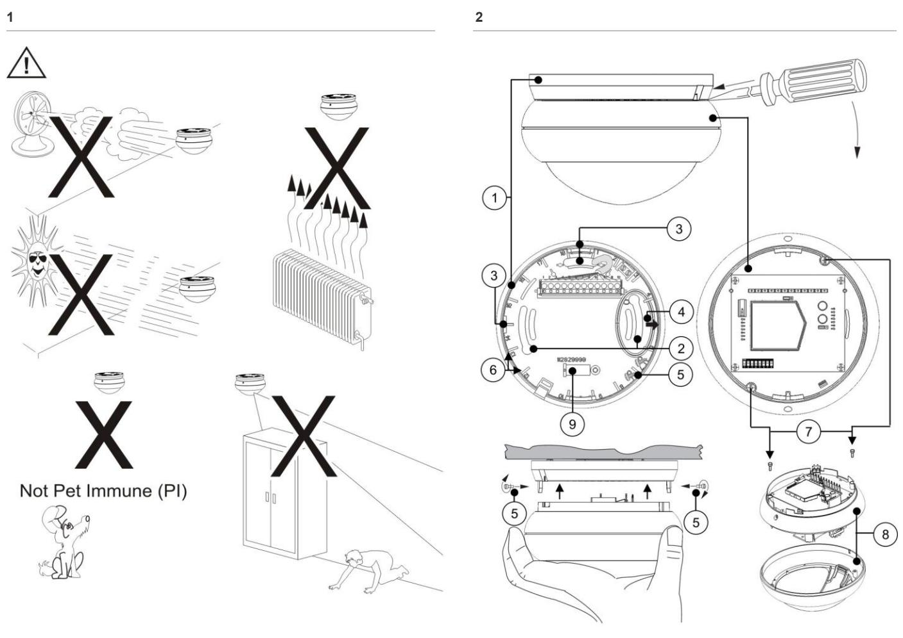
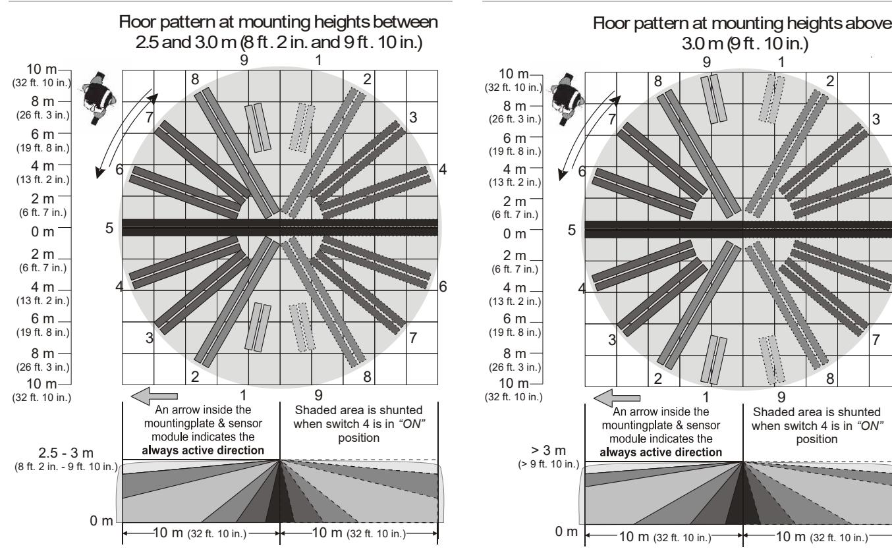
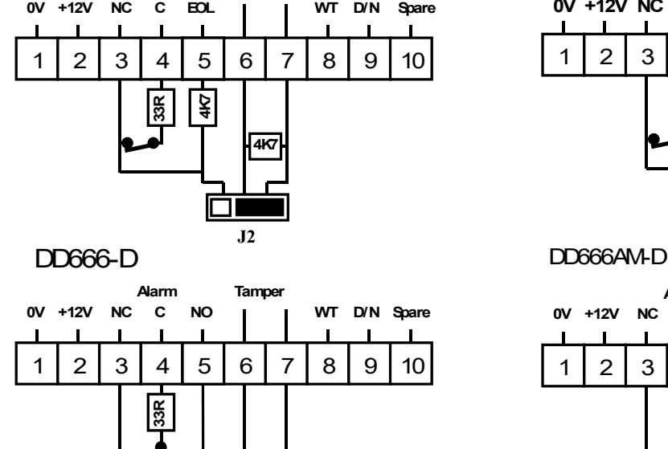
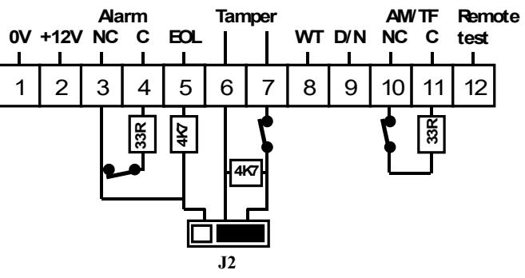
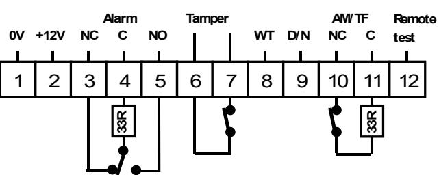
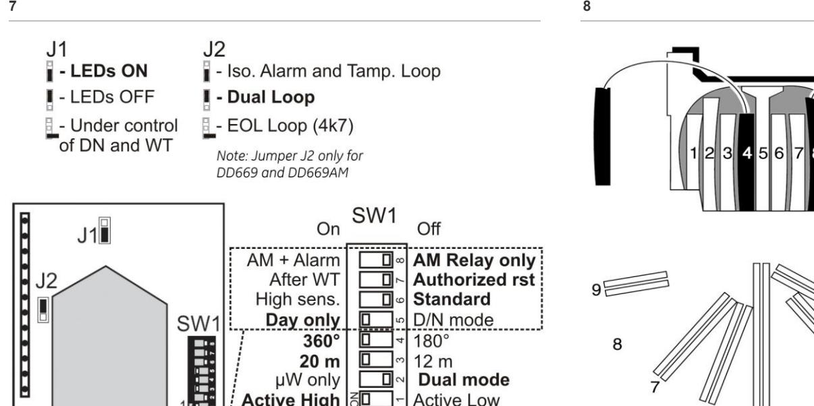
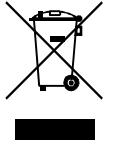
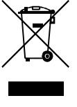
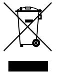
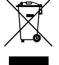

# DD66X Series Dual Detector Installation Sheet

#### **EN DA DE ES FI FR IT NL NO PL PT SV**

**3**

**6**

**Alarm Tamper**

7

*"ON"*

6

5

4

3

2 / 36 P/N 146249999-5 • REV C • ISS 10APR13

## **EN: Installation Sheet**

### **Introduction**

The DD66X/AM family is made up of Dual/Dual-AM motion sensors. They have the patented Range Controlled Radar technology.

### **Installation guidelines**

The detector can be mounted to a ceiling. Use the following guidelines to determine the best location to install the detector:

- Mount the detector so the expected movement of an intruder is across the detection pattern (Figures 4 and 5).
- Mount the detector at a stable surface at a height between 2.5 m (8 ft. 2 in.) and 5.0 m (16 ft. 5 in.).
- Do not mount the detector within 0.5 m (1 ft. 8 in.) of metallic objects or within 1.5 m (4 ft. 11 in.) of fluorescent lights.
- Do not place objects in front of the detector that may prevent a clear line of sight (Figure 1).
- Mount detectors at least 6 m (19 ft. 8 in.) apart, and use the short-range setting to avoid interference.

The dual technology processing of this detector is very resistant to false alarm hazards. However, avoid potential causes of instability, such as:

PIR hazards (Figure 1):

- Direct sunlight on the detector
- Heat sources within the detector field of view
- Strong air draughts onto the detector
- Animals in the field of view
- Obscuring the detector field of view with large objects, such as furniture

#### Microwave hazards:

- Mounting surface susceptible to vibrations
- Metal surfaces reflecting microwave energy
- Water movement through plastic pipes

- Moving or vibrating objects like fans, heating or airconditioning ducts
We recommend that the detector is regularly walk tested and checked at the control panel.

#### **Installing the detector**

- 1. Lift off mounting plate (see Figure 2, item 1).
- 2. Fasten the mounting plate to the ceiling in the required position using mounting holes (see Figure 2, item 2). Specified mounting height: min. 2.5 m (8 ft. 2 in.), max. 5.0 m (16 ft. 5 in.). Specified screws: DIN 7996, 4 mm.
- 3. The detection pattern can be adjusted by up to ±15° (max 30°) by rotation of the mounting plate prior to tightening the screws.
- 4. Wire the detector (see Figures 2, 3, and 6).

Increase of mounting heights beyond the specified 2.5 to 5.0 m (8 ft. 2 in. to 16 ft. 5 in.) will reduce sensitivity. Range varies from 12 to 14 meter (39 ft. 4 in. to 45 ft. 11 in.) in short range and 20 to 22 meter (65 ft. 7 in. to 72 ft. 2 in.) in long range depending on the mounting height.

**Note:** The arrow (Figure 2, item 4) indicates the centre curtain direction and the active direction when switch 4 is OFF.

- 5. Select the desired jumper and DIP switch settings (see Figure 7). See section "Setting the detector" on page 4 for more information.
- 6. To screw the sensor module to the mounting plate, use the screws that are placed for transport in the mounting plate (see Figure 2, item 5).

The curtain directions 1 through 9 clockwise, are indicated on the mounting plate (see Figure 2, item 6). Curtain number 5 is the centre curtain.

#### **Selecting the coverage patterns**

For access to the mirror undo screws (Figure 2, item 7) and open the sensor module (Figure 2, item 8). Mask the appropriate mirror curtains with the adhesive labels provided and reassemble the sensor module (see Figure 8 for example).

### **Setting the detector**

See Figure 7 for the jumper locations in the detector.

#### **J1: Setting LEDs**

On: Enables both LEDs on the detector at all times (factory default).

Off: Disables both LEDs on the detector at all times.

**Removed:** Puts both LEDs under the control of the Walk Test and Day/Night input. This activates the memory feature of the detector. When the detector is Disarmed and the input Walk Test is disabled, the microwave section is turned off for DD66X or in Anti Masking detection for DD66XAM. In this configuration the detector operates as a PIR only.

#### **J2: Dual loop setting**

This sets the alarm and tamper relays. It allows you to connect the detector to any control panel (see Figures 3 and 6).

#### **SW 1: Polarity setting of the control voltage (CV)**

On: Active High. Provides the standard UTC Fire & Security logic with "Active High" logic to enable Walk Test (WT), Day/Night (D/N), and Remote Test inputs (factory default).

Off: Active Low. Provides "Active Low" logic to enable Walk Test (WT), Day/Night (D/N) and Remote Test inputs.

#### **SW 2: µW only / Dual mode**

On: µW only mode. Consequently the PIR circuitry is switched off and the detector will only signal alarms caused by the microwave circuitry.

Off: Dual mode. In dual mode the detector signals an alarm when both technologies (microwave and PIR) have identified a target moving in the protected area (factory default).

#### **SW 3: Detector range**

The microwave can be selected between 20 ± 0.5 m, and 12 ± 0.5 m (65 ft. 7 in. ± 1 ft. 8 in., and 39 ft. 4 in. ± 1 ft. 8 in.).

**Note:** Only the microwave range will be reduced, not the PIR section.

#### **SW 4: Detection coverage**

The detection coverage can be selected between 360 degrees for normal application, and 180 degrees for special applications.

**Note:** Only the coverage of the PIR will be adjusted.

**SW 5 (AM detectors only): When to signal AM (antimasking) or TF (technical fault) output** 

**Note:** Switch 5 has an effect only when J1 (Setting LED) is removed.

On: Day mode only. Signals AM or TF only when the system is in Day mode (factory default).

Off: Day/Night mode. Always signals AM or TF during Day and Night mode.

#### **SW 6 (AM detectors only): AM sensitivity**

On: High. Selects High level of AM sensitivity (EN 50131).

Off: Standard. Selects Standard level of AM sensitivity (factory default).

Advised minimum mounting height for High AM sensitivity is 3 m (9 ft. 10 in.).

**SW 7 (AM detectors only): Resetting the AM/TF output** 

**Note:** Switch 7 has an effect only when J1 (Setting LED) is removed.

The system will only reset an AM alarm if it has ensured that the cause of the AM alarm has been removed. If the AM circuitry cannot return to its original reference levels, then either the detector is still masked or possibly has been damaged. The owner should then visually check that the detector is still fully functional.

On: After walktest. After a 40-second inhibit period, resets the AM or TF status when a (dual) motion alarm is generated.

Off: Authorized reset. Resets the AM or TF status after a (dual) motion alarm when the system is in Day and Walk Test status. The yellow LED will turn off and the system is reset (factory default).

#### **SW 8 (AM detectors only): Signalling AM or TF output**

On: AM + alarm relay. Signals AM on both the AM and Alarm relays. Signals TF on the AM relay only (EN 50131).

Off: AM relay only. Signals AM and TF on the AM relay (factory default).

### **Remote / self test (AM detectors only)**

**Remote test:** This test allows the DD66XAM to be tested from the control panel. Use terminal 12 to activate the remote test. The DD66XAM will activate the Alarm relay if the test result is positive and the AM relay if the test result is negative.

**Self test:** The DD66XAM monitors the PIR and microwave circuits every 6 hours. A defect is reported as a technical fault. After a successful (dual) motion alarm the time interval between every self-test will be extended by 6 hours.

### **Walk testing the detector**

The DD66X series provides a walk test mode for testing the detectors operation and coverage pattern if the detector is set to LED's disabled. To walk test the detector, remove the supply voltage and apply it back on. The walk test mode can be started once the startup sequence has completely finished (LED flashes for 45 or 60 seconds). The unit stays in walk test mode for 30 minutes. The detector returns to normal operating mode after the walk test mode times out.

### **Green mode (AM detectors only)**

The detector can be programmed in several ways to minimize the human and animal exposure to microwave radiation, although the detector is already sending microwave signal on a very low power level.

The detector will switch the microwave section off for 3 minutes after a dual alarm. The detector is in PIR only during this timer.

| Settings option 1 | J1: Off SW 2: Off     |                        |
|-------------------|--------------------------|------------------------|
| Settings option 2 | J1: Removed SW 2: Off | System in Armed status |

The microwave section is switched off and for DD66XAM is switched to AM section. The detector operates in PIR mode only.

| Setting | J1: Removed | System in Disarmed status |
|---------|-------------|---------------------------|
|         |             | System Walk Test Disabled |
|         | SW 2: Off   |                           |

### **LED indication**

| DD66X Dual                         | Red [1] |           | [1] Green | [1] Yellow |            | Alarm relay            | To reset        |                             |
|---------------------------------------|---------|-----------|--------------|---------------|------------|------------------------|-----------------|-----------------------------|
| Start up                              |         |           |              |               |            | Closed                 |                 | Automatically after 45 s    |
| Low voltage                           |         |           |              |               |            | Open (Alarm)        |                 | Apply correct voltage       |
| PIR intruder alarm                 |         |           |              |               |            |                        |                 | Automatically after 3 s     |
| Microwave intruder alarm           |         |           |              |               |            |                        |                 | Automatically after 3 s     |
| (Dual) motion intruder alarm       |         |           |              |               |            | Open (Alarm)        |                 | Automatically after 3 s     |
| Latched PIR (Memory)               |         |           |              |               |            |                        |                 | Switch to Night mode        |
| DD66XAM Dual / AM                  | Red [1] | Green [1] | Yellow [1]   |               | Yellow LED | Alarm relay            | AM relay        | To reset                    |
| Start up                              |         |           |              |               |            | Closed                 | Closed          | Automatically after 60 s |
| Low voltage                           |         |           |              |               |            | Open (Alarm)        | Open (Alarm) | Apply correct voltage    |
| PIR intruder alarm                 |         |           |              |               |            |                        |                 | Automatically after 3 s  |
| Microwave intruder alarm        |         |           |              |               |            |                        |                 | Automatically after 3 s  |
| (Dual) motion intruder alarm |         |           |              |               |            | Open (Alarm)        |                 | Automatically after 3 s  |
| Latched PIR (Memory)               |         |           |              |               |            |                        |                 | Switch to Night mode     |
| AM alarm                              |         |           |              |               |            | Open (Alarm) [2] | Open (Alarm) | See DIP switch 7         |
| Technical fault                    |         |           |              |               |            |                        | Open (Alarm) | Pass walk test              |
| Continuously on                       |         |           |              |               |            | Normal blinking (1 Hz) |                 |                             |

[1] Tri-colour LED.

[2] Depends on the setting of the DIP switch SW8.

### **Specifications**

|                                | DD669                                                                             | DD666-D | DD669AM   | DD666AM-D |  |
|--------------------------------|-----------------------------------------------------------------------------------|---------|-----------|-----------|--|
| Detector                       | Dual                                                                              |         | Dual + AM |           |  |
| Range diameter (selectable) | 20 ±0.5 m (65 ft. 7 in. ±1 ft. 7 in.) or 12 ±0.5 m (39 ft. 4 in. ±1 ft. 7 in.) |         |           |           |  |
| Viewing angle (selectable)  | 360 degrees or 180 degrees                                                        |         |           |           |  |
| Optical                        | 2 x 9 curtains                                                                    |         |           |           |  |
| Microwave frequency         | 5.8 GHz                                                                           |         |           |           |  |
| Max microwave output at 1 m | 0.003 μW/cm²                                                                      |         |           |           |  |
| Memory                         | Yes                                                                               |         |           |           |  |

|                                             | DD669                                                  | DD666-D                                                | DD669AM                                             | DD666AM-D                                        |
|---------------------------------------------|--------------------------------------------------------|--------------------------------------------------------|-----------------------------------------------------|--------------------------------------------------|
| Input power                                 | 9 to 15 VDC (12 V nominal)                             |                                                        |                                                     |                                                  |
| Peak-to-peak ripple                         | 2 V (at 12 VDC)                                        |                                                        |                                                     |                                                  |
| Detector start-up time                   |                                                        | 45 s                                                   | 60 s                                                |                                                  |
| Normal current consumption               |                                                        | 12 mA                                                  | 16 mA                                               |                                                  |
| Current consumption in Alarm             |                                                        | 10 mA                                                  | 20 mA                                               |                                                  |
| Maximum current consumption              |                                                        | 15 mA                                                  | 25 mA                                               |                                                  |
| Mounting height                             | 2.5 to 5.0 m (8 ft. 2 in. to 16 ft. 5 in.)             |                                                        |                                                     |                                                  |
| Target speed range                          | 0.3 to 3.0 m/s (1 ft./s to 9 ft. 10 in./s) | 0.2 to 3.0 m/s (8 in./s to 9 ft. 10 in./s) | 0.2 to 3.0 m/s (8 in./s to 9 ft. 10 in./s) | 0.2 to 3.0 m/s (8 in./s to 9 ft. 10 in./s) |
| Alarm (NC) / Tamper relay characteristic | 80 mA 30 VDC Form A                              | 80 mA 30 VDC Form C                              | 80 mA 30 VDC Form A                           | 80 mA 30 VDC Form C                        |
| Pry off tamper                              |                                                        | Optional                                               | On board (Yes)                                      |                                                  |
| AM relay characteristic                  | N/A                                                    |                                                        | 80 mA at 30 VDC max.                                |                                                  |
| Alarm time                                  | 3 s                                                    |                                                        |                                                     |                                                  |
| Operating temperature                    | −10 to +55°C (14 to 130°F)                             |                                                        |                                                     |                                                  |
| Dimensions ( x H)                          |  138 x 92 mm ( 5.43 in. x 3.62 in.)                  |                                                        |                                                     |                                                  |
| Relative humidity                           | max. 95%                                               |                                                        |                                                     |                                                  |
| Weight                                      | 255 g (9 oz.)                                          |                                                        |                                                     |                                                  |
| IP/IK rating                                | IP30 IK02                                              |                                                        |                                                     |                                                  |

### **Regulatory information**

| Manufacturer  | UTC Fire & Security Americas Corporation, Inc. 1275 Red Fox Rd., Arden Hills, MN 55112-6943, USA                                                                                                                                                                                                                                                                        |
|---------------|----------------------------------------------------------------------------------------------------------------------------------------------------------------------------------------------------------------------------------------------------------------------------------------------------------------------------------------------------------------------------|
|               | Authorized EU manufacturing representative: UTC Fire & Security B.V. Kelvinstraat 7, 6003 DH Weert, Netherlands                                                                                                                                                                                                                                                      |
| Certification |                                                                                                                                                                                                                                                                                                                                                                            |
|               | 2002/96/EC (WEEE directive): Products marked with this symbol cannot be disposed of as unsorted municipal waste in the European Union. For proper recycling, return this product to your local supplier upon the purchase of equivalent new equipment, or dispose of it at designated collection points. For more information see: www.recyclethis.info. |

### **Contact information**

www.utcfireandsecurity.com or www.interlogix.com

For customer support, see www.utcfssecurityproducts.eu

## **DA: Installationsvejledning**

### **Introduktion**

DD66X/AM-serien består af µW + PIR/(µW + PIR-AMrumdetektorer. De indeholder den patenterede Range Controlled Radar-teknologi (RCR).

### **Installationsvejledning**

Detektoren kan monteres på et loft. Brug følgende retningslinjer for at bestemme, hvor det er bedst at placere detektoren:

- Monter detektoren, så den forventede bevægelse fra en indbrudstyv går tværs igennem dens gardiner (figur 4 og 5).
- Monter detektoren på en stabil overflade ved en højde på mellem 2,5 m og 5,0 m.
- Monter ikke detektoren inden for en afstand af 0,5 m fra metalgenstande eller inden for en afstand af 1,5 m fra lysstofarmaturer.
- Placer ikke genstande foran detektoren, der kan forhindre en tydelig synslinje (figur 1).
- Monter detektoren mindst 6 m væk, og brug den korte områdeindstilling for at undgå interferens.

Den dobbelte teknologibehandling med denne detektor er meget modstandsdygtig over for falske alarmer. Ikke desto mindre skal du undgå mulige årsager til falske alarmer, f.eks.:

#### PIR-risici (figur 1)

- Direkte sollys på detektoren
- Varmekilder inden for synsvidde
- Kraftig træk på detektoren
- Store dyr inden for synsvidden
- Afdækning af detektorens detekteringsfelt med store genstande, såsom møbler

#### Mikrobølgerisici

- Monteringsoverflade, der er modtagelig over for vibrationer
- Metaloverflader, der reflekterer mikrobølgeenergi
- Vandbevægelse gennem plastikrør
- Bevægelige eller vibrerende genstande, som f.eks. kanaler i blæsere eller airconditionanlæg

UTC Fire & Security anbefaler, at detektoren gangtestes med jævne mellemrum og kontrolleres ved centralenheden

#### **Installation af detektoren**

- 1. Afmonter monteringssoklen fra detektoren (se figur 2, punkt 1).
- 2. Fastgør monteringssoklen til loftet i den ønskede placering ved hjælp af hullerne (se figur 2, punkt 2). Angivet monteringshøjde: min. 2,5 m — maks. 5,0 m. Anbefalet skruer: DIN 7996, 4 mm.
- 3. Detektormønstret (gardiner) kan justeres med op til ±15° (maks. 30°) ved at dreje monteringssoklen, før skruerne strammes.
- 4. Forbind ledningerne til klemrækken i monteringssoklen (se figur 2, 3 og 6).

Øgning af monteringshøjderne ud over de angivne 2,5 til 5,0 m vil reducere følsomheden. Rækkevidden varierer fra 12 til 14 meter på korte afstande og 20 til 22 meter på lange afstande, afhængigt af monteringshøjden.

**Note:** Pilen (figur 2, punkt 4) angiver retningen på det midterste gardin og den aktive retning, når switch 4 er "OFF".

- 5. Vælg de ønskede indstillinger for jumper og DIP-switch (se figur 7). Se afsnittet "Indstilling af detektoren" angående yderligere oplysninger.
- 6. For at montere / fastgøre detektormodulet til monteringssoklen skal du bruge de skruer, der er anbragt i soklen i forbindelse med transport (se figur 2, punkt 5).

Gardinretningerne 1 — 9 med uret er angivet på monteringssokken (se figur 2, punkt 6) (Gardin nr. 5 er det midterste gardin).

#### **Valg af dækningsmønstrene**

Hvis du vil have adgang til spejlet, skal du fjerne skruerne (figur 2, punkt 7) og åbne detektormodulet (figur 2, punkt 8). Marker de relevante spejlgardiner med de selvklæbende etiketter, der fulgte med, og saml detektormodulet igen. F.eks: se figur 8 angående spejlgardinets dækningsmønster, der svarer til at gardin 4 og 8 er afmasket.

### **Indstilling af detektoren**

Se figur 7 angående jumper-indstilling i detektoren.

- **J1: LED indstilling**
TIL: Begge LED'er er aktive (Fabriksindstilling).

FRA: Ingen LED'er er aktive.

**Fjernet:** Sætter begge LED'er under kontrol af Gangtest og Dag/Nat styring. Dette aktiverer alarm hukommelses funktionen for detektoren. Når detektoren er frakoblet og "input" Gangtest er deaktiveret, vil mikrobølgesektionen være slukket i DD66X, og DD66XX-AM skifter til en ultralav mikrobølge transmission. I denne konfiguration vil begge detektore kun virke som PIR detektorer.

#### **J2: DUAL LOOP indstilling**

Dette vælger alarm og tamper relæ, således at enhver central kan tilsluttes detektoren (se figur 3 og 6).

#### **SW 1: Polaritetsindstilling for kontrolspændingen (CV)**

TIL: Aktiv høj. Giver standard UTC Fire & Security logik med "Aktiv høj" logik for at aktivere Gangtest (WT), Dag/Nat (D/N) og fjerntest indgang (fabriksindstilling).

FRA: Aktiv lav. Giver "Aktiv lav" logik for at aktivere Gangtest (WT), Dag/Nat (D/N) og fjerntest indgang.

#### **SW 2: Kun µW / µW + PIR**

TIL: Kun µW-tilstand. Her er PIR-elektronikken slået fra, og detektoren signalerer kun alarm, der er forårsaget af mikrobølgedelen.

FRA: µW + PIR. I µW + PIR signalerer detektoren en alarm, når begge teknologier (mikrobølge og PIR) har identificeret en målbevægelse i det beskyttede område (Fabriksindstilling).

#### **SW 3: Rækkevidde**

Mikrobølgen kan vælges mellem 20 ±0,5 m og 12 ±0,5 m.

**Note:** Kun mikrobølgeintervallet reduceres, ikke PIR-afsnittet.

#### **SW 4: Detekteringsdækning**

Detekteringsdækningen kan vælges mellem 360 grader til normalt anvendelse og 180 grader til specielle anvendelser.

#### **Note:** Kun dækningen af PIR justeres.

**SW 5 (kun for AM-detektorer): Når udgang signalerer AM (antimaskning) eller TF (teknisk fejl)** 

**Note:** DIP-switch 5 har kun effekt når J1 (LED indstilling) er fjernet.

TIL: Kun dag-tilstand (Day mode). Signalerer kun AM eller TF, når systemet er i Dag-tilstand. EN 50131-2-4 overensstemmelse (Fabriksindstilling).

FRA: Dag/nat-tilstand (D/N mode). Signalerer altid AM eller TF under Dag/Nat-tilstand.

**SW 6 (kun for AM-detektorer): AM-følsomhed**

TIL: Høj. Vælg højt niveau for AM følsomhed (EN 50131).

FRA: Standard. Vælg standard niveau for AM følsomhed (Fabriksindstilling)

Anbefalet minimum monteringshøjde for høj AM følsomhed er 3 meter.

**SW 7 (kun for AM-detektorer): Afstilling af AM/TF-udgang** 

**Note:** DIP-switch 7 har kun effekt når J1 (LED indstilling) er fjernet.

Systemet afstiller kun en AM-alarm, hvis man har sørget for, at årsagen til AM-alarmen er fjernet. Hvis AM-strømkredsen ikke kan vende tilbage til de oprindelige referenceniveauer, er enten detektoren fortsat i AM-alarm eller muligvis blevet beskadiget. Ejeren bør visuelt kontrollere, at detektoren fortsat er fuldt funktionel.

TIL: Efter gangtest. Efter 40 sekunders spærret periode, afstilles AM eller TF status når en (dual) alarm bliver aktiveret.

FRA: Autoriseret nulstil. Afstiller AM- eller TF-status efter en (µW + PIR) rumalarm, når systemet er i Dag- og gangtest tilstand. Den gule LED slukker, og systemet afstilles (fabriksindstilling).

**SW 8 (kun for AM-detektorer): Signalerer AM- eller TFudgang** 

**TIL:** AM + alarmrelæ. Signalerer AM på både AM- og alarmrelæet. Signalerer kun TF på AM-relæet (EN 50131).

**FRA:** Kun AM-relæ. Signalerer AM og TF på AM-relæet (fabriksindstilling).

### **Fjern-/selvtest (kun for AM-detektorer)**

**Fjerntest:** Med denne test er det muligt at teste DD66XAM fra centralenheden. Brug terminal 12 for at aktivere fjerntesten. DD66XAM aktiverer alarmrelæet, hvis testresultatet er positivt og AM-relæet, hvis testresultatet er negativt.

**Selvtest:** DD66XAM overvåger PIR- og mikrobølgekredsløbet hver 6. time. En defekt rapporteres som en teknisk fejl. Efter en vellykket (µW + PIR) rumalarm vil tidsintervallet mellem hver selvtest udvides med 6 timer.

### **Gangtest af detektoren**

DD66X-serien har en gangtest-tilstand for test af detektorernes handling og dækningsmønster, hvis detektoren jumper (J1) er indstillet til "LED's OFF" (deaktiveret). Fjern strømforsyningen, og tilslut den igen for at gangteste detektoren. Gangtesten kan begynde, når opstartsekvensen er helt afsluttet (LED blinker i 45 eller 60 sekunder). Enheden forbliver i gangtest-tilstand i 30 minutter. Detektoren vender tilbage til normal driftstilstand, efter at gangtest tiden er udløbet.

### **GREEN tilstand (kun for AM-detektorer)**

Detektoren kan blive programmeret på forskellige måder for at begrænse mikrobølgestrålingen på mennesker og dyr, selvom detektorens mikrobølge transmission er på et meget lavt niveau.

Detektoren vil afbryde mikrobølge sektionen i 3 minutter efter en dual-alarm. Detektoren er efterfølgende kun i PIR mode indtil udløb af tiden (3 min.)

| Opsætning 1 | J1: FRA SW 2: FRA     |                               |
|-------------|--------------------------|-------------------------------|
| Opsætning 2 | J1: Fjernet SW 2: FRA | Systemet i tilkoblet tilstand |

Mikrobølge sektionen er afbrudt og for DD66XX-AM skifter denne til en ultralav mikrobølge transmission. I denne konfiguration vil begge detektorer kun virke som PIR detektorer.

| Opsætning | J1: Fjernet | System i frakoblet tilstand |
|-----------|-------------|-----------------------------|
|           |             | System Walk test frakoblet  |
|           | SW 2: FRA   |                             |

#### **LED-angivelse**

| DD66X                              | Rød [1] |             | [1] Grøn | [1] Gul |           | Alarmrelæ       |         | Nulstille       |                                 |
|------------------------------------|---------|-------------|-------------|------------|-----------|-----------------|---------|-----------------|---------------------------------|
| Opstart                            |         |             |             |            |           | Lukket          |         |                 | Automatisk efter 45 sekunder |
| Lav spænding                       |         |             |             |            |           | Åben (alarm) |         | spænding        | Anvender korrekt                |
| PIR indbrudsalarm               |         |             |             |            |           |                 |         | 3 sekunder      | Automatisk efter                |
| Mikrobølge indbrudsalarm        |         |             |             |            |           |                 |         | 3 sekunder      | Automatisk efter                |
| (µW + PIR) rum indbrudsalarm |         |             |             |            |           | Åben (alarm) |         | 3 sekunder      | Automatisk efter                |
| Låst PIR (hukommelse)           |         |             |             |            |           |                 |         |                 | Skift til Nat-tilstand          |
| DD66XAM                            | Rød [1] | [1] Grøn | [1] Gul  | Gul LED    | Alarmrelæ |                 | AM-relæ |                 | Nulstille                       |
| Opstart                            |         |             |             |            |           | Lukket          |         | Lukket          | Automatisk efter 60 sekunder |
| Lav spænding                       |         |             |             |            |           | Åben (alarm) |         | Åben (alarm) | Anvender korrekt spænding    |
| PIR indbrudsalarm               |         |             |             |            |           |                 |         |                 | Automatisk efter 3 sekunder  |
| Mikrobølge indbrudsalarm        |         |             |             |            |           |                 |         |                 | Automatisk efter 3 sekunder  |
| (µW + PIR) rum indbrudsalarm |         |             |             |            |           | Åben (alarm) |         |                 | Automatisk efter 3 sekunder  |
| Låst PIR (hukommelse)           |         |             |             |            |           |                 |         |                 | Skift til Nat tilstand       |

| DD66XAM      | Rød [1] | [1] Grøn | [1] Gul | Gul LED | Alarmrelæ              | AM-relæ         | Nulstille              |
|--------------|---------|-------------|------------|---------|------------------------|-----------------|------------------------|
| AM-alarm     |         |             |            |         | Åben (alarm) [2] | Åben (alarm) | Se DIP-switch 7        |
| Teknisk fejl |         |             |            |         |                        | Åben (alarm) | Gennemført gangtest |
|              |         |             |            |         |                        |                 |                        |

Konstant tændt Blinker normalt (1 Hz)

[1] Trefarvet LED.

[2] Afhænger af indstillingen af DIP-switch SW8.

### **Specifikationer**

|                                          | DD669                           | DD666-D                   |                           | DD669AM DD666AM-D         |  |  |  |  |
|------------------------------------------|---------------------------------|---------------------------|---------------------------|---------------------------|--|--|--|--|
| Detektor                                 |                                 | µW + PIR                  | µW + PIR + AM             |                           |  |  |  |  |
| Intervaldiameter (kan vælges)         | 20 ±0,5 m eller 12 ±0,5 m       |                           |                           |                           |  |  |  |  |
| Visningsvinkel (kan vælges)           | 360 grader eller 180 grader     |                           |                           |                           |  |  |  |  |
| Optisk                                   | 2 x 9 gardiner                  |                           |                           |                           |  |  |  |  |
| Mikrobølgefrekvens                       | 5,8 GHz                         |                           |                           |                           |  |  |  |  |
| Maks. mikrobølgeudgang ved 1 m     | 0,003 μW /cm²                   |                           |                           |                           |  |  |  |  |
| Hukommelse                               |                                 |                           | Ja                        |                           |  |  |  |  |
| Indgangseffekt                           | 9 VDC til 15 VDC (12 V nominel) |                           |                           |                           |  |  |  |  |
| Peak-to-peak ripple                      | 2 V (ved 12 VDC)                |                           |                           |                           |  |  |  |  |
| Detektoropstartstid                      |                                 | 45 sekunder               | 60 sekunder               |                           |  |  |  |  |
| Normalt strømforbrug                  |                                 | 12 mA                     | 16 mA                     |                           |  |  |  |  |
| Aktuelt strømforbrug ved alarm        |                                 | 10 mA                     | 20 mA                     |                           |  |  |  |  |
| Maksimalt strømforbrug                |                                 | 15 mA                     | 25 mA                     |                           |  |  |  |  |
| Monteringshøjde                          | min. 2,5 m, maks. 5,0 m         |                           |                           |                           |  |  |  |  |
| Detekterings hastighed                | 0.3 til 3.0 m/s              | 0.2 til 3.0 m/s        | 0.2 til 3.0 m/s        | 0.2 til 3.0 m/s        |  |  |  |  |
| Alarm (NC) / Sabotagerelæ egenskab | 80 mA 30 VDC Form A       | 80 mA 30 VDC Form C | 80 mA 30 VDC Form A | 80 mA 30 VDC Form C |  |  |  |  |
| Vægsabotagekonta kt                   |                                 | Valgfri                   | Indbygget (Ja)            |                           |  |  |  |  |
| AM-relæ-egenskab                         |                                 | —                         | 80 mA ved maks. 30 V      |                           |  |  |  |  |
| Alarmtid                                 | 3 sekunder                      |                           |                           |                           |  |  |  |  |
| Driftstemperatur                         | −10 til +55°C                   |                           |                           |                           |  |  |  |  |
| Mål ( x H)                              |  138 x 92 mm                   |                           |                           |                           |  |  |  |  |
| Relativ luftfugtighed                    | Maks. 95 %                      |                           |                           |                           |  |  |  |  |
| Vægt                                     | 255 g                           |                           |                           |                           |  |  |  |  |
| IP-/IK-klasse                            | IP30 IK02                       |                           |                           |                           |  |  |  |  |

### **Lovgivningsmæssig information**

| Producent | UTC Fire & Security Americas Corporation, Inc.    |
|-----------|---------------------------------------------------|
|           | 1275 Red Fox Rd., Arden Hills, MN 55112-6943, USA |
|           | Europæisk repræsentant for producent:             |
|           | UTC Fire & Security B.V.                          |
|           | Kelvinstraat 7, 6003 DH Weert, Holland.           |

2002/96/EC (WEEE): Bortskaffelse af elektrisk og elektronisk udstyr har til formål at minimere den indvirkning, som affald af elektrisk og elektronisk udstyr har på miljøet og mennesker. I henhold til direktivet må elektrisk udstyr, der er mærket med dette symbol, ikke bortskaffes sammen med almindeligt husholdningsaffald i Europa. Europæiske brugere af elektrisk udstyr skal aflevere kasserede produkter til genbrug. Yderligere oplysninger findes på webstedet www.recyclethis.info.

### **Kontaktinformation**

www.utcfireandsecurity.com eller www.interlogix.com For kundesupport se www.utcfssecurityproducts.dk

# **DE: Installationsanweisungen**

### **Einführung**

Die DD66X/AM-Produktfamilie umfasst Dual-/Dual-AM-Bewegungsmelder. Sie sind mit der patentierten Range Controlled Radar-Technologie (Entfernungsgesteuerter Radar) ausgestattet.

### **Installationsanleitungen**

Der Melder ist für die Deckenmontage konzipiert. Die folgenden Richtlinien helfen Ihnen bei der Auswahl einer geeigneten Montageposition für den Melder.

- Montieren Sie den Melder so, dass die Bewegungen eines Eindringlings quer zum Erfassungsbereich stattfinden müssen (Abb. 4 und 5).
- Montieren Sie den Melder auf einer stabilen Fläche in einer Höhe zwischen 2,5 m und 5,0 m.
- Montieren Sie den Melder nicht innerhalb eines Umkreises von 0,5 m um metallische Objekte oder innerhalb eines Umkreises von 1,5 m um fluoreszierende Beleuchtung.
- Stellen Sie keine Objekte vor den Melder, die den Erfassungsbereich beeinträchtigen könnten (Abb. 1).
- Montieren Sie mehrere Melder in einem Abstand von mindestens 6 m zueinander, und verwenden Sie die Einstellung für eine kurze Reichweite, um Störungen zu vermeiden.

Die Dualtechnologie dieses Melders dient zur Vermeidung falscher Alarmmeldungen. Dennoch sollten Sie potenzielle Fehlalarmfaktoren vermeiden, z. B.:

Risiken für PIR (Abb. 1)

- Direkte Sonneneinstrahlung auf den Melder
- Hitzequellen innerhalb des Erfassungsbereichs
- Starke Luftströmungen am Melder
- Tiere innerhalb des Erfassungsbereichs
- Verdecken des Erfassungsbereichs des Melders durch große Objekte, z. B Möbel

Risiken für Mikrowellen

- Vibrationsanfällige Montagefläche
- Metallische Oberflächen, die Mikrowellen reflektieren
- Durch Kunststoffleitungen fließendes Wasser
- Bewegte oder vibrierende Objekte wie Ventilatoren, Heizungs- oder Klimaanlagenausgänge

UTC Fire & Security empfiehlt, in regelmäßigen Abständen einen Gehtest durchzuführen und die Reaktion der Einbruchmeldezentrale zu überprüfen.

**Installation des Melders** 

- 1. Heben Sie die Montageplatte ab (siehe Abb. 2, Position 1).
- 2. Befestigen Sie die Montageplatte mithilfe von Montagebohrungen an einer geeigneten Position an der Decke (siehe Abb. 2, Position 2). Montagehöhe: min. 2,5 m — max. 5,0 m. Spezifizierte Schrauben: DIN 7996, 4 mm.
- 3. Der Erfassungsbereich kann um bis zu ± 15° (max 30°) verändert werden, indem Sie die Montageplatte vor dem Anziehen der Schrauben entsprechend drehen.
- 4. Verdrahten Sie den Melder (siehe Abb. 2, 3, 6).

Durch eine höhere Montagehöhe als die empfohlenen 2,5 bis 5,0 m verringert sich die Meldeempfindlichkeit. Die Erfassungsreichweite liegt je nach Montagehöhe zwischen 12 und 14 m bei kurzer Reichweite und zwischen 20 und 22 m bei langer Reichweite.

**Hinweis:** Der Pfeil (Abb. 2, Position 4) gibt die Mittelvorhang-Richtung und die aktive Richtung an, wenn sich Schalter 4 in der Position "OFF" befindet.

- 5. Wählen Sie die gewünschten Steckbrücken- und DIP-Schaltereinstellungen aus (siehe Abb. 7). Weitere Informationen hierzu finden Sie im Abschnitt "Einstellen des Melders".
- 6. Verwenden Sie zur Montage des Sensormoduls auf der Montageplatte die Schrauben, die sich beim Transport in der Montageplatte befinden (siehe Abb. 2, Position 5).

Auf der Montageplatte sind die Vorhangrichtungen 1–9 im Uhrzeigersinn angegeben (siehe Abb. 2, Position 6) (Vorhang Nr. 5 ist der Mittelvorhang).

#### **Auswählen der Erfassungsbereiche**

Der Spiegel ist zugänglich, indem Sie die Schrauben entfernen (Abbildung 2, Position 7) und das Sensormodul öffnen (Abbildung 2, Position 8). Maskieren Sie die entsprechenden Spiegelvorhänge mit den selbstklebenden Etiketten, und setzen Sie das Sensormodul wieder zusammen. Ein Beispiel: Abb. 8 zeigt den Vorhangerfassungsbereich für die maskierten Vorhänge 4 und 8.

### **Einstellen des Melders**

Abbildung 7 zeigt die Steckbrückenpositionen im Melder.

#### **J1: LED-Einstellung**

On: Permanente Freigabe beider Melder LED's (Werkseinstellung).

Off: Permanente Abschaltung beider Melder LED's.

**Abgezogen:** Beide Melder LED's werden durch die Ausgänge für Gehtest und Scharf/Unscharf der Zentrale gesteuert. Über den S/U Ausgang kann der Alarmspeicher des Melders aktiviert werden. Im unscharfen Zustand und abgeschalteter Gehtestfunktion wird die Mikrowellenkomponente des DD66x abgeschaltet und bei DD66XAM nur für die

Abdecküberwachung verwendet. In dieser Konfiguration funktioniert der Melder nur als passiver PIR-Melder.

#### **J2: Dual-MG Einstellung**

Diese Einstellung wirkt auf das Alarm-und Sabotagerelais und ermöglicht die Anschaltung des Melders an jede beliebige konventionelle Einbruchmeldezentrale (siehe Abb. 5 und 6).

#### **SW 1: Polaritätseinstellung der Steuerspannung (CV)**

EIN: Aktiv High: Auswahl der Standard UTC Fire & Security Logik mit "Aktiv High" Ansteuerung der Gehtestfunktion (WT); Alarmspeicher (D/N) und des Ferntesteingangs (Werkseinstellung)

AUS: Aktiv Low. Auswahl der "Activ Low" Ansteuerung der Eingänge Gehtest (WT), Alarmspeicher (D/N) und Ferntest.

#### **SW 2: Nur µW / Dualmodus**

**EIN:** nur µW-Modus. Der PIR-Schaltkreis ist ausgeschaltet, und der Melder aktiviert nur Alarme, die durch den Mikrowellenschaltkreis ausgelöst werden.

**AUS:** Dualmodus. Im Dualmodus aktiviert der Melder einen Alarm, wenn sowohl von der Mikrowellen- als auch von der PIR-Technologie ein sich bewegendes Objekt im Überwachungsbereich festgestellt wird (Werkseinstellung).

#### **SW 3: Reichweite des Melders**

Der Mikrowellenbereich kann zwischen 20 ±0,5 m und 12 ±0,5 m festgelegt werden.

**Hinweis:** Es wird ausschließlich der Mikrowellenbereich reduziert, nicht der PIR-Bereich.

#### **SW 4: Erfassungsbereich**

Der Erfassungsbereich kann auf einen Wert zwischen 360 Grad bei normalen Anwendungen und 180 Grad bei Sonderanwendungen festgelegt werden.

**Hinweis:** Es wird nur der Erfassungsbereich für PIR angepasst.

**SW 5 (nur für AM-Melder): Signalisierung von AM- (Abdeckung) oder TF-Ausgabe (Technische Fehler)** 

**Hinweis:** Schalter 5 ist nur wirksam, wenn die Steckbrücke J1 (LED-Einstellung) entfernt wurde.

EIN: Nur bei Unscharf: Signalisiert AM oder TF nur, wenn sich das System im Tagbetrieb (unscharf) befindet. Entspricht EN 50131-2-4 (Werkseinstellung).

AUS: Unscharf/Scharf-Betrieb: Meldet immer AM oder TF im Unscharf- und Scharf-Betrieb.

**SW 6 (nur für AM-Melder): AM-Empfindlichkeit** 

EIN: High. Auswahl der hohen AM-Empfindlichkeit (EN 50131).

AUS: Standard. Auswahl der Standart AM-Empfindlichkeit (Werkseinstellung).

Die empfohlene Mindestmontagehöhe für die hohe AM-Empfindlichkkeit beträgt 3 m (9 ft. 10 in.)

#### **SW 7 (nur für AM-Melder): Zurücksetzen des AM/TF-Ausgangs**

**Hinweis:** Schalter 7 ist nur wirksam, wenn die Steckbrücke J1 (LED-Einstellung) entfernt wurde.

Das System setzt einen AM-Alarm erst zurück, nachdem sichergestellt wurde, dass die Ursache des AM-Alarms behoben wurde. Wenn der AM-Schaltkreis nicht zu seiner ursprünglichen Referenzebene zurückkehren kann, ist der Melder entweder noch abgedeckt oder wurde möglicherweise beschädigt. Der Betreiber sollte dann überprüfen, ob der Melder noch voll funktionsfähig ist.

EIN: Nach Gehtest. Nach einer Sperrzeit von 40 Sekunden kann der AM oder TF-Zustand durch eine erfolgreiche Bewegungserkennung des Melders (Dual) zurückgesetzt werden.

AUS: Autorisiertes Zurücksetzen (Werkseinstellung). Setzt den AM- oder TF-Status nach einem (Dual-)Bewegungsalarm zurück, wenn sich das System im Unscharf- UND Gehtest-Modus befindet. Die gelbe LED erlischt, und das System wird zurückgesetzt.

**SW 8 (nur für AM-Melder): Signalisierung von AM- oder TF-Ausgabe** 

EIN: AM + Alarmrelais. Signalisiert AM (Abdecküberwachung) auf dem AM- und dem Alarmrelais. Signalisiert TF nur auf dem AM-Relais (EN 50131).

AUS: Nur AM-Relais. Signalisiert AM und TF auf dem AM-Relais (Werkseinstellung).

### **Fern-Selbsttest (nur für AM-Melder)**

**Fern-Test:** Mit diesem Test kann der DD66XAM über die Einbruchmeldezentrale geprüft werden. Verwenden Sie Anschluss 12, um den Fern-Test zu aktivieren. Der DD66XAM aktiviert das Alarmrelais, wenn das Testergebnis positiv ist. Bei einem negativen Testergebnis wird das AM-Relais aktiviert.

**Selbsttest:** Der DD66XAM überwacht die PIR- und Mikrowellenschaltkreise alle 6 Stunden. Ein Defekt wird als technischer Fehler gemeldet. Nach einem erfolgreichen (Dual- )Bewegungsalarm wird das Zeitintervall zwischen Selbsttests um 6 Stunden verlängert.

### **Durchführen eines Gehtests**

Die DD66X-Serie verfügt über einen Gehtestmodus zum Testen des Melderbetriebs und des Erfassungsbereichs, wenn die Steckbrücke J1 des Melders auf "LEDs deaktiviert" gesetzt ist. Um einen Gehtest für den Melder durchzuführen, schalten Sie die Versorgungsspannung aus und anschließend wieder ein. Der Gehtestmodus wird eingeschaltet, sobald die Startsequenz vollständig abgeschlossen ist (LED blinkt für 45 oder 60 Sekunden). Das Gerät bleibt für 30 Minuten im Gehtestmodus. Der Melder kehrt in seinen normalen Betriebszustand nach Ablauf der Gehtestmodus-Testzeit zurück.

### **GRÜNER Betrieb (nur für AM-Melder)**

Obwohl der Melder nur ein sehr schwaches Mikrowellensignal aussendet, kann der Melder auf verschiedene Weise so programmiert werden, dass Menschen und Tiere nur einer minimalen Mikrowellenstrahlung ausgesetzt werden.

Der Melder schaltet seine Mikrowellenkomponente für 3 Minuten nach einem Dual-Alarm ab. Während der Abschaltung wirkt der Melder nur als PIR-Melder.

| Einstellungsoption 1 | J1: Off SW 2: Off       |                            |
|----------------------|----------------------------|----------------------------|
| Einstellungsoption 2 | J1: Abgezogen SW 2: Off | System im scharfen Zustand |

Die Mikrowellenkomponente ist abgeschaltet und bei DD66XAM auf AM-Abdeckerkennung geschaltet. Der Melder wirkt hierbei nur als PIR-Melder.

System im unscharfen Zustand

| Einstellung | J1: Abgezogen |
|-------------|---------------|
|             |               |

System Gehtest abgeschaltet

SW 2: Off

### **LED-Anzeige**

| DD66X Dual                             |            |             | Rot [1]     | [1] Grün | [1] Gelb          | Alarmrelais      |                         | Zurück                         | setzen                            |  |
|-------------------------------------------|------------|-------------|-------------|-------------|----------------------|------------------|-------------------------|--------------------------------|-----------------------------------|--|
| Start                                     |            |             |             |             |                      | Geschl.          |                         | 45 s                           | Automatisch nach                  |  |
| Geringe Spannung                          |            |             |             |             |                      | Offen (Alarm) |                         | Korrekte Spannung verwenden |                                   |  |
| PIR-Einbruchalarm                         |            |             |             |             |                      |                  |                         | 3 s                            | Automatisch nach                  |  |
| Mikrowellen-Einbruch alarm             |            |             |             |             |                      |                  |                         | Automatisch nach 3 s        |                                   |  |
| (Dual)-Bewegungsein bruchalarm         |            |             |             |             | Offen (Alarm)     |                  | Automatisch nach 3 s |                                |                                   |  |
| Alarmspeicher PIR                         |            |             |             |             |                      |                  |                         |                                | Umschalten in Scharfbetrieb    |  |
| DD66XAM Dual / AM                      | [1] Rot | [1] Grün | [1] Gelb | Gelbe LED   | Alarm                | relais           | AM-Relais               |                                | Zurück setzen                  |  |
| Start                                     |            |             |             |             | Geschl.              |                  |                         | Geschl.                        | Automatisch nach 60 s          |  |
| Geringe Spannung                       |            |             |             |             | Offen (Alarm)     |                  | Offen                   | (Alarm)                        | Korrekte Spannung verwenden |  |
| PIR-Ein bruchalarm                     |            |             |             |             |                      |                  |                         |                                | Automatisch nach 3 s           |  |
| Mikrowellen Einbruch alarm          |            |             |             |             |                      |                  |                         |                                | Automatisch nach 3 s           |  |
| (Dual)- Bewe gungsein bruchalarm |            |             |             |             | Offen (Alarm)     |                  |                         |                                | Automatisch nach 3 s           |  |
| Alarm speicher PIR                  |            |             |             |             |                      |                  |                         |                                | Umschalten in Scharfbetrieb |  |
| AM-Alarm                                  |            |             |             |             | Offen [2] (Alarm) |                  | Offen                   | (Alarm)                        | Siehe DIP Schalter 7           |  |
| Technischer Fehler                     |            |             |             |             |                      |                  | Offen                   | (Alarm)                        | Erfolgreicher Gehtest          |  |
|                                           |            |             |             |             |                      |                  |                         |                                |                                   |  |

Leuchtet durchgehend Blinkt normal (1 Hz)

[1] Dreifarbige LED.

[2] Abhängig von der Einstellung des DIP-Schalters SW8.

### **Technische Daten**

|                                      | DD669                      | DD666-D | DD669AM   | DD666AM-D |  |
|--------------------------------------|----------------------------|---------|-----------|-----------|--|
| Melder                               | Dual                       |         | Dual + AM |           |  |
| Bereichsdurch messer (wählbar)    | 20 ± 0,5 m oder 12 ± 0,5 m |         |           |           |  |
| Sichtwinkel (wählbar)             | 360 Grad oder 180 Grad     |         |           |           |  |
| Optisch                              | 2 x 9 Vorhang              |         |           |           |  |
| Mikrowellen frequenz              | 5,8 GHz                    |         |           |           |  |
| Max. Mikrowellen leistung bei 1 m | 0,003 µW/cm²               |         |           |           |  |
| Alarmspeicher                        | Ja                         |         |           |           |  |

|                                                        | DD669                                                                                          | DD666-D                   | DD669AM                                       | DD666AM-D                                  |  |
|--------------------------------------------------------|------------------------------------------------------------------------------------------------|---------------------------|-----------------------------------------------|--------------------------------------------|--|
| Versorgungs spannung                                | 9 V bis 15 V Gleichspannung (12 V nominal)                                                     |                           |                                               |                                            |  |
| Spitze/Spitze Brummspannung                         | 2 V (bei 12 V Gleichspannung)                                                                  |                           |                                               |                                            |  |
| Melder einschaltzeit                                |                                                                                                | 45 s                      | 60 s                                          |                                            |  |
| Normale Stromaufnahme                               |                                                                                                | 12 mA                     | 16 mA                                         |                                            |  |
| Stromaufnahme bei Alarm                             |                                                                                                | 10 mA                     | 20 mA                                         |                                            |  |
| Maximale Stromaufnahme                              |                                                                                                | 15 mA                     | 25 mA                                         |                                            |  |
| Montagehöhe                                            |                                                                                                |                           | 2.5 bis 5.0 m                                 |                                            |  |
| Erfassungs geschwindigkeits bereich              | 0.3 bis 0.2 bis 3.0 m/s 3.0 m/s                                                       |                           | 0.2 bis 3.0 m/s                            | 0.2 bis 3.0 m/s                         |  |
| Alarmrelais (NC) / Sabotagerelais schaltleistung | 80 mA 80 mA 30 V 30 V Gleich Gleich spannung spannung Form A Form C |                           | 80 mA 30 V Gleich spannung Form A | 80 mA 30 V Gleich spannung Form C |  |
| Abreißkontakt                                          |                                                                                                | Optional                  | Intern (Ja)                                   |                                            |  |
| Kennwerte AM Relais                                 |                                                                                                | —                         | 80 mA bei 30 V Gleichspannung max.         |                                            |  |
| Alarmdauer                                             | 3 Sek.                                                                                         |                           |                                               |                                            |  |
| Betriebs temperatur                                 | −10 bis +55°C (14 bis 130°F)                                                                   |                           |                                               |                                            |  |
| Abmessungen ( x H)                                 |  138 x 92 mm                                                                                  |                           |                                               |                                            |  |
| Relative Luftfeuchtigkeit                           | Max. 95 %                                                                                      |                           |                                               |                                            |  |
| Gewicht                                                | 255 g                                                                                          |                           |                                               |                                            |  |
| IP/IK-Einstufung                                       | IP30 IK02                                                                                      |                           |                                               |                                            |  |
| VdS Umweltklasse                                    | —                                                                                              | Gepr. nach Klasse 2 | —                                             | Gepr. nach Klasse 2                  |  |
| VdS Anerkennung                                     | —                                                                                              | G110510                   | —                                             | G110511                                    |  |

#### **Hinweise für VdS-Installationen**

In VdS-Installationen muß ein VdS-Plombiersiegel über den Deckel und den Meldersockel geklebt werden. Die VdSPlombiersiegel können unter der Bestellnummer Aritech VS00 (50 Siegel pro Blatt) bestellt werden.

### **Rechtliche Hinweise**

| Hersteller     | UTC Fire & Security Americas Corporation, Inc. 1275 Red Fox Rd., Arden Hills, MN 55112-6943, USA                  |  |  |  |  |
|----------------|----------------------------------------------------------------------------------------------------------------------|--|--|--|--|
|                | Autorisierter EU-Herstellungsrepräsentant: UTC Fire & Security B.V. Kelvinstraat 7, 6003 DH Weert, Niederlande |  |  |  |  |
| Zertifizierung |                                                                                                                      |  |  |  |  |
| VdS            | DD666-D: G110510                                                                                                     |  |  |  |  |

DD666AM-D: G110511

2002/96/EC (WEEE): Produkte die mit diesem Symbol gekennzeichnet sind, dürfen nicht als unsortierter städtischer Abfall in der europäischen Union entsorgt werden. Für die korrekte Wiederverwertung bringen Sie dieses Produkt zu Ihrem lokalen Lieferanten nach dem Kauf der gleichwertigen neuen Ausrüstung zurück, oder entsorgen Sie das Produkt an den gekennzeichneten Sammelstellen. Weitere Informationen hierzu finden Sie auf der folgenden Website: www.recyclethis.info.

### **Kontaktinformationen**

www.utcfireandsecurity.com oder www.interlogix.com

Kontaktinformationen für den Kundendienst finden Sie unter www.utcfssecurityproducts.de

## **ES: Instrucciones de instalación**

### **Introducción**

La familia DD66X/AM se compone de sensores de movimiento Dual/Dual-AM. Cuentan con la tecnología patentada Range Controlled Radar.

### **Instrucciones para la instalación**

El detector puede montarse en el techo. Siga estas instrucciones para determinar la mejor ubicación para instalar el detector:

- Monte el detector de forma que el movimiento previsto de un intruso cruce el patrón de detección (figuras 4 y 5).
- Monte el detector en una superficie estable a una altura de entre 2,5 m (8' 2") y 5,0 m (16' 5").
- No debe montar el detector a menos de 0,5 m (1' 8") de objetos metálicos ni a menos de 1,5 m (4' 11") de luces fluorescentes.
- No coloque objetos delante del detector que puedan dificultar la visión del detector (figura 1).
- Monte los detectores a una distancia mínima de 6 m y utilice la configuración de corto alcance para evitar interferencias.

La tecnología de procesamiento dual de este detector es muy segura ante el riesgo de falsas alarmas. Sin embargo, debe evitar potenciales causas de falsas alarmas, como:

#### Riesgos de PIR (figura 1)

- Luz solar directa en el detector
- Fuentes de calor dentro del campo de visión
- Fuertes corrientes de aire sobre el detector
- Animales en el campo de visión
- Oscurecer el campo de visión del detector con objetos de gran tamaño, como por ejemplo mobiliario

Peligros de microondas

- Superficie de montaje sensible a las vibraciones
- Superficies metálicas que reflejen la energía de las microondas
- Movimiento de agua por tuberías de plástico
- Movimiento o vibración de objetos como ventiladores y conductos de calefacción o aire acondicionado

UTC Fire & Security recomienda que se realice una prueba de detección en el detector regularmente y que se compruebe en el panel de control.

### **Instalación del detector**

- 1. Levante la placa de montaje (consulte la figura 2, elemento 1).
- 2. Asegure la placa de montaje al techo en la posición adecuada mediante los orificios de montaje (consulte la figura 2, elemento 2). Altura de instalación especificada: mín. 2.5 m (8' 2") - max. 5.0 m (16' 5"). Tornillos especificados: DIN 7996, 4 mm.
- 3. El patrón de detección se puede ajustar hasta ±15° (máx. 30°) girando la placa de montaje antes de apretar los tornillos.
- 4. Conecte el detector (consulte la figuras 2, 3, 6).

El aumento de la altura de instalación por encima del valor especificado de 2,5 a 5 m reducirá la sensibilidad. El rango varía entre 12 y 14 metros a corto alcance y entre 20 y 22 metros a largo alcance, en función de la altura de instalación.

**Nota:** La flecha (figura 2, elemento 4) indica la dirección de la cortina central y la dirección activa cuando el interruptor 4 está en "OFF" (Desactivado).

- 5. Seleccione el puente que desee y la configuración de los conmutadores DIP (consulte la figura 7). Consulte la sección "Configuración del detector" para obtener más información.
- 6. Para montar el módulo del sensor en la placa de montaje, utilice los tornillos proporcionados para su transporte en la placa de montaje (consulte la figura 2, elemento 5).

Las direcciones de la cortina 1 a 9 en el sentido de las agujas del reloj se indican en la placa de montaje (consulte la figura 2, elemento 6) (La cortina nº 5 es la cortina central).

### **Selección de patrones de alcance**

Para acceder al espejo, afloje los tornillos (figura 2, elemento 7) y abra el módulo del sensor (figura 2, elemento 8). Oculte las cortinas de espejo elegidas con las etiquetas adhesivas proporcionadas y vuelva a montar el módulo del sensor. Por ejemplo: consulte la fig. 8 para ver el patrón de alcance de la cortina de espejo correspondiente a las cortinas ocultas 4 y 8.

### **Configuración del detector**

Vea la figura 7 para consultar las ubicaciones de los puentes en el detector.

**J1: Configuracion de los LEDs** 

On: Habilita ambos LEDs del detector (Por defecto).

Off: Deshabilita ambos LEDs del detector.

**Quitado:** Coloca ambos LEDs bajo el control de el Test de Paseo y la entrada Dia/Noche. Esto activa la opcion de memoria del detector. Cuando el detector es Desarmado y la entrada Walk Test es deshabilitado, se desactiva la seccion microondas en el DD66X y la detección antimasking en el DD66XAM. Con esta configuración el detector opera solo como un PIR.

### **J2: Configuraccion doble lazo**

Esto configure el funcionamiento de los reles de alarma y tamper. Esto permite conectar el detector a cualquier panel de control (figuras 5 y 6 ).

#### **SW 1: Configuración de la polaridad del Control de tensión (CV)**

On: Activo alto. Facilita la señal standar UTC Fire & Security con "Activo alto" para habilitar el Walk Test (WT), Dia/Noche (D/N), y entrada de Test remoto (Valores por defecto).

Off: Activo bajo. Facilita la señal "Activo bajo" para habilitar el Walk Test (WT), Dia/Noche (D/N), y entrada de Test remoto.

### **SW 2: Sólo µW / modo Dual**

On: Modo Sólo µW. En consecuencia, el circuito PIR se desconecta y el detector indicará únicamente las alarmas de señal provocadas por el circuito de microondas.

Off: Modo Dual. En el modo dual, el detector indica una alarma cuando las dos tecnologías (microondas y PIR) han identificado un movimiento en el área protegida (programación de fábrica).

### **SW 3: Alcance del detector**

Las microondas se pueden configurar con un rango de entre 20 ±0,5 m y 12 ±0,5 m.

**Nota:** Sólo se reducirá el rango de las microondas, no el de la sección PIR.

#### **SW 4: Alcance de detección**

El alcance de detección se puede establecer entre 360 grados, para una aplicación normal, y 180 grados para aplicaciones especiales.

**Nota:** Sólo se ajustará el alcance de la sección PIR.

**SW 5 (sólo a los detectores AM): Activacion de señales de salida AM (antimáscara) o TF (error técnico)**

**Nota:** El microinterruptor 5 funciona solo cuando J1 (Programación de LED) esta quitado.

On: Sólo modo Día. Activa señales AM o TF sólo cuando el sistema está en modo Día. Compatible con EN 50131-2-4 (programación por defecto).

Off: Modo Día/Noche. Siempre activa señales AM o TF durante el modo Día y Noche.

**SW 6 (sólo a los detectores AM): Sensibilidad AM**

On: Alto. Selecciona nivel Ato de sensibilidad Antimasking AM (EN 50131).

Off: Standar. Selecciona nivel standard de sensibilidad Antimasking AM (Valor por defecto).

Altura minima de montaje para nivel nivel alto de sensibilidad AM es 3 m.

**SW 7 (sólo a los detectores AM): Restablecimiento de la señal AM/TF**

**Nota:** El microinterruptor 7 funciona solo cuando J1 (Programación de LED) esta quitado.

El sistema sólo restablecerá una alarma AM tras comprobar la eliminación de la causa de la alarma AM. Si el circuito AM no puede volver a sus niveles de referencia originales, es posible que el detector aún esté oculto o que se encuentre dañado. En este caso, el propietario debe comprobar visualmente si el detector sigue funcionando.

On: Prueba de detección posterior. Despues de un periodo de inhibicion de 40 seg, resetea el estado AM ó TF, cuando se genera una alarma de movimiento (Dual).

Off: Restablecimiento autorizado. Restablece el estado AM o TF después de una alarma de movimiento (doble) cuando el sistema se encuentra en estado Día o Prueba de detección. El LED amarillo se apagará y el sistema se restablecerá (programación por defecto).

#### **SW 8 (sólo a los detectores AM): Activación de señales de salida AM o TF**

On: Relé de AM + alarma. Activa señales AM en los relés de AM y Alarma. Activa señales TF sólo en el relé de AM (EN 50131).

Off: Sólo relé de AM. Envía señales AM y TF en el relé de AM (programación de fábrica).

### **Prueba remota/Autotest (sólo a los detectores AM)**

**Prueba remota:** esta prueba permite probar el DD66XAM desde el panel de control. Utilice el terminal 12 para activar la prueba remota. El DD66XAM activará el relé de alarma si el resultado es positivo y el relé de AM si el resultado es negativo.

**Autotest:** el DD66XAM supervisa los circuitos PIR y de microondas cada 6 horas. Un defecto se notifica como un error técnico. Tras producirse una alarma de movimiento (doble) correctamente, el intervalo de tiempo entre cada autotest se ampliará en 6 horas.

### **Prueba de detección en el detector**

La serie DD66X proporciona un modo de prueba de detección para probar el funcionamiento y el patrón de alcance de los detectores si los LED están desactivados. Para realizar la prueba de detección, desconecte la tensión de alimentación y vuelva a suministrarla. El modo de prueba de detección se puede iniciar una vez que haya finalizado completamente la secuencia de inicio (el LED parpadea durante 45 o 60 segundos). La unidad permanecerá en modo de prueba de detección durante 30 minutos. El detector vuelve al funcionamiento normal despues de la finalizacion del tiempo de Walk Test.

### **Modo VERDE (sólo a los detectores AM)**

El detector puede ser programado de varias formas para minimizar la exposición dela radiación microondas a las personas y los animales, aunque el detector ya esta trabajando con una muy baja potencia de señal de microondas.

El detector apagara la parte microondas durante 3 minutos despues de una alarma dual. El detector funcionara solo en modo PIR durante este tiempo.

| Valores opcion 1 | J1: Off     |                          |
|------------------|-------------|--------------------------|
|                  | SW 2: Off   |                          |
| Valores opcion 2 | J1: Quitado | Sistema en estado armado |
|                  | SW 2: Off   |                          |

La sección microondas o la sección AM se desconectan. El detector funciona solo en modo PIR.

| Valores | J1: Quitado | Sistema en estado desarmado      |
|---------|-------------|----------------------------------|
|         |             | Sistema en modo test desactivado |
|         | SW 2: Off   |                                  |

### **Indicación LED**

| DD66X                                            |                                            |              | Rojo [1]        | [1] Verde | [1] Amarillo | Relé de alarma   |            | Restable cimiento            |                                   |  |
|--------------------------------------------------|--------------------------------------------|--------------|-----------------|--------------|-----------------|---------------------|------------|---------------------------------|-----------------------------------|--|
| Inicio                                           |                                            |              |                 |              |                 | Cerrado             |            | Automáticamente tras 45 seg. |                                   |  |
| Tensión baja                                     |                                            |              |                 |              |                 | Abierto (alarma) |            | Aplicar tensión correcta     |                                   |  |
| PIR                                              | Alarma de intruso por                      |              |                 |              |                 |                     |            |                                 | Automáticamente tras 3 seg.    |  |
| Alarma de intruso por microondas              |                                            |              |                 |              |                 |                     |            |                                 | Automáticamente tras 3 seg.    |  |
|                                                  | Alarma de movimiento de intruso (doble) |              |                 |              |                 | Abierto (alarma) |            |                                 | Automáticamente tras 3 seg.    |  |
| PIR (memoria)                                    |                                            |              |                 |              |                 | Noche               |            |                                 | Cambiar a modo                    |  |
| DD66XAM                                          | [1] Rojo                                | [1] Verde | [1] Amarillo | LED amarillo | Relé de         | alarma              | Relé de AM |                                 | Restable cimiento              |  |
| Inicio                                           |                                            |              |                 |              | Cerrado         |                     |            | Cerrado                         | Automátic. tras 60 seg.        |  |
| Tensión baja                                  |                                            |              |                 |              | Abierto         | (alarma)            | Abierto    |                                 | Aplicar tensión correcta    |  |
| Alarma de intruso por PIR                  |                                            |              |                 |              |                 |                     |            |                                 | Automátic. tras 3 seg.         |  |
| Alarma de intruso por microondas           |                                            |              |                 |              |                 |                     |            |                                 | Automátic. tras 3 seg.         |  |
| Alarma de movimiento de intruso (doble) |                                            |              |                 |              | Abierto         | (alarma)            |            |                                 | Automátic. tras 3 seg.         |  |
| PIR (memoria)                                 |                                            |              |                 |              |                 |                     |            |                                 | Cambiar a modo Noche           |  |
| Alarma de AM                                  |                                            |              |                 |              | Abierto [2]  | (alarma)            |            | Abierto (alarma)             | Consultar interruptor DIP 7 |  |
| Error técnico                                 |                                            |              |                 |              |                 |                     |            | Abierto (alarma)             | Prueba de detección            |  |

Siempre en Parpadeo Normal (1 Hz)

[1] LED tricolor.

[2] Depende de la configuración del interruptor DIP 8.

### **Especificaciones**

|                                           | DD669                   | DD666-D | DD669AM | DD666AM-D |  |  |
|-------------------------------------------|-------------------------|---------|---------|-----------|--|--|
| Detector                                  |                         | Dual    |         | Dual + AM |  |  |
| Diámetro de alcance (seleccionable) | 20 ± 0,5 m o 12 ± 0,5 m |         |         |           |  |  |
| Ángulo de visión (seleccionable)       | 360 grados o 180 grados |         |         |           |  |  |
| Óptico                                    | Cortina de 2 x 9        |         |         |           |  |  |
| Frecuencia de microondas               | 5,8 GHz                 |         |         |           |  |  |

|                                                   | DD669                           | DD666-D                         | DD669AM                      | DD666AM-D                    |  |
|---------------------------------------------------|---------------------------------|---------------------------------|------------------------------|------------------------------|--|
| Salida máx. de microondas en 1 m               | 0,003 μW/cm²                    |                                 |                              |                              |  |
| Memoria                                           | Sí                              |                                 |                              |                              |  |
| Alimentación de entrada                        | 9 VCC a 15 VCC (12 V nominal)   |                                 |                              |                              |  |
| Tensión de pico a pico                         | 2 V (a 12 VCC)                  |                                 |                              |                              |  |
| Tiempo de arranque del detector             |                                 | 45 seg.                         | 60 seg.                      |                              |  |
| Consumo de corriente normal                    | 12 mA                           |                                 | 16 mA                        |                              |  |
| Consumo de corriente en Alarma                 | 10 mA                           |                                 | 20 mA                        |                              |  |
| Consumo de corriente máximo                    | 15 mA                           |                                 | 25 mA                        |                              |  |
| Altura de instalación                          | mín. 2,5 m, máx. 5 m            |                                 |                              |                              |  |
| Rango de velocidades del objeto             | mín. 0.3, máx. 3.0 m/s    | mín. 0.2, máx. 3.0 m/s    | mín. 0.2, máx. 3.0 m/s | mín. 0.2, máx. 3.0 m/s    |  |
| Característica Relé de Alarma (NC) / Tamper | 80 mA 30 VCC Formato A | 80 mA 30 VCC Formato C | 80 mA 30 VCC Formato A | 80 mA 30 VCC Formato C |  |
| Tamper de pared                                   | Opcional                        |                                 | En la placa (sí)             |                              |  |
| Característica Relé de AM                      |                                 | —                               | 80 mA a 30 VCC máx.          |                              |  |
| Tiempo de alarma                                  | 3 s                             |                                 |                              |                              |  |
| Temperatura de funcionamiento                  | −10 a +55 °C                    |                                 |                              |                              |  |
| Dimensiones ( x Al)                           |  138 x 92 mm                   |                                 |                              |                              |  |
| Humedad relativa                                  | Máx. 95%                        |                                 |                              |                              |  |
| Peso                                              | 255 g                           |                                 |                              |                              |  |
| Rango de IP/IK                                    | IP30 IK02                       |                                 |                              |                              |  |

### **Información normativa**

Fabricante UTC Fire & Security Americas Corporation, Inc. 1275 Red Fox Rd., Arden Hills, MN 55112-6943, USA Representante autorizado en UE del fabricante: UTC Fire & Security B.V. Kelvinstraat 7, 6003 DH Weert, Holanda

Certificado

2002/96/EC (WEEE): Los productos marcados con este símbolo no se pueden eliminar como basura normal sin clasificar en la Unión Europea. Para el reciclaje apropiado, devuelva este producto a su distribuidor al comprar el nuevo equipo equivalente, o deshágase de él en los puntos de reciclaje designados. Para mas información : www.recyclethis.info.

### **Información de contacto**

www.utcfireandsecurity.com o www.interlogix.com

Para acceder al servicio técnico, consulte www.utcfssecurityproducts.es

## **FI: Asennusohjeet**

### **Johdanto**

DD66X/AM-tuoteperhe koostuu Yhdistelmä-/Yhdistelmä-AMliikeilmaisimista. Niissä on patentoitu kantamarajoitettu mikroaltotekniikka.

### **Asennusohjeet**

Ilmaisin kiinnitetään kattoon. Määritä ilmaisimen paras asennuspaikka seuraavien ohjeiden mukaan:

- Asenna ilmaisin siten, että tunkeutujan odotettu liike kulkee tunnistusalueen poikki (kuvaa 4, 5).
- Kiinnitä ilmaisin vakaalle alustalle 2,5 5,0 metrin korkeuteen.
- Ilmaisin on kiinnitettävä vähintään 0,5 metrin etäisyydelle metalliesineistä ja 1,5 metrin etäisyydelle loistevaloista.
- Älä aseta ilmaisimen eteen mitään esineitä, jotka saattavat aiheuttaa esteitä näkökenttään (kuva 1).
- Asenna ilmaisimet vähintään 6 metrin päähän toisistaan ja käytä lyhyen kantaman asetusta keskinästen mikroaaltohäiriöiden välttämiseksi.

Tämän ilmaisimen kaksoisprosessointitekniikka laukaisee vääriä hälytyksiä hyvin harvoin. Mahdollisten väärien hälytysten aiheuttajia kannattaa kuitenkin välttää. Tällaisia ovat esimerkiksi:

IR-haittatekijät (kuva 1)

- Suora auringonvalo ilmaisimeen
- Lämmönlähteet tunnistusalueella
- Voimakas ilmavirta ilmaisimeen
- Suuret eläimet tunnistusalueella
- Suuret esineet ilmaisimen valvonta-alalla kuten huonekalut

Mikroaaltoja haittaavat tekijät

- Tärähdyksille alttiit kiinnitysalustat
- Mikroaaltosäteilyä heijastavat metallipinnat
- Muoviputkissa liikkuva vesi
- Liikkuvat tai tärisevät esineet, kuten tuulettimet, lämmityslaitteet tai ilmastointikanavat

UTC Fire & Security suosittelee ilmaisimen säännöllistä testausta kävelytestillä ja hälytysten aktivoitumisen tarkastamista keskuslaitteelta.

### **Ilmaisimen asentaminen**

- 1. Irroita asennuslevy (katso kuvaa 2, kohta 1).
- 2. Kiinnitä asennuspohja kattoon sopivaan paikkaan kiinnitysaukkojen läpi (katso kuvaa 2, kohta 2). Kiinnityskorkeus: vähintään 2,5 m ja enintään 5,0 m. Sopivat ruuvit: DIN 7996, 4 mm.
- 3. Tunnistusaluetta voi suunnata ±15° (enintään 30°) kääntämällä asennuspohjaa ennen ruuvien kiristämistä.
- 4. Kytke ilmaisin (katso kuvat 2, 3, 6).

Jos kiinnityskorkeus on annetun alueen (2,5–5,0 m) ulkopuolella, tunnistusherkkyys heikkenee. Tunnistusalue on 12–14 metriä lyhyenmatkan asetuksella ja 20– 22 metriä pitkänmatkan asetuksella asennuskorkeudesta riippuen.

**Huomaa:** Nuoli (kuva 2, kohta 4) ilmaisee keskimmäisen verhon suunnan, kun kytkin 4 on "OFF"-asennossa (180º kuvio).

- 5. Valitse haluamasi oikosulkupalan ja DIP-kytkimen asetukset (katso kuvaa 7). Lisätietoja on osiossa "Ilmaisimen asetukset".
- 6. Kiinnitä ilmaisinosa asennuslevyyn ruuveilla, jotka on asetettu asennuslevyyn kuljetusta varten (katso kuvaa 2, kohta 5).

Verhosuunnat 1–9 myötäpäivään on ilmaistu asennuslevyssä (katso kuvaa 2, kohta 6) (verho 5 on keskimmäinen).

#### **Peittoalueiden valitseminen**

Pääset käsittelemään peiliä avaamalla kannen ruuvit (kuva 2, kohta 7) ja avaamalla ilmaisinmoduulin (kuva 2, kohta 8). Peitä tarvittavat peilin osat mukana toimitetuilla tarroilla ja kokoa ilmaisinmoduuli uudelleen. Esimerkki: kuvassa 8 on peilin verhot 4 ja 8 on peitetty.

#### **Ilmaisimen asetukset**

Ilmaisimen oikosulkupalat on esitetty kuvassa 7.

#### **J1: Merkkivalojen asetukset**

On: Molemmat merkkivalot toimivat aina (tehdasasetus).

Off: Kumpikaan merkkivalo ei toimi koskaan.

**Poistettu:** Molempien merkkivalojen toimintaa ohjataan kävelytestitulolla ja järjestelmä päällä/poistulolla. Tämä aktivoi ilmaisimen hälytysmuistitoiminnon. Kun järjestelmä ei ole päälla eikä kävelytestituloa ole aktivoitu on ilmaisimen mikroaalto-osa kytkettynä pois päältä. Tässä tilassa ilmaisin toimii kuten passiivinen IR-ilmaisin.

#### **J2: Kaksoisvastussilmukan asetukset**

Tässä valitaan hälytys- ja kansikoskettimien kytkentä. Tämä mahdollistaa ilmaisimen kytkennän mihin tahansa keskuslaitteeseen (katso kuvat 5 ja 6).

#### **SW 1. Ohjausjännitteen napaisuusasetus**

On: Aktiivinen ylhäällä, standardi UTC Fire & Security logiikka, aktivoi kävelytestivalon (WT), Päivä/Yö ohjauksen (D/N), ja testin ohjauksen kun kytketään plussaan (Oletusarvo).

Off: Aktiivinen alhaalla, aktivoi kävelytestivalon (WT), Päivä/Yö ohjauksen (D/N), ja testin ohjauksen kun kytketään miinukseen.

#### **SW 2. Vain µA / kaksoistila**

On: Vain µW-tila. IR-osa kytketään pois päältä, ja ilmaisin aktivoituu mikroaaltoosan hälytyksestä.

Off: Kaksoistila. Kaksoistilassa ilmaisin antaa hälytyksen, kun molemmat osat (mikroaalto ja IR) ovat havainneet valvotulla alueella liikkuvan kohteen (tehdasasetus).

#### **SW 3. Valvonta-alue**

Mikroaaltokäytössä alueeksi voi valita 12 ±0,5 m – 20 ±0,5 m.

**Huomaa:** Vain mikroaaltoaluetta voi pienentää. IR-osan kantamaa ei voi pienentää.

#### **SW 4. Valvontakuvio**

Tunnistuksen valvontakuvioksi voidaan valita 360 astetta normaalikäytössä ja 180 astetta erikoistilanteissa.

**Huomaa:** Vain IR:n valvontakuvion voi valita.

**SW 5 (vain AM-ilmaisimia): Vikalähtö**

**Huom:** Kytkimen 5 asetuksella on vaikutusta vain kun J1 (merkkivalon asetus) on poistettu.

On: Vain päivätilassa. AM-/TF-lähtö toimii vain silloin, kun järjestelmä on päivätilassa. EN 50131-2-4 -yhteensopiva (tehdasasetus).

Off: Päivä-/yötila. AM-/TF-lähtö toimii aina.

**SW 6 (vain AM-ilmaisimia): AM-herkkyys** 

On: Suuri AM-tunnistus herkkyys (EN 50131).

Off: Vakio AM-tunnistus herkkyys (oletus).

Suositeltava minimi asennuskorkeus suurella AM-herkkyydella on 3 m.

**SW 7 (vain AM-ilmaisimia): AM-/TF-lähdön kuittaus**

**Huom:** Kytkimen 7 asetuksella on vaikutusta vain kun J1 (merkkivalon asetus) on poistettu.

Järjestelmä kuittaa AM-hälytyksen vain, jos se on varma siitä, että AM-hälytyksen aiheuttaja on poistettu. Jos AM-signaalit eivät voi palata takaisin alkuperäisille viitetasoille, ilmaisin on edelleen peitettynä tai se on saattanut vioittua. Käyttäjän pitää tarkistaa silmämääräisesti, että ilmaisin toimii edelleen täysin.

On: Kävelytestin jälkeen. 40 sekunnin viiveen jälkeen AntiMasking hälytys kuittautuu kun ilmaisin on tunnistanut liikettä.

Off: Valtuutettu kuittaus. Kuittaa AM- tai TF-tilan kaksoishälytyksen jälkeen, kun järjestelmä on päivä- ja kävelytestitilassa. Keltainen merkkivalo sammuu ja järjestelmä palautetaan lähtöasetuksiin (tehdasasetus).

**SW 8 (vain AM-ilmaisimia): AM- tai TF-lähdön toiminta**

On: AM + hälytysrele. AM-hälytys aktivoi sekä AM- että hälytysreleen. TF-hälytys vain AM-releen (EN 50131).

Off: Vain AM-rele. AM- ja TF-hälyytkset aktivoivat vain AMreleen (tehdasasetus).

### **Etä-/itsetesti (vain AM-ilmaisimia)**

**Etätesti:** Tällä testillä DD66XAM-ilmaisinta voi testata keskukselta käsin. Etätestin ohjaus aktivoidaan liittimestä 12. DD66XAM aktivoi hälytysreleen, jos testitulos on positiivinen, ja AM-releen, jos testitulos on negatiivinen.

**Itsetesti:** DD66XAM tarkastaa IR- ja mikroaaltopiirit 6 tunnin välein. Vika raportoidaan teknisenä vikana. Onnistuneen (kaksois)liikkeentunnistushälytyksen jälkeen itsetestiväliä pidennetään 6 tunnilla.

#### **Ilmaisimen testaus kävelytestillä**

DD66X-sarjassa on kävelytestitila, jolla ilmaisimen toiminnan ja peittoalueen voi testata, jos ilmaisimen merkkivalot on poistettu käytöstä. Voit tehdä kävelytestin ilmaisimelle katkaisemalla syöttöjännitteen ja kytkemällä sen takaisin. Kävelytestitila käynnistyy, kun käynnistysjakso on päättynyt (merkkivalo vilkkuu 45 — 60 sekuntia). Laite pysyy kävelytestitilassa 30 minuuttia. Ilmaisin palaa normaaliin toimintamuotoon kun kävelytestitilasta poistutaan.

### **VIHREÄ-tila (vain AM-ilmaisimia)**

Ilmaisin voidaan ohjelmoida monin tavoin minimoimaan ihmisiin ja eläimiin kohdistuva mikroaaltosäteily. Ilmaisimen lähettämä mikroaaltosäteily on hyvin pienitehoista.

Ilmaisin kytkee mikroaalto-osan pois käytöstä kolmeksi minuutiksi kaksoishälytyksen jälkeen. Tämän ajan ilmaisin toimii pelkkänä IR-ilamaisimena.

| Asetusvaihtoehto 1 | J1: Off SW 2: Off       |                    |
|--------------------|----------------------------|--------------------|
| Asetusvaihtoehto 2 | J1: Poistettu SW 2: Off | Järjestelmä päällä |

Mikroaalto-osa on kytketty pois ja DD66XAM toimii AM-tilassa. Ilmaisin toimii pelkkänä IR-ilmaisimena.

| Asetua | J1: Poistettu | Järjestelmä pois päältä |  |
|--------|---------------|-------------------------|--|
|        |               | Kävelytesti pois päältä |  |
|        | SW 2: Off     |                         |  |

### **Merkkivalot**

| DD66X Kaksois          | [1] Punainen |               | [1] Vihreä    | [1] Keltainen        | Hälytysrele               | Kuittaus           |                                 |
|---------------------------|-----------------|---------------|------------------|-------------------------|---------------------------|--------------------|---------------------------------|
| Käynnistys                |                 |               |                  |                         | Kiinni                    | jälkeen            | Automaattisesti 45 s            |
| Alijännite                |                 |               |                  |                         | Avoin (hälytys)        | Tarkista jännite   |                                 |
| IR-hälytys                |                 |               |                  |                         |                           | jälkeen            | Automaattisesti 3 s             |
| Mikro aaltohälytys     |                 |               |                  |                         |                           | jälkeen            | Automaattisesti 3 s             |
| Kaksoishälytys            |                 |               |                  |                         | Avoin (hälytys)        | jälkeen            | Automaattisesti 3 s             |
| Lukkiutuva IR (muisti) |                 |               |                  |                         |                           | Vaihto yötilaan    |                                 |
| DD66XAM Kaksois / AM   | Punainen [1]    | [1] Vihreä | [1] Keltainen | merkkivalo Keltainen | Hälytysrele               | AM-rele            | Kuittaus                        |
| Käynnistys                |                 |               |                  |                         | Kiinni                    | Kiinni             | Automaattisesti 60 s jälkeen |
| Jännitevika               |                 |               |                  |                         | Avoin (hälytys)        | Avoin (hälytys) | Tarkista jännite                |
| IR-hälytys                |                 |               |                  |                         |                           |                    | Automaattisesti 3 s jälkeen  |
| Mikro aaltohälytys     |                 |               |                  |                         |                           |                    | Automaattisesti 3 s jälkeen  |
| Kaksoishälytys            |                 |               |                  |                         | Avoin (hälytys)        |                    | Automaattisesti 3 s jälkeen  |
| Lukkiutuva IR (muisti) |                 |               |                  |                         |                           |                    | Vaihto yötilaan                 |
| AM-hälytys                |                 |               |                  |                         | Avoin (hälytys) [2] | Avoin (hälytys) | Katso DIP kytkin 7           |
| Tekninen vika             |                 |               |                  |                         |                           | Avoin (hälytys) | Kävelytestin läpäisy         |

Palaa jatkuvasti Vilkkuu normaalisti (1 Hz)

[1] Kolmivärinen merkkivalo.

[2] Määräytyy DIP-kytkimen SW8 asetuksen perusteella.

### **Tekniset tiedot**

|                                                | DD669                                 | DD666-D                               | DD669AM                               | DD666AM-D                             |
|------------------------------------------------|---------------------------------------|---------------------------------------|---------------------------------------|---------------------------------------|
| Ilmaisin                                       |                                       | Kaksois                               |                                       | Kaksois + AM                          |
| Alueen halkaisija (valittavissa)            | 20 ±0,5 m tai 12 ±0,5 m               |                                       |                                       |                                       |
| Katselukuvio (valittavissa)                 | 360 astetta tai 180 astetta           |                                       |                                       |                                       |
| Optinen                                        |                                       |                                       | 2 x 9 verhoa                          |                                       |
| Mikroaaltotaajuus                              |                                       |                                       | 5,8 GHz                               |                                       |
| Mikroaaltosäteily maksimi 1 m päässä     | 0,003 µW/cm²                          |                                       |                                       |                                       |
| Muisti                                         |                                       |                                       | Kyllä                                 |                                       |
| Käyttöjännite                                  |                                       |                                       | 9 VDC — 15 VDC (nimellinen 12 V)      |                                       |
| Maksimi aaltoisuus                             |                                       | 2 V (12 VDC:llä)                      |                                       |                                       |
| Ilmaisimen käynnistymisaika                 | 45 s                                  |                                       | 60 s                                  |                                       |
| Normaali virrankulutus (mA)                 | 12                                    |                                       | 16                                    |                                       |
| Virrankulutus hälytyksessä (mA)             | 10                                    |                                       | 20                                    |                                       |
| Enimmäisvirrankulut us (mA)                 | 15                                    |                                       | 25                                    |                                       |
| Kiinnityskorkeus                               | väh. 2,5 m, enint. 5,0 m              |                                       |                                       |                                       |
| Kohteen nopeus                                 | väh. 0,3 m/s, enint. 3,0 m/s | väh. 0,2 m/s, enint. 3,0 m/s | väh. 0,2 m/s, enint. 3,0 m/s | väh. 0,2 m/s, enint. 3,0 m/s |
| Hälytys (NC)- / kansireleen ominaisuudet | 80 mA 30 VDC A-malli            | 80 mA 30 VDC C-malli            | 80 mA 30 VDC A-malli            | 80 mA 30 VDC C-malli            |
| Pohjakosketin                                  | Lisävaruste                           |                                       | Sisäänrakennettu                      |                                       |
| AM-releen ominaisuudet                      | —                                     |                                       | 80 mA enint. 30 VDC:llä               |                                       |
| Hälytysaika                                    | 3 s                                   |                                       |                                       |                                       |
| Käyttölämpötila                                | −10 — +55 °C                          |                                       |                                       |                                       |
| Mitat ( x K)                                  |  138 x 92 mm                         |                                       |                                       |                                       |
| Suhteellinen ilmankosteus                   | Enint. 95 %                           |                                       |                                       |                                       |
| Paino                                          |                                       |                                       | 255 g                                 |                                       |
| IP-/IK-luokitus                                | IP30 IK02                             |                                       |                                       |                                       |

### **Sertifiointi ja määräysten nuodattaminen**

| Valmistaja   | UTC Fire & Security Americas Corporation, Inc. 1275 Red Fox Rd., Arden Hills, MN 55112-6943, USA                                                                                                                                                                                                                                                        |
|--------------|------------------------------------------------------------------------------------------------------------------------------------------------------------------------------------------------------------------------------------------------------------------------------------------------------------------------------------------------------------|
|              | Valtuutettu EU valmistusedustaja: UTC Fire & Security BV Kelvinstraat 7, 6003 DH Weert, Alankomaat                                                                                                                                                                                                                                                   |
| Sertifiointi |                                                                                                                                                                                                                                                                                                                                                            |
|              | 2002/96/EC (WEEE): Tällä symbolilla merkittyjä tuotteita ei saa hävittää Euroopan Unionin alueella talousjätteen mukana kaupungin jätehuoltoasemille. Oikean kierrätystavan varmistamiseksi palauta tuote paikalliselle jälleenmyyjälle tai palauta se elektroniikkajätteen keräyspisteeseen. Lisätietoja sivuilla www.recyclethis.info. |

### **Yhteystiedot**

www.utcfireandsecurity.com tai www.interlogix.com

## **FR: Manuel d'installation**

### **Introduction**

La famille DD66X/AM est composée de détecteurs de mouvements double technologies/double technologies-AM (anti-masque). Elle fait appel à la technologie brevetée RCR (Range Controlled Radar).

### **Instructions d'installation**

Le détecteur peut être monté au plafond. Suivez les consignes ci-dessous pour déterminer le meilleur endroit pour installer le détecteur :

- Installez le détecteur de sorte que tout mouvement se trouve dans le champ de couverture (figures 4 et 5).
- Placez le détecteur sur une surface stable, à une hauteur comprise entre 2,5 et 5 mètres.
- Ne placez pas le détecteur dans un rayon de 0,5 m d'objets métalliques ou de 1,5 m d'éclairages fluorescents.
- Ne placez pas devant le détecteur des objets pouvant entraver la visibilité directe (figure 1).
- Espacez les détecteurs d'au moins 6 m et utilisez le réglage de courte portée pour éviter toute interférence.

Le traitement double technologies de ce détecteur est très résistant aux risques de fausses alarmes. Néanmoins, il est conseillé d'éviter les causes potentielles de fausses alarmes, telles que :

Risques liés à l'IRP (figure 1)

- exposition du détecteur à la lumière directe du soleil
- sources de chaleur dans le champ de vision
- courants d'air puissants sur le détecteur
- présence de animaux dans le champ de vision
- obstruction du champ de vision du détecteur par des objets volumineux, comme des meubles

Risques liés aux hyperfréquences

- surface de montage sujette aux vibrations
- surfaces métalliques reflétant l'énergie des hyperfréquences
- mouvement de l'eau à travers les tuyaux de plastique
- objets en mouvement ou vibrant, comme les ventilateurs, les conduits thermiques ou de climatisation

UTC Fire & Security recommande de tester régulièrement le détecteur et de vérifier la centrale.

### **Installation du détecteur**

- 1. Relevez la plaque de montage (voir figure 2, objet 1).
- 2. Fixez la plaque de montage au plafond dans la position requise, à l'aide des orifices de montage (voir figure 2, objet 2). Hauteur de montage spécifiée : min. 2,5 m - max. 5 m. Vis spécifiées: DIN 7996, 4 mm.
- 3. Le schéma de détection peut être ajusté de ±15° (max 30°) par rotation de la plaque de montage avant de serrer les vis.
- 4. Câblez le détecteur (voir figures 2, 3, 6).

Le montage à une hauteur au-delà des 2,5 à 5 m spécifiés risque d'entraîner une réduction de la sensibilité.

La portée de détection varie entre 12 et 14 mètres à courte portée et entre 20 et 22 mètres à longue portée, selon la hauteur de montage.

**Note :** La flèche (figure 2, objet 4) indique la direction du rideau central, ainsi que la direction active lorsque le commutateur 4 est en position "OFF".

- 5. Sélectionnez le cavalier requis et la configuration des commutateurs DIP (voir figure 7). Pour plus d'informations, consultez la section "Réglage du détecteur".
- 6. Pour fixer le module du détecteur sur la plaque de montage, utilisez les vis placées pour le transport sur la plaque de montage (voir figure 2, objet 5).

Les directions du rideau, 1 à 9 dans le sens horaire, sont indiquées sur la plaque de montage (voir figure 8) (Le rideau numéro 5 correspond au rideau central.)

#### **Sélection de la couverture**

Pour accéder au miroir, desserrez les vis (figure 2, objet 7) et ouvrez le module du détecteur (figure 2, objet 8). Masquez le miroir à rideau approprié avec les étiquettes adhésives fournies et remontez le module du détecteur. Exemple : reportez-vous à la figure 8 pour connaître la couverture du miroir à rideau correspondant aux rideaux 4 et 8 masqués.

### **Réglage du détecteur**

Reportez-vous à la figure 7 pour connaître l'emplacement des cavaliers sur le détecteur.

#### **J1: LEDs**

- On : Active les LEDs (par défaut).
Off : Désactive les LEDs.

Retiré : Les LEDs sont sous le contrôle de l'entrée Test de marche et Jour/Nuit. La fonction mémoire du détecteur est activée. Quand le détecteur est en mode Désarmé et l'entrée Test de marche désactivée, la composante micro-onde du DD66X est désactivée et n'est plus gérée dans la détection anti-masque du DD66XAM. Dans cette configuration le détecteur fonctionne comme in infrarouge.

#### **J2: Double résistance**

Equilibre le relais d'alarme et d'autoprotection et permet de connecter le détecteur sur n'importe quelle centrale (voir figures 5 et 6).

**SW 1: Paramètre de polarité de tension de contrôle (TC)** 

On : Actif haut. Définit une logique UTC Fire & Security standard "Actif haut" d'activation des entrées Test de marche (WT), Jour/Nuit (D/N) et Test à distance (configuration par défaut).

Off : Actif bas. Définit une logique "Actif bas" d'activation des entrées Test de marche (WT), Jour/Nuit (D/N) et Test à distance.

#### **SW 2: Mode µW uniquement / mode double**

On : Mode µW uniquement. Le circuit IRP est désactivé et le détecteur ne signale que les alarmes causées par le circuit d'hyperfréquences.

Off : Mode double. En mode double, le détecteur signale une alarme lorsque les deux technologies (hyperfréquences et IRP) ont identifié une cible en mouvement dans la zone protégée (sortie d'usine).

#### **SW 3: Portée du détecteur**

Les hyperfréquences peuvent être sélectionnées entre 20 ±0,5 m et 12 ±0,5 m.

**Note :** Seule la plage d'hyperfréquences sera réduite, pas la section IRP.

**SW 4: Couverture de détection**

La couverture de détection peut être sélectionnée entre 360 degrés pour une application normale et 180 degrés pour les applications spéciales.

**Note :** Seule la couverture de l'IRP sera ajustée.

**SW 5 (détecteurs AM uniquement): Quand signaler les sorties AM (anti-masque) ou PT (problème technique)**

**Note :** Le commutateur 5 n'a d'effet que si le cavalier J1 (LED) est retiré.

On : Mode jour uniquement. Signale les alarmes AM ou PT uniquement quand le système est en mode jour. Conforme à la norme EN 50131-2-4 (sortie d'usine).

Off : Mode jour/nuit. Signale toujours les alarmes AM ou PT en mode jour et nuit.

**SW 6 (détecteurs AM uniquement): Sensibilité antimasque** 

On : Haut. Définit un niveau élevé de sensibilité AM (EN 50131).

Off : Standard. Définit un niveau standard de sensibilité AM (configuration par défaut).

La hauteur de montage minimum pour la sensibilité AM élevée est de 3 m.

**SW 7 (détecteurs AM uniquement): Réinitialisation des sorties AM/PT** 

**Note :** Le commutateur 7 n'a d'effet que si le cavalier J1 (LED) est retiré.

Le système réinitialise une alarme AM une fois qu'il s'est assuré que la cause de l'alarme AM a été supprimée. Si le circuit AM ne peut pas revenir à ses niveaux de référence d'origine, soit le détecteur est toujours masqué, soit il a été endommagé. Il faut alors vérifier physiquement si le détecteur est toujours fonctionnel.

On : Après le test de marche. Après une période d'inhibition de 40 secondes, réinitialise l'état AM ou TF après une double détection de mouvement.

Off : Réinitialisation autorisée. Réinitialise l'état AM ou PT suite au déclenchement d'une alarme par mouvement (double), lorsque le système est en mode jour et test de marche. Le voyant jaune s'éteint et le système est réinitialisé (sortie d'usine).

#### **SW 8 (détecteurs AM uniquement): Signalement des sorties AM ou PT**

On : Relais AM + relais d'alarme. Signale les sorties AM à la fois sur les relais AM et d'alarme. Signale les sorties PT sur le relais AM uniquement (EN 50131).

Off : Relais AM uniquement. Signale les sorties AM et PT sur le relais AM (sortie d'usine).

### **Auto-test / Test à distance (détecteurs AM uniquement)**

**Test à distance :** ce test vous permet de tester le modèle DD66XAM depuis la centrale. Activez le test à distance à partir de la borne 12. Le modèle DD66XAM active le relais d'alarme si le résultat du test est positif et le relais AM si le résultat du test est négatif.

**Auto-test :** le modèle DD66XAM surveille les circuits IRP et d'hyperfréquences toutes les 6 heures. Une défaillance est reportée de la même manière qu'un problème technique. Après une alarme par mouvement (double), l'intervalle de temps entre chaque auto-test augmente de 6 heures.

### **Test de marche du détecteur**

La gamme DD66X propose un mode de test de marche permettant de tester le fonctionnement du détecteur et la couverture si les voyants du détecteur sont désactivés. Pour tester le détecteur, coupez l'alimentation et rétablissez-la. Le mode de test ne peut débuter qu'une fois que la séquence de démarrage est complètement terminée (le voyant clignote pendant 45 ou 60 secondes). Le détecteur reste en mode de test pendant 30 minutes. Le détecteur retourne en mode normal à l'expiration du test de marche.

### **Mode VERT (détecteurs AM uniquement)**

Le détecteur peut être paramétré pour minimiser l'exposition des humains et animaux aux micro-ondes, bien que la puissance des micro-ondes soit très faible.

Après une alarme le détecteur désactive pendant 3 minutes la composante micro-onde. Le détecteur n'utilise que l'infrarouge pendant cette temporisation.

| Option 1 | J1 : Off    |              |
|----------|-------------|--------------|
|          | SW 2 : Off  |              |
| Option 2 | J1 : Retiré | Système Armé |
|          | SW 2 : Off  |              |

La section micro-onde est désactivée et basculée en AM pour le DD66XAM. Le détecteur n'utilise que l'infrarouge.

| Setting | J1 : Retiré | Système Désarmé          |
|---------|-------------|--------------------------|
|         |             | Test de marche désactivé |
|         | SW 2 : Off  |                          |

### **Indication du voyant**

| DD66X Double                            | Rouge [1] | [1] Vert | [1] Jaune | d'alarme Relais | Réinitialisation                 |
|--------------------------------------------|-----------|-------------|--------------|--------------------|----------------------------------|
| Démarrage                                  |           |             |              | Fermé              | Automatique après 45 secondes |
| Tension basse                              |           |             |              | Ouvert (alarme) | Utiliser une tension correcte |
| Alarme intrusion IRP                       |           |             |              |                    | Automatique après 3 secondes  |
| Alarme intrusion hyperfréquence         |           |             |              |                    | Automatique après 3 secondes  |
| Alarme intrusion par mouvement (double) |           |             |              | Ouvert (alarme) | Automatique après 3 secondes  |
| IRP verrouillée (mémoire)               |           |             |              |                    | Passer en mode nuit           |

| DD66XAM Double / AM                        | Rouge [1] | [1] Vert | [1] Jaune | Voyant jaune | Relais d'alarme           | Relais AM          | Réinitialisation                    |
|-----------------------------------------------|-----------|-------------|--------------|--------------|---------------------------|--------------------|-------------------------------------|
| Démarrage                                     |           |             |              |              | Fermé                     | Fermé              | Automatique après 60 secondes |
| Tension basse                                 |           |             |              |              | Ouvert (alarme)        | Ouvert (alarme) | Utiliser une tension correcte |
| Alarme intrusion IRP                       |           |             |              |              |                           |                    | Automatique après 3 secondes  |
| Alarme intrusion hyperfréquence            |           |             |              |              |                           |                    | Automatique après 3 secondes  |
| Alarme intrusion par mouvement (double) |           |             |              |              | Ouvert (alarme)        |                    | Automatique après 3 secondes  |
| IRP verrouillée (mémoire)                  |           |             |              |              |                           |                    | Passer en mode nuit              |
| Alarme AM                                     |           |             |              |              | Ouvert (alarme) [2] | Ouvert (alarme) | Voir commutateur DIP 7        |
| Problème technique                         |           |             |              |              |                           | Ouvert (alarme) | Test de marche réussi         |
|                                               |           |             |              |              |                           |                    |                                     |

| 1 | 1 1 |  |
|---|--------|--|
|   |        |  |
| / |        |  |

Allumage continu Clignotement normal (1 Hz)

[1] Voyant tricolore.

[2] Dépend du réglage du commutateur DIP SW8.

### **Spécifications techniques**

|                                               | DD669                           | DD666-D      | DD669AM | DD666AM-D |  |  |
|-----------------------------------------------|---------------------------------|--------------|---------|-----------|--|--|
|                                               |                                 |              |         |           |  |  |
| Détecteur                                     | Double Double + AM           |              |         |           |  |  |
| Diamètre de la portée (sélectionnable)  | 20 ±0,5 m ou 12 ±0,5 m          |              |         |           |  |  |
| Angle de visualisation (sélectionnable) | 360 degrés ou 180 degrés        |              |         |           |  |  |
| Optique                                       |                                 | Rideau 2 x 9 |         |           |  |  |
| Fréquence de l'hyperfréquence              | 5,8 GHz                         |              |         |           |  |  |
| Puissance hyperfréquence max. à 1 m     | 0,003 μW/cm²                    |              |         |           |  |  |
| Mémoire                                       | Oui                             |              |         |           |  |  |
| Alimentation                                  | 9 V cc à 15 V cc (12 V nominal) |              |         |           |  |  |
| Ondulation crête à crête                   | 2 V (à 12 V cc)                 |              |         |           |  |  |
| Temps de démarrage du détecteur         | 45 s                            |              |         | 60 s      |  |  |
| Consommation normale (mA)                  | 12 mA                           |              |         | 16 mA     |  |  |
| Consommation en alarme (mA)                |                                 | 10 mA        |         | 20 mA     |  |  |
| Consommation maximale (mA)                 |                                 | 15 mA        |         | 25 mA     |  |  |
| Hauteur de montage                            | min. 2,5 m – max. 5 m           |              |         |           |  |  |

|                                                                                | DD669                                                         | DD666-D    | DD669AM                     | DD666AM-D                   |  |
|--------------------------------------------------------------------------------|---------------------------------------------------------------|------------|-----------------------------|-----------------------------|--|
| Vitesse cible                                                                  | min 0.3, min 0.2, max max 3.0 m/s 3.0 m/s      |            | min 0.2, max 3.0 m/s  | min 0.2, max 3.0 m/s     |  |
| Caractéristique du relais d'alarme (NF) / du relais d'auto protection | 80 mA 80 mA 30 V cc 30 V cc Forme Forme C A |            | 80 mA 30 V cc Forme A | 80 mA 30 V cc Forme C |  |
| Protection contre l'arrachement                                             |                                                               | Facultatif | Intégré (oui)               |                             |  |
| Caractéristique du relais AM                                                |                                                               | —          | 80 mA à 30 V cc max.        |                             |  |
| Durée d'alarme                                                                 | 3 s                                                           |            |                             |                             |  |
| Température de fonctionnement                                               | −10 à +55°C                                                   |            |                             |                             |  |
| Dimensions ( x H)                                                             |  138 x 92 mm                                                 |            |                             |                             |  |
| Humidité relative                                                              | 95 % max.                                                     |            |                             |                             |  |
| Poids                                                                          | 255 g                                                         |            |                             |                             |  |
| Indice IP/IK                                                                   | IP30 IK02                                                     |            |                             |                             |  |

### **Information réglementaire**

| Fabriquant    | UTC Fire & Security Americas Corporation, Inc. 1275 Red Fox Rd., Arden Hills, MN 55112-6943, USA |  |  |  |  |
|---------------|-----------------------------------------------------------------------------------------------------|--|--|--|--|
|               | Mandataire agréé UE: UTC Fire & Security B.V. Kelvinstraat 7, 6003 DH Weert, Pays-Bas         |  |  |  |  |
| Certification |                                                                                                     |  |  |  |  |
|               | 2002/96/EC (WEEE): Les produits marqués de ce                                                       |  |  |  |  |

symbole peuvent pas être éliminés comme déchets municipaux non triés dans l'Union européenne. Pour le recyclage, retourner ce produit à votre fournisseur au moment de l'achat d'un nouvel équipement équivalent, ou à des points de collecte désignés. Pour plus d'informations, voir: www.recyclethis.info.

### **Pour nous contacter**

www.utcfireandsecurity.com ou www.interlogix.com

Pour contacter l'assistance clientèle, voir www.utcfssecurityproducts.fr/mail_support.htm

## **IT: Istruzioni per l'installazione**

### **Introduzione**

La famiglia DD66X/AM comprende sensori Dual (doppia tecnologia) e Dual-AM (doppia tecnologia/antimascheramento), dotati della tecnologia brevettata Range Controlled Radar.

### **Linee guida per l'installazione**

Il rivelatore può essere installato a soffitto. Per determinare la migliore posizione di installazione del rivelatore, attenersi alle seguenti linee guida:

- Installare il rivelatore in modo tale che il movimento previsto di un eventuale intruso attraversi il campo di rivelazione (Figura 4 e 5).
- Installare il rivelatore su una superficie stabile ad un'altezza compresa tra 2,5 e 5 m.
- Non collocare davanti al rivelatore oggetti che possano ostacolare una chiara linea di visuale (Figura 1).
- Installare i rivelatori a una distanza minima di 6 m e utilizzare l'impostazione a corto raggio per evitare interferenze.

L'elaborazione a doppia tecnologia di questo rivelatore è molto resistente ai rischi di falsi allarmi. È tuttavia opportuno evitare possibili cause di falsi allarmi, quali:

Rischi PIR (Figura 1)

- Esposizione del rivelatore alla luce solare diretta
- Fonti di calore all'interno del campo visivo
- Forti correnti d'aria sul rivelatore
- Animali all'interno del campo di copertura (cani, gatti)
- Oscuramento del campo visivo del rivelatore con oggetti di grandi dimensioni (es. mobilio)

Rischi microonde

- Superficie di montaggio soggetta a vibrazioni
- Superfici metalliche che riflettono le microonde
- Movimento di acqua attraverso tubature in plastica
- Oggetti in movimento o soggetti a vibrazioni, come ventilatori e condutture del riscaldamento o dell'aria condizionata

UTC Fire & Security raccomanda di eseguire regolarmente il test di copertura del rilevatore e i relativi controlli sulla centrale.

### **Installazione del rivelatore**

- 1. Sollevare la piastra di montaggio distaccandola (vedere Figura 2, oggetto 1).
- 2. Utilizzando gli appositi fori, fissare la piastra di montaggio al soffitto nella posizione richiesta (vedere Figura 2, oggetto 2). Altezza di montaggio specificata: min 2,5 m max 5,0 m. Viti indicate: DIN 7996, 4 mm.
- 3. È possibile regolare il campo di rivelazione di un massimo di ±15° (max 30°) mediante la rotazione della piastra di montaggio prima di stringere le viti.
- 4. Collegare il rivelatore (vedere Figura 2, 3, 6).

L'aumento dell'altezza di montaggio oltre l'intervallo specificato (da 2,5 a 5 m) comporterà una riduzione della sensibilità. Il raggio d'azione varia da 12 a 14 metri per il corto raggio e da 20 a 22 metri per il lungo raggio, in base all'altezza di montaggio.

**Nota:** La freccia (Figura 2, oggetto 4) indica la direzione della tenda centrale e la direzione attiva quando il commutatore 4 è su "OFF".

- 5. Selezionare le impostazioni desiderate per i ponticelli e i commutatori DIP switch (vedere Figura 7). Fare riferimento alla sezione "Impostazione del rivelatore" per ulteriori informazioni.
- 6. Per fissare il modulo del sensore sulla base di montaggio, utilizzare le viti allocate nella base (vedere Figura 2, oggetto 5).

Le direzioni delle tende 1—9 in senso orario sono riportate sulla piastra di montaggio (vedere Figura 2, oggetto 6) (la tenda n. 5 è quella centrale).

#### **Selezione dei campi di copertura**

Per l'accesso allo specchio, rimuovere le viti (Figura 2, oggetto 7) e aprire il modulo del sensore (Figura 2, oggetto 8). Mascherare le barriere protettive a specchio appropriate

utilizzando le apposite etichette adesive fornite e riassemblare il modulo del sensore. Esempio: la Figura 7 mostra i campi di copertura per mascherare le tende 4 e 8.

### **Dispositivo antirimozione**

#### **DD669**

Su questo modello il dispositivo antirimozione è opzionale. Inserire il dispositivo ST400 quando viene richiesta la protezione antirimozione (per la conformità alle norme CEI 79.2 – 2° Livello è obbligatorio l'utilizzo del kit antirimozione ST400). Vedi la figura 2, oggetto 9, per individuare il punto di fissaggio del dispositivo ST400.

#### **DD669AM**

Su questo modello il dispositivo antirimozione è integrato nel circuito stampato del rivelatore. Per utilizzare il sistema antirimozione si deve fissare il rivelatore al soffitto tramite entrambi i fori di montaggio indicati in figura 2, oggetto 2.

**Nota:** Per la conformità alle norme CEI 79.2 – 2° Livello è obbligatorio l'utilizzo della protezione antirimozione.

### **Impostazione del rivelatore**

La Figura 7 mostra la posizione dei ponticelli nel rivelatore.

**J1: Impostazione LED** 

On: Abilita entrambi i LED del rivelatore (impostazione di fabbrica)

Off: Disabilita entrambi i LED del rivelatore

Rimosso: Mette entrambi i LED sotto il controllo degli ingressi di Walk Test e Day/Night. In questo modo si attiva la memoria del rivelatore. Quando il sistema è Disinserito e l'ingresso di Walk Test è disabilitato, sul DD66X la microonda è disabilitata mentre sul DD66XAM la microonda è in modalità di rilevazione Antimascheramento. In questa configurazione il rivelatore lavora con il solo infrarosso.

#### **J2: Impostazione doppio bilanciamento**

E' l'impostazione dei relè di allarme e manomissione. Permette di collegare il rivelatore a qualsiasi centrale di allarme (vedi figura 5 e 6).

**SW 1: Impostazione di polarità della tensione di controllo (CV)** 

On: Attiva Alta. Imposta la logica standard UTC Fire & Security con un riferimento positivo per abilitare gli ingressi Walk Test (WT), Day/Night (D/N), e Remote Test (impostazione di fabbrica).

Off: Attiva Bassa. Imposta la logica con un riferimento negativo per abilitare gli ingressi Walk Test (WT), Day/Night (D/N), e Remote Test.

#### **SW 2: Modalità solo µW / doppia tecnologia**

On: Modalità solo µW: il circuito PIR viene disattivato e il rivelatore segnalerà solo allarmi provocati dai circuiti microonde.

Off: Modalità doppia tecnologia: il rivelatore segnalerà un allarme se entrambe le tecnologie (microonde e PIR) identificano un movimento nell'area protetta (impostazione di fabbrica).

#### **SW 3: Portata del rivelatore**

È possibile selezionare la portata microonde tra 20 ±0,5 m e 12 ±0,5 m.

**Nota:** La riduzione della portata si applica solo alle microonde, non alla sezione PIR.

#### **SW 4: Copertura di rivelazione**

È possibile selezionare la copertura di rivelazione tra 360 gradi per applicazioni normali e 180 gradi per applicazioni speciali.

**Nota:** Verrà regolata solo la copertura del PIR.

**SW 5 (solo rivelatori AM): Quando segnalare l'uscita AM (antimascheramento) o TF (guasto tecnico)** 

**Nota:** il DIP-Switch 5 ha effetto solo quando il J1 (Impostazione LED) è rimosso.

On: Solo modo giorno: segnala l'uscita AM o TF solo quando il sistema è nel modo giorno. Conforme allo standard EN 50131- 2-4 (impostazione di fabbrica).

Off: Modo giorno/notte: segnala l'uscita AM o TF quando il sistema è nel modo giorno e notte.

**SW 6 (solo rivelatori AM): Sensibilità AM**

On: Alta. Seleziona il livello alto di sensibilità dell'antimascheramento (EN 50131).

Off: Standard: Seleziona il livello standard di sensibilità dell'antimascheramento (impostazione di fabbrica).

L'altezza di montaggio minima consigliata per poter impostare la sensibilità AM Alta è di 3 m (9 ft. 10 in.).

**SW 7 (solo rivelatori AM): Reset dell'uscita AM/TF**

**Nota:** il DIP-Switch 7 ha effetto solo quando il J1 (Impostazione LED) è rimosso.

Il sistema consente il reset di un allarme antimascheramento solo dopo aver accertato che la causa dell'allarme è stata rimossa. Se i circuiti antimascheramento non possono tornare ai livelli di riferimento iniziali, significa che il rivelatore è ancora mascherato o è possibile che sia stato danneggiato. L'utente deve accertarsi tramite ispezione visiva della corretta funzionalità del rilevatore.

On: Dopo il test di copertura: Dopo un periodo di inibizione di 40 secondi, il reset dello stato di AM o TF avviene quando viene generato un allarme a doppia tecnologia.

Off: Reset autorizzato: resetta lo stato AM o TF dopo un allarme movimento (doppia tecnologia), quando il sistema è impostato nel modo giorno e test di copertura. Il LED giallo si spegne e il sistema è resettato (impostazione di fabbrica).

**SW 8 (solo rivelatori AM): Segnalazione dell'uscita AM o TF**

On: Relè AM + allarme: segnala AM (mascheramento) su entrambi i relè AM e allarme e TF (guasto) solo sul relè AM (EN 50131).

Off: Solo relè AM: segnala AM e TF solo sul relè AM (impostazione di fabbrica).

### **Test remoto / Autotest (solo rivelatori AM)**

**Test remoto:** questo test consente di testare il DD66XAM dalla centrale. Utilizzare il morsetto 12 per attivare il test remoto. Il DD66XAM attiva il relè allarme se il risultato del test è positivo e il relè antimascheramento se il risultato del test è negativo.

**Autotest:** il DD66XAM effettua il monitoraggio dei circuiti PIR e microonde ogni 6 ore. Gli eventuali difetti vengono segnalati come guasti tecnici. Dopo un allarme movimento (doppia tecnologia), l'intervallo di tempo tra ciascun autotest verrà esteso di 6 ore.

### **Esecuzione del test di copertura del rivelatore**

La serie DD66X dispone di una modalità test di copertura per verificare il funzionamento dei rivelatori e il campo di copertura se il rivelatore è impostato su LED disabilitati. Per eseguire il test di copertura del rivelatore, scollegare e ricollegare la tensione di alimentazione. La modalità test di copertura può essere avviata solo al termine dell'intera sequenza di avvio (il LED lampeggia per 45 o 60 secondi). L'apparecchio rimane nella modalità test di copertura per 30 minuti. Il rivelatore ritorna alla sua normale modalità di funzionamento al termine della modalità di Walk Test.

### **Modalità ECOLOGICA (solo rivelatori AM)**

Il rivelatore può essere impostato in diversi modi per minimizzare l'esposizione alle radiazioni della microonda di persone ed animali, questo nonostante il rivelatore emetta già un segnale a microonde di bassissima potenza.

Il rivelatore disabilita la sezione a microonde per 3 minuti dopo un allarme a doppia tecnologia. Durante questo periodo il rivelatore lavorerà con la sola sezione ad infrarossi.

| Impostazioni Opzione 1 | J1: Off SW 2: Off     |                                         |
|------------------------|--------------------------|-----------------------------------------|
| Impostazioni Opzione 2 | J1: Rimosso SW 2: Off | Sistema nella condizione di Inserito |

La sezione a microonda è disabilitata e per il DD66XAM è commutata nella modalità antimascheramento. Il rivelatore opera in modalità solo PIR.

| Impostazione | J1: Rimosso | Sistema nella condizione di Disinserito |
|--------------|-------------|--------------------------------------------|
|              | SW 2: Off   | Walk Test del Sistema Disabilitato         |

### **Indicatori LED**

| DD66X                                                       |              |              | Rosso [1] |               | [1] Verde | [1] Giallo              | Relè di allarme  |                     | Reset                   |                                   |  |
|-------------------------------------------------------------|--------------|--------------|-----------|---------------|--------------|----------------------------|---------------------|---------------------|-------------------------|-----------------------------------|--|
| Avvio                                                       |              |              |           |               |              |                            | Chiuso              |                     | Automatico dopo 45 s |                                   |  |
| Bassa tensione                                              |              |              |           |               |              |                            | Aperto (allarme) |                     |                         | Applicare la tensione corretta |  |
| Allarme anti intrusione PIR                              |              |              |           |               |              |                            |                     | 3 s                 | Automatico dopo         |                                   |  |
| Allarme anti-intrusione microonde                        |              |              |           |               |              | 3 s                        |                     |                     | Automatico dopo         |                                   |  |
| Allarme anti-intrusione movimento (doppia tecnologia) |              |              |           |               |              | Aperto (allarme) 3 s |                     | Automatico dopo     |                         |                                   |  |
| PIR memorizzato (memoria)                                |              |              |           |               |              |                            |                     |                     |                         | Commutare su modalità notte    |  |
| DD66XAM                                                     | [1] Rosso | [1] Verde |           | [1] Giallo | LED giallo   | Relè di                    | allarme             | Relè AM             |                         | Reset                             |  |
| Avvio                                                       |              |              |           |               |              | Chiuso                     |                     | Chiuso              |                         | Automatico dopo 60 s           |  |
| Bassa tensione                                           |              |              |           |               |              | Aperto                     | (allarme)           | Aperto (allarme) |                         | Applicare la tensione          |  |

corretta

| DD66XAM                                                           | [1] Rosso | [1] Verde | [1] Giallo | LED giallo | Relè di allarme         | Relè AM             | Reset                             |
|-------------------------------------------------------------------|--------------|--------------|---------------|------------|----------------------------|---------------------|-----------------------------------|
| Allarme anti intrusione PIR                                 |              |              |               |            |                            |                     | Automatico dopo 3 s            |
| Allarme anti intrusione microonde                           |              |              |               |            |                            |                     | Automatico dopo 3 s            |
| Allarme anti intrusione movimento (doppia tecnologia) |              |              |               |            | Aperto (allarme)        |                     | Automatico dopo 3 s            |
| PIR memorizzato (memoria)                                   |              |              |               |            |                            |                     | Commutare su modalità notte |
| Allarme AM                                                        |              |              |               |            | Aperto (allarme) [2] | Aperto (allarme) | Vedere DIP switch 7            |
| Guasto tecnico                                                 |              |              |               |            |                            | Aperto (allarme) | Superare test di copertura  |

Acceso fisso Lampeggiamento normale (1 Hz)

[1] LED a tre colori.

[2] Dipende dall'impostazione del commutatore DIP switch SW8.

### **Specifiche**

|                                                   | DD669                        | DD666-D                     | DD669AM                     | DD666AM-D                |  |  |
|---------------------------------------------------|------------------------------|-----------------------------|-----------------------------|--------------------------|--|--|
| Rivelatore                                        |                              | Doppia tecnologia           |                             | Doppia tecnologia + AM   |  |  |
| Campo di rivelazione (selezionabile)        | 20 ±0,5 m o 12 ±0,5 m        |                             |                             |                          |  |  |
| Angolo di visuale (selezionabile)              | 360 gradi o 180 gradi        |                             |                             |                          |  |  |
| Caratteristiche ottiche                        | Tenda 2 x 9                  |                             |                             |                          |  |  |
| Frequenza microonda                            | 5,8 GHz                      |                             |                             |                          |  |  |
| Max potenza uscita microonda a 1 m             | 0,003 μW/cm²                 |                             |                             |                          |  |  |
| Memoria                                           | Sì                           |                             |                             |                          |  |  |
| Alimentazione                                     | Da 9 a 15 V (12 V nominale) |                             |                             |                          |  |  |
| Ondulazione residua picco-picco                | 2 V (a 12 V)                |                             |                             |                          |  |  |
| Tempo di avvio rilevatore                      |                              | 45 s                        | 60 s                        |                          |  |  |
| Consumo di corrente (stato normale) (mA)    |                              | 12 mA                       | 16 mA                       |                          |  |  |
| Consumo di corrente (stato di allarme) (mA) |                              | 10 mA                       | 20 mA                       |                          |  |  |
| Consumo di corrente (max) (mA)                 |                              | 15 mA                       | 25 mA                       |                          |  |  |
| Altezza di montaggio                           | min 2,5 m, max 5,0 m         |                             |                             |                          |  |  |
| Velocità di rilevamento                        | min 0,3 — max 3,0 m/s  | min 0,2 — max 3,0 m/s | min 0,2 — max 3,0 m/s | min 0,2 — max 3,0 m/s |  |  |

|                                                           | DD669                                         | DD666-D                  | DD669AM                  | DD666AM-D                |  |  |
|-----------------------------------------------------------|-----------------------------------------------|--------------------------|--------------------------|--------------------------|--|--|
| Allarme (NC) / Caratteristiche relè di manomissione | 80 mA 30 V Form A                      | 80 mA 30 V Form C | 80 mA 30 V Form A | 80 mA 30 V Form C |  |  |
| Protezione antirimozione e antimanomissione         |                                               | Opzionale (ST400)        | Integrata (sì)           |                          |  |  |
| Caratteristiche relè AM                                |                                               | —                        | 80 mA a 30 V max        |                          |  |  |
| Tempo di allarme                                          | 3 s                                           |                          |                          |                          |  |  |
| Temperatura di funzionamento                           | Da −10 a +55°C Certificata da +5°C a +40°C |                          |                          |                          |  |  |
| Dimensioni ( x H)                                        |  138 x 92 mm                                 |                          |                          |                          |  |  |
| Umidità relativa                                          | Max 95%                                       |                          |                          |                          |  |  |
| Peso                                                      | 255 g                                         |                          |                          |                          |  |  |
| Gradi di protezione IP/IK                              | IP30 IK02                                     |                          |                          |                          |  |  |

**Nota:** Per la conformità alle norme CEI 79.2 – 2° Livello è obbligatorio l'utilizzo della protezione antirimozione.

### **Certificazione e conformità**

| Costruttore    | UTC Fire & Security Americas Corporation, Inc. 1275 Red Fox Rd., Arden Hills, MN 55112-6943, USA Rappresentante costruttore EU autorizzato: UTC Fire & Security B.V. Kelvinstraat 7, 6003 DH Weert, Netherlands                                                                                                                                                                                                                                          |
|----------------|----------------------------------------------------------------------------------------------------------------------------------------------------------------------------------------------------------------------------------------------------------------------------------------------------------------------------------------------------------------------------------------------------------------------------------------------------------------------|
| Certificazione |                                                                                                                                                                                                                                                                                                                                                                                                                                                                      |
| IMQ            | Certificazione IMQ Sistemi di Sicurezza I° e II° Livello: DD669, DD669AM: Si DD669-D, DD669AM-D: No                                                                                                                                                                                                                                                                                                                                                            |
|                | 2002/96/EC (WEEE): I prodotti contrassegnati con questo simbolo, non possono essere smaltiti nei comuni contenitori per lo smaltimento rifiuti, nell' Unione Europea. Per il loro corretto smaltimento, potete restituirli al vostro fornitore locale a seguito dell'acquisto di un prodotto nuovo equivalente, oppure rivolgervi e consegnarli presso i centri di raccolta preposti. Per maggiori informazioni vedere: ww.recyclethis.info. |

### **Informazioni di contatto**

www.utcfireandsecurity.com o www.interlogix.com

Per l'assistenza clienti, vedere www.utcfssecurityproducts.it

## **NL: Installatie-instructies**

### **Inleiding**

De DD66X/AM-reeks bestaat uit Dual/Dual-AM bewegingsdetectoren. Ze bevatten de gepatenteerde Range Controlled Radar-technologie.

### **Richtlijnen voor de installatie**

De detector kan op een plafond worden gemonteerd. Volg de volgende richtlijnen voor het bepalen van de beste locatie voor installatie van de detector:

- Installeer de detector zodanig dat de verwachte bewegingsrichting van een indringer dwars over het detectiepatroon verloopt (figuur 4 en 5).
- Bevestig de detector op een stabiel oppervlak op een hoogte tussen 2,5 m en 5,0 m.
- Plaats de detector niet binnen 0,5 m van metalen voorwerpen of binnen 1,5 m van TL-verlichting.
- Plaats geen voorwerpen voor de detector die het zicht kunnen verhinderen (figuur 1).
- Plaats detectoren op ten minste 6 m van elkaar en gebruik de korte-bereikinstelling (schakelaar 3 uit) om storing te voorkomen.

De dual-technologie van deze detector voorkomt het risico van loze alarmen. Vermijd niettemin alle mogelijke oorzaken van valse alarmen, zoals:

PIR-gevaren (figuur 1)

- Rechtstreeks zonlicht op de detector
- Hittebronnen in het detectieveld
- Veel tocht bij de detector
- Dieren in het detectieveld
- Het kijkveld van de detector afschermen met grote objecten, zoals meubels

Microgolf-gevaren

- Montageplaats is gevoelig voor trillingen
- Metalen oppervlakken die de radargolven reflecteren
- Beweging van water door plastic buizen in het detectieveld of direct achter de detector
- Bewegende of trillende voorwerpen, zoals ventilatoren, verwarmingen of airconditioners

UTC Fire & Security adviseert om regelmatig een looptest van de detector uit te voeren en het resultaat op het controlepaneel te verifiëren.

### **De detector installeren**

- 1. Verwijder de bevestigingsplaat (zie figuur 2, item 1).
- 2. Maak gebruik van de montagegaten om de bevestigingsplaat in de juiste positie op het plafond te monteren. Gespecificeerde montagehoogte: min. 2,5 m max. 5,0 m. Zie figuur 2, item 2. Gespecificeerde schroef: DIN 7996, 4 mm.
- 3. U kunt het detectiepatroon maximaal ±15° (max. 30°) aanpassen door de bevestigingsplaat rond te draaien voordat u de schroeven vastdraait.
- 4. Bedraad de detector (zie figuur 2, 3, 6).

De gevoeligheid neemt af wanneer de detector buiten de opgegeven montagehoogte (2,5 tot 5,0 m) geplaatst wordt. Het korte bereik kan liggen tussen 12 en 14 meter en het groot bereik kan liggen tussen 20 en 22 meter afhankelijk van de montagehoogte.

**Opmerking:** De pijl (figuur 2, item 4) geeft de richting van het middelste gordijn en de actieve richting aan wanneer schakelaar 4 is "UITGESCHAKELD".

- 5. Selecteer de gewenste instellingen voor de jumper en de DIP-schakelaars (zie figuur 7). Zie het gedeelte "De detector instellen" voor meer informatie.
- 6. Gebruik voor het installeren van de detectormodule op de bevestigingsplaat de schroeven die voor het transport in de bevestigingsplaat zijn geplaatst (zie figuur 2, item 5).

De gordijnvelden 1—9 worden op de bevestigingsplaat aangeduid (zie figuur 2, item 6) (Gordijn 5 is het middelste gordijn).

#### **De detectiepatronen selecteren**

Als u toegang tot de spiegel wilt, draai dan de schroeven los (figuur 2, item 7) en open de detectorbehuizing (figuur 2, item 8). Maskeer de juiste spiegelsegmenten met de meegeleverde plaklabels en monteer de detectorbehuizing opnieuw. Bijvoorbeeld: zie figuur 8 voor het spiegelsegment dat overeenkomt met gordijn 4 en 8 gemaskeerd.

### **De detector instellen**

Zie figuur 7 voor informatie over de jumperposities in de detector.

#### **J1: Instellen LEDs**

AAN: Beide LED's op de detector blijven altijd ingeschakeld.

UIT: Beide LED's op de detector altijd uit.

Verwijderd: Beide LED's worden aangestuurd door de ingang Looptest en In/uitschakelen en activeert de geheugen functie in de detector. In de volgende situatie is de radar uitgeschakeld voor de DD66X detectors en in antimaskering modus voor de DD66XAM detectors: als het systeem uitgeschakeld is en de Looptest ingang niet actief is. In deze situatie werkt de detector als een PIR alleen.

#### **J2 Dubbele lus**

Hiermee stelt u het alarm en sabotage in als twee weerstand applicatie. Hierdoor kunt u de detector aansluiten op alle inbraak panelen (zie figuur 3 en 6).

**SW 1: Polariteit van controlespanning (CV) instellen** 

AAN: "Actieve hoge" biedt de standaard UTC Fire & Securitylogica met "Actieve hoge"-logica om de ingangen Looptest (W/T) en Dag/nacht (D/N) en remote test in te schakelen (fabrieks instelling).

UIT: "Actieve lage" biedt "Actieve lage"-logica om de ingangen Looptest en Dag/nacht en remote test in te schakelen.

#### **SW 2: Alleen µW/dubbele mode**

AAN: Alleen-µW-mode. De PIR-schakeling is uitgeschakeld en de detector zal alleen alarmen melden die zijn veroorzaakt door de radar.

UIT: Dubbele mode. In de dubbele mode meldt de detector een alarm wanneer beide technologieën (radar en PIR) een beweging hebben gedetecteerd in het beveiligde gedeelte (fabrieksprogrammering).

#### **SW 3: Detectorbereik:**

U kunt het radarbereik selecteren tussen 20 ±0,5 m en 12 ±0,5 m.

**Opmerking:** Alleen het radarbereik wordt verminderd, niet het PIR-gedeelte.

#### **SW 4: Detectiedekking**

U kunt een detectiebereik selecteren tussen 360 graden voor normaal gebruik en 180 graden voor speciaal gebruik.

**Opmerking:** Alleen het PIR-bereik wordt aangepast.

**SW 5 (alleen AM-detectoren): Wanneer AM (antimaskering) of TF (technische fout) melden** 

**Opmerking:** Dipswitch 5 functioneert alleen wanneer J1 (Instellen LEDs) is verwijderd.

AAN: Alleen dagmode. AM of TF alleen melden wanneer het systeem in de dagmode staat. Voldoet aan EN 50131-2-4 (fabrieksprogrammering).

UIT: Dag/Nacht-mode. Altijd antimaskering of technische storing tijdens Dag mode en Nacht mode..

**SW 6 (alleen AM-detectoren): AM-gevoeligheid** 

AAN: Een hogere AM-gevoeligheid selecteren (NEN 50131).

UIT: De standaard AM-gevoeligheid selecteren (fabrieksprogrammering).

Bij een hoge AM gevoeligheid wordt een minimale montagehoogte van 3 meter geadviseerd.

#### **SW 7 (alleen AM-detectoren): De AM/TF-uitgang resetten**

**Opmerking:** Dipswitch 7 functioneert alleen wanneer J1 (Instellen LEDs) is verwijderd.

Het systeem zal alleen een AM-alarm resetten als is geconstateerd wat de oorzaak van het AM-alarm is. Als de AM-schakeling niet kan terugkeren naar het oorspronkelijke referentieniveau, dan is de detector nog steeds gemaskeerd of mogelijk beschadigd. De eigenaar moet vervolgens visueel controleren of de detector nog steeds volledig functioneel is.

AAN: Na looptest. Als een (dubbel) bewegings-alarm is gegenereerd, wordt de AM- of TF-status na een onderbrekingsperiode van 40 seconden gereset.

UIT: Geauthoriseerd reset. De AM- of TF-status wordt opnieuw hersteld na een (dubbel) bewegingsalarm, mits ingesteld op een dag- en loopteststatus. De gele LED wordt uitgeschakeld en het systeem wordt gereset (fabrieksprogrammering).

#### **SW 8 (alleen AM-detectoren): AM- of TF-sturing**

AAN: AM + alarmrelais. Antimaskeringssignaal melden op zowel het AM-relais als het alarmrelais. Technische storing alleen melden op het AM-relais (EN 50131).

UIT: Alleen AM-relais. Meldt AM en TF alleen op het AM relais (fabrieksprogrammering).

### **Zelftest op afstand (alleen AM-detectoren)**

**Test op afstand:** Met deze test kunt u de DD66XAM vanaf het controlepaneel testen. Gebruik aansluiting 12 om de test op afstand te activeren. De DD66XAM activeert het alarmrelais als het testresultaat positief is en activeert het AM-relais als het testresultaat negatief is.

**Zelftest:** De DD66XAM test de PIR- en radarschakelingen om de 6 uur. Een fout wordt gemeld als een technische storing. Na een geslaagd (dubbel) bewegingsalarm, wordt de tijdsinterval tussen elke zelftest met 6 uur verlengd.

### **Looptest voor de detector uitvoeren**

Voor de setting: LED's uitgeschakeld, beschikt de DD66Xreeks over een extra looptestmode voor het testen van de werking en het detectieveld van de detector. Om een looptest voor de detector uit te voeren, schakelt u de voeding uit en weer in. De looptestmode kan worden gestart zodra de detector is opgestart (LED knippert 45 of 60 seconden). De detector blijft gedurende 30 minuten in de looptestmode. Nadat de looptest timer is afgelopen schakelt de detector terug naar normale werking.

### **Groene mode (alleen AM-detectoren)**

Hoewel de detector in normale werking al op een erg laag niveau radar golven uitzendt, kan het op verschillende manieren geprogrammeerd worden om het uitgezonden vermogen verder te minimaliseren.

De detector schakelt de radar deel uit voor max 3 minuten na een alarm (dubbel). De detector werkt als een PIR alleen gedurende deze timer.

| instelling optie 1 | J1: UIT SW 2: UIT        |                                      |
|--------------------|-----------------------------|--------------------------------------|
| instelling optie 2 | J1: Verwijderd SW 2: UIT | Systeem in ingeschakelde toestand |

Voor de DD66X is het radar gedeelte uitgeschakeld en voor de DD66XAM in AM modes. De detector werkt nu als een PIR alleen.

| instelling | J1: Verwijderd | Systeem in uitgeschakelde toestand |  |  |
|------------|----------------|---------------------------------------|--|--|
|            | SW 2: UIT      | Systeem loop test uitgeschakeld       |  |  |

### **LED-indicatie**

| DD66X Dubbel                               |          | Rood [1]     |             | [1] Groen | [1] Geel | Alarmrelais                  |           | Resetten       |                              |
|-----------------------------------------------|----------|--------------|-------------|--------------|-------------|------------------------------|-----------|----------------|------------------------------|
| Opstarten                                     |          |              |             |              |             | Gesloten                     |           | 45 sec.        | Automatisch na               |
| Laagspanning                                  |          |              |             |              |             | Geopend (Alarm)           |           | toepassen      | Correcte spanning            |
| PIR-inbraakalarm                              |          |              |             |              |             |                              |           | 3 sec.         | Automatisch na               |
| Via radargolven afgegeven inbraak alarm |          |              |             |              |             |                              |           | 3 sec.         | Automatisch na               |
| (Dubbel) bewegings alarm                   |          |              |             |              |             | Geopend (Alarm) 3 sec. |           | Automatisch na |                              |
| Vergrendeld PIR (Geheugen)                 |          |              |             |              |             |                              |           |                | Schakelen naar nachtmodus |
| DD66XAM Dubbel/AM                          | Rood [1] | [1] Groen | [1] Geel | Gele LED     | Alarmrelais |                              | AM-relais |                | Resetten                     |
| Opstarten                                     |          |              |             |              |             | Gesloten                     |           | Gesloten       | Automatisch na 60 sec.    |

|                                              |  |  |                           |                    | na 60 sec.                        |
|----------------------------------------------|--|--|---------------------------|--------------------|-----------------------------------|
| Laagspanning                                 |  |  | Geopend (Alarm)        | Geopend (Alarm) | Correcte spanning toepassen |
| PIR inbraakalarm                          |  |  |                           |                    | Automatisch na 3 sec.          |
| Via radargolven afgegeven inbraakalarm |  |  |                           |                    | Automatisch na 3 sec.          |
| (Dubbel) bewegings alarm               |  |  | Geopend (Alarm)        |                    | Automatisch na 3 sec.          |
| Vergrendeld PIR (Geheugen)             |  |  |                           |                    | Schakelen naar nachtmodus   |
| AM-alarm                                     |  |  | Geopend (Alarm) [2] | Geopend (Alarm) | Zie DIP schakelaar 8        |
| Technische storing                        |  |  |                           | Geopend (Alarm) | Looptest uitvoeren             |

Continu aan Normaal knipperend (1 Hz)

[1] Driekleuren-LED.

[2] Is afhankelijk van de instelling van DIP-schakelaar SW8.

### **Specificaties**

|                                                           | DD669                                                                                      | DD666-D                | DD669AM                                                   | DD666AM-D                                |  |  |
|-----------------------------------------------------------|--------------------------------------------------------------------------------------------|------------------------|-----------------------------------------------------------|------------------------------------------|--|--|
| Detector                                                  |                                                                                            | Dubbel                 | Dubbel + AM                                               |                                          |  |  |
| Diameter bereik (instelbaar)                           |                                                                                            | 20 ±0,5 m of 12 ±0,5 m |                                                           |                                          |  |  |
| detectiebereik (instelbaar)                            | 360 graden of 180 graden                                                                   |                        |                                                           |                                          |  |  |
| Optisch/spiegel                                           |                                                                                            |                        | 2 x 9 gordijn                                             |                                          |  |  |
| Microgolffrequentie                                       | 5,8 GHz                                                                                    |                        |                                                           |                                          |  |  |
| Max. vermogen microgolven bij 1 m                      | 0,003 μW/cm²                                                                               |                        |                                                           |                                          |  |  |
| Geheugen                                                  |                                                                                            |                        | Ja                                                        |                                          |  |  |
| Aansluitspanning                                          |                                                                                            |                        | 9 V gelijkstroom tot 15 V gelijkstroom (12 V nominaal) |                                          |  |  |
| Max. rimpelspanning piek-tot-piek                   |                                                                                            |                        | 2 V (bij 12 V gelijkstroom)                               |                                          |  |  |
| Opstarttijd detector                                      |                                                                                            | 45 sec.                | 60 sec.                                                   |                                          |  |  |
| Normaal stroomverbruik                                 |                                                                                            | 12 mA                  | 16 mA                                                     |                                          |  |  |
| Stroomverbruik in alarm                                |                                                                                            | 10 mA                  | 20 mA                                                     |                                          |  |  |
| Maximaal stroomverbruik                                |                                                                                            | 15 mA                  | 25 mA                                                     |                                          |  |  |
| Montagehoogte                                             |                                                                                            |                        | min. 2,5 m, max. 5,0 m                                    |                                          |  |  |
| Bewegingsnelheid                                          | min min 0.2, 0.3, max max 3.0 m/s 3.0 m/s                                |                        | min 0.2, max 3.0 m/s                                   | min 0.2, max 3.0 m/s                  |  |  |
| Alarm (normaal gesloten)/Eigensch ap sabotagerelais | 80 mA 80 mA 30 V 30 V gelijk gelijk stroom stroom Vorm A Vorm C |                        | 80 mA 30 V gelijk stroom Vorm A                  | 80 mA 30 V gelijk stroom Vorm C |  |  |
| Sabotagebehuizing                                         |                                                                                            | Optioneel              | Geïntegreerd (Ja)                                         |                                          |  |  |
| Eigenschap AM relais                                   |                                                                                            | —                      | 80 mA bij max. 30 V gelijkstroom                       |                                          |  |  |
| Alarmtijd                                                 |                                                                                            |                        | 3 sec.                                                    |                                          |  |  |
| Bedrijfstemperatuur                                       | −10 tot +55 °C                                                                             |                        |                                                           |                                          |  |  |
| Afmetingen ( x H)                                        |  138 x 92 mm                                                                              |                        |                                                           |                                          |  |  |
| Relatieve luchtvochtigheid                             | Max. 95%                                                                                   |                        |                                                           |                                          |  |  |
| Gewicht                                                   |                                                                                            |                        | 255 g                                                     |                                          |  |  |
| IP/IK-klasse                                              | IP30 IK02                                                                                  |                        |                                                           |                                          |  |  |

### **Algemene Informatie**

Fabrikant UTC Fire & Security Americas Corporation, Inc. 1275 Red Fox Rd., Arden Hills, MN 55112-6943, USA Fabrikant geautoriseerde EU vertegenwoordiger: UTC Fire & Security B.V. Kelvinstraat 7, 6003 DH Weert, Nederland

Certificatie

2002/96/EC (WEEE richtlijn): Producten met deze label mogen niet verwijdert worden via de gemeentelijke huisvuilscheiding in de Europese Gemeenschap. Voor correcte vorm van kringloop, geef je de producten terug aan jou locale leverancier tijdens het aankopen van een gelijkaardige nieuw toestel, of geef het af aan een gespecialiseerde verzamelpunt. Meer informatie vindt u op de volgende website: www.recyclethis.info.

### **Contact informatie**

www.utcfireandsecurity.com of www.interlogix.com Voor klantenondersteuning, zie www.utcfssecurityproducts.nl

## **NO: Monteringsveiledning**

### **Innledning**

DD66X/AM-serien består av Dobbel- eller Dobbel-AMbevegelsessensorer. De har patentert Range Controlled Radar-teknologi.

### **Monteringsveiledning**

Sensoren kan monteres i taket. Følg disse retningslinjene for å avgjøre hvor det er best å montere sensoren.

- Monter sensoren slik at en inntrengers forventede bevegelsesmønster krysser sensormønsteret (figur 4 og 5).
- Monter sensoren på en stabil overflate mellom 2,5 og 5 meter opp fra gulvet.
- Ikke monter sensoren mindre enn 0,5 meter fra objekter av metall eller 1,5 meter fra fluoriserende lamper.
- Ikke plasser objekter foran sensoren som kan hindre klar sikt (figur 1).
- Monter flere sensorer minst 6 meter fra hverandre, og bruk innstillingen for kort avstand for å unngå forstyrrelser.

Den doble teknologibehandlingen i denne sensoren gir svært god trygghet mot falsk alarm. Likevel bør man unngå mulige årsaker til falske alarmer som for eksempel:

Ting som kan føre til falske PIR-alarmer (figur 1)

- direkte sollys på sensoren
- varmekilder innenfor synsfeltet
- sterk trekk på sensoren
- dyr i synsfeltet
- tildekke detektorens synsfelt med store objekter som f.eks møbler

Ting som kan føre til falske mikrobølgealarmer

- monteringsflate som kan vibrere
- metallflater som speiler mikrobølgeenergi
- vannbevegelse i plastrør
- bevegelige eller vibrerende objekter som vifter eller luftekanaler

UTC Fire & Security anbefaler at sensoren jevnlig gåtestes og testes fra kontrollpanelet.

#### **Montere sensoren**

- 1. Ta av monteringsplaten (se figur 2, enhet 1).
- 2. Fest monteringsplaten til taket i ønsket posisjon ved hjelp av monteringshullene (se figur 2, enhet 2). Angitt

monteringshøyde: min. 2,5 m — maks. 5.0 m. Spesifiserte skruer: DIN 7996, 4 mm.

- 3. Sensormønsteret kan justeres med opptil ± 15° (maks. 30°) ved å rotere monteringsplaten før skruene blir skrudd til.
- 4. Koble til sensoren (se figur 2, 3, 6).

Hvis sensoren blir montert høyere opp enn de angitte 2,5 til 5 m, blir følsomheten redusert. Rekkevidden varierer fra 12 til 14 meter med kort avstand og 20 til 22 meter med lang avstand, avhengig av monteringshøyden.

**Merk:** Pilen (figur 2, enhet 4) viser retning på midtgardinen og den aktive retningen når bryter 4 er "AV".

- 5. Velg de ønskede innstillingene for jumper- og DIP-brytere (se figur 7). Du finner mer informasjon under "Stille inn sensoren".
- 6. Når du skal montere sensormodulen på monteringsplaten, bruker du de skruene som under transporten er plassering i monteringsplaten (se figur 2, enhet 5).

Gardinretningene 1-9 med klokken vises på monteringsplaten (se figur 2, enhet 6) (Gardin nr. 5 er midtgardinen).

#### **Velge dekningsmønstre**

Hvis du vil ha tilgang til speilet, skrur du ut skruene (figur 2, enhet 7) og åpner sensormodulen (figur 2, enhet 8). Masker de aktuelle speilgardinene med de selvklebende etikettene som følger med, og sett deretter sammen sensormodulen igjen. For eksempel: I fig. 8 ser du et speildekningsmønster der gardin 4 og 8 er maskert.

### **Stille inn sensoren**

I figur 7 kan du se hvor jumperbryterne er plassert i detektoren.

#### **J1: LED innstillinger**

På: Begge LED på detektoren er alltid aktivert (fabrikkinnstilling).

Av: Begge LED på detektoren er alltid deaktivert.

Fjernet: Begge LED blir kontrollert av gåtest og dag/natt inngangen. Dette aktiverer minnefunksjonen til detektoren. Når detektoren er frakoblet og gåtest inngangen er deaktivert vil mikrobølgedelen deaktiveres i DD66X eller settes i antimask modus i DD66XAM. I denne konfigurasjonen er detektoren kun i PIR modus.

#### **J2: Dobbelbalansert innstilling**

Dette setter valgene for alarm og sabotasjereleene, og tillater deg å tilkoble detektoren til forskjellige typer sentralapparater (se figur 3 og 6).

#### **SW 1: Polaritetsinnstilling av kontrollspenningen (CV)**

På: Aktiv høy. Standard UTC Fire & Security logikk med "aktiv høy" for å bruke Gangtest (WT), Dag/Natt (D/N), og Fjernstyrt testinngang (fabrikkverdi)

Av: Aktiv lav. "Aktiv lav" logikk for å bruke Gangtest (wt), Dag/Natt (D/N), og Fjernstyrt testinngang.

#### **SW 2: Bare µW-/dobbelmodus**

På: Bare µW-modus. PIR-kretsene slås av og sensoren vil bare signalere alarmer som er forårsaket av mikrobølgekretsene.

Av: Dobbelmodus. I dobbelmodus signalerer sensoren en alarm når begge teknologiene (mikrobølge og PIR) har identifisert et mål som beveger seg i det beskyttede området (fabrikkinnstilling).

#### **SW 3: Sensorrekkevidde**

Mikrobølgen kan stilles inn til 20 ±0,5 m eller 12 ±0,5 m.

**Merk:** Bare mikrobølgerekkevidden vil bli redusert, ikke PIRdelen.

#### **SW 4: Deteksjonsdekning**

For deteksjonsdekningen kan man velge mellom 360 grader for normal bruk og 180 grader for spesielle bruksområder.

**Merk:** Bare PIR-dekningen vil bli justert.

**SW 5 (bare AM-detektorer): Når det skal signaleres AM (anti-masking) eller TF (teknisk feil)** 

**Merk:** Bryter 5 er kun aktiv når J1 (LED innstillinger) er fjernet.

På: Bare dagmodus. Signalerer AM eller TF bare når systemet er i dagmodus. EN 50131-2-4-kompatibelt (fabrikkinnstilling).

Av: Dag- og nattmodus. Signalerer AM eller TF i både dag- og nattmodus.

**SW 6 (bare AM-detektorer): AM-sensitivitet** 

På: Høy følsomhet. Setter AM følsomheten til høy (EN 50131).

Av: Normal. Setter AM følsomheten til normal (fabrikkverdi).

Anbefalt monteringshøyde for høy AM følsomhet er 3 m.

**SW 7 (bare AM-detektorer): Tilbakestille AM-/TF-alarm** 

**Merk:** Bryter 7 er kun aktiv når J1 (LED innstillinger) er fjernet.

Systemet til bare tilbakestille en AM-alarm hvis når det har oppdaget at årsaken til alarmen er eliminert. Hvis AM-kretsene ikke kan gå tilbake til sine opprinnelige referansenivåer, kant sensoren fremdeles være maskert, eller den kan være skadet. Eieren bør kontrollere visuelt at sensoren fremdeles fungerer.

På: Etter gåtest. Etter en forsinkelse på 40 sekunder tilbakestilles AM eller TF statusen når en bevegelse er detektert av begge teknologiene.

Av: Godkjent tilbakestilling. Tilbakestiller AM- eller TF-status etter en (dobbel) bevegelsesalarm når systemet er i dag- eller gåtestmodus. Den gule lampen vil bli slått av, og systemet tilbakestilles (fabrikkinnstilling).

**SW 8 (bare AM-detektorer): Signalere AM- eller TF-alarm** 

På: AM- og alarmrelé. Signalerer AM på både AM- og alarmreleet. Signalerer TF bare på AM-releet (EN 50131).

Av: Bare AM-relé. Signalerer både AM og TF bare på AMreleet (fabrikkinnstilling).

### **Ekstern test / egentest (bare AM-detektorer)**

**Ekstern test:** Med denne testen kan du teste DD66XAM fra kontrollpanelet. Bruk terminal 12 til å aktivere den eksterne testen. DD66XAM vil aktivere alarmreleet hvis testresultatet er positivt, og AM-releet hvis testresultatet er negativt.

**Egentest:** DD66XAM undersøker PIR- og mikrobølgekretsene hver sjette time. Eventuelle feil rapporteres som tekniske feil. Etter en vellykket (dobbel) bevegelsesalarm vil tidsintervallet mellom hver egentest bli utvidet med seks timer.

### **Gåteste sensoren**

DD66X-serien har en gåtestmodus for sensordrift og dekningsmønster hvis LED-lampene er deaktivert. Når du skal gåteste sensoren, kobler du fra strømmen og kobler den til igjen. Gåtestmodusen kan startes med en gang oppstartssekvensen er helt ferdig (LED-lampen blinker i 45— 60 sekunder). Enheten vil forbli i gåtestmodus i 30 minutter.

Detektoren går tilbake til normal driftsstatus etter at gåtest perioden er avsluttet.

### **GRØNN modus (bare AM-detektorer)**

Selv om mikrobølgeeffekten fra detektoren allerede er på ett veldig lavt nivå, kan den programmers på flere måter for ytterligere å minimere mikrobølgeutstrålingen mennesker og dyr utsettes for.

Detektoren vil deaktivere mikrobølgedelen i 3 minutter etter en kombinert alarm. Detektoren er kun i PIR modus i denne tidsperioden.

| Innstilling valg 1 | J1: Av SW 2: Av      |                  |
|--------------------|-------------------------|------------------|
| Innstilling valg 2 | J1: Fjernet SW 2: Av | System tilkoblet |

Mikrøbølgedelen er deaktivert og for DD66XAM vekslet til AM modus. Detektoren er kun i PIR modus.

| Innstilling | J1: Fjernet | System frakoblet         |
|-------------|-------------|--------------------------|
|             |             | System gåtest deaktivert |
|             | SW 2: Av    |                          |

#### **LED-indikasjon**

| DD66X Dobbel                        | Rød [1] | [1] Grønn | [1] Gul | Alarmrelé       | Tilbakestille               |
|----------------------------------------|---------|--------------|------------|-----------------|-----------------------------|
| Oppstart                               |         |              |            | Lukket          | Automatisk etter 45 sek. |
| Lavspenning                            |         |              |            | Åpen (alarm) | Bruk riktig spenning     |
| Inntrengeralarm, PIR                   |         |              |            |                 | Automatisk etter 3 sek.  |
| Inntrengeralarm, mikrobølge         |         |              |            |                 | Automatisk etter 3 sek.  |
| Inntrengeralarm, (dobbel) bevegelse |         |              |            | Åpen (alarm) | Automatisk etter 3 sek.  |
| Låst PIR (minne)                       |         |              |            |                 | Bytt til nattmodus       |

| DD66XAM Dobbel / AM                     | [1] Rød | [1] Grønn | [1] Gul | Gul LED | Alarmrelé              | AM-relé         | Tilbakestille               |
|--------------------------------------------|------------|--------------|------------|---------|------------------------|-----------------|-----------------------------|
| Oppstart                                   |            |              |            |         | Lukket                 | Lukket          | Automatisk etter 60 sek. |
| Lavspenning                                |            |              |            |         | Åpen (alarm)        | Åpen (alarm) | Bruk riktig spenning     |
| Inntrengeralarm , PIR                   |            |              |            |         |                        |                 | Automatisk etter 3 sek.  |
| Inntrengeralarm , mikrobølge            |            |              |            |         |                        |                 | Automatisk etter 3 sek.  |
| Inntrengeralarm , (dobbel) bevegelse |            |              |            |         | Åpen (alarm)        |                 | Automatisk etter 3 sek.  |
| Låst PIR (minne)                        |            |              |            |         |                        |                 | Bytt til nattmodus       |
| AM-alarm                                   |            |              |            |         | Åpen (alarm) [2] | Åpen (alarm) | Se DIP bryter 7          |

| DD66XAM Dobbel / AM                    | [1] Rød | [1] Grønn | [1] Gul | Gul LED | Alarmrelé | AM-relé         | Tilbakestille       |
|-------------------------------------------|------------|--------------|------------|---------|-----------|-----------------|---------------------|
| Teknisk feil                              |            |              |            |         |           | Åpen (alarm) | Hopp over gåtest |
| Kontinuerlig på Normal blinking (1 Hz) |            |              |            |         |           |                 |                     |

[1] Trefarget LED.

[2] Avhenger av innstillingen for DIP-bryter SW8.

### **Spesifikasjoner**

|                                               | DD669                                                            | DD666-D   | DD669AM                          | DD666AM-D                     |  |  |  |
|-----------------------------------------------|------------------------------------------------------------------|-----------|----------------------------------|-------------------------------|--|--|--|
| Detektor                                      |                                                                  | Dobbel    | Dobbel + AM                      |                               |  |  |  |
| Rekkevidde diameter (kan velges)        | 20 ±0,5 m eller 12 ±0,5 m                                        |           |                                  |                               |  |  |  |
| Vinkel på synsfelt (kan velges)            | 360 gradereller 180 grader                                       |           |                                  |                               |  |  |  |
| Optisk                                        |                                                                  |           | 2 x 9 gardiner                   |                               |  |  |  |
| Mikrobølgefrekvens                            |                                                                  |           | 5,8 GHz                          |                               |  |  |  |
| Maks. mikrobølge ut på 1 m avstand         |                                                                  |           | 0,003 μW/cm²                     |                               |  |  |  |
| Minne                                         |                                                                  |           | Ja                               |                               |  |  |  |
| Strøm inn                                     |                                                                  |           | 9 VDC til 15 VDC (12 V nominell) |                               |  |  |  |
| Topp-til-topp-rippel                          |                                                                  |           | 2 V (ved 12 VDC)                 |                               |  |  |  |
| Oppstartstid for sensor                    |                                                                  | 45 sek.   | 60 sek.                          |                               |  |  |  |
| Normalt strømforbruk (mA)                  |                                                                  | 12        | 16                               |                               |  |  |  |
| Strømforbruk i alarm (mA)                  |                                                                  | 10        | 20                               |                               |  |  |  |
| Maksimalt strømforbruk (mA)                |                                                                  | 15        | 25                               |                               |  |  |  |
| Monteringshøyde                               | min. 2,5, maks. 5,0 m                                            |           |                                  |                               |  |  |  |
| Målets hastighet                              | min. 0,3, min. 0,2, maks. maks. 3,0 m/s 3,0 m/s   |           | min. 0,2, maks. 3,0 m/s    | min. 0,2, maks. 3,0 m/s |  |  |  |
| Alarm (NC) / egenskap for sabotasjerelé | 80 mA 80 mA 30 VDC 30 VDC Skjema Skjema A C |           | 80 mA 30 VDC Skjema A      | 80 mA 30 VDC Skjema C   |  |  |  |
| Lokk-sabotasje                                |                                                                  | Valgfritt | På kort (ja)                     |                               |  |  |  |
| Egenskap for AM relé                       |                                                                  | —         | 80 mA ved 30 VDC maks.           |                               |  |  |  |
| Alarmtid                                      | 3 sek.                                                           |           |                                  |                               |  |  |  |
| Driftstemperatur                              | −10 til +55°C                                                    |           |                                  |                               |  |  |  |
| Dimensjoner ( x H)                        |  138 x 92 mm                                                    |           |                                  |                               |  |  |  |
| Relativ luftfuktighet                         |                                                                  |           | Maks. 95 %                       |                               |  |  |  |
| Vekt                                          | 255 g                                                            |           |                                  |                               |  |  |  |
| IP-/IK-spesifikasjon                          | IP30 IK02                                                        |           |                                  |                               |  |  |  |

### **Regulativ informasjon**

| Produsent | UTC Fire & Security Americas Corporation, Inc. 1275 Red Fox Rd., Arden Hills, MN 55112-6943, USA |  |  |  |  |
|-----------|-----------------------------------------------------------------------------------------------------|--|--|--|--|
|           | Autorisert representant for produsent i EU :                                                        |  |  |  |  |
|           | UTC Fire & Security B.V.                                                                            |  |  |  |  |
|           | Kelvinstraat 7, 6003 DH Weert, Netherlands                                                          |  |  |  |  |

2002/96/EC (WEEE): Produkter merket med dette symbolet kan ikke kastes med usortert kommunalt søppel i den Europeiske Unionen. For riktig gjenvinning, returner dette produktet til din lokale leverandør når du kjøper et nytt produkt av tilsvarende type, eller lever det ved ett dedikert oppsamlingspunkt. For mer informasjon se: www.recyclethis.info.

### **Kontaktinformasjon**

www.utcfireandsecurity.com eller www.interlogix.com For kundestøtte, se www.utcfssecurityproducts.no

## **PL: Instrukcja montażu**

### **Wstęp**

Seria DD66X/AM składa się z czujek ruchu Dual/Dual-AM. Zastosowano w nich opatentowaną technologię radarową o kontrolowanym zakresie Range Controlled Radar.

### **Montaż - wskazówki**

Czujka może być zamontowana na suficie. Należy zastosować poniższe wskazówki w celu określenia najlepszego sposobu montażu:

- Czujkę należy tak zamontować, aby przewidywana droga intruza przebiegała w poprzek kurtyn w obserwowanym przez czujkę obszarze (rys. 4 i 5).
- Czujkę należy zamontować na stabilnej powierzchni stabilnej na wysokości leżącej pomiędzy 2,5 m a 5,0 m.
- Nie należy montować czujki w odległości mniejszej niż 0,5 m od przedmiotów lub obiektów metalowych ani mniejszej, niż 1,5 m od lamp fluorescencyjnych (jarzeniówek).
- Nie należy umieszczać w polu widzenia czujki żadnych przedmiotów, gdyż mogą one zakłócić wykrywanie (rys. 1).
- Czujki należy montować w odległości przynajmniej 6 m (20 ft) od siebie, oraz ustawić krótki zakres wykrywania, aby uniknąć interferencji.

Dualna technologia przetwarzania zastosowana w tej czujce jest bardzo odporna fałszywe alarmy. Tym niemniej należy unikać potencjalnych przyczyn niestabilności, takich jak:

Zagrożenia dla czujnika PIR (rys. 1)

- Światło słoneczne padające bezpośrednio na czujkę
- Źródła ciepła w polu widzenia czujki
- Silne przeciągi i podmuchy powietrza uderzające w czujkę • Zwierzęta w polu widzenia
- Przesłonięcie pola widzenia czujki przez duże przedmioty, takie jak meble

Zagrożenia dla czujnika mikrofalowego

- Montaż na powierzchniach podatnych na drgania
- Metalowe powierzchnie odbijające mikrofale
- Ruch wody w rurach plastikowych
- Poruszające się lub wibrujące obiekty takie jak wentylatory, kanały grzewcze i/lub klimatyzacyjne

Zaleca się regularne przeprowadzanie walktestów oraz kontroli z poziomu centrali.

### **Montaż czujki**

- 1. Zdejmij płytę montażową (patrz rys. 2, pozycja 1).
- 2. Zdejmij płytę montażową na suficie w pożądanym położeniu przy użyciu otworów montażowych (patrz rysunek 2, pozycja 2). Dopuszczalna wysokość montażu: min. 2,5 m — maks. 5,0 m. Wymagane śruby: DIN 7996, 4 mm.
- 3. Kurtyny można obrócić pod kątem do ±15° (maks. 30°) poprzez odpowiednie obrócenie płyty montażowej, a następnie dokręcenie śrub.
- 4. Podłącz właściwe przewody (patrz rys. 2, 3, 6).

Zwiększenie wysokości montażu poza dopuszczalny zakres od 2,5 do 5,0 m zmniejszy czułość czujki. Zakres ten waha się od 12 do 14 metrów dla krótkiego zakresu wykrywania oraz od 20 do 22 metrów dla długiego zakresu w zależności od wysokości montażu.

**Uwaga:** Strzałka (rys. 2, pozycja 4) wskazuje kierunek środkowej kurtyny oraz kierunek aktywny, gdy przełącznik 4 jest w położeniu "OFF" (wyłączony).

- 5. Ustaw odpowiednio zworki i przełączniki DIP (patrz rys. 7). Zobacz rozdział "Konfiguracja czujki", aby uzyskać więcej informacji.
- 6. Aby zamontować czujkę na płycie montażowej, użyj śrub, które na czas transportu zostały umieszczone w płycie montażowej (patrz rysunek 2, pozycja 5).

Kierunki kurtyn detekcji 1—9, licząc w prawo, jest są pokazane na płycie montażowej (patrz rysunek 2, pozycja 6) (Kurtyna nr 5 jest kurtyną środkową).

#### **Wybór kurtyn**

W celu uzyskania dostępu do lustra należy odkręcić śruby (rysunek 2, pozycja 7) i otworzyć moduł czujki (rysunek 2, pozycja 8). Zamaskuj odpowiednie kurtyny na lustrze za pomocą dołączonych nalepek, a następnie ponownie zamontuj czujkę. Przykład na rysunku 8 pokazuje układ kurtyn, w którym kurtyny 4 i 8 są zamaskowane.

### **Konfiguracja czujki**

Patrz rysunek 7 pokazujący położenie zworek w czujce.

**J1: Ustawienie diod LED** 

On: Obydwie diody LED czujki działają (ustawienie fabryczne).

Off: Diody LED są odłączone.

Zworka usunięta: Diody LED są sterowane przez wejścia "Walk Test" i "Day/Night". To załącza funkcję pamięci. W czasie gdy czujka jest rozbrojona oraz wejście "Walk Test" jest wyłączone, w czujce DD66X jest wyłączona część mikrofalowa, a w czujce DD66XAM jest wyłączone wykrywanie antymaskingu. W tej konfiguracji czujka pracuje wyłącznie jako PIR.

#### **J2: Ustawienie linii dualnej**

Ta zworka ustawia przekaźniki alarmu i sabotażu. To pozwala podłączyć czujkę do dowolnej centrali (patrz rys. 3 i 6).

**SW 1: Ustawianie biegunowości napięcia sterującego (CV)**

On: Aktywny wysoki. Tryb ten zapewnia standardową logikę UTC Fire & Security wraz z logiką stanu "Aktywny wysoki", aby umożliwić walktest czujek (WT), wejść sterujących Dzień/Noc (D/N), oraz test zdalny (RT).

Off: Aktywny niski. Tryb ten zapewnia logikę stanu "Aktywny niski" do włączenia wejść walktestu czujek (WT), wejść sterujących Dzień/Noc (D/N), oraz test zdalny (RT).

#### **SW 2: Tylko wykrywanie mikrofalowe µW / Tryb dualny**

On: Tylko wykrywanie mikrofalowe µW. W tym trybie konsekwentnie zostaje wyłączony układ PIR, a czujka będzie sygnalizowała tylko alarmy wykrywane przez detekcję mikrofalową µW.

Off: Tryb dualny. W trybie dualnym czujka będzie sygnalizowała alarmy, gdy obydwie części, tj. wykrywanie mikrofalowe (µW) oraz PIR, wykryją ruch obiektu w chronionym obszarze (ustawienie fabryczne).

#### **SW 3: Zasięg czujki**

Dla wykrywania mikrofalowego można wybrać zasięg 20 ±0,5 m lub 12 ±0,5 m.

**Uwaga:** Można zmniejszyć tylko zasięg wykrywania mikrofalowego µW, zasięg wykrywania PIR jest stały.

#### **SW 4: Kąt widzenia**

Można wybrać kąt widzenia pomiędzy 360 stopni dla normalnych zastosowań a 180 stopni dla zastosowań specjalnych.

**Uwaga:** Można zmienić tylko kąt widzenia PIR, dla wykrywania mikrofalowego µW kąt widzenia jest stały.

**SW 5 (tylko czujki AM): Sygnalizacja AM (antymaskingu) lub TF (usterka techniczna)**

**Uwaga:** Przełącznik 5 pełni swoją funkcję tylko wtedy, gdy zworka J1 diody LED jest usunięta.

On: Tylko tryb dzienny. Sygnalizacja AM lub TF tylko w trybie dziennym. Zgodny z normą EN 50131-2-4 (ustawienie fabryczne).

Off: Tryb Dzień/Noc. Sygnalizacja AM lub TF zawsze zarówno w trybie dziennym, jak i nocnym.

**SW 6 (tylko czujki AM): Czułość AM**

On: Wysoki poziom czułości algorytmu AM (EN 50131).

Off: Standardowy poziom czułości algorytmu AM (ustawienie fabryczne).

Minimalna zalecana wysokość montażu czujki w trybie wysokiej czułości AM wynosi 3 m.

**SW 7 (tylko czujki AM): Resetowanie wyjścia AM/TF**

**Uwaga:** Przełącznik 7 pełni swoją funkcję tylko wtedy, gdy zworka J1 diody LED jest usunięta.

System zresetuje alarm AM tylko wtedy, gdy upewni sie, że przyczyna alarmu AM została usunięta. Jeżeli układ AM nie może powrócić do swojego początkowego stanu, to oznacza że czujka jest nadal maskowana lub istnieje

prawdopodobieństwo, że jest ona uszkodzona. Użytkownik powinien zatem sprawdzić wizualnie, czy czujka jest nadal w pełni funkcjonalna.

On: Po walkteście. Po 40-sekundowym blokowaniu następuje resetowanie statusu AM lub TF po alarmie dualnym.

Off: Autoryzowany reset. Resetowanie statusu AM lub TF następuje po alarmie (dualnym), gdy system jest w trybie dziennym oraz w stanie walktestu. Żółta dioda LED zgaśnie, a system zostanie zresetowany (ustawienie fabryczne).

**SW 8 (tylko czujki AM): Sygnalizacja wyjścia AM lub TF**

On: AM + przekaźnik alarmu. Sygnalizuje stan AM na obydwu przekaźnikach, tj.: przekaźniku AM i przekaźniku alarmu. Sygnalizuje stan TF tylko na przekaźniku AM (EN 50131).

Off: Tylko przekaźnik AM. Sygnalizuje stan AM i TF na przekaźniku AM (ustawienie fabryczne).

### **Test zdalny/ autotest (tylko czujki AM)**

**Test zdalny:** Ten test pozwala przetestować czujki DD66XAM z centrali. Użyj zacisku 12, aby zaktywować test zdalny. Czujki DD66XAM będą aktywowały przekaźnik alarmu, jeżeli wynik testu jest pozytywny oraz przekaźnik AM, jeżeli wynik testu jest negatywny.

**Autotest:** Czujka DD66XAM monitoruje obwody czujnika podczerwieni PIR i części mikrofalowe µW, co 6 godzin. Jakikolwiek błąd jest raportowany jako usterka techniczna. Po wykryciu alarmu ruchu (w trybie dualnym) interwał czasu pomiędzy każdym testem automatycznym zostanie rozszerzony o następne 6 godzin.

### **Walktest czujki**

Seria czujek DD66X zapewnia możliwość wykonania walktestu, który jest używany do testowania pracy czujek i obszaru wykrywania, jeżeli czujka jest ustawiona w tryb "Dioda LED wyłączona". Aby przeprowadzić walktest czujki, odetnij napięcie zasilające i włącz je ponownie. Tryb walktestu WT może być uruchomiony natychmiast po pełnym zakończeniu inicjowania (dioda LED miga przez 45 lub 60 sekund). Urządzenie będzie pozostawało w trybie walktestu przez 30 minut. Gdy walktest zakończy się, czujka wraca do normalnego trybu.

### **Tryb ekologiczny (tylko czujki AM)**

Chociaż energia sygnału mikrofalowego czujki jest bardzo mała, istnieje kilka sposobów na zaprogramowanie czujki tak, aby zminimalizować działanie promieniowania mikrofalowego na ludzi i zwierzęta.

Część mikrofalowa czujki zostanie wyłączona na 3 minuty po alarmie dualnym. W tym czasie czujka bedzie działać wyłącznie jako PIR.

| Ustawienie 1 | J1: Off                   |                   |
|--------------|---------------------------|-------------------|
|              | SW 2: Off                 |                   |
| Ustawienie 2 | J1: Usunięta SW 2: Off | System zazbrojony |

Część mikrofalowa jest wyłączona, a czujka DD66XAM jest przełączona na tryb antymaskingu. W tym czasie czujka działa wyłącznie jako PIR.

| Ustawienie | J1: Usunięta | System jest rozbrojony  |
|------------|--------------|-------------------------|
|            |              | Walktest jest wyłączony |
|            | SW 2: Off    |                         |

### **Wskazania diod LED**

| DD66X Dualna   | Czerwona [1] | [1] Zielona | [1] Żółta | Przekaźnik alarmu | Resetowanie                   |
|-------------------|--------------|----------------|--------------|----------------------|-------------------------------|
| Inicjacja         |              |                |              | Zamk.                | Automatycznie po 45 s      |
| Niskie napięcie   |              |                |              | Otwarty              | Zastosuj poprawne napięcie |
| Alarm PIR         |              |                |              |                      | Automatycznie po 3 s       |
| Alarm mikrofalowy |              |                |              |                      | Automatycznie po 3 s       |
| Alarm dualny      |              |                |              | Otwarty (Alarm)   | Automatycznie po 3 s       |

| DD66X Dualna               |              |             | Czerwona [1] | [1] Zielona  | [1] Żółta      | Przekaźnik | alarmu             | Resetowanie              |                                   |
|-------------------------------|--------------|-------------|--------------|-----------------|-------------------|------------|--------------------|--------------------------|-----------------------------------|
| Pamięć alarmu PIR             |              |             |              |                 |                   |            |                    | Przełącz w tryb nocny |                                   |
| DD66XAM Dualna / AM        | Czerwona [1] | Zielona [1] | Żółta [1]    | Żółta dioda LED | Przekaźnik alarmu |            | Przekaźnik AM      |                          | Resetowanie                       |
| Inicjacja                     |              |             |              |                 | Zamk.             |            | Zamk.              |                          | Automatycznie po 60 s          |
| Niskie napięcie               |              |             |              |                 | (Alarm)           | Otwarty    | Otwarty (Alarm) |                          | Zastosuj poprawne napięcie  |
| Alarm PIR                     |              |             |              |                 |                   |            |                    |                          | Automatycznie po 3 s           |
| Alarm mikrofalowy          |              |             |              |                 |                   |            |                    |                          | Automatycznie po 3 s           |
| Alarm dualny                  |              |             |              |                 | (Alarm)           | Otwarty    |                    |                          | Automatycznie po 3 s           |
| Pamięć alarmu PIR          |              |             |              |                 |                   |            |                    |                          | Przełącz w tryb nocny (Noc) |
| Alarm antymaskingu (AM) |              |             |              |                 | (Alarm) [2]    | Otwarty    | Otwarty (Alarm) |                          | Patrz przełącznik DIP 7     |
| Usterka techniczna         |              |             |              |                 |                   |            | Otwarty (Alarm) |                          | Przechodzi test WT             |

Świeci w sposób ciągły Miga normalnie (1 Hz)

[1] Dioda LED trójkolorowa.

[2] Zależnie od ustawień przełącznika DIP SW8.

### **Dane techniczne**

|                                                     | DD669                                | DD666-D | DD669AM     | DD666AM-D |  |  |
|-----------------------------------------------------|--------------------------------------|---------|-------------|-----------|--|--|
| Czujka                                              | Dualna                               |         | Dualna + AM |           |  |  |
| Zasięg o średnicy (do wyboru)                    | 20 ±0.5 mlub 12 ±0.5 m               |         |             |           |  |  |
| Kąt widzenia (do wyboru)                         | 360 stopni lub 180 stopni            |         |             |           |  |  |
| Układ optyczny                                      | 2 x 9 kurtyn                         |         |             |           |  |  |
| Czestotliowoa mikrofali                          | 5,8 GHz                              |         |             |           |  |  |
| Maks. moc wyjściowa mikrofal w odległości 1 m | 0.003 μW/cm²                         |         |             |           |  |  |
| Pamięć zdarzeń                                      | Tak                                  |         |             |           |  |  |
| Napięcie wejściowe                                  | od 9 VDC do 15 VDC (12 V nominalnie) |         |             |           |  |  |
| Uskoki napięcia (p p)                            | 2 V (przy 12 VDC)                    |         |             |           |  |  |
| Czas inicjacji czujki                               |                                      | 45 S    |             | 60 S      |  |  |
| Nominalny pobór prądu                            |                                      | 12 mA   | 16 mA       |           |  |  |
| Pobór prądu w stanie alarmu                      |                                      | 10 mA   |             | 20 mA     |  |  |

|                                                          | DD669                                                      | DD666-D                          | DD669AM                          | DD666AM-D                     |  |  |
|----------------------------------------------------------|------------------------------------------------------------|----------------------------------|----------------------------------|-------------------------------|--|--|
| Maksymalny pobór prądu                                |                                                            | 15 mA                            | 25 mA                            |                               |  |  |
| Wysokość montażu                                         |                                                            |                                  | min 2.5 m, max 5.0 m             |                               |  |  |
| Zakres prędkości celu                                 | min 0.3, min 0.2, maks maks 3.0 m/s 3.0 m/s |                                  | min 0.2, maks 3.0 m/s      | min 0.2, maks 3.0 m/s      |  |  |
| Charakterystyki przekaźnika alarmu (NC) / sabotażu | 80 mA 30VDC Form A / NO                           | 80 mA 30VDC Form C / CO | 80 mA 30VDC Form A / NO | 80 mA 30VDC Form C / CO |  |  |
| Czujnik oderwania od ściany                           |                                                            | Opcjonalny                       | Dostępny na płycie (Tak)         |                               |  |  |
| Charakterystyka przekaźnika AM                        |                                                            | —                                | 80 mA przy 30 VDC max.           |                               |  |  |
| Czas alarmu                                              | 3 s                                                        |                                  |                                  |                               |  |  |
| Temperatura robocza                                   | −10 do +55°C                                               |                                  |                                  |                               |  |  |
| Wymiary ( x W)                                          |  138 x 92 mm                                              |                                  |                                  |                               |  |  |
| Wilgotność względna                                   | Maks. 95%                                                  |                                  |                                  |                               |  |  |
| Waga                                                     | 255 g                                                      |                                  |                                  |                               |  |  |
| Klasa IP/IK                                              | IP30 IK02                                                  |                                  |                                  |                               |  |  |

### **Informacje prawne**

| Producent   | UTC Fire & Security Americas Corporation, Inc. 1275 Red Fox Rd., Arden Hills, MN 55112-6943, USA                                                                                                                                                                                                                                                                                                                     |
|-------------|-------------------------------------------------------------------------------------------------------------------------------------------------------------------------------------------------------------------------------------------------------------------------------------------------------------------------------------------------------------------------------------------------------------------------|
|             | Autortyzowany przedstawiciel producenta w EU: UTC Fire & Security B.V. Kelvinstraat 7, 6003 DH Weert, Netherlands                                                                                                                                                                                                                                                                                                 |
| Certyfikaty |                                                                                                                                                                                                                                                                                                                                                                                                                         |
|             | 2002/96/EC (WEEE): W Unii Europejskiej produkty oznaczone tym symbolem mogą być usuwane tylko jako posegregowane odpady komunalne. Dla zapewnienia właściwej utylizacji, należy zwrócić ten produkt do dostawcy przy zakupie ekwiwalentnego, nowego urządzenia albo dostarczyć go do wyznaczonego punktu zbiórki. Więcej informacji można znaleźć na stronie internetowej www.recyclethis.info. |

### **Informacje kontaktowe**

www.utcfireandsecurity.com lub www.interlogix.com

Informacje na temat pomocy technicznej można znaleźć na stronie www.utcfssecurityproducts.pl

## **PT: Instruções de instalação**

### **Introdução**

A família DD66X/AM é formada por sensores de movimento Duplo/Duplo AM. Estes dispõem da tecnologia patenteada Range Controlled Radar.

### **Passos de instalação**

O detector pode ser montado no tecto. Utilize as instruções seguintes para determinar a melhor localização para instalar o detector:

- Instale o detector de modo a que o movimento esperado de um intruso esteja dentro do padrão de detecção (figura 4 e 5).
- Instale o detector numa superfície estável a uma altura entre 2,5 m e 5,0 m.
- Não instale o detector até 0,5 m de objectos metálicos ou a menos de 1,5 m de luzes fluorescentes.
- Não coloque objectos em frente do detector que possam evitar uma linha de visão sem obstáculos (figura 1).
- Instale os detectores a, pelo menos, 6 m de distância e utilize a definição de baixo alcance para evitar interferências.

O processamento de tecnologia dupla deste detector é muito resistente a riscos de falsos alarmes. No entanto, evite potenciais causas de falsos alarmes, como por exemplo:

#### Riscos PIR (figura 1)

- Luz solar directa no detector
- Fontes de calor dentro do campo de visão
- Correntes de ar fortes no detector
- Animais no campo de visão
- Que obscurecem o campo de visão do detector com objectos grandes, tais como mobília

#### Riscos de microondas

- Montar numa superfície susceptível a vibrações
- Superfícies de metal, que reflectem a energia de microondas
- Movimento da água através de tubos de plástico
- Objectos que mexam ou vibrem, como ventoinhas, tubos de aquecimento ou de ar condicionado

A UTC Fire & Security recomenda que seja regularmente feito um walk test ao detector e verificado no painel de controlo.

#### **Instalar o detector**

- 1. Retire a placa de montagem (ver figura 2, item 1).
- 2. Aperte a placa de montagem ao tecto na posição requerida com furos de montagem (ver figura 2, item 2). Altura de montagem especificada: min. 2,5 m — máx. 5,0 m. Parafusos especificados: DIN 7996, 4 mm.
- 3. O padrão de detecção pode ser ajustado até ± 15° (máx. 30°) na rotação da placa de montagem antes de apertar os parafusos.
- 4. Ligue os fios eléctricos do detector (ver figura 2, 3, 6).

Aumentar a altura de montagem além dos 2,5 a 5,0 metros especificados, reduz a sensibilidade. A gama varia de 12 a 14 metros para curto alcance e 20 a 22 metros para longo alcance, dependendo da altura da montagem.

**Nota:** A seta (fig. 2-4) indica a direcção da cortina central e a direcção activa quando o interruptor 4 está "OFF" (desligado).

- 5. Seleccione o jumper desejado e as configurações do DIP switch (ver figura 7). Consulte a secção "Configuração do detector" para mais informações.
- 6. Para colocar o módulo do sensor na placa de montagem, utilize os parafusos que estão colocados para o transporte na placa de montagem (ver figura 2, item 5).

As direcções da cortina 1—9 no sentido dos ponteiros do relógio, estão indicadas na placa de montagem (ver figura 2, item 6) (a cortina nº 5 é a cortina central).

#### **Seleccionar os padrões de cobertura**

Para aceder ao espelho, desaperte os parafusos (figura 2, item 7) e abra o módulo do sensor (figura 2, item 8). Coloque máscaras nas cortinas de espelhos adequadas com as etiquetas adesivas fornecidas e volte a montar o módulo do sensor. Por exemplo: ver figura 8 para o padrão de cobertura da cortina de espelho, que corresponde à cortina 4 e 8 com máscara.

### **Configuração do detector**

Ver a figura 7 para os locais do jumper no detector.

- **J1: Configuração de LEDs**
On: Activa ambos os LEDs do detector (de fábrica).

Off: Desactiva ambos os LEDs do detector.

Removido: Coloca ambos os LEDs sob controlo da input de "Walk Test" e "Day/Night" . Esta configuração active a função de memória do detector. Quando o detector é Desarmado e a input "Walk test" é desactivada, a componente de microondas é desligada, válido para os detectores DD66X ou na detecção "Anti-Mascara" para o detector DD66XAM. Nesta configuração o detector opera somente como PIR.

#### **J2: Configuração Loop Dupla**

Este configure os relés de alarme e tamper. Permite ligar o detector a qualquer painel de controlo (ver figura 5 e 6).

#### **SW 1: Configuração da polaridade da tensão de controlo (TC)**

**On:** Activa em High. Estabelece a lógica standard da UTC Fire & Security com "Active High" para permitir Walk Test (WT), Dia/Noite (D/N), e inputs de teste remoto (por defeito de fábrica).

**Off:** Activa em Low. Estabelece a lógica "Active Low" para permitir Walk Test (WT), Dia/Noite (D/N) e inputs de teste remoto.

#### **SW 2: µW apenas / modo duplo**

On: Apenas modo µW. Como consequência, os circuitos PIR são desligados e o detector irá apenas sinalizar os alarmes causados pelos circuitos de microondas.

Off: Modo duplo. No modo duplo, o detector sinaliza um alarme se ambas as tecnologias (microondas e PIR) identificarem um alvo em movimento na área protegida (fora de fábrica).

#### **SW 3: Alcance do detector**

O microondas pode ser seleccionado entre 20 ±0.5 m e 12 ±0.5 m.

**Nota:** Apenas o alcance microondas será reduzido e não a secção PIR.

#### **SW 4: Cobertura de detecção**

A cobertura de detecção pode ser seleccionada entre 360 graus para a aplicação normal e 180 graus para aplicações especiais.

**Nota:** Apenas a cobertura do PIR será ajustada.

**SW 5 (só detectores AM): Quando sinalizar saída AM (antimáscara) ou FT (falha técnica)**

**Nota:** O switch 5 só tem efeito quando o J1 (Configuração de LED) é removido.

On: Modo de dia apenas. Sinaliza AM ou FT apenas se o sistema estiver no modo Dia. Compatível com EN 50131-2-4 (de fábrica).

Off: Modo Dia/noite. Sinaliza sempre AM ou FT durante o modo Dia e Noite.

### **SW 6 (só detectores AM): Sensibilidade AM**

On: High. Selecciona o nível alto da sensibilidade AM (EN 50131).

Off: Standard. Selecciona o nível normal da sensibilidade AM (por defeito de fábrica).

Alerta-se que a altura mínima de instalação para o nível de sensibilidade alta AM é de 3m (9ft, 10 in.)

### **SW 7 (só detectores AM): Reiniciar a saída AM/FT**

**Nota:** O switch 7 só tem efeito quando o J1 (Configuração de LED) é removido.

O sistema irá apenas reiniciar um alarme AM se garantir que a causa do alarme AM foi removida. Se os circuitos AM não puderem voltar aos níveis de referência originais, então o detector pode ainda estar mascarado ou, possivelmente, danificado. O proprietário deverá então verificar visualmente se o detector ainda está totalmente funcional.

On: Após o Walk Test. Após um período de inibição de 40 segundos, é efectuado reset ao estdo AM ou TF quando é gerado um alarme (duplo) de movimento.

Off: Reinicialização autorizada. Reinicializa o estado AM ou FT depois de um alarme de movimento (duplo), se o sistema estiver no estado Dia e Walk Test. O LED amarelo irá desligarse e o sistema é reinicializado (de fábrica).

**SW 8 (só detectores AM): Sinalizar saída AM ou FT**

On: AM + relé de alarme. Sinais AM em ambos os relés AM e alarme. Apenas sinais FT no relé AM (EN 50131).

Off: Relé AM apenas. Sinais AM e FT no relé AM (fora de fábrica).

### **Teste remoto/ auto-teste (só detectores AM)**

**Teste remoto:** Este teste permite testar o DD66XAM a partir do painel de controlo. Utilize o terminal 12 para activar o teste remoto. O DD66XAM irá activar o relé de alarme se o resultado do teste for positivo e o relé AM, se o resultado do teste for negativo.

**Auto-teste:** O DD66XAM monitoriza os circuitos PIR e microondas de 6 em 6 horas. Um defeito é comunicado como falha técnica. Após um alarme de movimento (duplo) bem sucedido, o intervalo de tempo entre cada auto-teste será alargado em 6 horas.

### **Walk test do detector**

A série DD66X fornece um modo walk test para testar o funcionamento dos detectores e o padrão de cobertura se o detector estiver definido para LEDs desactivados. Para

efectuar o walk test no detector, retire a tensão de alimentação e aplique-a novamente. O modo walk test pode ser iniciado, assim que a sequência de arranque tiver terminado completamente (o LED pisca durante 45 ou 60 segundos). A unidade ficará no modo walk test durante 30 minutos. O detector retorna ao modo de operação normal após fim de tempo de modo walk test.

### **Modo VERDE (só detectores AM)**

O detector pode ser programado de várias formas de modo a minimizar a exposição de humanos e animais á radiação de microondas, embora o detector envie sinais de microondas com uma potência muito baixa.

O detector irá desligar a componente de microondas durante 3 minutos, após duplo alarme. Durante este tempo o detector opera somente em modo PIR.

| Opção configuração 1 | J1: Off SW 2: Off      |                          |  |
|-------------------------|---------------------------|--------------------------|--|
| Opção configuração 2 | J1: Removido SW 2: Off | Sistema em estado Armado |  |

A componente de microondas é desligada e para o DD66XAM comuta para AM. O detector opera em modo PIR.

| Configuração | J1: Removida | Sistema em modo Desarmado |
|--------------|--------------|------------------------------|
|              | SW 2: Off    | Walk test desactivado        |

### **Indicação dos LEDs**

| DD66X Duplo                                 |              |              |                | Vermelho [1] | [1] Verde      | [1] Amarelo    | Relé de alarme                       | Reinicializar                                |
|------------------------------------------------|--------------|--------------|----------------|--------------|-------------------|-------------------|--------------------------------------|----------------------------------------------|
| Arranque                                       |              |              |                |              |                   |                   | Fechado Automaticamente após 45 s |                                              |
| Baixa tensão                                   |              |              |                |              |                   | Abrir (alarme) | Aplicar a tensão correcta         |                                              |
| Alarme contra intrusos PIR                  |              |              |                |              |                   |                   | Automaticamente após 3 s          |                                              |
| Alarme contra intrusos microondas           |              |              |                |              |                   |                   | Automaticamente após 3 s          |                                              |
| Alarme de movimento (duplo) contra intrusos |              |              |                |              |                   | Abrir (alarme) | Automaticamente após 3 s          |                                              |
| PIR em latch (memória)                         |              |              |                |              |                   |                   | Comuta para modo Noite            |                                              |
| DD66XAM Duplo / AM                          | Vermelho [1] | [1] Verde | [1] Amarelo | LED amarelo  | Relé de alarme    |                   | Relé de alarme                       | Reinicializar                                |
| Arranque                                       |              |              |                |              |                   |                   |                                      | Fechado Fechado Automaticamente após 60 s |
| Baixa tensão                                |              |              |                |              | Abrir (alarme) |                   | Abrir (alarme)                    | Aplicar a tensão correcta                 |
| Alarme contra intrusos PIR               |              |              |                |              |                   |                   |                                      | Automaticamente após 3 s                  |

| DD66XAM Duplo / AM                                   | Vermelho [1] | [1] Verde | [1] Amarelo | LED amarelo | Relé de alarme           | Relé de alarme    | Reinicializar               |
|---------------------------------------------------------|--------------|--------------|----------------|-------------|--------------------------|-------------------|-----------------------------|
| Alarme contra intrusos microondas              |              |              |                |             |                          |                   | Automaticamente após 3 s |
| Alarme de movimento (duplo) contra intrusos |              |              |                |             | Abrir (alarme)        |                   | Automaticamente após 3 s |
| PIR em latch (memória)                            |              |              |                |             |                          |                   | Comuta para modo Noite   |
| Alarme AM                                               |              |              |                |             | Abrir (alarme) [2] | Abrir (alarme) | Ver DIP switch 7            |
| Falha técnica                                        |              |              |                |             |                          | Abrir (alarme) | Passar walk test            |
|                                                         |              |              |                |             |                          |                   |                             |

Continuamente aceso A piscar normalmente (1 Hz)

[1] LED tricolor.

[2] Depende da configuração do DIP switch SW8.

### **Especificações**

|                                                   | DD669                         |  | DD666-D                      | DD669AM                    | DD666AM-D                 |  |
|---------------------------------------------------|-------------------------------|--|------------------------------|----------------------------|---------------------------|--|
| Detector                                          | Duplo                         |  |                              | Duplo + AM                 |                           |  |
| Diâmetro de alcance (seleccionável)         | 20 ±0,5 m ou 12 ±0,5 m        |  |                              |                            |                           |  |
| Ângulo de visão (seleccionável)                | 360 graus ou 180 graus        |  |                              |                            |                           |  |
| Óptico                                            | Cortinas 2 x 9                |  |                              |                            |                           |  |
| Frequência microondas                          | 5.8 GHz                       |  |                              |                            |                           |  |
| Saída Max. microondas a 1 m                    | 0,003 μW/cm²                  |  |                              |                            |                           |  |
| Memória                                           | Sim                           |  |                              |                            |                           |  |
| Alimentação de entrada                         | 9 VDC a 15 VDC (12 V nominal) |  |                              |                            |                           |  |
| Ripple pico a pico                                | 2 V (a 12 VDC)                |  |                              |                            |                           |  |
| Tempo de início do detector                    | 45 S                          |  |                              | 60 S                       |                           |  |
| Consumo normal de corrente                     | 12 mA                         |  |                              | 16 mA                      |                           |  |
| Consumo normal no alarme                       | 10 mA                         |  |                              | 20 mA                      |                           |  |
| Consumo máximo de corrente                     | 15 mA                         |  |                              | 25 mA                      |                           |  |
| Altura da instalação                           | min 2,5 m, máx 5,0 m          |  |                              |                            |                           |  |
| Velocidade ao "alvo"                           | min 0.3, max 3.0 m/s    |  | min 0.2, max 3.0 m/s   | min 0.2, max 3.0 m/s | min 0.2, max 3.0 m/s   |  |
| característico do relé alarme (NC) / Tamper | 80 mA 30VDC Forma A     |  | 80 mA 30VDC Forma C | 80 mA 30VDC Forma A  | 80 mA 30VDC Forma C |  |

|                                 | DD669         | DD666-D  | DD669AM           | DD666AM-D           |
|---------------------------------|---------------|----------|-------------------|---------------------|
| Tamper de remoção            |               | Opcional | Incorporado (sim) |                     |
| Característica do relé AM    |               | —        |                   | 80 mA a 30 VCC máx. |
| Tempo de alarme                 | 3 s           |          |                   |                     |
| Temperatura de funcionamento | −10 a +55°C   |          |                   |                     |
| Dimensões ( x A)               |  138 x 92 mm |          |                   |                     |
| Humidade relativa               | Máx. 95%      |          |                   |                     |
| Peso                            | 255 g         |          |                   |                     |
| Protecção IP/IK                 |               |          | IP30 IK02         |                     |

### **Informação reguladora**

| Fabricante   | UTC Fire & Security Americas Corporation, Inc. 1275 Red Fox Rd., Arden Hills, MN 55112-6943, USA |  |  |  |
|--------------|-----------------------------------------------------------------------------------------------------|--|--|--|
|              | Representante autorizado do farbricante na EU: UTC Fire & Security B.V.                          |  |  |  |
|              | Kelvinstraat 7, 6003 DH Weert, Netherlands                                                          |  |  |  |
| Certificação |                                                                                                     |  |  |  |
|              | 2002/96/EC (WEEE): Produtos marcados com este                                                       |  |  |  |

2002/96/EC (WEEE): Produtos marcados com este símbolo não podem ser eliminados como resíduos urbanos indiferenciados na União Europeia. Para proceder à reciclagem adequada, devolva este produto ao seu fornecedor local na compra de novo equipamento equivalente, ou entregue-o nos pontos de recolha designados para o efeito. Para mais informações, ver www.recyclethis.info.

### **Informação de contacto**

www.utcfireandsecurity.com ou www.interlogix.com

Para assistência ao cliente, consulte www.utcfssecurityproducts.eu

## **SV: Installationsanvisning**

### **Inledning**

DD66X/AM-serien är kombi-/kombi-AM-rörelsedetektorer. De har den patenterade avståndskontrollerade radartekniken.

### **Installationsanvisning**

Detektorn kan monteras på ett innertak. Använd följande riktlinjer för att avgöra vilken plats som är bäst för installation av detektorn.

- Montera detektorn så att en inkräktares rörelse korsar detektionsfälten (figure 4 och 5).
- Montera detektorn på en stabil yta och en höjd på mellan 2,5 m och 5,0 m.
- Montera inte detektorn inom 0,5 m från metallobjekt eller inom 1,5 m från fluorescerande ljus.
- Placera inte objekt framför detektorn som kan skymma sikten (figur 1).
- Montera detektorerna på ett avstånd av minst 6 m från varandra och använd inställningen för kort räckvidd för att undvika störningar.

Kombi-tekniken i den här detektorn förhindrar onödiga larm. Trots det bör potentiella onödiga risker undvikas, till exempel:

PIR-risker (figur 1)

- Direkt solljus på detektorn
- Värmekällor inom bevakningsområdet
- Kraftigt drag på detektorn
- Stora husdjur i bevakningsområdet
- Avskärmning av detektorns täckningsområde med stora föremål, såsom möbler, skyltar

Mikrovågsrisker

- Monteringsyta som är känslig för vibrationer
- Metallytor som reflekterar mikrovågsenergi
- Vattenrörelse genom plaströr
- Objekt som rör sig eller vibrerar, t ex fläktar, rör till värmeaggregat eller luftkonditionering

UTC Fire & Security rekommenderar att du regelbundet gångtestar detektorn och kontrollerar den mot centralapparaten.

### **Installera detektorn**

- 1. Lyft av sockeln (se figur 2, artikel 1).
- 2. Fäst sockeln i innertaket i en passande position med monteringshålen (se figur 2, artikel 2). Monteringshöjd: min. 2,5 m — max. 5,0 m. Specifikation skruvar: DIN 7996, 4 mm.
- 3. Detektionsmönstret kan ändras upp till ±15° (max. 30°) genom att rotera sockeln innan skruvarna dras åt.
- 4. Koppla in detektorn (se figure 2, 3, 6).

Om monteringshöjden är över de angivna måtten 2,5 till 5,0 m minskar känsligheten. Räckvidden varierar mellan 12 till 14 meter i kort räckvidd och 20 till 22 meter i lång räckvidd beroende på monteringshöjden.

**Notera:** Pilen (figur 2, artikel 4) visar centrumridåns riktning och den aktiva riktningen när switch 4 är "OFF".

- 5. Välj önskade byglar- och DIP-switchar (se figur 7). Se avsnittet "Inställning av detektorn" för mer information.
- 6. För att fästa sensormodulen på sockeln ska skruvarna som är placerade i sockeln vid leverans användas (se figur 2, artikel 5).

Ridåerna 1—9 riktning medsols, anges i monteringsplattan (se figur 2, artikel 6) (Ridå nr. 5 är centrumridån).

#### **Välja täckning mönster**

För att komma åt spegeln demontera skruvarna (figur 2, artikel 7) och öppna sensormodul (figur 2, artikel 8). Maskera spegelridåerna med de medföljande självhäftande etiketterna och sätt ihop sensorn. Till exempel: se figur 8 för spegelridåernas täckningområde som motsvarar ridåerna 4 och 8 maskerade.

### **Inställningar av detektorn**

Se figur 7 för byglarnas placering i detektorn.

#### **J1: Inställning av LED (lysdioder)**

På: Aktiverar både lysdioderna på detektorn vid alla tillfällen. (Fabriksinställning).

Av: Båda lysdioderna är alltid avstängda. Det är 30 minuters fördröjning innan lysdioderna avaktiveras vid spänningssättning.

Urkopplad: Lysdioder kontrolleras och styrs av Gångtest och Dag-/nattstyrning. Detta aktiverar minnesfunktionen i

detektorn. Mikrovågssändaren stängs av i kombidetektorn då den är frånkopplad (dagstyrning) och ingen styrspänning in på Gångtest samt för DD669AM då den har larmat för Antimasking. I det här läget fungerar detektorn enbart som en passiv IR-detektor.

**J2: Inställning av dubbelbalanserad slinga**

Inställning av larm- och sabotagerelä, potentialfri eller med inbyggda motstånd. Vilket gör att detektorn kan anslutas till vilken centralapparat som helst.

**SW 1: Polaritetsinställning för styrspänning (CV)**

On: Aktiv Hög. Ger standardlogik med "aktiv hög" logik. För att aktivera Gångtest- (WT) och Dag/Natt - (D/N) och Fjärrtestingångarna ska +12 V anslutas på ingångarna (fabriksinställning).

Off: Aktiv Låg. Ger standardlogik med "aktiv låg" logik. För att aktivera Gångtest- (WT) och Dag/Natt - (D/N) och Fjärrtestingångarna ska 0 V anslutas på ingångarna.

#### **SW 2: Endast Mikrovåg- eller Kombiläge**

On: Endast µW-läge. Det innebär att PIR-kretsarna är avstängda och att detektorn endast avger larm som orsakats av mikrovågkretsar.

Off: Kombiläge. I kombiläge avger detektorn ett larm när både teknikerna (mikrovåg och PIR) har identifierat ett objekt som rör sig i det bevakade området (fabriksinställning).

#### **SW 3: Detektorns räckvidd**

Mikrovågen kan väljas i intervallet 20 ±0,5 m och 12 ±0,5 m.

**Notera:** Endast mikrovågsintervallet kan minskas, inte PIRsektionen.

**SW 4: Detektorns täckning**

Detektortäckningen kan väljas i omfånget 360 grader för normal applikation eller 180 grader för specialapplikationer.

**Notera:** Endast PIR-täckningen kan väljas.

**SW 5 (endast AM-detektorer): Aktivering av AM (antimasking) eller TF (tekniskt fel) -utgång**

**Notera:** Switch 5 har endast påverkan när lysdiodsbygeln J1 är urkopplad.

On: Endast dagläge. Signalerar AM eller TF endast när systemet är i dagläge. EN 50131-2-4-kompatibel (fabriksinställning).

Off: Dag-/nattläge. Signalera alltid AM eller TF under dag- och nattläge.

#### **SW 6 (endast AM-detektorer): AM-känslighet**

On: Högre AM känslighet (EN50131).

Off: Normal AM-känslighet (Fabriksinställning).

**SW 7 (endast AM-detektorer): Återställning av AM/TFutgång**

**Notera:** Switch 7 har endast påverkan när lysdiodsbygeln J1 är urkopplad.

Systemet återställer endast ett AM-larm om det har bekräftats att orsaken till AM-larmet har avlägsnats. Om AM-kretsen inte kan gå tillbaka till sina originalreferensnivåer är antingen detektorn fortfarande maskerad eller så kan vara skadad. Anläggningsskötaren ska göra en visuell kontroll för att se att detektorn fortfarande är helt funktionsduglig.

On: Efter gångtest. Återställning av AM eller TF-larm sker efter 40 sekunder och att detektorn detekterar en aktivering av både IR och mikrovåg.

Off: Auktoriserad återställning. Återställer AM- eller TF-status efter ett (kombi) rörelselarm när systemet är i dag- eller gångtestsstatus. Den gula lysdioden släcks och systemet återställs (fabriksinställning).

**SW 8 (endast AM-detektorer): Signalera AM- eller TFutgångsaktivering**

On: AM + larmrelä. Aktiverar AM både på AM- och larmreläerna. Aktiverar TF endast på AM-reläet (EN 50131).

Off: Endast AM-relä. Aktiverar AM och TF på AM-reläet (fabriksinställning).

### **Fjärr-/självtest (endast AM-detektorer)**

Fjärrtest: Det här testet innebär att DD66XAM kan testas från centralapparaten. Använd anslutning 12 för att aktivera fjärrtestet. DD66XAM aktiverar larmreläet om testresultatet är positivt och AM-reläet och AM-reläet om testresultatet är negativt.

Självtest: DD66XAM övervakar PIR och mikrovågskretsar var 6:e timme. Ett fel rapporteras som ett tekniskt fel. Efter ett lyckat (kombi) rörelselarm utökas tidsintervallet mellan självtesterna med 6 timmar.

### **Gångtesta detektorn (endast AM-detektorer)**

DD66X-serien har ett gångtestläge för att testa detektorns funktion och täckningsområde när detektorns lysdioder är inställd på avaktiverad. För att gångtesta detektorn ska du koppla ur strömmen och koppla in den igen. Gångtestläget kan startas när uppstartssekvensen är klar (lysdioden blinkar i 45 till 60 sekunder). Enheten är i gångtestläge i 30 minuter. Detektorn återgår till normal driftläge efter time out i gångtestläge.

### **GRÖNT läge**

Detektorn kan ställas in i flera olika lägen för att minimerar exponeringen av mikovågsstrålning för människor och djur, dock skickar detektorn mikrovågssignal på en väldigt låg strömnivå.

Detektorn stänger av mikrovågssändaren i tre minuter vid ett kombilarm (MW+IR). Detektorn fungerar som en passiv IRdetektor under denna tid.

| Inställning option 1 | J1: Off SW 2: Off       |                           |
|----------------------|----------------------------|---------------------------|
| Inställning option 2 | J1: Urkopplad SW 2: Off | System i Tillkopplat läge |

Mikrovågssändaren är avstängd och för DD66XAM är AMövervakningen aktiv. Detektorn fungerar endast som en passiv IR-detektor.

| Inställning | J1: Urkopplad | System i Frånkopplat läge |  |
|-------------|---------------|---------------------------|--|
|             |               | System Gångtest avstängd  |  |
|             | SW 2: Off     |                           |  |

### **LED-indikering**

| DD66X Kombi | Röd [1] | [1] Grön | [1] Gul | Larmrelä        | Återställning            |
|----------------|---------|-------------|------------|-----------------|--------------------------|
| Uppstart       |         |             |            | Sluten          | Automatiskt efter 45 sek |
| Låg spänning   |         |             |            | Öppen (larm) | Använd rätt spänning     |

| DD66X Kombi         |            | Röd [1]     | [1] Grön | [1] Gul | Larmrelä                | Återställning           |                             |
|------------------------|------------|-------------|-------------|------------|-------------------------|-------------------------|-----------------------------|
| PIR-larm               |            |             |             |            | Automatiskt efter 3 sek |                         |                             |
| Mikrovågslarm          |            |             |             |            | Automatiskt efter 3 sek |                         |                             |
| (Kombi) rörelselarm |            |             |             |            | Öppen (larm)         | Automatiskt efter 3 sek |                             |
| Spärrad PIR (minne) |            |             |             |            |                         | Växla till nattläge     |                             |
|                        |            |             |             |            |                         |                         |                             |
| DD66XAM Kombi / AM  | [1] Röd | [1] Grön | [1] Gul  | Gul LED    | Larmrelä                | AM-relä                 | Återställning               |
| Uppstart               |            |             |             |            | Sluten                  | Sluten                  | Automatiskt efter 60 sek |
| Låg spänning           |            |             |             |            | Öppen (larm)         | Öppen (larm)         | Använd rätt spänning     |
| PIR-larm               |            |             |             |            |                         |                         | Automatiskt efter 3 sek  |
| Mikrovågs larm      |            |             |             |            |                         |                         | Automatiskt efter 3 sek  |
| (Kombi) rörelselarm |            |             |             |            | Öppen (larm)         |                         | Automatiskt efter 3 sek  |
| Spärrad PIR (minne) |            |             |             |            |                         |                         | Växla till nattläge      |
| AM-larm                |            |             |             |            | Öppen (larm) [2]  | Öppen (larm)         | Se DIP omkopplare 7      |
| Tekniskt fel           |            |             |             |            |                         | Öppen (larm)         | Klara gångtest              |

Fast sken normal blinkande (1 Hz)

[1] Trefärgad LED.

[2] Beroende på inställningen för DIP switch SW8.

### **Tekniska specifikationer**

|                               | DD669                             | DD666-D | DD669AM    | DD666AM-D |
|-------------------------------|-----------------------------------|---------|------------|-----------|
| Detektor                      | Kombi                             |         | Kombi + AM |           |
| Räckvidd diameter (valbar) | 20 ±0,5 m eller 12 ±0,5 m         |         |            |           |
| Visningsvinkel (valbar)    | 360 grader eller 180 grader       |         |            |           |
| Optik                         | 2 x 9 ridåer                      |         |            |           |
| Mikrovågsfrekvens             | 5,8 GHz                           |         |            |           |
| Max. mikrovåg ut vid 1 m   | 0.003 μW/cm²                      |         |            |           |
| Minne                         | Ja                                |         |            |           |
| Mätningsspänning              | 9 VDC till 15 VDC (12 V nominell) |         |            |           |
| Vpp rippel                    | 2 V (vid 12 VDC)                  |         |            |           |
| Uppstartningstid              |                                   | 45 s    |            | 60 s      |
| Normal strömförbrukning    | 12 mA                             |         | 16 mA      |           |
| Strömförbrukning i larm    | 10 mA                             |         |            | 20 mA     |
| Maximal strömförbrukning   | 15 mA                             |         |            | 25 mA     |

|                                        | DD669                      | DD666-D                    | DD669AM                    | DD666AM-D                 |  |  |
|----------------------------------------|----------------------------|----------------------------|----------------------------|---------------------------|--|--|
| Monteringshöjd                         |                            | min. 2,5 m, max. 5,0 m     |                            |                           |  |  |
| Objektets rörelsehastighet          | min 0.3, max 3.0 m/s | min 0.2, max 3.0 m/s | min 0.2, max 3.0 m/s | min 0.2, max 3.0 m/s   |  |  |
| Larm (NC) / Sabotage fördröjning | 80 mA 30 VDC Form A  | 80 mA 30 VDC Form C  | 80 mA 30 VDC Form A  | 80 mA 30 VDC Form C |  |  |
| Sabotageskydd                          |                            | Valfritt                   | På kortet (ja)             |                           |  |  |
| AM-relä                                |                            | —                          | 80 mA vid 30 VDC max.      |                           |  |  |
| Larmtid                                |                            | 3 sek                      |                            |                           |  |  |
| Driftstemperatur                       |                            | −10 till +55 °C            |                            |                           |  |  |
| Mått ( x H)                           |                            |  138 x 92 mm              |                            |                           |  |  |
| Relativ fuktighet                      |                            | Max. 95 %                  |                            |                           |  |  |
| Vikt                                   |                            | 255 g                      |                            |                           |  |  |
| IP/IK-klassning                        |                            | IP30 IK02                  |                            |                           |  |  |
| Miljöklass                             |                            | II                         |                            |                           |  |  |
| Larmklass                              | 3                          | —                          | 3                          | —                         |  |  |

### **Användarinstruktion**

Informera användaren att inte skärma av detektorns bevakningsområde genom att placera föremål framför detektorn.

### **Information om regler och föreskrifter**

| Tillverkare | UTC Fire & Security Americas Corporation, Inc.                                                      |
|-------------|-----------------------------------------------------------------------------------------------------|
|             | 1275 Red Fox Rd., Arden Hills, MN 55112-6943, USA Auktoriserad EU representant för tillverkaren: |
|             | UTC Fire & Security B.V.                                                                            |
|             | Kelvinstraat 7, 6003 DH Weert, Netherlands/Holland                                                  |

#### Certifiering

2002/96/EC (WEEE): Produkter märkta med denna symbol får inte kastas i allmänna sophanteringssytem inom den europeiska unionen. För korrekt återvinning av utrustningen skall den returneras din lokala återförsäljare vid köp av liknande ny utrustning eller lämnas till en därför avsedd deponering. För mer information, se: www.recyclethis.info.

### **Kontaktuppgifter**

www.utcfireandsecurity.com eller www.interlogix.com

Kundsupport finns på www.utcfssecurityproducts.se