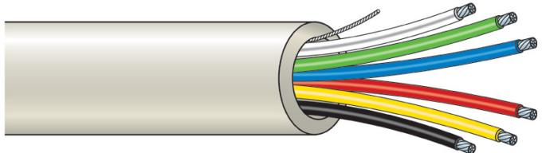

### Produktblad

# WN106W

6 Core Cable

#### Standardprestanda

- EFor internal or external wiring of warning network systems
- EManufactured in accordance with BS4737 Section 3.30
- ESuitable for gluing to surfaces
- EHigh Quality PVC

## WN106W

6 Core Cable

#### Tekniska data

| Core                            |                             |
|---------------------------------|-----------------------------|
| Material                        | Bare copper                 |
| Thickness                       | 0.22 mm²                    |
| Colour                          | Red, yellow, blue, black,   |
|                                 | Green, white                |
|                                 |                             |
| Jacket                          |                             |
| Thickness                       | Min. 0.45 mm² - max 0.7 mm² |
| Colour                          | White                       |
| Electrical characteristics      |                             |
| Max. conductor DC resistance | 92.4 ohm/km at +20°C        |
| Current rating                  | 1 A                         |
| Mutual capacitance              | 90 pF/m                     |

Order data

| Artikelnummer |  |
|---------------|--|
| WN106W        |  |

Beskrivning 6 Core Cable

