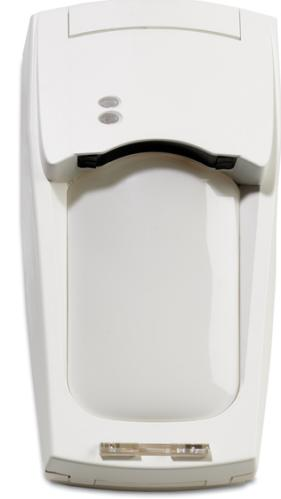
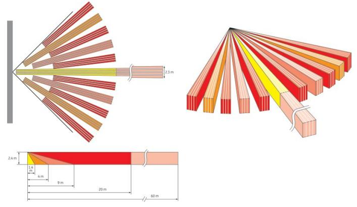

# Produktblad

# VE735AM

20 m volym + 60 m korridor med antimask

# VE735AM

VE735AM är en IR-detektor som använder V²E-teknik "Förstärkt VektorVerifiering" och en flerkanalig antimaskningasvkänning. Tack vare den unika konstruktionen av pyroelementet som finns i detektorn, kommer samtliga värmekällor att generera en flerdimensionell signalbild. Signalbilden avslöjar inte bara närvaron av en värmekälla utan även riktningen av densamma. Detekteringsförmågan är resultatet av upplösningen hos optiken och den flerdimensionella signalen från pyroelementet.

## Spegeloptik

Spegeloptiken i VE735AM är identiskt med VE735. Den glidande fokusspegeln med flera ridåer och funktioner som är unika för att ge maximal täckningstäthet och säkerställa enkel installation. Med "High Density Optic" (HDO) ges fler och bredare ridåer som täcker upp hela bevakningsområdet. Täckningsområdet 20 meter med 86 graders spegeln och 11 ridåer samt en ridå 60 meters räckvidd ger unika möjligheter för att skapa ett effektivt skydd.

## Patenterad flerkanalig antimaskning

Det bästa lösningen för att skydda en rörelsedetektor mot antimaskning är aktiv IR-teknologi. UTC Fire & Security har alltid tillhandahållit marknaden med den bästa tillgängliga tekniken för att uppnå högsta AM-prestanda. VE735AM fortsätter denna trend genom att använda den fjärde generationens AM.

VE735AM använder fem IR-sändare och mottagare som arbetar på olika frekvenser. Detta resulterar i olika AM-signaler för sensorn. AM-kretsen kommer inte att utlösa larm enbart av en av kanalerna utan av förhållandet mellan de olika kanalerna. Flerkanalsteknologin för AM-tekniken gör att VE735AM kan upptäcka eventuella antimaskförsök upp till 30 cm från detektorn.

VE735AM har också skydd mot:

- · Delvis maskningsförsök
- · Insekter
- · Vitljus

## Signalläge

Signalbilden som pyroelementet hos VE735AM skapar innehåller unik information om källan vilket innebär att även rörelseriktningen för värmekällan kan bestämmas. Funktionen gör det möjligt att avgöra hur en inkräktare förflyttar sig inom bevakningsområdet. I signalläge kan VE735AM till exempel avge de larm då en inkräktare rör sig från vänster till höger och likaledes i motsatt riktning.

## Standardprestanda

- EPassiv IR-detektor, 20 m volymdetektor + 60 m korridor
- EAntimaskskyddad
- EPatenterad pyroelement
- EDetektering med DSP algoritmer
- ESpegel med HDO optik
- EJackbar elektronik
- EIdentifierar rörelseriktning
- E3 känslighetsnivåer
- EHändelseminne
- EInställningsverktyg med laserteknik
- ESkydd mot bortbrytning och kapslingssabotage
- EKan monteras på olika höjd
- EOkänslig för ojämna väggar
- EBortbrytningsskydd

# VE735AM

# 20 m volym + 60 m korridor med antimask

# Inställningar

Känsligheten för VE735AM kan väljas i tre olika nivåer; låg, standard och hög. Känsligheten ställs in genom att välja olika lägen för identifieringsalgoritmer. Det från fabrik förvalda standardläget ger optimal detektering för de flesta applikationer. Känslighetsnivåerna ställs in med hjälp av en bygel på detektorns kretskort.

# Tillbehör

Som tillbehör till VE735AM finns ett inställningsverktyg som arbetar med laserteknik. Verktyget är ett utmärkt hjälpmedel, framförallt då det gäller inställning av detektorns bevakningsområde i långa korridorer.

# Tekniska data

| Täckningsområde         | 86° vid 20 m + 3° vid 60 m             |
|-------------------------|----------------------------------------|
| Antal ridåer            | 11 vid 20 m + 1 vid 60 m               |
| Monteringshögd          | Min 1.8 m max 3.0 m                    |
| Matningsspänning        | 9 till 15 VDC (12 V nominell spänning) |
| Max rippel              | 2 V (vid 12 VDC)                       |
| Strömförbrukning normal | 20 mA                                  |
| Strömförbrukning larm   | 24 mA                                  |
| Strömförbrukning max    | 34 mA                                  |
| Detekteringsförmåga     | 20 cm/sek till 3 m/sek                 |
| Larmutgång              | NC 80 mA vid 30 VDC max.               |
| Sabotageutgång          | NC 100 mA vid 30 VDC max.              |
| Felutgång               | NC 80 mA vid 30 VDC max.               |
| Larmtid                 | 3 sek                                  |
| Uppstartningstid        | 50 sek                                 |
| Mått (HxBxD)            | 175 x 93 x 66 mm                       |
| Vikt                    | 275 g                                  |
| Drifttemperatur         | -10 °C till +55 °C                     |
| Relativ fuktighet       | Max 95%                                |
| Kapslingsklass          | IP30                                   |
| Miljöklass              | II                                     |
| Larmklass EN50131-2-2   | Grade 3                                |

#### Order data

| Artikelnummer | Beskrivning                                          |
|---------------|------------------------------------------------------|
| VE735AM       | 20 m volym + 60 m korridor med antimask              |
| VE710         | Riktinstrument med laserstråle till VE730-detektorer |

Reservationer för produktförändringar. För uppdatering av produktdata, gå in på www. utcfssecurityproducts.se eller kontakta din lokala UTC Fire & Security återförsäljare. VE735AM-2017-01-18 10:50:40 Released :02-SEP-11