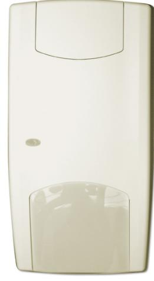
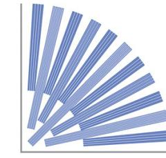
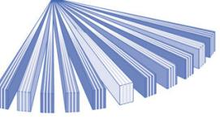
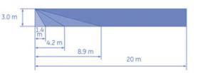

### Produktblad

## VE1120

Vektor PIR-detektor 20 m, 11 ridåer

#### Avancerad spegelteknik

Rörelsedetektorerna i VE1000-serien har avancerad och sofistikerad spegeloptik. Denna unika optiska spegelteknik har ett steg och glidande fokus med hela ridåer vilket resulterar i en sensor som aldrig förlorar objektet ur siktet.

För att förstärka detekteringsområdet, använder detektorerna i VE1000-serien 3Brid rätvinklig ridådesign. 3Brid är en horisontell spegelstruktur som ger vertikala ridåer för att upptäcka infraröd strålning. Denna rätvinkliga uppfinning är nyckeln i att utöka med ridåer till spegeln utan att försämra signalstyrkan, eller öka storleken på detektorn.

#### Patenterad Vektorpyroelement

Infraröda signaler fångas upp av pyroelementet som är placerad i detektorns fokuseringspunkt.

Konventionella pyroelement genererar en endimensionell signal för att påvisa förekomsten av ett objekt och därför bestäms detekteringen uteslutande av optiken i rörelsedetektorn. Tack vare den unika konstruktionen av det patenterade vektor pyroelementet, kommer ett värmeobjekt att generera en flerdimensionell signal (vektor) som gör att pyroelementet kan bestämma inte bara närvaro utan också riktning av ett värmeobjekt. Detta innebär att detekteringsmöjligheten är lika med resultatet av optiken och den flerdimensionella utgången av pyroelementet, vilken i sin tur är en stort framsteg av den PIR-teknologiska kapaciteten.

#### V²E signalprocess

VE-serien av rörelsedetektorer innehåller en patenterad "Vector Verified Enhanced" (V²E) signalbehandling. Varje typ av signalkälla kommer att generera en unik vektorsignal som fångas upp av Vektor-pyroelementet. Den digitala signalbehandlingen kommer att analysera varje vektors form och mönster, som gör det möjligt att skilja ut olika signalkällor. Det innebär att VE-seriens rörelsesensorer inte bara kommer att identifiera icke-termiska signalkällor, utan också filtrera bort eventuella störsignaler som stationära termiska källor, ventilation eller starka ljuskällor och enbart reagera på larmsignaler från inkräktare. PIR-rörelsesensorn med vektormönster-

igenkänning är unik.

#### Installationsvänlig

Passiva IR-detektorer av 1000-serien är de mest kostnadseffektiva detektorerna att installera: 1. Tolererar ojämna monteringsväggar och olika monteringshöjder.

2. Begränsad förlust av täcknings-

området vid blockering när objekt placeras framför detektorn.

#### Standardprestanda

- EVektorPIR-detektor, 20 m, 11 ridåer
- E3-Stegs glidande fokus ridåspegel
- EJackbar elektronik

- EInkapslad spegel
- E"V²E"-signalprocess
- EFull krypskyddsdetektering
- EValbart täckningsområde med hjälp av spegelmasker
- EAutofokus med konstant avståndsbedömning
- EIngen justering krävs för olika monteringshöjder
- ETolererar ojämna monteringsväggar
- ESBSC larmklass 3

# VE1120

Vektor PIR-detektor 20 m, 11 ridåer

3. Ingen avståndsinställningen krävs tack vare självjusterande avståndsbedömning.

4. Jackbar elektronik.

#### Tekniska data

| Täckningsområde                             | 20 m                                    |
|---------------------------------------------|-----------------------------------------|
| Krypskydd                                   | Ja                                      |
| Känslighet                                  | Normal / Hög                            |
| Ridåer/synfält                              | 11 ridåer / 86°                         |
| Val av synfält                              | Spegel och ridåmasker                   |
| Monteringhöjd                               | 1,8 till 3,0 m                          |
| Strömförsörjning                            | 9 till 15 VDC                           |
| Strömförbrukning (nom.)                     | 6,5 mA                                  |
| Larm reläutgång (potentialfri) NC (i drift) |                                         |
| Sabotage reläutgång (potentialfri)       | NC (locket stängt)                      |
| Bortbrytningsskydd                          | Tillval                                 |
| Fjärrstyrningsingångar                      | Gångtest                                |
| PIR signalprocess                           | V²E                                     |
| Mått (H x B x D)                            | 125 x 65 x 60 mm                        |
| Temperatur                                  | -10 till +55 °C; 95 % relativ fuktighet |
| Miljöklass                                  | II                                      |
| EN50131-2-2                                 | Grade 2                                 |
| SBSC intyg                                  | Larmklass 3                             |

#### Order data

| Artikelnummer | Beskrivning                                                               |
|---------------|---------------------------------------------------------------------------|
| VE1120        | Vektor PIR-detektor 20 m, 11 ridåer                                       |
| SB01          | Fäste för tak-/väggmontering (riktbar +/- 45° horisontellt, 0 eller 5° |

