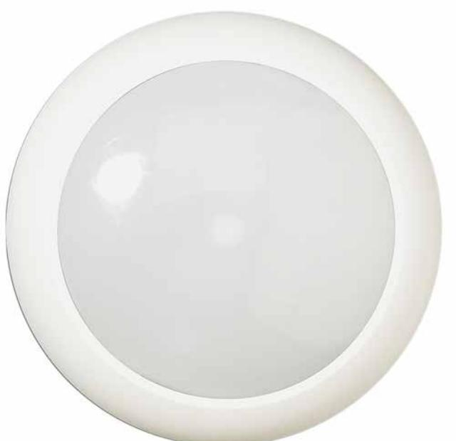

# EV669 **IR-detektor för takmontage 360º, 18 ridåer. Täckningsområde 20 m i diameter. Spänningsmatning 7-15 VDC, strömförbrukning 6 mA**

# **18 complete curtains of detection**

The EV 669/666's 18 curtains offer maximum detection capability throughout the protected area including full undercrawl detection. Note that with the Aritech curtains, wherever an intruder intercepts a curtain, he is 100% seen by the detector and exactly fits the curtain width, thus collecting maximum infrared energy. Only with Aritech's Gliding Focus Mirror optics can the definition of the parallel curtains be achieved over the entire detection range.

The special characteristics of a "curtain" provide not only better detection but also increased stability and rejection of false alarms from temperature changes on floors and carpets.

### **4D signal processing**

By expanding on the environmental filtering and extending the detection algorithms, 4D signal processing improves on the capability to determine between valid intruders and false alarm signals. Always recognising the diverse applications that have to be protected, the EV 669/666 features both "4D" processing or Bi-curtain processing for the harsher environments. Designed specifically for use with the Gliding Focus Optics, the combination of mirror optics and microprocessor echnology provides you with complete peace of mind.

#### **2 x Pyros, 2 x microprocessors, 2 x Mirrors**

In order to ensure the highest performance, the EV 669/666 incorporates 2 x pyros, 2 x microprocessors, 2 x mirrors and 2 x the decision power providing the installer/user with 2 x the performance. The use of 2 separate pyros, mirrors and microprocessors ensure that the detectors have an excellent signal to noise ratio. This means that you have better detection capability when you want it and better false alarm immunity when you need it.

#### **Detection coverage flexibility**

The EV 669/666 provides considerable flexibility by the simple electronic field programming of either 180 or 360 coverage patterns. Further customisation, to allow for false alarm hazards such as heaters, machinery, etc., can be achieved through individual curtain masking enabling the installer to configure the detector to suit the application.

# **Details**

- Passive Infra Red motion sensor
- "Step & Gliding Focus Multi Cutain" mirror optic
- Plug-in electronics
- Sealed optics
- Microprocessor with "4D" processing
- On-site individual coverage pattern selection
- Additional bi-curtain processing for harsh environment
- No adjustment required for different mounting heights
- Several European security approvals

# EV669 **IR-detektor för takmontage 360º, 18 ridåer. Täckningsområde 20 m i diameter. Spänningsmatning 7-15 VDC, strömförbrukning 6 mA**

# **Technical specifications**

| Allmänt                       |                                     |
|-------------------------------|-------------------------------------|
| Technology                    | PIR                                 |
| Application type              | Ceiling Mount                       |
| Anti masking                  | No                                  |
| Pet immune                    | No                                  |
| Camera                        | No                                  |
| Pry-off tamper kit            | ST400 (optional)                    |
| Detektering                   |                                     |
| Max. detection range          | 20 m                                |
| Detection range selection  | 10 m to 20 m                        |
| Coverage (field of view) 360° |                                     |
| Undercrawl protection         | No                                  |
| No. of curtains               | 18                                  |
| Alarm memory                  | Yes                                 |
| Trådbunden/trådlös            |                                     |
| Wired-wireless                | Wired                               |
| Ingångar/utgångar             |                                     |
| Alarm relay                   | NC when energised (voltage free)    |
| characteristic                |                                     |
| Tamper relay                  | NC when cover closed (voltage free) |
| characteristic                |                                     |
| Remote control lines          | Day/Night, Walk test                |
| Spänning                      |                                     |
| Operating voltage             | 7 to 15 VDC (12 VDC nominal)        |
| Power supply type             | 12 VDC                              |
| Current consumption           | 9 mA (15 mA max.) (nom.)            |
| Mått                          |                                     |
| Physical dimensions           | 138 x 68 mm (Ø x D)                 |
| Colour                        | White                               |
| Mounting height               | 2.5 to 5 m                          |
| Miljö                         |                                     |
| Operating temperature         | -10 to +55°C                        |
| Relative humidity             | 95 %                                |
| Environment                   | Indoor                              |
| Standarder & föreskrifter     |                                     |
| EN50131 grade                 | Grade 2                             |

As a company of innovation, UTC Fire & Security reserves the right to change product specifications without notice. For the latest product specifications, visit UTC Fire & Security online or contact your sales representative.

Powered by TCPDF (www.tcpdf.org)